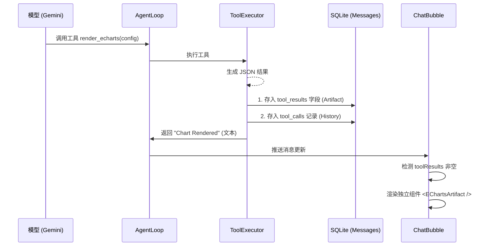

# 工件渲染架构 (v2)

> **最后更新:** 2026-01-29
> **状态:** 生产环境 (Production)
> **背景:** 将重型渲染逻辑从气泡中分离，以提升性能与持久化能力。

## 核心问题 (The Problem)

在早期版本中，图表（ECharts）和流程图（Mermaid）是通过简单的 Markdown 字符串拼接在消息正文中的。这种方式存在以下缺陷：
1.  **渲染耦合**：Markdown 解析器（如 `react-native-markdown-display`）需要处理复杂的 HTML/JS 注入，极其不稳定。
2.  **正文截断**：复杂的 JSON 配置会占用大量 Token，且容易在流式传输中断裂，导致 JSON 解析失败。
3.  **持久化丢失**：依赖正则表达式在运行时从 `content` 中提取配置。如果 App 重启，Markdown 解析逻辑可能因为正文加载不全而失效。

## 架构重构 (Architecture Overhaul)

v2 架构引入了 **"Artifacts" (神器/工件)** 概念，将一切非纯文本的结构化输出（图表、代码执行结果、SVG）从 `content` 中剥离，作为独立的元数据存储。

### 1. 数据流 (Data Flow)



### 2. 数据库变更 (Schema Changes)

在 `messages` 表中新增了 `tool_results` 字段 (TEXT/JSON)，存储结构如下：

```typescript
type ToolResultArtifact = {
  type: 'echarts' | 'mermaid' | 'process_graph' | 'image';
  content: string; // JSON Config or Mermaid Code or Image URL
  name: string;    // Tool Name (e.g., 'render_echarts')
  interaction?: any; // Optional interactive state
}
```

### 3. 关键组件 (Key Components)

-   **`ToolExecutor.ts`**: 拦截渲染类工具的执行结果，**不**将其直接拼接到 `content` 末尾，而是注入到 `toolResults` 数组中。
-   **`SessionRepository.ts`**: 负责 `toolResults` 的 JSON 序列化与反序列化，确保跨重启持久化。
-   **`ToolArtifacts.tsx`**: 独立的 UI 容器，根据 `type` 动态加载渲染器（EChartsView / MermaidView）。

## 最佳实践 (Best Practices)

1.  **禁止拼接**：严禁在 `ToolExecutor` 中将图表配置手动 `+=` 到 `msg.content`。
2.  **强制 Flush**：在 `AgentLoop` 结束流式传输时，必须检查 `contentBuffer`，防止最后一段正文被丢弃（已修复 Bug）。
3.  **Hooks 安全**：在 `ChatInput` 等组件中，Hook 调用（`useMemo`, `useStore`）必须位于所有条件返回（`if (!session) return`）之前。

---

## Markdown 预处理器 (v1.2.28+)

> **文件**: `src/lib/markdown/markdown-utils.ts`
> **调用位置**: `ChatBubble.tsx` → `useMemo` 内

### 职责
在 `react-native-markdown-display` 解析之前，对原始文本进行结构化修复：
1. LaTeX 分隔符转换
2. 代码块保护 (避免 `#` 注释被误认为标题)
3. 7 条幂等正则修复结构缺陷 (标题/列表/分隔符)

### 设计约束
- **幂等**: 对 Gemini 等规范输出运行后结果完全不变
- **通行**: 不包含任何厂商判断逻辑
- **保守**: 仅修复明确缺陷，不处理歧义场景

### 关键陷阱
- `\s` 会匹配 `\n`，在列表标记检测中必须用字面空格 ` `
- `([^\n])` 会匹配 `#` 和 `*`，需显式排除以防拆碎标题和分隔符

### 参考文档
- 详细排障手册: `.agent/docs/archive/markdown-preprocessing-guide.md`
