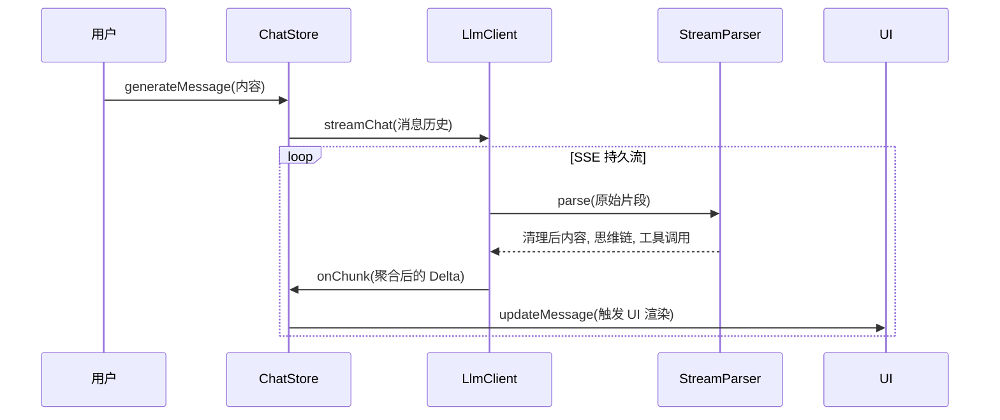
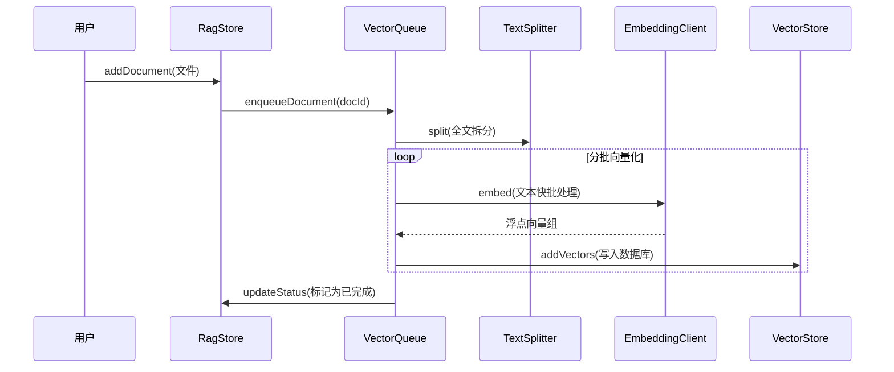
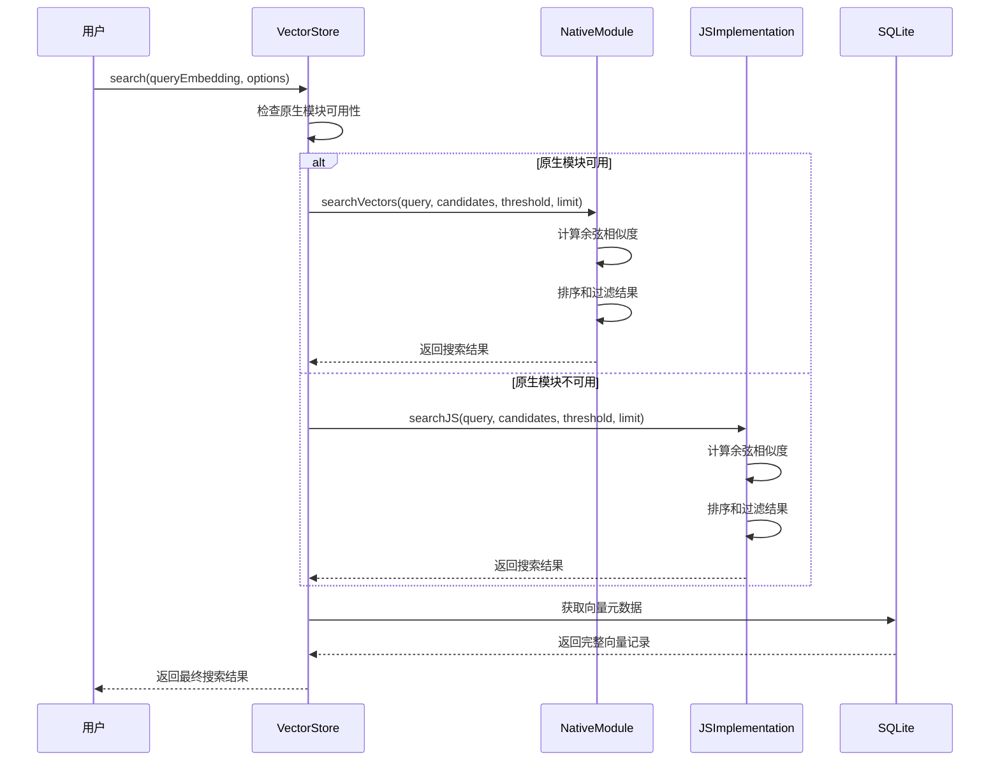

# 项目结构与组件架构 (Project Structure & Component Architecture)

> **上次更新**: 2026-02-14
> **版本**: v5.2
> **用途**: 供 AI 快速索引项目结构、核心组件与业务逻辑分布。
> **核心地图 (The 4 Maps)**:
> 1.  [**`CODE_STRUCTURE.md`**](file:///home/lengz/Nexara/.agent/docs/architecture/CODE_STRUCTURE.md) (全局架构与核心机制)
> 2.  [**`DATA_SCHEMA.md`**](file:///home/lengz/Nexara/.agent/docs/DATA_SCHEMA.md) (数据状态、类型与数据库)
> 3.  [**`CORE_INTERFACES.md`**](file:///home/lengz/Nexara/.agent/docs/CORE_INTERFACES.md) (服务接口与 LLM 契约)
> 4.  [**`UI_KIT.md`**](file:///home/lengz/Nexara/.agent/docs/UI_KIT.md) (组件库与设计规范)

---

## 1. 核心目录全景 (Directory Overview)

```
/home/lengz/Nexara/
├── app/                  # Expo Router 页面路由 (基于文件系统)
│   ├── (tabs)/           # 一级 Tab 页面 (Chat, RAG, Settings)
│   ├── chat/             # 聊天详情与 Agent 配置页
│   ├── settings/         # 二级设置页 (主题、RAG 配置、Token 使用)
│   ├── rag/              # 知识库文件夹详情页
│   └── visual-demo.tsx   # 视觉组件演示页 (Playground)
├── plugins/              # Expo Config Plugins (签名注入、宽色域配置等)
├── scripts/              # 构建与版本维护脚本
├── src/
│   ├── components/       # 业务组件库
│   │   ├── ui/           # 基础原子组件 (标准 UI 系统)
│   │   ├── chat/         # 聊天模块业务组件
│   │   ├── rag/          # RAG 模块业务组件 (面包屑, 图谱视图)
│   │   └── icons/        # 品牌与模型图标渲染器
│   ├── features/         # 复杂业务逻辑与专属面板
│   │   ├── chat/         # 消息气泡、Token 统计、推理面板
│   │   └── settings/     # 备份恢复、多供应商管理、RAG 设置面板
│   ├── lib/              # 核心基础设施 🔥
│   │   ├── llm/          # LLM 抽象层架构
│   │   ├── rag/          # RAG 引擎 (向量化、知识图谱)
│   │   ├── db/           # SQLite 数据库
│   │   ├── i18n/         # 国际化支持
│   │   └── skills/       # 工具/技能系统
│   ├── native/           # 原生模块 (跨平台优化) 🔥
│   │   └── VectorSearch/ # 向量搜索原生实现 (Android Java, iOS 待实现)
│   ├── store/            # Zustand 状态管理 (持久化与安全加密)
│   └── theme/            # 动态主题系统 (ThemeProvider)
└── .agent/               # 项目记忆、工作流与架构指南 🔥
    ├── docs/             # 详细架构文档
    ├── memory/           # 跨会话 handover 存储
    └── PROJECT_RULES.md  # 项目准则 (Code Review 依据)
```

## 2. 核心机制 (Core Mechanics)

### 2.1 LLM 流式输出流程 (LLM Streaming Flow)


### 2.2 RAG 文档导入流程 (RAG Ingestion Flow)


### 2.3 向量搜索流程 (Vector Search Flow)


### 2.4 RAG 触发源映射 (Trigger Components)

| 动作 | 触发源 (Component/Store) | 处理逻辑位置 | 备注 |
| :--- | :--- | :--- | :--- |
| **文档导入** | `DocumentPicker` / `rag-store.ts` | `vectorization-queue.ts` (Type: `document`) | 支持断点续传 |
| **发送消息** | `ChatEngine.ts` | `memory-manager.ts` -> `vectorization-queue.ts` | 消息发送后立即入队 |
| **KG 提取** | `vectorization-queue.ts` | `graph-extractor.ts` | 基于 `kgStrategy` |
| **清理向量** | `GlobalRagConfigPanel.tsx` | `vector-store.ts` | 级联删除 |
| **预设切换** | `ConfigPanel` | `settings-store.ts` | **SSOT**: `src/lib/rag/constants.ts` |
| **向量搜索** | `ChatEngine.ts` / `RagStore.ts` | `vector-store.ts` -> 原生模块/JS 实现 | 支持自动降级 |

## 3. 架构准则

- **单一事实来源 (SSOT)**: 核心逻辑必须在 `lib/`，状态在 `store/`，UI 仅负责展现。
- **文档即代码 (Doc as Code)**: 任何代码变更需联动更新“四大地图”。
- **环境隔离**: 编译任务隔离在 `worktrees/release`，严禁在根目录执行发行构建。

---
**维护人**: 中国首席软件架构师 (Antigravity Assistant)
