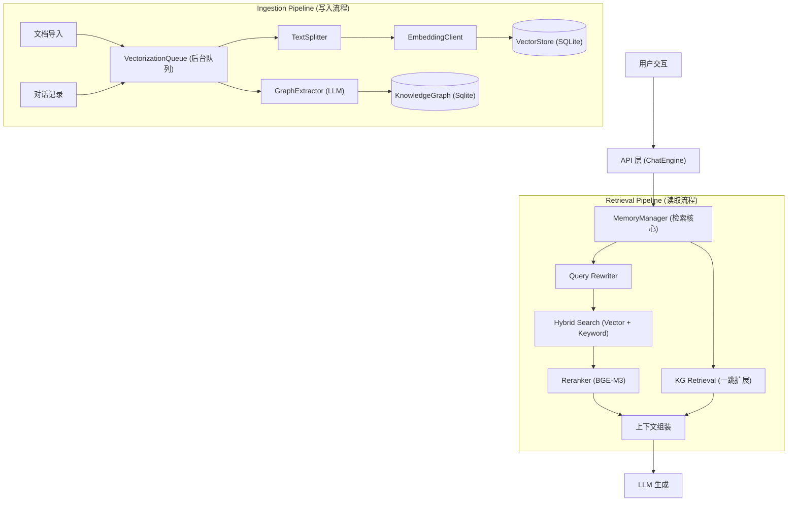
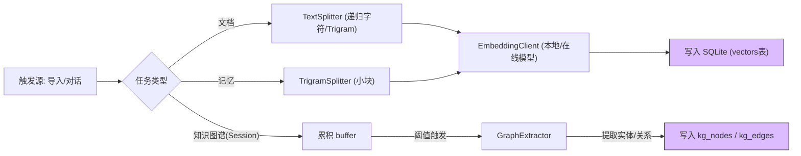
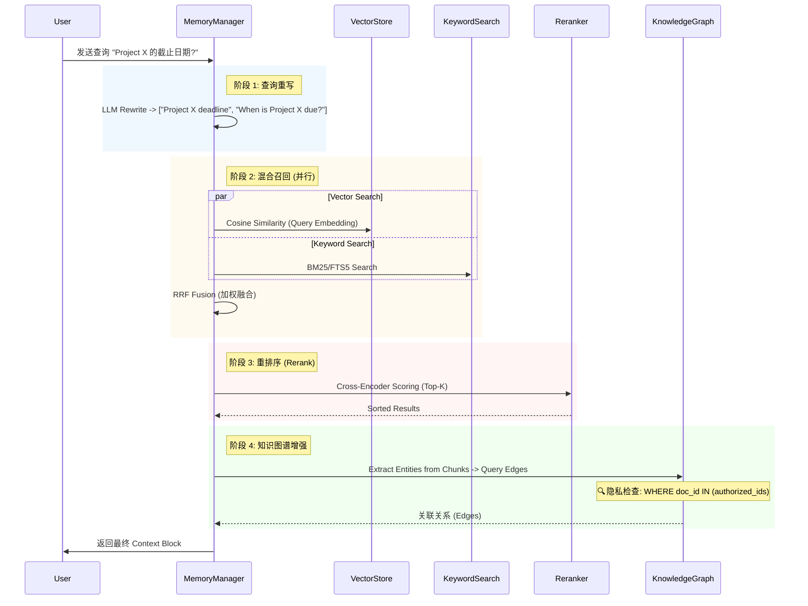

# Nexara RAG 系统架构文档

## 1. 核心架构概览 (Architecture Overview)

Nexara 的 RAG 系统采用 **混合检索 (Hybrid Retrieval)** + **双层记忆 (Dual-Layer Memory)** + **本地优先 (Local-First)** 的架构设计。核心组件包括向量数据库 (SQLite + Vector Ext)、知识图谱 (Knowledge Graph)、会话管理器和后台向量化队列。

## 2. 关键流程详解

### 2.1. 数据摄入与向量化 (Ingestion Flow)

所有耗时的各种处理（文档解析、分块、向量化、图谱提取）均通过 `VectorizationQueue` 异步执行，确保主线程 UI 不阻塞。

### 2.2. 混合检索与上下文构建 (Retrieval Flow)

检索过程实现了 "Recall -> Filter -> Rerank" 的经典漏斗模式，并结合了知识图谱的"读时增强"。

## 3. 触发源映射 (Trigger Components)

| 动作 | 触发源 (Component/Store) | 处理逻辑位置 | 备注 |
| :--- | :--- | :--- | :--- |
| **文档导入** | `DocumentPicker` / `rag-store.ts` | `vectorization-queue.ts` (Type: `document`) | 支持断点续传 |
| **发送消息** | `ChatEngine.ts` | `memory-manager.ts` -> `vectorization-queue.ts` | 消息发送后立即入队 |
| **KG 提取** | `vectorization-queue.ts` | `graph-extractor.ts` | 基于 `kgStrategy` (Full/Summary/OnDemand) |
| **清理向量** | `GlobalRagConfigPanel.tsx` | `vector-store.ts` | 级联删除，支持事务 |
| **预设切换** | `ConfigPanel` (Agent/Global) | `settings-store.ts` | **SSOT**: 使用 `src/lib/rag/constants.ts` |

## 4. 安全与隐私架构

### 4.1. 文档隔离 (Isolation)
*   **Vector Search**: 强制应用 `WHERE doc_id IN (...)` 过滤。全局（Global）文档对所有会话可见，私有（Session）文档仅对所属会话可见。
*   **Knowledge Graph**: (修复后) 边查询强制检查 `doc_id` 归属，防止通过图谱关系泄露私有文档信息。

### 4.2. 原生桥接保护 (Native Bridge Safety)
*   UI 组件调用原生能力（Haptics, Navigation）时，遵循 **10ms 延迟原则**，防止 JS 线程死锁或 UI 冻结。

---
*文档版本: v1.0 | 上次更新: 2026-01-20*
