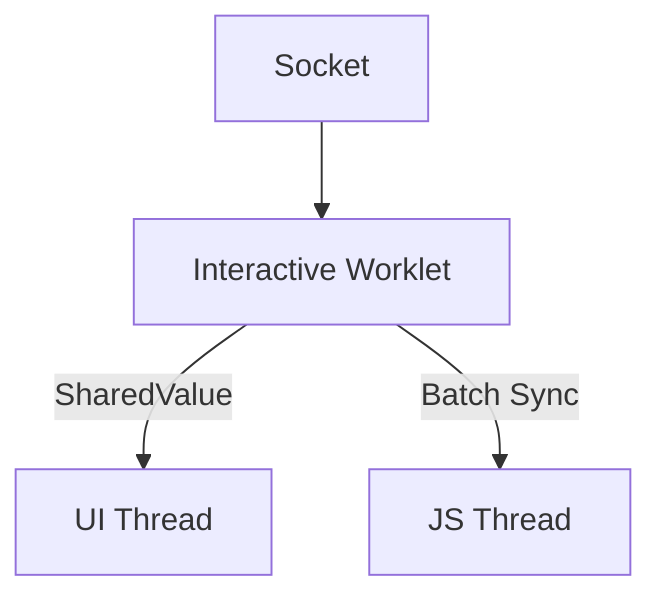

# Nexara 高性能并发架构蓝图 (v3.0)
**版本**: 3.0 (Zero-Lock UI / Bypass Main Thread)  
**状态**: ❌ 已废弃 (Deprecated - 2026-01-31)  
**废弃原因**: 技术验证失败，详见归档文档

---

> ⚠️ **废弃声明**
> 
> 经过深入技术验证，发现 `react-native-worklets-core` 与 `react-native-reanimated` 
> 使用独立的 SharedValue 上下文，无法实现真正的 UI 旁路更新。
> 
> 同时评估认为，本项目在单线程架构下完全够用：
> - 远程 LLM 调用：网络 I/O 异步，解析负载极低
> - 本地模型：llama.rn 在原生线程执行，不占用 JS 线程
> 
> **归档文档**: `.agent/docs/archive/2026-01-31_multithread_exploration.md`

---

## 原设计目标
实现 **"打字机绝对流畅"**——即便主线程被 React Render 占满，流式输出也能以 60/120fps 丝滑更新。

## 原核心架构

## 废弃原因
1. worklets-core 与 reanimated 的 SharedValue 不互通
2. 从 worklets-core 后台线程修改的 SharedValue 对 Reanimated 不可见
3. Bridged Mode (runOnJS) 仍需经过 JS 线程，无法实现真正旁路
