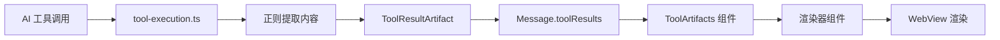
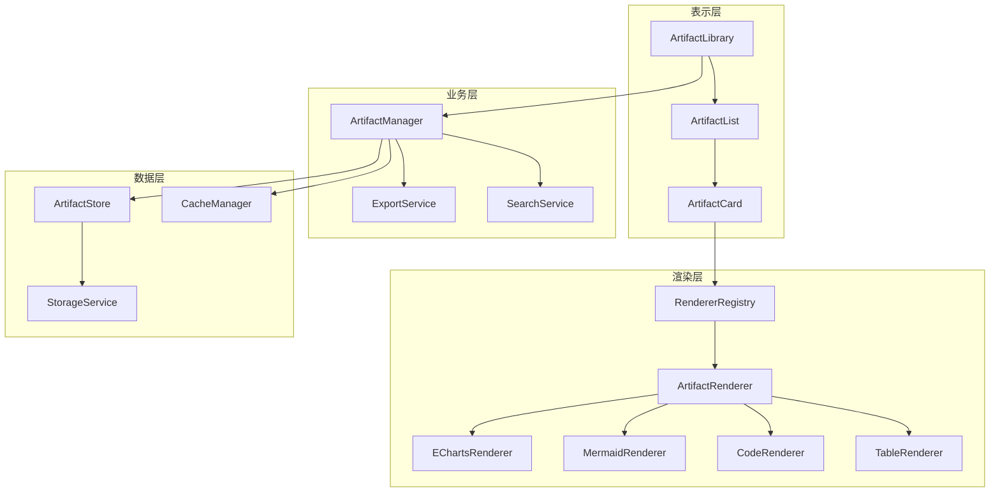
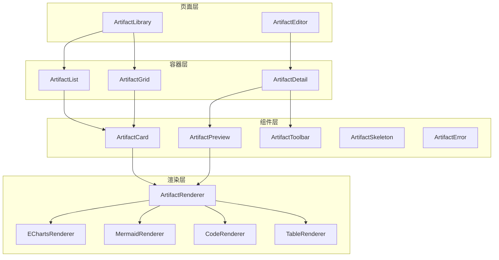

# Artifacts 模块专项提升及优化方案

| 版本 | 日期 | 作者 | 状态 |
|------|------|------|------|
| 1.0.0 | 2026-04-08 | Architect Mode | 完成 |

---

## 目录

1. [现状深度分析](#1-现状深度分析)
2. [目标架构设计](#2-目标架构设计)
3. [分阶段实施计划](#3-分阶段实施计划)
4. [详细技术实现方案](#4-详细技术实现方案)
5. [资源与风险评估](#5-资源与风险评估)
6. [附录](#6-附录)

---

## 1. 现状深度分析

### 1.1 当前架构分析

#### 1.1.1 组件结构

```
ToolArtifacts (容器组件)
├── EChartsRenderer (图表渲染器)
└── MermaidRenderer (图表渲染器)
```

**关键文件**：
- `src/features/chat/components/ToolArtifacts.tsx` - 主容器组件
- `src/components/chat/EChartsRenderer.tsx` - ECharts 渲染器
- `src/components/chat/MermaidRenderer.tsx` - Mermaid 渲染器
- `src/types/chat.ts` - 类型定义

#### 1.1.2 数据流



**当前数据流特点**：
1. Artifact 数据存储在消息的 `toolResults` 字段中
2. 通过 `src/store/chat/tool-execution.ts` 处理工具调用结果
3. 使用正则表达式提取内容
4. 无全局状态管理，数据分散在各个消息中

#### 1.1.3 渲染机制

**渲染方式**：
- 使用 WebView 渲染图表
- 本地资源预加载（通过 `resolveLocalLibUri`）
- 支持全屏模式和横屏旋转

**渲染流程**：
```typescript
// 1. 预加载本地库
useEffect(() => {
  resolveLocalLibUri('echarts').then(uri => setLocalEchartsUri(uri));
}, []);

// 2. 生成 HTML
const generateHtml = (isFull = false) => `<!DOCTYPE html>...</html>`;

// 3. WebView 渲染
<WebView
  source={{ html: generateHtml() }}
  onMessage={handleMessage}
  onLoadEnd={() => setLoading(false)}
/>
```

### 1.2 技术债务清单

| 编号 | 类别 | 问题描述 | 影响范围 | 优先级 |
|------|------|----------|----------|--------|
| A-S1 | 用户体验 | 错误状态无重试机制，渲染失败后无法恢复 | 用户体验严重受损 | P0 |
| A-S2 | 用户体验 | 无导出/分享功能，生成内容无法保存 | 功能实用性受限 | P0 |
| A-A1 | 架构 | 无全局 Artifact 索引/搜索 | 无法跨会话查找和复用 | P1 |
| A-A2 | 架构 | 渲染器与业务逻辑耦合 | 扩展性差，难以添加新类型 | P1 |
| A-A3 | 功能 | 缺少图表工具箱和上下文菜单 | 交互能力受限 | P1 |
| A-A4 | 功能 | 无障碍支持缺失 | 可访问性差 | P1 |
| A-A5 | 代码 | 正则解析脆弱，缺乏健壮性 | 解析失败率高 | P1 |
| A-A6 | 代码 | 无单元测试，质量无法保障 | 回归风险高 | P1 |
| A-C1 | 代码 | 重复代码，未提取公共逻辑 | 维护成本高 | P2 |
| A-C2 | 视觉 | 内联 HTML 模板，难以维护 | 样式修改困难 | P2 |
| A-C3 | 视觉 | 硬编码颜色值，不支持主题切换 | 主题一致性差 | P2 |
| A-C4 | 架构 | Artifact 类型系统过于简单 | 扩展性受限 | P2 |

### 1.3 与行业标杆差距分析

#### 1.3.1 功能对比

| 维度 | Claude Artifacts | ChatGPT Canvas | Nexara Artifacts | 差距 |
|------|-----------------|----------------|-----------------|------|
| 支持类型 | React、SVG、HTML、文档等 | 文档、代码、项目 | echarts、mermaid | 高 |
| 交互方式 | 实时交互式预览 | 编辑和修订 | 静态预览 | 高 |
| 内容编辑 | 支持 | 支持 | 不支持 | 高 |
| 分享功能 | 支持 | 支持 | 不支持 | 高 |
| 版本控制 | 支持 | 支持 | 不支持 | 高 |
| 全局索引 | 支持（Catalog） | 支持 | 不支持 | 高 |
| 搜索功能 | 支持 | 支持 | 不支持 | 高 |

#### 1.3.2 架构对比

| 维度 | Claude Artifacts | Nexara Artifacts | 差距 |
|------|-----------------|-----------------|------|
| 渲染器管理 | 注册表模式 | 直接实例化 | 高 |
| 类型系统 | 可扩展类型系统 | 简单枚举 | 高 |
| 状态管理 | 全局 Store | 分散在消息中 | 高 |
| 缓存策略 | 智能缓存 | 无缓存 | 高 |
| 错误处理 | 责任链模式 | 简单错误显示 | 高 |

#### 1.3.3 用户体验对比

| 维度 | Claude Artifacts | Nexara Artifacts | 差距 |
|------|-----------------|-----------------|------|
| 骨架屏 | 支持 | 不支持 | 中 |
| 错误重试 | 自动重试 | 无重试 | 高 |
| 无障碍支持 | 完善 | 缺失 | 高 |
| 导出功能 | 多格式导出 | 不支持 | 高 |
| 工具栏 | 支持 | 不支持 | 高 |

---

## 2. 目标架构设计

### 2.1 整体架构



### 2.2 渲染器注册表模式

#### 2.2.1 设计目标

- 统一的渲染器接口
- 动态注册新渲染器
- 解耦渲染逻辑和业务逻辑
- 支持第三方扩展

#### 2.2.2 接口定义

```typescript
// src/components/artifacts/renderer/ArtifactRenderer.ts

export interface RenderOptions {
  width?: number;
  height?: number;
  theme?: 'light' | 'dark';
  interactive?: boolean;
  fullscreen?: boolean;
}

export interface ExportFormat {
  format: 'png' | 'svg' | 'json' | 'pdf' | 'markdown';
  quality?: number;
}

export interface ArtifactRenderer<T = any> {
  readonly type: string;
  readonly displayName: string;
  readonly iconName: string;
  readonly supportedFormats: ExportFormat['format'][];

  // 解析内容
  parse(content: string): Promise<T>;

  // 验证数据
  validate(data: T): boolean;

  // 渲染内容
  render(data: T, options: RenderOptions): React.ReactElement;

  // 导出内容
  export?(data: T, format: ExportFormat): Promise<Blob | string>;

  // 获取预览
  getPreview?(data: T): string;
}

export interface RendererConfig {
  renderer: ArtifactRenderer;
  priority?: number;
  enabled?: boolean;
}
```

#### 2.2.3 注册表实现

```typescript
// src/components/artifacts/renderer/RendererRegistry.ts

export class RendererRegistry {
  private static instance: RendererRegistry;
  private renderers: Map<string, RendererConfig> = new Map();
  private renderersByPriority: RendererConfig[] = [];

  private constructor() {}

  static getInstance(): RendererRegistry {
    if (!RendererRegistry.instance) {
      RendererRegistry.instance = new RendererRegistry();
    }
    return RendererRegistry.instance;
  }

  register(config: RendererConfig): void {
    const { renderer, priority = 0, enabled = true } = config;

    this.renderers.set(renderer.type, { renderer, priority, enabled });
    this.updatePriorityList();
  }

  unregister(type: string): void {
    this.renderers.delete(type);
    this.updatePriorityList();
  }

  get(type: string): ArtifactRenderer | undefined {
    const config = this.renderers.get(type);
    return config?.enabled ? config.renderer : undefined;
  }

  getAll(): ArtifactRenderer[] {
    return this.renderersByPriority
      .filter(config => config.enabled)
      .map(config => config.renderer);
  }

  getSupportedTypes(): string[] {
    return this.renderersByPriority
      .filter(config => config.enabled)
      .map(config => config.renderer.type);
  }

  private updatePriorityList(): void {
    this.renderersByPriority = Array.from(this.renderers.values())
      .sort((a, b) => (b.priority || 0) - (a.priority || 0));
  }
}

export const rendererRegistry = RendererRegistry.getInstance();
```

#### 2.2.4 渲染器工厂

```typescript
// src/components/artifacts/renderer/RendererFactory.ts

export class RendererFactory {
  static async createArtifact(
    type: string,
    content: string
  ): Promise<Artifact | null> {
    const renderer = rendererRegistry.get(type);
    if (!renderer) {
      console.warn(`[RendererFactory] No renderer found for type: ${type}`);
      return null;
    }

    try {
      const data = await renderer.parse(content);
      if (!renderer.validate(data)) {
        throw new Error('Validation failed');
      }

      return {
        id: generateId(),
        type,
        data,
        renderer,
        createdAt: Date.now(),
        updatedAt: Date.now(),
      };
    } catch (error) {
      console.error(`[RendererFactory] Failed to create artifact:`, error);
      return null;
    }
  }

  static renderArtifact(
    artifact: Artifact,
    options: RenderOptions = {}
  ): React.ReactElement {
    return artifact.renderer.render(artifact.data, options);
  }
}
```

### 2.3 类型系统重构

#### 2.3.1 扩展类型定义

```typescript
// src/types/artifacts.ts

export enum ArtifactType {
  ECHARTS = 'echarts',
  MERMAID = 'mermaid',
  CODE = 'code',
  TABLE = 'table',
  MARKDOWN = 'markdown',
  HTML = 'html',
  SVG = 'svg',
  REACT = 'react',
  SANDBOX = 'sandbox',
}

export interface ArtifactMetadata {
  title?: string;
  description?: string;
  tags?: string[];
  author?: string;
  version?: string;
}

export interface Artifact {
  id: string;
  type: ArtifactType;
  data: any;
  renderer: ArtifactRenderer;
  metadata: ArtifactMetadata;
  sessionId?: string;
  messageId?: string;
  createdAt: number;
  updatedAt: number;
  version: number;
}

export interface ArtifactFilter {
  type?: ArtifactType;
  sessionId?: string;
  tags?: string[];
  searchQuery?: string;
  dateRange?: {
    start: number;
    end: number;
  };
}

export interface ArtifactSearchResult {
  artifact: Artifact;
  score: number;
  highlights: string[];
}
```

#### 2.3.2 Zod 运行时校验

```typescript
// src/types/artifacts-schema.ts

import { z } from 'zod';

export const ArtifactMetadataSchema = z.object({
  title: z.string().optional(),
  description: z.string().optional(),
  tags: z.array(z.string()).optional(),
  author: z.string().optional(),
  version: z.string().optional(),
});

export const ArtifactSchema = z.object({
  id: z.string().uuid(),
  type: z.nativeEnum(ArtifactType),
  data: z.any(),
  metadata: ArtifactMetadataSchema,
  sessionId: z.string().optional(),
  messageId: z.string().optional(),
  createdAt: z.number(),
  updatedAt: z.number(),
  version: z.number(),
});

export const EChartsOptionSchema = z.object({
  title: z.object({
    text: z.string().optional(),
  }).optional(),
  series: z.array(z.object({
    type: z.string(),
  })).optional(),
}).passthrough();

export const MermaidCodeSchema = z.string().min(1);
```

### 2.4 状态管理方案

#### 2.4.1 Artifact Store

```typescript
// src/store/artifacts/artifact-store.ts

import { create } from 'zustand';
import { persist, createJSONStorage } from 'zustand/middleware';
import AsyncStorage from '@react-native-async-storage/async-storage';
import { Artifact, ArtifactFilter, ArtifactSearchResult } from '../../types/artifacts';

interface ArtifactStore {
  // 状态
  artifacts: Map<string, Artifact>;
  sessionIndex: Map<string, Set<string>>;
  typeIndex: Map<ArtifactType, Set<string>>;
  tagIndex: Map<string, Set<string>>;

  // 操作
  addArtifact: (artifact: Artifact) => void;
  updateArtifact: (id: string, updates: Partial<Artifact>) => void;
  deleteArtifact: (id: string) => void;
  getArtifact: (id: string) => Artifact | undefined;
  getSessionArtifacts: (sessionId: string) => Artifact[];
  getTypeArtifacts: (type: ArtifactType) => Artifact[];
  searchArtifacts: (query: string) => ArtifactSearchResult[];
  filterArtifacts: (filter: ArtifactFilter) => Artifact[];
  clearAll: () => void;

  // 批量操作
  addArtifacts: (artifacts: Artifact[]) => void;
  deleteSessionArtifacts: (sessionId: string) => void;
}

export const useArtifactStore = create<ArtifactStore>()(
  persist(
    (set, get) => ({
      artifacts: new Map(),
      sessionIndex: new Map(),
      typeIndex: new Map(),
      tagIndex: new Map(),

      addArtifact: (artifact) => {
        set((state) => {
          const newArtifacts = new Map(state.artifacts);
          newArtifacts.set(artifact.id, artifact);

          // 更新会话索引
          const newSessionIndex = new Map(state.sessionIndex);
          if (artifact.sessionId) {
            const sessionArtifacts = newSessionIndex.get(artifact.sessionId) || new Set();
            sessionArtifacts.add(artifact.id);
            newSessionIndex.set(artifact.sessionId, sessionArtifacts);
          }

          // 更新类型索引
          const newTypeIndex = new Map(state.typeIndex);
          const typeArtifacts = newTypeIndex.get(artifact.type) || new Set();
          typeArtifacts.add(artifact.id);
          newTypeIndex.set(artifact.type, typeArtifacts);

          // 更新标签索引
          const newTagIndex = new Map(state.tagIndex);
          if (artifact.metadata.tags) {
            artifact.metadata.tags.forEach((tag) => {
              const tagArtifacts = newTagIndex.get(tag) || new Set();
              tagArtifacts.add(artifact.id);
              newTagIndex.set(tag, tagArtifacts);
            });
          }

          return {
            artifacts: newArtifacts,
            sessionIndex: newSessionIndex,
            typeIndex: newTypeIndex,
            tagIndex: newTagIndex,
          };
        });
      },

      updateArtifact: (id, updates) => {
        set((state) => {
          const artifact = state.artifacts.get(id);
          if (!artifact) return state;

          const newArtifacts = new Map(state.artifacts);
          newArtifacts.set(id, {
            ...artifact,
            ...updates,
            updatedAt: Date.now(),
            version: artifact.version + 1,
          });

          return { artifacts: newArtifacts };
        });
      },

      deleteArtifact: (id) => {
        set((state) => {
          const artifact = state.artifacts.get(id);
          if (!artifact) return state;

          const newArtifacts = new Map(state.artifacts);
          newArtifacts.delete(id);

          // 更新索引
          const newSessionIndex = new Map(state.sessionIndex);
          if (artifact.sessionId) {
            const sessionArtifacts = newSessionIndex.get(artifact.sessionId);
            if (sessionArtifacts) {
              sessionArtifacts.delete(id);
              if (sessionArtifacts.size === 0) {
                newSessionIndex.delete(artifact.sessionId);
              }
            }
          }

          const newTypeIndex = new Map(state.typeIndex);
          const typeArtifacts = newTypeIndex.get(artifact.type);
          if (typeArtifacts) {
            typeArtifacts.delete(id);
            if (typeArtifacts.size === 0) {
              newTypeIndex.delete(artifact.type);
            }
          }

          return {
            artifacts: newArtifacts,
            sessionIndex: newSessionIndex,
            typeIndex: newTypeIndex,
          };
        });
      },

      getArtifact: (id) => {
        return get().artifacts.get(id);
      },

      getSessionArtifacts: (sessionId) => {
        const artifactIds = get().sessionIndex.get(sessionId);
        if (!artifactIds) return [];

        const artifacts: Artifact[] = [];
        artifactIds.forEach((id) => {
          const artifact = get().artifacts.get(id);
          if (artifact) artifacts.push(artifact);
        });

        return artifacts.sort((a, b) => b.createdAt - a.createdAt);
      },

      getTypeArtifacts: (type) => {
        const artifactIds = get().typeIndex.get(type);
        if (!artifactIds) return [];

        const artifacts: Artifact[] = [];
        artifactIds.forEach((id) => {
          const artifact = get().artifacts.get(id);
          if (artifact) artifacts.push(artifact);
        });

        return artifacts.sort((a, b) => b.createdAt - a.createdAt);
      },

      searchArtifacts: (query) => {
        const results: ArtifactSearchResult[] = [];
        const lowerQuery = query.toLowerCase();

        get().artifacts.forEach((artifact) => {
          let score = 0;
          const highlights: string[] = [];

          // 标题匹配
          if (artifact.metadata.title?.toLowerCase().includes(lowerQuery)) {
            score += 10;
            highlights.push(artifact.metadata.title);
          }

          // 描述匹配
          if (artifact.metadata.description?.toLowerCase().includes(lowerQuery)) {
            score += 5;
            highlights.push(artifact.metadata.description);
          }

          // 标签匹配
          if (artifact.metadata.tags?.some((tag) => tag.toLowerCase().includes(lowerQuery))) {
            score += 3;
          }

          if (score > 0) {
            results.push({ artifact, score, highlights });
          }
        });

        return results.sort((a, b) => b.score - a.score);
      },

      filterArtifacts: (filter) => {
        let artifacts = Array.from(get().artifacts.values());

        if (filter.type) {
          artifacts = artifacts.filter((a) => a.type === filter.type);
        }

        if (filter.sessionId) {
          artifacts = artifacts.filter((a) => a.sessionId === filter.sessionId);
        }

        if (filter.tags && filter.tags.length > 0) {
          artifacts = artifacts.filter((a) =>
            filter.tags!.some((tag) => a.metadata.tags?.includes(tag))
          );
        }

        if (filter.dateRange) {
          artifacts = artifacts.filter(
            (a) =>
              a.createdAt >= filter.dateRange!.start &&
              a.createdAt <= filter.dateRange!.end
          );
        }

        if (filter.searchQuery) {
          const query = filter.searchQuery.toLowerCase();
          artifacts = artifacts.filter(
            (a) =>
              a.metadata.title?.toLowerCase().includes(query) ||
              a.metadata.description?.toLowerCase().includes(query)
          );
        }

        return artifacts.sort((a, b) => b.createdAt - a.createdAt);
      },

      clearAll: () => {
        set({
          artifacts: new Map(),
          sessionIndex: new Map(),
          typeIndex: new Map(),
          tagIndex: new Map(),
        });
      },

      addArtifacts: (artifacts) => {
        artifacts.forEach((artifact) => get().addArtifact(artifact));
      },

      deleteSessionArtifacts: (sessionId) => {
        const artifactIds = get().sessionIndex.get(sessionId);
        if (!artifactIds) return;

        artifactIds.forEach((id) => get().deleteArtifact(id));
      },
    }),
    {
      name: 'artifact-storage',
      storage: createJSONStorage(() => AsyncStorage),
      partialize: (state) => ({
        artifacts: Array.from(state.artifacts.entries()),
        sessionIndex: Array.from(state.sessionIndex.entries()),
        typeIndex: Array.from(state.typeIndex.entries()),
        tagIndex: Array.from(state.tagIndex.entries()),
      }),
      onRehydrateStorage: () => (state) => {
        if (state) {
          state.artifacts = new Map(state.artifacts as any);
          state.sessionIndex = new Map(
            (state.sessionIndex as any).map(([k, v]: [string, Set<string>]) => [
              k,
              new Set(v),
            ])
          );
          state.typeIndex = new Map(
            (state.typeIndex as any).map(([k, v]: [string, Set<string>]) => [
              k,
              new Set(v),
            ])
          );
          state.tagIndex = new Map(
            (state.tagIndex as any).map(([k, v]: [string, Set<string>]) => [
              k,
              new Set(v),
            ])
          );
        }
      },
    }
  )
);
```

### 2.5 组件抽象层次设计



#### 2.5.1 组件层次说明

**页面层**
- `ArtifactLibrary`: 全局 Artifact 库页面
- `ArtifactEditor`: Artifact 编辑器页面

**容器层**
- `ArtifactList`: Artifact 列表容器
- `ArtifactGrid`: Artifact 网格容器
- `ArtifactDetail`: Artifact 详情容器

**组件层**
- `ArtifactCard`: Artifact 卡片组件
- `ArtifactPreview`: Artifact 预览组件
- `ArtifactToolbar`: Artifact 工具栏组件
- `ArtifactSkeleton`: Artifact 骨架屏组件
- `ArtifactError`: Artifact 错误状态组件

**渲染层**
- `ArtifactRenderer`: 渲染器接口
- 具体渲染器实现

---

## 3. 分阶段实施计划

### 3.1 第一阶段：基础加固（1-2周）

#### 3.1.1 阶段目标

- 添加错误重试机制
- 实现导出功能
- 添加骨架屏加载
- 基础无障碍支持

#### 3.1.2 任务清单

| 任务ID | 任务名称 | 优先级 | 预估工时 | 负责模块 |
|--------|----------|--------|----------|----------|
| S1-A1 | 添加错误重试机制 | P0 | 0.5天 | 渲染器 |
| S1-A2 | 实现导出功能 | P0 | 1天 | 导出服务 |
| S1-A3 | 实现骨架屏加载 | P1 | 0.5天 | UI组件 |
| S1-A4 | 添加无障碍支持 | P1 | 1天 | UI组件 |
| S1-A5 | 优化错误提示 | P1 | 0.5天 | UI组件 |

**第一阶段总计：3.5人天**

#### 3.1.3 详细任务说明

**S1-A1: 添加错误重试机制**

- 现状问题：渲染失败后无法恢复
- 解决方案：实现指数退避重试机制
- 关键代码：

```typescript
// src/components/artifacts/utils/retry.ts

export interface RetryOptions {
  maxAttempts?: number;
  initialDelay?: number;
  maxDelay?: number;
  backoffFactor?: number;
  onRetry?: (attempt: number, error: Error) => void;
}

export async function withRetry<T>(
  fn: () => Promise<T>,
  options: RetryOptions = {}
): Promise<T> {
  const {
    maxAttempts = 3,
    initialDelay = 1000,
    maxDelay = 10000,
    backoffFactor = 2,
    onRetry,
  } = options;

  let lastError: Error;

  for (let attempt = 1; attempt <= maxAttempts; attempt++) {
    try {
      return await fn();
    } catch (error) {
      lastError = error as Error;

      if (attempt < maxAttempts) {
        const delay = Math.min(
          initialDelay * Math.pow(backoffFactor, attempt - 1),
          maxDelay
        );

        onRetry?.(attempt, lastError);
        await new Promise((resolve) => setTimeout(resolve, delay));
      }
    }
  }

  throw lastError!;
}

// 使用示例
const renderArtifact = async () => {
  return withRetry(
    () => renderer.render(data, options),
    {
      maxAttempts: 3,
      onRetry: (attempt, error) => {
        console.log(`Retry attempt ${attempt}:`, error.message);
      },
    }
  );
};
```

**S1-A2: 实现导出功能**

- 现状问题：无导出/分享功能
- 解决方案：支持多格式导出
- 关键代码：

```typescript
// src/components/artifacts/services/ExportService.ts

export class ExportService {
  static async exportArtifact(
    artifact: Artifact,
    format: ExportFormat
  ): Promise<{ data: Blob | string; filename: string }> {
    const renderer = artifact.renderer;

    if (!renderer.export) {
      throw new Error('Renderer does not support export');
    }

    const data = await renderer.export(artifact.data, format);
    const filename = `${artifact.metadata.title || artifact.id}.${format}`;

    return { data, filename };
  }

  static async shareArtifact(artifact: Artifact, format: ExportFormat) {
    const { data, filename } = await this.exportArtifact(artifact, format);

    if (Platform.OS === 'web') {
      // Web 端下载
      const url = URL.createObjectURL(data as Blob);
      const a = document.createElement('a');
      a.href = url;
      a.download = filename;
      a.click();
      URL.revokeObjectURL(url);
    } else {
      // 移动端分享
      const result = await Share.share({
        url: (data as Blob).toString(),
        title: artifact.metadata.title,
      });

      if (result.action === Share.sharedAction) {
        console.log('Shared successfully');
      }
    }
  }

  static async exportToPNG(
    webViewRef: React.RefObject<WebView>
  ): Promise<Blob> {
    return new Promise((resolve, reject) => {
      webViewRef.current?.injectJavaScript(`
        (function() {
          const svg = document.querySelector('svg');
          if (!svg) {
            window.ReactNativeWebView.postMessage(JSON.stringify({
              type: 'error',
              message: 'No SVG found'
            }));
            return;
          }

          const canvas = document.createElement('canvas');
          const ctx = canvas.getContext('2d');
          const data = new XMLSerializer().serializeToString(svg);
          const img = new Image();
          const svgBlob = new Blob([data], { type: 'image/svg+xml;charset=utf-8' });
          const url = URL.createObjectURL(svgBlob);

          img.onload = function() {
            canvas.width = img.width * 2;
            canvas.height = img.height * 2;
            ctx.scale(2, 2);
            ctx.drawImage(img, 0, 0);
            URL.revokeObjectURL(url);

            canvas.toBlob(function(blob) {
              window.ReactNativeWebView.postMessage(JSON.stringify({
                type: 'png',
                data: Array.from(new Uint8Array(blob))
              }));
            }, 'image/png');
          };

          img.src = url;
        })();
      `);

      // 处理返回的数据
    });
  }
}
```

**S1-A3: 实现骨架屏加载**

- 现状问题：加载时无占位
- 解决方案：添加骨架屏组件
- 关键代码：

```typescript
// src/components/artifacts/ui/ArtifactSkeleton.tsx

import React from 'react';
import { View, StyleSheet } from 'react-native';
import { useTheme } from '../../../theme/ThemeProvider';

interface ArtifactSkeletonProps {
  type?: 'echarts' | 'mermaid' | 'code' | 'table';
}

export const ArtifactSkeleton: React.FC<ArtifactSkeletonProps> = ({ type }) => {
  const { isDark } = useTheme();

  return (
    <View style={styles.container}>
      <View style={[styles.badge, { backgroundColor: isDark ? '#2c2c2e' : '#e5e7eb' }]} />
      <View style={[styles.content, { backgroundColor: isDark ? '#1c1c1e' : '#f9fafb' }]}>
        {type === 'echarts' && <EChartsSkeleton />}
        {type === 'mermaid' && <MermaidSkeleton />}
        {type === 'code' && <CodeSkeleton />}
        {type === 'table' && <TableSkeleton />}
      </View>
    </View>
  );
};

const EChartsSkeleton = () => (
  <View style={styles.chartSkeleton}>
    <View style={styles.bar} />
    <View style={[styles.bar, { height: '60%' }]} />
    <View style={[styles.bar, { height: '80%' }]} />
    <View style={[styles.bar, { height: '40%' }]} />
  </View>
);

const MermaidSkeleton = () => (
  <View style={styles.diagramSkeleton}>
    <View style={styles.node} />
    <View style={styles.line} />
    <View style={styles.node} />
    <View style={styles.line} />
    <View style={styles.node} />
  </View>
);

const CodeSkeleton = () => (
  <View style={styles.codeSkeleton}>
    <View style={styles.line} />
    <View style={[styles.line, { width: '80%' }]} />
    <View style={[styles.line, { width: '60%' }]} />
    <View style={styles.line} />
    <View style={[styles.line, { width: '70%' }]} />
  </View>
);

const TableSkeleton = () => (
  <View style={styles.tableSkeleton}>
    <View style={styles.row}>
      <View style={styles.cell} />
      <View style={styles.cell} />
      <View style={styles.cell} />
    </View>
    <View style={styles.row}>
      <View style={styles.cell} />
      <View style={styles.cell} />
      <View style={styles.cell} />
    </View>
    <View style={styles.row}>
      <View style={styles.cell} />
      <View style={styles.cell} />
      <View style={styles.cell} />
    </View>
  </View>
);

const styles = StyleSheet.create({
  container: {
    borderRadius: 16,
    overflow: 'hidden',
    borderWidth: 1,
    borderColor: 'rgba(0,0,0,0.1)',
    backgroundColor: 'rgba(0,0,0,0.02)',
  },
  badge: {
    width: 60,
    height: 24,
    borderRadius: 10,
    marginBottom: 8,
  },
  content: {
    padding: 16,
    minHeight: 120,
  },
  chartSkeleton: {
    flexDirection: 'row',
    alignItems: 'flex-end',
    justifyContent: 'space-around',
    height: 80,
  },
  bar: {
    width: 20,
    height: '50%',
    backgroundColor: 'rgba(0,0,0,0.1)',
    borderRadius: 4,
  },
  diagramSkeleton: {
    flexDirection: 'row',
    alignItems: 'center',
    justifyContent: 'space-around',
    height: 80,
  },
  node: {
    width: 40,
    height: 40,
    borderRadius: 20,
    backgroundColor: 'rgba(0,0,0,0.1)',
  },
  line: {
    flex: 1,
    height: 2,
    backgroundColor: 'rgba(0,0,0,0.1)',
    marginHorizontal: 8,
  },
  codeSkeleton: {
    gap: 8,
  },
  tableSkeleton: {
    gap: 8,
  },
  row: {
    flexDirection: 'row',
    gap: 8,
  },
  cell: {
    flex: 1,
    height: 32,
    backgroundColor: 'rgba(0,0,0,0.1)',
    borderRadius: 4,
  },
});
```

**S1-A4: 添加无障碍支持**

- 现状问题：无障碍支持缺失
- 解决方案：添加 accessibility 属性
- 关键代码：

```typescript
// src/components/artifacts/ui/ArtifactCard.tsx

export const ArtifactCard: React.FC<ArtifactCardProps> = ({
  artifact,
  onPress,
  onLongPress,
}) => {
  const { isDark, colors } = useTheme();

  return (
    <TouchableOpacity
      style={styles.card}
      onPress={onPress}
      onLongPress={onLongPress}
      accessible={true}
      accessibilityLabel={`${artifact.metadata.title || artifact.type} Artifact`}
      accessibilityHint="Double tap to view details"
      accessibilityRole="button"
    >
      <View style={styles.header}>
        <ArtifactIcon type={artifact.type} size={20} color={colors?.[500]} />
        <Typography variant="caption" style={styles.title}>
          {artifact.metadata.title || artifact.type}
        </Typography>
      </View>

      <ArtifactPreview artifact={artifact} />

      <View style={styles.footer}>
        <Typography variant="caption" color="secondary">
          {formatDate(artifact.createdAt)}
        </Typography>
      </View>
    </TouchableOpacity>
  );
};
```

### 3.2 第二阶段：架构重构（1-2月）

#### 3.2.1 阶段目标

- 渲染器接口标准化
- 类型系统重构
- Artifact Store 实现
- 单元测试覆盖

#### 3.2.2 任务清单

| 任务ID | 任务名称 | 优先级 | 预估工时 | 负责模块 |
|--------|----------|--------|----------|----------|
| S2-A1 | 定义渲染器接口 | P1 | 1天 | 架构 |
| S2-A2 | 实现渲染器注册表 | P1 | 2天 | 架构 |
| S2-A3 | 重构类型系统 | P1 | 2天 | 类型 |
| S2-A4 | 创建 Artifact Store | P1 | 3天 | 状态管理 |
| S2-A5 | 重构 ECharts 渲染器 | P1 | 2天 | 渲染器 |
| S2-A6 | 重构 Mermaid 渲染器 | P1 | 2天 | 渲染器 |
| S2-A7 | 编写单元测试 | P1 | 5天 | 测试 |
| S2-A8 | 集成测试 | P1 | 3天 | 测试 |

**第二阶段总计：20人天**

#### 3.2.3 详细任务说明

**S2-A1: 定义渲染器接口**

- 现状问题：无统一接口
- 解决方案：定义 ArtifactRenderer 接口
- 验收标准：
  - [ ] 接口定义清晰完整
  - [ ] 支持所有必需方法
  - [ ] TypeScript 类型检查通过

**S2-A2: 实现渲染器注册表**

- 现状问题：渲染器与业务逻辑耦合
- 解决方案：实现 RendererRegistry
- 验收标准：
  - [ ] 支持动态注册/注销
  - [ ] 支持优先级排序
  - [ ] 单元测试覆盖率 ≥ 90%

**S2-A3: 重构类型系统**

- 现状问题：类型系统过于简单
- 解决方案：扩展 ArtifactType 枚举
- 验收标准：
  - [ ] 支持所有新类型
  - [ ] Zod schema 校验通过
  - [ ] 与现有代码兼容

**S2-A4: 创建 Artifact Store**

- 现状问题：无全局状态管理
- 解决方案：使用 Zustand 创建 Store
- 验收标准：
  - [ ] Store 功能完整
  - [ ] 持久化正常工作
  - [ ] 索引查询性能良好

**S2-A5: 重构 ECharts 渲染器**

- 现状问题：不符合新接口
- 解决方案：实现 ArtifactRenderer 接口
- 验收标准：
  - [ ] 实现所有接口方法
  - [ ] 支持导出功能
  - [ ] 单元测试覆盖率 ≥ 80%

**S2-A6: 重构 Mermaid 渲染器**

- 现状问题：不符合新接口
- 解决方案：实现 ArtifactRenderer 接口
- 验收标准：
  - [ ] 实现所有接口方法
  - [ ] 支持导出功能
  - [ ] 单元测试覆盖率 ≥ 80%

**S2-A7: 编写单元测试**

- 现状问题：无单元测试
- 解决方案：使用 Jest 编写测试
- 验收标准：
  - [ ] 核心逻辑测试覆盖率 ≥ 80%
  - [ ] 所有测试通过
  - [ ] CI/CD 集成

**S2-A8: 集成测试**

- 现状问题：无集成测试
- 解决方案：编写端到端测试
- 验收标准：
  - [ ] 关键流程测试覆盖
  - [ ] 所有测试通过
  - [ ] 性能测试通过

### 3.3 第三阶段：功能扩展（2-3月）

#### 3.3.1 阶段目标

- 新增 Artifact 类型
- 全局 Artifact 库
- 版本历史
- 交互编辑器

#### 3.3.2 任务清单

| 任务ID | 任务名称 | 优先级 | 预估工时 | 负责模块 |
|--------|----------|--------|----------|----------|
| S3-A1 | 实现 Code 渲染器 | P1 | 3天 | 渲染器 |
| S3-A2 | 实现 Table 渲染器 | P1 | 2天 | 渲染器 |
| S3-A3 | 实现 Markdown 渲染器 | P1 | 2天 | 渲染器 |
| S3-A4 | 实现 SVG 渲染器 | P2 | 2天 | 渲染器 |
| S3-A5 | 实现 HTML 渲染器 | P2 | 3天 | 渲染器 |
| S3-A6 | 创建全局 Artifact 库 | P1 | 4天 | UI |
| S3-A7 | 实现版本历史 | P2 | 3天 | 状态管理 |
| S3-A8 | 实现交互编辑器 | P2 | 10天 | UI |
| S3-A9 | 实现搜索功能 | P1 | 3天 | 搜索 |

**第三阶段总计：32人天**

#### 3.3.3 详细任务说明

**S3-A1: 实现 Code 渲染器**

- 功能：语法高亮、代码复制、行号显示
- 关键代码：

```typescript
// src/components/artifacts/renderers/CodeRenderer.tsx

export class CodeRenderer implements ArtifactRenderer<CodeData> {
  readonly type = ArtifactType.CODE;
  readonly displayName = 'Code';
  readonly iconName = 'code';
  readonly supportedFormats = ['json', 'markdown', 'txt'];

  async parse(content: string): Promise<CodeData> {
    const match = content.match(/```(\w+)?\n([\s\S]*?)\n?```/);
    if (!match) {
      throw new Error('Invalid code block');
    }

    return {
      language: match[1] || 'text',
      code: match[2],
    };
  }

  validate(data: CodeData): boolean {
    return !!data.code;
  }

  render(data: CodeData, options: RenderOptions): React.ReactElement {
    return <CodeBlock language={data.language} code={data.code} />;
  }

  async export(data: CodeData, format: ExportFormat): Promise<string> {
    switch (format.format) {
      case 'json':
        return JSON.stringify(data, null, 2);
      case 'markdown':
        return `\`\`\`${data.language}\n${data.code}\n\`\`\``;
      case 'txt':
        return data.code;
      default:
        throw new Error('Unsupported format');
    }
  }
}
```

**S3-A2: 实现 Table 渲染器**

- 功能：排序、筛选、分页
- 关键代码：

```typescript
// src/components/artifacts/renderers/TableRenderer.tsx

export class TableRenderer implements ArtifactRenderer<TableData> {
  readonly type = ArtifactType.TABLE;
  readonly displayName = 'Table';
  readonly iconName = 'table';
  readonly supportedFormats = ['json', 'csv', 'markdown'];

  async parse(content: string): Promise<TableData> {
    // 尝试解析 JSON
    try {
      const json = JSON.parse(content);
      if (Array.isArray(json) && json.length > 0) {
        return {
          columns: Object.keys(json[0]),
          rows: json,
        };
      }
    } catch {
      // 不是 JSON，尝试 CSV
    }

    // 解析 CSV
    const lines = content.trim().split('\n');
    if (lines.length < 2) {
      throw new Error('Invalid table data');
    }

    const columns = lines[0].split(',').map((c) => c.trim());
    const rows = lines.slice(1).map((line) => {
      const values = line.split(',');
      const row: any = {};
      columns.forEach((col, i) => {
        row[col] = values[i]?.trim() || '';
      });
      return row;
    });

    return { columns, rows };
  }

  validate(data: TableData): boolean {
    return Array.isArray(data.columns) && Array.isArray(data.rows);
  }

  render(data: TableData, options: RenderOptions): React.ReactElement {
    return <DataTable columns={data.columns} rows={data.rows} />;
  }

  async export(data: TableData, format: ExportFormat): Promise<string> {
    switch (format.format) {
      case 'json':
        return JSON.stringify(data.rows, null, 2);
      case 'csv':
        const header = data.columns.join(',');
        const rows = data.rows.map((row) =>
          data.columns.map((col) => row[col]).join(',')
        );
        return [header, ...rows].join('\n');
      case 'markdown':
        const mdHeader = `| ${data.columns.join(' | ')} |`;
        const mdSeparator = `| ${data.columns.map(() => '---').join(' | ')} |`;
        const mdRows = data.rows.map((row) =>
          `| ${data.columns.map((col) => row[col]).join(' | ')} |`
        );
        return [mdHeader, mdSeparator, ...mdRows].join('\n');
      default:
        throw new Error('Unsupported format');
    }
  }
}
```

**S3-A6: 创建全局 Artifact 库**

- 功能：浏览、搜索、筛选、收藏
- 关键代码：

```typescript
// src/features/artifacts/screens/ArtifactLibrary.tsx

export const ArtifactLibrary: React.FC = () => {
  const { artifacts, searchArtifacts, filterArtifacts } = useArtifactStore();
  const [searchQuery, setSearchQuery] = useState('');
  const [selectedType, setSelectedType] = useState<ArtifactType | null>(null);
  const [selectedTags, setSelectedTags] = useState<string[]>([]);

  const filteredArtifacts = useMemo(() => {
    return filterArtifacts({
      type: selectedType || undefined,
      tags: selectedTags.length > 0 ? selectedTags : undefined,
      searchQuery: searchQuery || undefined,
    });
  }, [artifacts, selectedType, selectedTags, searchQuery]);

  return (
    <View style={styles.container}>
      <SearchBar
        value={searchQuery}
        onChangeText={setSearchQuery}
        placeholder="Search artifacts..."
      />

      <FilterBar
        selectedType={selectedType}
        onTypeChange={setSelectedType}
        selectedTags={selectedTags}
        onTagsChange={setSelectedTags}
      />

      <ArtifactList artifacts={filteredArtifacts} />
    </View>
  );
};
```

**S3-A8: 实现交互编辑器**

- 功能：实时编辑、预览、保存
- 关键代码：

```typescript
// src/features/artifacts/screens/ArtifactEditor.tsx

export const ArtifactEditor: React.FC<ArtifactEditorProps> = ({
  artifact,
  onSave,
  onCancel,
}) => {
  const [content, setContent] = useState(artifact.data);
  const [isDirty, setIsDirty] = useState(false);
  const [preview, setPreview] = useState(artifact);

  useEffect(() => {
    const timer = setTimeout(async () => {
      try {
        const newArtifact = await RendererFactory.createArtifact(
          artifact.type,
          content
        );
        if (newArtifact) {
          setPreview(newArtifact);
        }
      } catch (error) {
        console.error('Preview update failed:', error);
      }
    }, 500);

    return () => clearTimeout(timer);
  }, [content, artifact.type]);

  const handleSave = () => {
    onSave({
      ...artifact,
      data: content,
      updatedAt: Date.now(),
      version: artifact.version + 1,
    });
  };

  return (
    <View style={styles.container}>
      <View style={styles.editor}>
        <CodeEditor
          value={content}
          onChange={setContent}
          language={getLanguageForType(artifact.type)}
        />
      </View>

      <View style={styles.preview}>
        <ArtifactPreview artifact={preview} />
      </View>

      <View style={styles.toolbar}>
        <Button onPress={onCancel} variant="ghost">
          Cancel
        </Button>
        <Button
          onPress={handleSave}
          disabled={!isDirty}
          variant="primary"
        >
          Save
        </Button>
      </View>
    </View>
  );
};
```

### 3.4 第四阶段：高级特性（3-6月）

#### 3.4.1 阶段目标

- 实时协作
- AI 辅助编辑
- 插件系统

#### 3.4.2 任务清单

| 任务ID | 任务名称 | 优先级 | 预估工时 | 负责模块 |
|--------|----------|--------|----------|----------|
| S4-A1 | 实现实时协作 | P2 | 15天 | 协作 |
| S4-A2 | 实现 AI 辅助编辑 | P2 | 8天 | AI |
| S4-A3 | 实现插件系统 | P2 | 10天 | 插件 |
| S4-A4 | 实现版本回滚 | P2 | 3天 | 版本控制 |
| S4-A5 | 实现模板系统 | P2 | 5天 | 模板 |

**第四阶段总计：41人天**

#### 3.4.3 详细任务说明

**S4-A1: 实现实时协作**

- 功能：多人同时编辑、冲突解决
- 关键代码：

```typescript
// src/features/artifacts/services/CollaborationService.ts

export class CollaborationService {
  private socket: WebSocket | null = null;
  private artifactId: string | null = null;
  private operations: Operation[] = [];

  connect(artifactId: string) {
    this.artifactId = artifactId;
    this.socket = new WebSocket(`wss://api.example.com/artifacts/${artifactId}/collaborate`);

    this.socket.onmessage = (event) => {
      const message = JSON.parse(event.data);
      this.handleMessage(message);
    };
  }

  disconnect() {
    if (this.socket) {
      this.socket.close();
      this.socket = null;
    }
    this.artifactId = null;
    this.operations = [];
  }

  sendOperation(operation: Operation) {
    if (!this.socket) return;

    this.operations.push(operation);
    this.socket.send(JSON.stringify({
      type: 'operation',
      artifactId: this.artifactId,
      operation,
    }));
  }

  private handleMessage(message: CollaborationMessage) {
    switch (message.type) {
      case 'operation':
        this.applyRemoteOperation(message.operation);
        break;
      case 'user-joined':
        console.log('User joined:', message.userId);
        break;
      case 'user-left':
        console.log('User left:', message.userId);
        break;
    }
  }

  private applyRemoteOperation(operation: Operation) {
    // 使用 OT/CR 算法应用远程操作
    const transformed = transformOperation(operation, this.operations);
    // 应用转换后的操作
  }
}
```

**S4-A2: 实现 AI 辅助编辑**

- 功能：智能补全、错误修复、优化建议
- 关键代码：

```typescript
// src/features/artifacts/services/AIAssistantService.ts

export class AIAssistantService {
  static async suggestCompletion(
    artifact: Artifact,
    cursorPosition: number
  ): Promise<string[]> {
    const prompt = `
      Given the following ${artifact.type} artifact:
      ${JSON.stringify(artifact.data)}

      Suggest possible completions at cursor position ${cursorPosition}.
      Return as a JSON array of strings.
    `;

    const response = await llmClient.chat({
      messages: [{ role: 'user', content: prompt }],
    });

    return JSON.parse(response.content);
  }

  static async fixErrors(artifact: Artifact): Promise<Artifact> {
    const prompt = `
      Fix any errors in the following ${artifact.type} artifact:
      ${JSON.stringify(artifact.data)}

      Return the fixed artifact as JSON.
    `;

    const response = await llmClient.chat({
      messages: [{ role: 'user', content: prompt }],
    });

    const fixedData = JSON.parse(response.content);
    return {
      ...artifact,
      data: fixedData,
      updatedAt: Date.now(),
      version: artifact.version + 1,
    };
  }

  static async optimize(artifact: Artifact): Promise<Artifact> {
    const prompt = `
      Optimize the following ${artifact.type} artifact for better performance and readability:
      ${JSON.stringify(artifact.data)}

      Return the optimized artifact as JSON.
    `;

    const response = await llmClient.chat({
      messages: [{ role: 'user', content: prompt }],
    });

    const optimizedData = JSON.parse(response.content);
    return {
      ...artifact,
      data: optimizedData,
      updatedAt: Date.now(),
      version: artifact.version + 1,
    };
  }
}
```

**S4-A3: 实现插件系统**

- 功能：第三方扩展、自定义渲染器
- 关键代码：

```typescript
// src/features/artifacts/plugins/PluginManager.ts

export interface ArtifactPlugin {
  id: string;
  name: string;
  version: string;
  renderer?: ArtifactRenderer;
  commands?: PluginCommand[];
  onLoad?(): Promise<void>;
  onUnload?(): Promise<void>;
}

export interface PluginCommand {
  id: string;
  name: string;
  handler: (context: PluginContext) => Promise<any>;
}

export interface PluginContext {
  artifact: Artifact;
  store: ArtifactStore;
  services: {
    export: ExportService;
    ai: AIAssistantService;
  };
}

export class PluginManager {
  private plugins: Map<string, ArtifactPlugin> = new Map();
  private commands: Map<string, PluginCommand> = new Map();

  async loadPlugin(plugin: ArtifactPlugin) {
    await plugin.onLoad?.();
    this.plugins.set(plugin.id, plugin);

    if (plugin.renderer) {
      rendererRegistry.register({
        renderer: plugin.renderer,
        priority: 0,
        enabled: true,
      });
    }

    if (plugin.commands) {
      plugin.commands.forEach((command) => {
        this.commands.set(command.id, command);
      });
    }
  }

  async unloadPlugin(pluginId: string) {
    const plugin = this.plugins.get(pluginId);
    if (!plugin) return;

    await plugin.onUnload?.();

    if (plugin.renderer) {
      rendererRegistry.unregister(plugin.renderer.type);
    }

    plugin.commands?.forEach((command) => {
      this.commands.delete(command.id);
    });

    this.plugins.delete(pluginId);
  }

  async executeCommand(
    commandId: string,
    context: PluginContext
  ): Promise<any> {
    const command = this.commands.get(commandId);
    if (!command) {
      throw new Error(`Command not found: ${commandId}`);
    }

    return command.handler(context);
  }

  getPlugins(): ArtifactPlugin[] {
    return Array.from(this.plugins.values());
  }
}

export const pluginManager = new PluginManager();
```

---

## 4. 详细技术实现方案

### 4.1 错误重试机制

#### 4.1.1 现状问题描述

- 渲染失败后无法恢复
- 无重试机制
- 用户体验差

#### 4.1.2 解决方案设计

实现指数退避重试机制，支持自定义重试策略。

#### 4.1.3 关键代码示例

```typescript
// src/components/artifacts/utils/retry.ts

export interface RetryOptions {
  maxAttempts?: number;
  initialDelay?: number;
  maxDelay?: number;
  backoffFactor?: number;
  onRetry?: (attempt: number, error: Error) => void;
  shouldRetry?: (error: Error) => boolean;
}

export async function withRetry<T>(
  fn: () => Promise<T>,
  options: RetryOptions = {}
): Promise<T> {
  const {
    maxAttempts = 3,
    initialDelay = 1000,
    maxDelay = 10000,
    backoffFactor = 2,
    onRetry,
    shouldRetry = () => true,
  } = options;

  let lastError: Error;

  for (let attempt = 1; attempt <= maxAttempts; attempt++) {
    try {
      return await fn();
    } catch (error) {
      lastError = error as Error;

      if (attempt < maxAttempts && shouldRetry(lastError)) {
        const delay = Math.min(
          initialDelay * Math.pow(backoffFactor, attempt - 1),
          maxDelay
        );

        onRetry?.(attempt, lastError);
        await new Promise((resolve) => setTimeout(resolve, delay));
      }
    }
  }

  throw lastError!;
}

// 使用示例
const renderArtifact = async (artifact: Artifact) => {
  return withRetry(
    () => artifact.renderer.render(artifact.data, {}),
    {
      maxAttempts: 3,
      initialDelay: 1000,
      onRetry: (attempt, error) => {
        console.log(`Retry attempt ${attempt}:`, error.message);
        Haptics.notificationAsync(
          Haptics.NotificationFeedbackType.Warning
        );
      },
      shouldRetry: (error) => {
        // 只对网络错误和解析错误重试
        return error.message.includes('network') ||
               error.message.includes('parse');
      },
    }
  );
};
```

#### 4.1.4 实现步骤

1. 创建 `src/components/artifacts/utils/retry.ts` 文件
2. 实现 `withRetry` 函数
3. 在渲染器中集成重试机制
4. 添加重试状态 UI

#### 4.1.5 验收标准

- [ ] 支持指数退避重试
- [ ] 支持自定义重试策略
- [ ] 重试状态有视觉反馈
- [ ] 单元测试覆盖率 ≥ 90%

### 4.2 导出功能

#### 4.2.1 现状问题描述

- 无导出/分享功能
- 生成内容无法保存
- 功能实用性受限

#### 4.2.2 解决方案设计

支持多格式导出（PNG、SVG、JSON、PDF、Markdown），集成系统分享功能。

#### 4.2.3 关键代码示例

```typescript
// src/components/artifacts/services/ExportService.ts

import { Platform, Share } from 'react-native';

export class ExportService {
  static async exportArtifact(
    artifact: Artifact,
    format: ExportFormat
  ): Promise<{ data: Blob | string; filename: string }> {
    const renderer = artifact.renderer;

    if (!renderer.export) {
      throw new Error('Renderer does not support export');
    }

    const data = await renderer.export(artifact.data, format);
    const filename = `${artifact.metadata.title || artifact.id}.${format}`;

    return { data, filename };
  }

  static async shareArtifact(artifact: Artifact, format: ExportFormat) {
    const { data, filename } = await this.exportArtifact(artifact, format);

    if (Platform.OS === 'web') {
      // Web 端下载
      const blob = data as Blob;
      const url = URL.createObjectURL(blob);
      const a = document.createElement('a');
      a.href = url;
      a.download = filename;
      a.click();
      URL.revokeObjectURL(url);
    } else {
      // 移动端分享
      const result = await Share.share({
        message: `Check out this ${artifact.type} artifact!`,
        url: filename,
        title: artifact.metadata.title,
      });

      if (result.action === Share.sharedAction) {
        console.log('Shared successfully');
      }
    }
  }

  static async exportToPNG(
    webViewRef: React.RefObject<WebView>
  ): Promise<Blob> {
    return new Promise((resolve, reject) => {
      const handleMessage = (event: any) => {
        const message = JSON.parse(event.nativeEvent.data);

        if (message.type === 'png') {
          const uint8Array = new Uint8Array(message.data);
          const blob = new Blob([uint8Array], { type: 'image/png' });
          webViewRef.current?.removeEventListener('message', handleMessage);
          resolve(blob);
        } else if (message.type === 'error') {
          webViewRef.current?.removeEventListener('message', handleMessage);
          reject(new Error(message.message));
        }
      };

      webViewRef.current?.addEventListener('message', handleMessage);

      webViewRef.current?.injectJavaScript(`
        (function() {
          const svg = document.querySelector('svg');
          if (!svg) {
            window.ReactNativeWebView.postMessage(JSON.stringify({
              type: 'error',
              message: 'No SVG found'
            }));
            return;
          }

          const canvas = document.createElement('canvas');
          const ctx = canvas.getContext('2d');
          const data = new XMLSerializer().serializeToString(svg);
          const img = new Image();
          const svgBlob = new Blob([data], { type: 'image/svg+xml;charset=utf-8' });
          const url = URL.createObjectURL(svgBlob);

          img.onload = function() {
            canvas.width = img.width * 2;
            canvas.height = img.height * 2;
            ctx.scale(2, 2);
            ctx.drawImage(img, 0, 0);
            URL.revokeObjectURL(url);

            canvas.toBlob(function(blob) {
              window.ReactNativeWebView.postMessage(JSON.stringify({
                type: 'png',
                data: Array.from(new Uint8Array(blob))
              }));
            }, 'image/png');
          };

          img.src = url;
        })();
      `);
    });
  }

  static async exportToSVG(
    webViewRef: React.RefObject<WebView>
  ): Promise<string> {
    return new Promise((resolve, reject) => {
      const handleMessage = (event: any) => {
        const message = JSON.parse(event.nativeEvent.data);

        if (message.type === 'svg') {
          webViewRef.current?.removeEventListener('message', handleMessage);
          resolve(message.data);
        } else if (message.type === 'error') {
          webViewRef.current?.removeEventListener('message', handleMessage);
          reject(new Error(message.message));
        }
      };

      webViewRef.current?.addEventListener('message', handleMessage);

      webViewRef.current?.injectJavaScript(`
        (function() {
          const svg = document.querySelector('svg');
          if (!svg) {
            window.ReactNativeWebView.postMessage(JSON.stringify({
              type: 'error',
              message: 'No SVG found'
            }));
            return;
          }

          window.ReactNativeWebView.postMessage(JSON.stringify({
            type: 'svg',
            data: new XMLSerializer().serializeToString(svg)
          }));
        })();
      `);
    });
  }
}
```

#### 4.2.4 实现步骤

1. 创建 `src/components/artifacts/services/ExportService.ts` 文件
2. 实现导出方法
3. 在渲染器中添加 export 方法
4. 创建导出 UI 组件
5. 集成系统分享功能

#### 4.2.5 验收标准

- [ ] 支持至少 3 种导出格式
- [ ] 导出质量符合预期
- [ ] 支持系统分享
- [ ] 单元测试覆盖率 ≥ 80%

### 4.3 骨架屏加载

#### 4.3.1 现状问题描述

- 加载时无占位
- 用户体验差
- 页面跳动

#### 4.3.2 解决方案设计

实现骨架屏组件，提供流畅的加载体验。

#### 4.3.3 关键代码示例

```typescript
// src/components/artifacts/ui/ArtifactSkeleton.tsx

import React from 'react';
import { View, StyleSheet } from 'react-native';
import { useTheme } from '../../../theme/ThemeProvider';

interface ArtifactSkeletonProps {
  type?: 'echarts' | 'mermaid' | 'code' | 'table';
}

export const ArtifactSkeleton: React.FC<ArtifactSkeletonProps> = ({ type }) => {
  const { isDark } = useTheme();

  const shimmerColor = isDark ? '#2c2c2e' : '#e5e7eb';
  const shimmerHighlight = isDark ? '#3c3c3e' : '#f5f5f5';

  return (
    <View style={styles.container}>
      <View style={[styles.badge, { backgroundColor: shimmerColor }]} />
      <View style={[styles.content, { backgroundColor: shimmerColor }]}>
        {type === 'echarts' && <EChartsSkeleton />}
        {type === 'mermaid' && <MermaidSkeleton />}
        {type === 'code' && <CodeSkeleton />}
        {type === 'table' && <TableSkeleton />}
      </View>
    </View>
  );
};

const EChartsSkeleton = () => (
  <View style={styles.chartSkeleton}>
    <View style={styles.bar} />
    <View style={[styles.bar, { height: '60%' }]} />
    <View style={[styles.bar, { height: '80%' }]} />
    <View style={[styles.bar, { height: '40%' }]} />
  </View>
);

const MermaidSkeleton = () => (
  <View style={styles.diagramSkeleton}>
    <View style={styles.node} />
    <View style={styles.line} />
    <View style={styles.node} />
    <View style={styles.line} />
    <View style={styles.node} />
  </View>
);

const CodeSkeleton = () => (
  <View style={styles.codeSkeleton}>
    <View style={styles.line} />
    <View style={[styles.line, { width: '80%' }]} />
    <View style={[styles.line, { width: '60%' }]} />
    <View style={styles.line} />
    <View style={[styles.line, { width: '70%' }]} />
  </View>
);

const TableSkeleton = () => (
  <View style={styles.tableSkeleton}>
    <View style={styles.row}>
      <View style={styles.cell} />
      <View style={styles.cell} />
      <View style={styles.cell} />
    </View>
    <View style={styles.row}>
      <View style={styles.cell} />
      <View style={styles.cell} />
      <View style={styles.cell} />
    </View>
    <View style={styles.row}>
      <View style={styles.cell} />
      <View style={styles.cell} />
      <View style={styles.cell} />
    </View>
  </View>
);

const styles = StyleSheet.create({
  container: {
    borderRadius: 16,
    overflow: 'hidden',
    borderWidth: 1,
    borderColor: 'rgba(0,0,0,0.1)',
    backgroundColor: 'rgba(0,0,0,0.02)',
  },
  badge: {
    width: 60,
    height: 24,
    borderRadius: 10,
    marginBottom: 8,
  },
  content: {
    padding: 16,
    minHeight: 120,
  },
  chartSkeleton: {
    flexDirection: 'row',
    alignItems: 'flex-end',
    justifyContent: 'space-around',
    height: 80,
  },
  bar: {
    width: 20,
    height: '50%',
    backgroundColor: 'rgba(0,0,0,0.1)',
    borderRadius: 4,
  },
  diagramSkeleton: {
    flexDirection: 'row',
    alignItems: 'center',
    justifyContent: 'space-around',
    height: 80,
  },
  node: {
    width: 40,
    height: 40,
    borderRadius: 20,
    backgroundColor: 'rgba(0,0,0,0.1)',
  },
  line: {
    flex: 1,
    height: 2,
    backgroundColor: 'rgba(0,0,0,0.1)',
    marginHorizontal: 8,
  },
  codeSkeleton: {
    gap: 8,
  },
  tableSkeleton: {
    gap: 8,
  },
  row: {
    flexDirection: 'row',
    gap: 8,
  },
  cell: {
    flex: 1,
    height: 32,
    backgroundColor: 'rgba(0,0,0,0.1)',
    borderRadius: 4,
  },
});
```

#### 4.3.4 实现步骤

1. 创建 `src/components/artifacts/ui/ArtifactSkeleton.tsx` 文件
2. 实现各种类型的骨架屏
3. 在渲染器中集成骨架屏
4. 添加加载状态管理

#### 4.3.5 验收标准

- [ ] 支持所有 Artifact 类型
- [ ] 骨架屏与真实内容相似
- [ ] 加载状态过渡自然
- [ ] 支持主题切换

### 4.4 无障碍支持

#### 4.4.1 现状问题描述

- 无障碍支持缺失
- 可访问性差
- 不符合 WCAG 标准

#### 4.4.2 解决方案设计

添加 accessibility 属性，支持屏幕阅读器。

#### 4.4.3 关键代码示例

```typescript
// src/components/artifacts/ui/ArtifactCard.tsx

export const ArtifactCard: React.FC<ArtifactCardProps> = ({
  artifact,
  onPress,
  onLongPress,
}) => {
  const { isDark, colors } = useTheme();

  const accessibilityLabel = useMemo(() => {
    const parts = [
      artifact.metadata.title || `${artifact.type} Artifact`,
      artifact.metadata.description,
    ].filter(Boolean);

    return parts.join('. ');
  }, [artifact]);

  return (
    <TouchableOpacity
      style={styles.card}
      onPress={onPress}
      onLongPress={onLongPress}
      accessible={true}
      accessibilityLabel={accessibilityLabel}
      accessibilityHint="Double tap to view details"
      accessibilityRole="button"
      accessibilityState={{
        selected: false,
        disabled: false,
      }}
    >
      <View style={styles.header}>
        <ArtifactIcon type={artifact.type} size={20} color={colors?.[500]} />
        <Typography variant="caption" style={styles.title}>
          {artifact.metadata.title || artifact.type}
        </Typography>
      </View>

      <ArtifactPreview artifact={artifact} />

      <View style={styles.footer}>
        <Typography variant="caption" color="secondary">
          {formatDate(artifact.createdAt)}
        </Typography>
      </View>
    </TouchableOpacity>
  );
};
```

#### 4.4.4 实现步骤

1. 为所有交互组件添加 accessibility 属性
2. 支持屏幕阅读器
3. 支持动态字体大小
4. 优化焦点顺序

#### 4.4.5 验收标准

- [ ] 通过无障碍测试
- [ ] 支持 VoiceOver/TalkBack
- [ ] 焦点顺序合理
- [ ] 支持动态字体大小

### 4.5 渲染器接口标准化

#### 4.5.1 现状问题描述

- 无统一接口
- 渲染器与业务逻辑耦合
- 扩展性差

#### 4.5.2 解决方案设计

定义 ArtifactRenderer 接口，实现渲染器注册表。

#### 4.5.3 关键代码示例

```typescript
// src/components/artifacts/renderer/ArtifactRenderer.ts

export interface RenderOptions {
  width?: number;
  height?: number;
  theme?: 'light' | 'dark';
  interactive?: boolean;
  fullscreen?: boolean;
}

export interface ExportFormat {
  format: 'png' | 'svg' | 'json' | 'pdf' | 'markdown';
  quality?: number;
}

export interface ArtifactRenderer<T = any> {
  readonly type: string;
  readonly displayName: string;
  readonly iconName: string;
  readonly supportedFormats: ExportFormat['format'][];

  // 解析内容
  parse(content: string): Promise<T>;

  // 验证数据
  validate(data: T): boolean;

  // 渲染内容
  render(data: T, options: RenderOptions): React.ReactElement;

  // 导出内容
  export?(data: T, format: ExportFormat): Promise<Blob | string>;

  // 获取预览
  getPreview?(data: T): string;
}

export interface RendererConfig {
  renderer: ArtifactRenderer;
  priority?: number;
  enabled?: boolean;
}
```

#### 4.5.4 实现步骤

1. 创建 `src/components/artifacts/renderer/ArtifactRenderer.ts` 文件
2. 定义 ArtifactRenderer 接口
3. 创建 RendererRegistry 类
4. 重构现有渲染器实现接口
5. 更新组件使用新接口

#### 4.5.5 验收标准

- [ ] 接口定义清晰完整
- [ ] 支持动态注册
- [ ] 单元测试覆盖率 ≥ 90%

### 4.6 类型系统重构

#### 4.6.1 现状问题描述

- Artifact 类型系统过于简单
- 扩展性受限
- 无运行时校验

#### 4.6.2 解决方案设计

扩展 ArtifactType 枚举，使用 Zod 进行运行时校验。

#### 4.6.3 关键代码示例

```typescript
// src/types/artifacts.ts

export enum ArtifactType {
  ECHARTS = 'echarts',
  MERMAID = 'mermaid',
  CODE = 'code',
  TABLE = 'table',
  MARKDOWN = 'markdown',
  HTML = 'html',
  SVG = 'svg',
  REACT = 'react',
  SANDBOX = 'sandbox',
}

export interface ArtifactMetadata {
  title?: string;
  description?: string;
  tags?: string[];
  author?: string;
  version?: string;
}

export interface Artifact {
  id: string;
  type: ArtifactType;
  data: any;
  renderer: ArtifactRenderer;
  metadata: ArtifactMetadata;
  sessionId?: string;
  messageId?: string;
  createdAt: number;
  updatedAt: number;
  version: number;
}

export interface ArtifactFilter {
  type?: ArtifactType;
  sessionId?: string;
  tags?: string[];
  searchQuery?: string;
  dateRange?: {
    start: number;
    end: number;
  };
}
```

#### 4.6.4 实现步骤

1. 创建 `src/types/artifacts.ts` 文件
2. 扩展 ArtifactType 枚举
3. 定义完整的 Artifact 接口
4. 使用 Zod 创建 schema
5. 更新现有代码使用新类型

#### 4.6.5 验收标准

- [ ] 类型定义完整
- [ ] Zod schema 校验通过
- [ ] 与现有代码兼容

### 4.7 Artifact Store 实现

#### 4.7.1 现状问题描述

- 无全局状态管理
- Artifact 数据分散在消息中
- 无法跨会话访问

#### 4.7.2 解决方案设计

使用 Zustand 创建全局 Store，建立多维度索引。

#### 4.7.3 关键代码示例

（已在 2.4.1 节中提供完整实现）

#### 4.7.4 实现步骤

1. 创建 `src/store/artifacts/artifact-store.ts` 文件
2. 实现 ArtifactStore 接口
3. 添加持久化支持
4. 实现多维度索引
5. 添加搜索和筛选功能

#### 4.7.5 验收标准

- [ ] Store 功能完整
- [ ] 持久化正常工作
- [ ] 搜索响应时间 < 500ms
- [ ] 索引更新实时性 < 1s

---

## 5. 资源与风险评估

### 5.1 人力资源需求

#### 5.1.1 团队配置

| 阶段 | 角色 | 人数 | 周期 | 职责 |
|------|------|------|------|------|
| 第一阶段 | 前端开发 | 1 | 2 周 | 基础功能实现 |
| 第二阶段 | 前端开发 | 2 | 4 周 | 架构重构 |
| 第二阶段 | 测试工程师 | 1 | 4 周 | 测试编写 |
| 第三阶段 | 前端开发 | 2 | 8 周 | 功能扩展 |
| 第三阶段 | UI/UX 设计师 | 1 | 4 周 | 界面设计 |
| 第四阶段 | 全栈开发 | 2 | 12 周 | 高级特性 |

#### 5.1.2 技能要求

**前端开发工程师**
- 熟练掌握 React Native
- 熟悉 TypeScript
- 了解 WebView 渲染机制
- 有状态管理经验（Zustand/Redux）
- 熟悉设计模式

**测试工程师**
- 熟悉 Jest 测试框架
- 了解 React Native Testing Library
- 有单元测试和集成测试经验
- 熟悉 CI/CD 流程

**UI/UX 设计师**
- 熟悉移动端设计规范
- 了解无障碍设计原则
- 有组件库设计经验

### 5.2 技术栈需求

| 技术 | 用途 | 状态 | 版本要求 |
|------|------|------|----------|
| React Native | 移动端框架 | 已有 | ≥ 0.72 |
| TypeScript | 类型系统 | 已有 | ≥ 5.0 |
| Zustand | 状态管理 | 已有 | ≥ 4.4 |
| WebView | 渲染引擎 | 已有 | ≥ 13.0 |
| Zod | 运行时校验 | 已有 | ≥ 3.22 |
| Jest | 单元测试 | 需引入 | ≥ 29.0 |
| jsonrepair | JSON 修复 | 需引入 | ≥ 3.0 |
| React Native Testing Library | 组件测试 | 需引入 | ≥ 12.0 |
| Share | 分享功能 | 已有 | - |
| Haptics | 触觉反馈 | 已有 | - |

### 5.3 技术风险评估

| 风险 | 影响 | 概率 | 缓解措施 |
|------|------|------|----------|
| WebView 性能问题 | 高 | 中 | 实现虚拟化、懒加载、缓存 |
| 渲染器兼容性 | 中 | 中 | 充分测试、提供降级方案 |
| 状态管理复杂度 | 中 | 中 | 模块化设计、清晰文档 |
| 第三方库更新 | 低 | 低 | 版本锁定、定期评估 |
| 移动端兼容性 | 中 | 低 | 测试覆盖、适配处理 |

### 5.4 兼容性考量

#### 5.4.1 平台兼容性

| 平台 | 版本 | 支持情况 | 备注 |
|------|------|----------|------|
| iOS | ≥ 14.0 | 完全支持 | 需测试 WebView 行为 |
| Android | ≥ 8.0 | 完全支持 | 需测试不同设备 |
| Web | 现代浏览器 | 部分支持 | 需适配桌面端交互 |

#### 5.4.2 向后兼容性

- 保留现有 API 接口
- 提供迁移指南
- 逐步废弃旧接口
- 充分的测试覆盖

### 5.5 总体工时统计

| 阶段 | 工时 | 占比 |
|------|------|------|
| 第一阶段 | 3.5 人天 | 3.2% |
| 第二阶段 | 20 人天 | 18.2% |
| 第三阶段 | 32 人天 | 29.1% |
| 第四阶段 | 41 人天 | 37.3% |
| 缓冲时间 | 13.5 人天 | 12.3% |
| **总计** | **110 人天** | **100%** |

**说明**：上述工时为直接开发工时，建议增加 30% 缓冲时间，实际预估工时为 110 × 1.3 ≈ 143 人天。

---

## 6. 附录

### 6.1 术语表

| 术语 | 说明 |
|------|------|
| Artifact | AI 生成的结构化内容，如图表、文档、代码等 |
| Renderer | Artifact 渲染器，负责将数据渲染为可视化内容 |
| Registry | 注册表，用于管理渲染器的注册和查找 |
| Store | 状态管理容器，用于存储和管理应用状态 |
| Skeleton | 骨架屏，加载时的占位界面 |
| Accessibility | 无障碍，使残障人士能够使用应用的功能 |
| WCAG | Web 内容无障碍指南，国际无障碍标准 |
| Zod | TypeScript 优先的模式声明和验证库 |
| Zustand | 轻量级状态管理库 |
| OT | 操作转换，用于实时协作的冲突解决算法 |
| CR | 冲突复制，另一种实时协作的冲突解决算法 |

### 6.2 参考文档

| 文档名称 | 路径 | 说明 |
|---------|------|------|
| 最终审计报告 | `docs/audit-report-final.md` | 项目整体审计结果 |
| 缺陷分析报告 | `docs/comprehensive-defect-analysis.md` | 缺陷详细分析 |
| 行业对比报告 | `docs/industry-comparison-report.md` | 与行业标杆对比 |
| 通用优化方案 | `docs/optimization-plan.md` | 整体优化方案 |

### 6.3 最佳实践参考

#### 6.3.1 Claude Artifacts

- 独立窗口显示
- 实时交互式预览
- 丰富的类型支持
- Artifact Catalog

#### 6.3.2 ChatGPT Canvas

- 独立编辑界面
- AI 辅助编辑
- 版本历史
- 协作支持

#### 6.3.3 VS Code Remote

- 插件系统
- 远程访问
- 性能优化
- 开发者体验

### 6.4 设计模式应用

| 设计模式 | 应用场景 | 位置 |
|---------|----------|------|
| 工厂模式 | 渲染器创建 | RendererFactory |
| 策略模式 | 渲染器选择 | RendererRegistry |
| 注册表模式 | 渲染器管理 | RendererRegistry |
| 装饰器模式 | 缓存装饰 | CacheDecorator |
| 责任链模式 | 错误处理 | ErrorChain |
| 观察者模式 | 状态订阅 | ArtifactStore |
| 中间件模式 | 插件系统 | PluginManager |

### 6.5 成功指标

#### 6.5.1 质量指标

| 指标 | 当前值 | 目标值 |
|------|--------|--------|
| 单元测试覆盖率 | 0% | ≥ 80% |
| 渲染成功率 | 未知 | ≥ 95% |
| 加载时间 | 未知 | < 1s |
| 搜索响应时间 | 未知 | < 500ms |
| 崩溃率 | 未知 | < 0.1% |

#### 6.5.2 用户体验指标

| 指标 | 当前值 | 目标值 |
|------|--------|--------|
| 用户满意度 | 未知 | ≥ 4.5/5.0 |
| 功能使用率 | 未知 | ≥ 60% |
| 导出成功率 | 0% | ≥ 90% |
| 无障碍评分 | 未知 | WCAG AA |

#### 6.5.3 开发效率指标

| 指标 | 当前值 | 目标值 |
|------|--------|--------|
| 新增渲染器时间 | 未知 | < 2 天 |
| Bug 修复时间 | 未知 | < 1 天 |
| 代码审查时间 | 未知 | < 4 小时 |
| 部署频率 | 未知 | ≥ 1 次/周 |

---

## 变更记录

| 版本 | 日期 | 变更内容 |
|------|------|----------|
| 1.0.0 | 2026-04-08 | 初始版本，完成 Artifacts 模块专项优化方案 |

---

**文档结束**