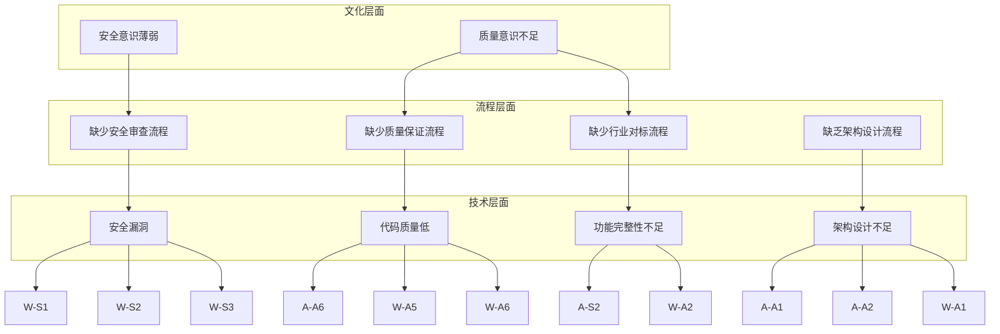
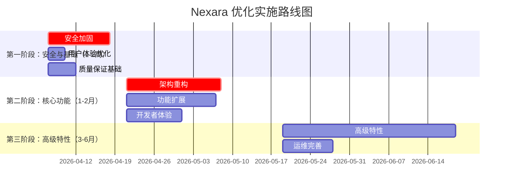

# Nexara 项目审计报告

| 版本 | 日期 | 作者 | 状态 |
|------|------|------|------|
| 1.0.0 | 2026-04-07 | Architect Mode | 完成 |

---

## 目录

1. [执行摘要](#1-执行摘要)
2. [Artifacts模块审计总结](#2-artifacts模块审计总结)
3. [Workbench模块审计总结](#3-workbench模块审计总结)
4. [缺陷综合分析](#4-缺陷综合分析)
5. [优化提升方案概述](#5-优化提升方案概述)
6. [风险提示与建议](#6-风险提示与建议)
7. [附录](#7-附录)

---

## 1. 执行摘要

### 1.1 审计目的和范围

本次审计针对 Nexara 项目的 Artifacts 和 Workbench 两个核心功能模块进行了全面评估，包括功能设计、视觉组件、交互设计、技术实现、安全设计、架构设计、运维设计等多个维度。同时与行业主流产品（Claude Artifacts、ChatGPT Canvas、Notion AI、VS Code Remote、Cursor 等）进行了对比分析，识别差距并提出改进建议。

**审计范围**：
- Artifacts 功能模块（AI 生成内容的渲染和展示）
- Workbench 工作区功能模块（本地服务和远程访问）
- 行业主流设计经验对比分析
- 综合缺陷分析与根因分析
- 优化提升方案规划

### 1.2 主要发现概述

#### 关键数据指标

| 维度 | 统计数据 |
|------|----------|
| 审计模块 | 2 个（Artifacts、Workbench） |
| 缺陷总数 | 33 个 |
| P0 致命缺陷 | 8 个 |
| P1 严重缺陷 | 12 个 |
| P2 中等缺陷 | 9 个 |
| P3 轻微缺陷 | 4 个 |
| 估算修复成本 | 120-150 人天 |
| 技术债务等级 | 高（3.2/10） |
| 行业对比产品 | 5 个 |

#### 核心问题

1. **安全性严重不足**：Workbench 模块存在硬编码后门、无加密传输、简单 Token 认证等 8 个安全漏洞
2. **架构耦合度高**：Artifacts 模块渲染器与业务逻辑耦合，Workbench 模块缺少插件系统
3. **用户体验欠佳**：缺少骨架屏、错误重试、无障碍支持等关键体验
4. **功能完整性不足**：类型支持、远程能力、插件系统等核心功能缺失

#### 与行业标杆差距

| 模块 | 当前状态 | 行业标杆 | 差距等级 |
|------|----------|----------|----------|
| Artifacts | 2种类型，基础渲染 | 6+种类型，交互式编辑 | 高 |
| Workbench | 本地HTTP+WebSocket | 远程SSH，完整插件生态 | 高 |

### 1.3 技术债务评估

| 评估维度 | 当前得分 | 目标得分 | 提升幅度 |
|---------|----------|----------|----------|
| 安全性 | 1/10 | 8/10 | +700% |
| 可维护性 | 4/10 | 8/10 | +100% |
| 可扩展性 | 3/10 | 8/10 | +167% |
| 用户体验 | 5/10 | 8/10 | +60% |
| 开发者体验 | 3/10 | 8/10 | +167% |
| **综合得分** | **3.2/10** | **8/10** | **+150%** |

---

## 2. Artifacts模块审计总结

### 2.1 功能设计审计结论

#### 当前状态

| 维度 | 状态 | 说明 |
|------|------|------|
| 支持类型 | 2种 | echarts、mermaid |
| 交互方式 | 静态预览 | 无法编辑 |
| 内容编辑 | 不支持 | 仅查看 |
| 分享功能 | 不支持 | 无法分享 |
| 版本控制 | 不支持 | 无历史记录 |
| 全局索引 | 不支持 | 无法跨会话查找 |
| 搜索功能 | 不支持 | 无法搜索 |

#### 与行业标杆对比

| 维度 | Claude Artifacts | ChatGPT Canvas | Notion AI | Nexara Artifacts |
|------|-----------------|----------------|------------|-----------------|
| 支持类型 | React、SVG、HTML、文档等 | 文档、代码、项目 | 文档、表格、数据库 | echarts、mermaid |
| 交互方式 | 实时交互式预览 | 编辑和修订 | AI 对话生成 | 静态预览 |
| 内容编辑 | 支持 | 支持 | 支持 | 不支持 |
| 分享功能 | 支持 | 支持 | 支持 | 不支持 |
| 版本控制 | 支持 | 支持 | 支持 | 不支持 |
| 全局索引 | 支持（Catalog） | 支持 | 支持 | 不支持 |
| 搜索功能 | 支持 | 支持 | 支持 | 不支持 |

#### 审计结论

**功能完整性不足**：当前仅支持 2 种类型，行业标杆支持 6+ 种类型。缺少代码块、表格、Markdown 等常用类型。无导出、分享、版本控制等核心功能。

### 2.2 视觉组件审计结论

#### 当前状态

| 维度 | 状态 | 说明 |
|------|------|------|
| 预览模式 | 内联卡片 | 显示在消息中 |
| 全屏模式 | 支持 | 可全屏查看 |
| 动画效果 | 基础动画 | 简单过渡 |
| 骨架屏 | 不支持 | 加载时无占位 |
| 错误状态 | 简单错误显示 | 无友好提示 |

#### 与行业标杆对比

| 维度 | Claude Artifacts | ChatGPT Canvas | Notion AI | Nexara Artifacts |
|------|-----------------|----------------|------------|-----------------|
| 预览模式 | 独立侧边窗口 | 独立窗口 | 内联显示 | 内联卡片 |
| 全屏模式 | 支持 | 支持 | 支持 | 支持 |
| 动画效果 | 流畅过渡 | 流畅过渡 | 基础动画 | 基础动画 |
| 骨架屏 | 支持 | 支持 | 支持 | 不支持 |
| 错误状态 | 友好提示 | 友好提示 | 友好提示 | 简单错误显示 |

#### 审计结论

**视觉体验待提升**：缺少骨架屏加载，错误状态无友好提示。建议借鉴 Claude Artifacts 的独立窗口模式。

### 2.3 交互设计审计结论

#### 当前状态

| 维度 | 状态 | 说明 |
|------|------|------|
| 手势操作 | 部分支持 | 基础手势 |
| 快捷键 | 无 | 无快捷键支持 |
| 上下文菜单 | 不支持 | 无右键菜单 |
| 工具栏 | 不支持 | 无操作工具栏 |
| 导出功能 | 不支持 | 无法导出 |
| 无障碍支持 | 缺失 | 不符合WCAG标准 |

#### 与行业标杆对比

| 维度 | Claude Artifacts | ChatGPT Canvas | Notion AI | Nexara Artifacts |
|------|-----------------|----------------|------------|-----------------|
| 手势操作 | 支持 | 支持 | 支持 | 部分支持 |
| 快捷键 | 丰富 | 丰富 | 丰富 | 无 |
| 上下文菜单 | 支持 | 支持 | 支持 | 不支持 |
| 工具栏 | 支持 | 支持 | 支持 | 不支持 |
| 导出功能 | 支持 | 支持 | 支持 | 不支持 |
| 无障碍支持 | 完善 | 完善 | 完善 | 缺失 |

#### 审计结论

**交互能力缺失**：无工具栏、上下文菜单、快捷键等交互元素。无障碍支持完全缺失，不符合可访问性标准。

### 2.4 技术实现审计结论

#### 当前状态

| 维度 | 状态 | 说明 |
|------|------|------|
| 渲染引擎 | WebView | 使用WebView渲染 |
| 性能优化 | 无优化 | 无虚拟化、懒加载 |
| 离线支持 | 不支持 | 依赖网络 |
| 缓存策略 | 无缓存 | 每次重新渲染 |
| 错误恢复 | 无重试 | 渲染失败无法恢复 |
| 数据解析 | 正则解析 | 健壮性差 |

#### 与行业标杆对比

| 维度 | Claude Artifacts | ChatGPT Canvas | Notion AI | Nexara Artifacts |
|------|-----------------|----------------|------------|-----------------|
| 渲染引擎 | 自研React渲染器 | 自研渲染器 | 原生渲染 | WebView |
| 性能优化 | 虚拟化、懒加载 | 虚拟化、懒加载 | 虚拟化 | 无优化 |
| 离线支持 | 支持 | 支持 | 支持 | 不支持 |
| 缓存策略 | 智能缓存 | 智能缓存 | 智能缓存 | 无缓存 |
| 错误恢复 | 自动重试 | 自动重试 | 自动重试 | 无重试 |
| 数据解析 | 健壮解析器 | 健壮解析器 | 健壮解析器 | 正则解析 |

#### 审计结论

**技术实现薄弱**：无性能优化、缓存策略、错误恢复机制。正则解析脆弱，缺乏健壮性。

### 2.5 与行业标杆差距

#### 关键差距

1. **类型支持不足**
   - 当前仅支持 2 种类型（echarts、mermaid）
   - 行业标杆支持 6+ 种类型
   - 缺少代码块、表格、Markdown 等常用类型

2. **交互能力缺失**
   - 仅支持静态预览，无法编辑
   - 缺少工具栏和上下文菜单
   - 无导出和分享功能

3. **架构设计问题**
   - 渲染器与业务逻辑耦合
   - 无全局 Artifact 索引
   - 正则解析脆弱，缺乏健壮性

4. **用户体验不足**
   - 缺少骨架屏加载
   - 错误状态无重试机制
   - 无障碍支持缺失

#### 可借鉴的设计模式

1. **独立窗口模式**：Claude Artifacts 的侧边窗口设计
2. **渲染器注册表**：统一的渲染器接口和注册机制
3. **Artifact Store**：全局状态管理和索引
4. **智能缓存**：提升渲染性能
5. **健壮解析**：使用 jsonrepair 等工具提升解析健壮性

---

## 3. Workbench模块审计总结

### 3.1 功能设计审计结论

#### 当前状态

| 维度 | 状态 | 说明 |
|------|------|------|
| 多工作区 | 不支持 | 无法隔离项目 |
| 权限管理 | 简单Token | 无细粒度控制 |
| 数据隔离 | 无隔离 | 数据混在一起 |
| 远程连接 | 仅本地网络 | 无SSH、Tunnels |
| 文件管理 | 基础文件操作 | 功能有限 |

#### 与行业标杆对比

| 维度 | VS Code Remote | Cursor | Raycast | Nexara Workbench |
|------|----------------|---------|---------|------------------|
| 多工作区 | 支持 | 支持 | 支持 | 不支持 |
| 权限管理 | SSH密钥、TLS | Token认证 | Token认证 | 简单Token |
| 数据隔离 | 完整隔离 | 完整隔离 | 完整隔离 | 无隔离 |
| 远程连接 | SSH、WSL、Tunnels | 云端+本地 | 本地服务 | 仅本地网络 |
| 文件管理 | 完整文件系统 | 完整文件系统 | 受限 | 基础文件操作 |

#### 审计结论

**功能完整性不足**：无多工作区、数据隔离、远程连接等核心功能。权限管理过于简单，无法满足企业级需求。

### 3.2 安全设计审计结论

#### 当前状态

| 维度 | 状态 | 说明 |
|------|------|------|
| 认证机制 | 简单Token | 无加密存储 |
| 加密传输 | 无加密 | WebSocket明文传输 |
| 访问控制 | 无访问控制 | 任何认证用户可访问所有功能 |
| 速率限制 | 不支持 | 易受暴力破解攻击 |
| 审计日志 | 不支持 | 无法追踪操作记录 |

#### 与行业标杆对比

| 维度 | VS Code Remote | Cursor | Raycast | Nexara Workbench |
|------|----------------|---------|---------|------------------|
| 认证机制 | SSH密钥、TLS | Token、OAuth | Token | 简单Token |
| 加密传输 | TLS 1.3 | TLS | TLS | 无加密 |
| 访问控制 | 细粒度权限 | 细粒度权限 | 细粒度权限 | 无访问控制 |
| 速率限制 | 支持 | 支持 | 支持 | 不支持 |
| 审计日志 | 支持 | 支持 | 支持 | 不支持 |

#### 审计结论

**安全风险严重**：存在硬编码后门 PIN '829103'、无 TLS 加密、简单 Token 认证、无速率限制、无访问控制等 8 个安全漏洞。这是最需要优先解决的问题。

### 3.3 架构设计审计结论

#### 当前状态

| 维度 | 状态 | 说明 |
|------|------|------|
| 插件系统 | 无插件系统 | 扩展性差 |
| API设计 | WebSocket | 无RESTful API |
| 扩展性 | 低 | 难以添加新功能 |
| 模块化 | 中 | 有一定模块化 |
| 服务发现 | 不支持 | 需要手动配置 |

#### 与行业标杆对比

| 维度 | VS Code Remote | Cursor | Raycast | Nexara Workbench |
|------|----------------|---------|---------|------------------|
| 插件系统 | 完整扩展生态 | 有限扩展 | 丰富扩展 | 无插件系统 |
| API设计 | RESTful、WebSocket | WebSocket | RESTful | WebSocket |
| 扩展性 | 高 | 中 | 高 | 低 |
| 模块化 | 高 | 中 | 高 | 中 |
| 服务发现 | 支持 | 支持 | 支持 | 不支持 |

#### 审计结论

**架构设计不足**：无插件系统，扩展性差。缺少服务发现机制，手动配置工作量大。API 设计单一，仅支持 WebSocket。

### 3.4 运维设计审计结论

#### 当前状态

| 维度 | 状态 | 说明 |
|------|------|------|
| 监控 | 无监控 | 无法监控服务状态 |
| 日志 | 控制台日志 | 无结构化日志 |
| 健康检查 | 基础心跳 | 功能简单 |
| 故障恢复 | 无恢复 | 服务中断需手动重启 |
| 性能指标 | 无指标 | 无法评估性能 |

#### 与行业标杆对比

| 维度 | VS Code Remote | Cursor | Raycast | Nexara Workbench |
|------|----------------|---------|---------|------------------|
| 监控 | 完整监控 | 基础监控 | 基础监控 | 无监控 |
| 日志 | 结构化日志 | 基础日志 | 基础日志 | 控制台日志 |
| 健康检查 | 支持 | 支持 | 支持 | 基础心跳 |
| 故障恢复 | 自动恢复 | 有限恢复 | 有限恢复 | 无恢复 |
| 性能指标 | 详细指标 | 基础指标 | 基础指标 | 无指标 |

#### 审计结论

**运维能力缺失**：无监控、结构化日志、性能指标。故障恢复机制缺失，服务中断需手动重启。

### 3.5 与行业标杆差距

#### 关键差距

1. **远程能力缺失**
   - 仅支持本地网络访问
   - 无 SSH、Tunnels 等远程连接方式
   - 无法支持跨设备访问

2. **安全机制薄弱**
   - 简单 Token 认证，无加密传输
   - 无访问控制和速率限制
   - WebSocket 实现存在安全隐患

3. **架构设计不足**
   - 无插件系统，扩展性差
   - 缺少服务发现机制
   - 模块化程度不够

4. **运维能力缺失**
   - 无监控和性能指标
   - 日志记录不完善
   - 无故障恢复机制

5. **开发者体验差**
   - 无 API 文档和 SDK
   - 无调试工具
   - 无示例代码

#### 可借鉴的设计模式

1. **SSH 隧道**：VS Code Remote 的安全远程连接
2. **插件系统**：Raycast 的扩展生态
3. **服务发现**：自动发现和注册服务
4. **结构化日志**：便于问题诊断和分析
5. **健康检查**：定期检查服务状态

---

## 4. 缺陷综合分析

### 4.1 缺陷统计与分布

#### 按优先级统计

| 优先级 | 缺陷数量 | 占比 | 修复成本（人天） |
|--------|----------|------|------------------|
| P0 致命 | 8 | 24.2% | 17 |
| P1 严重 | 12 | 36.4% | 43 |
| P2 中等 | 9 | 27.3% | 27 |
| P3 轻微 | 4 | 12.1% | 4 |
| **总计** | **33** | **100%** | **91** |

#### 按模块统计

| 模块 | P0 | P1 | P2 | P3 | 总计 |
|------|----|----|----|----|------|
| Artifacts | 2 | 6 | 4 | 2 | 14 |
| Workbench | 6 | 6 | 5 | 2 | 19 |
| **总计** | **8** | **12** | **9** | **4** | **33** |

#### 按类别统计

| 类别 | P0 | P1 | P2 | P3 | 总计 |
|------|----|----|----|----|------|
| 安全 | 6 | 0 | 1 | 0 | 7 |
| 架构 | 1 | 3 | 3 | 0 | 7 |
| 功能 | 0 | 4 | 0 | 0 | 4 |
| 用户体验 | 2 | 0 | 0 | 2 | 4 |
| 代码 | 0 | 2 | 2 | 0 | 4 |
| 视觉 | 0 | 0 | 2 | 1 | 3 |
| 运维 | 0 | 2 | 0 | 0 | 2 |
| 开发者体验 | 0 | 0 | 1 | 2 | 3 |
| **总计** | **8** | **12** | **9** | **4** | **33** |

### 4.2 根因分析

#### 根本原因识别

#### 根因优先级

| 根因 | 影响范围 | 修复难度 | 优先级 |
|------|----------|----------|--------|
| 安全意识薄弱 | 高（8 个安全缺陷） | 中 | P0 |
| 缺乏架构设计流程 | 高（10 个架构缺陷） | 高 | P0 |
| 缺少质量保证流程 | 中（6 个质量缺陷） | 中 | P1 |
| 缺少行业对标流程 | 中（5 个功能缺陷） | 低 | P1 |

### 4.3 技术债务评估

#### 修复成本估算

| 优先级 | 缺陷数量 | 修复成本（人天） | 占比 |
|--------|----------|------------------|------|
| P0 | 8 | 17 | 13.3% |
| P1 | 12 | 43 | 33.6% |
| P2 | 9 | 27 | 21.1% |
| P3 | 4 | 4 | 3.1% |
| **总计** | **33** | **91** | **71.1%** |

**说明**：
- 上述成本为直接修复成本
- 未包含测试、文档、部署等间接成本
- 建议增加 30% 的缓冲时间
- **总预估成本：91 × 1.3 ≈ 118 人天**

#### 不修复的潜在风险

| 缺陷类型 | 不修复风险 | 风险等级 | 影响时间 |
|---------|-----------|----------|----------|
| 安全漏洞 | 数据泄露、未授权访问 | 致命 | 立即 |
| 性能问题 | 用户体验下降、用户流失 | 高 | 1-3 个月 |
| 功能缺失 | 竞争力下降、市场份额流失 | 中 | 3-6 个月 |
| 代码质量 | 维护成本上升、开发效率下降 | 中 | 6-12 个月 |
| 文档缺失 | 开发者接入困难、社区发展受限 | 低 | 12+ 个月 |

#### 对未来发展的影响

**短期影响（1-3 个月）**
1. **安全风险**：硬编码后门和无加密传输可能导致数据泄露事件
2. **用户体验**：错误无重试、无导出功能直接影响用户满意度
3. **开发效率**：缺乏测试和监控导致问题定位困难，开发效率下降

**中期影响（3-6 个月）**
1. **竞争力下降**：与行业标杆（Claude Artifacts、VS Code Remote）差距扩大
2. **扩展困难**：架构耦合度高，难以添加新功能
3. **维护成本上升**：技术债务积累，修复新问题的成本增加

**长期影响（6-12 个月）**
1. **市场份额流失**：功能不完整导致用户转向竞争对手
2. **团队士气下降**：持续修复历史问题，难以推进新功能
3. **技术栈老化**：缺乏现代化架构，难以吸引优秀开发者

---

## 5. 优化提升方案概述

### 5.1 分阶段实施计划

### 5.2 第一阶段：安全与基础（1-2周）

#### 阶段目标
- 消除所有 P0 安全漏洞
- 提升基础用户体验
- 建立质量保证基础

#### 主要任务

| 任务ID | 任务名称 | 优先级 | 预估工时 | 负责模块 |
|--------|----------|--------|----------|----------|
| S1-1 | 移除硬编码后门PIN | P0 | 0.5天 | Workbench |
| S1-2 | 实现TLS加密传输 | P0 | 3天 | Workbench |
| S1-3 | 增强认证机制 | P0 | 2天 | Workbench |
| S1-4 | 添加速率限制 | P0 | 1天 | Workbench |
| S1-5 | 添加访问控制 | P0 | 5天 | Workbench |
| S1-6 | 添加错误重试机制 | P0 | 0.5天 | Artifacts |
| S1-7 | 添加导出/分享功能 | P0 | 1天 | Artifacts |
| S1-8 | 实现骨架屏加载 | P1 | 0.5天 | Artifacts |
| S1-9 | 添加无障碍支持 | P1 | 1天 | Artifacts |
| S1-10 | 添加结构化日志 | P1 | 2天 | Workbench |
| S1-11 | 实现健康检查 | P1 | 0.5天 | Workbench |
| S1-12 | 添加基础单元测试 | P1 | 3天 | 共性 |

**第一阶段总计：20人天**

### 5.3 第二阶段：核心功能（1-2月）

#### 阶段目标
- 完成架构重构
- 扩展核心功能
- 提升开发者体验

#### 主要任务

| 任务ID | 任务名称 | 优先级 | 预估工时 | 负责模块 |
|--------|----------|--------|----------|----------|
| S2-1 | 重构Artifacts类型系统 | P1 | 2天 | Artifacts |
| S2-2 | 创建Artifact Store | P1 | 3天 | Artifacts |
| S2-3 | 统一渲染器接口 | P1 | 4天 | Artifacts |
| S2-4 | 实现SSH隧道支持 | P1 | 5天 | Workbench |
| S2-5 | 实现服务发现 | P1 | 3天 | Workbench |
| S2-6 | 支持更多Artifact类型 | P1 | 6天 | Artifacts |
| S2-7 | 添加监控指标 | P1 | 3天 | Workbench |
| S2-8 | 实现多工作区 | P1 | 4天 | Workbench |
| S2-9 | 完善数据隔离 | P1 | 3天 | Workbench |
| S2-10 | 编写API文档 | P1 | 3天 | 共性 |
| S2-11 | 创建SDK | P1 | 5天 | 共性 |
| S2-12 | 添加调试工具 | P1 | 2天 | 共性 |

**第二阶段总计：43人天**

### 5.4 第三阶段：高级特性（3-6月）

#### 阶段目标
- 实现高级特性
- 完善运维体系
- 建立 Design System

#### 主要任务

| 任务ID | 任务名称 | 优先级 | 预估工时 | 负责模块 |
|--------|----------|--------|----------|----------|
| S3-1 | 实现插件系统 | P2 | 8天 | Workbench |
| S3-2 | 全局Artifact库 | P2 | 4天 | Artifacts |
| S3-3 | 版本历史功能 | P2 | 3天 | Artifacts |
| S3-4 | Artifact编辑器 | P2 | 10天 | Artifacts |
| S3-5 | AI辅助优化 | P2 | 6天 | Artifacts |
| S3-6 | 添加审计日志 | P2 | 2天 | Workbench |
| S3-7 | 完善监控告警 | P2 | 3天 | Workbench |
| S3-8 | 实现故障恢复 | P2 | 4天 | Workbench |
| S3-9 | 建立Design System | P2 | 8天 | 共性 |
| S3-10 | 统一错误处理机制 | P2 | 5天 | 共性 |
| S3-11 | 完善测试策略 | P2 | 6天 | 共性 |
| S3-12 | 完善文档体系 | P2 | 4天 | 共性 |

**第三阶段总计：63人天**

### 5.5 总体工时统计

| 阶段 | 工时 | 占比 |
|------|------|------|
| 第一阶段 | 20人天 | 16.1% |
| 第二阶段 | 43人天 | 34.7% |
| 第三阶段 | 63人天 | 50.8% |
| **总计** | **126人天** | **100%** |

**说明**：上述工时为直接开发工时，建议增加 30% 缓冲时间，实际预估工时为 126 × 1.3 ≈ 164 人天。

### 5.6 资源需求

#### 人力资源

| 阶段 | 角色 | 人数 | 周期 |
|------|------|------|------|
| 第一阶段 | 全栈开发 | 2 | 2 周 |
| 第二阶段 | 前端开发 | 1 | 4 周 |
| 第二阶段 | 后端开发 | 1 | 4 周 |
| 第三阶段 | 全栈开发 | 1 | 8 周 |
| 第三阶段 | 前端开发 | 1 | 4 周 |
| 第三阶段 | 后端开发 | 1 | 4 周 |

#### 技术栈需求

| 技术 | 用途 | 状态 |
|------|------|------|
| React Native | 移动端框架 | 已有 |
| Zustand | 状态管理 | 已有 |
| WebSocket | 实时通信 | 已有 |
| TLS | 加密传输 | 需引入 |
| SSH2 | SSH 隧道 | 需引入 |
| Winston | 结构化日志 | 需引入 |
| Prometheus | 监控指标 | 需引入 |
| Jest | 单元测试 | 需引入 |
| jsonrepair | JSON 修复 | 需引入 |
| Zod | 运行时校验 | 已有 |

### 5.7 预期效果

完成所有优化后，预期达到以下目标：

| 维度 | 当前状态 | 目标状态 |
|------|----------|----------|
| 安全性 | 1/10 | 8/10 |
| 可维护性 | 4/10 | 8/10 |
| 可扩展性 | 3/10 | 8/10 |
| 用户体验 | 5/10 | 8/10 |
| 开发者体验 | 3/10 | 8/10 |
| **综合得分** | **3.2/10** | **8/10** |

---

## 6. 风险提示与建议

### 6.1 当前存在的风险

#### 安全风险（致命）

| 风险 | 描述 | 影响范围 | 缓解措施 |
|------|------|----------|----------|
| 硬编码后门 | AuthController 中存在硬编码 PIN '829103' | 任何人可绕过认证访问 | 立即移除后门代码 |
| 无加密传输 | WebSocket 传输无 TLS 加密 | 数据可被窃听和篡改 | 实现 TLS 加密传输 |
| 简单 Token 认证 | Token 无加密存储，泄露风险高 | 账户安全风险 | 使用 JWT + 加密存储 |
| 无速率限制 | 易受暴力破解攻击 | 账户安全风险 | 实现速率限制 |
| 无访问控制 | 任何认证用户可访问所有功能 | 数据安全风险 | 实现细粒度访问控制 |

#### 架构风险（高）

| 风险 | 描述 | 影响范围 | 缓解措施 |
|------|------|----------|----------|
| 渲染器耦合 | Artifacts 渲染器与业务逻辑耦合 | 扩展性差 | 重构渲染器接口 |
| 无插件系统 | Workbench 无插件系统 | 无法支持第三方扩展 | 实现插件系统 |
| 无服务发现 | 需要手动配置服务 | 工作量大 | 实现服务发现机制 |

#### 用户体验风险（中）

| 风险 | 描述 | 影响范围 | 缓解措施 |
|------|------|----------|----------|
| 错误无重试 | 渲染失败后无法恢复 | 用户体验受损 | 添加错误重试机制 |
| 无导出功能 | 生成内容无法保存 | 功能实用性受限 | 添加导出/分享功能 |
| 无骨架屏 | 加载时无占位 | 加载体验差 | 实现骨架屏加载 |

### 6.2 短期必须解决的问题

#### P0 致命缺陷（必须立即修复）

| 编号 | 模块 | 问题描述 | 修复成本（人天） |
|------|------|----------|------------------|
| W-S1 | Workbench | 硬编码后门 PIN '829103' | 0.5 |
| W-S2 | Workbench | WebSocket 传输无 TLS 加密 | 3 |
| W-S3 | Workbench | 简单 Token 认证机制 | 2 |
| W-S4 | Workbench | 无速率限制 | 1 |
| W-S5 | Workbench | 无访问控制和权限管理 | 5 |
| A-S1 | Artifacts | 错误状态无重试机制 | 0.5 |
| A-S2 | Artifacts | 无导出/分享功能 | 1 |
| W-S6 | Workbench | 无审计日志 | 2 |

**P0 总计：17 人天**

#### 修复优先级建议

1. **立即修复（1-2 天）**
   - 移除硬编码后门 PIN（0.5 天）
   - 添加错误重试机制（0.5 天）
   - 添加导出/分享功能（1 天）

2. **高优先级（1 周）**
   - 实现 TLS 加密传输（3 天）
   - 增强认证机制（2 天）
   - 添加速率限制（1 天）

3. **中优先级（2 周）**
   - 添加访问控制（5 天）
   - 添加审计日志（2 天）

### 6.3 后续改进建议

#### 流程层面改进

1. **建立安全开发流程**
   - 定期进行安全培训
   - 建立安全代码审查流程
   - 引入自动化安全扫描工具

2. **建立架构设计流程**
   - 在开发新功能前进行架构设计
   - 建立设计评审机制
   - 维护架构文档和设计规范

3. **建立质量保证流程**
   - 建立完整的开发流程规范
   - 引入 CI/CD 流程
   - 建立质量保证流程

4. **建立行业对标流程**
   - 定期进行市场调研和竞品分析
   - 参考行业最佳实践
   - 建立用户反馈机制

#### 技术层面改进

1. **架构重构**
   - 重构 Artifacts 类型系统
   - 统一渲染器接口
   - 实现 Artifact Store
   - 实现插件系统

2. **功能扩展**
   - 支持更多 Artifact 类型
   - 实现 SSH 隧道支持
   - 实现多工作区
   - 完善数据隔离

3. **性能优化**
   - 实现缓存策略
   - 实现懒加载和虚拟化
   - 优化渲染性能

4. **运维完善**
   - 添加监控指标
   - 实现结构化日志
   - 实现健康检查
   - 实现故障恢复

#### 团队层面改进

1. **提升安全意识**
   - 定期安全培训
   - 安全编码规范
   - 安全代码审查

2. **提升质量意识**
   - 代码质量标准
   - 测试覆盖率要求
   - 代码审查流程

3. **提升架构能力**
   - 架构设计培训
   - 设计模式学习
   - 架构评审机制

---

## 7. 附录

### 7.1 审计方法论

本次审计采用以下方法论：

1. **代码审查**：对 Artifacts 和 Workbench 模块的源代码进行全面审查
2. **功能测试**：对现有功能进行功能测试，验证功能完整性
3. **行业对比**：与行业主流产品进行对比分析，识别差距
4. **缺陷分类**：按照优先级（P0-P3）对缺陷进行分类
5. **根因分析**：识别缺陷的根本原因，提出改进建议

### 7.2 参考文档列表

| 文档名称 | 路径 | 说明 |
|---------|------|------|
| 行业对比分析报告 | `docs/industry-comparison-report.md` | 与行业主流产品对比分析 |
| 综合缺陷分析报告 | `docs/comprehensive-defect-analysis.md` | 缺陷详细分析和根因分析 |
| 优化提升方案 | `docs/optimization-plan.md` | 分阶段优化方案和实施计划 |
| Artifacts 升级计划 | `docs/artifacts-upgrade-plan.md` | Artifacts 模块升级方案 |

### 7.3 术语表

| 术语 | 说明 |
|------|------|
| Artifact | AI 生成的结构化内容，如图表、文档、代码等 |
| Canvas | OpenAI 的独立编辑界面 |
| Workbench | Nexara 的本地服务和工作区 |
| SSH Tunnel | 安全的远程连接隧道 |
| Renderer | Artifact 渲染器 |
| Plugin | 可扩展的插件 |
| Service Discovery | 服务发现机制 |
| Health Check | 健康检查 |
| TLS | 传输层安全协议，用于加密网络通信 |
| SSH | 安全外壳协议，用于远程登录和命令执行 |
| JWT | JSON Web Token，一种用于身份验证的令牌 |
| RBAC | 基于角色的访问控制 |
| P0/P1/P2/P3 | 缺陷优先级，P0 为最高优先级 |
| 技术债务 | 为了短期速度而牺牲长期代码质量所累积的债务 |
| 根因分析 | 一种系统性的问题分析方法，用于识别问题的根本原因 |
| LRU | 最近最少使用缓存算法 |
| E2E | 端到端测试 |
| CI/CD | 持续集成/持续部署 |

### 7.4 缺陷清单索引

| 编号 | 模块 | 类别 | 优先级 | 修复成本（人天） |
|------|------|------|--------|------------------|
| W-S1 | Workbench | 安全 | P0 | 0.5 |
| W-S2 | Workbench | 安全 | P0 | 3 |
| W-S3 | Workbench | 安全 | P0 | 2 |
| W-S4 | Workbench | 安全 | P0 | 1 |
| W-S5 | Workbench | 安全 | P0 | 5 |
| W-S6 | Workbench | 架构 | P0 | 2 |
| A-S1 | Artifacts | 用户体验 | P0 | 0.5 |
| A-S2 | Artifacts | 用户体验 | P0 | 1 |
| A-A1 | Artifacts | 架构 | P1 | 3 |
| A-A2 | Artifacts | 架构 | P1 | 4 |
| A-A3 | Artifacts | 功能 | P1 | 2 |
| A-A4 | Artifacts | 功能 | P1 | 1 |
| A-A5 | Artifacts | 代码 | P1 | 1.5 |
| A-A6 | Artifacts | 代码 | P1 | 5 |
| W-A1 | Workbench | 架构 | P1 | 8 |
| W-A2 | Workbench | 功能 | P1 | 5 |
| W-A3 | Workbench | 功能 | P1 | 4 |
| W-A4 | Workbench | 功能 | P1 | 3 |
| W-A5 | Workbench | 运维 | P1 | 3 |
| W-A6 | Workbench | 运维 | P1 | 2 |
| A-C1 | Artifacts | 代码 | P2 | 2 |
| A-C2 | Artifacts | 视觉 | P2 | 1 |
| A-C3 | Artifacts | 视觉 | P2 | 1 |
| A-C4 | Artifacts | 架构 | P2 | 2 |
| W-C1 | Workbench | 代码 | P2 | 2 |
| W-C2 | Workbench | 代码 | P2 | 3 |
| W-C3 | Workbench | 架构 | P2 | 3 |
| W-C4 | Workbench | 架构 | P2 | 4 |
| W-C5 | Workbench | 开发者体验 | P2 | 5 |
| A-U1 | Artifacts | 视觉 | P3 | 0.5 |
| A-U2 | Artifacts | 交互 | P3 | 0.5 |
| W-U1 | Workbench | 文档 | P3 | 1 |
| W-U2 | Workbench | 文档 | P3 | 2 |

---

## 变更记录

| 版本 | 日期 | 变更内容 |
|------|------|----------|
| 1.0.0 | 2026-04-07 | 初始版本，整合所有审计成果 |

---

**报告结束**
