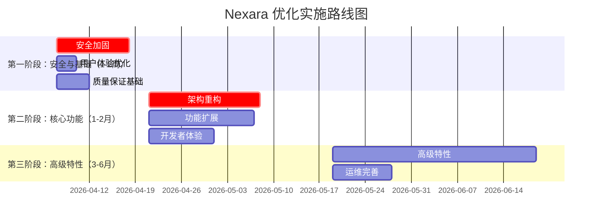

# Nexara 项目优化提升方案

| 版本 | 日期 | 作者 | 状态 |
|------|------|------|------|
| 1.0.0 | 2026-04-07 | Architect Mode | 完成 |

---

## 目录

1. [方案概述](#1-方案概述)
2. [分阶段实施计划](#2-分阶段实施计划)
3. [Artifacts模块优化方案](#3-artifacts模块优化方案)
4. [Workbench模块优化方案](#4-workbench模块优化方案)
5. [共性问题优化方案](#5-共性问题优化方案)
6. [资源需求评估](#6-资源需求评估)
7. [风险评估与缓解](#7-风险评估与缓解)
8. [成功指标](#8-成功指标)
9. [附录](#9-附录)

---

## 1. 方案概述

### 1.1 总体目标

基于综合缺陷分析报告识别的33个缺陷，本方案旨在通过系统性优化提升Nexara项目的整体质量，实现以下目标：

| 维度 | 当前状态 | 目标状态 | 提升幅度 |
|------|----------|----------|----------|
| 安全性 | 1/10 | 8/10 | +700% |
| 可维护性 | 4/10 | 8/10 | +100% |
| 可扩展性 | 3/10 | 8/10 | +167% |
| 用户体验 | 5/10 | 8/10 | +60% |
| 开发者体验 | 3/10 | 8/10 | +167% |
| **综合得分** | **3.2/10** | **8/10** | **+150%** |

### 1.2 优化原则

1. **安全优先**：优先修复所有P0安全漏洞，消除数据泄露风险
2. **渐进式演进**：分阶段实施，确保每个阶段可独立交付
3. **向后兼容**：保证现有功能不受影响，平滑过渡
4. **测试驱动**：每个功能点需有对应测试用例
5. **文档同步**：代码与文档同步更新，保持一致性
6. **性能优先**：优化关键路径，提升用户体验

### 1.3 预期效果

完成所有优化后，Nexara项目将达到以下效果：

- **安全性**：消除所有已知安全漏洞，实现企业级安全标准
- **功能完整性**：支持6+种Artifact类型，实现远程访问和插件扩展
- **用户体验**：流畅的加载体验、友好的错误处理、完善的无障碍支持
- **开发效率**：完善的测试覆盖、结构化日志、监控指标、API文档
- **可维护性**：清晰的架构分层、统一的错误处理、完善的代码规范

---

## 2. 分阶段实施计划

### 2.1 阶段划分



### 2.2 第一阶段：安全与基础（1-2周）

#### 阶段目标

- 消除所有P0安全漏洞
- 提升基础用户体验
- 建立质量保证基础

#### 任务清单

| 任务ID | 任务名称 | 优先级 | 预估工时 | 负责模块 |
|--------|----------|--------|----------|----------|
| S1-1 | 移除硬编码后门PIN | P0 | 0.5天 | Workbench |
| S1-2 | 实现TLS加密传输 | P0 | 3天 | Workbench |
| S1-3 | 增强认证机制 | P0 | 2天 | Workbench |
| S1-4 | 添加速率限制 | P0 | 1天 | Workbench |
| S1-5 | 添加访问控制 | P0 | 5天 | Workbench |
| S1-6 | 添加错误重试机制 | P0 | 0.5天 | Artifacts |
| S1-7 | 添加导出/分享功能 | P0 | 1天 | Artifacts |
| S1-8 | 实现骨架屏加载 | P1 | 0.5天 | Artifacts |
| S1-9 | 添加无障碍支持 | P1 | 1天 | Artifacts |
| S1-10 | 添加结构化日志 | P1 | 2天 | Workbench |
| S1-11 | 实现健康检查 | P1 | 0.5天 | Workbench |
| S1-12 | 添加基础单元测试 | P1 | 3天 | 共性 |

**第一阶段总计：20人天**

### 2.3 第二阶段：核心功能（1-2月）

#### 阶段目标

- 完成架构重构
- 扩展核心功能
- 提升开发者体验

#### 任务清单

| 任务ID | 任务名称 | 优先级 | 预估工时 | 负责模块 |
|--------|----------|--------|----------|----------|
| S2-1 | 重构Artifacts类型系统 | P1 | 2天 | Artifacts |
| S2-2 | 创建Artifact Store | P1 | 3天 | Artifacts |
| S2-3 | 统一渲染器接口 | P1 | 4天 | Artifacts |
| S2-4 | 实现SSH隧道支持 | P1 | 5天 | Workbench |
| S2-5 | 实现服务发现 | P1 | 3天 | Workbench |
| S2-6 | 支持更多Artifact类型 | P1 | 6天 | Artifacts |
| S2-7 | 添加监控指标 | P1 | 3天 | Workbench |
| S2-8 | 实现多工作区 | P1 | 4天 | Workbench |
| S2-9 | 完善数据隔离 | P1 | 3天 | Workbench |
| S2-10 | 编写API文档 | P1 | 3天 | 共性 |
| S2-11 | 创建SDK | P1 | 5天 | 共性 |
| S2-12 | 添加调试工具 | P1 | 2天 | 共性 |

**第二阶段总计：43人天**

### 2.4 第三阶段：高级特性（3-6月）

#### 阶段目标

- 实现高级特性
- 完善运维体系
- 建立Design System

#### 任务清单

| 任务ID | 任务名称 | 优先级 | 预估工时 | 负责模块 |
|--------|----------|--------|----------|----------|
| S3-1 | 实现插件系统 | P2 | 8天 | Workbench |
| S3-2 | 全局Artifact库 | P2 | 4天 | Artifacts |
| S3-3 | 版本历史功能 | P2 | 3天 | Artifacts |
| S3-4 | Artifact编辑器 | P2 | 10天 | Artifacts |
| S3-5 | AI辅助优化 | P2 | 6天 | Artifacts |
| S3-6 | 添加审计日志 | P2 | 2天 | Workbench |
| S3-7 | 完善监控告警 | P2 | 3天 | Workbench |
| S3-8 | 实现故障恢复 | P2 | 4天 | Workbench |
| S3-9 | 建立Design System | P2 | 8天 | 共性 |
| S3-10 | 统一错误处理机制 | P2 | 5天 | 共性 |
| S3-11 | 完善测试策略 | P2 | 6天 | 共性 |
| S3-12 | 完善文档体系 | P2 | 4天 | 共性 |

**第三阶段总计：63人天**

### 2.5 总体工时统计

| 阶段 | 工时 | 占比 |
|------|------|------|
| 第一阶段 | 20人天 | 16.1% |
| 第二阶段 | 43人天 | 34.7% |
| 第三阶段 | 63人天 | 50.8% |
| **总计** | **126人天** | **100%** |

**说明**：上述工时为直接开发工时，建议增加30%缓冲时间，实际预估工时为126 × 1.3 ≈ 164人天。

---

## 3. Artifacts模块优化方案

### 3.1 功能增强方案

#### 3.1.1 缺失类型实现

**问题描述**：当前仅支持echarts和mermaid两种类型，功能完整性不足

**解决方案**：支持更多Artifact类型

| 类型 | 优先级 | 预估工时 | 实现要点 |
|------|--------|----------|----------|
| code | P1 | 6h | 语法高亮、代码复制、行号显示 |
| table | P1 | 4h | 排序、筛选、分页 |
| markdown | P1 | 4h | Markdown渲染、目录导航 |
| svg | P2 | 4h | SVG解析、缩放、导出 |
| html | P2 | 6h | 沙箱渲染、安全过滤 |

**依赖关系**：
- 依赖S2-1（类型系统重构）
- 依赖S2-3（渲染器接口）

**验收标准**：
- [ ] 支持所有新增类型的渲染
- [ ] 每种类型有对应的导出功能
- [ ] 单元测试覆盖率≥80%

#### 3.1.2 导出功能

**问题描述**：无导出/分享功能，生成内容无法保存

**解决方案**：实现多格式导出

**实现要点**：
1. 支持导出格式：PNG、SVG、JSON、PDF、Markdown
2. 集成系统分享功能
3. 支持批量导出
4. 支持配置复制到剪贴板

**依赖关系**：
- 依赖S1-7（基础导出功能）

**验收标准**：
- [ ] 支持至少3种导出格式
- [ ] 导出质量符合预期
- [ ] 支持系统分享

#### 3.1.3 全局索引

**问题描述**：无全局Artifact索引/搜索，无法跨会话查找和复用

**解决方案**：建立全局Artifact Store

**实现要点**：
1. 使用Zustand创建全局Store
2. 建立多维度索引（会话、类型、时间）
3. 实现全文搜索
4. 支持收藏和标签

**依赖关系**：
- 依赖S2-2（Artifact Store创建）

**验收标准**：
- [ ] 支持跨会话Artifact查询
- [ ] 搜索响应时间<500ms
- [ ] 索引更新实时性<1s

### 3.2 架构重构方案

#### 3.2.1 渲染器接口

**问题描述**：渲染器与业务逻辑耦合，扩展性差

**解决方案**：统一渲染器接口

**实现要点**：
1. 定义ArtifactRenderer接口
2. 实现渲染器注册表
3. 解耦渲染逻辑和业务逻辑
4. 支持动态注册新渲染器

**依赖关系**：
- 依赖S2-1（类型系统重构）

**验收标准**：
- [ ] 接口定义清晰完整
- [ ] 支持动态注册
- [ ] 单元测试覆盖率≥90%

#### 3.2.2 类型系统

**问题描述**：Artifact类型系统过于简单，扩展性受限

**解决方案**：重构类型系统

**实现要点**：
1. 扩展ArtifactType枚举
2. 定义完整的Artifact接口
3. 使用Zod进行运行时校验
4. 支持自定义元数据

**依赖关系**：
- 无前置依赖

**验收标准**：
- [ ] 类型定义完整
- [ ] Zod schema校验通过
- [ ] 与现有代码兼容

#### 3.2.3 状态管理

**问题描述**：无全局状态管理，数据分散

**解决方案**：引入Zustand状态管理

**实现要点**：
1. 创建Artifact Store
2. 实现持久化机制
3. 支持状态订阅
4. 实现状态版本控制

**依赖关系**：
- 依赖S2-1（类型系统重构）

**验收标准**：
- [ ] Store功能完整
- [ ] 持久化正常工作
- [ ] 状态更新性能良好

### 3.3 性能优化方案

#### 3.3.1 缓存策略

**问题描述**：无缓存机制，重复渲染浪费资源

**解决方案**：实现多级缓存

**实现要点**：
1. 内存缓存：已渲染内容
2. 磁盘缓存：缩略图
3. 缓存失效策略：LRU
4. 缓存预热机制

**依赖关系**：
- 依赖S2-2（Artifact Store）

**验收标准**：
- [ ] 缓存命中率≥70%
- [ ] 缓存大小可控
- [ ] 缓存失效机制正常

#### 3.3.2 懒加载

**问题描述**：所有Artifact同时加载，影响性能

**解决方案**：实现懒加载和虚拟化

**实现要点**：
1. Intersection Observer监听可见性
2. 按需加载渲染
3. 虚拟列表长列表
4. 预加载相邻项

**依赖关系**：
- 无前置依赖

**验收标准**：
- [ ] 首屏渲染时间<1s
- [ ] 滚动流畅（60fps）
- [ ] 内存占用合理

#### 3.3.3 虚拟化

**问题描述**：大量Artifact时性能下降

**解决方案**：实现虚拟滚动

**实现要点**：
1. 使用react-native-virtualized-list
2. 动态计算可见区域
3. 回收不可见项
4. 优化渲染性能

**依赖关系**：
- 依赖S3-2（全局Artifact库）

**验收标准**：
- [ ] 支持1000+项流畅滚动
- [ ] 内存占用稳定
- [ ] 滚动无卡顿

### 3.4 用户体验优化方案

#### 3.4.1 交互设计

**问题描述**：交互不明确，用户体验待优化

**解决方案**：优化交互设计

**实现要点**：
1. 明确的视觉反馈
2. 合理的手势支持
3. 上下文菜单
4. 工具栏优化

**依赖关系**：
- 无前置依赖

**验收标准**：
- [ ] 交互符合用户预期
- [ ] 视觉反馈及时
- [ ] 支持常用手势

#### 3.4.2 动画

**问题描述**：无过渡动画，体验生硬

**解决方案**：添加流畅动画

**实现要点**：
1. 使用Reanimated实现流畅动画
2. 骨架屏加载动画
3. 过渡动画
4. 错误状态动画

**依赖关系**：
- 无前置依赖

**验收标准**：
- [ ] 动画流畅（60fps）
- [ ] 动画时长合理
- [ ] 支持关闭动画

#### 3.4.3 无障碍支持

**问题描述**：无障碍支持缺失，可访问性差

**解决方案**：完善无障碍支持

**实现要点**：
1. 添加accessibility标签
2. 支持屏幕阅读器
3. 支持动态字体大小
4. 优化焦点顺序

**依赖关系**：
- 无前置依赖

**验收标准**：
- [ ] 通过无障碍测试
- [ ] 支持VoiceOver/TalkBack
- [ ] 焦点顺序合理

---

## 4. Workbench模块优化方案

### 4.1 安全加固方案

#### 4.1.1 移除后门

**问题描述**：硬编码后门PIN '829103'在AuthController中

**解决方案**：移除后门代码

**实现要点**：
1. 删除硬编码PIN验证逻辑
2. 添加代码审查规则
3. 添加安全扫描工具
4. 建立安全编码规范

**依赖关系**：
- 无前置依赖

**验收标准**：
- [ ] 后门代码完全移除
- [ ] 代码审查通过
- [ ] 安全扫描无漏洞

#### 4.1.2 TLS加密

**问题描述**：WebSocket传输无TLS加密，数据可被窃听和篡改

**解决方案**：实现TLS加密传输

**实现要点**：
1. 配置HTTPS/WSS服务器
2. 生成自签名证书或使用Let's Encrypt
3. 强制使用加密连接
4. 证书自动续期

**依赖关系**：
- 无前置依赖

**验收标准**：
- [ ] 所有连接使用TLS
- [ ] 证书有效
- [ ] 加密强度符合标准

#### 4.1.3 认证增强

**问题描述**：简单Token认证机制，无加密存储

**解决方案**：增强认证机制

**实现要点**：
1. 使用JWT Token
2. Token加密存储
3. Token刷新机制
4. 多因素认证（可选）

**依赖关系**：
- 无前置依赖

**验收标准**：
- [ ] Token安全存储
- [ ] Token自动刷新
- [ ] 支持注销

#### 4.1.4 速率限制

**问题描述**：无速率限制，易受暴力破解攻击

**解决方案**：实现速率限制

**实现要点**：
1. 基于IP的速率限制
2. 基于用户的速率限制
3. 滑动窗口算法
4. 超限封禁机制

**依赖关系**：
- 无前置依赖

**验收标准**：
- [ ] 速率限制生效
- [ ] 超限请求被拒绝
- [ ] 封禁机制正常

#### 4.1.5 访问控制

**问题描述**：无访问控制和权限管理，任何认证用户可访问所有功能

**解决方案**：实现细粒度访问控制

**实现要点**：
1. RBAC权限模型
2. 资源级权限控制
3. 权限继承机制
4. 权限审计日志

**依赖关系**：
- 依赖S1-3（认证增强）

**验收标准**：
- [ ] 权限控制生效
- [ ] 越权访问被拒绝
- [ ] 审计日志完整

### 4.2 功能扩展方案

#### 4.2.1 多工作区

**问题描述**：无多工作区支持，无法隔离不同项目

**解决方案**：实现多工作区

**实现要点**：
1. 工作区隔离机制
2. 工作区切换
3. 工作区配置
4. 工作区导入导出

**依赖关系**：
- 依赖S2-9（数据隔离）

**验收标准**：
- [ ] 支持创建多个工作区
- [ ] 工作区数据隔离
- [ ] 工作区切换流畅

#### 4.2.2 SSH隧道

**问题描述**：仅支持本地网络访问，无SSH隧道

**解决方案**：实现SSH隧道支持

**实现要点**：
1. 集成ssh2库
2. 自动建立SSH隧道
3. 隧道状态监控
4. 隧道断线重连

**依赖关系**：
- 无前置依赖

**验收标准**：
- [ ] SSH隧道正常建立
- [ ] 通过隧道可访问
- [ ] 断线自动重连

#### 4.2.3 插件系统

**问题描述**：无插件系统，扩展性差

**解决方案**：实现插件架构

**实现要点**：
1. 插件接口定义
2. 插件加载机制
3. 插件生命周期管理
4. 插件沙箱隔离

**依赖关系**：
- 依赖S2-3（渲染器接口）

**验收标准**：
- [ ] 插件可动态加载
- [ ] 插件隔离安全
- [ ] 插件API完整

### 4.3 架构改进方案

#### 4.3.1 中间件机制

**问题描述**：缺少中间件层，横切关注点难以处理

**解决方案**：实现中间件机制

**实现要点**：
1. 中间件接口定义
2. 中间件管道
3. 内置中间件（认证、日志、错误处理）
4. 自定义中间件支持

**依赖关系**：
- 无前置依赖

**验收标准**：
- [ ] 中间件可链式调用
- [ ] 内置中间件正常工作
- [ ] 支持自定义中间件

#### 4.3.2 API版本控制

**问题描述**：无API版本控制，升级困难

**解决方案**：实现API版本控制

**实现要点**：
1. URL路径版本控制
2. 版本兼容性处理
3. 版本废弃策略
4. 版本迁移工具

**依赖关系**：
- 无前置依赖

**验收标准**：
- [ ] 支持多版本API
- [ ] 版本切换正常
- [ ] 废弃版本提示

#### 4.3.3 依赖注入

**问题描述**：模块耦合度高，难以测试

**解决方案**：实现依赖注入

**实现要点**：
1. DI容器
2. 服务注册
3. 生命周期管理
4. 循环依赖检测

**依赖关系**：
- 无前置依赖

**验收标准**：
- [ ] 依赖注入正常工作
- [ ] 支持单例和瞬态
- [ ] 循环依赖被检测

### 4.4 运维完善方案

#### 4.4.1 监控指标

**问题描述**：无监控和性能指标，问题诊断困难

**解决方案**：实现监控指标

**实现要点**：
1. Prometheus指标导出
2. 关键指标采集（请求量、延迟、错误率）
3. 自定义指标支持
4. 指标聚合和查询

**依赖关系**：
- 无前置依赖

**验收标准**：
- [ ] 指标采集正常
- [ ] 指标准确
- [ ] 支持自定义指标

#### 4.4.2 结构化日志

**问题描述**：无结构化日志，仅控制台日志

**解决方案**：实现结构化日志

**实现要点**：
1. 使用Winston日志库
2. 日志级别管理
3. 日志格式化（JSON）
4. 日志轮转和归档

**依赖关系**：
- 无前置依赖

**验收标准**：
- [ ] 日志结构化
- [ ] 日志级别正确
- [ ] 日志轮转正常

#### 4.4.3 健康检查

**问题描述**：无健康检查，服务状态难以监控

**解决方案**：实现健康检查

**实现要点**：
1. 健康检查端点
2. 检查项配置
3. 健康状态分级
4. 健康检查告警

**依赖关系**：
- 无前置依赖

**验收标准**：
- [ ] 健康检查端点正常
- [ ] 检查项可配置
- [ ] 状态分级合理

---

## 5. 共性问题优化方案

### 5.1 Design System

**问题描述**：缺少统一的设计系统，UI一致性差

**解决方案**：建立完整的Design System

**实现要点**：
1. 设计Token系统（颜色、字体、间距、圆角）
2. 组件库（按钮、输入框、卡片等）
3. 设计规范文档
4. Storybook组件展示

**依赖关系**：
- 无前置依赖

**验收标准**：
- [ ] Design Token完整
- [ ] 组件库覆盖常用组件
- [ ] 设计文档清晰
- [ ] Storybook正常运行

### 5.2 统一错误处理机制

**问题描述**：错误处理分散，用户体验不一致

**解决方案**：建立统一的错误处理机制

**实现要点**：
1. 错误分类（网络错误、业务错误、系统错误）
2. 错误码定义
3. 全局错误拦截器
4. 友好的错误提示

**依赖关系**：
- 无前置依赖

**验收标准**：
- [ ] 错误分类清晰
- [ ] 错误提示友好
- [ ] 错误日志完整
- [ ] 支持错误上报

### 5.3 测试策略和覆盖率目标

**问题描述**：缺少测试，质量无法保障

**解决方案**：建立完善的测试体系

**实现要点**：
1. 单元测试（Jest）
2. 集成测试
3. E2E测试（Detox）
4. 测试覆盖率目标≥80%

**依赖关系**：
- 无前置依赖

**验收标准**：
- [ ] 单元测试覆盖率≥80%
- [ ] 集成测试覆盖核心流程
- [ ] E2E测试覆盖关键用户路径
- [ ] CI集成测试

### 5.4 文档体系建设

**问题描述**：文档缺失，学习和接入成本高

**解决方案**：建立完整的文档体系

**实现要点**：
1. API文档（Swagger/OpenAPI）
2. 用户手册
3. 开发者指南
4. 架构文档
5. 最佳实践

**依赖关系**：
- 依赖S2-10（API文档）

**验收标准**：
- [ ] API文档完整
- [ ] 用户手册清晰
- [ ] 开发者指南详细
- [ ] 文档可搜索

---

## 6. 资源需求评估

### 6.1 人力需求

| 阶段 | 角色 | 人数 | 周期 | 人天 |
|------|------|------|------|------|
| 第一阶段 | 全栈开发 | 2 | 2周 | 20 |
| 第二阶段 | 前端开发 | 1 | 4周 | 20 |
| 第二阶段 | 后端开发 | 1 | 4周 | 20 |
| 第二阶段 | 全栈开发 | 0.5 | 4周 | 10 |
| 第三阶段 | 全栈开发 | 1 | 8周 | 40 |
| 第三阶段 | 前端开发 | 1 | 4周 | 20 |
| 第三阶段 | 后端开发 | 1 | 4周 | 20 |
| **总计** | - | - | - | **150** |

**说明**：上述为直接开发人力，建议增加30%缓冲，实际需求约195人天。

### 6.2 技术栈调整

| 技术 | 用途 | 状态 | 引入原因 |
|------|------|------|----------|
| React Native | 移动端框架 | 已有 | - |
| Zustand | 状态管理 | 已有 | - |
| WebSocket | 实时通信 | 已有 | - |
| TLS | 加密传输 | 需引入 | 安全需求 |
| SSH2 | SSH隧道 | 需引入 | 远程访问 |
| Winston | 结构化日志 | 需引入 | 运维需求 |
| Prometheus | 监控指标 | 需引入 | 监控需求 |
| Jest | 单元测试 | 需引入 | 测试需求 |
| Detox | E2E测试 | 需引入 | 测试需求 |
| jsonrepair | JSON修复 | 需引入 | 数据健壮性 |
| Zod | 运行时校验 | 已有 | - |
| Swagger | API文档 | 需引入 | 文档需求 |
| Storybook | 组件展示 | 需引入 | Design System |

### 6.3 第三方依赖

| 依赖 | 版本 | 用途 | 许可证 |
|------|------|------|--------|
| expo-sharing | ^51.0.0 | 分享功能 | MIT |
| expo-clipboard | ^51.0.0 | 剪贴板 | MIT |
| react-native-reanimated | ^3.8.0 | 动画库 | MIT |
| react-native-virtualized-list | - | 虚拟列表 | MIT |
| winston | ^3.11.0 | 日志库 | MIT |
| prom-client | ^15.1.0 | Prometheus客户端 | Apache-2.0 |
| ssh2 | ^1.15.0 | SSH隧道 | MIT |
| jsonrepair | ^3.6.0 | JSON修复 | MIT |
| swagger-ui-express | ^5.0.0 | API文档 | Apache-2.0 |
| @storybook/react-native | ^6.5.0 | 组件展示 | MIT |

---

## 7. 风险评估与缓解

### 7.1 技术风险

| 风险 | 概率 | 影响 | 缓解策略 |
|------|------|------|----------|
| WebView性能问题 | 中 | 高 | 实现懒加载、虚拟化，优化渲染逻辑 |
| 类型兼容性问题 | 低 | 中 | 渐进式迁移，版本控制，充分测试 |
| 存储空间不足 | 低 | 中 | 实现清理策略，数据压缩，云存储 |
| 第三方库更新 | 中 | 低 | 锁定版本，定期更新，安全扫描 |
| TLS证书管理 | 低 | 高 | 自动续期，监控证书有效期 |
| SSH隧道稳定性 | 中 | 中 | 断线重连，状态监控，备用通道 |

### 7.2 进度风险

| 风险 | 概率 | 影响 | 缓解策略 |
|------|------|------|----------|
| 需求变更 | 高 | 中 | 敏捷开发，迭代调整，优先级排序 |
| 资源不足 | 中 | 高 | 提前规划，外部资源，MVP策略 |
| 技术债务 | 中 | 中 | 代码审查，重构预留，持续优化 |
| 测试不充分 | 中 | 高 | 测试驱动，CI集成，自动化测试 |
| 文档滞后 | 高 | 低 | 文档同步，文档即代码 |

### 7.3 兼容性风险

| 风险 | 概率 | 影响 | 缓解策略 |
|------|------|------|----------|
| React Native版本升级 | 中 | 高 | 充分测试，渐进升级，回滚方案 |
| iOS/Android系统更新 | 中 | 中 | 及时跟进，兼容性测试 |
| 第三方库API变更 | 低 | 中 | 锁定版本，关注更新，及时适配 |
| 设备兼容性 | 低 | 中 | 多设备测试，降级方案 |

### 7.4 安全风险

| 风险 | 概率 | 影响 | 缓解策略 |
|------|------|------|----------|
| 数据泄露 | 低 | 高 | 加密传输，加密存储，访问控制 |
| 未授权访问 | 低 | 高 | 认证增强，速率限制，审计日志 |
| 代码注入 | 低 | 高 | 输入验证，沙箱隔离，代码审查 |
| 依赖漏洞 | 中 | 中 | 安全扫描，及时更新，漏洞修复 |

---

## 8. 成功指标

### 8.1 功能指标

| 指标 | 当前值 | 目标值 | 衡量方式 |
|------|--------|--------|----------|
| Artifact类型数量 | 2 | 6+ | 类型枚举统计 |
| 支持导出格式 | 0 | 5+ | 导出功能测试 |
| 远程访问支持 | 否 | 是 | SSH隧道测试 |
| 插件系统 | 否 | 是 | 插件加载测试 |
| 多工作区 | 否 | 是 | 工作区切换测试 |

### 8.2 性能指标

| 指标 | 当前值 | 目标值 | 衡量方式 |
|------|--------|--------|----------|
| 首屏渲染时间 | >2s | <1s | 性能测试 |
| 缓存命中率 | 0% | >70% | 缓存统计 |
| 搜索响应时间 | N/A | <500ms | 性能测试 |
| 滚动帧率 | <30fps | 60fps | 性能测试 |
| 内存占用 | >200MB | <150MB | 性能测试 |

### 8.3 质量指标

| 指标 | 当前值 | 目标值 | 衡量方式 |
|------|--------|--------|----------|
| 单元测试覆盖率 | 0% | >80% | 测试报告 |
| 代码审查率 | <50% | 100% | 代码审查记录 |
| 安全漏洞数 | 8 | 0 | 安全扫描 |
| Bug密度 | 高 | 低 | Bug跟踪系统 |
| 文档完整性 | 30% | 90% | 文档检查清单 |

### 8.4 用户体验指标

| 指标 | 当前值 | 目标值 | 衡量方式 |
|------|--------|--------|----------|
| 错误重试成功率 | N/A | >90% | 用户反馈 |
| 无障碍支持 | 3/10 | 8/10 | 无障碍测试 |
| 交互满意度 | 5/10 | 8/10 | 用户调研 |
| 加载体验 | 4/10 | 8/10 | 用户反馈 |

### 8.5 开发者体验指标

| 指标 | 当前值 | 目标值 | 衡量方式 |
|------|--------|--------|----------|
| API文档完整性 | 0% | 100% | 文档检查 |
| SDK可用性 | 否 | 是 | SDK测试 |
| 调试工具 | 否 | 是 | 调试测试 |
| 集成时间 | >2天 | <0.5天 | 开发者反馈 |

---

## 9. 附录

### 9.1 文件结构规划

```
src/
├── types/
│   ├── artifacts.ts                    # Artifact类型定义
│   ├── workbench.ts                    # Workbench类型定义
│   └── common.ts                       # 通用类型定义
├── store/
│   ├── artifacts-store.ts              # Artifact Store
│   ├── workbench-store.ts              # Workbench Store
│   └── common-store.ts                 # 通用Store
├── lib/
│   ├── artifacts/
│   │   ├── renderer-interface.ts       # 渲染器接口
│   │   ├── export-utils.ts             # 导出工具
│   │   ├── mermaid-utils.ts            # Mermaid工具
│   │   └── renderers/
│   │       ├── echarts-renderer.ts     # ECharts渲染器
│   │       ├── mermaid-renderer.ts     # Mermaid渲染器
│   │       ├── code-renderer.ts        # 代码渲染器
│   │       └── table-renderer.ts       # 表格渲染器
│   ├── workbench/
│   │   ├── auth.ts                     # 认证模块
│   │   ├── middleware.ts               # 中间件
│   │   ├── plugins/                    # 插件系统
│   │   └── ssh/                        # SSH隧道
│   ├── logging/
│   │   └── logger.ts                   # 日志模块
│   └── monitoring/
│       └── metrics.ts                  # 监控指标
├── components/
│   ├── artifacts/
│   │   ├── ArtifactCard.tsx            # 基础卡片组件
│   │   ├── ArtifactError.tsx           # 错误状态组件
│   │   ├── ArtifactSkeleton.tsx        # 骨架屏组件
│   │   ├── ArtifactToolbar.tsx         # 工具栏组件
│   │   └── ArtifactLibrary.tsx         # 全局库页面
│   ├── workbench/
│   │   ├── WorkspaceSwitcher.tsx       # 工作区切换
│   │   └── ConnectionStatus.tsx        # 连接状态
│   └── common/
│       ├── design-system/              # Design System
│       └── error-boundary/             # 错误边界
├── features/
│   ├── chat/components/
│   │   └── ToolArtifacts.tsx           # 容器组件
│   └── workbench/
│       └── WorkbenchDashboard.tsx      # Workbench仪表板
└── tests/
    ├── unit/                           # 单元测试
    ├── integration/                     # 集成测试
    └── e2e/                            # E2E测试
```

### 9.2 数据库Schema扩展

```sql
-- artifacts表
CREATE TABLE IF NOT EXISTS artifacts (
  id TEXT PRIMARY KEY NOT NULL,
  type TEXT NOT NULL,
  content TEXT NOT NULL,
  rendered_content TEXT,
  metadata TEXT, -- JSON
  status TEXT DEFAULT 'pending',
  error TEXT,
  thumbnail_uri TEXT,
  is_favorite INTEGER DEFAULT 0,
  created_at INTEGER NOT NULL,
  updated_at INTEGER,
  
  -- 索引字段
  session_id TEXT,
  message_id TEXT,
  tool_name TEXT
);

-- 索引
CREATE INDEX IF NOT EXISTS idx_artifacts_session ON artifacts(session_id);
CREATE INDEX IF NOT EXISTS idx_artifacts_type ON artifacts(type);
CREATE INDEX IF NOT EXISTS idx_artifacts_created ON artifacts(created_at);
CREATE INDEX IF NOT EXISTS idx_artifacts_favorite ON artifacts(is_favorite);

-- artifact_versions表（版本历史）
CREATE TABLE IF NOT EXISTS artifact_versions (
  id TEXT PRIMARY KEY NOT NULL,
  artifact_id TEXT NOT NULL,
  version INTEGER NOT NULL,
  content TEXT NOT NULL,
  change_summary TEXT,
  created_at INTEGER NOT NULL,
  FOREIGN KEY (artifact_id) REFERENCES artifacts(id) ON DELETE CASCADE
);

-- workspaces表（工作区）
CREATE TABLE IF NOT EXISTS workspaces (
  id TEXT PRIMARY KEY NOT NULL,
  name TEXT NOT NULL,
  description TEXT,
  config TEXT, -- JSON
  created_at INTEGER NOT NULL,
  updated_at INTEGER
);

-- workspace_artifacts表（工作区关联）
CREATE TABLE IF NOT EXISTS workspace_artifacts (
  workspace_id TEXT NOT NULL,
  artifact_id TEXT NOT NULL,
  created_at INTEGER NOT NULL,
  PRIMARY KEY (workspace_id, artifact_id),
  FOREIGN KEY (workspace_id) REFERENCES workspaces(id) ON DELETE CASCADE,
  FOREIGN KEY (artifact_id) REFERENCES artifacts(id) ON DELETE CASCADE
);

-- audit_logs表（审计日志）
CREATE TABLE IF NOT EXISTS audit_logs (
  id TEXT PRIMARY KEY NOT NULL,
  user_id TEXT NOT NULL,
  action TEXT NOT NULL,
  resource_type TEXT NOT NULL,
  resource_id TEXT NOT NULL,
  details TEXT, -- JSON
  ip_address TEXT,
  user_agent TEXT,
  created_at INTEGER NOT NULL
);

CREATE INDEX IF NOT EXISTS idx_audit_logs_user ON audit_logs(user_id);
CREATE INDEX IF NOT EXISTS idx_audit_logs_action ON audit_logs(action);
CREATE INDEX IF NOT EXISTS idx_audit_logs_created ON audit_logs(created_at);
```

### 9.3 API接口设计

```typescript
// Artifacts API
interface ArtifactsAPI {
  // CRUD
  create(artifact: Omit<Artifact, 'id' | 'createdAt'>): Promise<Artifact>;
  read(id: string): Promise<Artifact | null>;
  update(id: string, updates: Partial<Artifact>): Promise<Artifact>;
  delete(id: string): Promise<void>;
  
  // 查询
  list(options: { sessionId?: string; type?: ArtifactType }): Promise<Artifact[]>;
  search(query: string): Promise<Artifact[]>;
  
  // 导出
  export(id: string, format: ExportFormat): Promise<Blob>;
  
  // 版本
  getVersions(id: string): Promise<ArtifactVersion[]>;
  rollback(id: string, version: number): Promise<Artifact>;
  
  // 收藏
  toggleFavorite(id: string): Promise<Artifact>;
  getFavorites(): Promise<Artifact[]>;
}

// Workbench API
interface WorkbenchAPI {
  // 认证
  login(credentials: Credentials): Promise<Token>;
  logout(): Promise<void>;
  refreshToken(token: string): Promise<Token>;
  
  // 工作区
  createWorkspace(config: WorkspaceConfig): Promise<Workspace>;
  getWorkspaces(): Promise<Workspace[]>;
  switchWorkspace(id: string): Promise<void>;
  deleteWorkspace(id: string): Promise<void>;
  
  // SSH隧道
  createTunnel(config: TunnelConfig): Promise<Tunnel>;
  getTunnels(): Promise<Tunnel[]>;
  deleteTunnel(id: string): Promise<void>;
  
  // 插件
  installPlugin(plugin: Plugin): Promise<void>;
  uninstallPlugin(id: string): Promise<void>;
  getPlugins(): Promise<Plugin[]>;
  
  // 监控
  getMetrics(): Promise<Metrics>;
  getHealth(): Promise<HealthStatus>;
}
```

### 9.4 配置示例

```typescript
// config/artifacts.config.ts
export const artifactsConfig = {
  // 缓存配置
  cache: {
    maxSize: 100, // 最大缓存数量
    ttl: 3600000, // 缓存过期时间（毫秒）
  },
  
  // 导出配置
  export: {
    formats: ['png', 'svg', 'json', 'pdf', 'markdown'],
    defaultFormat: 'png',
    quality: 'high',
  },
  
  // 渲染配置
  rendering: {
    lazyLoad: true,
    virtualize: true,
    preloadCount: 3,
  },
  
  // 搜索配置
  search: {
    debounceTime: 300,
    maxResults: 50,
  },
};

// config/workbench.config.ts
export const workbenchConfig = {
  // 认证配置
  auth: {
    tokenExpiry: 3600000, // Token过期时间（毫秒）
    refreshTokenExpiry: 604800000, // 刷新Token过期时间
    rateLimit: {
      windowMs: 900000, // 15分钟
      maxRequests: 100,
    },
  },
  
  // TLS配置
  tls: {
    enabled: true,
    certPath: '/path/to/cert.pem',
    keyPath: '/path/to/key.pem',
    autoRenew: true,
  },
  
  // SSH配置
  ssh: {
    defaultPort: 22,
    reconnectInterval: 5000,
    maxRetries: 3,
  },
  
  // 日志配置
  logging: {
    level: 'info',
    format: 'json',
    maxFiles: 10,
    maxSize: '10m',
  },
  
  // 监控配置
  monitoring: {
    enabled: true,
    port: 9090,
    path: '/metrics',
  },
};
```

### 9.5 术语表

| 术语 | 说明 |
|------|------|
| Artifact | AI生成的结构化内容，如图表、文档、代码等 |
| Workbench | Nexara的本地服务和工作区 |
| WebSocket | 一种全双工通信协议 |
| TLS | 传输层安全协议，用于加密网络通信 |
| SSH | 安全外壳协议，用于远程登录和命令执行 |
| P0/P1/P2/P3 | 缺陷优先级，P0为最高优先级 |
| 技术债务 | 为了短期速度而牺牲长期代码质量所累积的债务 |
| 根因分析 | 一种系统性的问题分析方法，用于识别问题的根本原因 |
| RBAC | 基于角色的访问控制 |
| JWT | JSON Web Token，一种用于身份验证的令牌 |
| LRU | 最近最少使用缓存算法 |
| E2E | 端到端测试 |
| CI/CD | 持续集成/持续部署 |

---

## 变更记录

| 版本 | 日期 | 变更内容 |
|------|------|----------|
| 1.0.0 | 2026-04-07 | 初始版本，基于综合缺陷分析报告制定 |

---

**方案结束**
