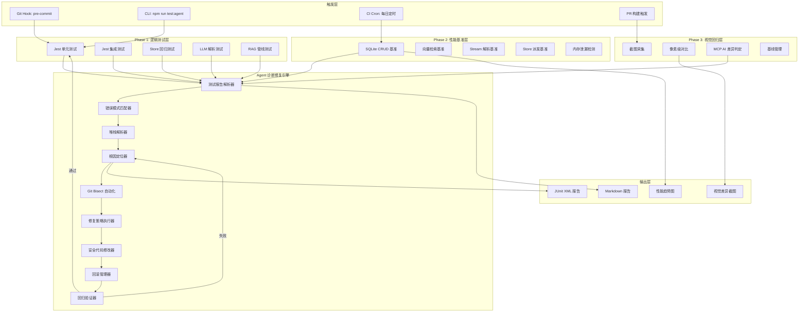
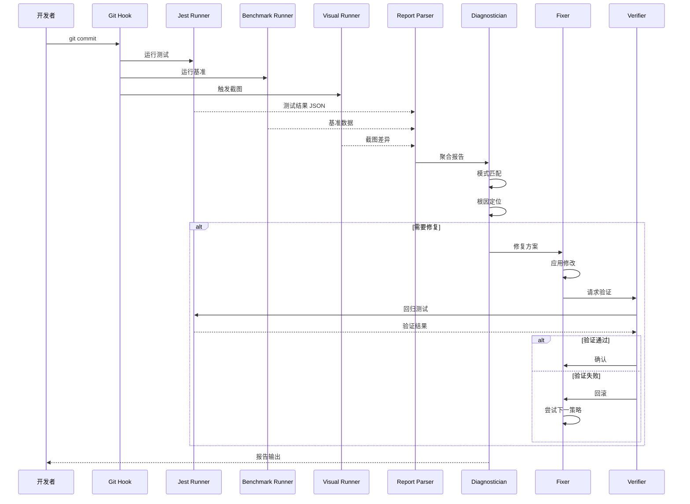
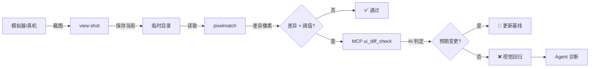
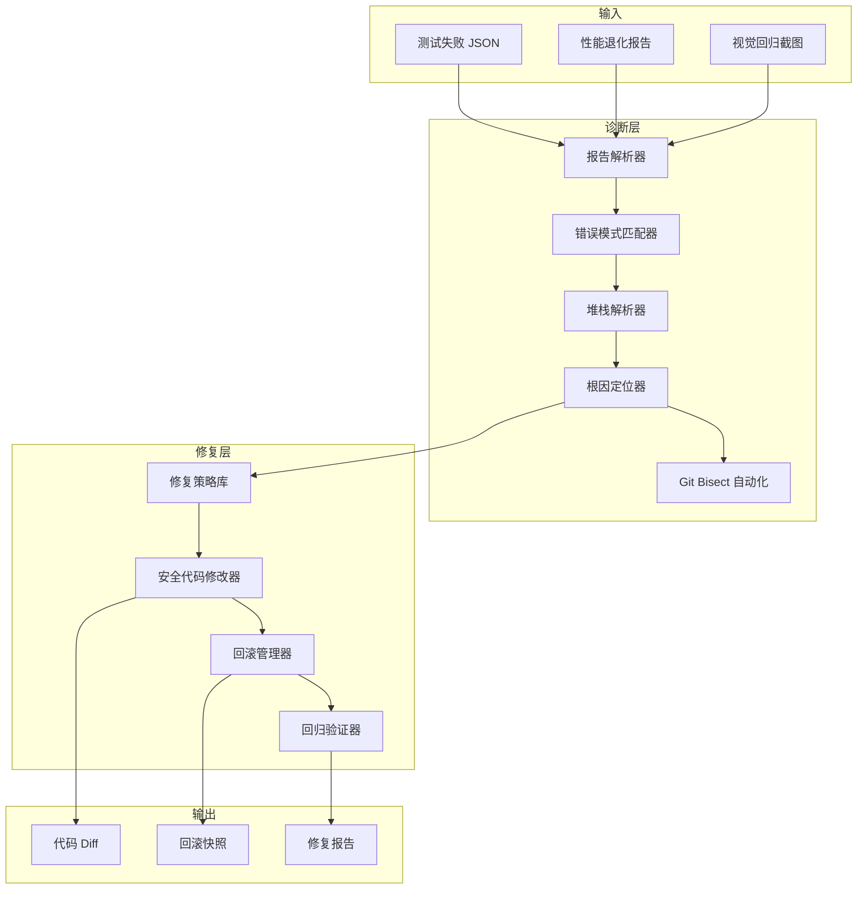

# Agent 全自动测试-诊断-修复闭环系统
# Agent Automated Testing-Diagnosis-Fix Loop System

> **文档版本**: v1.0  
> **创建日期**: 2026-04-22  
> **适用范围**: Nexara (React Native 0.81.5 + Expo 54)  
> **维护者**: Agent Team  
> **状态**: 已批准实施

---

## 目录

1. [系统概述](#1-系统概述)
2. [技术架构](#2-技术架构)
3. [Phase 1：业务逻辑自动化测试](#3-phase-1业务逻辑自动化测试)
4. [Phase 2：性能基准及稳定性测试](#4-phase-2性能基准及稳定性测试)
5. [Phase 3：视觉 UIUX-回归测试](#5-phase-3视觉-uiux-回归测试)
6. [Phase 4：Agent-自主诊断修复引擎](#6-phase-4agent-自主诊断修复引擎)
7. [数据结构定义](#7-数据结构定义)
8. [接口规划](#8-接口规划)
9. [文件清单](#9-文件清单)
10. [实施路线图](#10-实施路线图)
11. [向后兼容性保障](#11-向后兼容性保障)

---

## 1. 系统概述

### 1.1 目标

为 Nexara 项目构建一套**零人工介入**的自动化测试闭环系统，使 Agent 能够在代码提交后自动完成：

```
代码提交 → 测试执行 → 失败诊断 → 根因定位 → 自动修复 → 回归验证 → 报告输出
```

### 1.2 三大测试维度

| 维度 | 覆盖范围 | 测试方式 | 执行频率 |
|------|---------|---------|---------|
| **业务逻辑** | src/lib/、src/store/、src/features/、src/services/ | Jest 单元/集成测试 | 每次提交/PR |
| **性能稳定性** | SQLite、RAG 向量检索、Stream 解析、Store 派发 | 自定义 Benchmark | 每日定时 + PR |
| **视觉 UI/UX** | 关键页面、核心组件、布局一致性 | 截图基线对比 + AI 判定 | PR + 手动触发 |

### 1.3 核心价值

- **开发效率提升**：消除"编译-真机测试-修改-重编译"的手动循环
- **回归覆盖全面**：每次提交自动验证 200+ 测试用例
- **性能退化预警**：自动检测性能退化并 bisect 定位引入提交
- **视觉回归捕获**：AI 自动判定 UI 变更属于预期还是回归

---

## 2. 技术架构

### 2.1 整体架构图



### 2.2 数据流



### 2.3 技术栈矩阵

| 层级 | 技术选型 | 版本 | 用途 |
|------|---------|------|------|
| 测试框架 | Jest | 30.2.0 | 单元/集成测试执行 |
| 测试框架 | @testing-library/react-native | ^13.x | 组件渲染测试 |
| E2E 框架 | Detox | ^25.x | 真机/模拟器 E2E |
| Mock 层 | 自定义 module-alias | - | RN 模块 Node 模拟 |
| 性能基准 | 自定义 Benchmark 框架 | - | 性能度量 |
| 视觉对比 | react-native-view-shot + pixelmatch | ^4.x | 截图对比 |
| AI 视觉判定 | MCP zai-mcp-server | - | ui_diff_check |
| 截图自动化 | Peekaboo CLI (macOS) | - | 模拟器控制 |
| 脚本执行 | tsx | 4.21.0 | Node.js TypeScript |
| 报告生成 | 自定义 Markdown 生成器 | - | 报告输出 |
| CI 集成 | jest-junit | ^13.x | JUnit XML 输出 |

---

## 3. Phase 1：业务逻辑自动化测试

### 3.1 目标

在纯 Node.js 环境中，对项目核心业务逻辑实现 80%+ 的测试覆盖率。

### 3.2 覆盖范围

| 模块 | 文件路径 | 测试文件 | 覆盖目标 |
|------|---------|---------|---------|
| **LLM 层** | src/lib/llm/ | `__tests__/*.test.ts` | 流式解析、厂商适配、消息格式化、错误规范化 |
| **RAG 层** | src/lib/rag/ | `__tests__/*.test.ts` | 向量存储、关键词检索、查询重写、文本切块 |
| **数据库层** | src/lib/db/ | `__tests__/*.test.ts` | Schema 验证、会话持久化 |
| **MCP 协议** | src/lib/mcp/ | `__tests__/*.test.ts` | SSE 传输、协议解析 |
| **技能系统** | src/lib/skills/ | `__tests__/*.test.ts` | 技能注册、存储、加载 |
| **Store 状态** | src/store/ | `__tests__/*.test.ts` | 状态变更、Actions、Selectors |
| **聊天功能** | src/features/chat/ | `__tests__/*.test.ts` | Context 管理、Token 计数、工具调用 |
| **设置功能** | src/features/settings/ | `__tests__/*.test.ts` | 模型选择器、配置持久化 |

### 3.3 测试文件组织

```
src/
├── lib/
│   ├── __tests__/
│   │   ├── artifact-parser.test.ts          ✅ 已有
│   │   ├── stream-parser.test.ts            [NEW] LLM 流式解析
│   │   ├── stream-buffer.test.ts            [NEW] 流缓冲管理
│   │   ├── error-normalizer.test.ts         [NEW] 错误规范化
│   │   ├── message-formatters.test.ts       [NEW] 消息格式化
│   │   ├── model-utils.test.ts              [NEW] 模型工具函数
│   │   └── thinking-detector.test.ts        [NEW] 思考标签检测
│   ├── llm/
│   │   └── __tests__/
│   │       ├── factory.test.ts             [NEW] LLM 工厂
│   │       ├── response-normalizer.test.ts [NEW] 响应规范化
│   │       ├── message-preprocessor.test.ts [NEW] 消息预处理
│   │       └── providers/
│   │           ├── openai.test.ts          [NEW] OpenAI 适配器
│   │           ├── deepseek.test.ts        [NEW] DeepSeek 适配器
│   │           ├── gemini.test.ts          [NEW] Gemini 适配器
│   │           └── zhipu.test.ts           [NEW] 智谱适配器
│   ├── rag/
│   │   └── __tests__/
│   │       ├── vector-store.test.ts        [NEW] 向量存储
│   │       ├── text-splitter.test.ts       [NEW] 文本切块
│   │       ├── keyword-search.test.ts      [NEW] 关键词检索
│   │       ├── query-rewriter.test.ts      [NEW] 查询重写
│   │       ├── embedding.test.ts           [NEW] Embedding 服务
│   │       ├── graph-extractor.test.ts     [NEW] 图谱提取
│   │       ├── reranker.test.ts            [NEW] Rerank 重排
│   │       └── memory-manager.test.ts      [NEW] 记忆管理
│   ├── db/
│   │   └── __tests__/
│   │       ├── schema.test.ts              [NEW] Schema 验证
│   │       ├── session-repository.test.ts  [NEW] 会话仓储
│   │       └── migration.test.ts           [NEW] 迁移测试
│   ├── mcp/
│   │   ├── transports/
│   │   │   └── __tests__/
│   │   │       └── sse-transport.test.ts   ✅ 已有
│   │   └── __tests__/
│   │       ├── mcp-bridge.test.ts         [NEW] MCP 桥接
│   │       └── mcp-client.test.ts          [NEW] MCP 客户端
│   ├── backup/
│   │   └── __tests__/
│   │       ├── backup-manager.test.ts     [NEW] 备份管理
│   │       └── webdav-client.test.ts      [NEW] WebDAV 客户端
│   ├── cache/
│   │   └── __tests__/
│   │       └── cache-manager.test.ts      [NEW] 缓存管理
│   └── skills/
│       └── __tests__/
│           ├── registry.test.ts           [NEW] 技能注册表
│           ├── storage.test.ts            [NEW] 技能存储
│           └── core/
│               └── core-memory.test.ts    [NEW] 核心记忆技能
├── store/
│   └── __tests__/
│       ├── chat-store.test.ts             [NEW] 聊天状态
│       ├── settings-store.test.ts         [NEW] 设置状态
│       ├── rag-store.test.ts              [NEW] RAG 状态
│       ├── mcp-store.test.ts             [NEW] MCP 状态
│       └── api-store.test.ts             [NEW] API 状态
└── features/
    └── chat/
        └── __tests__/
            ├── utils/
            │   ├── context-manager.test.ts [NEW] 上下文管理
            │   ├── token-counter.test.ts   [NEW] Token 计数
            │   ├── artifact-extractor.test.ts [NEW] 工件提取
            │   └── web-search.test.ts      [NEW] 搜索工具
            └── hooks/
                └── useChat.test.ts         [NEW] Chat Hook
```

### 3.4 单元测试编写规范

#### 3.4.1 命名规范

```typescript
describe('<ModuleName>', () => {
  describe('<MethodName>', () => {
    it('应<预期行为>', () => { /* ... */ });
    it('应在<前置条件>下<预期行为>', () => { /* ... */ });
    it('应在<边界条件>时<预期行为>', () => { /* ... */ });
  });
});
```

#### 3.4.2 Mock 规范

- 所有外部依赖（API、文件系统、数据库）必须 Mock
- 使用 `jest.mock()` 进行模块级 Mock
- 使用 `jest.spyOn()` 进行方法级 Spy
- Mock 不得改变被测代码的行为

#### 3.4.3 覆盖率目标

| 层级 | 覆盖率目标 | 关键指标 |
|------|-----------|---------|
| src/lib/llm/ | ≥85% | 流式解析路径全覆盖 |
| src/lib/rag/ | ≥80% | 检索链路全覆盖 |
| src/store/ | ≥90% | 所有 Actions/Reducers |
| src/features/chat/utils/ | ≥75% | 核心工具函数 |

### 3.5 集成测试策略

对于涉及多个模块的集成测试，使用**内存模拟**：

```typescript
// 示例：RAG 管线集成测试
describe('RAG 管线集成', () => {
  let mockDb: InMemorySQLite;
  let mockEmbedding: MockEmbeddingService;
  let vectorStore: VectorStore;
  let ragPipeline: RAGPipeline;

  beforeEach(() => {
    mockDb = new InMemorySQLite();
    mockEmbedding = new MockEmbeddingService();
    vectorStore = new VectorStore(mockDb);
    ragPipeline = new RAGPipeline({ vectorStore, embedding: mockEmbedding });
  });

  it('应完成文档→切块→向量化→检索→重排的完整链路', async () => {
    const doc = '这是一个测试文档。';
    await ragPipeline.index(doc);
    const results = await ragPipeline.query('测试');
    expect(results.length).toBeGreaterThan(0);
  });
});
```

---

## 4. Phase 2：性能基准及稳定性测试

### 4.1 目标

建立性能基准数据库，自动检测性能退化并定位引入退化的提交。

### 4.2 基准测试目标

| 目标模块 | 测试文件 | 度量指标 | 阈值 |
|---------|---------|---------|------|
| **SQLite CRUD** | `src/lib/db/__tests__/benchmark.test.ts` | 单次操作延迟 (ms) | P95 < 10ms |
| **向量检索** | `src/lib/rag/__tests__/vector-store.benchmark.ts` | 检索延迟随数据量增长 | 1000条 < 50ms |
| **文本切块** | `src/lib/rag/__tests__/text-splitter.benchmark.ts` | 不同大小文档切块耗时 | 10KB < 5ms |
| **Stream 解析** | `src/lib/llm/__tests__/stream-parser.benchmark.ts` | 解析耗时 | 1000 tokens < 20ms |
| **Store 派发** | `src/store/__tests__/chat-store.benchmark.ts` | 连续 dispatch 耗时 | 100次 < 100ms |
| **LLM 响应解析** | `src/lib/llm/__tests__/response-normalizer.benchmark.ts` | 响应解析耗时 | < 5ms |

### 4.3 基准测试执行策略

```typescript
// scripts/agent-test/runner/benchmark-runner.ts

interface BenchmarkConfig {
  name: string;
  testFile: string;
  iterations: number;
  warmupRuns: number;
  thresholds: {
    p95: number;
    p99: number;
  };
}

const BENCHMARK_CONFIGS: BenchmarkConfig[] = [
  {
    name: 'sqlite-crud',
    testFile: 'src/lib/db/__tests__/benchmark.test.ts',
    iterations: 1000,
    warmupRuns: 100,
    thresholds: { p95: 10, p99: 20 },
  },
  {
    name: 'vector-search',
    testFile: 'src/lib/rag/__tests__/vector-store.benchmark.ts',
    iterations: 100,
    warmupRuns: 10,
    thresholds: { p95: 50, p99: 100 },
  },
  // ... 更多配置
];

async function runBenchmarks() {
  const results: BenchmarkResult[] = [];
  
  for (const config of BENCHMARK_CONFIGS) {
    console.log(`\n🔬 运行基准测试: ${config.name}`);
    
    // 预热
    for (let i = 0; i < config.warmupRuns; i++) {
      await executeBenchmark(config.testFile, { warmup: true });
    }
    
    // 正式运行
    const timings: number[] = [];
    for (let i = 0; i < config.iterations; i++) {
      const start = performance.now();
      await executeBenchmark(config.testFile);
      timings.push(performance.now() - start);
    }
    
    const result = computeStatistics(timings);
    result.name = config.name;
    result.threshold = config.thresholds;
    
    if (result.p95Ms > config.thresholds.p95) {
      result.regression = true;
      result.severity = result.p95Ms > config.thresholds.p99 
        ? 'critical' 
        : 'moderate';
    }
    
    results.push(result);
    console.log(`  P95: ${result.p95Ms.toFixed(2)}ms, P99: ${result.p99Ms.toFixed(2)}ms`);
  }
  
  return results;
}
```

### 4.4 性能数据存储

```json
// .agent/performance-history/<benchmark-name>/<date>.json
{
  "benchmarkName": "sqlite-crud",
  "timestamp": "2026-04-22T15:00:00Z",
  "gitCommit": "a1b2c3d4",
  "gitBranch": "main",
  "results": {
    "meanMs": 4.2,
    "medianMs": 3.8,
    "p95Ms": 8.5,
    "p99Ms": 12.1,
    "stdDev": 1.3,
    "iterations": 1000
  },
  "regression": false,
  "metadata": {
    "nodeVersion": "20.x",
    "platform": "darwin",
    "arch": "arm64"
  }
}
```

### 4.5 退化检测算法

```typescript
function detectRegression(
  current: BenchmarkResult, 
  history: BenchmarkResult[]
): PerformanceRegression | null {
  if (history.length < 3) return null;
  
  // 取最近 5 次结果的滑动窗口均值作为基线
  const baselineWindow = history.slice(-5);
  const baselineMean = average(baselineWindow.map(r => r.meanMs));
  const baselineStdDev = standardDeviation(baselineWindow.map(r => r.meanMs));
  
  const degradation = (current.meanMs - baselineMean) / baselineMean;
  
  if (degradation > 0.1) { // 10% 退化阈值
    return {
      benchmarkName: current.name,
      baseline: {
        meanMs: baselineMean,
        p95Ms: average(baselineWindow.map(r => r.p95Ms)),
      },
      current,
      degradationPercent: degradation * 100,
      severity: degradation > 0.3 ? 'critical' : degradation > 0.2 ? 'moderate' : 'minor',
    };
  }
  
  return null;
}
```

### 4.6 内存泄漏检测

使用 `weak-maps` 和定期采样检测长期运行中的内存泄漏：

```typescript
// scripts/agent-test/detectors/memory-leak.ts

interface MemorySnapshot {
  timestamp: number;
  heapUsed: number;
  heapTotal: number;
  external: number;
  arrays: Map<string, number>;
  objects: Map<string, number>;
}

export class MemoryLeakDetector {
  private snapshots: MemorySnapshot[] = [];
  private intervalId: NodeJS.Timeout | null = null;
  
  start(intervalMs: number = 5000) {
    this.intervalId = setInterval(() => {
      this.capture();
    }, intervalMs);
  }
  
  stop() {
    if (this.intervalId) clearInterval(this.intervalId);
  }
  
  capture() {
    const mem = process.memoryUsage();
    this.snapshots.push({
      timestamp: Date.now(),
      heapUsed: mem.heapUsed,
      heapTotal: mem.heapTotal,
      external: mem.external,
      arrays: this.trackCollections('arrays'),
      objects: this.trackCollections('objects'),
    });
  }
  
  analyze(): MemoryLeakReport {
    if (this.snapshots.length < 10) {
      return { detected: false, reason: '样本不足' };
    }
    
    // 检测堆内存线性增长趋势
    const heapUsedValues = this.snapshots.map(s => s.heapUsed);
    const trend = this.linearRegression(heapUsedValues);
    
    // 如果斜率 > 0.1 MB/样本，认为存在泄漏
    const slopeMB = trend.slope / 1_000_000;
    if (slopeMB > 0.1) {
      return {
        detected: true,
        slopeMBPerSample: slopeMB,
        estimatedLeakPerMinute: slopeMB * (60000 / 5000),
        peakSnapshot: this.snapshots[this.snapshots.length - 1],
      };
    }
    
    return { detected: false, reason: '未检测到线性增长趋势' };
  }
}
```

---

## 5. Phase 3：视觉 UI/UX 回归测试

### 5.1 目标

对关键页面和核心组件建立截图基线，实现像素级视觉回归检测。

### 5.2 截图采集策略

| 页面/组件 | 采集方式 | 触发时机 |
|---------|---------|---------|
| 聊天主屏幕 | react-native-view-shot | PR + 手动 |
| 设置页面 | react-native-view-shot | PR + 手动 |
| RAG 知识库页面 | react-native-view-shot | PR + 手动 |
| 消息气泡组件 | react-test-renderer + toJSON | 每次提交 |
| 输入框组件 | react-test-renderer + toJSON | 每次提交 |
| 核心 UI 组件 | Storybook 截图 | PR |

### 5.3 截图基线存储

```
.agent/
├── test-baselines/
│   ├── v1.0.0/                    # 按版本分目录
│   │   ├── screens/
│   │   │   ├── chat-screen.light.iphone15.png
│   │   │   ├── chat-screen.dark.iphone15.png
│   │   │   ├── settings-screen.light.iphone15.png
│   │   │   ├── rag-screen.light.iphone15.png
│   │   │   └── ...
│   │   ├── components/
│   │   │   ├── message-bubble.user.png
│   │   │   ├── message-bubble.assistant.png
│   │   │   ├── chat-input.png
│   │   │   └── ...
│   │   └── manifest.json
│   └── current -> v1.0.0          # 软链接指向当前版本
├── test-diffs/
│   ├── <commit-hash>/
│   │   ├── chat-screen.diff.png   # 差异区域高亮图
│   │   ├── chat-screen.baseline.png
│   │   ├── chat-screen.current.png
│   │   └── report.json
│   └── ...
└── test-reports/
    └── visual/
        └── <date>.json
```

### 5.4 视觉对比流程



### 5.5 MCP AI 视觉判定

使用 `ui_diff_check` MCP 工具进行两图对比：

```typescript
// scripts/agent-test/runner/visual-runner.ts

interface VisualDiffConfig {
  baselineDir: string;
  currentDir: string;
  diffDir: string;
  pixelThreshold: number;     // 默认 0.05 (5%)
  perceptualThreshold: number; // 感知阈值
}

async function analyzeVisualDiff(
  baselinePath: string,
  currentPath: string,
  diffPath: string
): Promise<VisualAnalysisResult> {
  // 像素级对比
  const pixelDiff = await pixelmatch(baselinePath, currentPath, diffPath, {
    threshold: 0.1,
    diffMask: true,
  });
  
  if (pixelDiff.percentage < config.pixelThreshold) {
    return { status: 'pass', diffPercentage: pixelDiff.percentage };
  }
  
  // 超过阈值，调用 MCP AI 判定
  const mcpResult = await mcp_call_tool({
    serverName: 'zai-mcp-server',
    toolName: 'ui_diff_check',
    arguments: JSON.stringify({
      baseline: baselinePath,
      current: currentPath,
      diff: diffPath,
      expectedChange: false,
    }),
  });
  
  return {
    status: mcpResult.isExpected ? 'expected' : 'regression',
    diffPercentage: pixelDiff.percentage,
    aiReason: mcpResult.reason,
    confidence: mcpResult.confidence,
  };
}
```

### 5.6 模拟器自动化截图

使用 macOS 界面自动化 skill 控制模拟器：

```typescript
// scripts/agent-test/utils/simulator-screenshot.ts

import { execSync } from 'child_process';

export class SimulatorScreenshot {
  private deviceId: string;
  
  constructor(deviceId: string = 'iPhone 15') {
    this.deviceId = deviceId;
  }
  
  async capture(screenName: string): Promise<string> {
    const outputPath = `/tmp/${screenName}-${Date.now()}.png`;
    
    // 等待模拟器完全加载
    await this.waitForBoot();
    
    // 使用 xcrin simctl 截图
    execSync(
      `xcrun simctl io "${this.deviceId}" screenshot "${outputPath}"`,
      { stdio: 'pipe' }
    );
    
    return outputPath;
  }
  
  async navigateToScreen(screenPath: string): Promise<void> {
    // 通过 URL Scheme 导航
    execSync(
      `xcrun simctl openurl "${this.deviceId}" "nexara://${screenPath}"`,
      { stdio: 'pipe' }
    );
    
    // 等待页面渲染
    await this.delay(2000);
  }
  
  private async waitForBoot(): Promise<void> {
    let attempts = 0;
    while (attempts < 30) {
      try {
        const status = execSync(
          `xcrun simctl io "${this.deviceId}" status_boot`,
          { encoding: 'utf8' }
        );
        if (status.includes('Booted')) return;
      } catch {
        // 忽略错误，继续尝试
      }
      await this.delay(1000);
      attempts++;
    }
    throw new Error(`模拟器 ${this.deviceId} 启动超时`);
  }
  
  private delay(ms: number): Promise<void> {
    return new Promise(resolve => setTimeout(resolve, ms));
  }
}
```

---

## 6. Phase 4：Agent 自主诊断修复引擎

### 6.1 架构概览



### 6.2 诊断流程详解

#### 6.2.1 测试报告解析

```typescript
// scripts/agent-test/parser/jest-parser.ts

interface ParsedFailure {
  testFile: string;
  testName: string;
  errorMessage: string;
  errorType: 'assertion' | 'runtime' | 'timeout' | 'compile';
  stackTrace: string[];
  relevantFiles: string[];
}

export function parseJestJsonReport(reportPath: string): ParsedFailure[] {
  const report = JSON.parse(readFileSync(reportPath, 'utf8'));
  const failures: ParsedFailure[] = [];
  
  for (const test of report.testResults) {
    for (const assert of test.assertionResults || []) {
      if (assert.status === 'failed') {
        const stackLines = assert.failureMessages
          .flatMap(msg => msg.split('\n'));
        
        failures.push({
          testFile: test.name,
          testName: assert.fullName,
          errorMessage: assert.failureMessages[0].split('\n')[0],
          errorType: classifyError(assert.failureMessages[0]),
          stackTrace: stackLines.filter(line => 
            line.includes('/src/') || line.includes('node_modules/')
          ),
          relevantFiles: extractRelevantFiles(stackLines),
        });
      }
    }
  }
  
  return failures;
}
```

#### 6.2.2 错误模式匹配

```typescript
// scripts/agent-test/diagnostician/error-patterns.ts

interface ErrorPattern {
  pattern: RegExp;
  category: DiagnosisCategory;
  severity: 'low' | 'medium' | 'high' | 'critical';
  description: string;
  likelyCauses: string[];
  suggestedFixTemplate: string;
}

const ERROR_PATTERNS: ErrorPattern[] = [
  {
    pattern: /Cannot read properties of undefined \(reading '(\w+)'\)/,
    category: 'type_error',
    severity: 'high',
    description: '尝试访问 undefined 的属性',
    likelyCauses: [
      '变量未初始化',
      'API 响应数据结构不符合预期',
      '可选链缺失',
    ],
    suggestedFixTemplate: `
      // 原因分析: {{propertyName}} 可能为 undefined
      // 建议修复:
      const value = obj?.{{propertyName}};
      // 或使用默认值:
      const value = obj?.{{propertyName}} ?? defaultValue;
    `,
  },
  {
    pattern: /Expected: (.+)\s+Received: (.+)/,
    category: 'assertion_error',
    severity: 'medium',
    description: '断言失败',
    likelyCauses: [
      '预期值计算错误',
      'Mock 数据不符合真实场景',
      '边界条件未覆盖',
    ],
    suggestedFixTemplate: `
      // 断言失败分析:
      // 预期: {{expected}}
      // 实际: {{received}}
      // 请检查测试数据和被测函数的逻辑
    `,
  },
  {
    pattern: /Async callback was not called within timeout of (\d+)ms/,
    category: 'async_error',
    severity: 'high',
    description: '异步操作超时',
    likelyCauses: [
      '异步操作未完成',
      'Mock 未正确 resolve/reject',
      'Promise 链断裂',
    ],
    suggestedFixTemplate: `
      // 超时修复建议:
      // 1. 检查异步操作是否正常完成
      // 2. 增加 jest.setTimeout() 超时时间
      // 3. 使用 jest.useFakeTimers() 测试异步代码
    `,
  },
  {
    pattern: /op-sqlite: (.+)/,
    category: 'mock_error',
    severity: 'medium',
    description: 'op-sqlite 操作错误',
    likelyCauses: [
      'op-sqlite Mock 未正确配置',
      'SQL 语法错误',
      '表结构不匹配',
    ],
    suggestedFixTemplate: `
      // op-sqlite 错误排查:
      // 1. 检查 Mock 配置: scripts/mocks/op-sqlite.ts
      // 2. 检查 SQL 语句语法
      // 3. 验证表结构定义
    `,
  },
  {
    pattern: /TypeError: (.+) is not a function/,
    category: 'type_error',
    severity: 'high',
    description: '调用了非函数对象',
    likelyCauses: [
      '导入路径错误',
      '模块未正确导出',
      '循环依赖',
    ],
    suggestedFixTemplate: `
      // 函数调用错误排查:
      // 1. 检查导入路径是否正确
      // 2. 检查模块是否正确导出该函数
      // 3. 检查是否存在循环依赖
    `,
  },
];
```

#### 6.2.3 堆栈解析与根因定位

```typescript
// scripts/agent-test/diagnostician/stack-trace.ts

interface StackFrame {
  file: string;
  line: number;
  column: number;
  function: string;
  isProjectFile: boolean;
}

export function parseStackTrace(error: string): StackFrame[] {
  const lines = error.split('\n');
  const frames: StackFrame[] = [];
  
  for (const line of lines) {
    const match = line.match(
      /at\s+(?:(.+)\s+)?\((.+):(\d+):(\d+)\)/
    );
    
    if (match) {
      const [, functionName, file, lineNum, col] = match;
      frames.push({
        file,
        line: parseInt(lineNum, 10),
        column: parseInt(col, 10),
        function: functionName || '<anonymous>',
        isProjectFile: file.includes('/src/'),
      });
    }
  }
  
  return frames;
}

export function findRootCause(frames: StackFrame[]): StackFrame | null {
  // 优先返回第一个项目文件中的堆栈帧
  const projectFrames = frames.filter(f => f.isProjectFile);
  return projectFrames[0] || null;
}

export function getContextAroundFrame(
  file: string, 
  line: number, 
  contextLines: number = 5
): string[] {
  const content = readFileSync(file, 'utf8').split('\n');
  const start = Math.max(0, line - contextLines - 1);
  const end = Math.min(content.length, line + contextLines);
  
  return content.slice(start, end).map((l, i) => {
    const lineNum = start + i + 1;
    const marker = lineNum === line ? '>>>' : '   ';
    return `${marker} ${lineNum}: ${l}`;
  });
}
```

#### 6.2.4 Git Bisect 自动化

```typescript
// scripts/agent-test/diagnostician/git-bisect.ts

interface BisectResult {
  commit: string;
  message: string;
  author: string;
  date: string;
  isFirstBad: boolean;
}

export async function bisectPerformanceRegression(
  benchmarkName: string,
  baselineCommit: string,
  currentCommit: string
): Promise<BisectResult[]> {
  const badCommits: string[] = [];
  
  // 使用 git bisect 自动查找引入退化的提交
  execSync('git bisect start', { stdio: 'pipe' });
  execSync(`git bisect bad ${currentCommit}`, { stdio: 'pipe' });
  execSync(`git bisect good ${baselineCommit}`, { stdio: 'pipe' });
  
  let current = execSync('git rev-parse HEAD', { encoding: 'utf8' }).trim();
  
  while (true) {
    // 运行基准测试
    const result = await runSingleBenchmark(benchmarkName, current);
    
    if (result.regression) {
      execSync('git bisect bad', { stdio: 'pipe' });
    } else {
      execSync('git bisect good', { stdio: 'pipe' });
    }
    
    // 获取下一次测试的提交
    const next = execSync('git rev-parse HEAD', { encoding: 'utf8' }).trim();
    
    if (next === current) {
      // bisect 完成
      break;
    }
    
    current = next;
  }
  
  execSync('git bisect reset', { stdio: 'pipe' });
  
  // 获取 bad commit 信息
  const log = execSync(
    `git log --oneline -5 ${baselineCommit}..${currentCommit}`,
    { encoding: 'utf8' }
  );
  
  return log.split('\n').map(line => {
    const [hash, ...msgParts] = line.split(' ');
    const message = msgParts.join(' ');
    
    // 获取提交详情
    const details = execSync(
      `git log -1 --format="%an|%ad" ${hash}`,
      { encoding: 'utf8' }
    ).trim().split('|');
    
    return {
      commit: hash,
      message,
      author: details[0],
      date: details[1],
      isFirstBad: badCommits.includes(hash),
    };
  });
}
```

### 6.3 修复策略库

```typescript
// scripts/agent-test/fixer/strategies.ts

interface FixStrategy {
  category: DiagnosisCategory;
  condition: (diagnosis: DiagnosisResult) => boolean;
  apply: (diagnosis: DiagnosisResult) => Promise<FixResult>;
  priority: number;
}

const FIX_STRATEGIES: FixStrategy[] = [
  // 策略 1: Mock 缺失修复
  {
    category: 'mock_error',
    condition: (d) => d.errorMessage.includes('op-sqlite'),
    apply: async (diagnosis) => {
      const mockPath = 'scripts/mocks/op-sqlite.ts';
      const current = readFileSync(mockPath, 'utf8');
      
      // 分析缺失的操作类型
      const opType = extractSqlOperation(diagnosis.errorMessage);
      
      // 添加缺失的 Mock 实现
      const newMock = generateMockImplementation(opType);
      const updated = current + '\n' + newMock;
      
      return safeWriteFile(mockPath, updated, current);
    },
    priority: 1,
  },
  
  // 策略 2: 可选链修复
  {
    category: 'type_error',
    condition: (d) => d.errorMessage.includes("Cannot read properties of undefined"),
    apply: async (diagnosis) => {
      const { file, line } = diagnosis.rootFile;
      const content = readFileSync(file, 'utf8').split('\n');
      const problematicLine = content[line - 1];
      
      // 检测需要添加可选链的位置
      const fixedLine = addOptionalChaining(problematicLine);
      content[line - 1] = fixedLine;
      
      return safeWriteFile(file, content.join('\n'), readFileSync(file, 'utf8'));
    },
    priority: 2,
  },
  
  // 策略 3: 测试数据修复
  {
    category: 'assertion_error',
    condition: (d) => d.testName.includes('应正确处理'),
    apply: async (diagnosis) => {
      // 分析预期值和实际值的差异
      const { expected, received } = extractExpectedReceived(diagnosis.errorMessage);
      
      // 智能调整测试数据或被测代码
      if (isDataMismatch(expected, received)) {
        // 更新测试数据
        return updateTestData(diagnosis.testFile, expected, received);
      } else {
        // 可能是被测代码 Bug，需要人工审查
        return {
          status: 'needs_manual_review',
          reason: '断言失败可能是被测代码 Bug',
          confidence: 0.3,
        };
      }
    },
    priority: 3,
  },
  
  // 策略 4: 异步超时修复
  {
    category: 'async_error',
    condition: (d) => d.errorMessage.includes('timeout'),
    apply: async (diagnosis) => {
      const { file, line } = diagnosis.rootFile;
      const content = readFileSync(file, 'utf8');
      
      // 增加 Jest 超时配置
      const fixed = content.replace(
        /(\btest\s*\([^)]*,\s*)(\(\) =>)/,
        '$1async () =>'
      );
      
      return safeWriteFile(file, fixed, content);
    },
    priority: 4,
  },
];
```

### 6.4 安全代码修改器

```typescript
// scripts/agent-test/fixer/code-modifier.ts

interface SafeWriteResult {
  success: boolean;
  backupPath: string;
  newContent: string;
  diff: string;
}

export function safeWriteFile(
  filePath: string,
  newContent: string,
  originalContent: string
): SafeWriteResult {
  // 1. 创建备份
  const backupPath = `${filePath}.backup.${Date.now()}`;
  writeFileSync(backupPath, originalContent);
  
  // 2. 生成 Diff
  const diff = generateDiff(originalContent, newContent, filePath);
  
  // 3. 写入新内容
  writeFileSync(filePath, newContent);
  
  // 4. 验证写入
  const verification = readFileSync(filePath, 'utf8');
  if (verification !== newContent) {
    // 写入验证失败，回滚
    writeFileSync(filePath, originalContent);
    throw new Error(`文件写入验证失败: ${filePath}`);
  }
  
  return {
    success: true,
    backupPath,
    newContent,
    diff,
  };
}

export function rollback(filePath: string, backupPath: string): void {
  const backup = readFileSync(backupPath, 'utf8');
  writeFileSync(filePath, backup);
  console.log(`🔄 已回滚: ${filePath}`);
}
```

### 6.5 回归验证器

```typescript
// scripts/agent-test/fixer/verifier.ts

export async function verifyFix(
  diagnosis: DiagnosisResult,
  modifiedFiles: string[]
): Promise<VerificationResult> {
  console.log(`\n🔍 验证修复: ${diagnosis.testName}`);
  
  // 1. 运行相关测试
  const testResult = await runJestTests({
    testNamePattern: diagnosis.testName,
    verbose: true,
  });
  
  if (testResult.success) {
    return {
      passed: true,
      message: '修复验证通过',
      testDuration: testResult.duration,
    };
  }
  
  // 2. 验证失败，尝试回滚
  console.log('⚠️ 修复未通过测试，尝试回滚...');
  
  for (const file of modifiedFiles) {
    const backups = glob(`${file}.backup.*`);
    if (backups.length > 0) {
      // 使用最新的备份
      const latestBackup = backups.sort().pop()!;
      rollback(file, latestBackup);
    }
  }
  
  return {
    passed: false,
    message: '修复验证失败，已回滚',
    testErrors: testResult.errors,
  };
}
```

---

## 7. 数据结构定义

### 7.1 测试报告结构

```typescript
// scripts/agent-test/types/test-report.ts

/**
 * 单个测试用例结果
 */
export interface TestResult {
  suiteName: string;
  testName: string;
  status: 'passed' | 'failed' | 'skipped' | 'timedOut';
  duration: number; // 毫秒
  error?: TestError;
  filePath: string;
  lineNumber?: number;
  columnNumber?: number;
}

/**
 * 测试错误信息
 */
export interface TestError {
  message: string;
  stack: string;
  type: 'assertion' | 'runtime' | 'timeout' | 'compile' | 'unknown';
  expected?: string;
  received?: string;
}

/**
 * 完整测试运行报告
 */
export interface TestRunReport {
  meta: ReportMeta;
  summary: TestSummary;
  coverage?: CoverageReport;
  results: TestResult[];
  failedTests: TestResult[];
}

export interface ReportMeta {
  timestamp: string;          // ISO8601
  gitBranch: string;
  gitCommit: string;
  gitAuthor: string;
  nodeVersion: string;
  platform: string;
  testDuration: number;       // 总耗时 ms
  runner: 'jest' | 'detox' | 'custom';
}

export interface TestSummary {
  totalTests: number;
  passed: number;
  failed: number;
  skipped: number;
  timedOut: number;
  passRate: number;           // 0-1
}

export interface CoverageReport {
  lines: CoverageMetric;
  branches: CoverageMetric;
  functions: CoverageMetric;
  statements: CoverageMetric;
}

export interface CoverageMetric {
  total: number;
  covered: number;
  skipped: number;
  pct: number;               // 百分比 0-100
}
```

### 7.2 诊断结果结构

```typescript
// scripts/agent-test/types/diagnosis.ts

/**
 * 诊断类别枚举
 */
export type DiagnosisCategory = 
  | 'logic_error'      // 业务逻辑错误
  | 'type_error'        // 类型错误
  | 'async_error'       // 异步错误
  | 'mock_error'        // Mock 配置错误
  | 'regression'        // 回归问题
  | 'performance'       // 性能问题
  | 'visual'           // 视觉回归
  | 'unknown';         // 未知

/**
 * 诊断严重程度
 */
export type Severity = 'low' | 'medium' | 'high' | 'critical';

/**
 * 单个测试失败的诊断结果
 */
export interface DiagnosisResult {
  id: string;                           // 唯一标识
  testResult: TestResult;               // 原始测试结果
  category: DiagnosisCategory;
  severity: Severity;
  
  // 根因信息
  rootFile: string;
  rootLine: number;
  rootFunction?: string;
  rootContext: string[];                // 周围代码上下文
  
  // 修复信息
  suggestedFix: string;
  fixConfidence: number;                // 0-1
  fixStrategy?: string;
  
  // 元数据
  timestamp: string;
  processingTimeMs: number;
}

/**
 * 诊断会话结果
 */
export interface DiagnosisSession {
  id: string;
  startedAt: string;
  completedAt?: string;
  testReport: TestRunReport;
  diagnoses: DiagnosisResult[];
  summary: DiagnosisSummary;
}

export interface DiagnosisSummary {
  totalDiagnosed: number;
  byCategory: Record<DiagnosisCategory, number>;
  bySeverity: Record<Severity, number>;
  autoFixable: number;
  needsManualReview: number;
}
```

### 7.3 修复结果结构

```typescript
// scripts/agent-test/types/fix.ts

/**
 * 修复结果
 */
export interface FixResult {
  id: string;
  diagnosis: DiagnosisResult;
  
  // 修改信息
  status: 'applied' | 'rolled_back' | 'needs_manual' | 'skipped';
  filesModified: FileModification[];
  
  // 验证信息
  verificationPassed: boolean;
  verificationErrors?: string[];
  
  // 回滚信息
  rollbackNeeded: boolean;
  backupPaths: string[];
  
  // 元数据
  attemptedAt: string;
  completedAt?: string;
  durationMs: number;
}

/**
 * 文件修改记录
 */
export interface FileModification {
  filePath: string;
  operation: 'create' | 'modify' | 'delete';
  diff: string;
  backupPath?: string;
}

/**
 * 完整修复会话结果
 */
export interface FixSession {
  id: string;
  diagnosisSessionId: string;
  startedAt: string;
  completedAt?: string;
  results: FixResult[];
  summary: FixSummary;
}

export interface FixSummary {
  totalAttempted: number;
  succeeded: number;
  rolledBack: number;
  needsManual: number;
  skipped: number;
}
```

### 7.4 性能基准结构

```typescript
// scripts/agent-test/types/benchmark.ts

/**
 * 单个基准测试结果
 */
export interface BenchmarkResult {
  name: string;
  description?: string;
  
  // 统计数据
  iterations: number;
  meanMs: number;
  medianMs: number;
  minMs: number;
  maxMs: number;
  p95Ms: number;
  p99Ms: number;
  stdDev: number;
  
  // 阈值
  thresholds: {
    p95: number;
    p99: number;
    mean: number;
  };
  
  // 回归检测
  regression: boolean;
  severity?: 'minor' | 'moderate' | 'critical';
  degradationPercent?: number;
  
  // 元数据
  timestamp: string;
  gitCommit: string;
  gitBranch: string;
  nodeVersion: string;
  platform: string;
  arch: string;
}

/**
 * 性能报告
 */
export interface PerformanceReport {
  timestamp: string;
  gitBranch: string;
  gitCommit: string;
  benchmarks: BenchmarkResult[];
  regressions: PerformanceRegression[];
  memorySnapshots?: MemorySnapshot[];
}

export interface PerformanceRegression {
  benchmarkName: string;
  baseline: Pick<BenchmarkResult, 'meanMs' | 'p95Ms' | 'p99Ms'>;
  current: BenchmarkResult;
  degradationPercent: number;
  severity: 'minor' | 'moderate' | 'critical';
  likelyCommit?: string;
  likelyCauses: string[];
}

export interface MemorySnapshot {
  timestamp: number;
  heapUsed: number;
  heapTotal: number;
  external: number;
  rss: number;
}

export interface MemoryLeakReport {
  detected: boolean;
  slopeMBPerSample?: number;
  estimatedLeakPerMinute?: number;
  peakSnapshot?: MemorySnapshot;
  reason?: string;
}
```

### 7.5 视觉测试结构

```typescript
// scripts/agent-test/types/visual.ts

/**
 * 截图基线记录
 */
export interface BaselineEntry {
  id: string;
  screenName: string;
  componentName?: string;
  variant: 'light' | 'dark';
  device: string;
  resolution: { width: number; height: number };
  baselinePath: string;
  version: string;
  createdAt: string;
  createdBy: string;
  hash: string;  // 图片内容 hash
}

/**
 * 视觉对比结果
 */
export interface VisualDiffResult {
  baselineEntry: BaselineEntry;
  currentPath: string;
  diffPath: string;
  
  // 对比数据
  pixelDiffPercentage: number;
  diffPixelCount: number;
  totalPixels: number;
  
  // AI 判定
  aiAnalysis?: {
    status: 'pass' | 'expected' | 'regression';
    reason: string;
    confidence: number;      // 0-1
    suggestions?: string[];
  };
  
  timestamp: string;
  gitCommit: string;
}

/**
 * 视觉测试报告
 */
export interface VisualTestReport {
  timestamp: string;
  gitBranch: string;
  gitCommit: string;
  totalScreens: number;
  passed: number;
  failed: number;
  skipped: number;
  results: VisualDiffResult[];
  newBaselines: BaselineEntry[];
}

/**
 * 基线清单 manifest
 */
export interface BaselineManifest {
  version: string;
  createdAt: string;
  entries: BaselineEntry[];
  deviceConfig: DeviceConfig;
}

export interface DeviceConfig {
  model: string;
  os: string;
  osVersion: string;
  screenScale: number;
  locale: string;
}
```

---

## 8. 接口规划

### 8.1 CLI 入口接口

```bash
# 完整测试-诊断-修复流程
npm run test:agent

# 仅运行测试（不诊断修复）
npm run test:agent -- --mode test-only

# 仅诊断（不修复）
npm run test:agent -- --mode diagnose-only

# 仅运行基准测试
npm run test:agent -- --mode benchmark

# 仅运行视觉测试
npm run test:agent -- --mode visual

# 指定测试范围
npm run test:agent -- --scope src/lib/llm
npm run test:agent -- --scope src/store
npm run test:agent -- --test-name "应正确处理"

# 跳过修复（仅报告）
npm run test:agent -- --no-fix

# 输出格式
npm run test:agent -- --format json   # JSON 报告
npm run test:agent -- --format markdown  # Markdown 报告

# 视觉测试专用
npm run test:agent -- --mode visual --device "iPhone 15 Pro"
npm run test:agent -- --mode visual --update-baselines
```

### 8.2 Agent Test CLI 核心模块接口

```typescript
// scripts/agent-test/cli.ts

interface AgentTestCLIOptions {
  mode: 'full' | 'test-only' | 'diagnose-only' | 'benchmark' | 'visual';
  scope?: string;           // 测试范围
  testName?: string;        // 测试名称过滤
  noFix?: boolean;          // 跳过自动修复
  format?: 'json' | 'markdown';
  verbose?: boolean;
  device?: string;          // 视觉测试设备
  updateBaselines?: boolean;
}

async function main(options: AgentTestCLIOptions): Promise<void> {
  const logger = new Logger(options.verbose);
  
  // 1. 初始化
  logger.info('🚀 Agent Test Framework 启动');
  logger.info(`模式: ${options.mode}`);
  
  // 2. 加载配置
  const config = loadConfig();
  
  // 3. 根据模式执行
  switch (options.mode) {
    case 'full':
      await runFullPipeline(logger, config);
      break;
    case 'test-only':
      await runTestsOnly(logger, config, options);
      break;
    case 'diagnose-only':
      await runDiagnoseOnly(logger, config);
      break;
    case 'benchmark':
      await runBenchmarkOnly(logger, config);
      break;
    case 'visual':
      await runVisualOnly(logger, config, options);
      break;
  }
  
  // 4. 输出报告
  await generateReport(logger, config, options);
}
```

### 8.3 测试运行器接口

```typescript
// scripts/agent-test/runner/test-runner.ts

interface TestRunnerOptions {
  scope?: string;
  testNamePattern?: string;
  coverage?: boolean;
  jsonOutput: string;
  maxWorkers?: number;
}

interface TestRunnerResult {
  success: boolean;
  reportPath: string;
  duration: number;
  exitCode: number;
}

export class JestRunner {
  constructor(private config: TestRunnerConfig) {}
  
  async run(options: TestRunnerOptions): Promise<TestRunnerResult> {
    const args = this.buildJestArgs(options);
    return this.execute(args, options);
  }
  
  async runWithRetry(
    options: TestRunnerOptions,
    maxRetries: number = 2
  ): Promise<TestRunnerResult> {
    let lastResult: TestRunnerResult;
    
    for (let i = 0; i <= maxRetries; i++) {
      try {
        lastResult = await this.run(options);
        if (lastResult.success) return lastResult;
      } catch (error) {
        if (i === maxRetries) throw error;
        await this.delay(1000 * (i + 1)); // 指数退避
      }
    }
    
    return lastResult!;
  }
  
  private buildJestArgs(options: TestRunnerOptions): string[] {
    const args = [
      'npx', 'jest',
      '--json',
      `--outputFile=${options.jsonOutput}`,
    ];
    
    if (options.scope) {
      args.push(options.scope);
    }
    
    if (options.testNamePattern) {
      args.push(`--testNamePattern=${options.testNamePattern}`);
    }
    
    if (options.coverage) {
      args.push('--coverage');
    }
    
    if (options.maxWorkers) {
      args.push(`--maxWorkers=${options.maxWorkers}`);
    }
    
    // 现有 jest.config.js 配置
    args.push('--config=jest.config.js');
    
    return args;
  }
}
```

### 8.4 诊断引擎接口

```typescript
// scripts/agent-test/diagnostician/engine.ts

interface DiagnosticianOptions {
  maxProcessingTime?: number;  // 最大处理时间 ms
  confidenceThreshold?: number; // 最小置信度
  enableBisect?: boolean;
}

export class Diagnostician {
  constructor(
    private options: DiagnosticianOptions = {}
  ) {
    this.patternMatcher = new ErrorPatternMatcher();
    this.stackParser = new StackTraceParser();
    this.rootCauseLocator = new RootCauseLocator();
  }
  
  async diagnose(report: TestRunReport): Promise<DiagnosisSession> {
    const session: DiagnosisSession = {
      id: generateId(),
      startedAt: new Date().toISOString(),
      testReport: report,
      diagnoses: [],
      summary: {
        totalDiagnosed: 0,
        byCategory: {} as Record<DiagnosisCategory, number>,
        bySeverity: {} as Record<Severity, number>,
        autoFixable: 0,
        needsManualReview: 0,
      },
    };
    
    for (const failedTest of report.failedTests) {
      const diagnosis = await this.diagnoseSingle(failedTest);
      session.diagnoses.push(diagnosis);
      
      // 更新汇总
      session.summary.totalDiagnosed++;
      session.summary.byCategory[diagnosis.category]++;
      session.summary.bySeverity[diagnosis.severity]++;
      
      if (diagnosis.fixConfidence > 0.7) {
        session.summary.autoFixable++;
      } else {
        session.summary.needsManualReview++;
      }
    }
    
    session.completedAt = new Date().toISOString();
    return session;
  }
  
  private async diagnoseSingle(test: TestResult): Promise<DiagnosisResult> {
    const startTime = Date.now();
    
    // 1. 错误模式匹配
    const pattern = this.patternMatcher.match(test.error!);
    
    // 2. 堆栈解析
    const stackFrames = this.stackParser.parse(test.error!.stack);
    const rootFrame = this.stackParser.findRootCause(stackFrames);
    
    // 3. 获取代码上下文
    let rootContext: string[] = [];
    if (rootFrame) {
      rootContext = this.stackParser.getContext(rootFrame.file, rootFrame.line);
    }
    
    // 4. 生成修复建议
    const suggestedFix = this.generateFixSuggestion(test, pattern, rootFrame);
    
    return {
      id: generateId(),
      testResult: test,
      category: pattern.category,
      severity: pattern.severity,
      rootFile: rootFrame?.file || '',
      rootLine: rootFrame?.line || 0,
      rootFunction: rootFrame?.function,
      rootContext,
      suggestedFix,
      fixConfidence: pattern.confidence,
      timestamp: new Date().toISOString(),
      processingTimeMs: Date.now() - startTime,
    };
  }
}
```

### 8.5 修复引擎接口

```typescript
// scripts/agent-test/fixer/engine.ts

interface FixEngineOptions {
  maxRetries?: number;
  enableRollback?: boolean;
  requireHumanApproval?: boolean;
}

export class FixEngine {
  constructor(
    private options: FixEngineOptions = {}
  ) {
    this.strategyRegistry = new StrategyRegistry();
  }
  
  async fix(diagnosisSession: DiagnosisSession): Promise<FixSession> {
    const session: FixSession = {
      id: generateId(),
      diagnosisSessionId: diagnosisSession.id,
      startedAt: new Date().toISOString(),
      results: [],
      summary: {
        totalAttempted: diagnosisSession.diagnoses.length,
        succeeded: 0,
        rolledBack: 0,
        needsManual: 0,
        skipped: 0,
      },
    };
    
    for (const diagnosis of diagnosisSession.diagnoses) {
      // 置信度低于阈值则跳过
      if (diagnosis.fixConfidence < 0.5) {
        session.results.push({
          id: generateId(),
          diagnosis,
          status: 'skipped',
          filesModified: [],
          verificationPassed: false,
          rollbackNeeded: false,
          backupPaths: [],
          attemptedAt: new Date().toISOString(),
        });
        session.summary.skipped++;
        continue;
      }
      
      // 尝试修复
      const fixResult = await this.attemptFix(diagnosis);
      session.results.push(fixResult);
      
      if (fixResult.status === 'applied') {
        session.summary.succeeded++;
      } else if (fixResult.status === 'rolled_back') {
        session.summary.rolledBack++;
      } else if (fixResult.status === 'needs_manual') {
        session.summary.needsManual++;
      }
    }
    
    session.completedAt = new Date().toISOString();
    return session;
  }
  
  private async attemptFix(diagnosis: DiagnosisResult): Promise<FixResult> {
    const startTime = Date.now();
    const strategy = this.strategyRegistry.get(diagnosis.category);
    
    if (!strategy) {
      return {
        id: generateId(),
        diagnosis,
        status: 'needs_manual',
        filesModified: [],
        verificationPassed: false,
        rollbackNeeded: false,
        backupPaths: [],
        attemptedAt: new Date().toISOString(),
        completedAt: new Date().toISOString(),
        durationMs: Date.now() - startTime,
      };
    }
    
    try {
      const fixResult = await strategy.apply(diagnosis);
      
      if (fixResult.success) {
        // 验证修复
        const verified = await this.verifyFix(diagnosis, fixResult);
        
        if (verified) {
          return {
            id: generateId(),
            diagnosis,
            status: 'applied',
            filesModified: fixResult.modifiedFiles,
            verificationPassed: true,
            rollbackNeeded: false,
            backupPaths: fixResult.backupPaths,
            attemptedAt: new Date().toISOString(),
            completedAt: new Date().toISOString(),
            durationMs: Date.now() - startTime,
          };
        } else {
          // 验证失败，回滚
          await this.rollback(fixResult);
          return {
            id: generateId(),
            diagnosis,
            status: 'rolled_back',
            filesModified: fixResult.modifiedFiles,
            verificationPassed: false,
            rollbackNeeded: true,
            backupPaths: fixResult.backupPaths,
            attemptedAt: new Date().toISOString(),
            completedAt: new Date().toISOString(),
            durationMs: Date.now() - startTime,
          };
        }
      }
    } catch (error) {
      console.error(`修复失败: ${error}`);
    }
    
    return {
      id: generateId(),
      diagnosis,
      status: 'needs_manual',
      filesModified: [],
      verificationPassed: false,
      rollbackNeeded: false,
      backupPaths: [],
      attemptedAt: new Date().toISOString(),
      completedAt: new Date().toISOString(),
      durationMs: Date.now() - startTime,
    };
  }
  
  private async verifyFix(
    diagnosis: DiagnosisResult,
    fix: FixResult
  ): Promise<boolean> {
    // 运行相关测试
    const result = await jestRunner.run({
      testNamePattern: diagnosis.testName,
      jsonOutput: '/tmp/verify-result.json',
    });
    
    return result.success;
  }
  
  private async rollback(fix: FixResult): Promise<void> {
    for (const mod of fix.modifiedFiles) {
      const backup = mod.backupPath;
      if (backup) {
        rollbackFile(mod.filePath, backup);
      }
    }
  }
}
```

---

## 9. 文件清单

### 9.1 新增目录结构

```
scripts/
├── agent-test/
│   ├── cli.ts                    # CLI 入口
│   ├── config.ts                 # 配置加载
│   ├── types/
│   │   ├── index.ts              # 统一导出
│   │   ├── test-report.ts        # 测试报告类型
│   │   ├── diagnosis.ts          # 诊断类型
│   │   ├── fix.ts                # 修复类型
│   │   ├── benchmark.ts          # 基准类型
│   │   └── visual.ts             # 视觉类型
│   ├── runner/
│   │   ├── index.ts
│   │   ├── test-runner.ts        # Jest 测试执行器
│   │   ├── benchmark-runner.ts   # 性能基准执行器
│   │   └── visual-runner.ts      # 视觉测试执行器
│   ├── parser/
│   │   ├── index.ts
│   │   ├── jest-parser.ts        # Jest 报告解析
│   │   ├── benchmark-parser.ts   # 基准数据解析
│   │   └── visual-parser.ts      # 视觉差异解析
│   ├── diagnostician/
│   │   ├── index.ts
│   │   ├── engine.ts             # 诊断引擎主逻辑
│   │   ├── error-patterns.ts     # 错误模式库
│   │   ├── stack-trace.ts        # 堆栈解析器
│   │   ├── root-cause.ts         # 根因定位器
│   │   └── git-bisect.ts         # Git bisect 自动化
│   ├── fixer/
│   │   ├── index.ts
│   │   ├── engine.ts             # 修复引擎主逻辑
│   │   ├── strategies.ts         # 修复策略库
│   │   ├── code-modifier.ts      # 安全代码修改器
│   │   └── rollback.ts           # 回滚管理器
│   ├── reporter/
│   │   ├── index.ts
│   │   ├── markdown-reporter.ts  # Markdown 报告生成
│   │   ├── json-reporter.ts      # JSON 报告生成
│   │   └── junit-reporter.ts     # JUnit XML 输出
│   ├── detectors/
│   │   ├── index.ts
│   │   └── memory-leak.ts         # 内存泄漏检测
│   └── utils/
│       ├── index.ts
│       ├── file-ops.ts           # 安全文件操作
│       ├── git.ts                # Git 操作封装
│       ├── logger.ts             # 日志工具
│       ├── id-generator.ts        # ID 生成器
│       └── simulator-screenshot.ts # 模拟器截图工具
├── mocks/
│   ├── op-sqlite.ts              # [升级] 内存 SQLite 模拟
│   ├── async-storage.ts          # [升级] 内存存储模拟
│   ├── expo-file-system.ts       # [升级] 文件系统模拟
│   ├── expo-haptics.ts           # [NEW] 触感反馈模拟
│   ├── expo-clipboard.ts         # [NEW] 剪贴板模拟
│   ├── expo-image-picker.ts      # [NEW] 图片选择器模拟
│   ├── expo-router.ts            # [NEW] 路由模拟
│   ├── expo-image.ts             # [NEW] 图片加载模拟
│   ├── expo-sharing.ts           # [NEW] 分享模拟
│   ├── expo-keep-awake.ts        # [NEW] 屏幕常亮模拟
│   ├── react-native-reanimated.ts # [NEW] 动画模拟
│   ├── react-native-gesture-handler.ts # [NEW] 手势模拟
│   ├── react-native-keyboard-controller.ts # [NEW] 键盘模拟
│   ├── react-native-view-shot.ts # [NEW] 截图模拟
│   ├── react-native-svg.ts       # [NEW] SVG 模拟
│   ├── react-native-screens.ts   # [NEW] 屏幕模拟
│   ├── react-native-safe-area-context.ts # [NEW] 安全区模拟
│   ├── react-native-skia.ts       # [NEW] Skia 模拟
│   ├── llama-rn.ts               # [NEW] 本地 LLM 模拟
│   ├── @shopify-flash-list.ts    # [NEW] FlashList 模拟
│   ├── @shopify-react-native-skia.ts # [NEW] Skia 模拟
│   ├── react-native-webview.ts   # [NEW] WebView 模拟
│   └── react-native-sse.ts       # [NEW] SSE 模拟

src/
├── lib/
│   ├── __tests__/
│   │   ├── stream-parser.test.ts
│   │   ├── stream-buffer.test.ts
│   │   ├── error-normalizer.test.ts
│   │   ├── message-formatters.test.ts
│   │   ├── model-utils.test.ts
│   │   └── thinking-detector.test.ts
│   ├── llm/
│   │   └── __tests__/
│   │       ├── factory.test.ts
│   │       ├── response-normalizer.test.ts
│   │       ├── message-preprocessor.test.ts
│   │       └── providers/
│   │           ├── openai.test.ts
│   │           ├── deepseek.test.ts
│   │           ├── gemini.test.ts
│   │           └── zhipu.test.ts
│   ├── rag/
│   │   └── __tests__/
│   │       ├── vector-store.test.ts
│   │       ├── text-splitter.test.ts
│   │       ├── keyword-search.test.ts
│   │       ├── query-rewriter.test.ts
│   │       ├── embedding.test.ts
│   │       ├── graph-extractor.test.ts
│   │       ├── reranker.test.ts
│   │       └── memory-manager.test.ts
│   ├── db/
│   │   └── __tests__/
│   │       ├── schema.test.ts
│   │       ├── session-repository.test.ts
│   │       ├── migration.test.ts
│   │       └── benchmark.test.ts
│   ├── mcp/
│   │   └── __tests__/
│   │       ├── mcp-bridge.test.ts
│   │       └── mcp-client.test.ts
│   ├── backup/
│   │   └── __tests__/
│   │       ├── backup-manager.test.ts
│   │       └── webdav-client.test.ts
│   ├── cache/
│   │   └── __tests__/
│   │       └── cache-manager.test.ts
│   └── skills/
│       └── __tests__/
│           ├── registry.test.ts
│           ├── storage.test.ts
│           └── core/
│               └── core-memory.test.ts
├── store/
│   └── __tests__/
│       ├── chat-store.test.ts
│       ├── settings-store.test.ts
│       ├── rag-store.test.ts
│       ├── mcp-store.test.ts
│       ├── api-store.test.ts
│       └── chat-store.benchmark.ts
└── features/
    └── chat/
        └── __tests__/
            ├── utils/
            │   ├── context-manager.test.ts
            │   ├── token-counter.test.ts
            │   ├── artifact-extractor.test.ts
            │   └── web-search.test.ts
            └── hooks/
                └── useChat.test.ts

.agent/
├── docs/
│   └── plans/
│       ├── agent-test-framework-v1.md  # 本文档
│       ├── phase1-logic-tests.md       # Phase 1 详细设计
│       ├── phase2-benchmark.md         # Phase 2 详细设计
│       ├── phase3-visual.md            # Phase 3 详细设计
│       └── phase4-diagnosis.md         # Phase 4 详细设计
├── performance-history/
│   ├── sqlite-crud/
│   │   └── <date>.json
│   ├── vector-search/
│   │   └── <date>.json
│   └── ... (按基准测试名分目录)
├── test-baselines/
│   ├── <version>/
│   │   ├── screens/
│   │   ├── components/
│   │   └── manifest.json
│   └── current -> <version>
├── test-diffs/
│   └── <commit-hash>/
│       ├── <screen>.diff.png
│       └── report.json
├── test-reports/
│   ├── <date>-full.json
│   ├── <date>-benchmark.json
│   └── <date>-visual.json
└── memory/
    └── TESTING_FRAMEWORK_MEMORY.md  # 测试框架状态记忆
```

### 9.2 修改文件清单

| 文件路径 | 操作 | 修改说明 |
|---------|------|---------|
| `jest.config.js` | 修改 | 新增 `setupFiles`, `moduleNameMapper` 配置 |
| `scripts/test-setup.ts` | 修改 | 新增更多 Mock 注册 |
| `package.json` | 修改 | 新增 `test:agent` script 和依赖 |
| `scripts/tsconfig-test.json` | 修改 | 新增 paths 配置 |
| `src/lib/llm/stream-parser.ts` | 测试覆盖 | 需添加单元测试 |
| `src/lib/llm/error-normalizer.ts` | 测试覆盖 | 需添加单元测试 |
| `src/store/chat/index.ts` | 测试覆盖 | 需添加状态回归测试 |

### 9.3 新增 npm 依赖

| 包名 | 版本 | 用途 |
|------|------|------|
| `@testing-library/react-native` | ^13.x | 组件渲染测试 |
| `jest-junit` | ^13.x | JUnit XML 报告输出 |
| `pixelmatch` | ^5.x | 图片像素对比 |
| `pngjs` | ^7.x | PNG 图片处理 |
| `weak-map` | ^1.x | 内存泄漏检测辅助 |
| `statistic` | ^1.x | 统计分析（基准数据） |

---

## 10. 实施路线图

### 10.1 时间线

```
Week 1-2: Phase 1 核心 — Mock 基础设施 + 基础单元测试
Week 3-4: Phase 1 扩展 — Store 测试 + RAG 测试 + LLM 层测试
Week 5-6: Phase 2 — 性能基准框架 + 退化检测
Week 7-8: Phase 3 — 视觉回归测试管线 + MCP AI 判定
Week 9-10: Phase 4 — Agent 诊断修复引擎
Week 11-12: 集成 + CLI + CI 集成 + 完善文档
```

### 10.2 Phase 1 详细计划

#### 第 1 周：Mock 基础设施 + 基础测试框架

**Day 1-2：扩展 Mock 基础设施**
- 升级 `op-sqlite.ts` 为内存 SQLite 模拟（支持 execute/executeAsync）
- 升级 `async-storage.ts` 为内存存储模拟
- 升级 `expo-file-system.ts` 支持目录操作

**Day 3-4：新增 React Native 模块 Mock**
- expo-haptics, expo-clipboard, expo-image-picker
- expo-router, react-native-reanimated, react-native-gesture-handler
- react-native-keyboard-controller, react-native-view-shot, react-native-svg

**Day 5：更新 Jest 配置**
- 更新 `jest.config.js` 的 `setupFiles` 和 `moduleNameMapper`
- 验证所有现有测试仍然通过

**Day 6-7：搭建 Agent Test CLI 骨架**
- 创建 `scripts/agent-test/` 目录结构
- 实现 `cli.ts`、`types/`、`utils/logger.ts`
- 实现基础的 `JestRunner`

#### 第 2 周：核心模块单元测试

**Day 8-10：src/lib/ 核心模块测试**
- stream-parser.test.ts（LLM 流式解析）
- error-normalizer.test.ts（错误规范化）
- message-formatters.test.ts（消息格式化）
- model-utils.test.ts（模型工具函数）
- thinking-detector.test.ts（思考标签检测）

**Day 11-12：src/lib/llm/ 测试**
- factory.test.ts（LLM 工厂）
- response-normalizer.test.ts（响应规范化）
- providers/ 目录下各厂商适配器测试

**Day 13-14：src/lib/db/ 测试**
- schema.test.ts（Schema 验证）
- session-repository.test.ts（会话仓储）

#### 第 3 周：Store + RAG 测试

**Day 15-17：src/store/ 测试**
- chat-store.test.ts（聊天状态）
- settings-store.test.ts（设置状态）
- rag-store.test.ts（RAG 状态）

**Day 18-20：src/lib/rag/ 测试**
- vector-store.test.ts（向量存储）
- text-splitter.test.ts（文本切块）
- keyword-search.test.ts（关键词检索）
- query-rewriter.test.ts（查询重写）

#### 第 4 周：功能层测试 + 报告生成

**Day 21-23：src/features/ 测试**
- context-manager.test.ts（上下文管理）
- token-counter.test.ts（Token 计数）
- useChat.test.ts（Chat Hook）

**Day 24-25：报告生成器**
- Markdown 报告生成器
- JSON 报告生成器
- JUnit XML 输出

**Day 26-28：Phase 1 收尾**
- 覆盖率报告集成
- Mock 文档编写
- Phase 1 验收

### 10.3 Phase 2 详细计划

#### 第 5-6 周：性能基准框架

**基准测试实现**
- `scripts/agent-test/runner/benchmark-runner.ts`
- `src/lib/db/__tests__/benchmark.test.ts`
- `src/lib/rag/__tests__/vector-store.benchmark.ts`
- `src/lib/rag/__tests__/text-splitter.benchmark.ts`
- `src/lib/llm/__tests__/stream-parser.benchmark.ts`
- `src/store/__tests__/chat-store.benchmark.ts`

**退化检测实现**
- 基准数据存储（`.agent/performance-history/`）
- 滑动窗口均值基线计算
- 退化检测算法
- 告警阈值配置

**内存泄漏检测**
- `scripts/agent-test/detectors/memory-leak.ts`
- 堆内存采样
- 线性趋势分析

### 10.4 Phase 3 详细计划

#### 第 7-8 周：视觉回归测试

**截图采集**
- 模拟器截图工具
- 关键页面截图脚本
- 基线管理（创建、更新、删除）

**像素对比**
- pixelmatch 集成
- 差异区域高亮生成
- 阈值配置

**MCP AI 判定**
- `ui_diff_check` MCP 工具调用
- AI 判定结果解析
- 预期变更自动更新基线

### 10.5 Phase 4 详细计划

#### 第 9-10 周：Agent 诊断修复引擎

**诊断引擎**
- 错误模式库扩展（覆盖 20+ 常见错误）
- 堆栈解析器完善
- 根因定位器优化

**修复引擎**
- 修复策略库扩展
- 安全代码修改器
- 回滚管理器

**Git Bisect 自动化**
- 性能退化 bisect 定位
- 自动化 bisect 脚本

### 10.6 Phase 5：集成与 CI

#### 第 11-12 周：完整集成

**CLI 集成**
- `npm run test:agent` 完整流程
- 参数解析和配置
- 错误处理和日志

**CI 集成**
- GitHub Actions / GitLab CI 配置
- PR 自动测试
- 定时基准测试

---

## 11. 向后兼容性保障

### 11.1 现有测试保护

在实施过程中，必须确保以下现有测试文件持续通过：

```
✅ src/lib/__tests__/artifact-parser.test.ts
✅ src/native/Sanitizer/__tests__/sanitizer.test.ts
✅ src/native/TextSplitter/__tests__/text-splitter.test.ts
✅ src/native/TokenCounter/__tests__/token-counter.test.ts
✅ src/lib/mcp/transports/__tests__/sse-transport.test.ts
```

**保护策略**：
- 每次修改 `jest.config.js` 或 `test-setup.ts` 后，立即运行 `npm test` 验证现有测试
- 在 CI 中设置 gate：现有测试必须 100% 通过才能合入
- Mock 升级采用增量方式，不破坏现有 Mock 行为

### 11.2 Mock 兼容性策略

所有新增 Mock 必须遵循以下规范：

```typescript
// ✅ 正确的 Mock 导出
export const open = () => ({
  execute: async () => ({ rows: [] }),
  executeAsync: async () => ({ rows: [] }),
});

// ✅ 支持方法链式调用
export class MockClass {
  method1() { return this; }
  method2() { return this; }
}
```

### 11.3 TypeScript 配置兼容性

测试代码使用独立的 `tsconfig`（`scripts/tsconfig-test.json`），不影响主项目配置。

---

## 附录

### A. 错误模式库初始模板

| 错误模式 | 类别 | 严重度 | 修复置信度 |
|---------|------|--------|-----------|
| `Cannot read properties of undefined` | type_error | high | 0.85 |
| `Expected: ... Received: ...` | assertion_error | medium | 0.7 |
| `Async callback was not called within timeout` | async_error | high | 0.75 |
| `op-sqlite:` | mock_error | medium | 0.9 |
| `is not a function` | type_error | high | 0.8 |
| `Cannot find module` | module_error | critical | 0.95 |
| `ZodError` | validation_error | medium | 0.85 |
| `JSON.parse` | parse_error | medium | 0.8 |
| `Maximum update depth exceeded` | react_error | critical | 0.6 |
| `undefined is not an object` | type_error | high | 0.85 |

### B. 性能阈值配置

```json
// .agent/test-config/performance-thresholds.json
{
  "benchmarks": {
    "sqlite-crud": {
      "p95": 10,
      "p99": 20,
      "mean": 5
    },
    "vector-search": {
      "p95": 50,
      "p99": 100,
      "mean": 20
    },
    "text-splitting": {
      "p95": 5,
      "p99": 10,
      "mean": 2
    },
    "stream-parsing": {
      "p95": 20,
      "p99": 50,
      "mean": 10
    },
    "store-dispatch": {
      "p95": 100,
      "p99": 200,
      "mean": 50
    }
  },
  "regression": {
    "degradationThreshold": 0.1,
    "criticalThreshold": 0.3,
    "historyWindowSize": 5
  }
}
```

### C. 视觉测试设备配置

```json
// .agent/test-config/devices.json
{
  "simulators": [
    {
      "name": "iPhone 15 Pro",
      "id": "iPhone15Pro",
      "width": 1179,
      "height": 2556,
      "scale": 3,
      "os": "iOS 17.x"
    },
    {
      "name": "iPhone 15",
      "id": "iPhone15",
      "width": 1170,
      "height": 2532,
      "scale": 3,
      "os": "iOS 17.x"
    }
  ],
  "pixelDiffThreshold": 0.05,
  "aiConfidenceThreshold": 0.8
}
```

---

*文档结束 — 本文档为 Agent 全自动测试框架的完整实施方案，涵盖架构设计、数据结构、接口规划、文件清单和实施路线图，可直接用于指导开发工作。*
