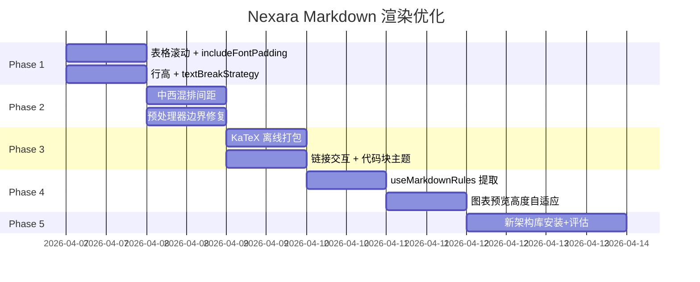

# Nexara Markdown 渲染全面优化 — 分阶段实施方案 v2

> 审计基础：7 个核心组件，对标 LobeChat / ChatGPT / NextChat  
> 关键发现：项目**已启用 New Architecture** (`"newArchEnabled": true`, RN 0.81.5)

---

## Phase 1: Quick Wins（≤2h）— 中文排版基础 + 表格修复

### Task 1.1: 表格横向滚动

**目标**：修复多列表格在手机端被截断的问题

**文件**：[ChatBubble.tsx](file:///home/lengz/Codex/Nexara/src/features/chat/components/ChatBubble.tsx)

**改动点 1 — 添加 `ScrollView` 导入**（第 1-16 行区域）：
- 确认 `ScrollView` 已从 `react-native` 导入（第 12 行已有，确认即可）

**改动点 2 — 修改 `markdownRules.table`**（约第 1218-1228 行）：

将当前：
```tsx
table: (node: any, children: any) => (
    <View key={node.key} style={{
        borderWidth: 1,
        borderColor: isDark ? 'rgba(255,255,255,0.15)' : 'rgba(0,0,0,0.15)',
        borderRadius: 6,
        marginVertical: 10,
        overflow: 'hidden',
    }}>
        {children}
    </View>
),
```

替换为：
```tsx
table: (node: any, children: any) => (
    <ScrollView
        key={node.key}
        horizontal
        showsHorizontalScrollIndicator={true}
        style={{ marginVertical: 10 }}
        contentContainerStyle={{ flexGrow: 1 }}
    >
        <View style={{
            borderWidth: 1,
            borderColor: isDark ? 'rgba(255,255,255,0.15)' : 'rgba(0,0,0,0.15)',
            borderRadius: 6,
            overflow: 'hidden',
            minWidth: '100%',
        }}>
            {children}
        </View>
    </ScrollView>
),
```

**改动点 3 — 修改 `markdownRules.td`**（约第 1257-1274 行）：

将 `flex: 1` 替换为 `minWidth: 80`，添加 `maxWidth: 200`：
```tsx
td: (node: any, children: any) => {
    const align = node.attributes?.align;
    return (
        <View key={node.key}
            style={{
                minWidth: 80,
                maxWidth: 200,
                paddingVertical: 5,
                paddingHorizontal: 8,
                borderBottomWidth: 1,
                borderRightWidth: 1,
                borderColor: isDark ? 'rgba(255,255,255,0.06)' : 'rgba(0,0,0,0.05)',
                alignItems: align === 'center' ? 'center' : align === 'right' ? 'flex-end' : 'flex-start',
            }}
        >
            <Text style={{ fontSize: 13, color: isDark ? '#d4d4d8' : '#3f3f46', lineHeight: 20, includeFontPadding: false }}>{children}</Text>
        </View>
    );
},
```

**改动点 4 — 修改 `markdownRules.th`**（约第 1235-1251 行）：

同样替换为 `minWidth: 80`，添加 `includeFontPadding: false`：
```tsx
th: (node: any, children: any) => {
    const align = node.attributes?.align;
    return (
        <View key={node.key}
            style={{
                minWidth: 80,
                maxWidth: 200,
                paddingVertical: 6,
                paddingHorizontal: 10,
                backgroundColor: isDark ? 'rgba(255,255,255,0.08)' : 'rgba(0,0,0,0.05)',
                borderBottomWidth: 1,
                borderColor: isDark ? 'rgba(255,255,255,0.12)' : 'rgba(0,0,0,0.08)',
                alignItems: align === 'center' ? 'center' : align === 'right' ? 'flex-end' : 'flex-start',
            }}
        >
            <Text style={{ fontWeight: 'bold', fontSize: 13, color: isDark ? '#e4e4e7' : '#27272a', includeFontPadding: false }}>{children}</Text>
        </View>
    );
},
```

**验证**：发送包含 6 列以上表格的消息，确认可以横向滚动；发送 2 列表格确认仍然全宽显示。

---

### Task 1.2: Android `includeFontPadding` 全局统一

**目标**：消除 Android 中文额外上下 padding

**文件**：[markdown-utils.ts](file:///home/lengz/Codex/Nexara/src/lib/markdown/markdown-utils.ts)

**改动点**（第 164-195 行，`markdownStyles` 对象）：

将 `body` 样式修改为：
```ts
body: {
    fontSize: 16,
    lineHeight: 26,           // ← 从 24 提升至 26 (1.625x)
    color: '#3f3f46',
    includeFontPadding: false, // ← 新增
    textAlignVertical: 'center' as const, // ← 新增
},
```

将 `paragraph` 修改为：
```ts
paragraph: {
    marginTop: 8,
    marginBottom: 8,
    lineHeight: 26,            // ← 从 24 提升至 26
},
```

新增 `text` 基础样式：
```ts
text: {
    includeFontPadding: false,
    textAlignVertical: 'center' as const,
},
```

完整修改后的 `markdownStyles`：
```ts
export const markdownStyles = {
    body: {
        fontSize: 16,
        lineHeight: 26,
        color: '#3f3f46',
        includeFontPadding: false,
        textAlignVertical: 'center' as const,
    },
    text: {
        includeFontPadding: false,
        textAlignVertical: 'center' as const,
    },
    heading1: {
        marginTop: 24,
        marginBottom: 16,
        lineHeight: 32,
        fontWeight: '700',
        borderBottomWidth: 0.5,
        borderBottomColor: '#e4e4e7',
    },
    heading2: {
        marginTop: 24,
        marginBottom: 16,
        lineHeight: 28,
        fontWeight: '600',
        borderBottomWidth: 0.5,
        borderBottomColor: '#e4e4e7',
    },
    paragraph: {
        marginTop: 8,
        marginBottom: 8,
        lineHeight: 26,
    },
    list_item: {
        marginTop: 4,
        marginBottom: 4,
    },
};
```

**验证**：在 Android 设备上对比修改前后中文段落的行间距和顶部 padding。

---

### Task 1.3: 移除 `textBreakStrategy="simple"`

**目标**：让 Android 使用 `highQuality` 策略，自动遵循 CJK 标点禁则

**文件**：[ChatBubble.tsx](file:///home/lengz/Codex/Nexara/src/features/chat/components/ChatBubble.tsx)

**改动点 1**（第 1175 行）：

将：
```tsx
return <Text key={node.key} style={styles.text} textBreakStrategy="simple">{content}</Text>;
```
替换为：
```tsx
return <Text key={node.key} style={styles.text}>{content}</Text>;
```

**改动点 2**（第 1204 行）：

将：
```tsx
<Text key={index} style={styles.text} textBreakStrategy="simple">
```
替换为：
```tsx
<Text key={index} style={styles.text}>
```

**验证**：在 Android 设备上测试包含中文句末标点（。！？）的长段落，确认标点不会出现在行首。

---

### Task 1.4: AI 气泡 Markdown 样式同步行高

**目标**：确保 AI 消息气泡中使用更新后的行高

**文件**：[ChatBubble.tsx](file:///home/lengz/Codex/Nexara/src/features/chat/components/ChatBubble.tsx)

**改动点 1 — 用户消息 Markdown 样式**（约第 1390-1420 行区域）：

找到用户消息的 `<Markdown>` 的 `style` prop 中的 `body` 和 `text`，更新 `lineHeight`：
```tsx
body: {
    ...commonMarkdownStyles.body,
    color: isDark ? '#fafafa' : '#18181b',
    fontSize: 15,
    lineHeight: 25, // ← 从原来的 commonMarkdownStyles.body.lineHeight(24→26) 调整为 15*1.67=25
    textAlign: 'left',
},
text: {
    color: isDark ? '#ffffff' : '#18181b',
    fontSize: 15,
    lineHeight: 25,
    fontWeight: '500',
    includeFontPadding: false,
},
```

**改动点 2 — AI 消息 StreamingCardList 样式**（约第 1723-1796 行区域）：

在 `markdownStyles` 中更新：
```tsx
body: {
    ...commonMarkdownStyles.body,
    color: isDark ? Colors.dark.textPrimary : '#27272A',
    fontSize: 15,
    lineHeight: 25,
},
text: {
    color: isDark ? Colors.dark.textPrimary : '#27272A',
    fontSize: 15,
    lineHeight: 25,
    includeFontPadding: false,
},
```

**验证**：对比修改前后 AI 长文本消息的中文行间距，应更舒适、不拥挤。

---

## Phase 2: 中文排版增强 + 预处理器修复（2-4h）

### Task 2.1: 中西混排自动间距

**目标**：在中文与英文/数字之间自动插入空格

**文件**：[markdown-utils.ts](file:///home/lengz/Codex/Nexara/src/lib/markdown/markdown-utils.ts)

**改动点**（在 `preprocessMarkdown` 函数中，步骤 3 和步骤 4 之间，约第 52 行之后）：

在 `// ━━ 4. 中文智能换行 ━━` 之前插入：

```ts
    // ━━ 3.5. 中西文混排间距（pangu.js 规则）━━
    // 中文后紧跟拉丁字母/数字 → 插入空格
    processed = processed.replace(/([\u4e00-\u9fa5\u3400-\u4dbf])([A-Za-z0-9])/g, '$1 $2');
    // 拉丁字母/数字后紧跟中文 → 插入空格
    processed = processed.replace(/([A-Za-z0-9])([\u4e00-\u9fa5\u3400-\u4dbf])/g, '$1 $2');
```

> [!NOTE]
> 该规则在保护块之后执行，因此不会影响代码块和行内代码中的内容。已有空格时正则不会匹配（因为 `[A-Za-z0-9]` 不匹配空格），所以是幂等的。

**验证**：
- 输入 `"使用React开发"` → 预处理后应为 `"使用 React 开发"`
- 输入 `"共100个"` → 预处理后应为 `"共 100 个"`
- 输入 `"使用 React 开发"` → 不变（幂等）
- 代码块 `` `使用React` `` 内不应受影响

---

### Task 2.2: 预处理器边界修复

**目标**：修复预处理器的已知边界问题

**文件**：[markdown-utils.ts](file:///home/lengz/Codex/Nexara/src/lib/markdown/markdown-utils.ts)

**改动点 1 — 提高中文智能换行阈值**（第 12 行）：

```ts
const LINE_BREAK_THRESHOLD = 120; // ← 从 80 提升至 120
```

**改动点 2 — 修复 3d' 规则的误匹配**（约第 48 行）：

将：
```ts
// 3d'. 修复粘连的 bullet + bold
processed = processed.replace(/\*\*\*([^*\n]+)\*\*(?!\*)/g, '\n* **$1**');
```

替换为更精确的匹配（仅匹配行首的粘连情况）：
```ts
// 3d'. 修复粘连的 bullet + bold（仅行首场景，避免误匹配合法的 bold+italic）
processed = processed.replace(/^(\*\*\*)((?=[^*])([^*\n]+))\*\*(?!\*)/gm, '\n* **$3**');
```

**改动点 3 — 加强保护块占位符**（约第 25-28 行）：

将：
```ts
processed = processed.replace(/(```[\s\S]*?```|`[^`]+`)/g, (match) => {
    protectedBlocks.push(match);
    return `\x00PB${protectedBlocks.length - 1}\x00`;
});
```

替换为（使用更独特的占位符避免冲突）：
```ts
const PB_PREFIX = '\x00\x01PB_';
const PB_SUFFIX = '_PB\x01\x00';
processed = processed.replace(/(```[\s\S]*?```|`[^`]+`)/g, (match) => {
    protectedBlocks.push(match);
    return `${PB_PREFIX}${protectedBlocks.length - 1}${PB_SUFFIX}`;
});
```

相应修改恢复代码（约第 58-60 行）：
```ts
protectedBlocks.forEach((block, i) => {
    processed = processed.replace(`${PB_PREFIX}${i}${PB_SUFFIX}`, block);
});
```

**验证**：编写单元测试：
```ts
// 测试用例
expect(preprocessMarkdown('使用React开发')).toBe('使用 React 开发');
expect(preprocessMarkdown('***加粗斜体***正文')).not.toContain('\n*'); // 不应误拆
expect(preprocessMarkdown('`code里面\\[不转换\\]`')).toContain('\\['); // 代码块保护
```

---

## Phase 3: KaTeX 离线 + 链接交互 + 代码块主题（4-8h）

### Task 3.1: KaTeX 本地离线打包

**目标**：让数学公式在离线环境下可渲染

**步骤 1 — 下载 KaTeX 资源**：
```bash
# 下载 KaTeX JS (minified)
curl -L "https://cdn.jsdelivr.net/npm/katex@0.16.9/dist/katex.min.js" -o assets/web-libs/katex.min.bundle

# 下载 KaTeX CSS (内联约 90KB)
curl -L "https://cdn.jsdelivr.net/npm/katex@0.16.9/dist/katex.min.css" -o assets/web-libs/katex.min.css
```

> [!WARNING]
> KaTeX CSS 引用了字体文件（woff2）。需要确认 WebView 是否能通过 CSS 中的相对路径加载打包字体。如果不行，需要将 CSS 中的字体 URL 替换为 CDN 绝对路径（字体体积大，不适合本地打包）或内联为 base64。

**步骤 2 — 注册资源模块**

**文件**：[webview-assets.ts](file:///home/lengz/Codex/Nexara/src/lib/webview-assets.ts)

在 `ASSET_MODULES` 中添加（第 5-8 行区域）：
```ts
const ASSET_MODULES = {
  echarts: require('../../assets/web-libs/echarts.min.bundle'),
  mermaid: require('../../assets/web-libs/mermaid.min.bundle'),
  katex_js: require('../../assets/web-libs/katex.min.bundle'),   // ← 新增
  katex_css: require('../../assets/web-libs/katex.min.css'),     // ← 新增
} as const;
```

**步骤 3 — 修改 MathRenderer**

**文件**：[MathRenderer.tsx](file:///home/lengz/Codex/Nexara/src/components/chat/MathRenderer.tsx)

**改动点 1** — 添加 import（文件顶部）：
```tsx
import { resolveLocalLibUri, scriptTagWithFallback } from '../../lib/webview-assets';
```

**改动点 2** — 加载本地资源（组件内，约第 77 行附近）：
```tsx
const [localKatexJsUri, setLocalKatexJsUri] = React.useState<string | null>(null);
const [localKatexCssUri, setLocalKatexCssUri] = React.useState<string | null>(null);

React.useEffect(() => {
    resolveLocalLibUri('katex_js').then(uri => setLocalKatexJsUri(uri));
    resolveLocalLibUri('katex_css').then(uri => setLocalKatexCssUri(uri));
}, []);
```

**改动点 3** — 替换 HTML 中的 CDN 标签（`htmlSource` 的 useMemo 中，约第 125-202 行）：

将：
```html
<link rel="stylesheet" href="https://cdn.jsdelivr.net/npm/katex@0.16.9/dist/katex.min.css">
<script src="https://cdn.jsdelivr.net/npm/katex@0.16.9/dist/katex.min.js"></script>
```

替换为：
```ts
const katexCssTag = localKatexCssUri
    ? `<link rel="stylesheet" href="${localKatexCssUri}" onerror="(function(){var l=document.createElement('link');l.rel='stylesheet';l.href='https://cdn.jsdelivr.net/npm/katex@0.16.9/dist/katex.min.css';document.head.appendChild(l);})()">`
    : `<link rel="stylesheet" href="https://cdn.jsdelivr.net/npm/katex@0.16.9/dist/katex.min.css">`;

const katexJsTag = scriptTagWithFallback('katex_js', localKatexJsUri, 'https://cdn.jsdelivr.net/npm/katex@0.16.9/dist/katex.min.js');
```

然后在 HTML 模板中使用 `${katexCssTag}` 和 `${katexJsTag}` 替换原有的硬编码标签。

**注意**：需要把 `localKatexJsUri` 和 `localKatexCssUri` 加入 `htmlSource` 的 `useMemo` 依赖数组。

**验证**：打开飞行模式，发送包含 `$E=mc^2$` 和 `$$\int_0^\infty e^{-x}dx$$` 的消息，确认公式能正确渲染。

---

### Task 3.2: 链接交互规则

**目标**：为 Markdown 中的超链接添加视觉反馈和点击处理

**文件**：[ChatBubble.tsx](file:///home/lengz/Codex/Nexara/src/features/chat/components/ChatBubble.tsx)

**改动点** — 在 `markdownRules` 中添加 `link` 规则（约第 1275 行，`}` 闭合之前）：

```tsx
link: (node: any, children: any, parent: any, styles: any) => {
    const url = node.attributes?.href || '';
    return (
        <Text
            key={node.key}
            style={{
                color: colors[500] || '#6366f1',
                textDecorationLine: 'underline',
                textDecorationStyle: 'solid',
                textDecorationColor: (colors[500] || '#6366f1') + '60',
            }}
            onPress={() => {
                if (url.startsWith('http://') || url.startsWith('https://')) {
                    Linking.openURL(url);
                }
            }}
            onLongPress={async () => {
                await Clipboard.setStringAsync(url);
                setTimeout(() => {
                    Haptics.notificationAsync(Haptics.NotificationFeedbackType.Success);
                }, 10);
            }}
        >
            {children}
            <ExternalLink size={12} color={colors[500] || '#6366f1'} style={{ marginLeft: 2 }} />
        </Text>
    );
},
```

**验证**：发送包含 `[Google](https://google.com)` 的消息，确认：
- 文本显示为主题色 + 下划线 + 外链图标
- 点击打开浏览器
- 长按复制链接并触发触觉反馈

---

### Task 3.3: 代码块背景色与整体风格统一

**目标**：使代码块背景色与 ChatBubble 调色板一致

**文件**：[ChatBubble.tsx](file:///home/lengz/Codex/Nexara/src/features/chat/components/ChatBubble.tsx)

**改动点** — AI 消息 StreamingCardList 的 `markdownStyles.fence`（约第 1742-1749 行）：

```tsx
fence: {
    backgroundColor: isDark ? '#1a1a2e' : '#f8fafc', // ← 从 #080911 改为与 zinc-900 协调的深蓝灰
    borderColor: isDark ? Colors.dark.borderDefault : '#e2e8f0',
    borderWidth: 1,
    borderRadius: 12,
    marginVertical: 8,
    padding: 0,
},
```

**改动点 2** — `markdownRules.fence` 中标题栏背景（约第 1089 行）：

```tsx
backgroundColor: isDark ? 'rgba(255,255,255,0.04)' : 'rgba(0,0,0,0.03)',
```

**验证**：暗色模式下代码块应与周围内容视觉协调，不再有刺眼的纯黑底色。

---

## Phase 4: 组件重构（1-2d）

### Task 4.1: 提取 `useMarkdownRules` Hook

**目标**：将 ChatBubble 中近 280 行的 `markdownRules` useMemo 提取为独立 hook

**新建文件**：`src/features/chat/hooks/useMarkdownRules.tsx`

```tsx
import React, { useMemo } from 'react';
import { View, Text, ScrollView, TouchableOpacity, Platform, Linking } from 'react-native';
import * as Clipboard from 'expo-clipboard';
import * as Haptics from '../../../lib/haptics';
import SyntaxHighlighter from 'react-native-syntax-highlighter';
import { atomOneDark, atomOneLight } from 'react-syntax-highlighter/dist/esm/styles/hljs';
import { MermaidRenderer } from '../../../components/chat/MermaidRenderer';
import { EChartsRenderer } from '../../../components/chat/EChartsRenderer';
import { MathRenderer, LazySVGRenderer } from '../../../components/chat/MathRenderer';
import { Typography } from '../../../components/ui';
import { Copy, ExternalLink } from 'lucide-react-native';
import { useTheme } from '../../../theme/ThemeProvider';
import { useI18n } from '../../../lib/i18n';

interface UseMarkdownRulesOptions {
    isDark: boolean;
    colors: any;
    onImagePress?: (uri: string) => void;
}

export function useMarkdownRules({ isDark, colors, onImagePress }: UseMarkdownRulesOptions) {
    const { t } = useI18n();

    return useMemo(() => ({
        fence: (node: any, children: any, parent: any, styles: any) => {
            // ... 从 ChatBubble 中迁移完整的 fence 规则
        },
        image: (node: any, children: any, parent: any, styles: any) => {
            // ... 迁移 image 规则
        },
        paragraph: (node: any, children: any, parent: any, styles: any) => {
            // ... 迁移 paragraph 规则（含行内数学检测）
        },
        text: (node: any, children: any, parent: any, styles: any) => {
            // ... 迁移 text 规则（含 $...$ 检测）
        },
        softbreak: () => null,
        table: (node: any, children: any) => {
            // ... 迁移 ScrollView 包裹的表格规则
        },
        thead: (node: any, children: any) => (<View key={node.key}>{children}</View>),
        tbody: (node: any, children: any) => (<View key={node.key}>{children}</View>),
        th: (node: any, children: any) => {
            // ... 迁移 th 规则
        },
        tr: (node: any, children: any) => (
            <View key={node.key} style={{ flexDirection: 'row' }}>{children}</View>
        ),
        td: (node: any, children: any) => {
            // ... 迁移 td 规则
        },
        link: (node: any, children: any, parent: any, styles: any) => {
            // ... Task 3.2 中添加的 link 规则
        },
    }), [isDark, colors, t]);
}
```

**ChatBubble.tsx 改动**：
1. 删除 `markdownRules` 的 useMemo（约第 994-1277 行）
2. 替换为：
   ```tsx
   const markdownRules = useMarkdownRules({ isDark, colors, onImagePress: setViewImageUri });
   ```
3. 添加导入：
   ```tsx
   import { useMarkdownRules } from '../hooks/useMarkdownRules';
   ```

**预计减少 ChatBubble 约 280 行代码**。

---

### Task 4.2: 图表预览高度自适应

**目标**：让 Mermaid / ECharts 预览根据内容复杂度调整高度

**文件**：
- [MermaidRenderer.tsx](file:///home/lengz/Codex/Nexara/src/components/chat/MermaidRenderer.tsx)
- [EChartsRenderer.tsx](file:///home/lengz/Codex/Nexara/src/components/chat/EChartsRenderer.tsx)

**方案**：将固定的 `height: 120` 改为响应式：

```tsx
// 在 generateHtml 中注入高度上报脚本
const injectedHeight = `
    setTimeout(function() {
        var h = document.body.scrollHeight;
        window.ReactNativeWebView.postMessage(JSON.stringify({ type: 'height', value: h }));
    }, 500);
`;

// 组件中
const [previewHeight, setPreviewHeight] = useState(120);

// WebView 的 onMessage
onMessage={(event) => {
    try {
        const data = JSON.parse(event.nativeEvent.data);
        if (data.type === 'height') {
            setPreviewHeight(Math.min(Math.max(data.value, 80), 240)); // 80~240 范围
        }
    } catch {}
}}
```

**验证**：简单图表（2 节点）应显示较矮预览；复杂图表（10+ 节点）应自动展开到 240px。

---

## Phase 5: 新架构 Markdown 库评估与迁移（1-2d）

> [!IMPORTANT]
> 这是一个评估性阶段。建议在独立 feature 分支上进行，不影响主线。

### Task 5.1: 环境验证与安装

**前置条件确认**：
- ✅ `"newArchEnabled": true` （已确认）
- ✅ React Native 0.81.5（兼容 react-native-enriched-markdown）
- ✅ 使用 Development Client（非 Expo Go）
- ⚠️ 项目已有 `react-native-worklets@0.7.2`（`react-native-streamdown` 需要此依赖）

**安装命令**：
```bash
npx expo install react-native-enriched-markdown react-native-streamdown
npx expo prebuild --clean  # 重新生成原生代码
```

### Task 5.2: 兼容性验证清单

在独立测试页面中验证以下场景：

| # | 测试场景 | 验证项 |
|---|---------|--------|
| 1 | 纯中文长段落 | 行高、标点禁则、选中/复制 |
| 2 | 中英混排 | 间距、字号协调 |
| 3 | ` ```mermaid ` 代码块 | 能否通过 `components` prop 注入 `MermaidRenderer` |
| 4 | ` ```echarts ` 代码块 | 能否注入 `EChartsRenderer` |
| 5 | `$...$` 行内公式 | 原生 LaTeX 支持质量 vs 当前 KaTeX WebView |
| 6 | `$$...$$` 块级公式 | 同上 |
| 7 | GFM 表格 | 列宽、滚动、对齐 |
| 8 | 嵌套列表 | 缩进层次 |
| 9 | 流式输入（模拟） | 不完整 token 的处理（`useIsCodeFenceIncomplete`） |
| 10 | 性能（50+ 消息列表） | FPS、内存占用对比 |

### Task 5.3: 迁移策略

如果评估通过，推荐**渐进式迁移**：

```
┌─────────────────────────────┐
│ StreamingCardList            │ ← 入口点
│  └─ StreamCard               │
│      └─ <Markdown>           │ ← 当前：react-native-markdown-display
│          替换为               │
│      └─ <Streamdown>         │ ← 新：react-native-streamdown
│          components={{        │
│            pre: CustomFence   │ ← 复用现有 MermaidRenderer / EChartsRenderer
│          }}                   │
│          markdownStyle={{...}}│ ← 映射现有样式
└─────────────────────────────┘
```

**关键对接点**：
1. `components.pre` → 替代当前 `markdownRules.fence`
2. `markdownStyle` → 替代当前 `markdownStyles` 对象
3. LaTeX 支持 → `react-native-enriched-markdown` 内建 LaTeX，**可能可以移除 MathRenderer 的 WebView**
4. 流式处理 → `react-native-streamdown` 天然支持渐进渲染，**可能可以简化 StreamingCardList**

> [!WARNING]
> **风险评估**：
> - `react-native-enriched-markdown` 的自定义 `components` API 不如 `react-native-markdown-display` 的 `rules` 灵活（后者可以访问 AST 节点的完整属性）
> - 如果项目大量依赖 `node.attributes.align`、`node.sourceInfo` 等 markdown-it AST 细节，迁移成本会增加
> - 迁移 MermaidRenderer / EChartsRenderer 的 WebView 注入方式需要适配新的 `components` 接口

---

## 执行排期总览



---

## 用户确认事项

> [!IMPORTANT]
> 1. **KaTeX 字体策略**（Task 3.1）：KaTeX CSS 引用 woff2 字体（约 1.5MB 全集）。方案 A：仅打包 JS，CSS 中字体保持 CDN（离线时数学公式符号可能用系统 fallback 渲染）。方案 B：将常用字体子集内联为 base64（增大约 500KB 包体积）。推荐方案 A。
> 2. **Phase 5 执行时机**：新架构迁移是否在 Phase 1-4 完成后立即启动，还是等待下一个版本周期？
