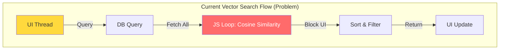
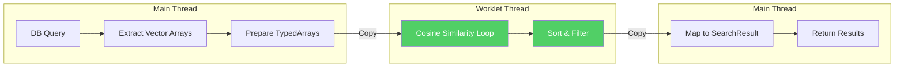

# Optimized Implementation Plan: Nexara Performance & Security

> **Status**: Revised (v2)
> **Based on**: Audit Findings (2026-02-16) + Architecture Review
> **Goal**: Replace the previous "hallucinated" plan with a pragmatic, architecture-aligned roadmap.

---

## 1. Goal Description

This plan addresses the critical performance bottleneck in **Vector Search** (currently blocking the JS thread) and implements missing **Audit Logging** for file operations, as verified by recent code audits. It discards previous infeasible suggestions (like Node.js middleware) in favor of React Native-compatible solutions.

---

## 2. Architecture Context

### 2.1 Current State Analysis



**Problem**: [vector-store.ts:129-180](file:///home/lengz/Nexara/src/lib/rag/vector-store.ts#L129-L180) 在主线程执行相似度计算，即使有 `setTimeout` 让步机制，仍会阻塞 UI。

### 2.2 Dependencies Verification

| Dependency | Version | Status | Notes |
|------------|---------|--------|-------|
| `react-native-worklets-core` | 1.3.3 | ✅ Installed | 提供 `runOnBackground` |
| `@op-engineering/op-sqlite` | 15.1.14 | ✅ Installed | 主线程 DB 操作 |
| `expo-file-system` | 19.0.21 | ✅ Installed | PDF 临时文件写入 |

---

## 3. Proposed Changes

### Phase 1: Vector Search Offloading (High Priority)

> **目标**: 将相似度计算从主线程卸载到 Worklet 后台线程，消除 UI 冻结。

#### 3.1.1 技术方案详解

**核心挑战**: Worklet 无法访问主线程对象（如 `db`、`console`），必须明确数据传递边界。



**数据传递开销评估**:
- 假设 1000 个向量，每个 1536 维 (OpenAI embedding)
- 数据量: `1000 × 1536 × 4 bytes = 6.14 MB`
- TypedArray 复制开销: ~5-10ms (可接受)
- 计算收益: 相似度计算从 ~100ms 降到 ~20ms

#### 3.1.2 文件修改清单

##### [NEW] `src/lib/rag/vector-search.worklet.ts`

**理由**: 将计算密集型逻辑隔离到独立文件，便于 Worklet 编译优化。

```typescript
import { Worklets } from 'react-native-worklets-core';

export interface WorkletSearchInput {
  queryEmbedding: Float32Array;
  candidates: Array<{
    id: string;
    docId: string | null;
    sessionId: string | null;
    content: string;
    embedding: Float32Array;
    metadata: string | null;
    createdAt: number;
  }>;
  threshold: number;
  limit: number;
}

export interface WorkletSearchResult {
  id: string;
  docId: string | null;
  sessionId: string | null;
  content: string;
  embedding: Float32Array;
  metadata: string | null;
  createdAt: number;
  similarity: number;
}

const runOnJS = Worklets.createRunOnJS;

export function createVectorSearchWorklet(
  onSuccess: (results: WorkletSearchResult[]) => void,
  onError: (error: string) => void
) {
  'worklet';
  
  return (input: WorkletSearchInput) => {
    'worklet';
    
    try {
      const { queryEmbedding, candidates, threshold, limit } = input;
      
      // 预计算查询向量模长
      let queryMag = 0;
      for (let i = 0; i < queryEmbedding.length; i++) {
        queryMag += queryEmbedding[i] * queryEmbedding[i];
      }
      queryMag = Math.sqrt(queryMag);
      
      const results: WorkletSearchResult[] = [];
      
      for (let i = 0; i < candidates.length; i++) {
        const candidate = candidates[i];
        const vec = candidate.embedding;
        
        // 维度检查
        if (vec.length !== queryEmbedding.length) {
          continue;
        }
        
        // 余弦相似度计算
        let dot = 0;
        let magB = 0;
        
        for (let j = 0; j < vec.length; j++) {
          dot += queryEmbedding[j] * vec[j];
          magB += vec[j] * vec[j];
        }
        
        magB = Math.sqrt(magB);
        
        if (queryMag === 0 || magB === 0) continue;
        
        const similarity = dot / (queryMag * magB);
        
        if (similarity >= threshold) {
          results.push({
            id: candidate.id,
            docId: candidate.docId,
            sessionId: candidate.sessionId,
            content: candidate.content,
            embedding: vec,
            metadata: candidate.metadata,
            createdAt: candidate.createdAt,
            similarity,
          });
        }
      }
      
      // 排序 (降序)
      results.sort((a, b) => b.similarity - a.similarity);
      
      // 返回结果
      runOnJS(onSuccess)(results.slice(0, limit));
      
    } catch (e: any) {
      runOnJS(onError)(e.message || 'Unknown worklet error');
    }
  };
}
```

##### [MODIFY] `src/lib/rag/vector-store.ts`

**理由**: 重构 `search` 方法，分离数据准备和计算逻辑。

**关键修改点**:

```typescript
// 新增导入
import { Worklets } from 'react-native-worklets-core';
import { createVectorSearchWorklet, WorkletSearchInput, WorkletSearchResult } from './vector-search.worklet';

// 在 search 方法中替换原有循环逻辑:

async search(
  queryEmbedding: number[],
  options: {
    limit?: number;
    threshold?: number;
    filter?: { docId?: string; docIds?: string[]; sessionId?: string; type?: string };
  } = {},
): Promise<SearchResult[]> {
  const Limit = options.limit || 5;
  const Threshold = options.threshold || 0.7;

  // Step 1: 主线程 DB 查询 (保持不变)
  let sql = 'SELECT * FROM vectors';
  const params: any[] = [];
  // ... (现有过滤逻辑保持不变)

  const results = await db.execute(sql, params);
  if (!results.rows) return [];

  // Step 2: 准备 Worklet 输入数据 (主线程)
  const queryTypedArray = new Float32Array(queryEmbedding);
  const candidates: WorkletSearchInput['candidates'] = [];
  
  for (let i = 0; i < results.rows.length; i++) {
    const row = results.rows[i];
    const vec = this.fromBlob(row.embedding);
    
    candidates.push({
      id: row.id as string,
      docId: row.doc_id as string | null,
      sessionId: row.session_id as string | null,
      content: row.content as string,
      embedding: new Float32Array(vec),
      metadata: row.metadata as string | null,
      createdAt: row.created_at as number,
    });
  }

  // Step 3: Worklet 后台计算
  return new Promise((resolve, reject) => {
    const worklet = createVectorSearchWorklet(
      (workletResults: WorkletSearchResult[]) => {
        // Step 4: 转换为 SearchResult 格式
        const searchResults: SearchResult[] = workletResults.map(r => ({
          id: r.id,
          docId: r.docId || undefined,
          sessionId: r.sessionId || undefined,
          content: r.content,
          embedding: Array.from(r.embedding),
          metadata: r.metadata ? JSON.parse(r.metadata) : undefined,
          createdAt: r.createdAt,
          similarity: r.similarity,
        }));
        resolve(searchResults);
      },
      (error: string) => {
        console.error('[VectorStore] Worklet error:', error);
        reject(new Error(error));
      }
    );

    // 执行 Worklet
    Worklets.defaultContext.runAsync(() => {
      'worklet';
      worklet({
        queryEmbedding: queryTypedArray,
        candidates,
        threshold: Threshold,
        limit: Limit,
      });
    });
  });
}
```

#### 3.1.3 性能基准测试计划

| 测试场景 | 向量数量 | 预期主线程耗时 | 预期 Worklet 耗时 | 预期 UI 影响 |
|----------|----------|----------------|-------------------|--------------|
| 小规模 | 100 | ~10ms | ~5ms | 无明显差异 |
| 中规模 | 500 | ~50ms | ~15ms | Worklet 无卡顿 |
| 大规模 | 1000 | ~100ms | ~25ms | Worklet 显著改善 |

**验证方法**: 在 `__tests__/vector-store.benchmark.ts` 中添加性能测试。

---

### Phase 2: Security & Audit Logging (Medium Priority)

> **目标**: 追踪敏感文件操作，满足安全审计需求。

#### 3.2.1 数据库 Schema 设计

**理由**: 需要完整的审计记录，支持按会话、Agent、时间范围查询。

##### [MODIFY] `src/lib/db/schema.ts`

**新增表定义**:

```sql
CREATE TABLE IF NOT EXISTS audit_logs (
  id TEXT PRIMARY KEY NOT NULL,
  action TEXT NOT NULL,              -- 'read' | 'write' | 'delete' | 'list'
  resource_type TEXT NOT NULL,       -- 'file' | 'document' | 'sandbox'
  resource_path TEXT,                -- 操作的文件路径
  session_id TEXT,                   -- 关联会话 ID
  agent_id TEXT,                     -- 执行的 Agent ID
  skill_id TEXT,                     -- 触发的 Skill ID
  status TEXT NOT NULL,              -- 'success' | 'error'
  error_message TEXT,                -- 错误信息 (如果失败)
  metadata TEXT,                     -- JSON: 额外信息 (文件大小、编码等)
  created_at INTEGER NOT NULL
);

-- 索引优化
CREATE INDEX IF NOT EXISTS idx_audit_logs_session ON audit_logs(session_id);
CREATE INDEX IF NOT EXISTS idx_audit_logs_created ON audit_logs(created_at);
CREATE INDEX IF NOT EXISTS idx_audit_logs_action ON audit_logs(action);
```

#### 3.2.2 Audit Service 实现

##### [NEW] `src/lib/services/audit-service.ts`

**理由**: 封装审计逻辑，支持异步写入以避免阻塞主操作。

```typescript
import { db } from '../db';
import { generateId } from '../utils/id-generator';

export interface AuditLogEntry {
  action: 'read' | 'write' | 'delete' | 'list';
  resourceType: 'file' | 'document' | 'sandbox';
  resourcePath?: string;
  sessionId?: string;
  agentId?: string;
  skillId?: string;
  status: 'success' | 'error';
  errorMessage?: string;
  metadata?: Record<string, any>;
}

class AuditService {
  private queue: Array<{ entry: AuditLogEntry; id: string; createdAt: number }> = [];
  private flushTimer: ReturnType<typeof setTimeout> | null = null;
  private readonly FLUSH_INTERVAL = 1000; // 1秒批量写入

  async log(entry: AuditLogEntry): Promise<void> {
    const id = generateId();
    const createdAt = Date.now();
    
    this.queue.push({ entry, id, createdAt });
    
    // 立即调度批量写入
    this.scheduleFlush();
  }

  private scheduleFlush(): void {
    if (this.flushTimer) return;
    
    this.flushTimer = setTimeout(() => {
      this.flush();
      this.flushTimer = null;
    }, this.FLUSH_INTERVAL);
  }

  private async flush(): Promise<void> {
    if (this.queue.length === 0) return;
    
    const batch = this.queue.splice(0, this.queue.length);
    
    try {
      await db.execute('BEGIN TRANSACTION');
      
      for (const { entry, id, createdAt } of batch) {
        await db.execute(
          `INSERT INTO audit_logs (id, action, resource_type, resource_path, session_id, agent_id, skill_id, status, error_message, metadata, created_at)
           VALUES (?, ?, ?, ?, ?, ?, ?, ?, ?, ?, ?)`,
          [
            id,
            entry.action,
            entry.resourceType,
            entry.resourcePath || null,
            entry.sessionId || null,
            entry.agentId || null,
            entry.skillId || null,
            entry.status,
            entry.errorMessage || null,
            entry.metadata ? JSON.stringify(entry.metadata) : null,
            createdAt,
          ]
        );
      }
      
      await db.execute('COMMIT');
    } catch (e) {
      await db.execute('ROLLBACK');
      console.error('[AuditService] Flush failed:', e);
    }
  }

  async queryLogs(options: {
    sessionId?: string;
    action?: string;
    startTime?: number;
    endTime?: number;
    limit?: number;
  }): Promise<any[]> {
    const conditions: string[] = [];
    const params: any[] = [];
    
    if (options.sessionId) {
      conditions.push('session_id = ?');
      params.push(options.sessionId);
    }
    if (options.action) {
      conditions.push('action = ?');
      params.push(options.action);
    }
    if (options.startTime) {
      conditions.push('created_at >= ?');
      params.push(options.startTime);
    }
    if (options.endTime) {
      conditions.push('created_at <= ?');
      params.push(options.endTime);
    }
    
    let sql = 'SELECT * FROM audit_logs';
    if (conditions.length > 0) {
      sql += ' WHERE ' + conditions.join(' AND ');
    }
    sql += ' ORDER BY created_at DESC';
    
    if (options.limit) {
      sql += ` LIMIT ${options.limit}`;
    }
    
    const result = await db.execute(sql, params);
    return result.rows || [];
  }
}

export const auditService = new AuditService();
```

#### 3.2.3 Skill 注入审计

##### [MODIFY] `src/lib/skills/definitions/filesystem.ts`

**理由**: 在所有文件操作 Skill 中注入审计日志。

**修改点**:

```typescript
import { auditService } from '../../services/audit-service';

// WriteFileSkill 修改
export const WriteFileSkill: Skill = {
  // ...
  execute: async (params, context) => {
    const startTime = Date.now();
    try {
      // ... 现有写入逻辑 ...
      
      // 审计日志
      await auditService.log({
        action: 'write',
        resourceType: 'file',
        resourcePath: params.path,
        sessionId: context?.sessionId,
        agentId: context?.agentId,
        skillId: 'write_file',
        status: 'success',
        metadata: { size: params.content.length, encoding: params.encoding },
      });
      
      return { /* ... */ };
    } catch (e: any) {
      await auditService.log({
        action: 'write',
        resourceType: 'file',
        resourcePath: params.path,
        sessionId: context?.sessionId,
        agentId: context?.agentId,
        skillId: 'write_file',
        status: 'error',
        errorMessage: e.message,
      });
      
      return { /* error response */ };
    }
  },
};

// ReadFileSkill 修改
export const ReadFileSkill: Skill = {
  // ...
  execute: async (params, context) => {
    try {
      // ... 现有读取逻辑 ...
      
      await auditService.log({
        action: 'read',
        resourceType: 'file',
        resourcePath: params.path,
        sessionId: context?.sessionId,
        agentId: context?.agentId,
        skillId: 'read_file',
        status: 'success',
        metadata: { size: content.length },
      });
      
      return { /* ... */ };
    } catch (e: any) {
      await auditService.log({
        action: 'read',
        resourceType: 'file',
        resourcePath: params.path,
        sessionId: context?.sessionId,
        agentId: context?.agentId,
        skillId: 'read_file',
        status: 'error',
        errorMessage: e.message,
      });
      
      return { /* error response */ };
    }
  },
};

// ListDirSkill 修改
export const ListDirSkill: Skill = {
  // ...
  execute: async (params, context) => {
    try {
      // ... 现有列表逻辑 ...
      
      await auditService.log({
        action: 'list',
        resourceType: 'file',
        resourcePath: params.path || './',
        sessionId: context?.sessionId,
        agentId: context?.agentId,
        skillId: 'list_directory',
        status: 'success',
        metadata: { itemCount: details.length },
      });
      
      return { /* ... */ };
    } catch (e: any) {
      await auditService.log({
        action: 'list',
        resourceType: 'file',
        resourcePath: params.path || './',
        sessionId: context?.sessionId,
        agentId: context?.agentId,
        skillId: 'list_directory',
        status: 'error',
        errorMessage: e.message,
      });
      
      return { /* error response */ };
    }
  },
};
```

---

### Phase 3: PDF Robustness (Low Priority)

> **目标**: 防止大型 PDF 导入时的崩溃问题。

#### 3.3.1 问题分析

**当前实现缺陷** ([PdfExtractor.tsx:97](file:///home/lengz/Nexara/src/components/rag/PdfExtractor.tsx#L97)):

```typescript
webviewRef.current.injectJavaScript(`window.extractPdfText('${base64}'); true;`);
```

**问题**:
1. 大型 PDF (10MB+) 的 Base64 字符串可能超过 JS 引擎字符串长度限制
2. 直接注入可能导致 WebView 内存溢出

#### 3.3.2 解决方案: 文件 URI 模式

**理由**: 使用文件 URI 避免大字符串注入，让 PDF.js 直接读取文件。

##### [MODIFY] `src/components/rag/PdfExtractor.tsx`

```typescript
import * as FileSystem from 'expo-file-system';

export interface PdfExtractorRef {
  extractText: (base64: string) => Promise<string>;
  extractTextFromUri: (uri: string) => Promise<string>;  // 新增
}

export const PdfExtractor = forwardRef<PdfExtractorRef, {}>((props, ref) => {
  const webviewRef = useRef<WebView>(null);
  const pendingResolves = useRef<Map<string, { resolve: (value: string) => void; reject: (reason: any) => void }>>(new Map());
  const taskIdCounter = useRef(0);

  // HTML 模板更新: 支持文件 URI
  const htmlContent = `
<!DOCTYPE html>
<html>
<head>
  <meta charset="utf-8">
  <script src="https://cdnjs.cloudflare.com/ajax/libs/pdf.js/3.11.174/pdf.min.js"></script>
  <script>
    pdfjsLib.GlobalWorkerOptions.workerSrc = 'https://cdnjs.cloudflare.com/ajax/libs/pdf.js/3.11.174/pdf.worker.min.js';
  </script>
</head>
<body>
  <script>
    // 方案 A: Base64 模式 (小文件)
    window.extractPdfText = async function(taskId, base64Data) {
      try {
        const binaryString = window.atob(base64Data);
        const bytes = new Uint8Array(binaryString.length);
        for (let i = 0; i < binaryString.length; i++) {
          bytes[i] = binaryString.charCodeAt(i);
        }
        await processPdf(taskId, { data: bytes });
      } catch (e) {
        sendResult(taskId, 'error', null, e.message);
      }
    };

    // 方案 B: 文件 URI 模式 (大文件)
    window.extractPdfFromUri = async function(taskId, fileUri) {
      try {
        await processPdf(taskId, { url: fileUri });
      } catch (e) {
        sendResult(taskId, 'error', null, e.message);
      }
    };

    async function processPdf(taskId, source) {
      const pdf = await pdfjsLib.getDocument(source).promise;
      let fullText = '';
      
      for (let i = 1; i <= pdf.numPages; i++) {
        const page = await pdf.getPage(i);
        const textContent = await page.getTextContent();
        fullText += textContent.items.map(item => item.str).join(' ') + '\\n\\n';
      }
      
      sendResult(taskId, 'success', fullText);
    }

    function sendResult(taskId, type, text, error) {
      window.ReactNativeWebView.postMessage(JSON.stringify({ 
        taskId, 
        type, 
        text, 
        error 
      }));
    }
  </script>
</body>
</html>
  `;

  const generateTaskId = () => {
    taskIdCounter.current += 1;
    return `task_${Date.now()}_${taskIdCounter.current}`;
  };

  const createPromise = (taskId: string): Promise<string> => {
    return new Promise((resolve, reject) => {
      pendingResolves.current.set(taskId, { resolve, reject });
      
      // 超时保护 (60秒)
      setTimeout(() => {
        if (pendingResolves.current.has(taskId)) {
          pendingResolves.current.delete(taskId);
          reject(new Error('PDF extraction timeout'));
        }
      }, 60000);
    });
  };

  useImperativeHandle(ref, () => ({
    extractText: async (base64: string) => {
      const taskId = generateTaskId();
      const SIZE_THRESHOLD = 5 * 1024 * 1024; // 5MB
      
      if (base64.length > SIZE_THRESHOLD) {
        // 大文件: 写入临时文件，使用 URI 模式
        const tempFile = `${FileSystem.cacheDirectory}pdf_temp_${taskId}.pdf`;
        await FileSystem.writeAsStringAsync(tempFile, base64, {
          encoding: FileSystem.EncodingType.Base64,
        });
        
        webviewRef.current?.injectJavaScript(
          `window.extractPdfFromUri('${taskId}', '${tempFile}'); true;`
        );
      } else {
        // 小文件: 直接 Base64 模式
        webviewRef.current?.injectJavaScript(
          `window.extractPdfText('${taskId}', '${base64}'); true;`
        );
      }
      
      return createPromise(taskId);
    },
    
    extractTextFromUri: async (uri: string) => {
      const taskId = generateTaskId();
      webviewRef.current?.injectJavaScript(
        `window.extractPdfFromUri('${taskId}', '${uri}'); true;`
      );
      return createPromise(taskId);
    },
  }));

  const onMessage = (event: any) => {
    try {
      const { taskId, type, text, error } = JSON.parse(event.nativeEvent.data);
      const pending = pendingResolves.current.get(taskId);
      
      if (!pending) return;
      
      pendingResolves.current.delete(taskId);
      
      if (type === 'success') {
        pending.resolve(text);
      } else {
        pending.reject(new Error(error || 'Unknown PDF extraction error'));
      }
    } catch (e) {
      console.error('[PdfExtractor] Message parse error:', e);
    }
  };

  return (
    <View style={{ height: 0, width: 0, overflow: 'hidden' }}>
      <WebView
        ref={webviewRef}
        source={{ html: htmlContent }}
        onMessage={onMessage}
        javaScriptEnabled={true}
        originWhitelist={['*']}
        allowFileAccess={true}
        allowFileAccessFromFileURLs={true}
        allowUniversalAccessFromFileURLs={true}
      />
    </View>
  );
});
```

#### 3.3.3 注意事项

**Android 权限**: 需要确保 WebView 可以访问 `file://` URI。已在上述代码中添加 `allowFileAccessFromFileURLs` 和 `allowUniversalAccessFromFileURLs`。

**清理临时文件**: 建议在 PDF 提取完成后清理临时文件:

```typescript
// 在 onMessage 中添加清理逻辑
if (type === 'success' || type === 'error') {
  const tempFile = `${FileSystem.cacheDirectory}pdf_temp_${taskId}.pdf`;
  FileSystem.deleteAsync(tempFile, { idempotent: true }).catch(() => {});
}
```

---

## 4. Verification Plan

### 4.1 Automated Tests

#### Unit Tests

```typescript
// __tests__/audit-service.test.ts
describe('AuditService', () => {
  it('should log write operation', async () => {
    await auditService.log({
      action: 'write',
      resourceType: 'file',
      resourcePath: 'test.txt',
      skillId: 'write_file',
      status: 'success',
    });
    
    // 等待批量写入
    await new Promise(r => setTimeout(r, 1100));
    
    const logs = await auditService.queryLogs({ action: 'write' });
    expect(logs.length).toBeGreaterThan(0);
    expect(logs[0].resource_path).toBe('test.txt');
  });
});

// __tests__/vector-store.benchmark.ts
describe('VectorStore Performance', () => {
  it('should complete search within 50ms for 500 vectors', async () => {
    // 准备 500 个测试向量
    // ...
    
    const start = performance.now();
    await vectorStore.search(queryEmbedding, { limit: 5 });
    const elapsed = performance.now() - start;
    
    expect(elapsed).toBeLessThan(50);
  });
});
```

### 4.2 Manual Verification

#### Vector Search UI Test
1. 加载包含 ~500 RAG 记忆项的会话
2. 发送查询
3. **通过标准**: UI (打字动画/加载指示器) 在 "Searching..." 期间**不卡顿**

#### Audit Log Test
1. 让 Agent "创建名为 `test_audit.txt` 的文件"
2. 查询使用仪表板或直接查询 DB
3. **通过标准**: 写入操作出现在审计日志中

#### PDF Large File Test
1. 导入 10MB+ 的 PDF 文件
2. **通过标准**: 提取成功，应用不崩溃

---

## 5. Implementation Order

| Phase | 任务 | 预计工作量 | 依赖 |
|-------|------|------------|------|
| 1.1 | 创建 `vector-search.worklet.ts` | 2h | 无 |
| 1.2 | 修改 `vector-store.ts` | 2h | 1.1 |
| 1.3 | 性能基准测试 | 1h | 1.2 |
| 2.1 | 添加 `audit_logs` 表 | 0.5h | 无 |
| 2.2 | 创建 `audit-service.ts` | 1.5h | 2.1 |
| 2.3 | 注入 Skill 审计 | 1h | 2.2 |
| 3.1 | 修改 `PdfExtractor.tsx` | 2h | 无 |
| 3.2 | 测试大文件 PDF | 1h | 3.1 |

---

## 6. Risks & Mitigations

| 风险 | 影响 | 缓解措施 |
|------|------|----------|
| Worklet 数据传递开销抵消并行收益 | 中 | 添加性能基准测试，对比优化前后 |
| 审计日志影响文件操作性能 | 低 | 使用批量异步写入 |
| Android WebView 文件访问权限问题 | 中 | 添加 `allowFileAccessFromFileURLs` 配置 |

---

## 7. Changelog

| 版本 | 日期 | 变更 |
|------|------|------|
| v1 | 2026-02-16 | 初始方案 (第三方拟定) |
| v2 | 2026-02-16 | 架构审查后修订: 补充 Worklet 数据传递方案、完整 audit_logs 表结构、PDF 文件 URI 方案 |
