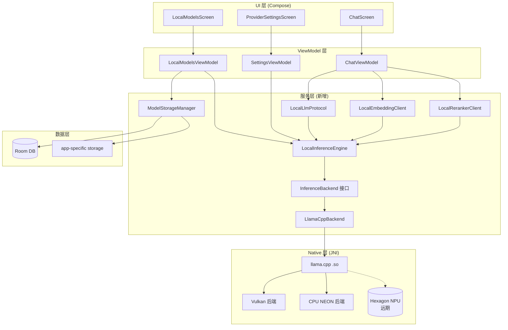
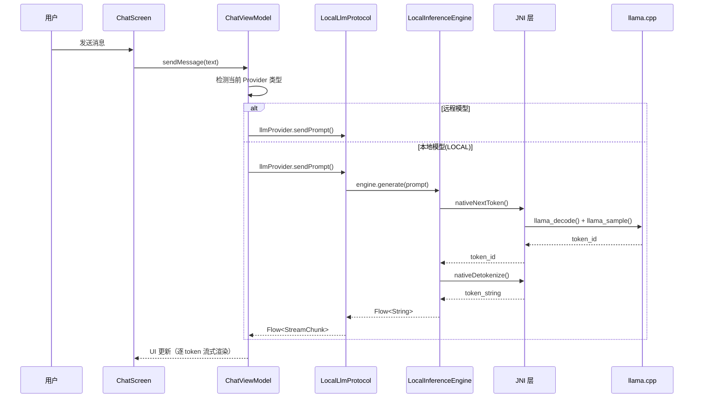

# 端侧本地模型功能补完实施方案

> **日期**: 2026-05-10
> **状态**: 方案设计阶段
> **审计结论**: 当前为 100% 占位符，零实际实现

---

## 一、审计摘要

### 1.1 占位符确认证据

| 维度 | 当前状态 | 应达状态 |
|------|----------|----------|
| **ML 依赖** | `build.gradle.kts` 零 ML 库 | 需引入 llama.cpp JNI 绑定 |
| **协议类型** | `ProtocolId` 仅 `OPENAI/ANTHROPIC/VERTEX_AI` | 需新增 `LOCAL` |
| **推理引擎** | 不存在 | 需 `LocalInferenceEngine` |
| **模型管理** | `LocalModelsScreen` 硬编码假数据 | 需 `ModelStorageManager` |
| **Embedding** | 仅远程 HTTP API | 需 `embedLocal()` |
| **Reranker** | 无本地 rerank | 需本地 reranker |
| **设置开关** | 无 `localModelsEnabled` | 需持久化开关 |
| **模型文件** | 零 GGUF 文件 | 需模型下载/导入机制 |
| **Tokenizer** | 不存在 | 需 BPE/SentencePiece tokenizer |

### 1.2 TS 原版参考架构

```
┌─────────────────────────────────────────────────────────┐
│  TS 原版 (src/lib/local-inference/)                     │
│                                                         │
│  LocalModelServer.ts (Zustand Store)                    │
│  ├── main: SlotState      ← 聊天模型 (LlamaContext)     │
│  ├── embedding: SlotState ← 向量模型 (LlamaContext)     │
│  └── rerank: SlotState    ← 重排序模型 (LlamaContext)   │
│                                                         │
│  ModelStorageManager.ts                                 │
│  ├── importModel(uri)     ← 从文件管理器导入 .gguf      │
│  ├── deleteModel(path)    ← 删除模型文件                │
│  └── listModels()         ← 枚举可用模型                │
│                                                         │
│  local-llm.ts (implements LlmClient)                    │
│  ├── sendPrompt()         ← 流式生成 (AsyncGenerator)   │
│  └── prompt 模板           ← ChatML / Llama3 模板       │
│                                                         │
│  embedding.ts                                           │
│  └── embedLocal()         ← 本地向量化                  │
│                                                         │
│  reranker.ts                                            │
│  └── 本地 rerank          ← 交叉编码器重排序             │
└─────────────────────────────────────────────────────────┘
```

---

## 二、技术选型

### 2.1 主引擎：llama.cpp + JNI + InferenceBackend 抽象

**选择理由**：

| 维度 | llama.cpp | ExecuTorch | MNN | Google AI Edge |
|------|-----------|------------|-----|----------------|
| **模型格式** | GGUF（TS 原版一致） | .pte（需转换） | .mnn（需转换） | .tflite（需转换） |
| **模型生态** | ★★★★★ HuggingFace 最丰富 | ★★★ | ★★ | ★★ |
| **GPU 加速** | Vulkan (8-14 tok/s) | QNN NPU (18-25 tok/s) | NNAPI (10-18 tok/s) | GPU delegate |
| **NPU 路线图** | ggml-hexagon (开发中) | QNN NPU 原生 | NNAPI 代理 | GPU delegate |
| **运行时大小** | ~4 MB | ~8 MB | ~6 MB | ~15 MB |
| **Kotlin 集成** | JNI 包装（成熟） | Java API | Java API（最易用） | 官方 SDK |
| **设备兼容** | ★★★★★ 全 Android 5.0+ | ★★★ 骁龙为主 | ★★★★ | ★★★★ |
| **社区活跃度** | ★★★★★ | ★★★ | ★★ | ★★★ |

### 2.2 三阶段演进路线

```
Phase A (当前 7 会话):
  ┌──────────────────────────────────────────┐
  │ LlamaCppBackend (implements InferenceBackend) │
  │ ├── Vulkan GPU (8-14 tok/s) ← 旗舰设备       │
  │ └── CPU NEON  (4-8 tok/s)  ← 中低端降级     │
  │ 模型: GGUF                          │
  │ 覆盖: 100% Android 设备               │
  └──────────────────────────────────────────┘

Phase B (远期, ggml-hexagon 合并主线后):
  ┌──────────────────────────────────────────┐
  │ LlamaHexagonBackend (implements InferenceBackend) │
  │ └── Hexagon NPU (预估 12-22 tok/s)        │
  │ 模型: GGUF (相同文件, 零切换成本!)          │
  │ 硬件: Snapdragon 8 Gen 2+                │
  │ 改动: 仅新增 1 个 Backend 实现类            │
  └──────────────────────────────────────────┘

Phase C (远期可选, 高级用户):
  ┌──────────────────────────────────────────┐
  │ ExecuTorchBackend (implements InferenceBackend) │
  │ └── QNN NPU (18-25 tok/s, 当前最快!)      │
  │ 模型: .pte (需从 HF 单独导出)              │
  │ 用户自行下载模型文件                        │
  └──────────────────────────────────────────┘
```

**核心架构决策**：从 Phase 1 起就通过 `InferenceBackend` 抽象接口解耦后端。`LocalInferenceEngine` 只依赖接口，不感知具体实现。切换 NPU 后端 = 替换一行工厂代码。

**决策**：选择 **llama.cpp**，核心原因：
1. **GGUF 格式零转换**：HuggingFace 直接下载即用，与 TS 原版生态完全兼容
2. **Vulkan GPU 加速**：覆盖骁龙 8 系/天玑旗舰设备，吞吐 8-14 tok/s
3. **CPU NEON 降级**：低端设备自动回退 CPU 推理（4-8 tok/s）
4. **最小运行时**：~4 MB 不会显著增加 APK 体积

### 2.2 推荐模型规格

| 槽位 | 推荐模型 | 量化格式 | 大小 | 适用内存 |
|------|---------|----------|------|----------|
| **Main (聊天)** | Qwen2.5-7B-Instruct | Q4_K_M | ~4.5 GB | ≥6 GB |
| **Main (轻量)** | Llama-3.2-3B-Instruct | Q4_K_M | ~2.0 GB | ≥4 GB |
| **Embedding** | nomic-embed-text-v1.5 | F16 | ~274 MB | ≥2 GB |
| **Reranker** | bge-reranker-v2-m3 | Q4_K_M | ~1.2 GB | ≥4 GB |

### 2.3 依赖引入

```kotlin
// build.gradle.kts 新增
dependencies {
    // llama.cpp Android 预编译库 (推荐使用社区维护的 AAR)
    implementation("com.github.llama.cpp:llama-android:1.0.0")
    
    // 或使用更轻量的 JNI 包装
    // implementation("com.github.shixiangcap:llama-jni:1.0.0")
}
```

---

## 三、架构设计

### 3.1 模块全景



### 3.2 核心类设计

#### 3.2.0 InferenceBackend（推理后端抽象接口）

```kotlin
// 抽象接口，使引擎与具体后端解耦。
// 当前实现: LlamaCppBackend (Vulkan GPU + CPU NEON)
// 远期实现: LlamaHexagonBackend (Hexagon NPU), ExecuTorchBackend (QNN NPU)
interface InferenceBackend {
    val backendType: BackendType
    val isLoaded: Boolean
    suspend fun loadModel(path: String, config: LoadConfig): Result<Unit>
    fun generate(prompt: String, config: GenerateConfig): Flow<String>
    suspend fun embed(text: String): Result<FloatArray>
    fun release()
}

enum class BackendType(val displayName: String) {
    LLAMA_CPU("llama.cpp CPU"),
    LLAMA_VULKAN("llama.cpp Vulkan"),
    LLAMA_HEXAGON("llama.cpp Hexagon NPU"),
    EXECUTORCH_QNN("ExecuTorch QNN NPU")
}
```

#### 3.2.1 LocalInferenceEngine（推理引擎核心，通过 InferenceBackend 操作）

```kotlin
// 引擎不直接持有 LlamaContext，而是通过 InferenceBackend 接口操作三槽位
// 切换 NPU 后端 = 替换一行工厂代码，引擎代码零改动
class LocalInferenceEngine(private val appContext: Context) {
    
    private val mainBackend: InferenceBackend = LlamaCppBackend()
    private val embeddingBackend: InferenceBackend = LlamaCppBackend()
    private val rerankBackend: InferenceBackend = LlamaCppBackend()
    
    data class SlotState(
        val modelPath: String? = null,
        val isLoaded: Boolean = false,
        val loadProgress: Float = 0f,
        val backendType: BackendType = BackendType.LLAMA_CPU,
        val modelInfo: ModelInfo? = null
    )
    
    data class ModelInfo(
        val name: String,
        val sizeBytes: Long,
        val quantization: String,
        val contextSize: Int,
        val embeddingSize: Int
    )
    
    // 三个槽位
    val mainSlot: MutableStateFlow<SlotState>
    val embeddingSlot: MutableStateFlow<SlotState>
    val rerankSlot: MutableStateFlow<SlotState>
    
    // 核心 API
    suspend fun loadModel(slot: SlotType, path: String, config: LoadConfig): Result<Unit>
    suspend fun unloadModel(slot: SlotType)
    suspend fun generate(prompt: String, config: GenerateConfig): Flow<String>
    suspend fun embed(text: String): Result<FloatArray>
    suspend fun rerank(query: String, documents: List<String>): Result<List<Pair<Int, Float>>>
    fun release()
}
```

#### 3.2.2 LocalLlmProtocol（实现 LlmProtocol 接口）

```kotlin
// 实现现有 LlmProtocol 接口，使本地模型无缝接入现有 Provider 架构
class LocalLlmProtocol(
    private val engine: LocalInferenceEngine
) : LlmProtocol {
    override val id: String = "local"
    
    override suspend fun sendPrompt(request: PromptRequest): Flow<StreamChunk> {
        // 1. 构建 ChatML / Llama3 格式 prompt
        // 2. 调用 engine.generate() 获取 token 流
        // 3. 转换为 StreamChunk 流
    }
    
    override suspend fun sendPromptSync(request: PromptRequest): PromptResponse {
        // 同步模式（用于简单问答）
    }
}
```

#### 3.2.3 ModelStorageManager（模型文件管理）

```kotlin
class ModelStorageManager(private val context: Context) {
    
    data class StoredModel(
        val id: String,
        val fileName: String,
        val filePath: String,
        val sizeBytes: Long,
        val detectedFormat: String,  // 从 GGUF header 读取
        val addedAt: Long
    )
    
    // 模型存储目录: /data/data/com.promenar.nexara.native/files/models/
    val modelsDir: File
    
    suspend fun importModel(uri: Uri): Result<StoredModel>  // 从 SAF 导入
    suspend fun deleteModel(modelId: String): Result<Unit>
    suspend fun listModels(): List<StoredModel>
    suspend fun downloadModel(url: String, onProgress: (Float) -> Unit): Result<StoredModel>
    suspend fun parseGgufMetadata(path: String): ModelInfo  // 解析 GGUF header
    suspend fun getModelSize(path: String): Long
}
```

#### 3.2.4 LocalModelsViewModel（UI 状态管理）

```kotlin
class LocalModelsViewModel(
    private val engine: LocalInferenceEngine,
    private val storageManager: ModelStorageManager
) : ViewModel() {
    
    val mainSlot: StateFlow<SlotState>
    val embeddingSlot: StateFlow<SlotState>
    val rerankSlot: StateFlow<SlotState>
    val availableModels: StateFlow<List<StoredModel>>
    val isDownloading: StateFlow<Boolean>
    val downloadProgress: StateFlow<Float>
    
    fun importModel(uri: Uri)
    fun deleteModel(modelId: String)
    fun loadModel(slot: SlotType, modelId: String)
    fun unloadModel(slot: SlotType)
    fun downloadModel(url: String)
}
```

### 3.3 协议扩展

```kotlin
// ProtocolId 新增枚举值
enum class ProtocolId {
    OPENAI,
    ANTHROPIC,
    VERTEX_AI,
    LOCAL       // ← 新增
}

// LlmProvider 扩展
class LlmProvider {
    // 现有：从远程协议构建
    companion object {
        fun builder(): Builder  // 现有
        fun local(engine: LocalInferenceEngine): LlmProvider  // 新增工厂方法
    }
}
```

### 3.4 JNI 桥接层设计

```cpp
// native-lib.cpp — JNI 函数声明
extern "C" {

// 模型加载
JNIEXPORT jlong JNICALL
Java_com_promenar_nexara_data_local_inference_LlamaContext_nativeLoadModel(
    JNIEnv*, jobject, jstring modelPath, jint nCtx, jint nThreads, jboolean useGpu);

// Token 生成（流式）
JNIEXPORT jstring JNICALL
Java_com_promenar_nexara_data_local_inference_LlamaContext_nativeGenerate(
    JNIEnv*, jobject, jlong contextPtr, jstring prompt, jint maxTokens);

// Token 生成（单步，用于自回归循环）
JNIEXPORT jint JNICALL
Java_com_promenar_nexara_data_local_inference_LlamaContext_nativeNextToken(
    JNIEnv*, jobject, jlong contextPtr);

// Embedding
JNIEXPORT jfloatArray JNICALL
Java_com_promenar_nexara_data_local_inference_LlamaContext_nativeEmbed(
    JNIEnv*, jobject, jlong contextPtr, jstring text);

// 释放
JNIEXPORT void JNICALL
Java_com_promenar_nexara_data_local_inference_LlamaContext_nativeFree(
    JNIEnv*, jobject, jlong contextPtr);

// Tokenize / Detokenize
JNIEXPORT jintArray JNICALL
Java_com_promenar_nexara_data_local_inference_LlamaContext_nativeTokenize(
    JNIEnv*, jobject, jlong contextPtr, jstring text);

JNIEXPORT jstring JNICALL
Java_com_promenar_nexara_data_local_inference_LlamaContext_nativeDetokenize(
    JNIEnv*, jobject, jlong contextPtr, jintArray tokens);

}
```

### 3.5 数据流



---

## 四、分阶段实施计划

### Phase 1: 基础设施（预估 3-5 天）

| 任务 | 文件 | 工作量 | 优先级 |
|------|------|--------|--------|
| **1.1 引入 llama.cpp 依赖** | `build.gradle.kts` | 2h | P0 |
| **1.2 编译 JNI 桥接层** | `cpp/native-lib.cpp`, `CMakeLists.txt` | 1d | P0 |
| **1.3 实现 LlamaContext Kotlin 包装** | `data/local/inference/LlamaContext.kt` | 4h | P0 |
| **1.4 编写 JNI 单元测试** | `LlamaContextTest.kt` | 4h | P0 |
| **1.5 端到端冒烟测试** | 加载 mini GGUF (如 TinyLlama) 验证推理链路 | 2h | P0 |

**验收标准**：
- 能加载一个 GGUF 模型文件
- 能执行单次推理（generate 1 token）
- 能正确释放上下文

### Phase 2: 推理引擎（预估 4-6 天）

| 任务 | 文件 | 工作量 | 优先级 |
|------|------|--------|--------|
| **2.1 实现 LocalInferenceEngine** | `data/local/inference/LocalInferenceEngine.kt` | 1d | P0 |
| **2.2 实现三槽位管理** | 同上（main/embedding/rerank 状态机） | 1d | P0 |
| **2.3 实现流式生成** | `generate()` 方法，Flow<String> token 级输出 | 1d | P0 |
| **2.4 实现本地 Embedding** | `embed()` 方法 | 4h | P1 |
| **2.5 实现本地 Reranker** | `rerank()` 方法（交叉编码器模式） | 4h | P2 |
| **2.6 实现 GPU 加速检测与切换** | Vulkan 可用性检测 + 自动降级 CPU | 4h | P1 |
| **2.7 编写集成测试** | `LocalInferenceEngineTest.kt` | 4h | P0 |

**验收标准**：
- 加载模型 → 流式推理 → 完整对话轮次
- GPU 可用时自动启用 Vulkan 加速
- 多槽位独立加载/卸载无串扰

### Phase 3: 模型管理（预估 2-3 天）

| 任务 | 文件 | 工作量 | 优先级 |
|------|------|--------|--------|
| **3.1 实现 ModelStorageManager** | `data/local/inference/ModelStorageManager.kt` | 1d | P0 |
| **3.2 SAF 文件导入** | 通过 `Intent.ACTION_OPEN_DOCUMENT` 选择 .gguf | 4h | P0 |
| **3.3 GGUF Metadata 解析** | `parseGgufMetadata()` 读取模型名/量化格式/上下文长度 | 4h | P1 |
| **3.4 模型下载功能** | 通过 URL 下载 + 断点续传 | 4h | P1 |
| **3.5 Room 持久化模型列表** | `LocalModelEntity` + DAO | 2h | P1 |

**验收标准**：
- 从文件管理器导入 .gguf 文件
- 展示模型元信息（名称、大小、量化格式）
- 删除模型释放存储空间

### Phase 4: 协议集成（预估 2-3 天）

| 任务 | 文件 | 工作量 | 优先级 |
|------|------|--------|--------|
| **4.1 扩展 ProtocolId** | `LlmProtocol.kt` 新增 `LOCAL` | 1h | P0 |
| **4.2 实现 LocalLlmProtocol** | `data/remote/protocol/LocalProtocol.kt` | 1d | P0 |
| **4.3 扩展 LlmProvider** | `LlmProvider.kt` 新增 `local()` 工厂 | 2h | P0 |
| **4.4 实现 ChatML/Llama3 prompt 模板** | `LocalProtocol.kt` 内建模板 | 4h | P0 |
| **4.5 本地 Embedding 客户端集成** | `EmbeddingClient.kt` 新增 `embedLocal()` | 4h | P1 |
| **4.6 本地 Reranker 客户端集成** | 新建 `LocalRerankerClient.kt` | 4h | P1 |
| **4.7 协议级单元测试** | `LocalProtocolTest.kt` | 2h | P0 |

**验收标准**：
- `LlmProvider.local(engine)` 创建的 Provider 可正常对话
- Chat 界面无需改动即可切换本地模型
- prompt 模板正确适配主流 GGUF 模型

### Phase 5: UI 与设置（预估 2-3 天）

| 任务 | 文件 | 工作量 | 优先级 |
|------|------|--------|--------|
| **5.1 实现 LocalModelsViewModel** | `ui/settings/LocalModelsViewModel.kt` | 1d | P0 |
| **5.2 改造 LocalModelsScreen** | 移除硬编码，接入 ViewModel | 1d | P0 |
| **5.3 SettingsViewModel 新增开关** | `localModelsEnabled` 持久化到 DataStore | 2h | P0 |
| **5.4 Provider 选择页集成本地选项** | `ProviderSettingsScreen` 新增 "本地模型" 入口 | 4h | P0 |
| **5.5 下载进度 UI** | 进度条 + 断点续传状态 | 2h | P1 |

**验收标准**：
- LocalModelsScreen 展示真实模型列表（非硬编码）
- 可导入/删除/加载/卸载模型
- 加载状态正确反馈（进度条 + GPU 标识）
- 设置中可启用/禁用本地模型

### Phase 6: Application 集成与生命周期（预估 1-2 天）

| 任务 | 文件 | 工作量 | 优先级 |
|------|------|--------|--------|
| **6.1 NexaraApplication 初始化引擎** | `NexaraApplication.kt` | 4h | P0 |
| **6.2 前后台切换模型保活** | `ProcessLifecycleOwner` 监听 | 4h | P0 |
| **6.3 内存压力处理** | `onTrimMemory()` 卸载非活跃槽位 | 2h | P1 |
| **6.4 自动加载上次模型** | 持久化 `lastLoadedModel` | 2h | P1 |

**验收标准**：
- App 启动时可选自动加载上次使用的模型
- 切到后台不丢失上下文
- 内存不足时优雅降级

---

## 五、目录结构规划

```
app/src/main/java/com/promenar/nexara/
├── data/
│   ├── local/
│   │   ├── db/                    # 已有
│   │   └── inference/             # ← 新增
│   │       ├── InferenceBackend.kt       # 推理后端抽象接口（为 NPU 可插拔铺路）
│   │       ├── LlamaCppBackend.kt        # llama.cpp 后端实现
│   │       ├── LlamaContext.kt           # JNI 桥接 Kotlin 封装
│   │       ├── LocalInferenceEngine.kt   # 推理引擎核心（通过接口操作）
│   │       ├── ModelStorageManager.kt    # GGUF 文件管理
│   │       ├── ModelDownloader.kt        # HTTP 模型下载
│   │       └── GgufParser.kt             # GGUF header 解析
│   │
│   └── remote/
│       ├── protocol/
│       │   ├── LlmProtocol.kt            # 扩展 LOCAL 枚举
│       │   └── LocalProtocol.kt          # ← 新增：本地 LLM 协议
│       └── provider/
│           └── LlmProvider.kt            # 扩展 local() 工厂
│
├── ui/settings/
│   ├── LocalModelsScreen.kt             # 改造：接入 ViewModel
│   ├── LocalModelsViewModel.kt          # ← 新增
│   └── SettingsViewModel.kt             # 扩展：localModelsEnabled
│
└── cpp/                                  # ← 新增
    ├── native-lib.cpp                    # JNI 实现
    └── CMakeLists.txt                    # NDK 构建配置
```

---

## 六、风险与缓解

| 风险 | 概率 | 影响 | 缓解措施 |
|------|------|------|----------|
| **Vulkan 兼容性问题** | 中 | 高 | 自动检测降级 CPU NEON；先用 CPU 模式跑通全链路 |
| **7B 模型 OOM** | 高 (4GB 设备) | 高 | 默认推荐 3B 轻量模型；实现内存监控自动卸载非活跃槽位 |
| **JNI 崩溃难调试** | 中 | 高 | 每步 JNI 调用加 try-catch + 日志；编写充分的单元测试覆盖 |
| **GGUF 格式兼容性** | 低 | 中 | 聚焦 llama.cpp 官方支持的架构 (LLaMA/Mistral/Qwen/Gemma) |
| **模型下载体验差** | 中 | 中 | 实现断点续传 + 后台 WorkManager 下载；展示清晰进度 |
| **前后台切换上下文丢失** | 低 | 中 | ProcessLifecycleOwner + 状态序列化 |
| **APK 体积增长** | 低 | 低 | llama.cpp .so 仅 ~4MB；模型文件由用户按需下载 |

---

## 七、工作量汇总

| 阶段 | 内容 | 预估工时 | 优先级 |
|------|------|----------|--------|
| Phase 1 | 基础设施 (JNI + 依赖) | 3-5 天 | P0 |
| Phase 2 | 推理引擎 (核心) | 4-6 天 | P0 |
| Phase 3 | 模型管理 | 2-3 天 | P0 |
| Phase 4 | 协议集成 | 2-3 天 | P0 |
| Phase 5 | UI 与设置 | 2-3 天 | P0 |
| Phase 6 | 生命周期集成 | 1-2 天 | P0 |
| **总计** | | **14-22 天** | |

注：以上为单人全职预估。由于 JNI 层调试耗时较大，建议为 Phase 1-2 预留缓冲。

---

## 八、技术参考

### 8.1 关键链接

- **llama.cpp 官方**: https://github.com/ggml-org/llama.cpp
- **Android 参考示例**: `llama.cpp/examples/android/`
- **GGUF 格式规范**: https://github.com/ggml-org/ggml/blob/master/docs/gguf.md
- **2026 年端侧 LLM 部署指南**: https://carrie-l.github.io/AI/2026-04-16-android-ondevice-llm-deployment-guide
- **2026 年引擎对比**: https://www.alephzerolabs.com/blog/on-device-llm-android-native-2026/
- **Kotlin llama.cpp 集成指南**: https://www.ertas.ai/blog/llama-cpp-android-kotlin-integration-guide

### 8.2 TS 原版参考

- `src/lib/local-inference/LocalModelServer.ts` — 三槽位状态管理
- `src/lib/local-inference/ModelStorageManager.ts` — 文件管理
- `src/lib/llm/providers/local-llm.ts` — 协议适配
- `src/lib/rag/embedding.ts` — `embedLocal()` 实现
- `src/lib/rag/reranker.ts` — 本地 rerank 逻辑
- `src/store/settings-store.ts` — 开关管理

---

*文档结束*
