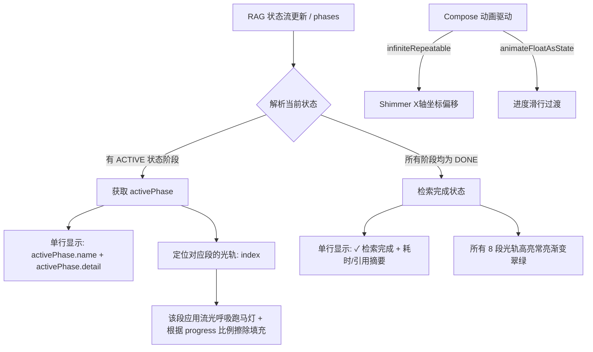

# 🔮 方案二：多段式极细霓虹导电轨 RAG 指示器实施计划

本计划旨在重塑 Nexara 现有的 RAG 检索指示器卡片（[ChatInlineComponents.kt](file:///k:/Nexara/native-ui/app/src/main/java/com/promenar/nexara/ui/chat/ChatInlineComponents.kt#L363)），彻底拔除三行笨重的网格 Chips 布局，打造一款极致精致、高度仅为 `36dp` 的**“多段极细霓虹光轨”**单行状态显示器。

## 🪐 架构设计与数据/动效流推演

每一段极细光束将与后台的 `RagPhase` 执行状态（`DONE` / `ACTIVE` / `PENDING`）和 `progress` 产生**像素级精确绑定**。

---

## 🛠️ 可执行的分步方案

### 🏁 步骤一：创建/重塑 `RagProgressCard` 的单行胶囊骨架
- 在 [ChatInlineComponents.kt](file:///k:/Nexara/native-ui/app/src/main/java/com/promenar/nexara/ui/chat/ChatInlineComponents.kt) 中重构 `RagProgressCard`。
- 将其高度限制在 `36dp` - `44dp`（如果是带有文档引用折叠的话）。
- 去除 `FlowRow` 及庞大的 Chips Grid，只用一个 `Row` 容纳：**左侧流光雷达图标 + 中间 AnimatedContent 智能翻页文本 + 右侧完成百分比**。

### ⚡ 步骤二：构建“多段霓虹导电轨（Neon Micro-rail）”组件
- 新增 `NeonMicroRail` 的 Composable 函数。
- 动态获取 `phases.size`（通常为 8 段），在 Row 布局中均匀分配。
- **段的渲染与状态精准映射**：
  - `DONE`：使用常亮的翠绿色高光（渐变 `Brush` 从 `Primary` 到 `StatusSuccess`）。
  - `ACTIVE`：该段背景为暗色底轨，在其上绘制流光的“电荷”层，电荷层宽度等于 `activePhase.progress / 100f`。同时在该段上应用无限循环的 `LinearEasing` 跑马流光。
  - `PENDING`：使用半透明暗灰色（`NexaraColors.OutlineVariant.copy(alpha = 0.2f)`）的暗轨。

### 📝 步骤三：匹配动态文本描述与 AnimatedContent 切换
- 过滤 `phases`：
  - 如果存在 `activePhase`，当前的文本绑定为：`activePhase.name`。如果 `activePhase.detail` 不为空，则用分隔符拼接，显示更细致的微任务，如：`向量化搜索中 • 已扫描 15 个分块`。
  - 如果 `isComplete == true`，文本绑定为：`✓ 知识检索已就绪`。
- 使用 `AnimatedContent` 进行垂直方向的翻字动效，创造出极其灵动高级的状态切换。

---

## 🔍 边界与极端条件审计

1. **历史会话恢复场景（phases 为空，但 RAG 引用非空）**：
   - *应对*：如果加载历史会话时 `phases` 为空，我们将指示器直接降级为“检索就绪”的完成态，单行文字显示为 `✓ 知识库已就绪`，底部的所有 8 段光线全部呈现常亮的静态高亮。
2. **多线程并发导致的进度闪烁或倒退**：
   - *应对*：在进度条 of 每一段填充宽度中使用 `animateFloatAsState(animationSpec = spring(dampingRatio = Spring.DampingRatioLowBouncy))`，使任何突进的进度变化都能表现得平滑且带有微弱的物理弹性，阻断视觉抖动。
3. **空间极窄屏幕下的文本溢出**：
   - *应对*：文本加上 `maxLines = 1` 并且使用 `TextOverflow.Ellipsis`（省略号）进行优雅截断，确保它绝对不会折行破坏单行布局。

---

## 🧪 验证计划

1. **代码编译**：在 `k:\Nexara\native-ui` 运行 `./gradlew compileDebugKotlin` 验证编译。
2. **文档治理 (DIA)**：更新 `CHANGELOG.md` 和 `.agent/handover.md`。
