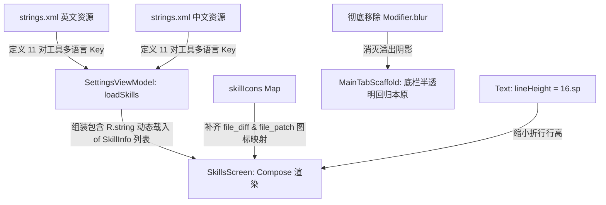

# Nexara 全局高斯模糊深度减法与工具管理设置页 UI 重构实施计划

本项目级计划已在当前会话中由 Antigravity 制定，遵循 AGENTS.md 开放标准，兼容 Cursor / Claude Code / Copilot 等 30+ 工具。

---

## 1. 采纳您的极佳建议：底栏高斯模糊彻底做减法

在对 `MainTabScaffold.kt` 底部导航栏进行技术评估后，我们完全采纳您的绝妙决定：
* **为何不使用 `clip` 堵，而是彻底移除 `blur`**：既然 `Modifier.blur(20.dp)` 在 Android 平台上根本无法实现真正的“背景毛玻璃模糊”（Backdrop Blur），还会强行引入 20.dp 外溢朦胧黑影阻碍列表显示，甚至在低版本系统上可能带来性能负担。与其用 `.clipToBounds()` 打补丁掩盖，不如**彻底做工程减法，将这行累赘无效的代码直接干掉**！
* **移除后的效果**：底部导航栏将与全站高度赞赏的 `NexaraGlassCard` 保持 100% 视觉与架构统一，采用极其轻量、对系统性能零开销的 **“普通半透明底色（alpha = 0.8f）+ 0.5dp 细分界线”** 的拟真玻璃材质。不仅在 100% Android 手机上呈现完美的流畅度，而且从物理上完全消除了溢出黑影，内容列表展示将极为清爽、利落！

---

## 2. 方案设计与变更范围

### 2.1 架构设计与协作关系

### 2.2 具体修改内容

#### 2.2.1 [MODIFY] [strings.xml (中文)](file:///k:/Nexara/native-ui/app/src/main/res/values-zh-rCN/strings.xml)
在 `skill_image_generation_desc` 之后追加 11 个工具的专业中文翻译。

#### 2.2.2 [MODIFY] [strings.xml (默认英文)](file:///k:/Nexara/native-ui/app/src/main/res/values/strings.xml)
在 `skill_image_generation_desc` 之后，追加这 11 个工具对应的英文多语言资源。

#### 2.2.3 [MODIFY] [SettingsViewModel.kt](file:///k:/Nexara/native-ui/app/src/main/java/com/promenar/nexara/ui/settings/SettingsViewModel.kt)
重构 `loadSkills()` 函数，将硬编码英文的 11 个 `SkillInfo` 数据项全部改造为通过 `app.getString(R.string.skill_xxx)` 动态读取。

#### 2.2.4 [MODIFY] [SkillsScreen.kt](file:///k:/Nexara/native-ui/app/src/main/java/com/promenar/nexara/ui/settings/SkillsScreen.kt)
1. 在 `skillIcons` 映射中，添加对 `"file_diff" to Icons.Rounded.Compare` 和 `"file_patch" to Icons.Rounded.Healing` 的专业图标配对。
2. 修复行距问题：将卡片中描述的 `Text` 样式重构为：
   `NexaraTypography.bodyMedium.copy(fontSize = 12.sp, lineHeight = 16.sp)`
   （覆盖 `PresetSkillCard` 和 `UserSkillCard` 两处描述，使折行行间距紧凑自然）。

#### 2.2.5 [MODIFY] [MainTabScaffold.kt](file:///k:/Nexara/native-ui/app/src/main/java/com/promenar/nexara/ui/MainTabScaffold.kt)
彻底移除底栏 `Modifier.blur(20.dp)` 及其相关的 `isBlurSupported` 检测，使其回归完美的拟真毛玻璃卡片轻量材质。

---

## 3. 验证与门禁计划

### 3.1 自动化编译验证
在项目根目录运行 `./gradlew compileDebugKotlin` 校验 Kotlin 编译零 Error 状态。

### 3.2 深度审计与文档治理体系（DIA）
1. 在变更完成后，我们将进行 DIA 检查流程。
2. 同步更新核心文档：
   - [CHANGELOG.md](file:///k:/Nexara/CHANGELOG.md) — 登记版本变更记录。
   - [.agent/handover.md](file:///k:/Nexara/.agent/handover.md) — 登记跨会话交接。
