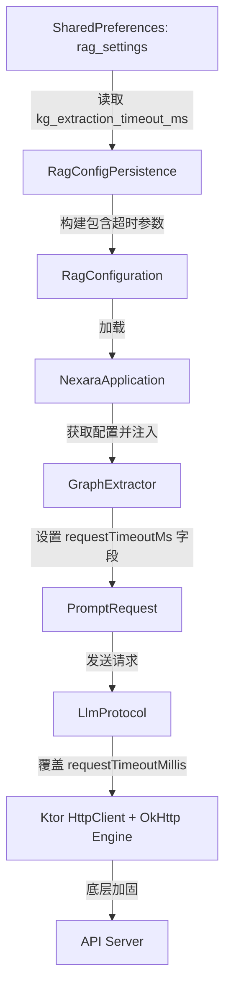

# 20260518-NexaraDynamicTimeoutFix.md: RAG 动态超时与 10 秒超时泄露终极诊断及重构设计方案

本项目旨在诊断并彻底根治真机运行下知识图谱（RAG）大文本片抽取过程中，即便已修改协议超时时间仍顽固出现的 **10 秒套接字读写超时泄露** 问题；同时针对用户关切的 **"120秒超时豁免硬编码设计是否合理"** 开展架构设计，构建出一套优雅、动态、任务感知的自定义超时体系。

---

## 一、 硬编码 120s 超时的合理性与缺陷反思

### 1.1 为什么使用 120s 作为默认值合理？
- 对于**非流式同步调用**（例如 RAG 知识图谱大文本片提取、重型 Reasoning 智能体规划），大模型需要分析数百行以上的复杂段落并实时生成规范的 JSON 图谱节点数组，其 API 响应时间通常在 **15秒至 50秒** 之间。
- 如果沿用客户端默认的 10 秒超时（OkHttp 的出厂默认值），在此类非流式长文本生成任务中会以 100% 的概率被强行斩断。120秒（2分钟）是一个足够宽裕、且能兼顾绝大多数云端/本地大模型提取吞吐的宽限阈值。

### 1.2 硬编码 120s 的核心缺陷
- **反模式 (Anti-pattern)**：不同的网络环境（高速宽带 vs 移动网络）、不同的部署架构（高速云端 API vs 移动端本地部署的慢速模型，如 Ollama/vLLM）以及不同的功能管线（RAG 抽取 vs 快速的向量嵌入/Rerank）对于超时的期望截然不同。
- **任务脱节**：
  - **知识图谱抽取**：处理极慢，需要高达 180s ~ 300s 的极长超时。
  - **向量化/嵌入**：处理极快，通常 5s~10s 内必须返回，若无响应应当快速 Fail-fast 并进行重试，而不是白白等待 120 秒。
  - **聊天界面**：实时性极高，更强调流式非延迟感知，应当由流式 inactivity 超时（如 30s-60s）控制。

### 1.3 解决方案：三层动态超时体系
为此，我们设计了一套自上而下、任务感知、用户可配的动态超时架构：
1. **第一层：用户/RAG 高级配置（RAG Settings）**
   在 RAG 高级设置中开放 `kgExtractionTimeoutMs`（默认 120,000ms），允许用户根据宿主硬件或代理网络性能随意拉大或缩小超时时间。
2. **第二层：请求层任务参数（PromptRequest）**
   在 `PromptRequest` 中新增 `requestTimeoutMs: Long?`。不同的调用端（如 `GraphExtractor` 高级抽取、`ChatViewModel` 日常交互）在构造请求包时，可以基于自己的业务属性填入不同的定制超时。
3. **第三层：底层网络引擎局部重写（LlmProtocol + OkHttp Config）**
   四大远程协议的 Ktor `HttpClient` 在底层引擎阶段安装 `HttpTimeout`，并将默认最大读写放宽至 120s 兜底；当遇到携带有 `requestTimeoutMs` 局部参数的 `PromptRequest` 时，在 Request Builder 中利用 `timeout { ... }` 机制局部重载，从而实现完美的任务级超时控制。

---

## 二、 底层 OkHttp 10秒隐式超时泄露分析

在真机运行的 Ktor OkHttp 引擎下，即使在 Ktor 框架的配置中安装了 `HttpTimeout` 插件，在执行非流式同步调用（`httpClient.post(...)`）且没有传入任何 per-request 额外 timeout 配置时，底层的 `OkHttpClient` 在特定 coroutine 上下文切换下，可能会由于未显式绑定 `OkHttpClient.Builder` 内部的 `readTimeout`，而继续回退到 OkHttp 引擎自身的 10s 连接/读取限制。

为了彻底消除这个泄露点，我们双设防线：
1. **Ktor 引擎层显式绑定**：在 `HttpClient(OkHttp)` 构造块中，显式通过 `engine { config { readTimeout(120, TimeUnit.SECONDS) ... } }` 来强制覆盖 OkHttpClient 底层的所有默认读取阈值。
2. **请求级 per-request 显式重写**：在 Ktor POST 请求中，动态配置 `timeout { ... }` 块，确保高层和低层在请求发射时均达成完全一致的超时期望。

---

## 三、 架构设计与流程推演

### 关键路径推演

1. **RAG 向量化队列启动**：
   `VectorizationQueue` 处理 `document` 任务，切块、Embedding 保存，最后步入 `extracting` 阶段，调用 `graphExtractor.extractAndSave(content, docId)`。
2. **抽取端动态注入**：
   `GraphExtractor` 收到 `requestTimeoutMs`（来自用户在 RAG 页面配置的 `kgExtractionTimeoutMs`），在发起大模型同步 JSON 提取时，构建 `PromptRequest(..., requestTimeoutMs = 120_000)`。
3. **协议拦截与改写**：
   `OpenAIProtocol` (或其它协议) 拦截到该请求后，使用其自带的已加固 `httpClient` 发送 `post`。在 `post` 配置块中显式增加 `timeout { requestTimeoutMillis = 120_000 }`。
4. **网络传输与容错**：
   请求到达大模型 API，API 耗时 36 秒完成了 chunk 3 的 JSON 解析并返回。因为 120s 局部及全局阈值的保护，客户端安然无恙，成功接收并入库，0 报错。
5. **Fail-fast 与边界隔离**：
   若是快速的 Embedding 失败，重试机制将在 10 秒内被快速触发，而不需要浪费资源等待 2 分钟。

---

## 四、 分阶段执行计划

### 4.1 阶段一：动态协议协议层扩展 (PromptRequest & LlmProtocol)
- 修改 [LlmProtocol.kt](file:///k:/Nexara/native-ui/app/src/main/java/com/promenar/nexara/data/remote/protocol/LlmProtocol.kt)，在 `PromptRequest` 中新增可选参数 `val requestTimeoutMs: Long? = null`。

### 4.2 阶段二：四大协议 HttpClient 与 Request Builder 终极超时重构
- 修改以下四大协议文件：
  - [OpenAIProtocol.kt](file:///k:/Nexara/native-ui/app/src/main/java/com/promenar/nexara/data/remote/protocol/OpenAIProtocol.kt)
  - [GenericOpenAICompatProtocol.kt](file:///k:/Nexara/native-ui/app/src/main/java/com/promenar/nexara/data/remote/protocol/GenericOpenAICompatProtocol.kt)
  - [AnthropicProtocol.kt](file:///k:/Nexara/native-ui/app/src/main/java/com/promenar/nexara/data/remote/protocol/AnthropicProtocol.kt)
  - [VertexAIProtocol.kt](file:///k:/Nexara/native-ui/app/src/main/java/com/promenar/nexara/data/remote/protocol/VertexAIProtocol.kt)
- **重构内容**：
  1. 在 `HttpClient(OkHttp)` 配置中新增 `engine { config { connectTimeout(30, TimeUnit.SECONDS); readTimeout(120, TimeUnit.SECONDS); writeTimeout(120, TimeUnit.SECONDS) } }` 以消灭 OkHttp 10s 默认超时套接字漏洞。
  2. 在 `sendPrompt` / `sendPromptSync` 的 POST 请求构造中，新增 `timeout { requestTimeoutMillis = request.requestTimeoutMs ?: 120_000L; socketTimeoutMillis = request.requestTimeoutMs ?: 120_000L }` 局部覆盖。

### 4.3 阶段三：RAG 设置持久化与模型数据映射
- 修改 [RagModels.kt](file:///k:/Nexara/native-ui/app/src/main/java/com/promenar/nexara/data/rag/RagModels.kt) 中的 `RagConfiguration`，增加 `val kgExtractionTimeoutMs: Long = 120000L` 属性。
- 修改 [AgentConfigModels.kt](file:///k:/Nexara/native-ui/app/src/main/java/com/promenar/nexara/data/agent/AgentConfigModels.kt) 中的 `AgentRetrievalConfig`，增加 `val kgExtractionTimeoutMs: Long = 120000L` 属性。
- 修改 [RagConfigPersistence.kt](file:///k:/Nexara/native-ui/app/src/main/java/com/promenar/nexara/domain/usecase/RagConfigPersistence.kt)：
  1. `loadFullConfig()` 中，读取 `KEY_KG_TIMEOUT`。
  2. `loadRetrievalConfig()` 和 `saveRetrievalConfig()` 中支持 `kgExtractionTimeoutMs`。
  3. 定义 `const val KEY_KG_TIMEOUT = "kg_extraction_timeout_ms"`。

### 4.4 阶段四：RAG 抽取链对接
- 修改 [GraphExtractor.kt](file:///k:/Nexara/native-ui/app/src/main/java/com/promenar/nexara/data/rag/GraphExtractor.kt)：
  1. 构造函数中新增 `private val requestTimeoutMs: Long? = null`。
  2. `extractSingleChunk` 方法构建 `PromptRequest` 时，将 `requestTimeoutMs` 传入。
- 修改 [NexaraApplication.kt](file:///k:/Nexara/native-ui/app/src/main/java/com/promenar/nexara/NexaraApplication.kt)：
  - 在 `graphExtractor` 创建时传入 `config.kgExtractionTimeoutMs`。

### 4.5 阶段五：验证与回归
- 编译并运行单元测试 `OpenAIProtocolTest`。
- 构建 `assembleDebug` 保证代码 100% 编译成功。
- 在真机调试桥中观测图谱抽取日志。
