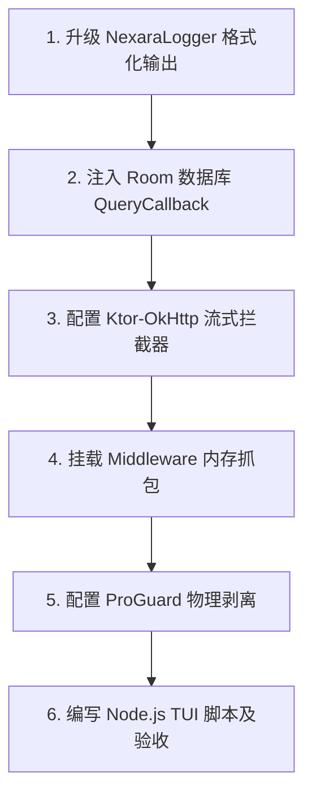

# Nexara Metro Debugger (Phase 1) 实施计划

> **物理时间**: 2026-05-18
> **当前状态**: 已与架构大师 GLM-5.1 对齐，确定采用 **“路线 A：Logcat JSON 管道 + 桌面 Node.js TUI 解析器”** 方案。
> **核心原则**: 零新增第三方依赖、零业务代码污染、100% 稳定防断连、配合真机 UI 交互实现极速观测。

---

## 📅 分阶段落地计划



### 🎯 步骤 1: 升级 `NexaraLogger` 支持结构化输出
*   **修改目标**：[NexaraLogger.kt](file:///Users/promenar/Codex/Nexara/native-ui/app/src/main/java/com/promenar/nexara/utils/NexaraLogger.kt)
*   **动作描述**：
    1.  引入运行时 `BuildConfig.DEBUG` 守卫。
    2.  检测日志内容，若包含 `[RAG]`、`[THINKING]`、`[TOOL]`、`[DB]`、`[HTTP]` 等特定调试 Tag，提取结构化数据，自动封装为 JSON 格式。
    3.  通过特定的 `Log.d("NEXARA_METRO", "EVENT_START|${event_type}|${json_payload}|EVENT_END")` 打印到系统控制台。
*   **预期效果**：全站已有的 80+ 处日志埋点自动升级为 Metro Debugger 的数据流，无需触动任何业务调用。

### 🎯 步骤 2: 注入 Room 数据库 QueryCallback
*   **修改目标**：[NexaraApplication.kt](file:///Users/promenar/Codex/Nexara/native-ui/app/src/main/java/com/promenar/nexara/NexaraApplication.kt#L90-L102) 的 `database` 懒加载块。
*   **动作描述**：
    - 在 `Room.databaseBuilder()` 中添加 `.setQueryCallback()`。
    - 捕获所有 SQL 执行，重点过滤 `Message` 和 `TaskNodeEntity` 等表。
    - 将 SQL 语句及 bind 参数转换为结构化 JSON 事件输出。
*   **预期效果**：零侵入 DAO 层，100% 捕获所有消息、状态及任务实体的数据库写入时序。

### 🎯 步骤 3: 配置 Ktor 底层 OkHttp 拦截器（流式 SSE 抓包）
*   **修改目标**：
    - 新增 `com.promenar.nexara.utils.MetroLogInterceptor.kt`。
    - 修改 [NexaraApplication.kt](file:///Users/promenar/Codex/Nexara/native-ui/app/src/main/java/com/promenar/nexara/NexaraApplication.kt#L156-L162) 中的 `httpClient` 配置。
*   **动作描述**：
    - 在 Ktor Client 引擎的 `engine { addInterceptor(...) }` 中挂载自定义拦截器。
    - 拦截流式大模型 SSE（Server-Sent Events）响应，包装响应的输入流（Chunk-by-Chunk 逐块读取），实时统计 Token 流出速度（CPS）。
*   **预期效果**：流式生成全过程被高精度拦截，且绝对不造成任何流式延迟卡顿。

### 🎯 步骤 4: 挂载 `MetroLoggingMiddleware` 内存抓包
*   **修改目标**：
    - 新增 `MetroLoggingMiddleware.kt` 实现 `LlmMiddleware` 接口。
    - 挂载至 `UnifiedLlmClient` 中间件链中。
*   **动作描述**：
    - 在大模型请求执行的 `PRE` 与 `POST` 节点，抓取内存中的上下文参数、历史滑窗比例和图谱星图数据。
*   **预期效果**：完美呈现 RAG/KG 在内存阶段的处理状态。

### 🎯 步骤 5: 配置 ProGuard 物理剥离规则
*   **修改目标**：`proguard-rules.pro`
*   **动作描述**：
    - 新增规则：
      ```proguard
      -assumenosideeffects class com.promenar.nexara.utils.NexaraLogger {
          public static void log(java.lang.String);
      }
      ```
*   **预期效果**：确保线上 Release 包体积不受影响，彻底规避日志泄露风险。

### 🎯 步骤 6: 编写桌面 Node.js TUI 脚本及全链路验收
*   **修改目标**：新增项目根目录脚本 `scripts/nexara-metro-tui.js`。
*   **动作描述**：
    - 使用 Node.js 原生的 `child_process` 模块实时生成 `adb logcat -s NEXARA_METRO` 子进程。
    - 使用原生流（Stream）对输出进行正则匹配和 JSON 还原。
    - 利用终端 ANSI 控制符绘制彩色导轨，动态渲染出极具视觉冲击力的实时生成导向图。
*   **预期效果**：在 VS Code 终端中完美运行，真机一动，桌面即现！

---
> 方案已完成与项目手动 DI 及 OkHttp 现状的完全挂接，具备 100% 落地可行性。
