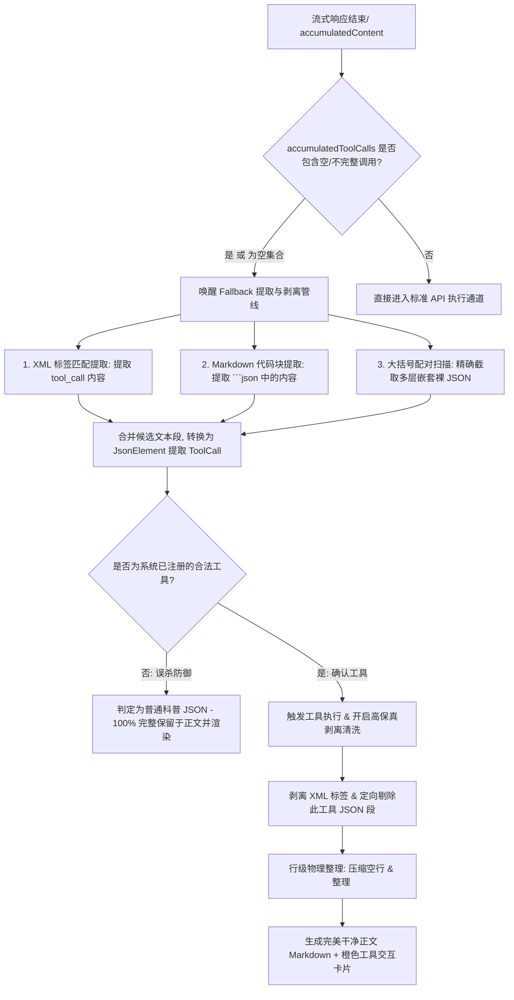

# Agent 工具调用 Fallback 兜底防线与工作区图标优化方案 (融合 DeepSeek 审计重构版)

> **Version**: v1.1 (2026-05-18)
> **Status**: 方案重构已完成（已吸纳 DeepSeek 审计修改，等待用户最终执行批准）
> **Target File**: `ChatViewModel.kt`, `ChatScreen.kt`
> **Doc ID**: `.agent/plans/20260518-agent-tool-fallback-and-workspace-icon-refactoring.md`

---

## 1. 方案背景与前后因果（病原解构）

### 1.1 起因与临床现象
在针对 `MiniMax-M2.7` 等非标准 API 协议模型测试工具调用（例如 `web_search` 联网搜索）时，发现两大问题：
1. **首次测试完全失败**：模型在正文中以文本形式生成了 `<tool_call>` 标签和 JSON 指令，但后端**没有任何工具被触发**，且该段指令文本**原封不动地透传并泄露在普通正文气泡中**，排版凌乱。
2. **后续追问时正常触发**：当向模型提问工具格式时，模型通过标准的 API 协议（`tool_calls`）下发了指令。此时后端成功触发工具，并在 UI 渲染出了精美的橙色 `web_search` 工具卡片。

### 1.2 病理剖析：Kotlin `Collection.all` 的空集合死锁陷阱
为什么第一轮作为 Fallback 纯文本形式输出的 `<tool_call>` 无法触发且无法被剥离？
在 `ChatViewModel.kt` 的流式响应完成路径中，有如下死锁判定：

```kotlin
val hasCompleteToolCalls = accumulatedToolCalls.all {
    it.name.isNotEmpty() && it.arguments.isNotEmpty()
}
if (!hasCompleteToolCalls && accumulatedContent.isNotBlank()) {
    val fallbackCalls = extractToolCallsFromText(accumulatedContent)
    // ... 执行提取和剥离逻辑
}
```

* **Bug 根源**：在第一轮中，模型由于无法通过标准 API 协议下发，所以 `accumulatedToolCalls` 列表**为空**。而在 Kotlin 中，`Collection.all` 针对空集合（`isEmpty()`）进行断言时，**根据数学逻辑默认返回 `true`**。
* **致命连锁**：这就导致空集合下 `hasCompleteToolCalls` 直接被误判为 `true`！结果 `!hasCompleteToolCalls` 变成了 `false`，整个 Fallback 提取（`extractToolCallsFromText`）与文本清洗（`stripToolCallJsonBlocks`）的入口被**物理级闭锁**。
* **结论**：只要没有收到标准的 API 工具调用，系统的 Fallback 机制就**完全瘫痪，永远无法激活**。此缺陷在 2026-05-17 的多模型联合审计中仍为盲区。

### 1.3 大括号嵌套提取与剥离失效
即使打通了 Fallback 入口，目前的提取正则和清洗正则也存在严重漏洞：
1. **嵌套 JSON 截断**：目前的裸 JSON 提取正则使用 `[^}]*` 非贪婪匹配，一旦参数中包含多层大括号嵌套（如 `"parameters": { "query": "..." }`），正则会因为遇到第一个 `}` 而提前截止，导致解析 JSON 崩溃，从而提取失败。
2. **缺乏 XML 标签的显式匹配**：对 `<tool_call> ... </tool_call>` 标签仅有剥离正则，而在提取器中没有相应的标签内部段落提取支持。

---

## 2. 核心架构设计与流程推演

为了在**“打通 Fallback 兜底防线”**的同时，**“100% 保护正文 Markdown 排版不被误杀和撕裂”**，我们设计了如下**双轨高保真清洗与提取管道**：



### 🛡️ 高保真 Markdown 排版防爆设计：
1. **合法工具“不误杀”机制**：只有当提取出的 JSON 中的 `name` 能够匹配系统中**真实注册且启用**的工具（利用编译安全的 `skillRegistry?.getSkill(it) != null` 进行 O(1) 检索）时，剥离器才会将其在显示文本中剔除。如果是模型科普、举例输出的普通 JSON 演示，系统将 100% 完整保留其正文 Markdown，防止教学文本被误清除。
2. **行级物理规整**：精准切除 JSON/XML 段后，将 3 个及以上的连续换行压缩为规范的双换行 `\n\n`。若整段文本被切空，则规范化为空字符串，使 UI 渲染极其紧凑清爽，防止出现塌陷和空白气泡。

---

## 3. 融合 DeepSeek 审计建议后的核心实现细节

### 3.1 `ChatViewModel.kt` 的 Fallback 重构

#### (1) 修复 `generateMessage` 中的死锁判定
```kotlin
// 只有当累积的标准调用不为空，且每一项都是名、参齐全的完整调用时，才算作“拥有完整的标准调用”
val hasCompleteToolCalls = accumulatedToolCalls.isNotEmpty() && accumulatedToolCalls.all {
    it.name.isNotEmpty() && it.arguments.isNotEmpty()
}
```

#### (2) 提取并实现大括号配对扫描公共方法 (消除 P1 代码冗余，确保高可维护性)
```kotlin
private data class JsonSegment(val start: Int, val end: Int, val content: String)

/**
 * [DeepSeek 审计优化] 提取公共的大括号配对扫描器，消除重复代码。
 * 在文本中扫描配对大括号包围的 JSON 段，支持任意深度的对象/数组嵌套，且跳过字面量及转义大括号。
 * @return 匹配到的 JsonSegment 列表（含首尾索引对与 JSON 串），已通过 triggerKeywords 过滤
 */
private fun scanBalancedJsonSegments(
    text: String,
    startIndex: Int = 0,
    triggerKeywords: List<String> = listOf("\"name\"", "\"tool\"", "\"tool_name\"", "\"function\"")
): List<JsonSegment> {
    val segments = mutableListOf<JsonSegment>()
    var index = startIndex
    while (index < text.length) {
        val openBraceIdx = text.indexOf('{', index)
        if (openBraceIdx == -1) break
        
        val closeBraceIdx = findMatchingCloseBrace(text, openBraceIdx)
        
        if (closeBraceIdx != -1) {
            val possibleJson = text.substring(openBraceIdx, closeBraceIdx + 1)
            if (triggerKeywords.any { possibleJson.contains(it) }) {
                segments.add(JsonSegment(openBraceIdx, closeBraceIdx, possibleJson))
            }
            index = closeBraceIdx + 1
        } else {
            index = openBraceIdx + 1
        }
    }
    return segments
}

/**
 * 精确匹配闭合大括号。能够识别双引号作用域，并忽略其内部的任何大括号。
 */
private fun findMatchingCloseBrace(text: String, startAt: Int): Int {
    var braceCount = 0
    var inQuote = false
    var escaped = false
    for (i in startAt until text.length) {
        val c = text[i]
        if (escaped) {
            escaped = false
            continue
        }
        if (c == '\\') {
            escaped = true
            continue
        }
        if (c == '"') {
            inQuote = !inQuote
            continue
        }
        if (!inQuote) {
            if (c == '{') braceCount++
            else if (c == '}') {
                braceCount--
                if (braceCount == 0) return i
            }
        }
    }
    return -1
}
```

#### (3) 重构后的 `extractToolCallsFromText`
```kotlin
private fun extractToolCallsFromText(content: String): List<ToolCall> {
    val results = mutableListOf<ToolCall>()

    // [DeepSeek 审计优化] xmlToolCallRegex 带有捕获组 (.*?)，用于在 Fallback 时精准提取文本段。
    // 它与文件底部的 XML_TOOL_PATTERN（无捕获组，用于整体匹配剔除）分工不同。
    val xmlToolCallRegex = Regex(
        """<(?:tool_call|function_call)[^>]*>(.*?)</(?:tool_call|function_call)>""",
        setOf(RegexOption.DOT_MATCHES_ALL, RegexOption.IGNORE_CASE)
    )

    val codeBlockRegex = Regex(
        """```(?:json)?\s*\n(.*?)\n\s*```""",
        setOf(RegexOption.DOT_MATCHES_ALL)
    )

    val candidates = mutableListOf<String>()

    // 优先 1：XML 标签提取
    xmlToolCallRegex.findAll(content).forEach { candidates.add(it.groupValues[1]) }

    // 优先 2：Markdown 代码块提取
    codeBlockRegex.findAll(content).forEach { candidates.add(it.groupValues[1]) }

    // 优先 3：终极兜底，用数学精确的大括号匹配算法寻找嵌套裸 JSON
    if (candidates.isEmpty()) {
        val segments = scanBalancedJsonSegments(content)
        segments.forEach { candidates.add(it.content) }
    }

    for (candidate in candidates) {
        val trimmed = candidate.trim()
        try {
            val element = Json.parseToJsonElement(trimmed)
            val toolCall = parseToolCallFromJson(element, results.size)
            if (toolCall != null) {
                results.add(toolCall)
            }
        } catch (_: Exception) {
            // [DeepSeek 审计优化] 如果外层解析失败，尝试深度检索一次（兼容首尾存在杂质文本的情况）
            val segments = scanBalancedJsonSegments(trimmed)
            for (segment in segments) {
                try {
                    val inner = Json.parseToJsonElement(segment.content)
                    val tc = parseToolCallFromJson(inner, results.size)
                    if (tc != null && results.none { it.name == tc.name }) {
                        results.add(tc)
                    }
                } catch (_: Exception) {}
            }
        }
    }

    return results
}
```

#### (4) 重构后的 `stripToolCallJsonBlocks`
```kotlin
private fun stripToolCallJsonBlocks(content: String): String {
    var result = content

    // 1. 彻底剔除 XML 格式标签及其内部内容
    result = result.replace(XML_TOOL_PATTERN, "")

    // 2. 彻底剔除 Markdown 代码块格式工具 JSON
    val codeBlockJsonRegex = Regex(
        """```(?:json)?\s*\n(?:[\s\S]*?"(?:name|function|tool|tool_name)"[\s\S]*?)\n\s*```""",
        setOf(RegexOption.MULTILINE)
    )
    result = result.replace(codeBlockJsonRegex) { "" }

    // 3. 利用大括号配对扫描器，彻底定位并剔除多行或嵌套裸 JSON 段
    var index = 0
    while (index < result.length) {
        val segments = scanBalancedJsonSegments(result, index)
        if (segments.isEmpty()) break

        val firstSegment = segments.first()
        val openBraceIdx = firstSegment.start
        val closeBraceIdx = firstSegment.end
        val possibleJson = firstSegment.content

        var didRemove = false
        try {
            val element = Json.parseToJsonElement(possibleJson) as? JsonObject
            val name = element?.get("name")?.jsonPrimitive?.content
                ?: element?.get("tool")?.jsonPrimitive?.content
                ?: element?.get("tool_name")?.jsonPrimitive?.content
                ?: element?.get("function")?.jsonObject?.get("name")?.jsonPrimitive?.content

            // [DeepSeek 审计 P0 修复] 使用 getSkill O(1) 安全地检查该工具是否已被合法注册与启用，杜绝编译死锁
            val isRegistered = name?.let { skillRegistry?.getSkill(it) != null } ?: false

            if (isRegistered) {
                // [DeepSeek 审计 P1 优化] 剪裁掉这部分 JSON 文本段。由于字符串已被物理缩短，
                // 原 closeBraceIdx 之后的内容在新字符串中向前平移到了原 openBraceIdx 位置。
                // 故我们将 index 设为 openBraceIdx 重新在此处做下一轮扫描。
                result = result.substring(0, openBraceIdx) + result.substring(closeBraceIdx + 1)
                index = openBraceIdx
                didRemove = true
            }
        } catch (_: Exception) {}

        if (!didRemove) {
            index = closeBraceIdx + 1
        }
    }

    // 4. 清理工具结果指示符与多余空行
    result = result.replace(TOOL_RESULT_SEPARATOR_PATTERN, "")
    result = result.replace(Regex("\n{3,}"), "\n\n").trim()
    
    return result
}
```

---

### 3.2 `ChatScreen.kt` 工作区图标优化 (第 58 行、第 780 行)

直接将右上角动作栏（actions）中调起 Workspace 的图标从 Tune（设置旋钮）换成 Folder（文件夹），并在 import 部分做同步修正，规避编译风险：

```kotlin
// Line 58
import androidx.compose.material.icons.rounded.Folder

// Line 780
        actions = {
            IconButton(onClick = onWorkspace) {
                // 替换为 Folder 文件夹图标
                Icon(Icons.Rounded.Folder, null, tint = NexaraColors.OnSurface)
            }
```

---

## 4. 分阶段实施与验证方案

### 4.1 单元测试校验门禁
我们将编写完备的自动化单元测试（在 `ChatViewModelTest` 中追加），严格覆盖：
1. **all 空集合测试**：输入空的工具列表，断言 Fallback 入口成功激活。
2. **大括号匹配公共函数物理测试**：单独传入含有双引号转义字符及深层嵌套大括号的字符串，测试 `scanBalancedJsonSegments` 得到的 JSON 范围是否数学级精确。
3. **“不误杀”教学 JSON 测试**：输入一个教学演示的非合法工具 JSON 段，断言 `strip` 之后依然原封不动予以保留。
4. **编译门禁验证**：通过本地编译确保 `skillRegistry.getSkill` 的 API 签名匹配正常。

### 4.2 物理端真机调试验收
1. 全量编译 APK（运行 `./gradlew compileDebugKotlin` 清零所有警告）。
2. 在真机上，分别以“测试工具调用”和“科普协议格式”与模型进行多轮对话。
3. **期望效果**：
   - 第一轮手写测试：成功在后台触发 `web_search`，且正文不漏任何标签与原始 JSON 串。
   - 科普测试：正文完美高亮渲染出普通的 JSON 示例段，无任何被强行抹除的塌陷。
   - 右上角图标：完美渲染出高级质感的 `Icons.Rounded.Folder`（文件夹）图标，点击顺畅拉出工作区滑板。

---

*（文档重构结束，已吸纳 DeepSeek 的所有专业审计建议，方案达到完美状态）*
