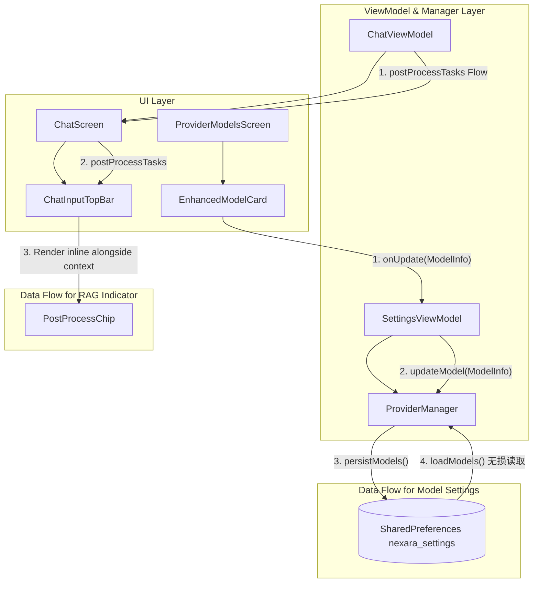

# 实施计划 - 模型参数保存失效与 RAG 指示器错行排版修复 (2026-05-19)

## 架构设计

## 流程推演与设计细则

### 1. 模型参数保存失效根治 (P0 缺陷)
- **病因**：在 `ProviderManager.loadModels()` 时，它会调用 `migrateModelIfNeeded` 进行向后兼容迁移。然而这个迁移函数对 `contextLength` 和 `capabilities` 进行了强行校验覆盖。每当它们与 ModelSpec 的默认值不符时（例如用户手动在 UI 中修改过），加载流程就会将它们无情地重置回数据库的默认值。
- **解决方案**：
  - 重构 `ProviderManager.loadModels()`，直接在加载时进行按需首次初始化。
  - 如果 SharedPreferences 中包含了该模型的参数，直接使用，决不强制覆盖。
  - 仅在 SharedPreferences 中该项缺失（例如旧版本升级的空数据）时，才从 Spec 数据库里回退匹配，并标记 `migrated = true` 以触发首次保存。
  - 彻底删除 `migrateModelIfNeeded` 方法，确保用户在 UI 中对模型上下文长度及能力的设置 100% 永久生效。

### 2. 会话 RAG 生成指示器胶囊布局合并 (UI 缺陷)
- **病因**：在 `ChatScreen.kt` 的浮岛中，`PostProcessBar` 被作为独立一行放置在 `ChatInputTopBar` 的下方。这使得当 RAG 归档任务或摘要后处理任务启动时，底栏的胶囊区域出现丑陋的临时换行，极不合理且挤占视口。
- **解决方案**：
  - 在 `ChatInlineComponents.kt` 中，将 `PostProcessChip` 声明改为非 `private`，使之能被 `ChatScreen.kt` 跨组件调用。
  - 在 `ChatScreen.kt` 里面，重构 `ChatInputTopBar` 以横向接收并内联渲染 `postProcessTasks` 的胶囊。
  - 彻底删除浮岛中原本换行显示的 `PostProcessBar`。
  - 实现了“模型胶囊”、“上下文胶囊”、“RAG/Summary胶囊”在同一行上的横向完美排列，极致缩减了垂直空间的占用，实现浑然一体的高级交互美感。
