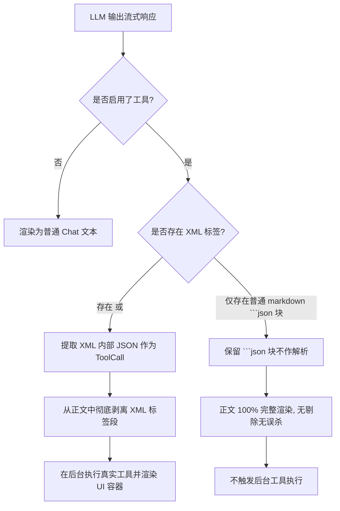

# 严格 XML 标签 Fallback 约束与工具提示词优化实施计划

本计划旨在解决 Nexara 助手在非真实调用（科普、教学）场景下，由于客户端过度拦截裸 JSON 示例，导致“工具容器误触发报错”与“正文被切碎”的问题。

我们采用用户采纳的**方案 B（强 XML 实体闭合约束）**，结合 **LLM 工具暴露提示词约束**，实施双联防。

---

## 架构设计 (Mermaid 流程图)



---

## 边界条件与关键路径推演

### 1. 关键路径：
* **解析器收紧**：`extractToolCallsFromText` 中只保留优先级 0（DSML 协议）和优先级 1（XML 标签过滤）。废弃优先级 2（Markdown 代码块）与优先级 3（大括号扫描）。
* **文本清洗收紧**：`stripToolCallJsonBlocks` 中彻底移除 Markdown 代码块 `codeBlockJsonRegex` 以及裸大括号扫描 `scanBalancedJsonSegments` 的剔除，仅替换 `XML_TOOL_PATTERN` 标签段。
* **工具提示词注入**：在 `ContextBuilder.kt` 的工具系统提示词中追加极其严厉的英文与中文指引，防止模型产生格式混乱，并强约束教学演示时的写法。

### 2. 边界条件防御：
* **极旧非标准模型**：如果极旧模型确实想调用工具但依然只输出裸 JSON（不带 XML 标签），在强制 XML 标签约束下它们将无法被 Fallback 提取执行。但绝大多数主流及非标准模型在收到我们在 `ContextBuilder` 中加入的 XML 强指令引导后，均会完美使用 XML 包裹。
* **XML 标签不完整**：若模型在输出流还没完成时，XML 标签被截断（如只有 `<FunctionCall>` 缺少闭合），解析器会因为正则无法匹配而不动作。直到流式完全结束后，完整的闭合标签被捕获，才进行提取和剔除，这避免了流式渲染时的抖动和闪烁。

---

## 拟修改文件

### 1. [MODIFY] [ContextBuilder.kt](file:///k:/Nexara/native-ui/app/src/main/java/com/promenar/nexara/ui/chat/manager/ContextBuilder.kt)
* **修改位置**：`buildSystemPrompt` 里的 `Tools Instructions` 部分。
* **修改内容**：追加强力的 XML 调用规范指示与科普示例占位符约束提示。

### 2. [MODIFY] [ChatViewModel.kt](file:///k:/Nexara/native-ui/app/src/main/java/com/promenar/nexara/ui/chat/ChatViewModel.kt)
* **修改位置**：`extractToolCallsFromText` 与 `stripToolCallJsonBlocks`。
* **修改内容**：
  * 注释/移除 `extractToolCallsFromText` 中的 `优先级 2（Markdown 代码块）` 与 `优先级 3（终极大括号扫描）`。
  * 注释/移除 `stripToolCallJsonBlocks` 中关于 `codeBlockJsonRegex` 的 `result.replace` 以及 `scanBalancedJsonSegments` 循环体，保留 XML 剔除逻辑。

---

## 分阶段计划

### 第一阶段：准备与提示词升级 (Prompting Layer)
1. 在 [ContextBuilder.kt](file:///k:/Nexara/native-ui/app/src/main/java/com/promenar/nexara/ui/chat/manager/ContextBuilder.kt) 中更新 `Tools Instructions` 提示词。
2. 加入关于“严禁使用真实工具 JSON 做示例”和“必须使用 `<FunctionCall>` XML 标签调用工具”的强指引。

### 第二阶段：客户端解析防线收紧 (Parser Layer)
1. 修改 [ChatViewModel.kt](file:///k:/Nexara/native-ui/app/src/main/java/com/promenar/nexara/ui/chat/ChatViewModel.kt)，彻底关闭普通 markdown 块和裸大括号的工具转化。
2. 调整剥离器，放行普通 ```json 块，让科普示例能作为精美的 Markdown 块在正文中呈现，而不被“碎尸”。

### 第三阶段：本地编译与逻辑验收
1. 编译运行 Nexara 应用，确保代码清零、无编译错误。
2. 进行会话模拟测试：
   * **测试用例 1 (科普测试)**：模拟模型回复“以下是 web_search 示例：```json {"name": "web_search"} ```”。验证正文 100% 完整显示，且 UI 上没有多余的失败工具卡片。
   * **测试用例 2 (Fallback 调用测试)**：模拟模型流式下发 `<FunctionCall>{"name": "web_search", "arguments": {"query": "test"}}</FunctionCall>`。验证客户端能正确识别并拉起工具卡片进行执行。

---

## 验证计划

### 自动化单元测试
* 运行 `native-ui/app/src/test/java/com/promenar/nexara/ui/chat/manager/ToolExecutorTest.kt`，确保核心工具执行链路无损坏。

### 手动验收指标
1. 发送“列出所有可用工具”，MiniMax 输出的表格行不再缺失，正文完美显示，无任何卡顿。
2. 在该科普问答上方，绝对**没有**显示错误和报错的“工具”容器卡片。
