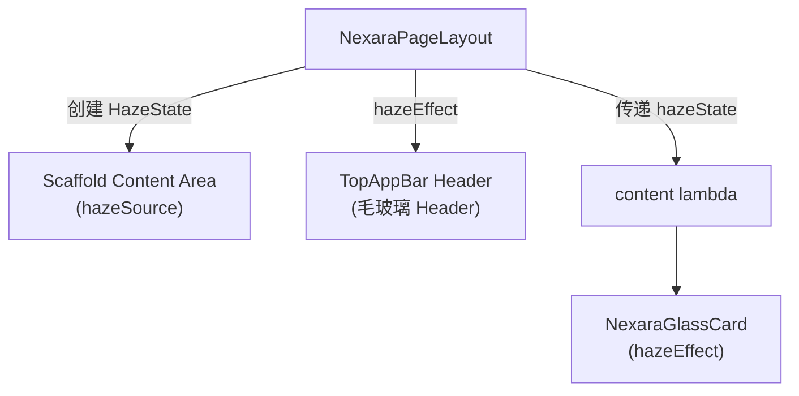

# 集成 Haze 库实现真·穿透毛玻璃效果

## 背景

当前的毛玻璃方案有两个根本问题：
1. **`RenderEffect.createBlurEffect` 方案完全无效** — 它只能模糊自身 RenderNode 内部的子元素，无法穿透到 Z 轴更低层的背景内容
2. **克隆底图 + `.blur()` 方案** — 虽然 DEMO 中验证成功，但要求手动克隆一份静态底图，不支持动态内容（列表滚动时底层的文字/卡片无法被实时模糊）

**Haze** (by Chris Banes) 是 Compose 社区的事实标准毛玻璃库，通过 `hazeSource` + `hazeEffect` 的声明式 API，能真正捕获并实时模糊底层内容。

## User Review Required

> [!IMPORTANT]
> - **最新稳定版为 `1.7.2`** (2026-02-10)，2.0.0 仍处于 alpha 阶段。计划使用 **1.7.2 稳定版**。
> - Haze 1.7.x 使用 `hazeSource` + `hazeEffect` API（已从旧的 `haze`/`hazeChild` 重命名）。
> - **测试底图 `vision_test_bg`** 将从所有非 DEMO 组件中彻底移除（`VisualDemoScreen` 保留供调试用）。

## Open Questions (已决策 2026-05-20)

> [!NOTE]
> 1. ~~`vision_test_bg.jpg` 资源文件本身是否也要从项目中删除？~~ → **已决策：删除**，VisualDemoScreen 改用多彩渐变背景
> 2. ~~移除测试底图后，`NexaraPageLayout` 和 `UserSettingsHomeScreen` 的背景将恢复为什么？~~ → **已决策：恢复为 `NexaraColors.CanvasBackground` 纯色深暗背景**

## Implementation Status: ✅ 已完成 (2026-05-20)

所有 4 个步骤已实施，编译通过（`BUILD SUCCESSFUL`）。

## Proposed Changes

### 1. 依赖配置

#### [MODIFY] [build.gradle.kts](file:///k:/Nexara/native-ui/app/build.gradle.kts)
- 在 dependencies 中添加 Haze 库：
```kotlin
// ─── 毛玻璃效果 (Haze by Chris Banes) ───
implementation("dev.chrisbanes.haze:haze:1.7.2")
implementation("dev.chrisbanes.haze:haze-materials:1.7.2")
```

---

### 2. 核心组件重构

#### [MODIFY] [NexaraGlassCard.kt](file:///k:/Nexara/native-ui/app/src/main/java/com/promenar/nexara/ui/common/NexaraGlassCard.kt)
**重构策略**：
- **移除** `backgroundImageRes` 参数、克隆 Image + `.blur()` 的全部逻辑
- **新增** `hazeState: HazeState?` 可选参数
- 当传入 `hazeState` 时，使用 `Modifier.hazeEffect(state = hazeState)` 实现真·穿透毛玻璃
- 当未传入时，保留微晶玻璃纯色降级底盘
- **保留** `underlay` 参数（第一轨物理对齐模式）不变
- **保留** 霓虹渐变底色渗透层、水晶发光斜射线、彩虹渐变发光边框等全部视觉装饰层

#### [MODIFY] [NexaraPageLayout.kt](file:///k:/Nexara/native-ui/app/src/main/java/com/promenar/nexara/ui/common/NexaraPageLayout.kt)
**重构策略**：
- **移除** 全屏 `vision_test_bg` 底图 Image
- **移除** Header 中克隆底图 + `.blur()` 的逻辑
- **新增** `HazeState` 状态，在 Scaffold 的内容区域标记 `hazeSource`
- Header 使用 `hazeEffect` 实现真·穿透模糊（列表内容向上滚动时能被实时模糊）
- 恢复 Scaffold `containerColor` 为 `NexaraColors.CanvasBackground`
- **通过参数** 将 `hazeState` 传递给 `content` lambda，使内部的 `NexaraGlassCard` 可以接入

---

### 3. 清退测试底图

#### [MODIFY] [UserSettingsHomeScreen.kt](file:///k:/Nexara/native-ui/app/src/main/java/com/promenar/nexara/ui/hub/UserSettingsHomeScreen.kt)
- **移除** 外层 `Box` + `Image(vision_test_bg)` 的全屏底图包装
- 恢复 Scaffold 直接渲染，`containerColor` 使用 `NexaraColors.CanvasBackground`

#### [保留] [VisualDemoScreen.kt](file:///k:/Nexara/native-ui/app/src/main/java/com/promenar/nexara/ui/settings/VisualDemoScreen.kt)
- 保留测试底图引用，作为视觉调试页面继续保留

---

### 4. Haze 状态传播架构



**关键设计**：`NexaraPageLayout` 内部创建 `HazeState`，对内容区域标记 `hazeSource`，对 Header 应用 `hazeEffect`，并将 `hazeState` 通过新的 lambda 参数传递给内容区域，使内部的 `NexaraGlassCard` 也可以应用 `hazeEffect`。

但由于 `NexaraGlassCard` 有 60+ 个调用点分散在各种页面中，不可能在每个调用点都手动传递 `hazeState`。因此更好的方案是使用 **`CompositionLocal`** 来传播 `hazeState`：

```kotlin
// 在 NexaraPageLayout 中提供
val LocalHazeState = compositionLocalOf<HazeState?> { null }

// NexaraPageLayout 内部：
CompositionLocalProvider(LocalHazeState provides hazeState) {
    content()
}

// NexaraGlassCard 内部自动读取：
val hazeState = LocalHazeState.current
```

这样所有嵌套在 `NexaraPageLayout` 内的 `NexaraGlassCard` 都能自动获得毛玻璃效果，**零修改量**。

---

## Verification Plan

### Automated Tests
```bash
.\gradlew.bat :app:compileDebugKotlin
```
- 确保 Haze 依赖正确解析
- 确保所有 60+ 个 NexaraGlassCard 调用点编译通过

### Manual Verification
- 在真机上验证设置页面、次级页面的卡片和 Header 是否呈现真正的穿透毛玻璃效果
- 验证列表滚动时，Header 下方的内容是否被实时模糊
- 验证 VisualDemoScreen DEMO 页面仍然正常工作
