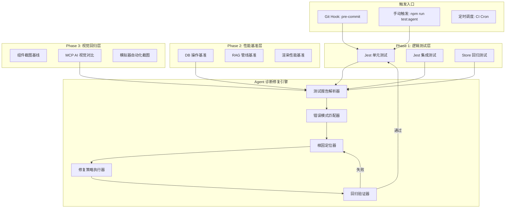
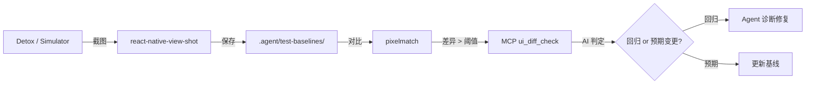
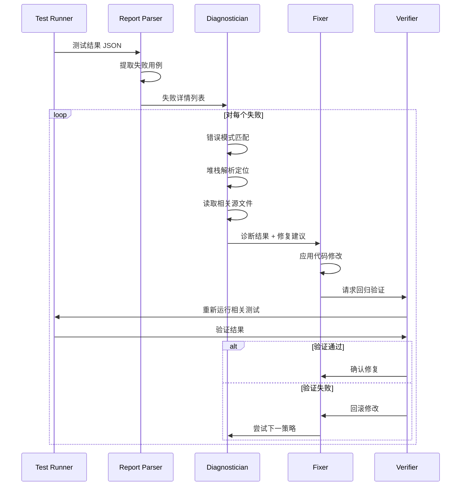

## 产品概述

为 Nexara（React Native + Expo 的 LLM AI 助手应用）设计并实现一套完整的 **Agent 全自动测试-诊断-修复闭环系统**，彻底脱离"编译-真机测试-提取错误-返回IDE修改-重新编译"的手动循环。

## 核心需求

### 三大测试维度

1. **业务逻辑层面测试**

- 对 `src/lib/`、`src/store/`、`src/services/` 等纯逻辑层实现高覆盖率单元/集成测试
- 对 LLM 流式解析、RAG 向量检索、MCP 协议、技能系统等核心业务流程进行自动化验证
- 对 Zustand Store 的状态变更逻辑进行回归测试

2. **性能开销及稳定性测试**

- 数据库操作（SQLite op-sqlite）性能基准测试
- RAG 向量化/检索延迟监控
- 大列表渲染性能（FlashList）基准
- 内存泄漏检测与长时间运行稳定性

3. **视觉 UI/UX 测试**

- 关键页面截图基线对比（使用 react-native-view-shot）
- 组件结构一致性验证（Accessibility Tree）
- 跨设备/分辨率布局回归检测
- 利用 MCP 工具（ui_diff_check）实现 AI 辅助视觉差异判定

### Agent 自主诊断修复

- 测试失败后自动解析错误堆栈，定位源文件
- 性能退化自动 bisect 定位引入退化的提交
- 视觉差异 AI 自动判定"预期变更"或"回归缺陷"
- 修复后自动回归验证，形成闭环

### 交付物

- 生成极其详细的分阶段实施方案文档，保存至 `.agent/docs/plans/` 目录
- 方案需包含完整技术架构、数据结构定义、接口规划、文件路径、执行步骤
- 文档需让弱推理模型（MiniMax M2.7 / Flash）也能按步骤执行

## 技术栈

- **测试框架**: Jest 30（已有） + React Native Testing Library（新增）
- **E2E 框架**: Detox（React Native 专用 E2E）
- **视觉回归**: react-native-view-shot（已有） + pixelmatch + MCP zai-mcp-server/ui_diff_check
- **性能基准**: 自定义 Jest benchmark + Performance API
- **模拟层**: 扩展现有 `scripts/mocks/` 体系
- **Agent 脚本**: Node.js + TypeScript（tsx 运行）
- **截图工具**: macOS 界面自动化 skill（Peekaboo CLI）用于模拟器截图
- **报告输出**: jest-junit + 自定义 JSON 聚合

## 实施方案

### 总体架构



### Phase 1: 业务逻辑自动化测试（第 1-2 周）

#### 1.1 扩展 Mock 基础设施

**目标**: 为所有 RN 原生模块和第三方依赖提供完整 Mock，使 Jest 测试能在纯 Node.js 环境运行。

**现有 Mock 需扩展**:

- `scripts/mocks/op-sqlite.ts` — 当前返回空数组，需支持内存 SQLite 模拟（增删改查）
- `scripts/mocks/async-storage.ts` — 当前全空操作，需支持内存存储
- `scripts/mocks/expo-file-system.ts` — 需支持写入和目录操作

**需新增的 Mock**:

- `scripts/mocks/expo-haptics.ts`
- `scripts/mocks/expo-clipboard.ts`
- `scripts/mocks/expo-image-picker.ts`
- `scripts/mocks/expo-router.ts`
- `scripts/mocks/react-native-reanimated.ts`
- `scripts/mocks/react-native-gesture-handler.ts`
- `scripts/mocks/react-native-keyboard-controller.ts`
- `scripts/mocks/react-native-view-shot.ts`
- `scripts/mocks/react-native-svg.ts`
- `scripts/mocks/llama-rn.ts`

#### 1.2 测试文件组织结构

```
src/
├── lib/
│   ├── __tests__/
│   │   ├── artifact-parser.test.ts          ✅ 已有
│   │   ├── stream-parser.test.ts            [NEW]
│   │   ├── stream-buffer.test.ts            [NEW]
│   │   ├── error-normalizer.test.ts         [NEW]
│   │   ├── message-formatters.test.ts       [NEW]
│   │   ├── model-utils.test.ts              [NEW]
│   │   └── thinking-detector.test.ts        [NEW]
│   ├── llm/
│   │   └── __tests__/
│   │       ├── factory.test.ts              [NEW]
│   │       ├── response-normalizer.test.ts  [NEW]
│   │       └── providers/                   [NEW] 各厂商适配器
│   ├── rag/
│   │   └── __tests__/
│   │       ├── vector-store.test.ts         [NEW]
│   │       ├── text-splitter.test.ts        [NEW]
│   │       ├── keyword-search.test.ts       [NEW]
│   │       ├── query-rewriter.test.ts       [NEW]
│   │       └── embedding.test.ts            [NEW]
│   ├── db/
│   │   └── __tests__/
│   │       ├── schema.test.ts               [NEW]
│   │       └── session-repository.test.ts   [NEW]
│   ├── mcp/
│   │   └── transports/
│   │       └── __tests__/
│   │           └── sse-transport.test.ts    ✅ 已有
│   └── skills/
│       └── __tests__/
│           └── registry.test.ts             [NEW]
├── store/
│   └── __tests__/
│       ├── chat-store.test.ts               [NEW]
│       ├── settings-store.test.ts           [NEW]
│       ├── rag-store.test.ts                [NEW]
│       └── mcp-store.test.ts                [NEW]
└── features/
    └── chat/
        └── __tests__/
            ├── utils/
            │   ├── context-manager.test.ts  [NEW]
            │   └── token-counter.test.ts    [NEW]
            └── hooks/
                └── useChat.test.ts          [NEW]
```

#### 1.3 关键数据结构：测试报告

```typescript
// scripts/agent-test/types.ts

interface TestResult {
  suiteName: string;
  testName: string;
  status: 'passed' | 'failed' | 'skipped' | 'timedOut';
  duration: number;
  error?: {
    message: string;
    stack: string;
    expected?: string;
    received?: string;
  };
  filePath: string;
  lineNumber?: number;
}

interface TestRunReport {
  timestamp: string;
  gitBranch: string;
  gitCommit: string;
  totalTests: number;
  passed: number;
  failed: number;
  skipped: number;
  duration: number;
  coverage?: {
    lines: number;
    branches: number;
    functions: number;
  };
  results: TestResult[];
}

interface DiagnosisResult {
  testResult: TestResult;
  category: 'logic_error' | 'type_error' | 'async_error' | 'mock_error' | 'regression';
  rootFile: string;
  rootLine: number;
  suggestedFix: string;
  confidence: number; // 0-1
}

interface FixResult {
  diagnosis: DiagnosisResult;
  filesModified: string[];
  diff: string;
  verificationPassed: boolean;
  rollbackNeeded: boolean;
}
```

### Phase 2: 性能基准及稳定性测试（第 3-4 周）

#### 2.1 性能基准框架

```typescript
// scripts/agent-test/benchmark/types.ts

interface BenchmarkResult {
  name: string;
  iterations: number;
  meanMs: number;
  medianMs: number;
  p95Ms: number;
  p99Ms: number;
  stdDev: number;
  timestamp: string;
  gitCommit: string;
}

interface PerformanceReport {
  timestamp: string;
  gitBranch: string;
  benchmarks: BenchmarkResult[];
  regressions: PerformanceRegression[];
}

interface PerformanceRegression {
  benchmarkName: string;
  baseline: BenchmarkResult;
  current: BenchmarkResult;
  degradationPercent: number;
  severity: 'minor' | 'moderate' | 'critical';
}
```

#### 2.2 基准测试目标

| 目标模块 | 测试文件路径 | 度量指标 |
| --- | --- | --- |
| SQLite CRUD | `src/lib/db/__tests__/benchmark.test.ts` | 单次操作延迟、批量操作吞吐 |
| 向量检索 | `src/lib/rag/__tests__/vector-store.benchmark.ts` | 召回延迟随数据量增长曲线 |
| 文本切块 | `src/lib/rag/__tests__/text-splitter.benchmark.ts` | 不同文档大小的切块耗时 |
| Stream 解析 | `src/lib/llm/__tests__/stream-parser.benchmark.ts` | 不同 chunk 大小的解析耗时 |
| Store 派发 | `src/store/__tests__/chat-store.benchmark.ts` | 连续 dispatch 耗时 |


### Phase 3: 视觉 UI/UX 回归测试（第 5-6 周）

#### 3.1 视觉测试架构



#### 3.2 截图基线存储

```
.agent/
├── test-baselines/
│   ├── screens/
│   │   ├── chat-screen.light.png
│   │   ├── chat-screen.dark.png
│   │   ├── settings-screen.light.png
│   │   ├── rag-screen.light.png
│   │   └── ...
│   ├── components/
│   │   ├── message-bubble.png
│   │   ├── chat-input.png
│   │   └── ...
│   └── manifest.json       # 基线元数据（版本、设备、分辨率）
├── test-diffs/              # 差异截图（CI 产物）
└── test-reports/            # 测试报告存档
```

### Phase 4: Agent 自主诊断修复引擎（第 7-8 周）

#### 4.1 诊断修复流程



#### 4.2 Agent 测试循环脚本架构

```
scripts/agent-test/
├── cli.ts                    # 入口: npm run test:agent
├── config.ts                 # 配置: 阈值、路径、策略
├── types.ts                  # 类型定义
├── runner/
│   ├── jest-runner.ts        # Jest 测试执行器
│   ├── benchmark-runner.ts   # 性能基准执行器
│   └── visual-runner.ts      # 视觉对比执行器
├── parser/
│   ├── jest-parser.ts        # Jest JSON 报告解析
│   ├── benchmark-parser.ts   # 基准数据解析
│   └── visual-parser.ts      # 截图差异解析
├── diagnostician/
│   ├── error-patterns.ts     # 错误模式库
│   ├── stack-trace.ts        # 堆栈解析器
│   ├── root-cause.ts         # 根因定位器
│   └── git-bisect.ts         # Git bisect 自动化
├── fixer/
│   ├── strategies.ts         # 修复策略库
│   ├── code-modifier.ts      # 安全代码修改器
│   └── rollback.ts           # 回滚管理器
├── reporter/
│   ├── markdown-reporter.ts  # 生成 Markdown 报告
│   └── junit-reporter.ts     # JUnit XML 输出
└── utils/
    ├── file-ops.ts           # 安全文件操作
    ├── git.ts                # Git 操作封装
    └── logger.ts             # 日志工具
```

## 实施注意事项

### Mock 层扩展策略

- 现有 `scripts/mocks/` 下的 Mock 已在 `test-setup.ts` 通过 `module-alias` 注册。新增 Mock 必须在同一机制下注册，保持一致性。
- `op-sqlite` Mock 需升级为内存 SQLite 模拟，支持 `execute`/`executeAsync` 返回可配置的结果集，这对 `src/lib/db/` 层和 `src/store/` 层测试至关重要。

### 性能考量

- Jest 测试必须在 60 秒内完成全量运行（CI 友好）。对于耗时操作（如 RAG 向量化），使用 Mock 数据而非真实 Embedding 调用。
- 基准测试单独运行（`npm run test:benchmark`），不影响日常开发反馈循环。
- 视觉截图对比仅在 CI 或手动触发时运行，避免开发时阻塞。

### 向后兼容

- 所有新增测试基础设施不应影响现有 5 个测试文件的运行。
- `jest.config.js` 需扩展 `setupFiles` 和 `moduleNameMapper`，但不破坏现有配置。
- 方案文档保存至 `.agent/docs/plans/` 遵循项目已有的文档管理规范。

### 日志与可观测性

- Agent 诊断引擎的每次运行生成 Markdown 报告，保存至 `.agent/test-reports/`。
- 修复操作记录详细的 diff 和回滚信息，便于人类审查。

## Agent Extensions

### MCP

- **zai-mcp-server**
- Purpose: 视觉回归测试中的 AI 辅助 UI 差异判定
- Expected outcome: 自动对比截图基线与当前截图，判定差异属于预期变更还是回归缺陷，减少人工审查成本
- 核心工具: `ui_diff_check`（两图对比）、`diagnose_error_screenshot`（错误截图诊断）

### Skill

- **React Native 开发**
- Purpose: 提供 React Native / Expo 测试最佳实践指导（Detox 配置、RNTL 用法、Native 模块 Mock 策略）
- Expected outcome: 确保测试代码遵循 RN 生态最新实践

- **macOS 界面自动化**
- Purpose: 通过 Peekaboo CLI 控制 iOS 模拟器进行截图和 UI 交互自动化
- Expected outcome: 实现模拟器自动启动、页面导航、截图采集，支撑 Phase 3 视觉测试

### SubAgent

- **code-explorer**
- Purpose: 在 Agent 诊断引擎定位根因时，快速搜索和分析相关代码上下文
- Expected outcome: 根据错误堆栈自动定位并读取相关源文件，提供修复所需的完整代码上下文