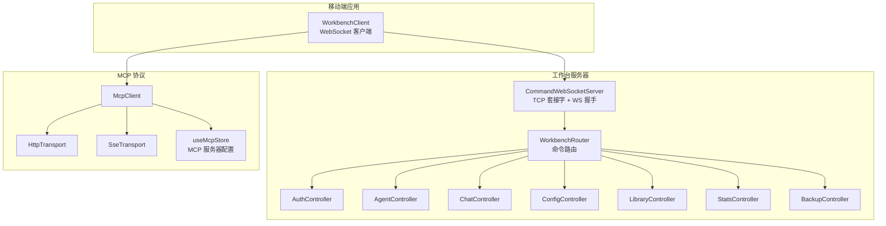
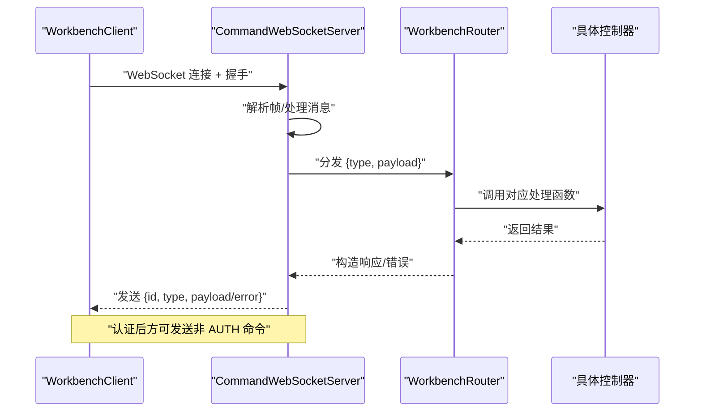
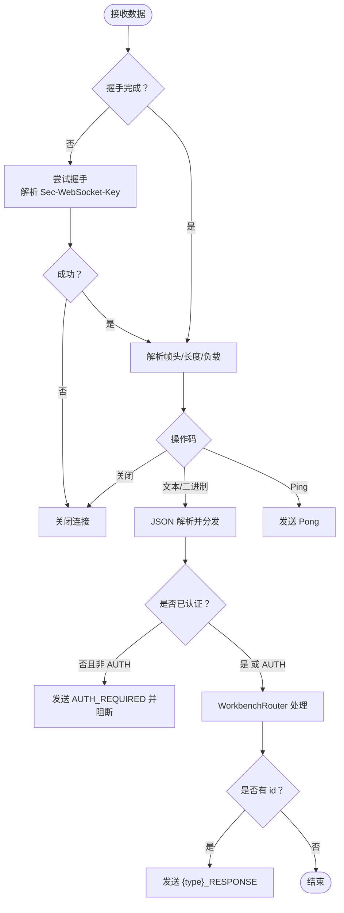
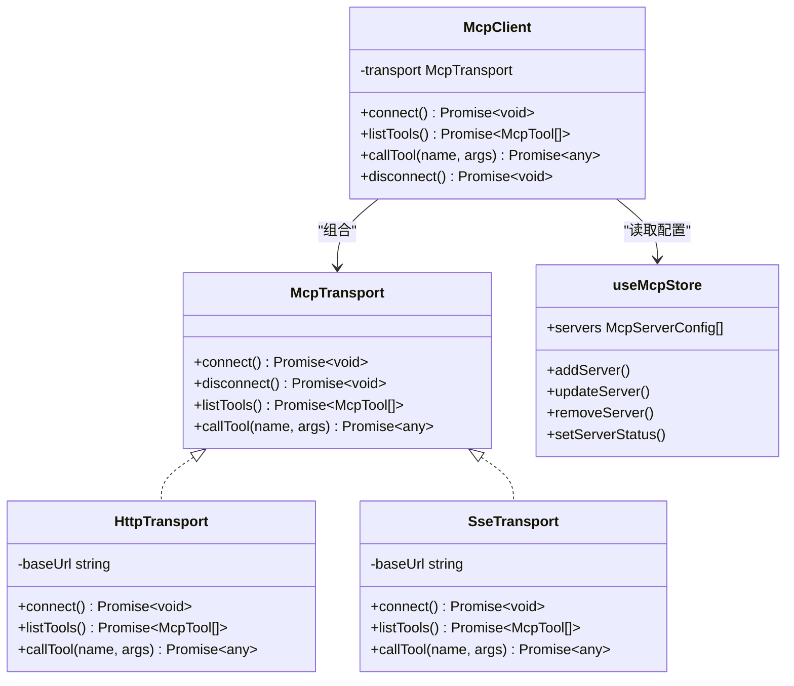
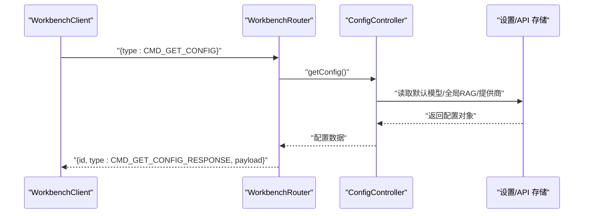
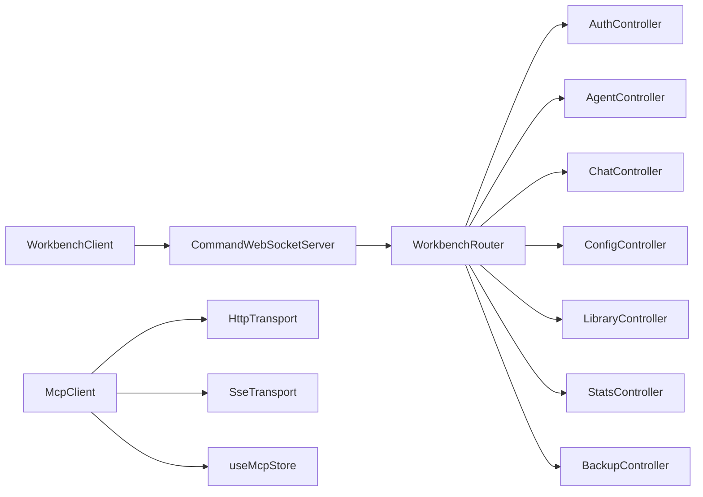

# API参考

<cite>
**本文引用的文件**
- [CommandWebSocketServer.ts](file://src/services/workbench/CommandWebSocketServer.ts)
- [WorkbenchRouter.ts](file://src/services/workbench/WorkbenchRouter.ts)
- [AuthController.ts](file://src/services/workbench/controllers/AuthController.ts)
- [AgentController.ts](file://src/services/workbench/controllers/AgentController.ts)
- [ChatController.ts](file://src/services/workbench/controllers/ChatController.ts)
- [ConfigController.ts](file://src/services/workbench/controllers/ConfigController.ts)
- [LibraryController.ts](file://src/services/workbench/controllers/LibraryController.ts)
- [StatsController.ts](file://src/services/workbench/controllers/StatsController.ts)
- [BackupController.ts](file://src/services/workbench/controllers/BackupController.ts)
- [WorkbenchClient.ts](file://web-client/src/services/WorkbenchClient.ts)
- [mcp-client.ts](file://src/lib/mcp/mcp-client.ts)
- [transport.ts](file://src/lib/mcp/transport.ts)
- [http-transport.ts](file://src/lib/mcp/transports/http-transport.ts)
- [sse-transport.ts](file://src/lib/mcp/transports/sse-transport.ts)
- [mcp-store.ts](file://src/store/mcp-store.ts)
- [api-types.ts](file://src/store/api-types.ts)
- [chat.ts](file://src/types/chat.ts)
</cite>

## 目录
1. [简介](#简介)
2. [项目结构](#项目结构)
3. [核心组件](#核心组件)
4. [架构总览](#架构总览)
5. [详细组件分析](#详细组件分析)
6. [依赖关系分析](#依赖关系分析)
7. [性能考量](#性能考量)
8. [故障排查指南](#故障排查指南)
9. [结论](#结论)
10. [附录](#附录)

## 简介
本文件为 Nexara 项目的全面 API 参考，覆盖以下接口与协议：
- WebSocket API：命令型 RPC 协议、握手与帧格式、事件类型与实时交互模式
- HTTP API：静态资源服务与工作台路由（通过 WebSocket 实现命令式 RPC）
- MCP 协议 API：HTTP/SSE 传输适配、工具清单与调用流程
- 内部服务 API：工作台控制器与存储同步服务

文档同时提供类型定义、数据结构说明、版本管理与迁移建议，帮助开发者快速集成与扩展。

## 项目结构
Nexara 的 API 层主要由以下模块构成：
- 服务端 WebSocket：命令式工作台服务器，负责认证、路由与消息分发
- 控制器层：按功能域划分的控制器（认证、代理、聊天、配置、知识库、统计、备份）
- 客户端工作台：基于 WebSocket 的客户端封装，提供请求/响应与事件订阅
- MCP 协议：抽象传输接口与 HTTP/SSE 两种实现，统一工具发现与调用
- 类型与存储：统一的数据类型定义与状态存储

图表来源
- [CommandWebSocketServer.ts:44-178](file://src/services/workbench/CommandWebSocketServer.ts#L44-L178)
- [WorkbenchRouter.ts:18-72](file://src/services/workbench/WorkbenchRouter.ts#L18-L72)
- [WorkbenchClient.ts:29-94](file://web-client/src/services/WorkbenchClient.ts#L29-L94)
- [mcp-client.ts:6-51](file://src/lib/mcp/mcp-client.ts#L6-L51)

章节来源
- [CommandWebSocketServer.ts:1-488](file://src/services/workbench/CommandWebSocketServer.ts#L1-L488)
- [WorkbenchRouter.ts:1-75](file://src/services/workbench/WorkbenchRouter.ts#L1-L75)
- [WorkbenchClient.ts:1-317](file://web-client/src/services/WorkbenchClient.ts#L1-L317)
- [mcp-client.ts:1-51](file://src/lib/mcp/mcp-client.ts#L1-L51)

## 核心组件
- 命令式 WebSocket 服务器：提供 TCP 套接字监听、HTTP/1.1 协议升级、自定义帧编解码、心跳与清理、广播与写队列
- 路由器：将消息类型映射到控制器处理函数，统一错误与响应格式
- 控制器：按领域拆分的业务处理器，负责读写状态与返回结果
- 客户端工作台：封装连接、认证、请求/响应、事件与心跳
- MCP 客户端：抽象传输接口，支持 HTTP 与 SSE 两种传输方式

章节来源
- [CommandWebSocketServer.ts:33-178](file://src/services/workbench/CommandWebSocketServer.ts#L33-L178)
- [WorkbenchRouter.ts:18-72](file://src/services/workbench/WorkbenchRouter.ts#L18-L72)
- [WorkbenchClient.ts:18-94](file://web-client/src/services/WorkbenchClient.ts#L18-L94)
- [mcp-client.ts:6-51](file://src/lib/mcp/mcp-client.ts#L6-L51)

## 架构总览
下图展示从客户端到服务器再到控制器的完整调用链路，以及 MCP 协议的外部集成点。

图表来源
- [WorkbenchClient.ts:216-241](file://web-client/src/services/WorkbenchClient.ts#L216-L241)
- [CommandWebSocketServer.ts:415-444](file://src/services/workbench/CommandWebSocketServer.ts#L415-L444)
- [WorkbenchRouter.ts:34-71](file://src/services/workbench/WorkbenchRouter.ts#L34-L71)

## 详细组件分析

### WebSocket API（命令式 RPC）
- 传输层：基于 TCP 套接字，实现 HTTP/1.1 协议升级与 WebSocket 握手，采用固定魔术串计算 Accept Key
- 帧格式：自定义二进制帧（强制 opcode 为 0x2），支持 126/127 字节长度扩展，无掩码（服务端不掩码）
- 消息结构：JSON 对象，包含 type、id（可选）、payload；支持 AUTH、HEARTBEAT、各类 CMD_* 命令
- 认证：仅 AUTH 命令可在未认证状态下使用；认证成功后客户端被标记为已认证
- 心跳：客户端定期发送 HEARTBEAT，服务端维护 lastHeartbeat 并定时清理超时连接
- 广播：对已认证且完成握手的客户端广播消息
- 错误处理：统一包装为 {id, type, error} 或 {id, type, payload}

图表来源
- [CommandWebSocketServer.ts:192-297](file://src/services/workbench/CommandWebSocketServer.ts#L192-L297)
- [CommandWebSocketServer.ts:415-444](file://src/services/workbench/CommandWebSocketServer.ts#L415-L444)
- [WorkbenchRouter.ts:34-71](file://src/services/workbench/WorkbenchRouter.ts#L34-L71)

章节来源
- [CommandWebSocketServer.ts:22-488](file://src/services/workbench/CommandWebSocketServer.ts#L22-L488)
- [WorkbenchRouter.ts:1-75](file://src/services/workbench/WorkbenchRouter.ts#L1-L75)

### HTTP API（静态资源与工作台）
- 静态资源：通过静态服务器提供前端资源（与工作台命令式 API 解耦）
- 工作台命令式 RPC：通过 WebSocket 实现，HTTP 仅用于资源交付，不直接暴露 REST 端点
- 客户端封装：WorkbenchClient 提供 connect/request/send 等方法，自动处理认证、心跳与事件

章节来源
- [CommandWebSocketServer.ts:44-178](file://src/services/workbench/CommandWebSocketServer.ts#L44-L178)
- [WorkbenchClient.ts:29-94](file://web-client/src/services/WorkbenchClient.ts#L29-L94)

### MCP 协议 API
- 抽象接口：McpTransport 定义 connect、disconnect、listTools、callTool
- 传输实现：
  - HTTP 传输：构建稳健 URL，设置标准头部，无连接状态
  - SSE 传输：通过 POST 发送请求，等待服务端事件流响应
- 客户端封装：McpClient 根据配置选择 HTTP/SSE，默认 HTTP 以保证兼容
- 服务器配置：useMcpStore 管理 MCP 服务器列表、状态与同步信息

图表来源
- [transport.ts:2-13](file://src/lib/mcp/transport.ts#L2-L13)
- [http-transport.ts:3-43](file://src/lib/mcp/transports/http-transport.ts#L3-L43)
- [sse-transport.ts:156-204](file://src/lib/mcp/transports/sse-transport.ts#L156-L204)
- [mcp-client.ts:6-51](file://src/lib/mcp/mcp-client.ts#L6-L51)
- [mcp-store.ts:6-72](file://src/store/mcp-store.ts#L6-L72)

章节来源
- [transport.ts:1-13](file://src/lib/mcp/transport.ts#L1-L13)
- [http-transport.ts:1-43](file://src/lib/mcp/transports/http-transport.ts#L1-L43)
- [sse-transport.ts:156-204](file://src/lib/mcp/transports/sse-transport.ts#L156-L204)
- [mcp-client.ts:1-51](file://src/lib/mcp/mcp-client.ts#L1-L51)
- [mcp-store.ts:1-72](file://src/store/mcp-store.ts#L1-L72)

### 内部服务 API（工作台控制器）
- 认证（AUTH）：支持访问码与令牌两种方式；令牌 24 小时有效期；过期自动清理
- 代理（Agent）：查询、更新、创建、删除代理
- 聊天（Chat）：会话列表、历史、创建、删除、发送消息、中断生成、删除消息、重新生成
- 配置（Config）：获取与更新默认模型、全局 RAG 配置、提供商列表（全量同步）
- 知识库（Library）：获取库、上传/删除文件、创建/删除文件夹、获取图谱数据
- 统计（Stats）：获取全局与按模型统计、重置统计
- 备份（Backup）：获取/更新 WebDAV 配置（本地存储）

图表来源
- [WorkbenchClient.ts:107-113](file://web-client/src/services/WorkbenchClient.ts#L107-L113)
- [WorkbenchRouter.ts:34-71](file://src/services/workbench/WorkbenchRouter.ts#L34-L71)
- [ConfigController.ts:6-23](file://src/services/workbench/controllers/ConfigController.ts#L6-L23)

章节来源
- [AuthController.ts:17-55](file://src/services/workbench/controllers/AuthController.ts#L17-L55)
- [AgentController.ts:4-48](file://src/services/workbench/controllers/AgentController.ts#L4-L48)
- [ChatController.ts:5-130](file://src/services/workbench/controllers/ChatController.ts#L5-L130)
- [ConfigController.ts:5-71](file://src/services/workbench/controllers/ConfigController.ts#L5-L71)
- [LibraryController.ts:4-54](file://src/services/workbench/controllers/LibraryController.ts#L4-L54)
- [StatsController.ts:4-23](file://src/services/workbench/controllers/StatsController.ts#L4-L23)
- [BackupController.ts:6-29](file://src/services/workbench/controllers/BackupController.ts#L6-L29)

## 依赖关系分析
- 服务器端：CommandWebSocketServer 依赖 WorkbenchRouter 与各控制器；控制器依赖对应 store
- 客户端：WorkbenchClient 依赖 WebSocket，封装请求/响应与事件；McpClient 依赖传输实现
- 数据类型：api-types.ts 与 chat.ts 提供统一的类型定义，贯穿控制器与存储

图表来源
- [CommandWebSocketServer.ts:134-167](file://src/services/workbench/CommandWebSocketServer.ts#L134-L167)
- [WorkbenchRouter.ts:18-72](file://src/services/workbench/WorkbenchRouter.ts#L18-L72)
- [WorkbenchClient.ts:18-94](file://web-client/src/services/WorkbenchClient.ts#L18-L94)
- [mcp-client.ts:6-51](file://src/lib/mcp/mcp-client.ts#L6-L51)

章节来源
- [CommandWebSocketServer.ts:1-488](file://src/services/workbench/CommandWebSocketServer.ts#L1-L488)
- [WorkbenchRouter.ts:1-75](file://src/services/workbench/WorkbenchRouter.ts#L1-L75)
- [WorkbenchClient.ts:1-317](file://web-client/src/services/WorkbenchClient.ts#L1-L317)
- [mcp-client.ts:1-51](file://src/lib/mcp/mcp-client.ts#L1-L51)

## 性能考量
- 写入可靠性：服务端写队列与分片写入（固定分片大小），避免桥接传输阻塞
- 大包日志：对大帧进行调试日志输出，便于定位性能瓶颈
- 心跳与清理：定时检查心跳，超时自动断开，降低无效连接占用
- 请求幂等：路由层对重复注册进行安全处理，确保服务重启后正确注册

章节来源
- [CommandWebSocketServer.ts:307-413](file://src/services/workbench/CommandWebSocketServer.ts#L307-L413)
- [CommandWebSocketServer.ts:471-484](file://src/services/workbench/CommandWebSocketServer.ts#L471-L484)

## 故障排查指南
- 连接失败
  - 检查端口占用与重试逻辑（端口占用时自动重试）
  - 确认握手头中包含正确的 Sec-WebSocket-Key
- 认证失败
  - 确认访问码或令牌有效；令牌 24 小时过期
  - 客户端收到 AUTH_FAIL 时应清除本地令牌并回到认证状态
- 请求超时
  - 客户端请求默认超时时间可调整；确认网络连通与服务端处理耗时
- 心跳异常
  - 服务端定时清理长时间无心跳的连接；检查客户端心跳发送频率

章节来源
- [CommandWebSocketServer.ts:108-131](file://src/services/workbench/CommandWebSocketServer.ts#L108-L131)
- [CommandWebSocketServer.ts:203-239](file://src/services/workbench/CommandWebSocketServer.ts#L203-L239)
- [AuthController.ts:17-55](file://src/services/workbench/controllers/AuthController.ts#L17-L55)
- [WorkbenchClient.ts:222-241](file://web-client/src/services/WorkbenchClient.ts#L222-L241)
- [CommandWebSocketServer.ts:471-484](file://src/services/workbench/CommandWebSocketServer.ts#L471-L484)

## 结论
本参考文档系统梳理了 Nexara 的 WebSocket 命令式 API、MCP 协议与内部服务接口，提供了消息格式、事件类型、认证机制、错误处理与性能优化要点。建议在集成时遵循统一的请求/响应模式与类型定义，确保前后端一致性与可维护性。

## 附录

### API 类型定义与数据结构
- 服务商与模型
  - ApiProviderType：支持多家模型供应商与本地模型
  - ModelCapabilities：视觉、联网、推理、工具等能力标识
  - ModelConfig：模型配置项（含内部 uuid、对外 id、类型、上下文长度、能力、启用状态等）
  - ProviderConfig：供应商配置（含密钥、基础地址、VertexAI 专属字段、模型列表等）
  - TokenStats：令牌用量统计（输入/输出/总计，最后使用时间）
- 聊天与会话
  - InferenceParams：温度、采样、最大 token、惩罚系数、思考等级
  - Agent：代理配置（系统提示、默认模型、高级参数、RAG 配置等）
  - Message/Session：消息与会话结构（含引用、RAG 进度/元数据、工具调用/产物、计费用量等）
  - TaskState/TaskStep：任务状态与步骤
  - RagConfiguration：RAG 全局/会话级配置（切块、上下文、检索、混合检索、知识图谱、降本策略等）

章节来源
- [api-types.ts:1-60](file://src/store/api-types.ts#L1-L60)
- [chat.ts:6-314](file://src/types/chat.ts#L6-L314)

### API 版本管理、向后兼容与迁移
- 传输类型迁移
  - MCP 服务器配置新增 type 字段（http/sse），默认 http 以保证兼容
  - 新增 callInterval/lastCallTimestamp 字段，便于后续调用节流与监控
- 命令式 API
  - 保持 type/id/payload 结构不变，新增错误包装 {id, type, error}
  - 路由器对未知命令返回统一 ERROR，便于客户端识别
- 数据结构演进
  - Session/RAG 配置持续扩展（知识图谱、降本策略、增量哈希等），建议客户端做字段存在性判断
  - 令牌统计与计费明细逐步完善，建议前端兼容显示

章节来源
- [mcp-store.ts:6-30](file://src/store/mcp-store.ts#L6-L30)
- [WorkbenchRouter.ts:55-71](file://src/services/workbench/WorkbenchRouter.ts#L55-L71)
- [chat.ts:244-314](file://src/types/chat.ts#L244-L314)