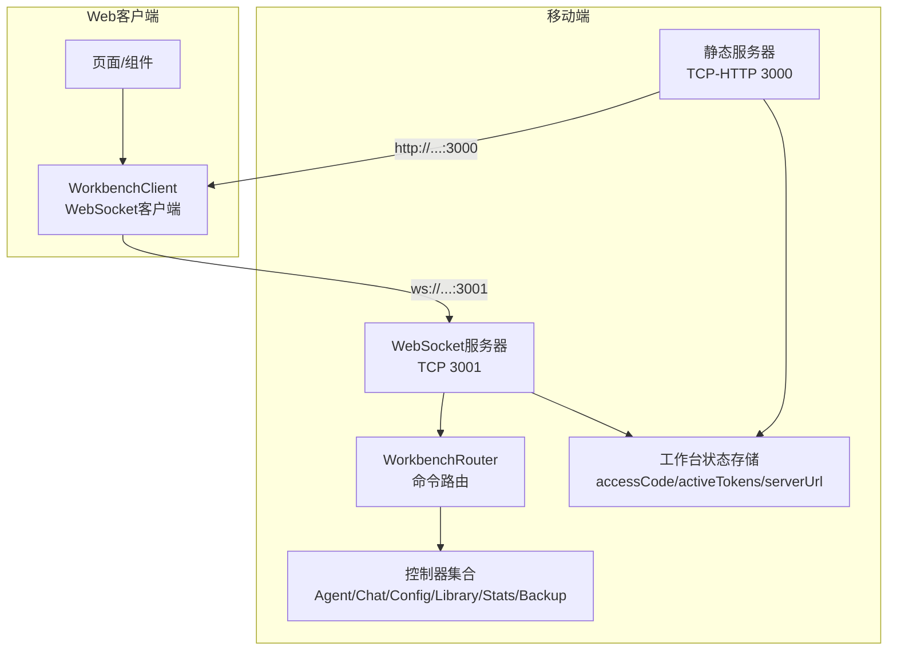
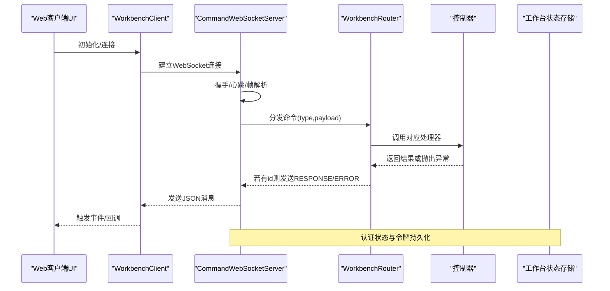
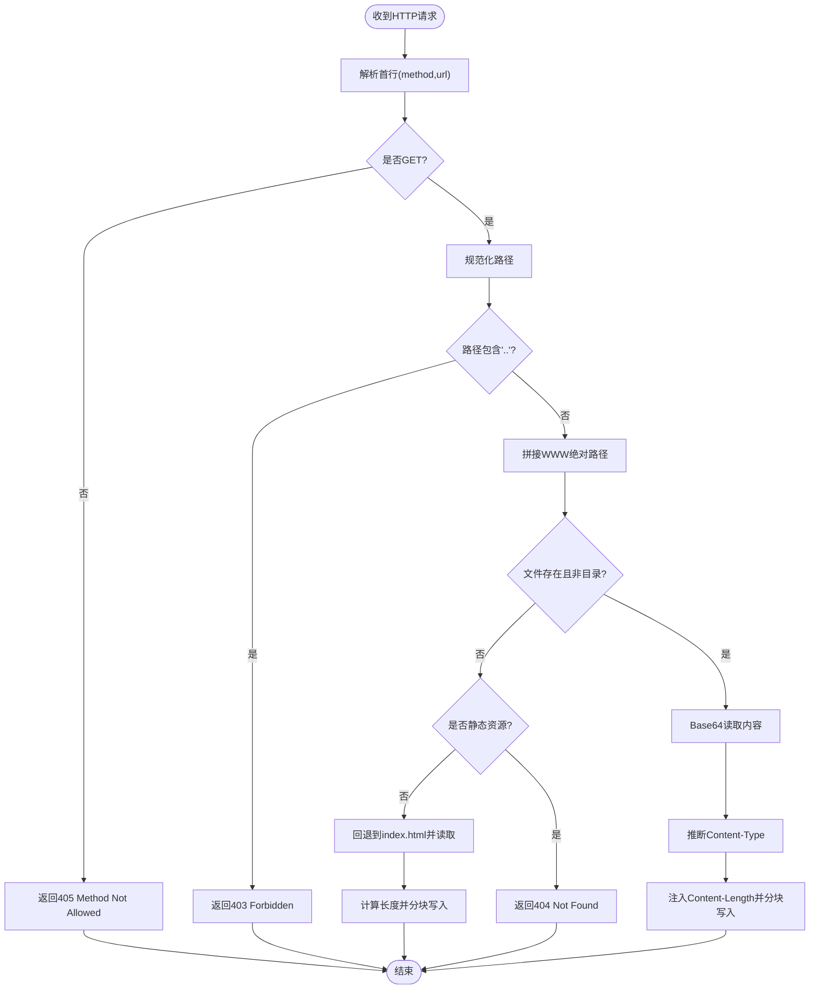
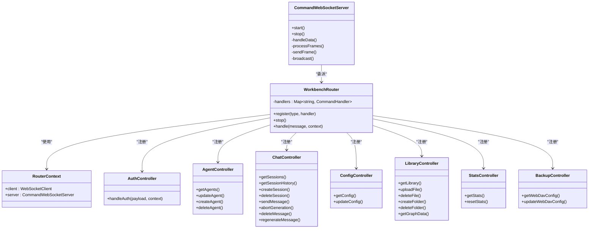
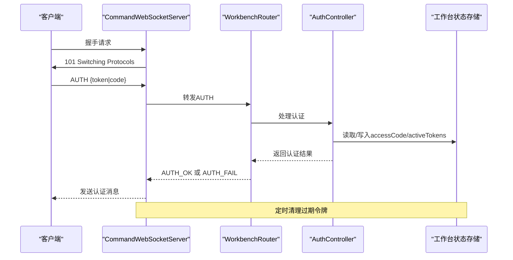
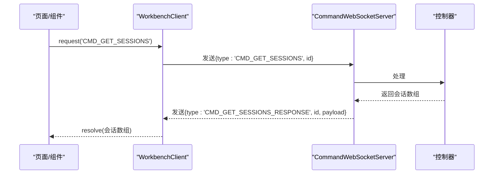
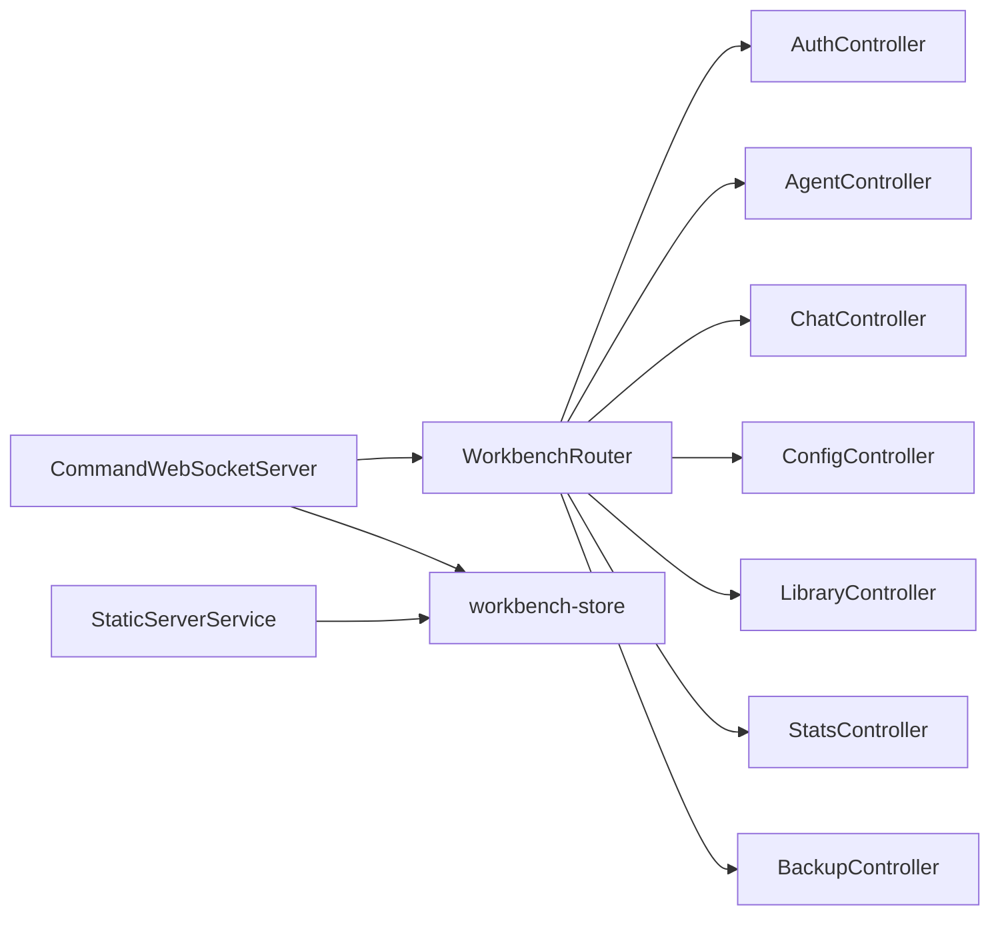

# HTTP API

<cite>
**本文引用的文件**
- [WorkbenchRouter.ts](file://src/services/workbench/WorkbenchRouter.ts)
- [CommandWebSocketServer.ts](file://src/services/workbench/CommandWebSocketServer.ts)
- [StaticServerService.ts](file://src/services/workbench/StaticServerService.ts)
- [AuthController.ts](file://src/services/workbench/controllers/AuthController.ts)
- [AgentController.ts](file://src/services/workbench/controllers/AgentController.ts)
- [ChatController.ts](file://src/services/workbench/controllers/ChatController.ts)
- [ConfigController.ts](file://src/services/workbench/controllers/ConfigController.ts)
- [LibraryController.ts](file://src/services/workbench/controllers/LibraryController.ts)
- [StatsController.ts](file://src/services/workbench/controllers/StatsController.ts)
- [BackupController.ts](file://src/services/workbench/controllers/BackupController.ts)
- [workbench-store.ts](file://src/store/workbench-store.ts)
- [WorkbenchClient.ts](file://web-client/src/services/WorkbenchClient.ts)
- [StoreService.ts](file://web-client/src/services/StoreService.ts)
</cite>

## 目录
1. [简介](#简介)
2. [项目结构](#项目结构)
3. [核心组件](#核心组件)
4. [架构总览](#架构总览)
5. [详细组件分析](#详细组件分析)
6. [依赖关系分析](#依赖关系分析)
7. [性能考虑](#性能考虑)
8. [故障排查指南](#故障排查指南)
9. [结论](#结论)
10. [附录](#附录)

## 简介
本文件面向Nexara项目的HTTP API与工作台通信协议，聚焦以下目标：
- 静态文件服务：HTTP端点、路由配置、安全策略与SPA回退机制
- WorkbenchRouter的HTTP路由处理机制：命令式路由、请求处理流程、响应格式
- 静态服务器服务架构：文件系统映射、缓存策略与性能优化
- 认证机制、权限控制与安全防护
- API端点清单、请求/响应示例、错误码说明与使用限制
- 客户端调用示例、SDK使用指南与最佳实践

## 项目结构
Nexara在移动端通过本地静态服务器与WebSocket服务器提供工作台能力：
- 静态资源由本地TCP-HTTP服务器提供，支持SPA回退与基础安全校验
- WebSocket服务器负责命令式RPC（基于JSON消息），实现认证、聊天、代理、配置、知识库、统计与备份等功能

图表来源
- [CommandWebSocketServer.ts:44-178](file://src/services/workbench/CommandWebSocketServer.ts#L44-L178)
- [StaticServerService.ts:24-236](file://src/services/workbench/StaticServerService.ts#L24-L236)
- [WorkbenchRouter.ts:18-72](file://src/services/workbench/WorkbenchRouter.ts#L18-L72)
- [workbench-store.ts:22-55](file://src/store/workbench-store.ts#L22-L55)

章节来源
- [CommandWebSocketServer.ts:44-178](file://src/services/workbench/CommandWebSocketServer.ts#L44-L178)
- [StaticServerService.ts:24-236](file://src/services/workbench/StaticServerService.ts#L24-L236)
- [workbench-store.ts:22-55](file://src/store/workbench-store.ts#L22-L55)

## 核心组件
- WorkbenchRouter：命令式路由分发器，将消息类型映射到对应处理器，支持请求-响应与错误回传
- CommandWebSocketServer：WebSocket服务器，负责握手、帧解析、心跳、写队列与广播；注册所有命令并委派给Router
- StaticServerService：本地TCP-HTTP静态服务器，提供SPA应用与资源文件，含路径安全与回退逻辑
- 控制器：按功能域划分（代理、聊天、配置、知识库、统计、备份），从各自store读取/更新数据
- 工作台状态存储：维护服务器状态、URL、访问码、活动令牌与连接数

章节来源
- [WorkbenchRouter.ts:18-72](file://src/services/workbench/WorkbenchRouter.ts#L18-L72)
- [CommandWebSocketServer.ts:33-178](file://src/services/workbench/CommandWebSocketServer.ts#L33-L178)
- [StaticServerService.ts:21-236](file://src/services/workbench/StaticServerService.ts#L21-L236)
- [workbench-store.ts:22-55](file://src/store/workbench-store.ts#L22-L55)

## 架构总览
下图展示从Web客户端到移动端服务端的完整链路，包括认证、命令路由与静态资源访问。

图表来源
- [CommandWebSocketServer.ts:134-178](file://src/services/workbench/CommandWebSocketServer.ts#L134-L178)
- [WorkbenchRouter.ts:34-71](file://src/services/workbench/WorkbenchRouter.ts#L34-L71)
- [AuthController.ts:17-54](file://src/services/workbench/controllers/AuthController.ts#L17-L54)
- [workbench-store.ts:22-55](file://src/store/workbench-store.ts#L22-L55)

## 详细组件分析

### 静态服务器服务架构（HTTP端点与安全策略）
- 端口与监听
  - TCP-HTTP服务器监听0.0.0.0:3000，获取设备局域网IPv4地址作为访问URL
- 路由与文件映射
  - 仅允许GET方法；根路径自动映射至index.html
  - 支持SPA回退：当请求的资源不存在且非静态资源扩展名时，回退到index.html
  - 资源类型根据扩展名判定（HTML/JS/CSS/图片/图标等）
- 安全策略
  - 路径中包含“..”直接返回403
  - 仅允许GET方法，其他方法返回405
  - 未找到资源返回404
- 性能优化
  - 使用16KB分块写入，避免大文件一次性写入导致阻塞
  - 对index.html与index.html同体量小文件采用分块写入，确保可靠传输
  - 异常时返回500并优雅关闭连接
- 资产准备
  - 启动前将打包的index.html、JS/CSS资源与vite图标复制到WWW目录，保持与构建产物一致的引用路径

图表来源
- [StaticServerService.ts:48-177](file://src/services/workbench/StaticServerService.ts#L48-L177)
- [StaticServerService.ts:250-297](file://src/services/workbench/StaticServerService.ts#L250-L297)

章节来源
- [StaticServerService.ts:24-236](file://src/services/workbench/StaticServerService.ts#L24-L236)

### WorkbenchRouter的HTTP路由处理机制
- 注册与分发
  - 通过register(type, handler)注册命令处理器
  - handle(message, context)根据type查找处理器并执行
- 请求-响应与错误
  - 若消息包含id，则在处理器返回后发送{type: "{type}_RESPONSE", id, payload}
  - 处理器抛错时发送{type: "{type}_ERROR", id, error}
  - 无处理器时发送{type: "ERROR", error: "Unknown command: {type}"}
- 上下文
  - context包含client（含send方法）与server实例

图表来源
- [WorkbenchRouter.ts:18-72](file://src/services/workbench/WorkbenchRouter.ts#L18-L72)
- [CommandWebSocketServer.ts:134-178](file://src/services/workbench/CommandWebSocketServer.ts#L134-L178)
- [AuthController.ts:17-54](file://src/services/workbench/controllers/AuthController.ts#L17-L54)
- [AgentController.ts:4-48](file://src/services/workbench/controllers/AgentController.ts#L4-L48)
- [ChatController.ts:5-130](file://src/services/workbench/controllers/ChatController.ts#L5-L130)
- [ConfigController.ts:5-71](file://src/services/workbench/controllers/ConfigController.ts#L5-L71)
- [LibraryController.ts:4-54](file://src/services/workbench/controllers/LibraryController.ts#L4-L54)
- [StatsController.ts:4-23](file://src/services/workbench/controllers/StatsController.ts#L4-L23)
- [BackupController.ts:6-29](file://src/services/workbench/controllers/BackupController.ts#L6-L29)

章节来源
- [WorkbenchRouter.ts:18-72](file://src/services/workbench/WorkbenchRouter.ts#L18-L72)

### WebSocket服务器与认证机制
- 握手与心跳
  - 服务器实现标准WebSocket握手，生成Accept Key并切换协议
  - 心跳每10秒一次，30秒无心跳自动断开
- 写队列与可靠性
  - 每个客户端维护写队列，保证帧顺序与原子性
  - 采用1400字节分片写入，必要时等待drain事件
- 认证策略
  - 未认证客户端仅允许发送AUTH命令
  - AUTH成功后标记client.authenticated，并下发AUTH_OK携带token
  - 支持两种认证方式：令牌（带过期时间）与PIN码（含开发者后门）
  - 活跃令牌定期清理，避免无限增长
- 存储与状态
  - accessCode与activeTokens持久化于工作台状态存储
  - 连接数实时更新

图表来源
- [CommandWebSocketServer.ts:203-239](file://src/services/workbench/CommandWebSocketServer.ts#L203-L239)
- [CommandWebSocketServer.ts:415-444](file://src/services/workbench/CommandWebSocketServer.ts#L415-L444)
- [AuthController.ts:17-54](file://src/services/workbench/controllers/AuthController.ts#L17-L54)
- [workbench-store.ts:22-55](file://src/store/workbench-store.ts#L22-L55)

章节来源
- [CommandWebSocketServer.ts:33-178](file://src/services/workbench/CommandWebSocketServer.ts#L33-L178)
- [AuthController.ts:17-54](file://src/services/workbench/controllers/AuthController.ts#L17-L54)
- [workbench-store.ts:22-55](file://src/store/workbench-store.ts#L22-L55)

### API端点清单与使用说明
- 命令命名规范
  - 所有命令以“CMD_”前缀标识，区分于系统消息（如AUTH_OK、ERROR、AUTH_REQUIRED）
  - 响应消息类型为“{原命令}_RESPONSE”，错误消息为“{原命令}_ERROR”
- 认证
  - AUTH：支持{token}或{code}两种方式；成功后返回{type: "AUTH_OK", payload: {token}}；失败返回{type: "AUTH_FAIL"}
- 代理管理
  - CMD_GET_AGENTS、CMD_CREATE_AGENT、CMD_UPDATE_AGENT、CMD_DELETE_AGENT
- 聊天会话
  - CMD_GET_SESSIONS、CMD_GET_HISTORY、CMD_CREATE_SESSION、CMD_DELETE_SESSION、CMD_SEND_MESSAGE、CMD_ABORT_GENERATION、CMD_DELETE_MESSAGE、CMD_REGENERATE_MESSAGE
- 配置
  - CMD_GET_CONFIG、CMD_UPDATE_CONFIG
- 知识库
  - CMD_GET_LIBRARY、CMD_UPLOAD_FILE、CMD_DELETE_FILE、CMD_CREATE_FOLDER、CMD_DELETE_FOLDER、CMD_GET_GRAPH
- 统计
  - CMD_GET_STATS、CMD_RESET_STATS
- 备份（WebDAV）
  - CMD_GET_WEBDAV、CMD_UPDATE_WEBDAV
- 系统消息
  - AUTH_REQUIRED：未认证客户端尝试发送非AUTH命令时返回
  - ERROR：未知命令时返回

章节来源
- [CommandWebSocketServer.ts:134-178](file://src/services/workbench/CommandWebSocketServer.ts#L134-L178)
- [WorkbenchRouter.ts:34-71](file://src/services/workbench/WorkbenchRouter.ts#L34-L71)
- [AuthController.ts:17-54](file://src/services/workbench/controllers/AuthController.ts#L17-L54)
- [AgentController.ts:4-48](file://src/services/workbench/controllers/AgentController.ts#L4-L48)
- [ChatController.ts:5-130](file://src/services/workbench/controllers/ChatController.ts#L5-L130)
- [ConfigController.ts:5-71](file://src/services/workbench/controllers/ConfigController.ts#L5-L71)
- [LibraryController.ts:4-54](file://src/services/workbench/controllers/LibraryController.ts#L4-L54)
- [StatsController.ts:4-23](file://src/services/workbench/controllers/StatsController.ts#L4-L23)
- [BackupController.ts:6-29](file://src/services/workbench/controllers/BackupController.ts#L6-L29)

### 客户端调用示例与SDK使用指南
- 连接与认证
  - 使用WorkbenchClient.connect(url, accessCode)，自动尝试令牌或PIN认证
  - 认证成功后状态变为authenticated，可发起命令请求
- 命令请求
  - request(type, payload, timeout?)：返回Promise，自动分配id并等待响应
  - send(type, payload)：单向消息，不等待响应
- 典型流程
  - 获取会话列表：await client.request('CMD_GET_SESSIONS')
  - 发送消息：await client.request('CMD_SEND_MESSAGE', { sessionId, content })
  - 获取配置：await client.request('CMD_GET_CONFIG')
  - 更新配置：await client.request('CMD_UPDATE_CONFIG', config)
  - 知识库操作：上传/删除文件、创建/删除文件夹、获取图谱数据
- 事件与状态
  - 状态事件：statusChange/disconnected/connected/authenticated
  - 通用消息事件：message以及各命令类型的事件（如SESSION_LIST_UPDATED）

图表来源
- [WorkbenchClient.ts:222-241](file://web-client/src/services/WorkbenchClient.ts#L222-L241)
- [CommandWebSocketServer.ts:415-444](file://src/services/workbench/CommandWebSocketServer.ts#L415-L444)

章节来源
- [WorkbenchClient.ts:18-317](file://web-client/src/services/WorkbenchClient.ts#L18-L317)
- [StoreService.ts:30-136](file://web-client/src/services/StoreService.ts#L30-L136)

## 依赖关系分析
- 组件耦合
  - CommandWebSocketServer聚合WorkbenchRouter与各控制器，形成清晰的命令分发层
  - StaticServerService与CommandWebSocketServer并行运行，分别负责静态资源与命令通道
  - 控制器依赖各自store进行数据读写，降低跨模块耦合
- 外部依赖
  - 网络与文件系统：react-native-tcp-socket、expo-file-system、expo-asset、react-native-network-info
  - 加密与哈希：jsrsasign（SHA-1/HMAC）
  - 状态管理：zustand + AsyncStorage
- 循环依赖
  - 通过延迟导入与单例注册避免循环依赖问题

图表来源
- [CommandWebSocketServer.ts:7-15](file://src/services/workbench/CommandWebSocketServer.ts#L7-L15)
- [WorkbenchRouter.ts:18-28](file://src/services/workbench/WorkbenchRouter.ts#L18-L28)
- [workbench-store.ts:22-55](file://src/store/workbench-store.ts#L22-L55)

章节来源
- [CommandWebSocketServer.ts:7-15](file://src/services/workbench/CommandWebSocketServer.ts#L7-L15)
- [WorkbenchRouter.ts:18-28](file://src/services/workbench/WorkbenchRouter.ts#L18-L28)

## 性能考虑
- 写入可靠性
  - WebSocket帧分片（1400字节）+写队列串行化，避免并发写入导致的丢包与崩溃
  - 大帧日志告警，便于定位异常
- 静态资源传输
  - Base64读取后转Buffer，注入Content-Length后再分块写入，避免粘包与截断
  - 小文件（如index.html）同样采用分块写入，提升稳定性
- 资源准备
  - 启动阶段预拷贝构建产物，减少首次访问延迟
- 心跳与超时
  - 10秒心跳维持长连，30秒无心跳断开，防止僵尸连接占用资源

章节来源
- [CommandWebSocketServer.ts:370-413](file://src/services/workbench/CommandWebSocketServer.ts#L370-L413)
- [StaticServerService.ts:147-177](file://src/services/workbench/StaticServerService.ts#L147-L177)
- [StaticServerService.ts:250-297](file://src/services/workbench/StaticServerService.ts#L250-L297)

## 故障排查指南
- 连接问题
  - 端口占用：服务器启动时对3000/3001端口进行重试，若持续被占用请释放端口
  - 网络不可达：确认设备在同一局域网，检查防火墙与IP获取
- 认证失败
  - 令牌过期或无效：清除本地令牌后重新输入PIN码
  - 开发者后门：PIN码支持特定值作为临时入口
- 命令错误
  - Unknown command：检查命令名称大小写与前缀
  - 参数缺失：确保必需字段（如sessionId/content/agentId等）齐全
- 静态资源404/403
  - 路径包含“..”会被拒绝
  - 非静态扩展名的资源不存在时走SPA回退，若index.html缺失也会返回404

章节来源
- [CommandWebSocketServer.ts:113-131](file://src/services/workbench/CommandWebSocketServer.ts#L113-L131)
- [StaticServerService.ts:59-72](file://src/services/workbench/StaticServerService.ts#L59-L72)
- [WorkbenchRouter.ts:65-70](file://src/services/workbench/WorkbenchRouter.ts#L65-L70)
- [AuthController.ts:38-52](file://src/services/workbench/controllers/AuthController.ts#L38-L52)

## 结论
Nexara通过本地静态服务器与WebSocket服务器协同，提供了稳定、可扩展的工作台API能力。静态服务器保障前端资源与SPA体验，WebSocket服务器承载命令式RPC与实时交互。认证与权限控制简单有效，结合写队列与分块传输提升了可靠性。建议在生产环境中进一步完善TLS与鉴权策略，并对大规模数据传输场景进行更细粒度的缓冲与背压控制。

## 附录

### API端点一览（命令）
- 认证
  - AUTH
- 代理
  - CMD_GET_AGENTS, CMD_CREATE_AGENT, CMD_UPDATE_AGENT, CMD_DELETE_AGENT
- 聊天
  - CMD_GET_SESSIONS, CMD_GET_HISTORY, CMD_CREATE_SESSION, CMD_DELETE_SESSION, CMD_SEND_MESSAGE, CMD_ABORT_GENERATION, CMD_DELETE_MESSAGE, CMD_REGENERATE_MESSAGE
- 配置
  - CMD_GET_CONFIG, CMD_UPDATE_CONFIG
- 知识库
  - CMD_GET_LIBRARY, CMD_UPLOAD_FILE, CMD_DELETE_FILE, CMD_CREATE_FOLDER, CMD_DELETE_FOLDER, CMD_GET_GRAPH
- 统计
  - CMD_GET_STATS, CMD_RESET_STATS
- 备份（WebDAV）
  - CMD_GET_WEBDAV, CMD_UPDATE_WEBDAV

章节来源
- [CommandWebSocketServer.ts:134-178](file://src/services/workbench/CommandWebSocketServer.ts#L134-L178)

### 请求/响应示例（路径）
- 客户端请求
  - [WorkbenchClient.ts:222-241](file://web-client/src/services/WorkbenchClient.ts#L222-L241)
- 服务器响应
  - [WorkbenchRouter.ts:48-64](file://src/services/workbench/WorkbenchRouter.ts#L48-L64)
- 系统消息
  - [CommandWebSocketServer.ts:424-429](file://src/services/workbench/CommandWebSocketServer.ts#L424-L429)

### 错误码说明
- WebSocket系统消息
  - AUTH_REQUIRED：未认证客户端尝试发送非AUTH命令
  - ERROR：未知命令
  - {原命令}_ERROR：命令执行异常
- HTTP静态服务器
  - 403 Forbidden：路径包含非法片段
  - 404 Not Found：资源不存在或SPA回退失败
  - 405 Method Not Allowed：非GET请求
  - 500 Internal Server Error：服务器内部错误

章节来源
- [CommandWebSocketServer.ts:424-429](file://src/services/workbench/CommandWebSocketServer.ts#L424-L429)
- [StaticServerService.ts:59-72](file://src/services/workbench/StaticServerService.ts#L59-L72)
- [WorkbenchRouter.ts:65-69](file://src/services/workbench/WorkbenchRouter.ts#L65-L69)

### 使用限制与最佳实践
- 局域网访问：静态服务器与WebSocket服务器均绑定0.0.0.0，需在同一局域网内访问
- 安全建议：建议在部署环境启用TLS与强认证，避免明文传输
- 超时与重试：客户端request默认超时可配置，建议对关键命令增加指数退避重试
- 大数据传输：聊天历史等大对象建议分页或增量订阅，避免一次性传输造成阻塞
- 日志与监控：利用服务器端日志与心跳机制快速定位连接与认证问题

章节来源
- [CommandWebSocketServer.ts:471-484](file://src/services/workbench/CommandWebSocketServer.ts#L471-L484)
- [WorkbenchClient.ts:222-241](file://web-client/src/services/WorkbenchClient.ts#L222-L241)