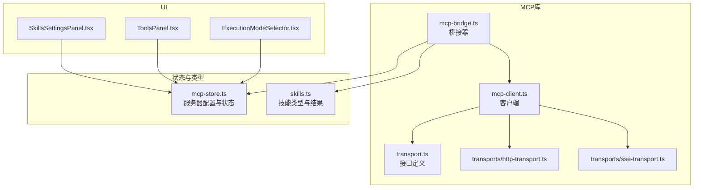
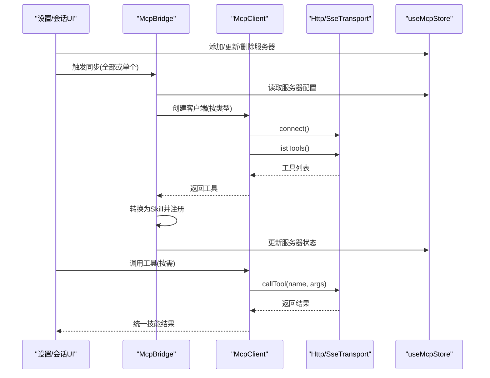
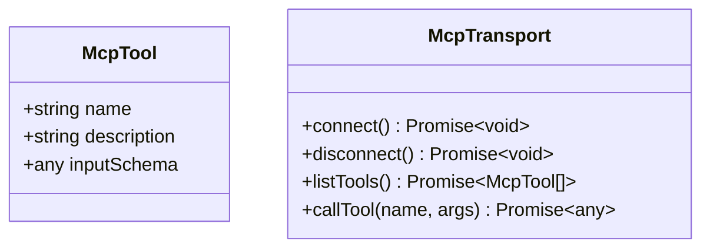
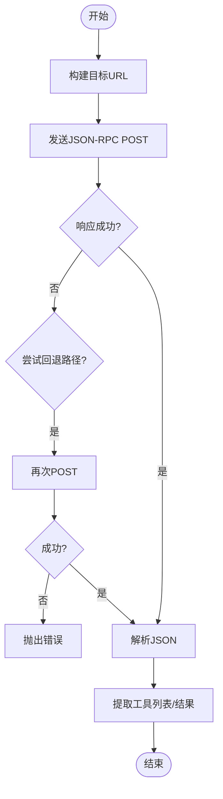
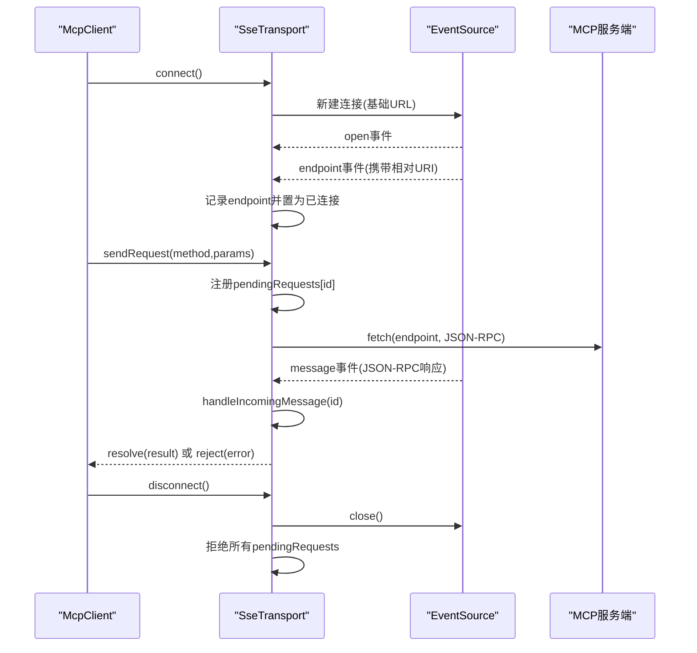
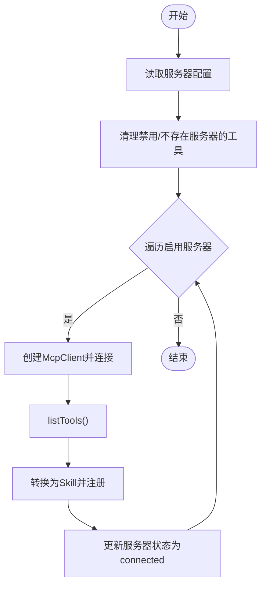
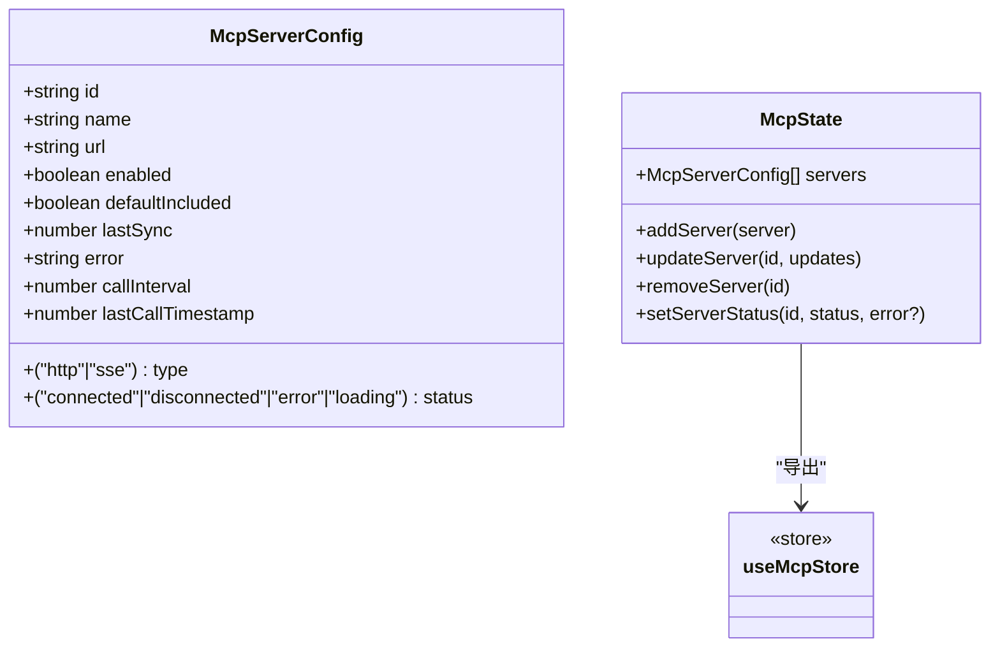
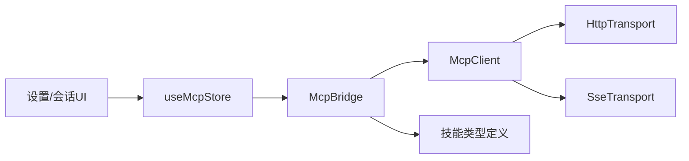

# MCP协议API

<cite>
**本文引用的文件**
- [transport.ts](file://src/lib/mcp/transport.ts)
- [mcp-client.ts](file://src/lib/mcp/mcp-client.ts)
- [mcp-bridge.ts](file://src/lib/mcp/mcp-bridge.ts)
- [http-transport.ts](file://src/lib/mcp/transports/http-transport.ts)
- [sse-transport.ts](file://src/lib/mcp/transports/sse-transport.ts)
- [mcp-store.ts](file://src/store/mcp-store.ts)
- [skills.ts](file://src/types/skills.ts)
- [SkillsSettingsPanel.tsx](file://src/components/settings/SkillsSettingsPanel.tsx)
- [ToolsPanel.tsx](file://src/features/chat/components/SessionSettingsSheet/ToolsPanel.tsx)
- [ExecutionModeSelector.tsx](file://src/features/chat/components/ExecutionModeSelector.tsx)
- [sse-transport.test.ts](file://src/lib/mcp/transports/__tests__/sse-transport.test.ts)
</cite>

## 目录
1. [简介](#简介)
2. [项目结构](#项目结构)
3. [核心组件](#核心组件)
4. [架构总览](#架构总览)
5. [详细组件分析](#详细组件分析)
6. [依赖关系分析](#依赖关系分析)
7. [性能考量](#性能考量)
8. [故障排除指南](#故障排除指南)
9. [结论](#结论)
10. [附录](#附录)

## 简介
本文件面向Nexara项目中的MCP（Model Context Protocol）协议API，系统化阐述其接口定义、消息格式与通信规范；深入解析MCP桥接器的实现机制（服务器连接管理、工具同步与参数验证）、MCP客户端的生命周期与状态监控、传输层安全与消息序列化、以及协议扩展点与第三方服务对接方案。文档同时提供协议规范、API参考、使用示例与故障排除方法，覆盖工具发现、能力声明与动态配置的完整流程。

## 项目结构
围绕MCP协议的核心代码位于src/lib/mcp目录，配套的状态存储位于src/store/mcp-store.ts，工具类型与执行结果定义位于src/types/skills.ts。UI侧通过设置面板与会话工具面板展示与控制MCP服务器状态与工具可用性。



**图表来源**
- [transport.ts:1-14](file://src/lib/mcp/transport.ts#L1-L14)
- [mcp-client.ts:1-52](file://src/lib/mcp/mcp-client.ts#L1-L52)
- [mcp-bridge.ts:1-202](file://src/lib/mcp/mcp-bridge.ts#L1-L202)
- [http-transport.ts:1-158](file://src/lib/mcp/transports/http-transport.ts#L1-L158)
- [sse-transport.ts:1-205](file://src/lib/mcp/transports/sse-transport.ts#L1-L205)
- [mcp-store.ts:1-72](file://src/store/mcp-store.ts#L1-L72)
- [skills.ts:1-74](file://src/types/skills.ts#L1-L74)
- [SkillsSettingsPanel.tsx:379-387](file://src/components/settings/SkillsSettingsPanel.tsx#L379-L387)
- [ToolsPanel.tsx:135-180](file://src/features/chat/components/SessionSettingsSheet/ToolsPanel.tsx#L135-L180)
- [ExecutionModeSelector.tsx:271-303](file://src/features/chat/components/ExecutionModeSelector.tsx#L271-L303)

**章节来源**
- [transport.ts:1-14](file://src/lib/mcp/transport.ts#L1-L14)
- [mcp-client.ts:1-52](file://src/lib/mcp/mcp-client.ts#L1-L52)
- [mcp-bridge.ts:1-202](file://src/lib/mcp/mcp-bridge.ts#L1-L202)
- [http-transport.ts:1-158](file://src/lib/mcp/transports/http-transport.ts#L1-L158)
- [sse-transport.ts:1-205](file://src/lib/mcp/transports/sse-transport.ts#L1-L205)
- [mcp-store.ts:1-72](file://src/store/mcp-store.ts#L1-L72)
- [skills.ts:1-74](file://src/types/skills.ts#L1-L74)
- [SkillsSettingsPanel.tsx:379-387](file://src/components/settings/SkillsSettingsPanel.tsx#L379-L387)
- [ToolsPanel.tsx:135-180](file://src/features/chat/components/SessionSettingsSheet/ToolsPanel.tsx#L135-L180)
- [ExecutionModeSelector.tsx:271-303](file://src/features/chat/components/ExecutionModeSelector.tsx#L271-L303)

## 核心组件
- 传输接口与工具定义：定义MCP工具与传输抽象，统一connect/disconnect/listTools/callTool等操作。
- 客户端：根据配置选择HTTP或SSE传输，封装连接、工具列表获取与工具调用。
- 桥接器：扫描启用的服务器，拉取工具清单，转换为本地技能并注册，同时维护服务器状态。
- 传输实现：HTTP传输与SSE传输分别实现JSON-RPC over HTTP与JSON-RPC over SSE。
- 状态存储：持久化的MCP服务器配置、状态与辅助操作。
- 类型系统：统一技能、执行上下文与执行结果的数据结构。

**章节来源**
- [transport.ts:2-13](file://src/lib/mcp/transport.ts#L2-L13)
- [mcp-client.ts:6-51](file://src/lib/mcp/mcp-client.ts#L6-L51)
- [mcp-bridge.ts:10-129](file://src/lib/mcp/mcp-bridge.ts#L10-L129)
- [http-transport.ts:3-157](file://src/lib/mcp/transports/http-transport.ts#L3-L157)
- [sse-transport.ts:22-204](file://src/lib/mcp/transports/sse-transport.ts#L22-L204)
- [mcp-store.ts:6-30](file://src/store/mcp-store.ts#L6-L30)
- [skills.ts:8-47](file://src/types/skills.ts#L8-L47)

## 架构总览
下图展示了MCP客户端、桥接器与传输层之间的交互关系，以及与状态存储和UI的衔接。



**图表来源**
- [mcp-bridge.ts:14-129](file://src/lib/mcp/mcp-bridge.ts#L14-L129)
- [mcp-client.ts:10-50](file://src/lib/mcp/mcp-client.ts#L10-L50)
- [http-transport.ts:40-143](file://src/lib/mcp/transports/http-transport.ts#L40-L143)
- [sse-transport.ts:34-193](file://src/lib/mcp/transports/sse-transport.ts#L34-L193)
- [mcp-store.ts:32-71](file://src/store/mcp-store.ts#L32-L71)

## 详细组件分析

### 传输接口与工具定义
- McpTool：工具名称、描述与输入Schema。
- McpTransport：统一的传输抽象，定义连接、断开、列出工具与调用工具的方法。



**图表来源**
- [transport.ts:2-13](file://src/lib/mcp/transport.ts#L2-L13)

**章节来源**
- [transport.ts:2-13](file://src/lib/mcp/transport.ts#L2-L13)

### MCP客户端
- 根据配置选择HTTP或SSE传输，默认向后兼容HTTP。
- 提供显式连接、列出工具与调用工具的能力。
- 调用工具时内部确保已连接。

```mermaid
classDiagram
class McpClient {
-transport : McpTransport
-config : McpServerConfig|{url,type}
+constructor(config)
+connect() Promise~void~
+listTools() Promise~McpTool[]~
+callTool(name,args) Promise~any~
+disconnect() Promise~void~
}
class HttpTransport
class SseTransport
McpClient --> HttpTransport : "使用"
McpClient --> SseTransport : "使用"
```

**图表来源**
- [mcp-client.ts:6-51](file://src/lib/mcp/mcp-client.ts#L6-L51)
- [http-transport.ts:3-48](file://src/lib/mcp/transports/http-transport.ts#L3-L48)
- [sse-transport.ts:22-88](file://src/lib/mcp/transports/sse-transport.ts#L22-L88)

**章节来源**
- [mcp-client.ts:6-51](file://src/lib/mcp/mcp-client.ts#L6-L51)

### HTTP传输实现
- URL构建与兼容：针对不同基础URL形态进行稳健拼接，避免路径丢失。
- 请求头：统一内容类型与接受类型，包含User-Agent标识。
- 工具列表与调用：POST JSON-RPC请求至根路径或子路径回退策略。
- 错误处理：对非2xx响应抛出错误，支持部分状态码的回退路径。



**图表来源**
- [http-transport.ts:14-157](file://src/lib/mcp/transports/http-transport.ts#L14-L157)

**章节来源**
- [http-transport.ts:14-157](file://src/lib/mcp/transports/http-transport.ts#L14-L157)

### SSE传输实现
- 连接管理：基于事件流建立连接，等待“endpoint”事件以确定POST端点。
- 请求-响应关联：使用Map维护待处理请求，通过消息事件中的id进行匹配。
- 发送流程：构造JSON-RPC请求，通过fetch提交至endpoint端点，响应通过SSE推送。
- 断开处理：关闭事件流并拒绝所有挂起请求。



**图表来源**
- [sse-transport.ts:34-193](file://src/lib/mcp/transports/sse-transport.ts#L34-L193)

**章节来源**
- [sse-transport.ts:34-193](file://src/lib/mcp/transports/sse-transport.ts#L34-L193)

### MCP桥接器
- 全量同步：遍历启用的服务器，逐个执行同步。
- 单服务器同步：清理旧工具、拉取新工具、转换为本地技能并注册，更新服务器状态。
- 参数强制转换：依据工具Schema对对象参数进行字符串化，提升兼容性。
- 执行策略：每次工具调用时建立即时连接并在完成后断开，保证无状态执行。



**图表来源**
- [mcp-bridge.ts:14-129](file://src/lib/mcp/mcp-bridge.ts#L14-L129)

**章节来源**
- [mcp-bridge.ts:14-129](file://src/lib/mcp/mcp-bridge.ts#L14-L129)

### 状态存储与UI集成
- 存储字段：服务器ID、名称、URL、传输类型、启用状态、默认包含、最后同步时间、状态与错误信息、调用间隔与上次调用时间戳。
- UI控制：设置面板展示服务器列表与状态，会话工具面板允许切换启用的MCP服务器，执行模式选择器显示可用服务器并支持切换。



**图表来源**
- [mcp-store.ts:6-30](file://src/store/mcp-store.ts#L6-L30)
- [mcp-store.ts:32-71](file://src/store/mcp-store.ts#L32-L71)

**章节来源**
- [mcp-store.ts:6-30](file://src/store/mcp-store.ts#L6-L30)
- [mcp-store.ts:32-71](file://src/store/mcp-store.ts#L32-L71)
- [SkillsSettingsPanel.tsx:379-387](file://src/components/settings/SkillsSettingsPanel.tsx#L379-L387)
- [ToolsPanel.tsx:135-180](file://src/features/chat/components/SessionSettingsSheet/ToolsPanel.tsx#L135-L180)
- [ExecutionModeSelector.tsx:271-303](file://src/features/chat/components/ExecutionModeSelector.tsx#L271-L303)

## 依赖关系分析
- McpClient依赖McpTransport接口，具体由HttpTransport或SseTransport实现。
- McpBridge依赖McpClient、技能注册表与状态存储，负责工具同步与状态更新。
- UI组件通过状态存储读取与更新服务器配置，驱动桥接器执行同步。



**图表来源**
- [mcp-bridge.ts:1-202](file://src/lib/mcp/mcp-bridge.ts#L1-L202)
- [mcp-client.ts:1-52](file://src/lib/mcp/mcp-client.ts#L1-L52)
- [http-transport.ts:1-158](file://src/lib/mcp/transports/http-transport.ts#L1-L158)
- [sse-transport.ts:1-205](file://src/lib/mcp/transports/sse-transport.ts#L1-L205)
- [mcp-store.ts:1-72](file://src/store/mcp-store.ts#L1-L72)
- [skills.ts:1-74](file://src/types/skills.ts#L1-L74)

**章节来源**
- [mcp-bridge.ts:1-202](file://src/lib/mcp/mcp-bridge.ts#L1-L202)
- [mcp-client.ts:1-52](file://src/lib/mcp/mcp-client.ts#L1-L52)
- [http-transport.ts:1-158](file://src/lib/mcp/transports/http-transport.ts#L1-L158)
- [sse-transport.ts:1-205](file://src/lib/mcp/transports/sse-transport.ts#L1-L205)
- [mcp-store.ts:1-72](file://src/store/mcp-store.ts#L1-L72)
- [skills.ts:1-74](file://src/types/skills.ts#L1-L74)

## 性能考量
- 无状态执行：工具调用采用即时连接/断开策略，降低长连接维护成本，适合短时任务。
- 回退路径：HTTP传输在特定状态码时自动尝试回退路径，减少失败重试成本。
- 参数强制转换：在桥接器层面进行Schema驱动的参数转换，减少下游错误与重试。
- 并行同步：全量同步时逐个服务器串行执行，可根据需要引入并发以提升吞吐（需注意服务器限流与资源竞争）。

[本节为通用性能建议，不直接分析具体文件]

## 故障排除指南
- 连接失败（SSE）：检查SSE基础URL是否正确，确认服务端能发出endpoint事件；若未收到endpoint事件，连接不会完成。
- 请求未返回：SSE场景下，响应通过SSE消息推送，需确保消息事件能被正确解析；断开连接会拒绝所有挂起请求。
- HTTP 404/405/403：HTTP传输会尝试回退路径；若仍失败，请检查服务端路由与权限。
- 参数类型不匹配：桥接器会对对象参数进行字符串化；若仍报错，请核对工具Schema与实际参数。
- 状态异常：使用状态存储的setServerStatus接口更新状态；成功连接或加载时会自动清除历史错误。

**章节来源**
- [sse-transport.ts:44-104](file://src/lib/mcp/transports/sse-transport.ts#L44-L104)
- [http-transport.ts:118-142](file://src/lib/mcp/transports/http-transport.ts#L118-L142)
- [mcp-bridge.ts:80-93](file://src/lib/mcp/mcp-bridge.ts#L80-L93)
- [mcp-store.ts:53-64](file://src/store/mcp-store.ts#L53-L64)

## 结论
Nexara的MCP协议实现以清晰的接口抽象与模块化设计为核心，通过桥接器将外部MCP服务器的工具无缝同步为本地技能，结合HTTP与SSE两种传输方式满足不同部署场景。配合完善的状态存储与UI控制，实现了从服务器管理、工具同步、参数验证到执行结果的闭环。建议在生产环境中关注SSE连接稳定性与HTTP回退策略的健壮性，并根据业务需求评估并发同步与限流策略。

[本节为总结性内容，不直接分析具体文件]

## 附录

### 协议规范与消息格式
- JSON-RPC 2.0：请求与响应均遵循JSON-RPC 2.0规范，包含jsonrpc、id、method与params/result/error字段。
- 工具方法：
  - tools/list：获取工具列表
  - tools/call：调用指定工具，参数包含name与arguments

**章节来源**
- [sse-transport.ts:106-193](file://src/lib/mcp/transports/sse-transport.ts#L106-L193)
- [http-transport.ts:50-143](file://src/lib/mcp/transports/http-transport.ts#L50-L143)

### API参考
- McpTransport
  - connect(): Promise<void>
  - disconnect(): Promise<void>
  - listTools(): Promise<McpTool[]>
  - callTool(name: string, args: any): Promise<any>
- McpClient
  - constructor(config: McpServerConfig | { url: string; type?: 'http' | 'sse' })
  - connect(): Promise<void>
  - listTools(): Promise<McpTool[]>
  - callTool(name: string, args: any): Promise<any>
  - disconnect(): Promise<void>
- McpBridge
  - syncAll(): Promise<void>
  - syncServer(serverId: string): Promise<void>
- McpServerConfig（状态存储）
  - id, name, url, type, enabled, defaultIncluded, lastSync, status, error, callInterval, lastCallTimestamp

**章节来源**
- [transport.ts:8-13](file://src/lib/mcp/transport.ts#L8-L13)
- [mcp-client.ts:6-51](file://src/lib/mcp/mcp-client.ts#L6-L51)
- [mcp-bridge.ts:14-129](file://src/lib/mcp/mcp-bridge.ts#L14-L129)
- [mcp-store.ts:6-18](file://src/store/mcp-store.ts#L6-L18)

### 使用示例
- 添加服务器：通过设置面板新增MCP服务器配置（含URL、类型、启用状态），状态存储会持久化。
- 启用同步：触发全量同步或单服务器同步，桥接器会自动拉取工具并注册为本地技能。
- 调用工具：在会话中选择启用的MCP服务器，调用对应工具，桥接器会在执行时建立连接并返回统一格式的结果。

**章节来源**
- [mcp-store.ts:37-51](file://src/store/mcp-store.ts#L37-L51)
- [mcp-bridge.ts:14-129](file://src/lib/mcp/mcp-bridge.ts#L14-L129)
- [SkillsSettingsPanel.tsx:379-387](file://src/components/settings/SkillsSettingsPanel.tsx#L379-L387)
- [ToolsPanel.tsx:135-180](file://src/features/chat/components/SessionSettingsSheet/ToolsPanel.tsx#L135-L180)
- [ExecutionModeSelector.tsx:271-303](file://src/features/chat/components/ExecutionModeSelector.tsx#L271-L303)

### 扩展点与第三方服务对接
- 自定义传输：实现McpTransport接口，即可接入新的传输协议。
- 工具Schema转换：桥接器内置JSON Schema到Zod的递归转换，支持复杂嵌套结构与枚举。
- 元工具识别：对特定工具名（如列出、获取、调用）进行描述增强，便于用户理解。
- 会话级过滤：通过mcpServerId在会话设置中启用/禁用特定服务器的工具。

**章节来源**
- [transport.ts:8-13](file://src/lib/mcp/transport.ts#L8-L13)
- [mcp-bridge.ts:135-200](file://src/lib/mcp/mcp-bridge.ts#L135-L200)
- [skills.ts:8-24](file://src/types/skills.ts#L8-L24)

### 测试参考
- SSE传输测试：验证连接、endpoint事件、请求-响应关联与断开时的挂起请求处理。

**章节来源**
- [sse-transport.test.ts:33-152](file://src/lib/mcp/transports/__tests__/sse-transport.test.ts#L33-L152)