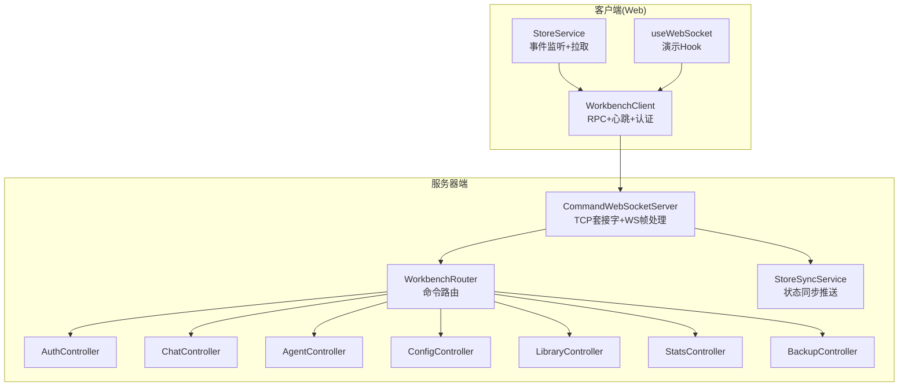
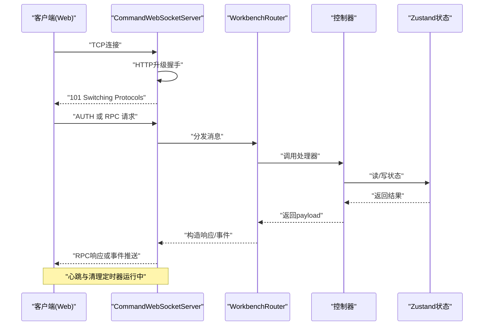
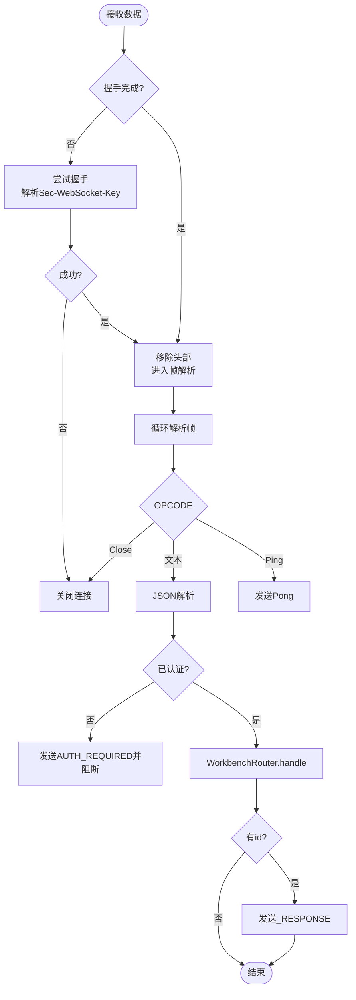
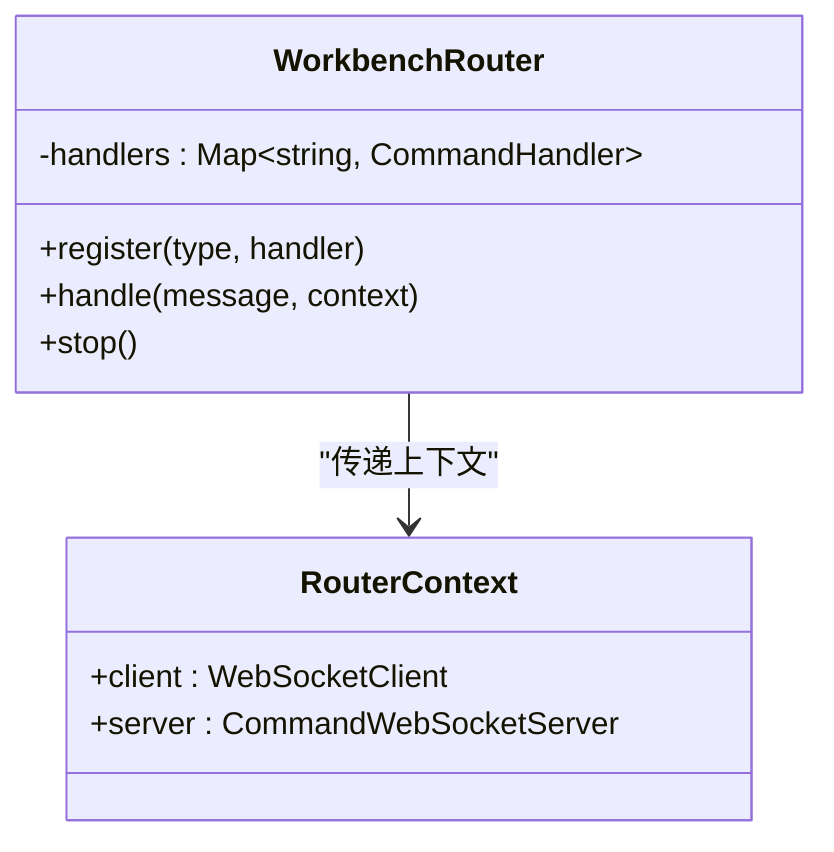
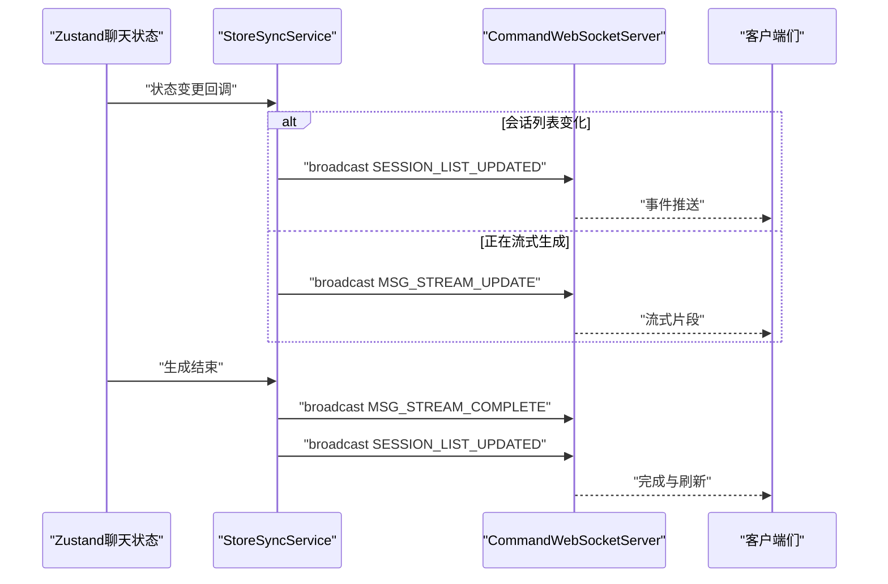
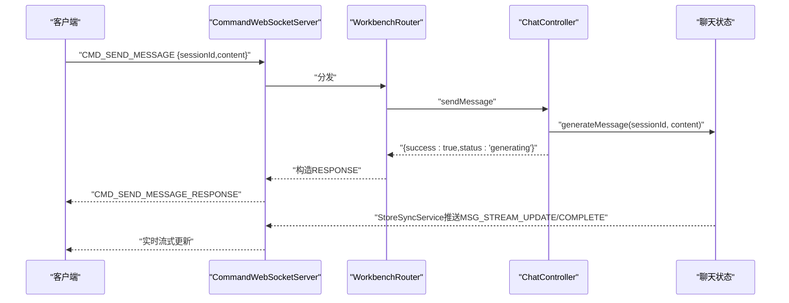
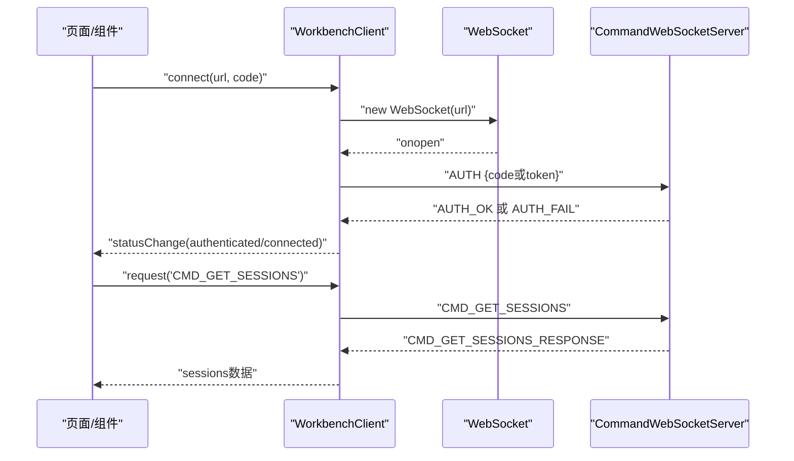
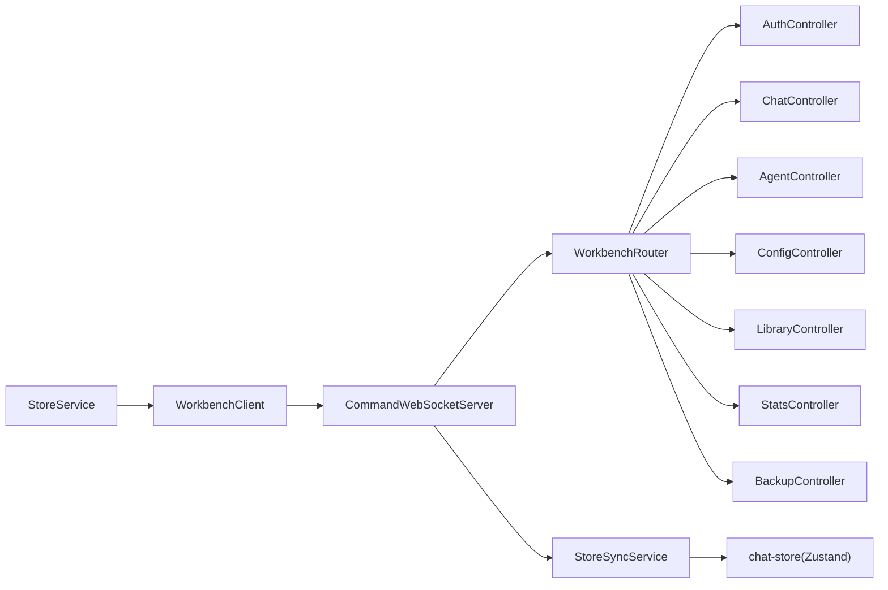

# WebSocket API

<cite>
**本文引用的文件**
- [CommandWebSocketServer.ts](file://src/services/workbench/CommandWebSocketServer.ts)
- [StoreSyncService.ts](file://src/services/workbench/StoreSyncService.ts)
- [WorkbenchRouter.ts](file://src/services/workbench/WorkbenchRouter.ts)
- [AuthController.ts](file://src/services/workbench/controllers/AuthController.ts)
- [AgentController.ts](file://src/services/workbench/controllers/AgentController.ts)
- [ChatController.ts](file://src/services/workbench/controllers/ChatController.ts)
- [ConfigController.ts](file://src/services/workbench/controllers/ConfigController.ts)
- [LibraryController.ts](file://src/services/workbench/controllers/LibraryController.ts)
- [StatsController.ts](file://src/services/workbench/controllers/StatsController.ts)
- [BackupController.ts](file://src/services/workbench/controllers/BackupController.ts)
- [useWebSocket.ts](file://web-client/src/hooks/useWebSocket.ts)
- [WorkbenchClient.ts](file://web-client/src/services/WorkbenchClient.ts)
- [StoreService.ts](file://web-client/src/services/StoreService.ts)
- [chat-store.ts](file://src/store/chat-store.ts)
- [chat.ts](file://src/types/chat.ts)
</cite>

## 目录
1. [简介](#简介)
2. [项目结构](#项目结构)
3. [核心组件](#核心组件)
4. [架构总览](#架构总览)
5. [详细组件分析](#详细组件分析)
6. [依赖关系分析](#依赖关系分析)
7. [性能考量](#性能考量)
8. [故障排查指南](#故障排查指南)
9. [结论](#结论)
10. [附录](#附录)

## 简介
本文件系统化梳理 Nexara 项目的 Workbench 服务器 WebSocket API，覆盖连接建立、握手与帧解析、消息格式与事件类型、实时交互模式、状态同步机制、消息路由与命令处理、连接生命周期与错误处理、重连策略、消息协议规范、序列化格式与安全要点，并提供客户端接入示例、消息收发模式与调试工具使用指南。

## 项目结构
Workbench 的 WebSocket 服务由以下模块组成：
- 服务器端
  - CommandWebSocketServer：TCP 套接字封装的 WebSocket 服务器，负责握手、帧解析、消息路由、心跳与清理、广播等
  - WorkbenchRouter：命令路由与响应/错误回包机制
  - StoreSyncService：基于 Zustand 的状态订阅与实时推送
  - 控制器：按功能域划分的命令处理器（认证、代理、聊天、配置、知识库、统计、备份）
- 客户端（Web）
  - WorkbenchClient：WebSocket 客户端封装，RPC 请求/响应、心跳、认证、事件派发
  - StoreService：订阅服务器推送事件并拉取最新数据
  - useWebSocket：简化版 Hook（演示用途）

**图表来源**
- [CommandWebSocketServer.ts:33-178](file://src/services/workbench/CommandWebSocketServer.ts#L33-L178)
- [WorkbenchRouter.ts:18-72](file://src/services/workbench/WorkbenchRouter.ts#L18-L72)
- [StoreSyncService.ts:5-32](file://src/services/workbench/StoreSyncService.ts#L5-L32)
- [AuthController.ts:17-54](file://src/services/workbench/controllers/AuthController.ts#L17-L54)
- [ChatController.ts:5-129](file://src/services/workbench/controllers/ChatController.ts#L5-L129)
- [AgentController.ts:4-47](file://src/services/workbench/controllers/AgentController.ts#L4-L47)
- [ConfigController.ts:5-70](file://src/services/workbench/controllers/ConfigController.ts#L5-L70)
- [LibraryController.ts:4-53](file://src/services/workbench/controllers/LibraryController.ts#L4-L53)
- [StatsController.ts:4-22](file://src/services/workbench/controllers/StatsController.ts#L4-L22)
- [BackupController.ts:6-28](file://src/services/workbench/controllers/BackupController.ts#L6-L28)
- [WorkbenchClient.ts:18-94](file://web-client/src/services/WorkbenchClient.ts#L18-L94)
- [StoreService.ts:30-47](file://web-client/src/services/StoreService.ts#L30-L47)

**章节来源**
- [CommandWebSocketServer.ts:33-178](file://src/services/workbench/CommandWebSocketServer.ts#L33-L178)
- [WorkbenchRouter.ts:18-72](file://src/services/workbench/WorkbenchRouter.ts#L18-L72)
- [StoreSyncService.ts:5-32](file://src/services/workbench/StoreSyncService.ts#L5-L32)
- [WorkbenchClient.ts:18-94](file://web-client/src/services/WorkbenchClient.ts#L18-L94)

## 核心组件
- CommandWebSocketServer
  - 监听本地端口，处理 TCP 握手与 WebSocket 协议帧，维护客户端集合与写队列，实现可靠分片发送与心跳清理
  - 注册路由命令，转发到 WorkbenchRouter；对未认证客户端限制仅允许 AUTH 命令
- WorkbenchRouter
  - 将消息类型映射到控制器处理器；统一处理请求-响应与错误回包；未知命令返回 ERROR
- StoreSyncService
  - 订阅聊天状态变化，推送会话列表更新、流式消息片段与生成完成事件
- 控制器
  - 认证：令牌/访问码校验与签发
  - 代理：查询、更新、创建、删除代理
  - 聊天：会话列表、历史、创建、删除、发送、中止、删除消息、重生成
  - 配置：获取/更新默认模型、RAG 全局配置、提供商列表
  - 知识库：文档/文件夹管理、图谱数据
  - 统计：获取/重置用量统计
  - 备份：WebDAV 配置读写

**章节来源**
- [CommandWebSocketServer.ts:33-178](file://src/services/workbench/CommandWebSocketServer.ts#L33-L178)
- [WorkbenchRouter.ts:18-72](file://src/services/workbench/WorkbenchRouter.ts#L18-L72)
- [StoreSyncService.ts:5-124](file://src/services/workbench/StoreSyncService.ts#L5-L124)
- [AuthController.ts:17-54](file://src/services/workbench/controllers/AuthController.ts#L17-L54)
- [AgentController.ts:4-47](file://src/services/workbench/controllers/AgentController.ts#L4-L47)
- [ChatController.ts:5-129](file://src/services/workbench/controllers/ChatController.ts#L5-L129)
- [ConfigController.ts:5-70](file://src/services/workbench/controllers/ConfigController.ts#L5-L70)
- [LibraryController.ts:4-53](file://src/services/workbench/controllers/LibraryController.ts#L4-L53)
- [StatsController.ts:4-22](file://src/services/workbench/controllers/StatsController.ts#L4-L22)
- [BackupController.ts:6-28](file://src/services/workbench/controllers/BackupController.ts#L6-L28)

## 架构总览
Workbench 的 WebSocket 采用“服务器端 TCP 套接字 + 自实现 WebSocket 帧解析”的方案，通过 WorkbenchRouter 实现命令式 RPC，结合 StoreSyncService 提供状态变更的实时推送。

**图表来源**
- [CommandWebSocketServer.ts:44-178](file://src/services/workbench/CommandWebSocketServer.ts#L44-L178)
- [WorkbenchRouter.ts:34-71](file://src/services/workbench/WorkbenchRouter.ts#L34-L71)
- [AuthController.ts:18-53](file://src/services/workbench/controllers/AuthController.ts#L18-L53)
- [ChatController.ts:75-95](file://src/services/workbench/controllers/ChatController.ts#L75-L95)

## 详细组件分析

### CommandWebSocketServer：连接与帧处理
- 连接建立
  - 监听本地端口，注册路由命令，启动 StoreSyncService，启动清理定时器
  - 支持端口占用重试与优雅关闭
- 握手与帧解析
  - 解析 HTTP Upgrade 请求头，计算 Accept Key，返回 101 切换协议
  - 自实现 WebSocket 帧解析：OPCODE、掩码、长度扩展、Ping/Pong、Close
- 写入与可靠性
  - 写队列串行化，Base64 分片传输，drain 回调与超时兜底
  - 发送二进制帧避免严格 UTF-8 校验问题
- 认证与路由
  - 未认证客户端仅允许 AUTH；收到 HEARTBEAT 更新心跳时间
  - 将消息交由 WorkbenchRouter 处理
- 广播与清理
  - 广播事件给已认证且握手完成的客户端
  - 心跳超时（30 秒）断开连接

**图表来源**
- [CommandWebSocketServer.ts:192-444](file://src/services/workbench/CommandWebSocketServer.ts#L192-L444)

**章节来源**
- [CommandWebSocketServer.ts:44-178](file://src/services/workbench/CommandWebSocketServer.ts#L44-L178)
- [CommandWebSocketServer.ts:192-444](file://src/services/workbench/CommandWebSocketServer.ts#L192-L444)

### WorkbenchRouter：命令路由与响应
- 注册命令类型到处理器
- 处理请求-响应：若消息含 id，则回包类型为 “<type>_RESPONSE”
- 错误处理：捕获异常并回包 “<type>_ERROR” 或 “ERROR”，包含错误信息
- 未注册命令：返回 “ERROR” 并提示未知命令

**图表来源**
- [WorkbenchRouter.ts:18-72](file://src/services/workbench/WorkbenchRouter.ts#L18-L72)

**章节来源**
- [WorkbenchRouter.ts:18-72](file://src/services/workbench/WorkbenchRouter.ts#L18-L72)

### StoreSyncService：状态同步与事件推送
- 订阅聊天状态，检测会话列表变化与流式生成状态
- 推送事件
  - SESSION_LIST_UPDATED：会话列表变更
  - MSG_STREAM_UPDATE：当前消息流式片段（完整内容）
  - MSG_STREAM_COMPLETE：生成完成
- 流式控制
  - 基于消息长度变化判断增量推送
  - 生成完成后刷新会话列表并清理缓存

**图表来源**
- [StoreSyncService.ts:34-123](file://src/services/workbench/StoreSyncService.ts#L34-L123)
- [CommandWebSocketServer.ts:446-458](file://src/services/workbench/CommandWebSocketServer.ts#L446-L458)

**章节来源**
- [StoreSyncService.ts:15-124](file://src/services/workbench/StoreSyncService.ts#L15-L124)

### 控制器：命令处理流程
- 认证（AuthController）
  - 支持令牌与访问码两种方式；令牌 24 小时过期；过期清理定时器
  - 成功后发送 AUTH_OK，失败发送 AUTH_FAIL
- 代理（AgentController）
  - 获取、更新、创建、删除代理；更新后可选择广播（注释）
- 聊天（ChatController）
  - 会话列表、历史、创建、删除、发送（触发生成）、中止、删除消息、重生成
  - 发送消息不阻塞 RPC 返回，流式更新由 StoreSyncService 推送
- 配置（ConfigController）
  - 获取默认模型、RAG 全局配置、提供商列表；更新时进行全量同步（增删改）
- 知识库（LibraryController）
  - 文档/文件夹管理、图谱数据获取
- 统计（StatsController）
  - 获取全局与按模型统计；可按模型重置
- 备份（BackupController）
  - WebDAV 配置读写（AsyncStorage）

**图表来源**
- [ChatController.ts:75-95](file://src/services/workbench/controllers/ChatController.ts#L75-L95)
- [StoreSyncService.ts:79-123](file://src/services/workbench/StoreSyncService.ts#L79-L123)
- [CommandWebSocketServer.ts:415-444](file://src/services/workbench/CommandWebSocketServer.ts#L415-L444)

**章节来源**
- [AuthController.ts:17-54](file://src/services/workbench/controllers/AuthController.ts#L17-L54)
- [AgentController.ts:4-47](file://src/services/workbench/controllers/AgentController.ts#L4-L47)
- [ChatController.ts:5-129](file://src/services/workbench/controllers/ChatController.ts#L5-L129)
- [ConfigController.ts:5-70](file://src/services/workbench/controllers/ConfigController.ts#L5-L70)
- [LibraryController.ts:4-53](file://src/services/workbench/controllers/LibraryController.ts#L4-L53)
- [StatsController.ts:4-22](file://src/services/workbench/controllers/StatsController.ts#L4-L22)
- [BackupController.ts:6-28](file://src/services/workbench/controllers/BackupController.ts#L6-L28)

### 客户端：连接、认证与消息收发
- WorkbenchClient
  - 连接、认证、心跳、请求-响应（带 id）、事件派发
  - 支持本地令牌持久化与自动登录
  - 断线清理与心跳停止
- StoreService
  - 监听 SESSION_LIST_UPDATED，触发 CMD_GET_SESSIONS 拉取最新会话树
- useWebSocket（演示）
  - 简化版 Hook，连接后立即 AUTH，处理 AUTH_OK/AUTH_FAIL 与流式 TOKEN

**图表来源**
- [WorkbenchClient.ts:29-94](file://web-client/src/services/WorkbenchClient.ts#L29-L94)
- [WorkbenchClient.ts:222-241](file://web-client/src/services/WorkbenchClient.ts#L222-L241)
- [StoreService.ts:44-86](file://web-client/src/services/StoreService.ts#L44-L86)

**章节来源**
- [WorkbenchClient.ts:18-317](file://web-client/src/services/WorkbenchClient.ts#L18-L317)
- [StoreService.ts:30-136](file://web-client/src/services/StoreService.ts#L30-L136)
- [useWebSocket.ts:11-115](file://web-client/src/hooks/useWebSocket.ts#L11-L115)

## 依赖关系分析
- 服务器端
  - CommandWebSocketServer 依赖 WorkbenchRouter、StoreSyncService、各控制器
  - StoreSyncService 依赖聊天状态（Zustand），向服务器广播事件
  - 控制器依赖对应 Store（如聊天、代理、设置、RAG 等）
- 客户端
  - WorkbenchClient 依赖浏览器原生 WebSocket，派发事件并维护请求队列
  - StoreService 依赖 WorkbenchClient 事件与 RPC 请求

**图表来源**
- [CommandWebSocketServer.ts:7-15](file://src/services/workbench/CommandWebSocketServer.ts#L7-L15)
- [StoreSyncService.ts:1-3](file://src/services/workbench/StoreSyncService.ts#L1-L3)
- [WorkbenchClient.ts:1-3](file://web-client/src/services/WorkbenchClient.ts#L1-L3)

**章节来源**
- [CommandWebSocketServer.ts:7-15](file://src/services/workbench/CommandWebSocketServer.ts#L7-L15)
- [StoreSyncService.ts:1-3](file://src/services/workbench/StoreSyncService.ts#L1-L3)
- [WorkbenchClient.ts:1-3](file://web-client/src/services/WorkbenchClient.ts#L1-L3)

## 性能考量
- 帧发送
  - 采用 Base64 分片与写队列串行化，避免桥接传输阻塞与丢包
  - 大包日志记录便于定位网络瓶颈
- 心跳与清理
  - 10 秒心跳，30 秒超时断开，降低僵尸连接资源占用
- 状态推送
  - StoreSyncService 基于增量长度判断推送流式片段，避免全量重复
- 路由与序列化
  - 使用二进制帧承载 JSON，减少 UTF-8 校验开销

**章节来源**
- [CommandWebSocketServer.ts:307-413](file://src/services/workbench/CommandWebSocketServer.ts#L307-L413)
- [CommandWebSocketServer.ts:471-484](file://src/services/workbench/CommandWebSocketServer.ts#L471-L484)
- [StoreSyncService.ts:79-107](file://src/services/workbench/StoreSyncService.ts#L79-L107)

## 故障排查指南
- 连接失败
  - 端口占用：服务器端会重试并输出重试日志；检查端口占用情况
  - 握手失败：确认客户端发送了正确的 Sec-WebSocket-Key 头
- 认证失败
  - 令牌过期或无效：客户端清除本地令牌后重新输入访问码
  - 服务器端定时清理过期令牌
- RPC 超时
  - 客户端请求设置了超时时间；检查网络延迟与服务器负载
- 流式消息不更新
  - 确认服务器端 StoreSyncService 正在推送 MSG_STREAM_UPDATE/COMPLETE
  - 客户端已订阅对应事件并正确处理

**章节来源**
- [CommandWebSocketServer.ts:108-131](file://src/services/workbench/CommandWebSocketServer.ts#L108-L131)
- [AuthController.ts:7-15](file://src/services/workbench/controllers/AuthController.ts#L7-L15)
- [WorkbenchClient.ts:222-241](file://web-client/src/services/WorkbenchClient.ts#L222-L241)
- [StoreSyncService.ts:79-123](file://src/services/workbench/StoreSyncService.ts#L79-L123)

## 结论
Workbench 的 WebSocket API 通过自实现的帧处理与命令路由，提供了稳定可靠的本地 LAN 实时通信能力。配合 StoreSyncService 的状态推送与客户端的事件驱动模型，实现了低延迟的会话与流式生成体验。建议在生产环境中进一步完善 TLS 终端与鉴权策略，增强安全性与可观测性。

## 附录

### 消息协议规范
- 连接与握手
  - 服务器监听本地端口，处理 HTTP Upgrade 握手，返回 101 Switching Protocols
- 帧格式
  - 服务器端实现 WebSocket 帧解析：OPCODE、掩码、长度扩展（126/127）、Ping/Pong、Close
  - 服务器发送二进制帧承载 JSON，客户端解析
- 消息结构
  - 请求/响应：type、id（可选）、payload
  - 事件推送：type、payload（无 id）
- 认证
  - AUTH：payload 支持 { code } 或 { token }
  - AUTH_OK：{ token }；AUTH_FAIL：无有效负载
- 心跳
  - 客户端周期发送 HEARTBEAT，服务器更新最后心跳时间

**章节来源**
- [CommandWebSocketServer.ts:203-239](file://src/services/workbench/CommandWebSocketServer.ts#L203-L239)
- [CommandWebSocketServer.ts:246-297](file://src/services/workbench/CommandWebSocketServer.ts#L246-L297)
- [CommandWebSocketServer.ts:415-444](file://src/services/workbench/CommandWebSocketServer.ts#L415-L444)
- [AuthController.ts:18-53](file://src/services/workbench/controllers/AuthController.ts#L18-L53)

### 命令与事件清单
- 认证
  - AUTH
  - AUTH_OK、AUTH_FAIL
- 代理
  - CMD_GET_AGENTS、CMD_UPDATE_AGENT、CMD_CREATE_AGENT、CMD_DELETE_AGENT
- 聊天
  - CMD_GET_SESSIONS、CMD_GET_HISTORY、CMD_CREATE_SESSION、CMD_DELETE_SESSION
  - CMD_SEND_MESSAGE、CMD_ABORT_GENERATION、CMD_DELETE_MESSAGE、CMD_REGENERATE_MESSAGE
- 配置
  - CMD_GET_CONFIG、CMD_UPDATE_CONFIG
- 知识库
  - CMD_GET_LIBRARY、CMD_UPLOAD_FILE、CMD_DELETE_FILE、CMD_CREATE_FOLDER、CMD_DELETE_FOLDER、CMD_GET_GRAPH
- 统计
  - CMD_GET_STATS、CMD_RESET_STATS
- 备份
  - CMD_GET_WEBDAV、CMD_UPDATE_WEBDAV
- 事件
  - SESSION_LIST_UPDATED、MSG_STREAM_UPDATE、MSG_STREAM_COMPLETE

**章节来源**
- [CommandWebSocketServer.ts:135-167](file://src/services/workbench/CommandWebSocketServer.ts#L135-L167)
- [StoreSyncService.ts:50-123](file://src/services/workbench/StoreSyncService.ts#L50-L123)

### 数据模型与状态
- 会话与消息
  - 会话包含标题、代理 ID、消息数组、推理参数、RAG 选项等
  - 消息包含角色、内容、引用、RAG 进度与元数据等
- 状态存储
  - 聊天状态由 Zustand 管理，StoreSyncService 订阅并推送变更

**章节来源**
- [chat.ts:169-223](file://src/types/chat.ts#L169-L223)
- [chat.ts:135-167](file://src/types/chat.ts#L135-L167)
- [chat-store.ts:108-200](file://src/store/chat-store.ts#L108-L200)

### 客户端接入示例与调试
- Web 客户端
  - 使用 WorkbenchClient 连接、认证、请求与事件监听
  - StoreService 监听 SESSION_LIST_UPDATED 并拉取最新会话树
- 调试
  - 服务器端打印握手、帧解析、写队列与心跳日志
  - 客户端打印连接状态、消息解析与事件派发

**章节来源**
- [WorkbenchClient.ts:29-94](file://web-client/src/services/WorkbenchClient.ts#L29-L94)
- [StoreService.ts:44-86](file://web-client/src/services/StoreService.ts#L44-L86)
- [CommandWebSocketServer.ts:44-178](file://src/services/workbench/CommandWebSocketServer.ts#L44-L178)