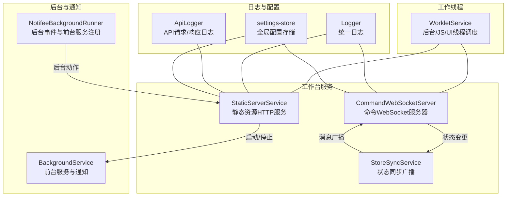
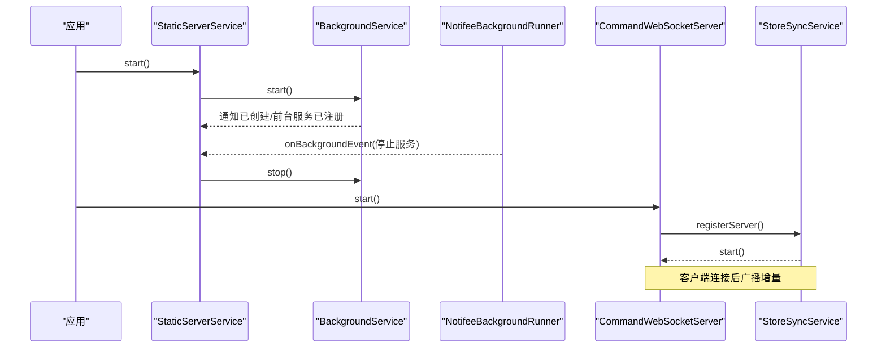
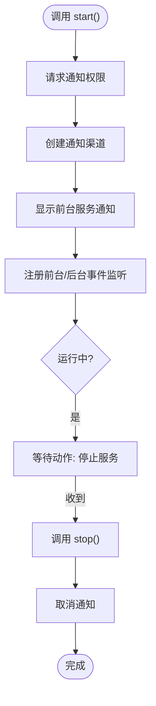
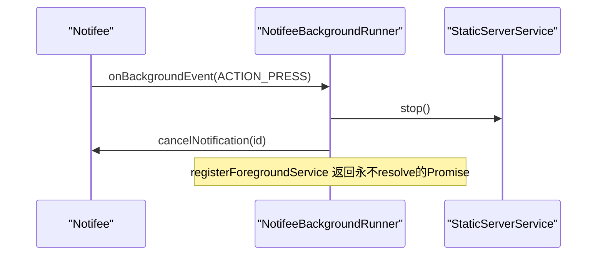
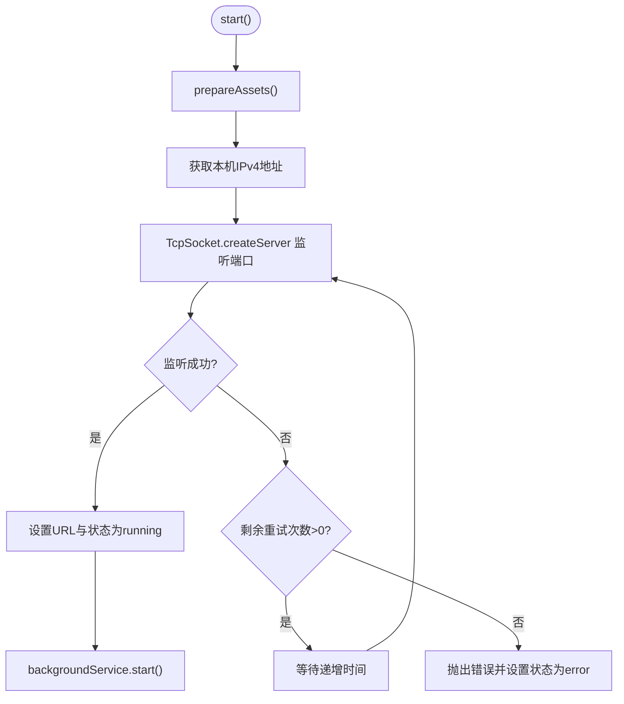
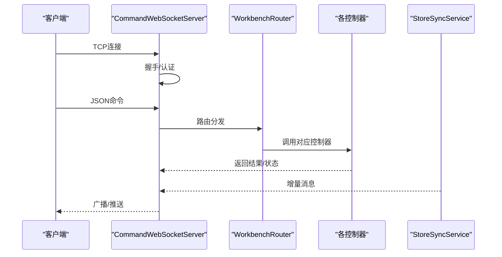
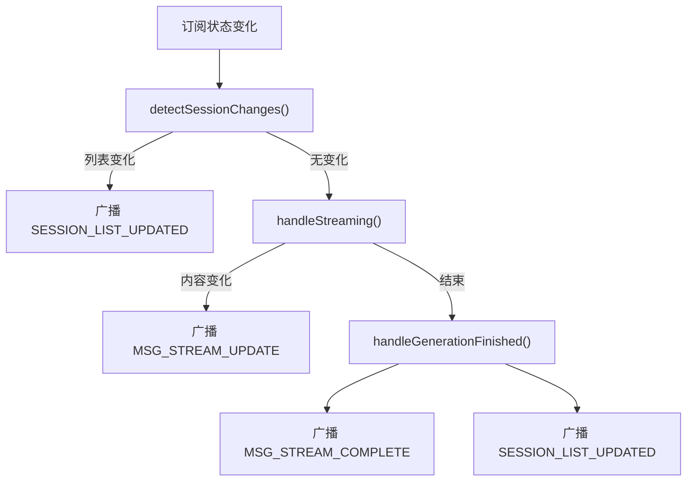
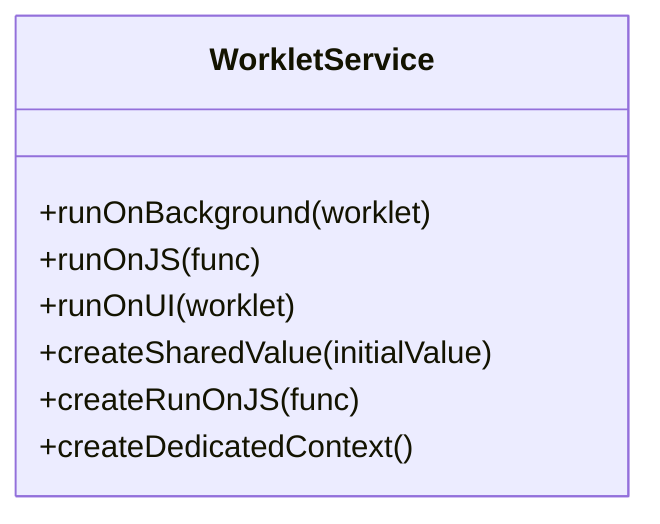
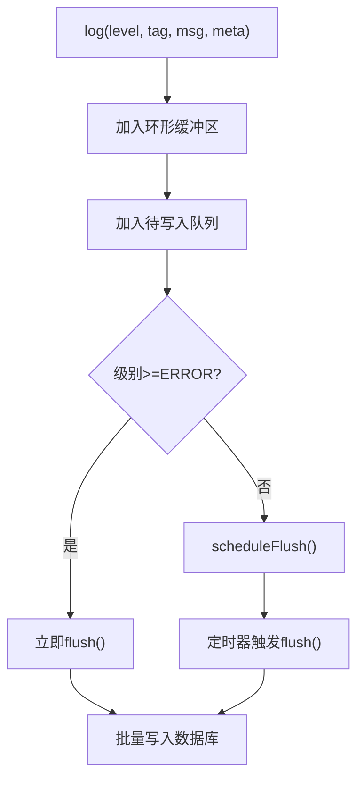
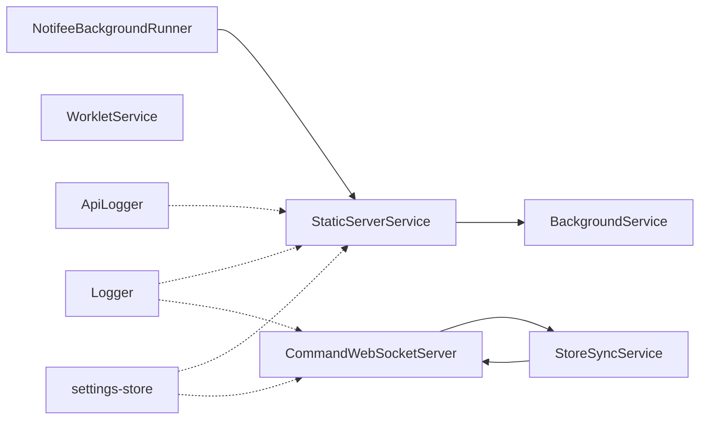

# 内部服务API

<cite>
**本文引用的文件列表**
- [BackgroundService.ts](file://src/services/BackgroundService.ts)
- [NotifeeBackgroundRunner.ts](file://src/services/NotifeeBackgroundRunner.ts)
- [WorkletService.ts](file://src/services/worklets/WorkletService.ts)
- [StaticServerService.ts](file://src/services/workbench/StaticServerService.ts)
- [CommandWebSocketServer.ts](file://src/services/workbench/CommandWebSocketServer.ts)
- [StoreSyncService.ts](file://src/services/workbench/StoreSyncService.ts)
- [Logger.ts](file://src/lib/logging/Logger.ts)
- [api-logger.ts](file://src/lib/llm/api-logger.ts)
- [settings-store.ts](file://src/store/settings-store.ts)
- [ConfigController.ts](file://src/services/workbench/controllers/ConfigController.ts)
</cite>

## 目录
1. [简介](#简介)
2. [项目结构](#项目结构)
3. [核心组件](#核心组件)
4. [架构总览](#架构总览)
5. [详细组件分析](#详细组件分析)
6. [依赖关系分析](#依赖关系分析)
7. [性能与优化](#性能与优化)
8. [故障排查指南](#故障排查指南)
9. [结论](#结论)
10. [附录](#附录)

## 简介
本文件面向Nexara项目的内部服务API，聚焦以下能力：
- 后台服务的生命周期与通知集成：BackgroundService与NotifeeBackgroundRunner
- 工作线程与跨线程执行：WorkletService
- 内部服务的启动顺序、优雅关闭与资源清理
- 服务间通信协议、消息格式与错误传播
- 日志记录、监控与调试工具使用
- 注册机制、依赖注入与配置管理

## 项目结构
Nexara的内部服务主要位于src/services目录，围绕工作台（Workbench）提供静态资源服务、WebSocket命令服务器、状态同步与后台通知等能力；同时通过Worklets在UI/JS/后台线程之间高效调度任务。

图表来源
- [StaticServerService.ts:24-236](file://src/services/workbench/StaticServerService.ts#L24-L236)
- [CommandWebSocketServer.ts:44-178](file://src/services/workbench/CommandWebSocketServer.ts#L44-L178)
- [StoreSyncService.ts:15-123](file://src/services/workbench/StoreSyncService.ts#L15-L123)
- [BackgroundService.ts:8-83](file://src/services/BackgroundService.ts#L8-L83)
- [NotifeeBackgroundRunner.ts:5-25](file://src/services/NotifeeBackgroundRunner.ts#L5-L25)
- [WorkletService.ts:12-62](file://src/services/worklets/WorkletService.ts#L12-L62)
- [Logger.ts:74-210](file://src/lib/logging/Logger.ts#L74-L210)
- [api-logger.ts:23-43](file://src/lib/llm/api-logger.ts#L23-L43)
- [settings-store.ts:75-243](file://src/store/settings-store.ts#L75-L243)

章节来源
- [StaticServerService.ts:24-236](file://src/services/workbench/StaticServerService.ts#L24-L236)
- [CommandWebSocketServer.ts:44-178](file://src/services/workbench/CommandWebSocketServer.ts#L44-L178)
- [StoreSyncService.ts:15-123](file://src/services/workbench/StoreSyncService.ts#L15-L123)
- [BackgroundService.ts:8-83](file://src/services/BackgroundService.ts#L8-L83)
- [NotifeeBackgroundRunner.ts:5-25](file://src/services/NotifeeBackgroundRunner.ts#L5-L25)
- [WorkletService.ts:12-62](file://src/services/worklets/WorkletService.ts#L12-L62)
- [Logger.ts:74-210](file://src/lib/logging/Logger.ts#L74-L210)
- [api-logger.ts:23-43](file://src/lib/llm/api-logger.ts#L23-L43)
- [settings-store.ts:75-243](file://src/store/settings-store.ts#L75-L243)

## 核心组件
- BackgroundService：负责创建前台服务通知、注册前台服务任务、处理通知动作（如停止服务）、请求权限与电池优化设置。
- NotifeeBackgroundRunner：监听后台通知动作，转发至静态服务器停止逻辑，并注册前台服务任务以保持进程存活。
- StaticServerService：基于TCP Socket实现简易HTTP服务器，打包并分发Web客户端静态资源，启动后台服务并处理端口占用重试。
- CommandWebSocketServer：基于TCP Socket实现WebSocket风格的命令通道，注册路由控制器，认证与心跳，消息帧解析与发送，客户端清理。
- StoreSyncService：订阅聊天状态变化，向WebSocket客户端广播会话列表更新与流式消息增量。
- WorkletService：封装react-native-worklets-core与Reanimated的线程调度，提供后台/JS/UI线程执行与共享值。
- Logger与ApiLogger：统一日志采集、批量化落库、环形缓冲区回溯、导出分享；API层日志包装。
- settings-store：Zustand持久化配置存储，集中管理语言、主题、模型默认值、RAG配置、技能开关、本地模型开关、日志开关等。

章节来源
- [BackgroundService.ts:3-117](file://src/services/BackgroundService.ts#L3-L117)
- [NotifeeBackgroundRunner.ts:1-28](file://src/services/NotifeeBackgroundRunner.ts#L1-L28)
- [StaticServerService.ts:21-301](file://src/services/workbench/StaticServerService.ts#L21-L301)
- [CommandWebSocketServer.ts:33-488](file://src/services/workbench/CommandWebSocketServer.ts#L33-L488)
- [StoreSyncService.ts:5-127](file://src/services/workbench/StoreSyncService.ts#L5-L127)
- [WorkletService.ts:1-63](file://src/services/worklets/WorkletService.ts#L1-L63)
- [Logger.ts:18-280](file://src/lib/logging/Logger.ts#L18-L280)
- [api-logger.ts:8-59](file://src/lib/llm/api-logger.ts#L8-L59)
- [settings-store.ts:10-244](file://src/store/settings-store.ts#L10-L244)

## 架构总览
Nexara内部服务采用“前台服务+静态HTTP+WebSocket命令通道+状态同步”的组合架构：
- 前台服务：通过Notifee创建通知与前台服务，确保应用在后台仍可稳定运行。
- 静态HTTP：提供Web客户端资源访问，支持SPA回退与分块传输。
- WebSocket命令通道：统一命令入口，按类型路由到控制器，支持认证、心跳与增量消息推送。
- 状态同步：StoreSyncService监听状态变化，向已认证客户端广播增量更新。
- 工作线程：WorkletService在后台/JS/UI线程间高效切换，提升复杂计算与UI交互性能。
- 日志与配置：Logger与ApiLogger统一采集与导出；settings-store集中管理配置并持久化。

图表来源
- [StaticServerService.ts:223-227](file://src/services/workbench/StaticServerService.ts#L223-L227)
- [BackgroundService.ts:8-83](file://src/services/BackgroundService.ts#L8-L83)
- [NotifeeBackgroundRunner.ts:5-25](file://src/services/NotifeeBackgroundRunner.ts#L5-L25)
- [CommandWebSocketServer.ts:38-170](file://src/services/workbench/CommandWebSocketServer.ts#L38-L170)
- [StoreSyncService.ts:11-24](file://src/services/workbench/StoreSyncService.ts#L11-L24)

## 详细组件分析

### BackgroundService（后台服务与通知）
- 职责
  - 创建通知渠道与前台服务通知，注册前台服务任务保持进程存活
  - 监听前台/后台通知动作（如“停止服务”），执行停止流程
  - 请求通知权限与电池优化设置（Android）
- 关键行为
  - start：检查权限、创建通知渠道、显示前台服务通知、注册事件监听
  - stop：停止前台服务、取消通知、重置运行标志
  - requestUserPermission/requestBatteryOptimization：权限与设置引导
- 生命周期
  - 由StaticServerService在启动时调用start，停止时调用stop

图表来源
- [BackgroundService.ts:8-83](file://src/services/BackgroundService.ts#L8-L83)

章节来源
- [BackgroundService.ts:3-117](file://src/services/BackgroundService.ts#L3-L117)

### NotifeeBackgroundRunner（后台事件与前台服务注册）
- 职责
  - 监听后台通知动作（如“停止服务”），调用静态服务器停止逻辑并取消通知
  - 注册前台服务任务，Promise保持进程存活直到显式停止
- 行为要点
  - onBackgroundEvent：处理动作事件，调用staticServerService.stop()
  - registerForegroundService：返回永不resolve的Promise，维持前台服务

图表来源
- [NotifeeBackgroundRunner.ts:5-25](file://src/services/NotifeeBackgroundRunner.ts#L5-L25)

章节来源
- [NotifeeBackgroundRunner.ts:1-28](file://src/services/NotifeeBackgroundRunner.ts#L1-L28)

### StaticServerService（静态HTTP服务）
- 职责
  - 准备Web客户端静态资源（复制到文档目录），启动TCP Socket HTTP服务器
  - 处理GET请求、SPA回退、内容类型判断、分块写入、端口占用重试
  - 启动/停止时联动BackgroundService
- 关键流程
  - start：准备资源、获取本机IP、创建TCP服务器、绑定端口、设置URL与状态、启动后台服务
  - stop：关闭服务器、停止后台服务、清空状态
  - prepareAssets：下载并复制HTML/JS/CSS/SVG到WWW目录
- 错误处理
  - 端口占用重试（最多10次，递增等待）
  - 403/404/500响应与异常捕获
  - 分块写入失败静默处理，避免崩溃

图表来源
- [StaticServerService.ts:24-236](file://src/services/workbench/StaticServerService.ts#L24-L236)

章节来源
- [StaticServerService.ts:21-301](file://src/services/workbench/StaticServerService.ts#L21-L301)

### CommandWebSocketServer（命令WebSocket服务器）
- 职责
  - 基于TCP Socket实现WebSocket风格命令通道，注册路由控制器，认证与心跳，增量消息广播
- 关键流程
  - start：注册路由、创建TCP服务器、监听端口、启动StoreSyncService、启动清理定时器
  - stop：关闭服务器、清理客户端、停止路由与状态同步
  - 消息处理：握手、帧解析（OPCODE、长度、掩码）、认证限制、心跳维护、广播
- 控制器注册
  - AUTH、CMD_GET_*、CMD_UPDATE_*、CMD_UPLOAD_*、CMD_GET_STATS等
- 广播与增量
  - StoreSyncService检测会话列表变化与流式消息增量，统一广播给已认证客户端

图表来源
- [CommandWebSocketServer.ts:44-178](file://src/services/workbench/CommandWebSocketServer.ts#L44-L178)
- [StoreSyncService.ts:34-123](file://src/services/workbench/StoreSyncService.ts#L34-L123)

章节来源
- [CommandWebSocketServer.ts:33-488](file://src/services/workbench/CommandWebSocketServer.ts#L33-L488)
- [StoreSyncService.ts:5-127](file://src/services/workbench/StoreSyncService.ts#L5-L127)

### StoreSyncService（状态同步）
- 职责
  - 订阅聊天状态，检测会话列表变化与流式消息增量，向WebSocket客户端广播
- 关键点
  - detectSessionChanges：比较ID列表与标题变化，必要时广播列表更新
  - handleStreaming：检测当前生成消息内容长度变化，广播完整内容增量
  - handleGenerationFinished：广播完成信号并刷新会话列表

图表来源
- [StoreSyncService.ts:34-123](file://src/services/workbench/StoreSyncService.ts#L34-L123)

章节来源
- [StoreSyncService.ts:5-127](file://src/services/workbench/StoreSyncService.ts#L5-L127)

### WorkletService（工作线程管理）
- 职责
  - 在后台线程、JS线程、UI线程之间调度任务，提供共享值与上下文
- 方法族
  - runOnBackground：在默认上下文的后台线程执行
  - runOnJS/runOnUI：在JS/UI线程执行
  - createSharedValue/createRunOnJS：创建共享值与JS回调
  - createDedicatedContext：创建专用上下文
- 使用场景
  - 复杂计算在后台线程执行，结果通过runOnJS/UI回调更新状态或渲染

图表来源
- [WorkletService.ts:12-62](file://src/services/worklets/WorkletService.ts#L12-L62)

章节来源
- [WorkletService.ts:1-63](file://src/services/worklets/WorkletService.ts#L1-L63)

### 日志与监控（Logger与ApiLogger）
- Logger
  - 单例模式，环形缓冲区保存最近日志，批量写入数据库，支持错误级别立即落库
  - 提供getRecentLogs、getCrashDump、exportLogs等能力
- ApiLogger
  - 包装Logger，记录API请求/响应，便于调试与审计
- 配置联动
  - 从settings-store订阅loggingEnabled，动态启停非错误级别的日志

图表来源
- [Logger.ts:74-210](file://src/lib/logging/Logger.ts#L74-L210)

章节来源
- [Logger.ts:18-280](file://src/lib/logging/Logger.ts#L18-L280)
- [api-logger.ts:8-59](file://src/lib/llm/api-logger.ts#L8-L59)
- [settings-store.ts:62-202](file://src/store/settings-store.ts#L62-L202)

### 配置管理（settings-store）
- 职责
  - 全局配置集中管理，支持持久化与部分序列化，提供默认值与校验
- 关键域
  - 语言、主题色、默认模型、RAG全局配置、技能开关、本地模型开关、日志开关、首次启动标记等
- 与服务协作
  - Logger订阅loggingEnabled动态启停日志
  - ConfigController读取/更新配置并通过StoreSyncService广播

章节来源
- [settings-store.ts:10-244](file://src/store/settings-store.ts#L10-L244)
- [ConfigController.ts:5-48](file://src/services/workbench/controllers/ConfigController.ts#L5-L48)

## 依赖关系分析
- StaticServerService依赖BackgroundService进行前台服务管理
- NotifeeBackgroundRunner依赖StaticServerService的停止逻辑
- CommandWebSocketServer依赖StoreSyncService进行状态广播
- StoreSyncService依赖CommandWebSocketServer进行广播
- WorkletService独立于其他服务，但可被业务模块调用
- Logger与ApiLogger作为横切关注点被各服务复用
- settings-store作为配置中心被多个服务读取与更新

图表来源
- [StaticServerService.ts:223-227](file://src/services/workbench/StaticServerService.ts#L223-L227)
- [BackgroundService.ts:8-83](file://src/services/BackgroundService.ts#L8-L83)
- [NotifeeBackgroundRunner.ts:5-25](file://src/services/NotifeeBackgroundRunner.ts#L5-L25)
- [CommandWebSocketServer.ts:38-170](file://src/services/workbench/CommandWebSocketServer.ts#L38-L170)
- [StoreSyncService.ts:11-24](file://src/services/workbench/StoreSyncService.ts#L11-L24)
- [Logger.ts:74-210](file://src/lib/logging/Logger.ts#L74-L210)
- [api-logger.ts:23-43](file://src/lib/llm/api-logger.ts#L23-L43)
- [settings-store.ts:75-243](file://src/store/settings-store.ts#L75-L243)

章节来源
- [StaticServerService.ts:21-301](file://src/services/workbench/StaticServerService.ts#L21-L301)
- [CommandWebSocketServer.ts:33-488](file://src/services/workbench/CommandWebSocketServer.ts#L33-L488)
- [StoreSyncService.ts:5-127](file://src/services/workbench/StoreSyncService.ts#L5-L127)
- [BackgroundService.ts:3-117](file://src/services/BackgroundService.ts#L3-L117)
- [NotifeeBackgroundRunner.ts:1-28](file://src/services/NotifeeBackgroundRunner.ts#L1-L28)
- [Logger.ts:18-280](file://src/lib/logging/Logger.ts#L18-L280)
- [api-logger.ts:8-59](file://src/lib/llm/api-logger.ts#L8-L59)
- [settings-store.ts:75-243](file://src/store/settings-store.ts#L75-L243)

## 性能与优化
- 分块传输与背压
  - StaticServerService与CommandWebSocketServer均采用分块写入与背压处理，避免大包阻塞与崩溃
- 批量日志写入
  - Logger采用500ms批量flush与写入锁，降低数据库压力
- 增量消息广播
  - StoreSyncService仅在内容变化时广播，减少带宽与CPU消耗
- 前台服务与通知
  - BackgroundService与NotifeeBackgroundRunner确保后台稳定性，减少被系统回收的概率
- 工作线程调度
  - WorkletService在后台线程执行重计算，避免阻塞主线程

[本节为通用性能讨论，无需列出具体文件来源]

## 故障排查指南
- 启动失败（端口占用）
  - StaticServerService会在EADDRINUSE时重试10次，逐步增加等待时间；若仍失败，检查是否有其他实例或杀进程
- WebSocket连接异常
  - CommandWebSocketServer对常见网络错误（Broken pipe、ECONNRESET等）进行静默移除；检查客户端断线与防火墙
- 日志缺失或无法导出
  - 检查settings-store中loggingEnabled；确认Logger的flush定时器与写入锁状态；导出失败时查看分享权限
- 通知无法停止或电池优化问题
  - 调用BackgroundService.requestBatteryOptimization打开系统设置；确认通知权限与前台服务类型

章节来源
- [StaticServerService.ts:196-213](file://src/services/workbench/StaticServerService.ts#L196-L213)
- [CommandWebSocketServer.ts:84-100](file://src/services/workbench/CommandWebSocketServer.ts#L84-L100)
- [Logger.ts:162-210](file://src/lib/logging/Logger.ts#L162-L210)
- [BackgroundService.ts:94-113](file://src/services/BackgroundService.ts#L94-L113)

## 结论
Nexara内部服务API通过前台服务通知、静态HTTP与WebSocket命令通道、状态同步与工作线程调度，构建了稳定高效的后台运行与远程控制能力。配合统一的日志与配置管理，实现了可观测、可调试、可维护的服务体系。建议在生产环境中：
- 明确服务启动顺序与依赖关系
- 使用统一日志与导出机制进行问题定位
- 对关键路径（网络、IO、计算）持续监控与优化

[本节为总结性内容，无需列出具体文件来源]

## 附录

### 服务启动顺序与优雅关闭
- 启动顺序
  - StaticServerService.start() → BackgroundService.start() → CommandWebSocketServer.start() → StoreSyncService.start()
- 优雅关闭
  - CommandWebSocketServer.stop() → StoreSyncService.stop() → StaticServerService.stop() → BackgroundService.stop()

章节来源
- [StaticServerService.ts:223-248](file://src/services/workbench/StaticServerService.ts#L223-L248)
- [CommandWebSocketServer.ts:180-190](file://src/services/workbench/CommandWebSocketServer.ts#L180-L190)

### 服务间通信协议与消息格式
- WebSocket命令格式
  - 文本帧（二进制帧）承载JSON对象，字段包含type与payload
  - 认证前仅允许AUTH命令；心跳为HEARTBEAT
- 广播消息类型
  - SESSION_LIST_UPDATED：会话列表变更
  - MSG_STREAM_UPDATE：流式消息增量（sessionId、messageId、content、isDone）
  - MSG_STREAM_COMPLETE：生成完成

章节来源
- [CommandWebSocketServer.ts:415-444](file://src/services/workbench/CommandWebSocketServer.ts#L415-L444)
- [StoreSyncService.ts:50-123](file://src/services/workbench/StoreSyncService.ts#L50-L123)

### 注册机制与依赖注入
- 控制器注册
  - CommandWebSocketServer在启动时一次性注册路由控制器，保证幂等
- 服务注册
  - StoreSyncService通过registerServer向CommandWebSocketServer注册自身，建立广播通道
- 配置注入
  - settings-store通过persist中间件与部分序列化，确保配置在不同服务间共享

章节来源
- [CommandWebSocketServer.ts:134-168](file://src/services/workbench/CommandWebSocketServer.ts#L134-L168)
- [StoreSyncService.ts:11-13](file://src/services/workbench/StoreSyncService.ts#L11-L13)
- [settings-store.ts:208-231](file://src/store/settings-store.ts#L208-L231)

### 监控指标与调试工具
- 日志指标
  - Logger提供getRecentLogs、getCrashDump、exportLogs；ApiLogger记录请求/响应
- 配置开关
  - settings-store.loggingEnabled控制日志开关
- 调试建议
  - 使用exportLogs导出并分享；结合浏览器开发者工具与设备日志定位问题

章节来源
- [Logger.ts:227-277](file://src/lib/logging/Logger.ts#L227-L277)
- [api-logger.ts:23-43](file://src/lib/llm/api-logger.ts#L23-L43)
- [settings-store.ts:201-202](file://src/store/settings-store.ts#L201-L202)