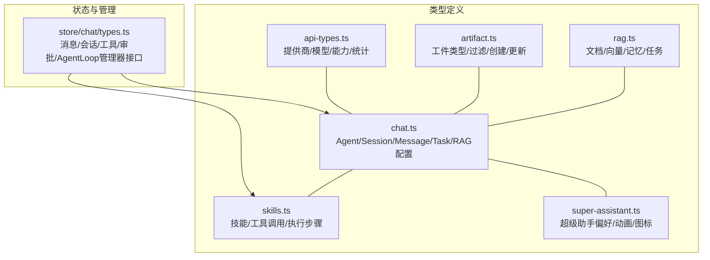
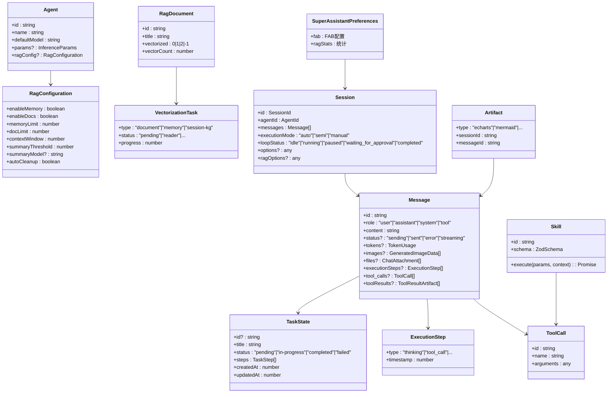
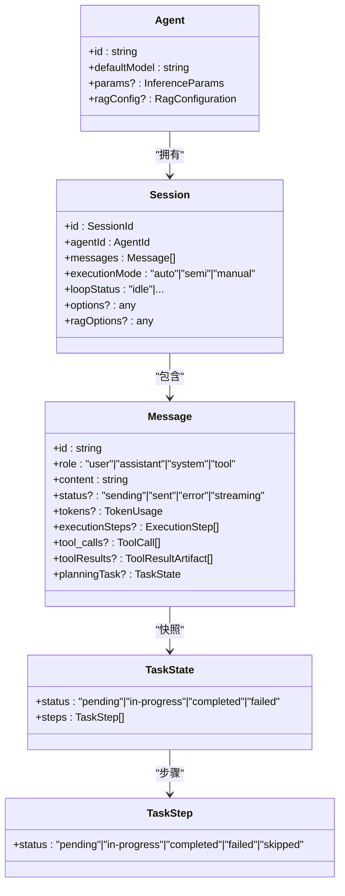
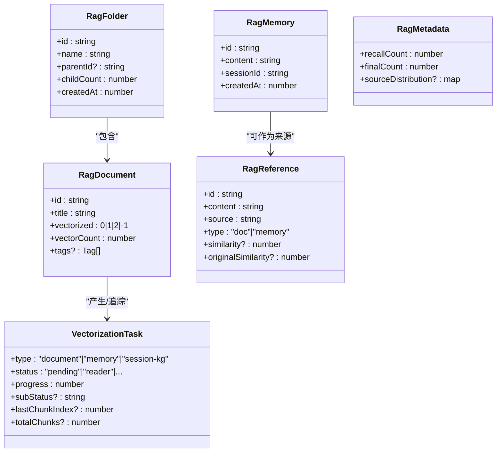
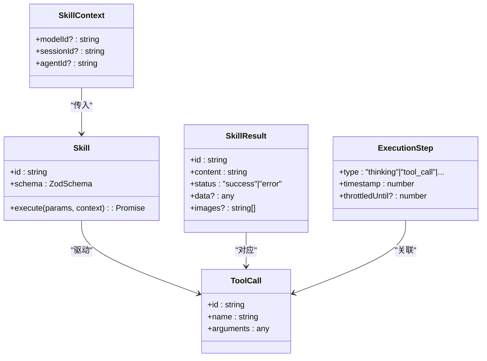
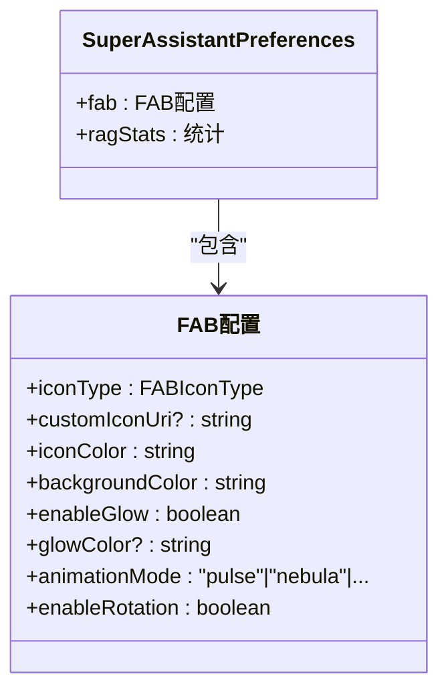
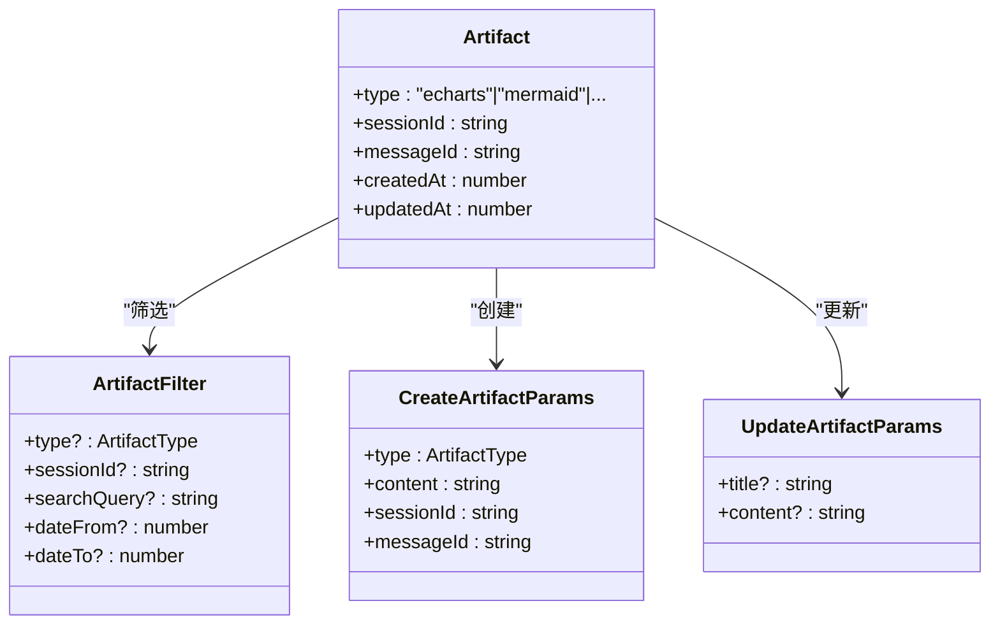
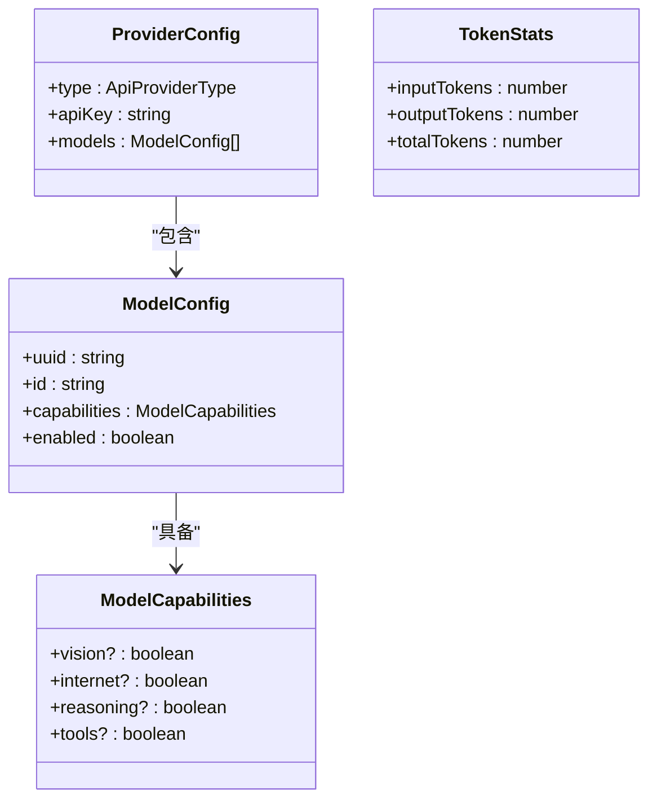
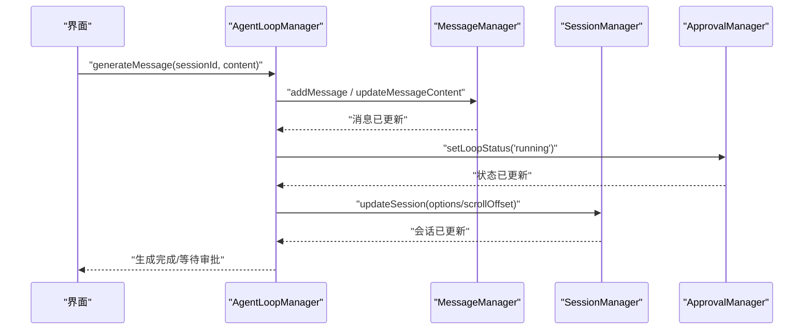
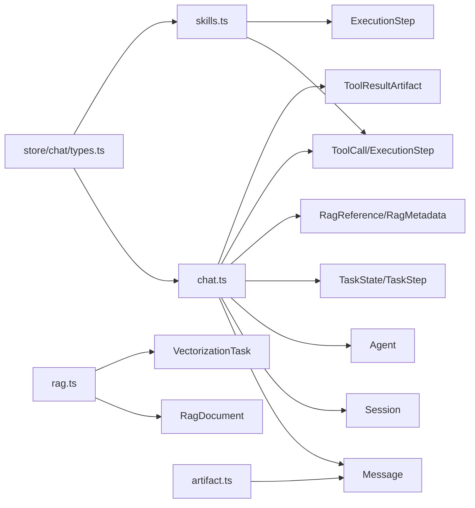

# 类型定义

<cite>
**本文引用的文件**
- [src/types/chat.ts](file://src/types/chat.ts)
- [src/types/rag.ts](file://src/types/rag.ts)
- [src/types/skills.ts](file://src/types/skills.ts)
- [src/types/super-assistant.ts](file://src/types/super-assistant.ts)
- [src/types/artifact.ts](file://src/types/artifact.ts)
- [src/store/chat/types.ts](file://src/store/chat/types.ts)
- [src/store/api-types.ts](file://src/store/api-types.ts)
- [src/types/modules.d.ts](file://src/types/modules.d.ts)
- [src/types/base-64.d.ts](file://src/types/base-64.d.ts)
</cite>

## 目录
1. [引言](#引言)
2. [项目结构与类型分布](#项目结构与类型分布)
3. [核心组件总览](#核心组件总览)
4. [架构概览](#架构概览)
5. [详细组件分析](#详细组件分析)
6. [依赖关系分析](#依赖关系分析)
7. [性能考量](#性能考量)
8. [故障排查指南](#故障排查指南)
9. [结论](#结论)
10. [附录](#附录)

## 引言
本文件为 Nexara 项目的类型定义参考文档，覆盖聊天系统、RAG 系统、技能系统、超级助手以及通用工件与 API 类型。文档聚焦以下目标：
- 全面记录核心数据类型、接口与枚举
- 深入解释 Agent、Session、Message、Task 的结构与关系
- 分析 RAG 文档、向量、引用与检索元数据的类型规范
- 记录技能系统的工具调用、执行步骤与产物类型
- 提供超级助手的配置类型、执行模式与状态管理类型说明
- 展示类型继承关系、泛型使用与类型守卫的应用场景
- 提供类型使用示例、最佳实践与常见错误的解决方案
- 覆盖类型扩展、向后兼容性与版本演进的指导原则

## 项目结构与类型分布
类型定义主要分布在以下位置：
- 核心类型：src/types 下的 chat.ts、rag.ts、skills.ts、super-assistant.ts、artifact.ts
- 状态与管理器类型：src/store/chat/types.ts
- API 与模型类型：src/store/api-types.ts
- 模块声明：src/types/modules.d.ts、src/types/base-64.d.ts

图表来源
- [src/types/chat.ts:1-314](file://src/types/chat.ts#L1-L314)
- [src/types/rag.ts:1-66](file://src/types/rag.ts#L1-L66)
- [src/types/skills.ts:1-74](file://src/types/skills.ts#L1-L74)
- [src/types/super-assistant.ts:1-107](file://src/types/super-assistant.ts#L1-L107)
- [src/types/artifact.ts:1-45](file://src/types/artifact.ts#L1-L45)
- [src/store/chat/types.ts:1-163](file://src/store/chat/types.ts#L1-L163)
- [src/store/api-types.ts:1-60](file://src/store/api-types.ts#L1-L60)

章节来源
- [src/types/chat.ts:1-314](file://src/types/chat.ts#L1-L314)
- [src/types/rag.ts:1-66](file://src/types/rag.ts#L1-L66)
- [src/types/skills.ts:1-74](file://src/types/skills.ts#L1-L74)
- [src/types/super-assistant.ts:1-107](file://src/types/super-assistant.ts#L1-L107)
- [src/types/artifact.ts:1-45](file://src/types/artifact.ts#L1-L45)
- [src/store/chat/types.ts:1-163](file://src/store/chat/types.ts#L1-L163)
- [src/store/api-types.ts:1-60](file://src/store/api-types.ts#L1-L60)

## 核心组件总览
- 聊天类型：Agent、Session、Message、Task、RagConfiguration、TokenMetric、BillingUsage、ToolResultArtifact、UpdateMessageOptions
- RAG 类型：RagFolder、RagDocument、VectorizationTask、RagMemory
- 技能类型：Skill、SkillContext、SkillResult、ToolCall、ExecutionStep
- 超级助手类型：FABIconType、SuperAssistantPreferences、默认偏好与预设集合
- 工件类型：Artifact、ArtifactFilter、CreateArtifactParams、UpdateArtifactParams
- API 类型：ApiProviderType、ModelCapabilities、ModelConfig、ProviderConfig、TokenStats

章节来源
- [src/types/chat.ts:1-314](file://src/types/chat.ts#L1-L314)
- [src/types/rag.ts:1-66](file://src/types/rag.ts#L1-L66)
- [src/types/skills.ts:1-74](file://src/types/skills.ts#L1-L74)
- [src/types/super-assistant.ts:1-107](file://src/types/super-assistant.ts#L1-L107)
- [src/types/artifact.ts:1-45](file://src/types/artifact.ts#L1-L45)
- [src/store/api-types.ts:1-60](file://src/store/api-types.ts#L1-L60)

## 架构概览
类型层与状态管理层的交互关系如下：

图表来源
- [src/types/chat.ts:15-314](file://src/types/chat.ts#L15-L314)
- [src/types/rag.ts:11-57](file://src/types/rag.ts#L11-L57)
- [src/types/skills.ts:8-74](file://src/types/skills.ts#L8-L74)
- [src/types/super-assistant.ts:24-41](file://src/types/super-assistant.ts#L24-L41)
- [src/types/artifact.ts:8-19](file://src/types/artifact.ts#L8-L19)

## 详细组件分析

### 聊天系统类型：Agent、Session、Message、Task
- Agent
  - 字段要点：标识、名称、描述、头像、颜色、系统提示、默认模型、推理参数、RAG 配置、预设/置顶标记、创建时间
  - 关键关系：与 Session 通过 agentId 关联；可携带全局 RAG 配置
- Session
  - 字段要点：标识、Agent 标识、标题、最后消息、时间、未读数、消息列表、模型覆盖、自定义提示、分页标记、执行轮次追踪、长运行标记、统计信息、推理参数、选项（网络搜索、推理、思考级别、工具启用、严格模式、时间注入）、RAG 选项（记忆/文档开关、活动文档/文件夹、知识图谱开关）、滚动偏移、草稿、活动任务、执行模式、循环状态、待干预指令、续杯预算、自动循环上限、激活 MCP 服务器与技能集合、审批请求
  - 关键关系：包含多个 Message；与 Agent、RAG 配置、工具执行、审批流程强相关
- Message
  - 字段要点：标识、角色、内容（Markdown）、创建时间、模型 ID、状态、错误标记与消息、等待过久标记、RAG 引用/进度/元数据、推理内容、引用链接、RAG 引用列表与加载标记、Token 使用、生成图片数据、文件附件、归档标记、向量化状态、布局高度缓存、执行步骤、工具调用、工具产物、待审批工具 ID 列表、工具调用关联 ID 与名称、思维签名、消息级任务快照、循环轮数
  - 关键关系：承载工具调用链与产物；与 TaskState、ExecutionStep、RagReference、TokenUsage 等紧密耦合
- TaskState/TaskStep
  - 字段要点：任务标识、标题、状态（进行中/完成/失败/待定）、进度、步骤列表、最终摘要、创建/更新时间
  - 关键关系：作为 Message 的“消息级任务快照”存在，便于回溯与展示

图表来源
- [src/types/chat.ts:15-241](file://src/types/chat.ts#L15-L241)

章节来源
- [src/types/chat.ts:15-241](file://src/types/chat.ts#L15-L241)

### RAG 系统数据模型：文档、向量、引用与检索元数据
- RagFolder
  - 字段要点：标识、名称、父文件夹标识、子项计数、创建时间
- RagDocument
  - 字段要点：标识、标题、内容、来源、类型、所属文件夹、向量化状态（未处理/处理中/完成/失败）、向量数量、文件大小、创建/更新时间、标签、缩略图路径、全局标记、内容哈希
- VectorizationTask
  - 字段要点：任务标识、任务类型（文档/记忆/会话KG）、文档/记忆/会话KG专用字段、通用状态（待处理/读取/切块/向量化/保存/抽取/完成/警告/失败）、进度、动态子状态描述、错误、创建/更新时间、KG策略、跳过向量化标记、检查点字段（最后块索引/总块数）
- RagMemory
  - 字段要点：向量标识、内容、会话标识、创建时间
- 检索引用与元数据
  - RagReference：引用标识、片段内容、来源、类型（文档/记忆）、文档标识、相似度分数（精排/原始）
  - RagProgress：阶段（重写/嵌入/检索/重排序/完成）、百分比、消息
  - RagMetadata：查询变体、检索耗时、重排序耗时、总耗时、召回数量、最终数量、最大相似度、来源分布（记忆/文档）

图表来源
- [src/types/rag.ts:3-66](file://src/types/rag.ts#L3-L66)
- [src/types/chat.ts:77-106](file://src/types/chat.ts#L77-L106)

章节来源
- [src/types/rag.ts:3-66](file://src/types/rag.ts#L3-L66)
- [src/types/chat.ts:77-106](file://src/types/chat.ts#L77-L106)

### 技能系统：工具调用、执行步骤与产物类型
- Skill
  - 字段要点：唯一标识、名称、描述、参数校验 Schema（Zod）、高风险标记、分类、来源 MCP 服务器、作者、创建/更新时间、执行函数（接收参数与上下文，返回统一结果）
- SkillContext
  - 字段要点：当前模型 ID、会话 ID、Agent ID
- SkillResult
  - 字段要点：对应 ToolCall.id、文本结果（Markdown）、状态（成功/错误）、结构化数据、图片路径
- ToolCall
  - 字段要点：调用 ID、工具名称（Skill.id）、解析后的参数对象
- ExecutionStep
  - 字段要点：步骤 ID、类型（思考/工具调用/工具结果/错误/计划项/需要干预/干预结果/原生搜索/结果/限流）、内容、工具名称/参数、工具调用 ID、结构化数据、时间戳、限流结束时间戳

图表来源
- [src/types/skills.ts:8-74](file://src/types/skills.ts#L8-L74)

章节来源
- [src/types/skills.ts:8-74](file://src/types/skills.ts#L8-L74)

### 超级助手配置类型、执行模式与状态管理
- FABIconType
  - 枚举值：多种预设图标类型与自定义类型
- SuperAssistantPreferences
  - 字段要点：悬浮按钮（图标类型/自定义图标URI/颜色/背景/发光/动画/旋转）、RAG 统计（文档/会话/向量/最后更新）
- 默认偏好与预设集合
  - DEFAULT_SPA_PREFERENCES：默认值集合
  - PRESET_FAB_ICONS：预设图标选项
  - PRESET_COLORS：预设颜色方案
  - ANIMATION_MODES：动画模式集合

图表来源
- [src/types/super-assistant.ts:24-58](file://src/types/super-assistant.ts#L24-L58)

章节来源
- [src/types/super-assistant.ts:1-107](file://src/types/super-assistant.ts#L1-L107)

### 工件类型：Artifact、过滤与创建/更新参数
- ArtifactType
  - 枚举值：echarts、mermaid、math、html、svg
- Artifact
  - 字段要点：标识、类型、标题、内容、预览图、会话标识、消息标识、创建/更新时间、标签
- ArtifactFilter
  - 字段要点：类型筛选、会话标识、搜索关键词、日期范围
- CreateArtifactParams/UpdateArtifactParams
  - 字段要点：创建/更新所需字段（标题、内容、预览图、标签等）

图表来源
- [src/types/artifact.ts:6-45](file://src/types/artifact.ts#L6-L45)

章节来源
- [src/types/artifact.ts:1-45](file://src/types/artifact.ts#L1-L45)

### API 类型：提供商、模型能力与统计
- ApiProviderType
  - 枚举值：多家提供商与本地/兼容类型
- ModelCapabilities
  - 字段要点：视觉、联网、推理、工具
- ModelConfig
  - 字段要点：内部 UUID、API 调用 ID、显示名称、类型（聊天/推理/图像/嵌入/重排序）、上下文长度、能力、启用状态、自动获取标记、图标
- ProviderConfig
  - 字段要点：标识、名称、类型、API Key、基础地址、启用状态、模型列表、特定平台字段（如 VertexAI 项目/区域/密钥）
- TokenStats
  - 字段要点：输入/输出/总计 Token、最后使用时间

图表来源
- [src/store/api-types.ts:2-60](file://src/store/api-types.ts#L2-L60)

章节来源
- [src/store/api-types.ts:1-60](file://src/store/api-types.ts#L1-L60)

### 状态与管理器类型：消息/会话/工具/审批/AgentLoop
- ManagerContext
  - 字段要点：状态获取器、状态设置器
- MessageManager
  - 方法要点：添加/更新/删除消息、向量化、更新进度、布局高度、向量化状态、刷新更新、工具调用支持
- SessionManager
  - 方法要点：添加/更新/删除会话、草稿/标题/提示/模型/选项/滚动偏移、按 Agent 获取会话、关闭活动任务、KG 抽取状态、切换 MCP 服务器/技能
- ToolExecutor
  - 方法要点：在指定消息中执行工具调用
- ApprovalManager
  - 方法要点：设置审批请求、恢复生成、设置执行模式、设置循环状态、设置待干预指令
- AgentLoopManager
  - 方法要点：生成/重新生成消息、是否为恢复生成、图片参数

图表来源
- [src/store/chat/types.ts:151-162](file://src/store/chat/types.ts#L151-L162)
- [src/store/chat/types.ts:35-73](file://src/store/chat/types.ts#L35-L73)
- [src/store/chat/types.ts:77-103](file://src/store/chat/types.ts#L77-L103)
- [src/store/chat/types.ts:119-142](file://src/store/chat/types.ts#L119-L142)

章节来源
- [src/store/chat/types.ts:1-163](file://src/store/chat/types.ts#L1-L163)

## 依赖关系分析
- 类型依赖
  - Message 依赖 ToolCall、ExecutionStep、ToolResultArtifact、TaskState、RagReference、RagMetadata、TokenUsage
  - Session 依赖 Agent、Message、RagConfiguration、工具/审批状态
  - Skill 依赖 ToolCall、SkillContext、SkillResult
  - RagDocument 依赖 VectorizationTask
  - Artifact 依赖 Message
- 状态管理器依赖
  - MessageManager/SessionManager/ToolExecutor/ApprovalManager/AgentLoopManager 依赖 chat.ts 中的核心类型

图表来源
- [src/types/chat.ts:1-314](file://src/types/chat.ts#L1-L314)
- [src/types/skills.ts:1-74](file://src/types/skills.ts#L1-L74)
- [src/types/rag.ts:1-66](file://src/types/rag.ts#L1-L66)
- [src/types/artifact.ts:1-45](file://src/types/artifact.ts#L1-L45)
- [src/store/chat/types.ts:1-21](file://src/store/chat/types.ts#L1-L21)

章节来源
- [src/types/chat.ts:1-314](file://src/types/chat.ts#L1-L314)
- [src/types/skills.ts:1-74](file://src/types/skills.ts#L1-L74)
- [src/types/rag.ts:1-66](file://src/types/rag.ts#L1-L66)
- [src/types/artifact.ts:1-45](file://src/types/artifact.ts#L1-L45)
- [src/store/chat/types.ts:1-21](file://src/store/chat/types.ts#L1-L21)

## 性能考量
- Token 估算与计费
  - TokenMetric 标记估算值，避免误判计费
  - BillingUsage 将聊天输入/输出、RAG 系统开销拆分统计，便于成本控制
- 检索与向量化
  - VectorizationTask 状态机与检查点字段支持断点续跑与可观测性
  - RagProgress/RagMetadata 提供检索阶段与性能指标
- UI 性能
  - Message.layoutHeight 缓存布局高度，减少滚动重绘
  - 向量化状态与图片数据分离，降低渲染压力
- 并发与竞态
  - MessageManager.flushMessageUpdates 保证 UI 与后台任务看到最新状态，缓解竞态

章节来源
- [src/types/chat.ts:38-50](file://src/types/chat.ts#L38-L50)
- [src/types/chat.ts:87-106](file://src/types/chat.ts#L87-L106)
- [src/types/rag.ts:29-57](file://src/types/rag.ts#L29-L57)
- [src/store/chat/types.ts:68-68](file://src/store/chat/types.ts#L68-L68)

## 故障排查指南
- 常见错误与定位
  - 工具调用失败：检查 ToolCall.arguments 与 Skill.schema 的匹配；查看 SkillResult.status 与 images/data 字段
  - 审批阻塞：确认 ApprovalManager.setApprovalRequest 的请求类型与工具名称/参数；检查 AgentLoopManager.setLoopStatus 是否停留在 waiting_for_approval
  - 向量化异常：查看 VectorizationTask.status 与 error；结合 RagDocument.vectorized 与 vectorCount 判断
  - 消息状态不一致：调用 MessageManager.flushMessageUpdates 强制刷新
- 最佳实践
  - 在严格模式下逐项完成任务步骤，避免“快速完成”导致的状态不一致
  - 使用 UpdateMessageOptions 一次性更新多字段，减少多次渲染
  - 对长运行会话启用续杯预算与自动循环上限，防止无限循环

章节来源
- [src/types/skills.ts:41-47](file://src/types/skills.ts#L41-L47)
- [src/store/chat/types.ts:119-142](file://src/store/chat/types.ts#L119-L142)
- [src/types/rag.ts:46-51](file://src/types/rag.ts#L46-L51)
- [src/store/chat/types.ts:68-68](file://src/store/chat/types.ts#L68-L68)

## 结论
本类型体系围绕“聊天—RAG—技能—工件—API”的主干展开，既满足前端渲染与交互需求，又为后端服务与存储提供清晰契约。通过明确的枚举、接口与管理器类型，系统实现了对复杂工作流（工具调用、AgentLoop、审批与续杯）的强约束与可观测性。建议在扩展新功能时遵循既有类型命名与职责边界，保持向后兼容与版本演进的稳定性。

## 附录
- 模块声明
  - modules.d.ts：声明第三方模块（富文本渲染、JSON 修复、文本净化）
  - base-64.d.ts：声明 base-64 模块
- 版本演进建议
  - 新增字段优先采用可选属性，并提供默认值或迁移策略
  - 复杂状态（如 RAG 配置）建议拆分为全局与会话级，避免重复与冲突
  - 对外暴露的枚举值与字符串常量需保持稳定，必要时通过别名或映射兼容

章节来源
- [src/types/modules.d.ts:1-4](file://src/types/modules.d.ts#L1-L4)
- [src/types/base-64.d.ts:1-2](file://src/types/base-64.d.ts#L1-L2)