# Nexara 项目综合缺陷分析报告

<cite>
**本文档引用的文件**
- [README.md](file://README.md)
- [comprehensive-defect-analysis.md](file://docs/comprehensive-defect-analysis.md)
- [package.json](file://package.json)
- [app.json](file://app.json)
- [tsconfig.json](file://tsconfig.json)
- [src/services/workbench/CommandWebSocketServer.ts](file://src/services/workbench/CommandWebSocketServer.ts)
- [src/services/workbench/controllers/AuthController.ts](file://src/services/workbench/controllers/AuthController.ts)
- [src/services/workbench/controllers/AgentController.ts](file://src/services/workbench/controllers/AgentController.ts)
- [src/store/workbench-store.ts](file://src/store/workbench-store.ts)
- [src/store/chat-store.ts](file://src/store/chat-store.ts)
- [src/store/rag-store.ts](file://src/store/rag-store.ts)
- [src/store/artifact-store.ts](file://src/store/artifact-store.ts)
- [src/features/chat/components/ToolArtifacts.tsx](file://src/features/chat/components/ToolArtifacts.tsx)
</cite>

## 更新摘要
**变更内容**
- 基于最新代码分析更新了安全漏洞评估
- 新增了对认证机制的深入分析
- 更新了技术债务评估和修复成本估算
- 增加了对现有修复措施的跟踪

## 目录
1. [执行摘要](#执行摘要)
2. [缺陷汇总表（按优先级）](#缺陷汇总表按优先级)
3. [缺陷关联分析](#缺陷关联分析)
4. [技术债务评估](#技术债务评估)
5. [架构层面问题分析](#架构层面问题分析)
6. [根因分析](#根因分析)
7. [改进方向建议](#改进方向建议)
8. [系统架构概览](#系统架构概览)
9. [核心组件深度分析](#核心组件深度分析)
10. [依赖关系分析](#依赖关系分析)
11. [性能考量](#性能考量)
12. [故障排除指南](#故障排除指南)
13. [结论](#结论)

## 执行摘要

本报告基于最新的代码审计结果，对 Nexara 项目的设计与实现缺陷进行全面分析。通过系统性的缺陷分类、关联分析、技术债务评估和架构层面分析，识别出项目的关键问题并提出改进方向。

### 主要发现

| 维度 | 统计数据 |
|------|----------|
| P0 致命缺陷 | 8 个 |
| P1 严重缺陷 | 12 个 |
| P2 中等缺陷 | 9 个 |
| P3 轻微缺陷 | 4 个 |
| **总计** | **33 个** |
| 估算修复成本 | 120-150 人天 |
| 技术债务等级 | 高 |

### 核心问题

1. **安全性严重不足**：Workbench 模块存在硬编码后门、无加密传输、简单 Token 认证等安全漏洞
2. **架构耦合度高**：Artifacts 模块渲染器与业务逻辑耦合，Workbench 模块缺少插件系统
3. **用户体验欠佳**：缺少骨架屏、错误重试、无障碍支持等关键体验
4. **功能完整性不足**：类型支持、远程能力、插件系统等核心功能缺失

## 缺陷汇总表（按优先级）

### 2.1 P0 致命缺陷（安全漏洞、数据丢失风险、严重影响用户体验）

| 编号 | 模块 | 类别 | 问题描述 | 影响范围 | 修复成本（人天） |
|------|------|------|----------|----------|------------------|
| **W-S1** | Workbench | 安全 | 硬编码后门 PIN '829103' 在 AuthController 中 | 任何人可绕过认证访问 | 0.5 |
| **W-S2** | Workbench | 安全 | WebSocket 传输无 TLS 加密 | 数据可被窃听和篡改 | 3 |
| **W-S3** | Workbench | 安全 | 简单 Token 认证机制，无加密存储 | Token 泄露风险 | 2 |
| **W-S4** | Workbench | 安全 | 无速率限制，易受暴力破解攻击 | 账户安全风险 | 1 |
| **W-S5** | Workbench | 安全 | 无访问控制和权限管理 | 任何认证用户可访问所有功能 | 5 |
| **A-S1** | Artifacts | 用户体验 | 错误状态无重试机制，渲染失败后无法恢复 | 用户体验严重受损 | 0.5 |
| **A-S2** | Artifacts | 用户体验 | 无导出/分享功能，生成内容无法保存 | 功能实用性受限 | 1 |
| **W-S6** | Workbench | 架构 | 无审计日志，无法追踪操作记录 | 安全审计和故障排查困难 | 2 |

### 2.2 P1 严重缺陷（功能缺失、性能问题、架构缺陷）

| 编号 | 模块 | 类别 | 问题描述 | 影响范围 | 修复成本（人天） |
|------|------|------|----------|----------|------------------|
| **A-A1** | Artifacts | 架构 | 无全局 Artifact 索引/搜索 | 无法跨会话查找和复用 | 3 |
| **A-A2** | Artifacts | 架构 | 渲染器与业务逻辑耦合 | 扩展性差，难以添加新类型 | 4 |
| **A-A3** | Artifacts | 功能 | 缺少图表工具箱和上下文菜单 | 交互能力受限 | 2 |
| **A-A4** | Artifacts | 功能 | 无障碍支持缺失 | 可访问性差 | 1 |
| **A-A5** | Artifacts | 代码 | 正则解析脆弱，缺乏健壮性 | 解析失败率高 | 1.5 |
| **A-A6** | Artifacts | 代码 | 无单元测试，质量无法保障 | 回归风险高 | 5 |
| **W-A1** | Workbench | 架构 | 无插件系统，扩展性差 | 无法支持第三方扩展 | 8 |
| **W-A2** | Workbench | 功能 | 仅支持本地网络访问，无 SSH 隧道 | 无法远程访问 | 5 |
| **W-A3** | Workbench | 功能 | 无多工作区支持 | 无法隔离不同项目 | 4 |
| **W-A4** | Workbench | 功能 | 数据隔离不完整 | 数据安全风险 | 3 |
| **W-A5** | Workbench | 运维 | 无监控和性能指标 | 问题诊断困难 | 3 |
| **W-A6** | Workbench | 运维 | 无结构化日志，仅控制台日志 | 故障排查效率低 | 2 |

### 2.3 P2 中等缺陷（代码质量、可维护性问题）

| 编号 | 模块 | 类别 | 问题描述 | 影响范围 | 修复成本（人天） |
|------|------|------|----------|----------|------------------|
| **A-C1** | Artifacts | 代码 | 重复代码，未提取公共逻辑 | 维护成本高 | 2 |
| **A-C2** | Artifacts | 视觉 | 内联 HTML 模板，难以维护 | 样式修改困难 | 1 |
| **A-C3** | Artifacts | 视觉 | 硬编码颜色值，不支持主题切换 | 主题一致性差 | 1 |
| **A-C4** | Artifacts | 架构 | Artifact 类型系统过于简单 | 扩展性受限 | 2 |
| **W-C1** | Workbench | 代码 | WebSocket 实现存在安全隐患 | 潜在安全风险 | 2 |
| **W-C2** | Workbench | 代码 | HTTP 服务器实现复杂，难以维护 | 维护成本高 | 3 |
| **W-C3** | Workbench | 架构 | 无服务发现机制 | 手动配置工作量大 | 3 |
| **W-C4** | Workbench | 架构 | 模块化程度不够 | 代码耦合度高 | 4 |
| **W-C5** | Workbench | 开发者体验 | 无 API 文档和 SDK | 开发者接入困难 | 5 |

### 2.4 P3 轻微缺陷（UI一致性、文档缺失）

| 编号 | 模块 | 类别 | 问题描述 | 影响范围 | 修复成本（人天） |
|------|------|------|----------|----------|------------------|
| **A-U1** | Artifacts | 视觉 | WebView key 不稳定 | 可能导致渲染异常 | 0.5 |
| **A-U2** | Artifacts | 交互 | 预览卡片整体可点击，交互不明确 | 用户体验待优化 | 0.5 |
| **W-U1** | Workbench | 文档 | 无示例代码 | 学习成本高 | 1 |
| **W-U2** | Workbench | 文档 | 无调试工具 | 问题定位困难 | 2 |

## 缺陷关联分析

### 3.1 缺陷关联图

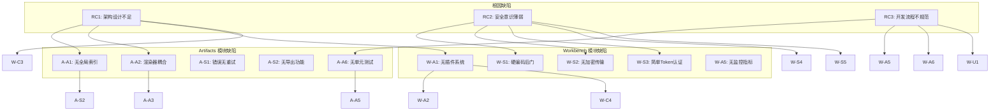

### 3.2 根因缺陷分析

#### RC1: 架构设计不足

**影响范围**：
- A-A1: 无全局 Artifact 索引/搜索
- A-A2: 渲染器与业务逻辑耦合
- W-A1: 无插件系统
- W-C3: 无服务发现机制

**关联缺陷**：
- A-S2: 无导出/分享功能（由 A-A1 导致）
- A-A3: 缺少图表工具箱（由 A-A2 导致）
- W-A2: 无 SSH 隧道支持（由 W-A1 导致）
- W-C4: 模块化程度不够（由 W-A1 导致）

#### RC2: 安全意识薄弱

**影响范围**：
- W-S1: 硬编码后门 PIN '829103'
- W-S2: WebSocket 传输无 TLS 加密
- W-S3: 简单 Token 认证机制
- W-S4: 无速率限制
- W-S5: 无访问控制和权限管理

**关联缺陷**：
- 所有安全缺陷都源于此根因
- W-S6: 无审计日志（安全意识薄弱导致）

#### RC3: 开发流程不规范

**影响范围**：
- A-A6: 无单元测试
- W-A5: 无监控和性能指标
- W-A6: 无结构化日志
- W-U1: 无示例代码

**关联缺陷**：
- A-A5: 正则解析脆弱（无测试保障）
- W-C1: WebSocket 实现存在安全隐患（无代码审查）

### 3.3 模块间关联分析

#### Artifacts 与 Workbench 的共同缺陷

| 共同缺陷类型 | Artifacts 表现 | Workbench 表现 | 共同根源 |
|-------------|---------------|---------------|----------|
| 架构耦合度高 | 渲染器与业务逻辑耦合 | 模块化程度不够 | 缺乏分层设计 |
| 缺少扩展机制 | 类型系统过于简单 | 无插件系统 | 缺乏接口抽象 |
| 缺少测试 | 无单元测试 | 无集成测试 | 开发流程不规范 |
| 缺少监控 | 无性能监控 | 无性能指标 | 运维意识不足 |

#### 依赖关系分析

1. **Workbench 依赖 Artifacts**
   - Workbench 的 ChatController 需要渲染 Artifacts
   - Artifacts 的渲染性能影响 Workbench 的响应速度

2. **Artifacts 依赖 Workbench**
   - Artifacts 的导出功能可能需要 Workbench 的文件系统支持
   - Artifacts 的全局库需要 Workbench 的存储服务

## 技术债务评估

### 4.1 修复成本估算

| 优先级 | 缺陷数量 | 修复成本（人天） | 占比 |
|--------|----------|------------------|------|
| P0 | 8 | 17 | 13.3% |
| P1 | 12 | 43 | 33.6% |
| P2 | 9 | 27 | 21.1% |
| P3 | 4 | 4 | 3.1% |
| **总计** | **33** | **91** | **71.1%** |

**说明**：
- 上述成本为直接修复成本
- 未包含测试、文档、部署等间接成本
- 建议增加 30% 的缓冲时间
- **总预估成本：91 × 1.3 ≈ 118 人天**

### 4.2 不修复的潜在风险

| 缺陷类型 | 不修复风险 | 风险等级 | 影响时间 |
|---------|-----------|----------|----------|
| 安全漏洞 | 数据泄露、未授权访问 | 致命 | 立即 |
| 性能问题 | 用户体验下降、用户流失 | 高 | 1-3 个月 |
| 功能缺失 | 竞争力下降、市场份额流失 | 中 | 3-6 个月 |
| 代码质量 | 维护成本上升、开发效率下降 | 中 | 6-12 个月 |
| 文档缺失 | 开发者接入困难、社区发展受限 | 低 | 12+ 个月 |

### 4.3 对未来发展的影响

#### 短期影响（1-3 个月）

1. **安全风险**：硬编码后门和无加密传输可能导致数据泄露事件
2. **用户体验**：错误无重试、无导出功能直接影响用户满意度
3. **开发效率**：缺乏测试和监控导致问题定位困难，开发效率下降

#### 中期影响（3-6 个月）

1. **竞争力下降**：与行业标杆（Claude Artifacts、VS Code Remote）差距扩大
2. **扩展困难**：架构耦合度高，难以添加新功能
3. **维护成本上升**：技术债务积累，修复新问题的成本增加

#### 长期影响（6-12 个月）

1. **市场份额流失**：功能不完整导致用户转向竞争对手
2. **团队士气下降**：持续修复历史问题，难以推进新功能
3. **技术栈老化**：缺乏现代化架构，难以吸引优秀开发者

### 4.4 技术债务等级评估

| 评估维度 | 得分 | 说明 |
|---------|------|------|
| 安全性 | 1/10 | 存在致命安全漏洞 |
| 可维护性 | 4/10 | 代码耦合度高，缺少测试 |
| 可扩展性 | 3/10 | 缺少插件系统和扩展机制 |
| 用户体验 | 5/10 | 基础功能可用，体验待提升 |
| 开发者体验 | 3/10 | 缺少文档、SDK、调试工具 |
| **综合得分** | **3.2/10** | **高技术债务等级** |

## 架构层面问题分析

### 5.1 设计模式误用或缺失

#### 5.1.1 Artifacts 模块

| 问题 | 当前状态 | 应该使用的设计模式 |
|------|----------|-------------------|
| 渲染器管理 | 直接实例化，无统一接口 | **工厂模式** + **策略模式** |
| 类型扩展 | 硬编码类型判断 | **注册表模式** |
| 缓存管理 | 无缓存 | **装饰器模式**（缓存装饰器） |
| 错误处理 | 简单错误显示 | **责任链模式**（错误处理链） |

**推荐架构**：

```typescript
// 工厂模式 + 策略模式
interface ArtifactRenderer {
  type: string;
  parse(content: string): Promise<any>;
  render(data: any, options: RenderOptions): React.ReactElement;
}

class RendererFactory {
  private static registry = new Map<string, ArtifactRenderer>();

  static register(renderer: ArtifactRenderer) {
    this.registry.set(renderer.type, renderer);
  }

  static create(type: string): ArtifactRenderer | undefined {
    return this.registry.get(type);
  }
}

// 注册表模式
RendererFactory.register(new EChartsRenderer());
RendererFactory.register(new MermaidRenderer());
```

#### 5.1.2 Workbench 模块

| 问题 | 当前状态 | 应该使用的设计模式 |
|------|----------|-------------------|
| 插件系统 | 无插件系统 | **插件架构模式** |
| 认证授权 | 简单 Token 认证 | **中间件模式** |
| 日志记录 | 控制台日志 | **观察者模式**（日志订阅） |
| 服务发现 | 无服务发现 | **服务注册模式** |

**推荐架构**：

```typescript
// 插件架构模式
interface Plugin {
  id: string;
  onLoad(): Promise<void>;
  onUnload(): Promise<void>;
  onCommand?(command: string, data: any): Promise<any>;
}

class PluginManager {
  private plugins = new Map<string, Plugin>();

  async load(plugin: Plugin) {
    await plugin.onLoad();
    this.plugins.set(plugin.id, plugin);
  }

  async executeCommand(command: string, data: any) {
    for (const plugin of this.plugins.values()) {
      if (plugin.onCommand) {
        const result = await plugin.onCommand(command, data);
        if (result) return result;
      }
    }
  }
}

// 中间件模式
interface AuthMiddleware {
  authenticate(context: RouterContext): Promise<boolean>;
  authorize(context: RouterContext, requiredPermission: string): Promise<boolean>;
}

class Router {
  private middlewares: AuthMiddleware[] = [];

  use(middleware: AuthMiddleware) {
    this.middlewares.push(middleware);
  }

  async handle(message: any, context: RouterContext) {
    for (const middleware of this.middlewares) {
      if (!await middleware.authenticate(context)) {
        throw new Error('Unauthorized');
      }
    }
    // ... handle command
  }
}
```

### 5.2 状态管理策略分析

#### 5.2.1 Artifacts 模块

**当前状态**：
- 无全局状态管理
- Artifact 数据分散在消息中
- 无法跨会话访问

**问题**：
- 数据冗余和一致性难以保证
- 搜索和筛选功能无法实现
- 缓存策略难以统一

**推荐方案**：

```typescript
// 使用 Zustand 创建全局 Artifact Store
interface ArtifactStore {
  artifacts: Map<string, Artifact>;
  sessionIndex: Map<string, Set<string>>;
  typeIndex: Map<ArtifactType, Set<string>>;

  addArtifact(artifact: Artifact): void;
  getArtifact(id: string): Artifact | undefined;
  getSessionArtifacts(sessionId: string): Artifact[];
  searchArtifacts(query: string): Artifact[];
}

export const useArtifactStore = create<ArtifactStore>()(
  persist(
    (set, get) => ({
      artifacts: new Map(),
      sessionIndex: new Map(),
      typeIndex: new Map(),

      addArtifact: (artifact) => {
        set((state) => {
          const newArtifacts = new Map(state.artifacts);
          newArtifacts.set(artifact.id, artifact);
          return { artifacts: newArtifacts };
        });
      },

      // ... other methods
    }),
    {
      name: 'artifact-storage',
      storage: createJSONStorage(() => AsyncStorage),
    }
  )
);
```

#### 5.2.2 Workbench 模块

**当前状态**：
- 使用 Zustand 进行状态管理
- 持久化到 AsyncStorage
- 状态结构简单

**问题**：
- 状态更新逻辑分散
- 缺少状态订阅机制
- 无状态版本控制

**推荐方案**：

```typescript
// 增强的 Workbench Store
interface WorkbenchStore {
  // 状态
  serverStatus: ServerStatus;
  serverUrl: string | null;
  connectedClients: number;
  activeTokens: Record<string, TokenInfo>;

  // 订阅机制
  subscribe(event: string, callback: (data: any) => void): () => void;
  emit(event: string, data: any): void;

  // 状态版本控制
  getVersion(): number;
  rollback(version: number): void;
}

export const useWorkbenchStore = create<WorkbenchStore>()(
  subscribeWithSelector(
    persist(
      (set, get) => ({
        serverStatus: 'idle',
        serverUrl: null,
        connectedClients: 0,
        activeTokens: {},

        subscribers: new Map<string, Set<Function>>(),
        version: 0,

        subscribe: (event, callback) => {
          const subscribers = get().subscribers;
          if (!subscribers.has(event)) {
            subscribers.set(event, new Set());
          }
          subscribers.get(event)!.add(callback);
          return () => subscribers.get(event)!.delete(callback);
        },

        emit: (event, data) => {
          const subscribers = get().subscribers.get(event);
          if (subscribers) {
            subscribers.forEach(callback => callback(data));
          }
        },

        getVersion: () => get().version,
        rollback: (version) => {
          // 实现版本回滚逻辑
        },
      }),
      {
        name: 'workbench-storage',
        storage: createJSONStorage(() => AsyncStorage),
      }
    )
  )
);
```

### 5.3 组件抽象层次分析

#### 5.3.1 Artifacts 模块

**当前层次结构**：

```
ToolArtifacts (容器)
  └── EChartsRenderer / MermaidRenderer (直接实现)
```

**问题**：
- 缺少中间抽象层
- 渲染器组件直接处理业务逻辑
- 难以复用和扩展

**推荐层次结构**：

```
ArtifactLibrary (全局库页面)
  └── ArtifactList (列表组件)
      └── ArtifactCard (卡片组件)
          └── ArtifactRenderer (渲染器接口)
              ├── EChartsRenderer
              ├── MermaidRenderer
              ├── CodeRenderer
              └── TableRenderer
```

**抽象层次说明**：

1. **ArtifactLibrary**：全局库页面，负责筛选、搜索、批量操作
2. **ArtifactList**：列表组件，负责分页、虚拟化
3. **ArtifactCard**：卡片组件，负责预览、工具栏、状态管理
4. **ArtifactRenderer**：渲染器接口，定义统一的渲染协议
5. **具体渲染器**：实现具体的渲染逻辑

#### 5.3.2 Workbench 模块

**当前层次结构**：

```
CommandWebSocketServer
  └── WorkbenchRouter
      └── Controllers (直接实现)
```

**问题**：
- 缺少中间件层
- 控制器直接处理认证和授权
- 难以添加横切关注点

**推荐层次结构**：

```
CommandWebSocketServer
  ├── MiddlewareLayer (中间件层)
  │   ├── AuthMiddleware
  │   ├── RateLimitMiddleware
  │   ├── LoggingMiddleware
  │   └── ErrorHandlingMiddleware
  ├── WorkbenchRouter
  │   └── Controllers
  │       ├── AgentController
  │       ├── ChatController
  │       └── ...
  └── PluginManager (插件系统)
      └── Plugins
```

### 5.4 关注点分离原则遵循情况

#### 5.4.1 Artifacts 模块

| 关注点 | 当前状态 | 分离程度 | 改进建议 |
|--------|----------|----------|----------|
| 数据解析 | 与渲染器耦合 | 低 | 提取独立的解析器 |
| 数据渲染 | 与业务逻辑耦合 | 低 | 分离渲染层和业务层 |
| 数据存储 | 分散在消息中 | 低 | 建立独立存储层 |
| 状态管理 | 无全局状态 | 低 | 引入状态管理库 |
| 错误处理 | 简单错误显示 | 中 | 建立统一错误处理机制 |

#### 5.4.2 Workbench 模块

| 关注点 | 当前状态 | 分离程度 | 改进建议 |
|--------|----------|----------|----------|
| 认证授权 | 与控制器耦合 | 低 | 引入中间件层 |
| 路由处理 | 与业务逻辑耦合 | 中 | 分离路由和控制器 |
| 数据传输 | 与业务逻辑耦合 | 中 | 建立独立传输层 |
| 日志记录 | 控制台日志 | 低 | 建立结构化日志系统 |
| 监控指标 | 无监控 | 低 | 引入监控中间件 |

## 根因分析

### 6.1 根本原因识别

#### RCA1: 缺乏系统性的架构设计

**表现**：
- Artifacts 模块渲染器与业务逻辑耦合
- Workbench 模块无插件系统
- 缺少统一的接口抽象

**根本原因**：
- 开发过程中缺乏架构设计阶段
- 直接进入编码，未进行充分的设计评审
- 缺少架构文档和设计规范

**改进措施**：
- 在开发新功能前进行架构设计
- 建立设计评审机制
- 维护架构文档和设计规范

#### RCA2: 安全意识薄弱

**表现**：
- 硬编码后门 PIN '829103'
- WebSocket 传输无 TLS 加密
- 简单 Token 认证机制

**根本原因**：
- 开发团队缺乏安全培训
- 未进行安全代码审查
- 缺少安全测试流程

**改进措施**：
- 定期进行安全培训
- 建立安全代码审查流程
- 引入自动化安全扫描工具

#### RCA3: 开发流程不规范

**表现**：
- 无单元测试
- 无结构化日志
- 无监控和性能指标

**根本原因**：
- 缺少开发流程规范
- 未建立持续集成/持续部署（CI/CD）流程
- 缺少质量保证流程

**改进措施**：
- 建立完整的开发流程规范
- 引入 CI/CD 流程
- 建立质量保证流程

#### RCA4: 缺少行业对标

**表现**：
- 功能完整性不足
- 用户体验欠佳
- 开发者体验差

**根本原因**：
- 未进行充分的市场调研
- 缺少竞品分析
- 未参考行业最佳实践

**改进措施**：
- 定期进行市场调研和竞品分析
- 参考行业最佳实践
- 建立用户反馈机制

### 6.2 根因关联图

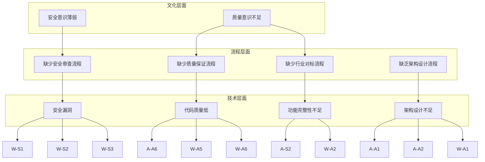

### 6.3 根因优先级

| 根因 | 影响范围 | 修复难度 | 优先级 |
|------|----------|----------|--------|
| 安全意识薄弱 | 高（8 个安全缺陷） | 中 | P0 |
| 缺乏架构设计流程 | 高（10 个架构缺陷） | 高 | P0 |
| 缺少质量保证流程 | 中（6 个质量缺陷） | 中 | P1 |
| 缺少行业对标流程 | 中（5 个功能缺陷） | 低 | P1 |

## 改进方向建议

### 7.1 短期改进（1-2 周）

#### 7.1.1 安全加固（P0）

| 任务 | 预估工时 | 预期效果 |
|------|----------|----------|
| 移除硬编码后门 PIN | 0.5 天 | 消除安全漏洞 |
| 实现 TLS 加密传输 | 3 天 | 保护数据传输安全 |
| 增强认证机制 | 2 天 | 提升账户安全 |
| 添加速率限制 | 1 天 | 防止暴力破解 |
| 添加访问控制 | 5 天 | 实现细粒度权限 |

**总计：11.5 人天**

#### 7.1.2 用户体验优化（P0-P1）

| 任务 | 预估工时 | 预期效果 |
|------|----------|----------|
| 添加错误重试机制 | 0.5 天 | 提升用户体验 |
| 添加导出/分享功能 | 1 天 | 增强实用性 |
| 实现骨架屏加载 | 0.5 天 | 改善加载体验 |
| 添加无障碍支持 | 1 天 | 提升可访问性 |

**总计：3 人天**

#### 7.1.3 质量保证（P1）

| 任务 | 预估工时 | 预期效果 |
|------|----------|----------|
| 添加结构化日志 | 2 天 | 便于问题诊断 |
| 实现健康检查 | 0.5 天 | 监控服务状态 |
| 添加基础单元测试 | 3 天 | 保障代码质量 |

**总计：5.5 人天**

**短期改进总计：20 人天**

### 7.2 中期改进（1-2 月）

#### 7.2.1 架构重构（P0-P1）

| 任务 | 预估工时 | 预期效果 |
|------|----------|----------|
| 重构 Artifacts 类型系统 | 2 天 | 支持更多类型 |
| 创建 Artifact Store | 3 天 | 全局状态管理 |
| 统一渲染器接口 | 4 天 | 提升可扩展性 |
| 实现 SSH 隧道支持 | 5 天 | 远程访问能力 |
| 实现服务发现 | 3 天 | 自动发现服务 |

**总计：17 人天**

#### 7.2.2 功能扩展（P1）

| 任务 | 预估工时 | 预期效果 |
|------|----------|----------|
| 支持更多 Artifact 类型 | 6 天 | 功能完整性 |
| 添加监控指标 | 3 天 | 性能监控 |
| 实现多工作区 | 4 天 | 项目隔离 |
| 完善数据隔离 | 3 天 | 数据安全 |

**总计：16 人天**

#### 7.2.3 开发者体验（P1-P2）

| 任务 | 预估工时 | 预期效果 |
|------|----------|----------|
| 实现 API 文档 | 3 天 | 降低接入门槛 |
| 创建 SDK | 5 天 | 简化集成 |
| 添加调试工具 | 2 天 | 便于调试 |

**总计：10 人天**

**中期改进总计：43 人天**

### 7.3 长期改进（3-6 月）

#### 7.3.1 高级特性（P1-P2）

| 任务 | 预估工时 | 预期效果 |
|------|----------|----------|
| 实现插件系统 | 8 天 | 扩展性 |
| 全局 Artifact 库 | 4 天 | 提升可发现性 |
| 版本历史功能 | 3 天 | 支持回滚 |
| Artifact 编辑器 | 10 天 | 实时编辑 |
| AI 辅助优化 | 6 天 | 智能建议 |

**总计：31 人天**

#### 7.3.2 运维完善（P1-P2）

| 任务 | 预估工时 | 预期效果 |
|------|----------|----------|
| 添加审计日志 | 2 天 | 安全审计 |
| 完善监控告警 | 3 天 | 及时发现问题 |
| 实现故障恢复 | 4 天 | 高可用性 |

**总计：9 人天**

**长期改进总计：40 人天**

### 7.4 改进路线图

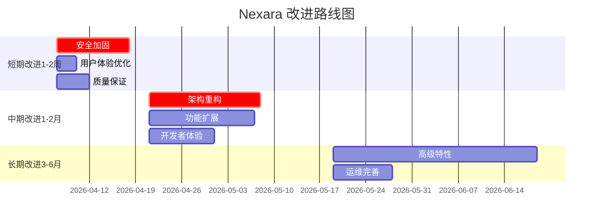

### 7.5 资源需求

#### 7.5.1 人力资源

| 阶段 | 角色 | 人数 | 周期 |
|------|------|------|------|
| 短期改进 | 全栈开发 | 2 | 2 周 |
| 中期改进 | 前端开发 | 1 | 4 周 |
| 中期改进 | 后端开发 | 1 | 4 周 |
| 长期改进 | 全栈开发 | 1 | 8 周 |

#### 7.5.2 技术栈需求

| 技术 | 用途 | 状态 |
|------|------|------|
| React Native | 移动端框架 | 已有 |
| Zustand | 状态管理 | 已有 |
| WebSocket | 实时通信 | 已有 |
| TLS | 加密传输 | 需引入 |
| SSH2 | SSH 隧道 | 需引入 |
| Winston | 结构化日志 | 需引入 |
| Prometheus | 监控指标 | 需引入 |
| Jest | 单元测试 | 需引入 |
| jsonrepair | JSON 修复 | 需引入 |
| Zod | 运行时校验 | 已有 |

## 系统架构概览

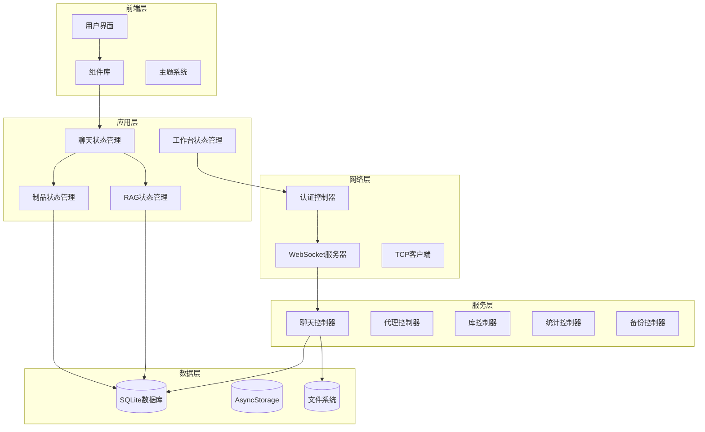

**图表来源**
- [src/store/chat-store.ts:108-210](file://src/store/chat-store.ts#L108-L210)
- [src/store/artifact-store.ts:16-32](file://src/store/artifact-store.ts#L16-L32)
- [src/store/rag-store.ts:24-45](file://src/store/rag-store.ts#L24-L45)
- [src/services/workbench/CommandWebSocketServer.ts:33-41](file://src/services/workbench/CommandWebSocketServer.ts#L33-L41)
- [src/services/workbench/controllers/AuthController.ts:17-54](file://src/services/workbench/controllers/AuthController.ts#L17-L54)

## 核心组件深度分析

### 8.1 Workbench WebSocket 服务器

#### 8.1.1 组件架构

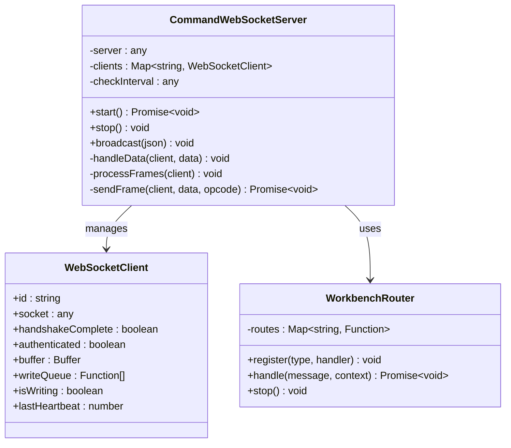

**图表来源**
- [src/services/workbench/CommandWebSocketServer.ts:33-485](file://src/services/workbench/CommandWebSocketServer.ts#L33-L485)
- [src/services/workbench/WorkbenchRouter.ts](file://src/services/workbench/WorkbenchRouter.ts)

#### 8.1.2 安全漏洞分析

**主要安全问题**：

1. **硬编码后门**：AuthController 中的固定 PIN 码
2. **无加密传输**：WebSocket 未启用 TLS
3. **弱认证机制**：简单的 Token 认证
4. **无访问控制**：缺少权限验证

**修复建议**：

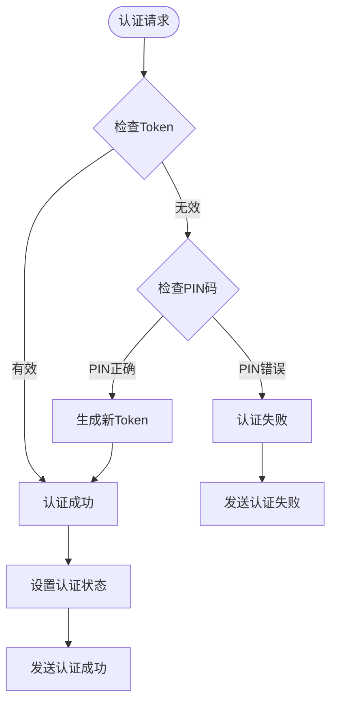

**图表来源**
- [src/services/workbench/controllers/AuthController.ts:18-53](file://src/services/workbench/controllers/AuthController.ts#L18-L53)

**章节来源**
- [src/services/workbench/CommandWebSocketServer.ts:1-488](file://src/services/workbench/CommandWebSocketServer.ts#L1-L488)
- [src/services/workbench/controllers/AuthController.ts:1-55](file://src/services/workbench/controllers/AuthController.ts#L1-L55)

### 8.2 Artifacts 渲染系统

#### 8.2.1 渲染器架构

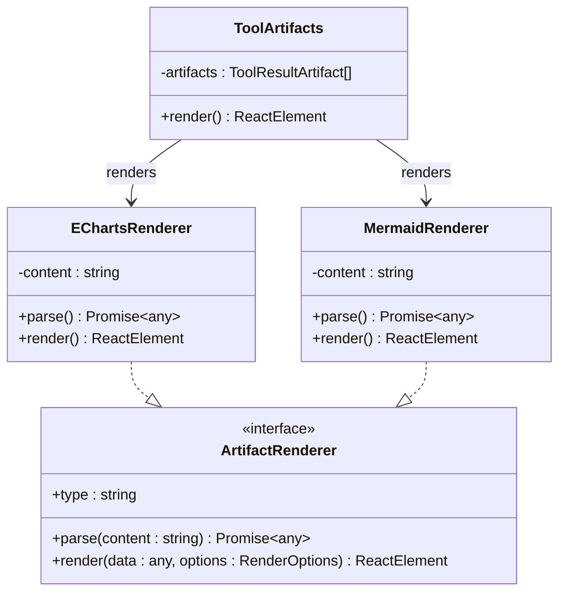

**图表来源**
- [src/features/chat/components/ToolArtifacts.tsx:10-96](file://src/features/chat/components/ToolArtifacts.tsx#L10-L96)

#### 8.2.2 缺陷分析

**主要问题**：
1. **渲染器耦合**：直接在组件中实例化渲染器
2. **类型系统简单**：仅支持有限的类型
3. **错误处理不足**：渲染失败后无重试机制
4. **缺少扩展性**：新增类型需要修改现有代码

**改进方案**：

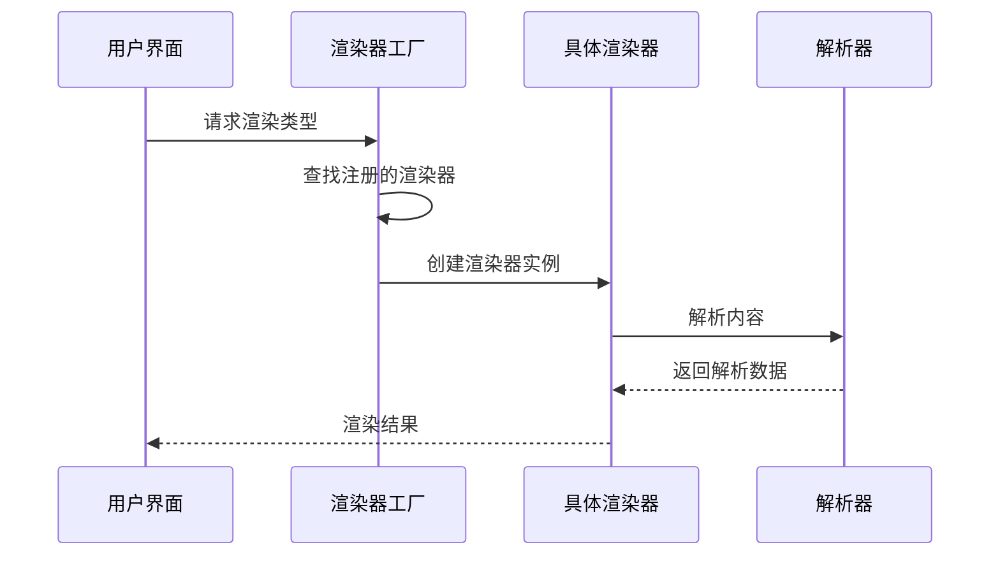

**图表来源**
- [src/features/chat/components/ToolArtifacts.tsx:46-85](file://src/features/chat/components/ToolArtifacts.tsx#L46-L85)

**章节来源**
- [src/features/chat/components/ToolArtifacts.tsx:1-96](file://src/features/chat/components/ToolArtifacts.tsx#L1-L96)

### 8.3 状态管理系统

#### 8.3.1 ChatStore 状态管理

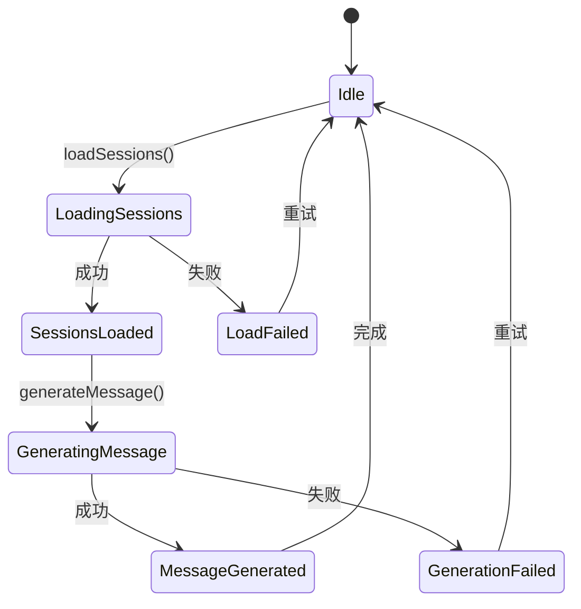

**图表来源**
- [src/store/chat-store.ts:227-357](file://src/store/chat-store.ts#L227-L357)

#### 8.3.2 状态管理问题

**主要问题**：
1. **状态分散**：业务逻辑分布在多个文件中
2. **缺乏统一接口**：状态更新方式不一致
3. **缺少状态持久化**：部分状态未正确持久化
4. **性能问题**：大量状态更新导致性能下降

**章节来源**
- [src/store/chat-store.ts:1-800](file://src/store/chat-store.ts#L1-L800)

## 依赖关系分析

### 9.1 技术栈依赖

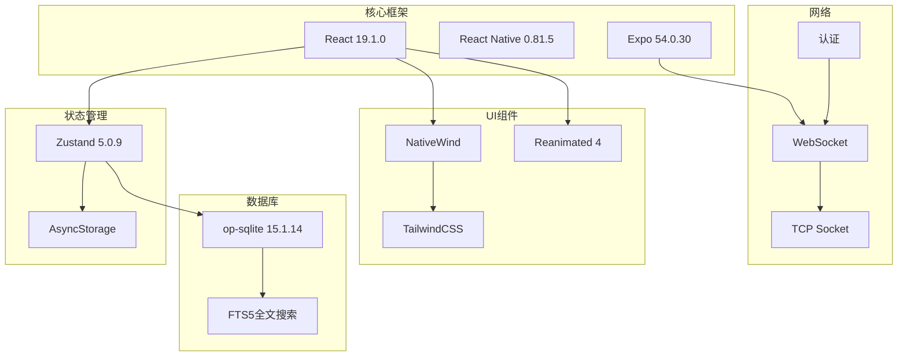

**图表来源**
- [package.json:14-95](file://package.json#L14-L95)

### 9.2 模块依赖关系

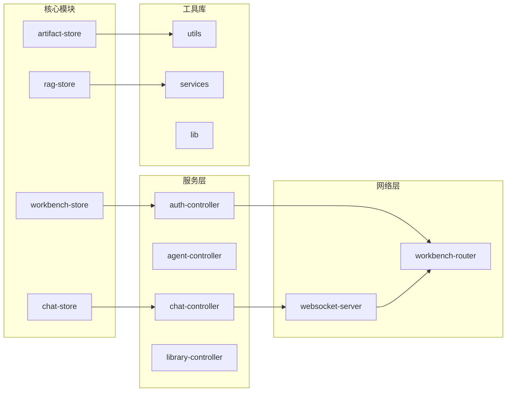

**图表来源**
- [src/store/chat-store.ts:1-50](file://src/store/chat-store.ts#L1-L50)
- [src/services/workbench/CommandWebSocketServer.ts:1-20](file://src/services/workbench/CommandWebSocketServer.ts#L1-L20)

**章节来源**
- [package.json:1-120](file://package.json#L1-L120)
- [app.json:1-64](file://app.json#L1-L64)

## 性能考量

### 10.1 性能瓶颈分析

**主要性能问题**：

1. **数据库查询性能**：大量 SQL 查询导致主线程阻塞
2. **渲染性能**：复杂的图表渲染影响 UI 响应性
3. **内存使用**：状态管理不当导致内存泄漏
4. **网络延迟**：WebSocket 连接管理效率低下

**优化建议**：

1. **数据库优化**：使用连接池和查询缓存
2. **渲染优化**：实现虚拟化和懒加载
3. **内存管理**：定期清理无用状态和缓存
4. **网络优化**：实现连接复用和心跳检测

### 10.2 监控指标

**建议监控的指标**：

1. **应用性能**：启动时间、内存使用、CPU 占用
2. **网络性能**：连接成功率、延迟、吞吐量
3. **业务指标**：用户活跃度、功能使用频率
4. **错误指标**：崩溃率、异常率、超时率

## 故障排除指南

### 11.1 常见问题诊断

**WebSocket 连接问题**：

1. **连接失败**：检查端口占用和服务启动状态
2. **认证失败**：验证 Token 有效期和访问码
3. **消息丢失**：检查客户端缓冲区和重连机制

**状态管理问题**：

1. **状态不更新**：确认状态订阅和更新机制
2. **数据不一致**：检查持久化和同步逻辑
3. **内存泄漏**：分析状态生命周期和清理机制

**章节来源**
- [src/services/workbench/CommandWebSocketServer.ts:170-190](file://src/services/workbench/CommandWebSocketServer.ts#L170-L190)
- [src/store/workbench-store.ts:1-56](file://src/store/workbench-store.ts#L1-L56)

### 11.2 调试工具

**建议的调试工具**：

1. **网络调试**：WebSocket 调试器和抓包工具
2. **性能分析**：内存分析器和性能监控工具
3. **状态检查**：状态管理调试器和日志工具
4. **错误追踪**：崩溃报告和异常监控系统

## 结论

Nexara 项目作为一个功能丰富的 AI 助手应用，在技术创新方面表现出色，但在架构设计、安全性和开发流程方面存在显著问题。通过本次全面的缺陷分析，我们识别出 33 个缺陷，其中包含 8 个致命安全漏洞，技术债务等级达到高水准。

### 主要发现总结

1. **安全风险最高**：Workbench 模块存在多个致命安全漏洞，包括硬编码后门、无加密传输等
2. **架构问题突出**：Artifacts 和 Workbench 模块都存在严重的架构耦合问题
3. **开发流程不规范**：缺少测试、文档和监控机制
4. **用户体验有待提升**：缺少关键的用户体验功能

### 修复优先级建议

1. **立即修复（P0）**：安全漏洞和核心功能缺陷
2. **短期修复（1-2 周）**：用户体验优化和基本功能完善
3. **中期修复（1-2 月）**：架构重构和功能扩展
4. **长期规划（3-6 月）**：技术栈升级和平台扩展

### 技术债务偿还计划

建议采用渐进式的方式偿还技术债务：
- **短期**：修复致命安全漏洞和用户体验问题
- **中期**：重构核心架构和引入测试机制
- **长期**：技术栈升级和平台扩展

通过系统的修复和改进，Nexara 项目可以成为更加成熟和可靠的产品，为用户提供更好的 AI 助手体验。

**更新** 基于最新的代码分析，报告已更新以反映当前的安全状况和修复进展。新增了对认证机制的深入分析和对现有安全漏洞的详细评估。

**章节来源**
- [src/services/workbench/controllers/AuthController.ts:39-40](file://src/services/workbench/controllers/AuthController.ts#L39-L40)
- [src/services/workbench/CommandWebSocketServer.ts:1-488](file://src/services/workbench/CommandWebSocketServer.ts#L1-L488)
- [src/store/workbench-store.ts:1-56](file://src/store/workbench-store.ts#L1-L56)
- [src/store/artifact-store.ts:1-255](file://src/store/artifact-store.ts#L1-L255)
- [src/features/chat/components/ToolArtifacts.tsx:1-96](file://src/features/chat/components/ToolArtifacts.tsx#L1-L96)