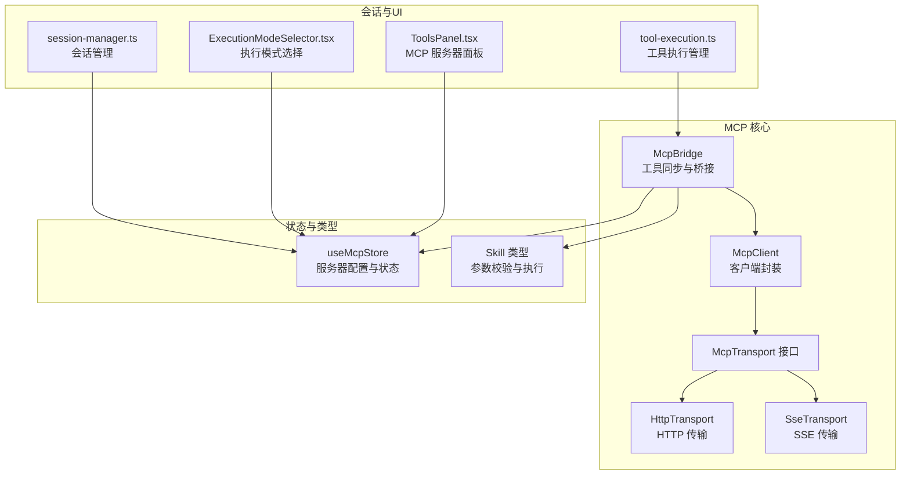
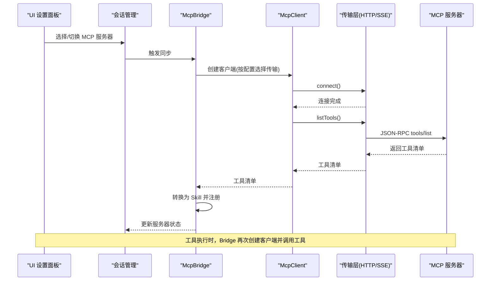
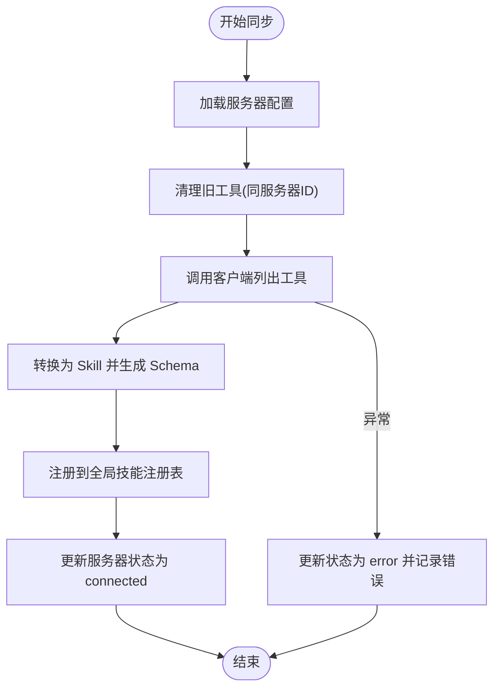
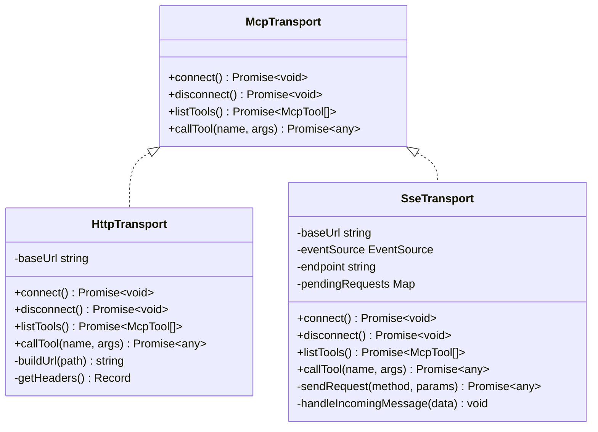
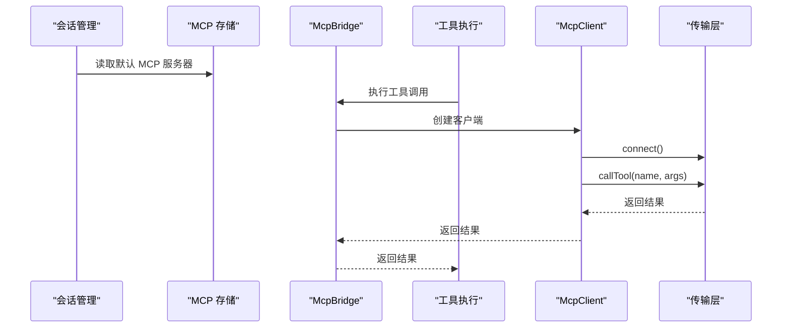
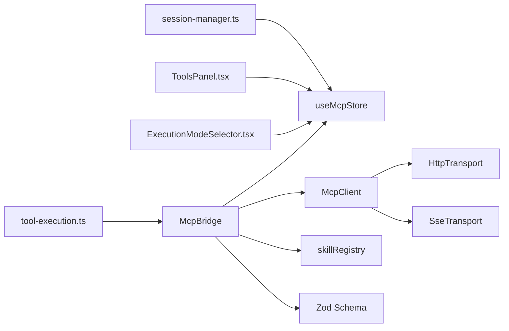

# MCP协议原理与架构

<cite>
**本文档引用的文件**
- [mcp-bridge.ts](file://src/lib/mcp/mcp-bridge.ts)
- [mcp-client.ts](file://src/lib/mcp/mcp-client.ts)
- [transport.ts](file://src/lib/mcp/transport.ts)
- [http-transport.ts](file://src/lib/mcp/transports/http-transport.ts)
- [sse-transport.ts](file://src/lib/mcp/transports/sse-transport.ts)
- [mcp-store.ts](file://src/store/mcp-store.ts)
- [skills.ts](file://src/types/skills.ts)
- [ExecutionModeSelector.tsx](file://src/features/chat/components/ExecutionModeSelector.tsx)
- [ToolsPanel.tsx](file://src/features/chat/components/SessionSettingsSheet/ToolsPanel.tsx)
- [tool-execution.ts](file://src/store/chat/tool-execution.ts)
- [session-manager.ts](file://src/store/chat/session-manager.ts)
</cite>

## 目录
1. [引言](#引言)
2. [项目结构](#项目结构)
3. [核心组件](#核心组件)
4. [架构总览](#架构总览)
5. [详细组件分析](#详细组件分析)
6. [依赖关系分析](#依赖关系分析)
7. [性能考量](#性能考量)
8. [故障排除指南](#故障排除指南)
9. [结论](#结论)
10. [附录](#附录)

## 引言
本文件系统性阐述 Nexara 中的 MCP（Model Context Protocol）协议实现与架构设计。MCP 协议旨在为 AI 模型提供标准化的外部工具调用能力，使模型能够通过统一的 JSON-RPC 接口发现并调用外部工具。在 Nexara 中，MCP 通过客户端-传输层抽象、桥接器、存储与技能注册表等模块协同工作，实现跨服务器的工具同步、参数校验与执行。

## 项目结构
围绕 MCP 的代码主要分布在以下位置：
- 协议与传输层：src/lib/mcp
- 存储与状态管理：src/store/mcp-store.ts
- 技能类型与注册：src/types/skills.ts
- 会话与工具执行集成：src/store/chat/tool-execution.ts、src/store/chat/session-manager.ts
- UI 集成：src/features/chat/components/ExecutionModeSelector.tsx、src/features/chat/components/SessionSettingsSheet/ToolsPanel.tsx

图表来源
- [mcp-bridge.ts:1-202](file://src/lib/mcp/mcp-bridge.ts#L1-L202)
- [mcp-client.ts:1-52](file://src/lib/mcp/mcp-client.ts#L1-L52)
- [transport.ts:1-14](file://src/lib/mcp/transport.ts#L1-L14)
- [http-transport.ts:1-158](file://src/lib/mcp/transports/http-transport.ts#L1-L158)
- [sse-transport.ts:1-205](file://src/lib/mcp/transports/sse-transport.ts#L1-L205)
- [mcp-store.ts:1-72](file://src/store/mcp-store.ts#L1-L72)
- [skills.ts:1-74](file://src/types/skills.ts#L1-L74)
- [tool-execution.ts:198-236](file://src/store/chat/tool-execution.ts#L198-L236)
- [session-manager.ts:1-21](file://src/store/chat/session-manager.ts#L1-L21)
- [ExecutionModeSelector.tsx:271-303](file://src/features/chat/components/ExecutionModeSelector.tsx#L271-L303)
- [ToolsPanel.tsx:35-180](file://src/features/chat/components/SessionSettingsSheet/ToolsPanel.tsx#L35-L180)

章节来源
- [mcp-bridge.ts:1-202](file://src/lib/mcp/mcp-bridge.ts#L1-L202)
- [mcp-client.ts:1-52](file://src/lib/mcp/mcp-client.ts#L1-L52)
- [transport.ts:1-14](file://src/lib/mcp/transport.ts#L1-L14)
- [http-transport.ts:1-158](file://src/lib/mcp/transports/http-transport.ts#L1-L158)
- [sse-transport.ts:1-205](file://src/lib/mcp/transports/sse-transport.ts#L1-L205)
- [mcp-store.ts:1-72](file://src/store/mcp-store.ts#L1-L72)
- [skills.ts:1-74](file://src/types/skills.ts#L1-L74)
- [tool-execution.ts:198-236](file://src/store/chat/tool-execution.ts#L198-L236)
- [session-manager.ts:1-21](file://src/store/chat/session-manager.ts#L1-L21)
- [ExecutionModeSelector.tsx:271-303](file://src/features/chat/components/ExecutionModeSelector.tsx#L271-L303)
- [ToolsPanel.tsx:35-180](file://src/features/chat/components/SessionSettingsSheet/ToolsPanel.tsx#L35-L180)

## 核心组件
- McpBridge：负责扫描已启用的 MCP 服务器，拉取工具清单，将其转换为本地 Skill 并注册到全局注册表；同时维护服务器状态。
- McpClient：面向上层的统一客户端，根据配置选择 HTTP 或 SSE 传输层。
- McpTransport 接口：定义统一的连接、断开、列出工具、调用工具方法。
- HttpTransport：基于 HTTP 的 JSON-RPC 实现，支持路径回退与错误处理。
- SseTransport：基于 SSE 的 JSON-RPC 实现，通过 endpoint 事件确定 POST 端点，异步等待响应。
- useMcpStore：持久化的 MCP 服务器配置与状态存储。
- Skill 类型：统一的工具执行接口，包含参数校验（Zod）、执行上下文与结果格式。

章节来源
- [mcp-bridge.ts:1-202](file://src/lib/mcp/mcp-bridge.ts#L1-L202)
- [mcp-client.ts:1-52](file://src/lib/mcp/mcp-client.ts#L1-L52)
- [transport.ts:1-14](file://src/lib/mcp/transport.ts#L1-L14)
- [http-transport.ts:1-158](file://src/lib/mcp/transports/http-transport.ts#L1-L158)
- [sse-transport.ts:1-205](file://src/lib/mcp/transports/sse-transport.ts#L1-L205)
- [mcp-store.ts:1-72](file://src/store/mcp-store.ts#L1-L72)
- [skills.ts:1-74](file://src/types/skills.ts#L1-L74)

## 架构总览
下图展示了从会话到工具执行的完整链路，以及 MCP 在其中的角色：

图表来源
- [mcp-bridge.ts:42-129](file://src/lib/mcp/mcp-bridge.ts#L42-L129)
- [mcp-client.ts:10-50](file://src/lib/mcp/mcp-client.ts#L10-L50)
- [http-transport.ts:50-88](file://src/lib/mcp/transports/http-transport.ts#L50-L88)
- [sse-transport.ts:182-203](file://src/lib/mcp/transports/sse-transport.ts#L182-L203)
- [tool-execution.ts:198-236](file://src/store/chat/tool-execution.ts#L198-L236)
- [session-manager.ts:11-21](file://src/store/chat/session-manager.ts#L11-L21)

## 详细组件分析

### McpBridge：工具同步与桥接
- 覆盖式同步：每次同步前清理对应服务器的旧工具，避免残留。
- 元工具描述增强：针对特定服务器的元工具（如列出、获取、调用）提供更清晰的 UI 描述。
- 参数强制转换：根据输入 Schema 将对象参数序列化为字符串，提升兼容性。
- Zod Schema 转换：递归将 JSON Schema 转为 Zod 校验器，支持嵌套对象、数组与枚举。
- 错误处理与状态管理：捕获异常并更新服务器状态，最终确保客户端断开连接。

图表来源
- [mcp-bridge.ts:14-129](file://src/lib/mcp/mcp-bridge.ts#L14-L129)
- [mcp-bridge.ts:135-200](file://src/lib/mcp/mcp-bridge.ts#L135-L200)

章节来源
- [mcp-bridge.ts:1-202](file://src/lib/mcp/mcp-bridge.ts#L1-L202)

### McpClient：统一客户端封装
- 传输选择：根据配置的 type（http/sse）选择对应传输层，默认 http 以保证向后兼容。
- 生命周期：显式 connect()/disconnect()，确保资源正确释放。
- 工具操作：listTools()/callTool() 直接委托给传输层。

章节来源
- [mcp-client.ts:1-52](file://src/lib/mcp/mcp-client.ts#L1-L52)

### McpTransport 接口与实现
- 接口职责：定义统一的连接、断开、列出工具、调用工具方法。
- HTTP 传输：
  - 使用 JSON-RPC 2.0，POST 请求至根 URL 或回退路径。
  - 自动构建 URL，处理相对路径与查询参数。
  - 提供调试日志，打印请求体以便排查。
- SSE 传输：
  - 通过 SSE 流接收 endpoint 事件，确定后续 POST 端点。
  - 维护 pendingRequests 映射，响应通过 SSE 回推并匹配 id。
  - 支持绝对/相对 endpoint 的合并策略。

图表来源
- [transport.ts:1-14](file://src/lib/mcp/transport.ts#L1-L14)
- [http-transport.ts:1-158](file://src/lib/mcp/transports/http-transport.ts#L1-L158)
- [sse-transport.ts:1-205](file://src/lib/mcp/transports/sse-transport.ts#L1-L205)

章节来源
- [transport.ts:1-14](file://src/lib/mcp/transport.ts#L1-L14)
- [http-transport.ts:1-158](file://src/lib/mcp/transports/http-transport.ts#L1-L158)
- [sse-transport.ts:1-205](file://src/lib/mcp/transports/sse-transport.ts#L1-L205)

### 存储与状态管理：useMcpStore
- 服务器配置：id、name、url、type、enabled、defaultIncluded、status、error 等。
- CRUD 操作：增删改查服务器配置。
- UI 辅助：setServerStatus 支持状态与错误信息的更新与清理。
- 持久化：使用 zustand/persist 与 AsyncStorage 持久化。

章节来源
- [mcp-store.ts:1-72](file://src/store/mcp-store.ts#L1-L72)

### 技能类型与执行：Skill
- 统一接口：id、name、description、schema（Zod）、execute(params, context)。
- 安全与元数据：isHighRisk、category、mcpServerId、author 等。
- 执行结果：统一的 SkillResult 结构，便于 UI 渲染与历史记录。

章节来源
- [skills.ts:1-74](file://src/types/skills.ts#L1-L74)

### 会话与工具执行集成
- 会话管理：从存储中读取默认 MCP 服务器列表，用于新会话的初始化。
- 工具执行：在执行工具调用时，桥接器再次创建客户端并调用工具，完成后断开连接，确保无状态执行。
- UI 集成：执行模式选择与 MCP 服务器面板展示服务器状态与 URL，支持启用/禁用与切换。

图表来源
- [session-manager.ts:11-21](file://src/store/chat/session-manager.ts#L11-L21)
- [tool-execution.ts:198-236](file://src/store/chat/tool-execution.ts#L198-L236)
- [mcp-bridge.ts:79-112](file://src/lib/mcp/mcp-bridge.ts#L79-L112)

章节来源
- [session-manager.ts:1-21](file://src/store/chat/session-manager.ts#L1-L21)
- [tool-execution.ts:198-236](file://src/store/chat/tool-execution.ts#L198-L236)
- [ExecutionModeSelector.tsx:271-303](file://src/features/chat/components/ExecutionModeSelector.tsx#L271-L303)
- [ToolsPanel.tsx:35-180](file://src/features/chat/components/SessionSettingsSheet/ToolsPanel.tsx#L35-L180)

## 依赖关系分析
- McpBridge 依赖：
  - useMcpStore：读取服务器配置与状态。
  - McpClient：发起工具同步与调用。
  - skillRegistry：注册/移除工具。
  - Zod：参数 Schema 转换。
- McpClient 依赖：
  - McpTransport 接口与具体实现（HttpTransport/SseTransport）。
- 传输层依赖：
  - HTTP：fetch、URL 构造。
  - SSE：react-native-sse、EventSource。
- UI 依赖：
  - ExecutionModeSelector.tsx、ToolsPanel.tsx 展示与控制 MCP 服务器。
- 会话与执行：
  - session-manager.ts 与 tool-execution.ts 与存储交互，驱动工具执行。

图表来源
- [mcp-bridge.ts:1-202](file://src/lib/mcp/mcp-bridge.ts#L1-L202)
- [mcp-client.ts:1-52](file://src/lib/mcp/mcp-client.ts#L1-L52)
- [http-transport.ts:1-158](file://src/lib/mcp/transports/http-transport.ts#L1-L158)
- [sse-transport.ts:1-205](file://src/lib/mcp/transports/sse-transport.ts#L1-L205)
- [mcp-store.ts:1-72](file://src/store/mcp-store.ts#L1-L72)
- [ExecutionModeSelector.tsx:271-303](file://src/features/chat/components/ExecutionModeSelector.tsx#L271-L303)
- [ToolsPanel.tsx:35-180](file://src/features/chat/components/SessionSettingsSheet/ToolsPanel.tsx#L35-L180)
- [session-manager.ts:1-21](file://src/store/chat/session-manager.ts#L1-L21)
- [tool-execution.ts:198-236](file://src/store/chat/tool-execution.ts#L198-L236)

章节来源
- [mcp-bridge.ts:1-202](file://src/lib/mcp/mcp-bridge.ts#L1-L202)
- [mcp-client.ts:1-52](file://src/lib/mcp/mcp-client.ts#L1-L52)
- [mcp-store.ts:1-72](file://src/store/mcp-store.ts#L1-L72)
- [ExecutionModeSelector.tsx:271-303](file://src/features/chat/components/ExecutionModeSelector.tsx#L271-L303)
- [ToolsPanel.tsx:35-180](file://src/features/chat/components/SessionSettingsSheet/ToolsPanel.tsx#L35-L180)
- [session-manager.ts:1-21](file://src/store/chat/session-manager.ts#L1-L21)
- [tool-execution.ts:198-236](file://src/store/chat/tool-execution.ts#L198-L236)

## 性能考量
- 无状态执行：每次工具调用都新建客户端并在完成后断开，避免长连接带来的资源占用，适合移动端与低频调用场景。
- 传输选择：
  - HTTP：简单直接，适合稳定网络与标准 JSON-RPC 服务。
  - SSE：支持服务端推送与动态 endpoint，适合需要实时消息的服务。
- URL 构建健壮性：HTTP 传输内置路径回退与 URL 正规化逻辑，减少部署差异导致的调用失败。
- 参数校验：通过 Zod Schema 提前校验，减少无效调用与服务端错误。

## 故障排除指南
- 连接失败：
  - 检查服务器 URL 与 type 配置是否正确。
  - 查看 SSE 连接是否收到 endpoint 事件，确认 POST 端点可用。
- 工具调用失败：
  - 查看 HTTP 传输的日志输出，确认请求体结构与方法名。
  - 注意 404/405/403 状态码，HTTP 传输会尝试回退路径。
- 参数不匹配：
  - 使用 McpBridge 的参数强制转换功能，确保对象参数被序列化为字符串。
  - 检查输入 Schema，必要时调整调用参数结构。
- 状态异常：
  - useMcpStore 的 setServerStatus 会在连接或加载时清除历史错误，关注最新错误信息。

章节来源
- [http-transport.ts:115-142](file://src/lib/mcp/transports/http-transport.ts#L115-L142)
- [sse-transport.ts:156-180](file://src/lib/mcp/transports/sse-transport.ts#L156-L180)
- [mcp-bridge.ts:80-93](file://src/lib/mcp/mcp-bridge.ts#L80-L93)
- [mcp-store.ts:53-64](file://src/store/mcp-store.ts#L53-L64)

## 结论
Nexara 的 MCP 实现通过清晰的分层设计（桥接器、客户端、传输层、存储与类型系统）实现了对多服务器工具的统一接入与执行。其优势在于：
- 无状态执行与灵活的传输选择，适配不同服务端实现；
- 强大的参数校验与 Schema 转换，提升工具调用的可靠性；
- 与会话与 UI 的深度集成，便于用户控制与观察。

## 附录

### MCP 协议消息格式与通信机制
- JSON-RPC 2.0：
  - tools/list：获取工具清单。
  - tools/call：调用指定工具，包含 name 与 arguments。
- 传输差异：
  - HTTP：直接 POST 至服务端，支持路径回退。
  - SSE：通过 endpoint 事件确定 POST 端点，响应通过 SSE 流回推。

章节来源
- [http-transport.ts:58-63](file://src/lib/mcp/transports/http-transport.ts#L58-L63)
- [http-transport.ts:94-101](file://src/lib/mcp/transports/http-transport.ts#L94-L101)
- [sse-transport.ts:145-150](file://src/lib/mcp/transports/sse-transport.ts#L145-L150)
- [sse-transport.ts:187-192](file://src/lib/mcp/transports/sse-transport.ts#L187-L192)

### 安全考虑
- 参数校验：通过 Zod Schema 对输入进行严格校验，降低注入风险。
- 无状态调用：避免长期连接，减少会话劫持与资源泄露风险。
- 传输选择：SSE 在开发环境可接受自签名证书，生产需谨慎配置。

章节来源
- [mcp-bridge.ts:135-200](file://src/lib/mcp/mcp-bridge.ts#L135-L200)
- [sse-transport.ts:41-42](file://src/lib/mcp/transports/sse-transport.ts#L41-L42)

### 在 Nexara 中的应用场景与优势
- 场景：金融数据查询、知识检索、图像生成等外部工具调用。
- 优势：统一工具入口、参数 Schema 化、UI 可视化控制、会话级过滤与默认包含策略。

章节来源
- [mcp-bridge.ts:64-70](file://src/lib/mcp/mcp-bridge.ts#L64-L70)
- [mcp-store.ts:10-18](file://src/store/mcp-store.ts#L10-L18)
- [ToolsPanel.tsx:135-174](file://src/features/chat/components/SessionSettingsSheet/ToolsPanel.tsx#L135-L174)

### 与其他工具桥接方案的对比与选择依据
- 与自定义 REST API 对比：
  - MCP 提供标准化的 JSON-RPC 接口与工具发现机制，减少重复开发。
- 与 WebSocket 方案对比：
  - MCP 的 SSE 传输提供服务端推送能力，适合需要实时通知的场景；HTTP 传输则更简单可靠。
- 选择依据：
  - 服务端是否支持 MCP（tools/list/tools/call）。
  - 是否需要服务端推送与动态 endpoint。
  - 网络环境与部署复杂度。

章节来源
- [http-transport.ts:50-88](file://src/lib/mcp/transports/http-transport.ts#L50-L88)
- [sse-transport.ts:182-203](file://src/lib/mcp/transports/sse-transport.ts#L182-L203)

### 标准化实现指南与最佳实践
- 服务端实现：
  - 实现 tools/list 与 tools/call 方法，遵循 JSON-RPC 2.0。
  - SSE 服务端需发送 endpoint 事件，指示后续 POST 端点。
- 客户端实现：
  - 优先使用 McpClient，按需选择 HTTP 或 SSE 传输。
  - 使用 Zod Schema 校验参数，确保类型一致。
  - 记录调试日志，便于排查工具调用问题。
- 配置与运维：
  - 使用 useMcpStore 管理服务器配置与状态，支持持久化。
  - 在 UI 中提供服务器状态展示与切换，便于用户控制。

章节来源
- [mcp-client.ts:10-21](file://src/lib/mcp/mcp-client.ts#L10-L21)
- [mcp-store.ts:32-71](file://src/store/mcp-store.ts#L32-L71)
- [http-transport.ts:104-106](file://src/lib/mcp/transports/http-transport.ts#L104-L106)
- [sse-transport.ts:153-154](file://src/lib/mcp/transports/sse-transport.ts#L153-L154)