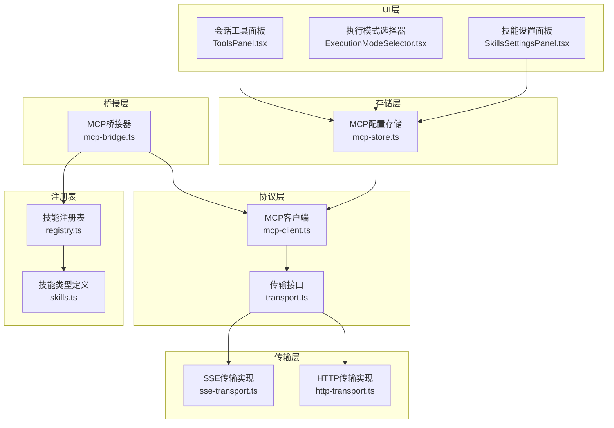
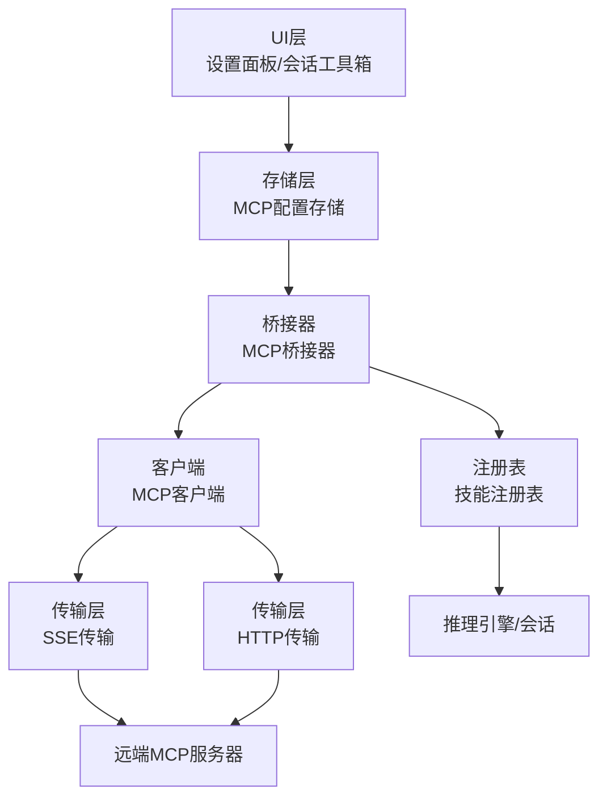
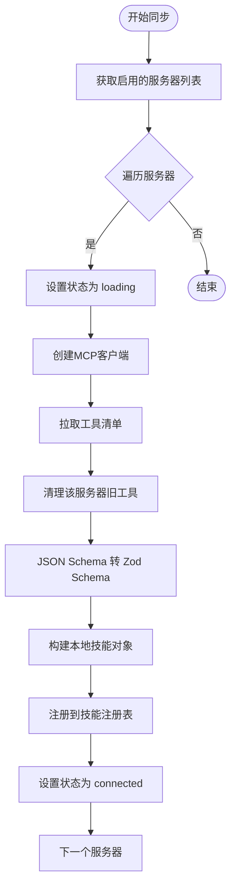
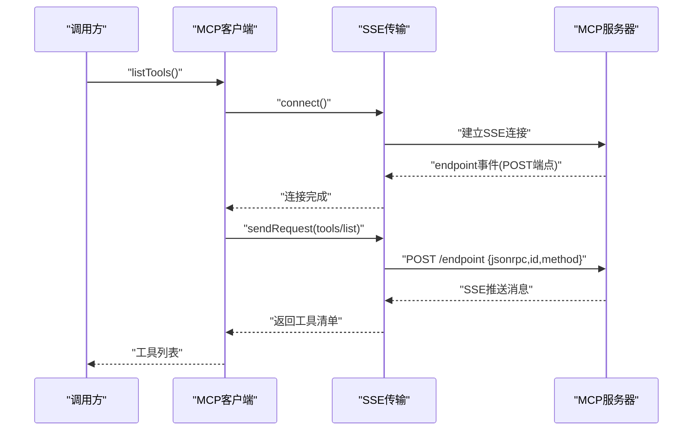
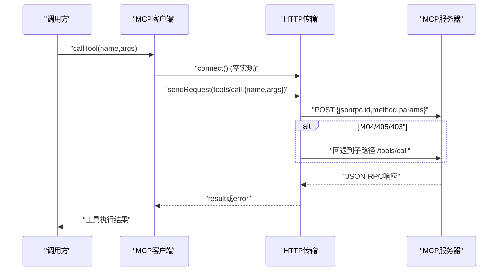
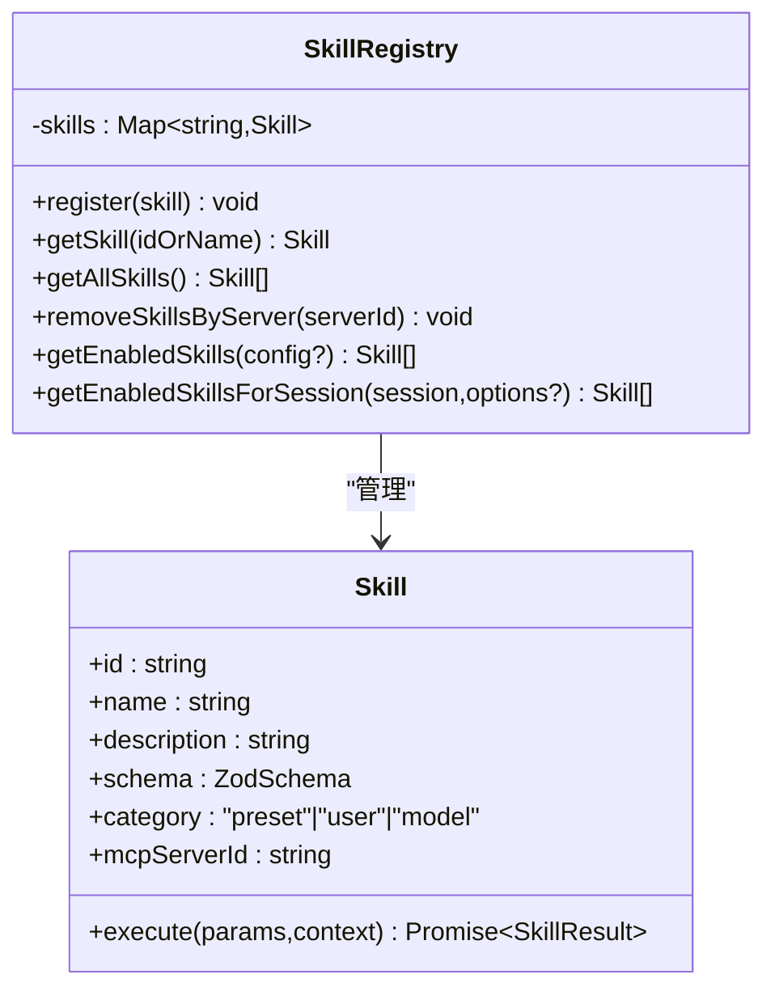
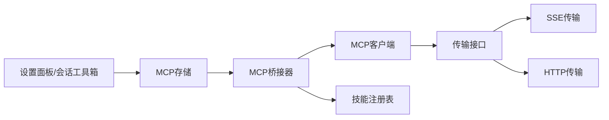

# MCP协议集成

<cite>
**本文引用的文件**
- [mcp-store.ts](file://src/store/mcp-store.ts)
- [mcp-client.ts](file://src/lib/mcp/mcp-client.ts)
- [mcp-bridge.ts](file://src/lib/mcp/mcp-bridge.ts)
- [transport.ts](file://src/lib/mcp/transport.ts)
- [sse-transport.ts](file://src/lib/mcp/transports/sse-transport.ts)
- [http-transport.ts](file://src/lib/mcp/transports/http-transport.ts)
- [registry.ts](file://src/lib/skills/registry.ts)
- [skills.ts](file://src/types/skills.ts)
- [SkillsSettingsPanel.tsx](file://src/components/settings/SkillsSettingsPanel.tsx)
- [ExecutionModeSelector.tsx](file://src/features/chat/components/ExecutionModeSelector.tsx)
- [ToolsPanel.tsx](file://src/features/chat/components/SessionSettingsSheet/ToolsPanel.tsx)
</cite>

## 目录
1. [简介](#简介)
2. [项目结构](#项目结构)
3. [核心组件](#核心组件)
4. [架构总览](#架构总览)
5. [详细组件分析](#详细组件分析)
6. [依赖关系分析](#依赖关系分析)
7. [性能考量](#性能考量)
8. [故障排查指南](#故障排查指南)
9. [结论](#结论)
10. [附录](#附录)

## 简介
本文件面向希望在Nexara中集成与使用MCP（Model Context Protocol）协议的开发者与运维人员。文档深入解析MCP服务器连接管理、工具同步机制、参数验证系统，对比SSE与HTTP两种传输层的实现差异与适用场景，并阐述外部工具如何被桥接到本地技能注册表，以及工具调用的完整流程。同时提供配置指南、调试方法、常见问题排查与性能优化建议，并给出实际集成案例与最佳实践。

## 项目结构
围绕MCP协议的关键代码位于以下模块：
- 存储层：MCP服务器配置持久化与状态管理
- 协议层：MCP客户端与传输抽象
- 传输层：SSE与HTTP两种传输实现
- 桥接层：将远端MCP工具同步至本地技能注册表
- 注册表：统一管理内置、用户与MCP工具
- UI层：设置面板与会话工具箱中对MCP服务器的可视化与控制



图表来源
- [mcp-store.ts:1-72](file://src/store/mcp-store.ts#L1-L72)
- [mcp-client.ts:1-52](file://src/lib/mcp/mcp-client.ts#L1-L52)
- [transport.ts:1-14](file://src/lib/mcp/transport.ts#L1-L14)
- [sse-transport.ts:1-205](file://src/lib/mcp/transports/sse-transport.ts#L1-L205)
- [http-transport.ts:1-158](file://src/lib/mcp/transports/http-transport.ts#L1-L158)
- [mcp-bridge.ts:1-202](file://src/lib/mcp/mcp-bridge.ts#L1-L202)
- [registry.ts:1-189](file://src/lib/skills/registry.ts#L1-L189)
- [skills.ts:1-74](file://src/types/skills.ts#L1-L74)
- [SkillsSettingsPanel.tsx:1-200](file://src/components/settings/SkillsSettingsPanel.tsx#L1-L200)
- [ExecutionModeSelector.tsx:271-303](file://src/features/chat/components/ExecutionModeSelector.tsx#L271-L303)
- [ToolsPanel.tsx:135-180](file://src/features/chat/components/SessionSettingsSheet/ToolsPanel.tsx#L135-L180)

章节来源
- [mcp-store.ts:1-72](file://src/store/mcp-store.ts#L1-L72)
- [mcp-client.ts:1-52](file://src/lib/mcp/mcp-client.ts#L1-L52)
- [transport.ts:1-14](file://src/lib/mcp/transport.ts#L1-L14)
- [sse-transport.ts:1-205](file://src/lib/mcp/transports/sse-transport.ts#L1-L205)
- [http-transport.ts:1-158](file://src/lib/mcp/transports/http-transport.ts#L1-L158)
- [mcp-bridge.ts:1-202](file://src/lib/mcp/mcp-bridge.ts#L1-L202)
- [registry.ts:1-189](file://src/lib/skills/registry.ts#L1-L189)
- [skills.ts:1-74](file://src/types/skills.ts#L1-L74)
- [SkillsSettingsPanel.tsx:1-200](file://src/components/settings/SkillsSettingsPanel.tsx#L1-L200)
- [ExecutionModeSelector.tsx:271-303](file://src/features/chat/components/ExecutionModeSelector.tsx#L271-L303)
- [ToolsPanel.tsx:135-180](file://src/features/chat/components/SessionSettingsSheet/ToolsPanel.tsx#L135-L180)

## 核心组件
- MCP配置存储：维护服务器列表、状态与错误信息，支持持久化与状态更新。
- MCP客户端：根据配置选择SSE或HTTP传输，封装连接、列出工具、调用工具与断开连接。
- 传输接口：统一抽象，确保SSE与HTTP实现一致的API契约。
- SSE传输：基于EventSource建立SSE流，监听endpoint事件以确定POST端点，通过fetch发送JSON-RPC请求并等待SSE推送响应。
- HTTP传输：无状态HTTP调用，支持路径拼接与回退策略，兼容多种服务端部署形态。
- MCP桥接器：拉取远端工具清单，转换为本地技能对象，注入参数Schema与执行逻辑，并注册到技能注册表；支持覆盖式同步与按服务器清理。
- 技能注册表：集中注册与管理内置、用户与MCP工具，提供按会话过滤与动态路由能力。
- UI交互：设置面板与会话工具箱用于添加/删除MCP服务器、切换启用状态、手动触发同步与查看错误信息。

章节来源
- [mcp-store.ts:6-30](file://src/store/mcp-store.ts#L6-L30)
- [mcp-client.ts:6-51](file://src/lib/mcp/mcp-client.ts#L6-L51)
- [transport.ts:2-13](file://src/lib/mcp/transport.ts#L2-L13)
- [sse-transport.ts:22-204](file://src/lib/mcp/transports/sse-transport.ts#L22-L204)
- [http-transport.ts:3-157](file://src/lib/mcp/transports/http-transport.ts#L3-L157)
- [mcp-bridge.ts:10-129](file://src/lib/mcp/mcp-bridge.ts#L10-L129)
- [registry.ts:8-186](file://src/lib/skills/registry.ts#L8-L186)
- [SkillsSettingsPanel.tsx:343-359](file://src/components/settings/SkillsSettingsPanel.tsx#L343-L359)
- [ExecutionModeSelector.tsx:271-303](file://src/features/chat/components/ExecutionModeSelector.tsx#L271-L303)
- [ToolsPanel.tsx:135-180](file://src/features/chat/components/SessionSettingsSheet/ToolsPanel.tsx#L135-L180)

## 架构总览
下图展示了MCP集成的整体架构：UI层发起配置与同步操作，存储层持久化配置，桥接器通过客户端访问远端MCP服务器，将工具映射为本地技能并注册到注册表，最终在会话中按策略启用。



图表来源
- [SkillsSettingsPanel.tsx:343-359](file://src/components/settings/SkillsSettingsPanel.tsx#L343-L359)
- [ExecutionModeSelector.tsx:271-303](file://src/features/chat/components/ExecutionModeSelector.tsx#L271-L303)
- [ToolsPanel.tsx:135-180](file://src/features/chat/components/SessionSettingsSheet/ToolsPanel.tsx#L135-L180)
- [mcp-store.ts:32-71](file://src/store/mcp-store.ts#L32-L71)
- [mcp-bridge.ts:14-37](file://src/lib/mcp/mcp-bridge.ts#L14-L37)
- [mcp-client.ts:10-21](file://src/lib/mcp/mcp-client.ts#L10-L21)
- [sse-transport.ts:34-88](file://src/lib/mcp/transports/sse-transport.ts#L34-L88)
- [http-transport.ts:40-48](file://src/lib/mcp/transports/http-transport.ts#L40-L48)
- [registry.ts:104-109](file://src/lib/skills/registry.ts#L104-L109)

## 详细组件分析

### MCP桥接器（McpBridge）
职责与流程
- 同步所有已启用的MCP服务器：遍历启用服务器，逐个执行同步。
- 同步单个服务器：设置加载状态，创建客户端，拉取工具清单，清理旧工具，转换为本地技能并注册，最后设置连接状态。
- 参数Schema转换：将远端JSON Schema递归转换为Zod Schema，支持字符串、枚举、数值、布尔、数组、对象等类型，保留描述信息。
- 执行逻辑：对每个工具生成execute函数，执行前进行参数强制转换（如对象转字符串），随后创建一次性客户端连接并调用工具，断开连接回收资源。

关键特性
- 覆盖式同步：每次同步前先移除该服务器的旧工具，避免残留。
- 通用参数强制转换：依据Schema对参数进行类型收敛，提升兼容性。
- 无状态执行：每次工具调用都建立新连接并在完成后断开，降低长连接复杂度。



图表来源
- [mcp-bridge.ts:14-37](file://src/lib/mcp/mcp-bridge.ts#L14-L37)
- [mcp-bridge.ts:42-129](file://src/lib/mcp/mcp-bridge.ts#L42-L129)
- [mcp-bridge.ts:135-200](file://src/lib/mcp/mcp-bridge.ts#L135-L200)

章节来源
- [mcp-bridge.ts:10-129](file://src/lib/mcp/mcp-bridge.ts#L10-L129)
- [mcp-bridge.ts:135-200](file://src/lib/mcp/mcp-bridge.ts#L135-L200)
- [registry.ts:104-109](file://src/lib/skills/registry.ts#L104-L109)

### MCP客户端（McpClient）
职责与流程
- 根据配置选择传输类型（默认HTTP以保证向后兼容）。
- 提供连接、列出工具、调用工具与断开连接的统一入口。
- 在调用工具前确保已连接，保证传输可用。

```mermaid
classDiagram
class McpClient {
-transport : McpTransport
-config : McpServerConfig | {url,type?}
+connect() Promise~void~
+listTools() Promise~McpTool[]~
+callTool(name,args) Promise~any~
+disconnect() Promise~void~
}
class McpTransport {
<<interface>>
+connect() Promise~void~
+disconnect() Promise~void~
+listTools() Promise~McpTool[]~
+callTool(name,args) Promise~any~
}
class SseTransport {
+connect() Promise~void~
+disconnect() Promise~void~
+listTools() Promise~McpTool[]~
+callTool(name,args) Promise~any~
}
class HttpTransport {
+connect() Promise~void~
+disconnect() Promise~void~
+listTools() Promise~McpTool[]~
+callTool(name,args) Promise~any~
}
McpClient --> McpTransport : "依赖"
SseTransport ..|> McpTransport
HttpTransport ..|> McpTransport
```

图表来源
- [mcp-client.ts:6-51](file://src/lib/mcp/mcp-client.ts#L6-L51)
- [transport.ts:8-13](file://src/lib/mcp/transport.ts#L8-L13)
- [sse-transport.ts:22-204](file://src/lib/mcp/transports/sse-transport.ts#L22-L204)
- [http-transport.ts:3-157](file://src/lib/mcp/transports/http-transport.ts#L3-L157)

章节来源
- [mcp-client.ts:6-51](file://src/lib/mcp/mcp-client.ts#L6-L51)
- [transport.ts:8-13](file://src/lib/mcp/transport.ts#L8-L13)

### SSE传输（SseTransport）
实现要点
- 使用EventSource建立SSE流，监听open、message、endpoint、error事件。
- endpoint事件作为握手完成信号，记录相对或绝对POST端点。
- 请求ID统一为数字，兼容部分服务端对字符串ID的限制。
- URL拼接时确保baseUrl路径被视为目录，避免丢失中间路径段。
- 发送请求通过fetch，响应通过SSE流推送，失败时拒绝并清理挂起请求。



图表来源
- [mcp-client.ts:26-36](file://src/lib/mcp/mcp-client.ts#L26-L36)
- [sse-transport.ts:34-88](file://src/lib/mcp/transports/sse-transport.ts#L34-L88)
- [sse-transport.ts:119-180](file://src/lib/mcp/transports/sse-transport.ts#L119-L180)

章节来源
- [sse-transport.ts:22-204](file://src/lib/mcp/transports/sse-transport.ts#L22-L204)

### HTTP传输（HttpTransport）
实现要点
- 无状态连接，适合短连接与无持久会话的服务端。
- 路径拼接采用鲁棒策略，兼容不同部署形态。
- 支持多级回退：主端点失败时尝试子路径回退（如/tools或/tools/call）。
- 请求ID统一为数字，提升兼容性。
- 错误处理包含HTTP状态码与JSON-RPC错误解析。



图表来源
- [mcp-client.ts:41-50](file://src/lib/mcp/mcp-client.ts#L41-L50)
- [http-transport.ts:90-143](file://src/lib/mcp/transports/http-transport.ts#L90-L143)
- [http-transport.ts:115-124](file://src/lib/mcp/transports/http-transport.ts#L115-L124)

章节来源
- [http-transport.ts:3-157](file://src/lib/mcp/transports/http-transport.ts#L3-L157)

### 技能注册表（SkillRegistry）
职责与能力
- 统一注册与检索技能，支持按ID与名称查找。
- 提供按会话过滤的能力：仅返回当前会话激活的MCP服务器工具与用户工具。
- 支持按服务器批量移除技能，配合桥接器的覆盖式同步。
- 为后续权限与路由控制预留扩展点。



图表来源
- [registry.ts:8-186](file://src/lib/skills/registry.ts#L8-L186)
- [skills.ts:8-24](file://src/types/skills.ts#L8-L24)

章节来源
- [registry.ts:104-172](file://src/lib/skills/registry.ts#L104-L172)
- [skills.ts:8-24](file://src/types/skills.ts#L8-L24)

### UI交互与会话控制
- 设置面板：提供添加/删除MCP服务器、手动触发同步、查看错误信息等操作入口。
- 执行模式选择器与会话工具面板：允许在会话中启用/禁用特定MCP服务器，实现按会话的工具路由。

章节来源
- [SkillsSettingsPanel.tsx:343-359](file://src/components/settings/SkillsSettingsPanel.tsx#L343-L359)
- [ExecutionModeSelector.tsx:271-303](file://src/features/chat/components/ExecutionModeSelector.tsx#L271-L303)
- [ToolsPanel.tsx:135-180](file://src/features/chat/components/SessionSettingsSheet/ToolsPanel.tsx#L135-L180)

## 依赖关系分析
- 组件耦合
  - McpBridge依赖McpClient与SkillRegistry，承担“远端工具→本地技能”的转换与注册职责。
  - McpClient依赖McpTransport接口，具体实现由SSE或HTTP提供。
  - UI层通过设置面板与会话工具箱驱动存储层与桥接器。
- 外部依赖
  - SSE传输依赖react-native-sse库。
  - 技能Schema验证依赖zod。
- 循环依赖
  - 未发现循环依赖；桥接器与注册表通过接口解耦。



图表来源
- [mcp-client.ts:1-5](file://src/lib/mcp/mcp-client.ts#L1-L5)
- [mcp-bridge.ts:1-3](file://src/lib/mcp/mcp-bridge.ts#L1-L3)
- [registry.ts:1-2](file://src/lib/skills/registry.ts#L1-L2)
- [SkillsSettingsPanel.tsx:17-18](file://src/components/settings/SkillsSettingsPanel.tsx#L17-L18)

章节来源
- [mcp-client.ts:1-5](file://src/lib/mcp/mcp-client.ts#L1-L5)
- [mcp-bridge.ts:1-3](file://src/lib/mcp/mcp-bridge.ts#L1-L3)
- [registry.ts:1-2](file://src/lib/skills/registry.ts#L1-L2)

## 性能考量
- 连接策略
  - SSE：适合需要实时推送与长连接的场景，但需注意连接稳定性与重连策略。
  - HTTP：适合无状态、短连接调用，兼容性更好，适合频繁调用与低延迟场景。
- 资源管理
  - 工具调用采用一次性连接，避免长连接占用资源；SSE断开时拒绝挂起请求，防止内存泄漏。
- 参数处理
  - Schema驱动的参数强制转换减少无效调用与服务端错误，提高成功率。
- 同步策略
  - 覆盖式同步避免工具冗余，减少注册表规模与查询成本。

## 故障排查指南
- 连接失败
  - 检查服务器URL与传输类型是否匹配；SSE需确认endpoint事件是否正确下发。
  - 查看存储层状态与错误信息，必要时重新连接或切换到HTTP。
- 工具调用失败
  - 查看HTTP回退路径是否生效（如404/405/403时的子路径回退）。
  - 检查参数Schema与实际传参类型是否一致，必要时启用参数强制转换。
- 同步异常
  - 手动触发同步，观察日志输出；若存在旧工具残留，确认桥接器是否执行了按服务器清理。
- UI显示异常
  - 确认会话工具箱中对应MCP服务器是否处于启用状态；检查会话过滤逻辑是否正确。

章节来源
- [mcp-store.ts:13-18](file://src/store/mcp-store.ts#L13-L18)
- [sse-transport.ts:70-78](file://src/lib/mcp/transports/sse-transport.ts#L70-L78)
- [http-transport.ts:115-124](file://src/lib/mcp/transports/http-transport.ts#L115-L124)
- [mcp-bridge.ts:119-128](file://src/lib/mcp/mcp-bridge.ts#L119-L128)
- [SkillsSettingsPanel.tsx:355-359](file://src/components/settings/SkillsSettingsPanel.tsx#L355-L359)

## 结论
Nexara的MCP集成通过清晰的分层设计实现了从配置管理、传输适配、工具同步到技能注册的全链路闭环。SSE与HTTP两种传输满足不同部署形态与性能需求；桥接器将远端工具无缝转化为本地可执行技能，并通过Schema驱动的参数校验与强制转换提升了稳定性。结合UI层的可视化控制与会话级路由，开发者可以灵活地在不同场景中启用或禁用MCP工具，实现安全、可控且高效的工具调用体验。

## 附录

### 配置指南
- 添加MCP服务器
  - 在设置面板中输入服务器名称、URL与传输类型（http或sse），点击保存。
  - SSE类型适用于支持SSE流与endpoint事件的MCP服务器；HTTP类型适用于标准JSON-RPC端点。
- 启用/禁用服务器
  - 在会话工具箱中切换对应服务器的启用状态，仅启用的服务器工具才会出现在会话中。
- 手动同步
  - 在设置面板中点击刷新按钮，触发一次性的工具同步流程。

章节来源
- [SkillsSettingsPanel.tsx:343-359](file://src/components/settings/SkillsSettingsPanel.tsx#L343-L359)
- [ExecutionModeSelector.tsx:271-303](file://src/features/chat/components/ExecutionModeSelector.tsx#L271-L303)
- [ToolsPanel.tsx:135-180](file://src/features/chat/components/SessionSettingsSheet/ToolsPanel.tsx#L135-L180)

### 调试方法
- 日志定位
  - SSE传输与HTTP传输均在关键步骤打印请求与响应日志，便于定位参数结构与服务端行为。
  - 桥接器在同步开始、结束与异常时输出详细日志。
- 错误信息
  - 存储层维护每个服务器的状态与错误信息，可在设置面板中查看。
- 参数校验
  - 若工具调用失败，优先检查Schema与传参类型，必要时启用参数强制转换。

章节来源
- [sse-transport.ts:152-155](file://src/lib/mcp/transports/sse-transport.ts#L152-L155)
- [http-transport.ts:104-107](file://src/lib/mcp/transports/http-transport.ts#L104-L107)
- [mcp-bridge.ts:119-128](file://src/lib/mcp/mcp-bridge.ts#L119-L128)
- [mcp-store.ts:13-18](file://src/store/mcp-store.ts#L13-L18)

### 实际集成案例与最佳实践
- 案例一：接入金融数据MCP服务器
  - 服务器提供股票查询、财务指标等工具；通过桥接器同步后，工具在会话中以本地技能形式出现，参数按Schema自动校验与转换。
  - 最佳实践：为高风险工具（如交易类）设置高风险标记，在执行前增加审批流程。
- 案例二：多服务器协同
  - 同时启用多个MCP服务器，按会话维度分别启用不同的服务器，实现细粒度的工具路由。
  - 最佳实践：为每个服务器设置明确的描述与分类，便于用户识别与管理。
- 案例三：混合部署
  - 部分工具通过SSE传输，另一部分通过HTTP传输；根据工具特性与网络环境选择最优方案。
  - 最佳实践：优先使用HTTP以获得更好的兼容性，仅在需要实时推送时启用SSE。

章节来源
- [mcp-bridge.ts:64-114](file://src/lib/mcp/mcp-bridge.ts#L64-L114)
- [registry.ts:126-172](file://src/lib/skills/registry.ts#L126-L172)
- [ExecutionModeSelector.tsx:271-303](file://src/features/chat/components/ExecutionModeSelector.tsx#L271-L303)