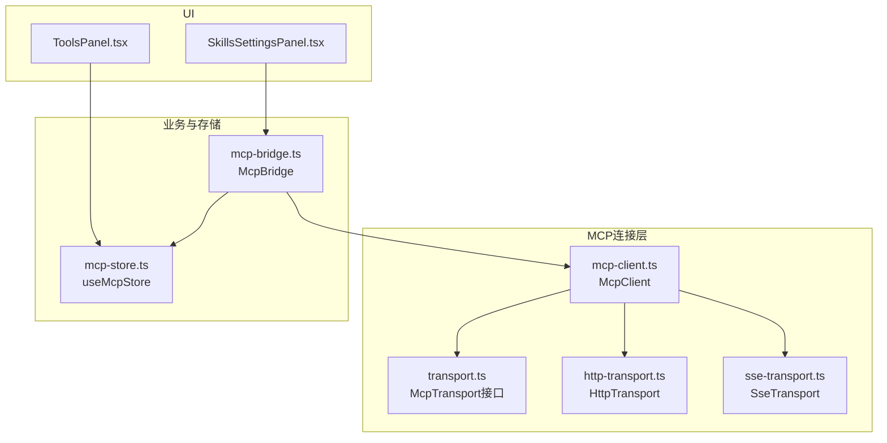
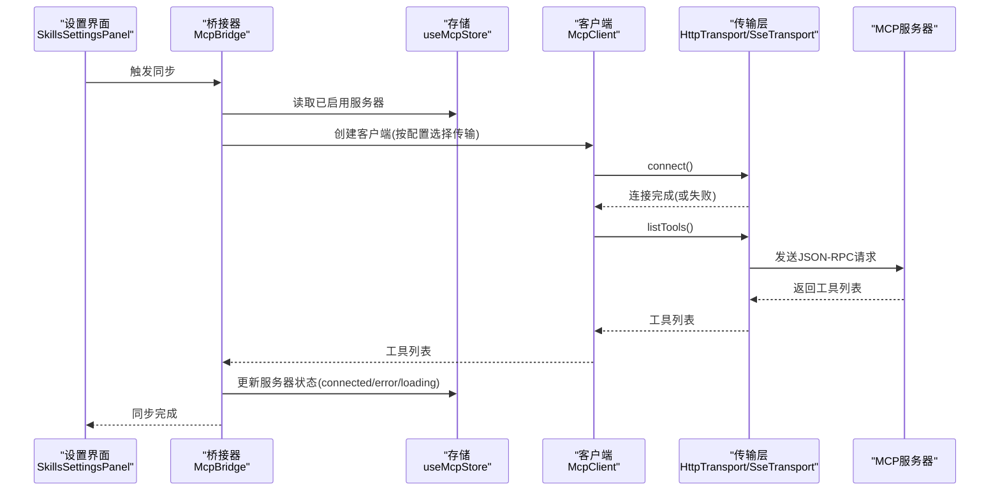
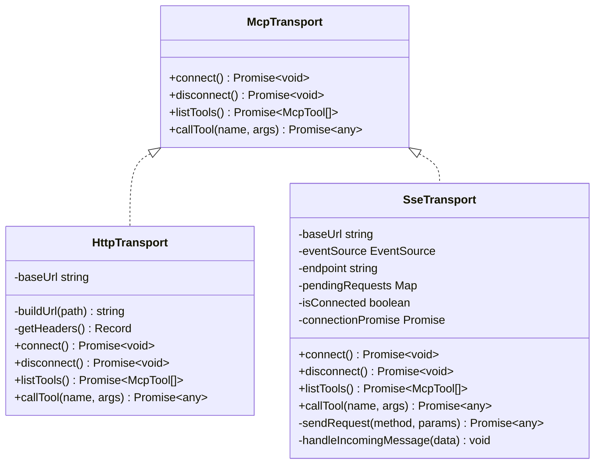
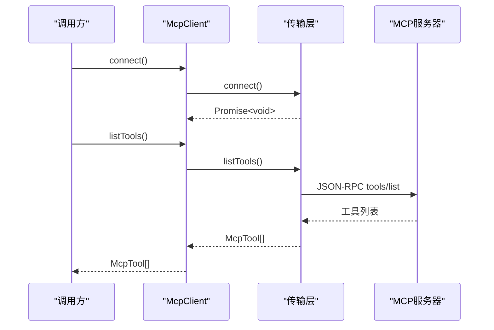
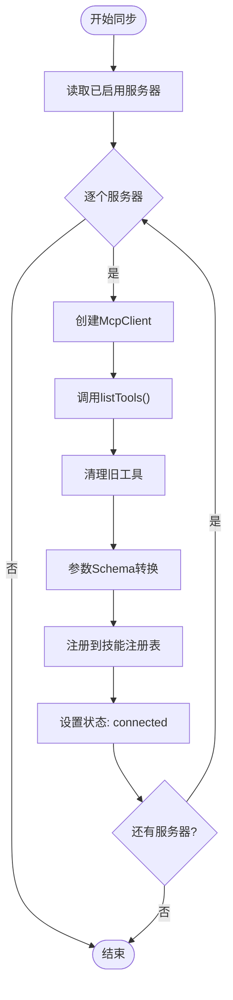
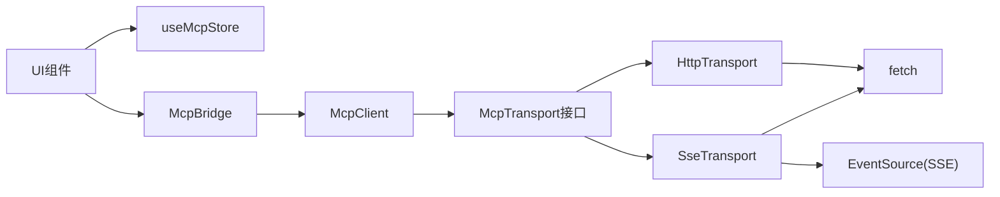

# MCP服务器连接管理

<cite>
**本文档引用的文件**
- [src/lib/mcp/transport.ts](file://src/lib/mcp/transport.ts)
- [src/lib/mcp/mcp-client.ts](file://src/lib/mcp/mcp-client.ts)
- [src/lib/mcp/transports/http-transport.ts](file://src/lib/mcp/transports/http-transport.ts)
- [src/lib/mcp/transports/sse-transport.ts](file://src/lib/mcp/transports/sse-transport.ts)
- [src/lib/mcp/mcp-bridge.ts](file://src/lib/mcp/mcp-bridge.ts)
- [src/store/mcp-store.ts](file://src/store/mcp-store.ts)
- [src/components/settings/SkillsSettingsPanel.tsx](file://src/components/settings/SkillsSettingsPanel.tsx)
- [src/features/chat/components/SessionSettingsSheet/ToolsPanel.tsx](file://src/features/chat/components/SessionSettingsSheet/ToolsPanel.tsx)
</cite>

## 目录
1. [简介](#简介)
2. [项目结构](#项目结构)
3. [核心组件](#核心组件)
4. [架构总览](#架构总览)
5. [详细组件分析](#详细组件分析)
6. [依赖关系分析](#依赖关系分析)
7. [性能考量](#性能考量)
8. [故障排查指南](#故障排查指南)
9. [结论](#结论)
10. [附录](#附录)

## 简介
本文件系统性阐述MCP（Model Context Protocol）服务器连接管理的技术实现，覆盖客户端初始化、连接建立与维护、传输层差异（SSE与HTTP）、连接状态管理、重连与超时策略、服务器配置验证、认证与安全连接、故障排查与性能优化，以及实际连接配置示例与调试方法。目标读者包括需要集成MCP工具链的开发者与运维人员。

## 项目结构
围绕MCP连接管理的核心代码位于src/lib/mcp目录，采用“接口抽象 + 多实现”的分层设计：
- transport.ts：定义MCP传输层统一接口
- mcp-client.ts：封装具体传输实例，对外提供统一API
- transports/http-transport.ts：基于HTTP的无状态传输实现
- transports/sse-transport.ts：基于SSE的有状态双向流传输实现
- mcp-bridge.ts：桥接器，负责从服务器同步工具并注入本地技能注册表
- store/mcp-store.ts：MCP服务器配置与状态持久化存储
- UI侧组件：用于展示与操作MCP服务器配置与状态

图表来源
- [src/lib/mcp/transport.ts:1-14](file://src/lib/mcp/transport.ts#L1-L14)
- [src/lib/mcp/mcp-client.ts:1-51](file://src/lib/mcp/mcp-client.ts#L1-L51)
- [src/lib/mcp/transports/http-transport.ts:1-158](file://src/lib/mcp/transports/http-transport.ts#L1-L158)
- [src/lib/mcp/transports/sse-transport.ts:1-205](file://src/lib/mcp/transports/sse-transport.ts#L1-L205)
- [src/lib/mcp/mcp-bridge.ts:1-202](file://src/lib/mcp/mcp-bridge.ts#L1-L202)
- [src/store/mcp-store.ts:1-72](file://src/store/mcp-store.ts#L1-L72)
- [src/components/settings/SkillsSettingsPanel.tsx:343-359](file://src/components/settings/SkillsSettingsPanel.tsx#L343-L359)
- [src/features/chat/components/SessionSettingsSheet/ToolsPanel.tsx:135-180](file://src/features/chat/components/SessionSettingsSheet/ToolsPanel.tsx#L135-L180)

章节来源
- [src/lib/mcp/transport.ts:1-14](file://src/lib/mcp/transport.ts#L1-L14)
- [src/lib/mcp/mcp-client.ts:1-51](file://src/lib/mcp/mcp-client.ts#L1-L51)
- [src/lib/mcp/transports/http-transport.ts:1-158](file://src/lib/mcp/transports/http-transport.ts#L1-L158)
- [src/lib/mcp/transports/sse-transport.ts:1-205](file://src/lib/mcp/transports/sse-transport.ts#L1-L205)
- [src/lib/mcp/mcp-bridge.ts:1-202](file://src/lib/mcp/mcp-bridge.ts#L1-L202)
- [src/store/mcp-store.ts:1-72](file://src/store/mcp-store.ts#L1-L72)
- [src/components/settings/SkillsSettingsPanel.tsx:343-359](file://src/components/settings/SkillsSettingsPanel.tsx#L343-L359)
- [src/features/chat/components/SessionSettingsSheet/ToolsPanel.tsx:135-180](file://src/features/chat/components/SessionSettingsSheet/ToolsPanel.tsx#L135-L180)

## 核心组件
- 传输接口：McpTransport定义了connect、disconnect、listTools、callTool四个核心方法，确保HTTP与SSE两种实现具备一致的对外行为。
- 客户端封装：McpClient根据配置选择具体传输实例，提供统一的连接、工具列表获取与工具调用能力。
- HTTP传输：无状态实现，适合一次性工具调用；内置URL拼接与回退路径兼容。
- SSE传输：有状态实现，通过SSE接收endpoint事件后建立双向通信，支持请求-响应匹配与断线重发。
- 桥接器：McpBridge负责扫描已启用服务器，逐一同步工具并注入本地技能注册表，同时更新UI状态。
- 存储：useMcpStore持久化服务器配置、状态与错误信息，支持UI展示与交互。

章节来源
- [src/lib/mcp/transport.ts:1-14](file://src/lib/mcp/transport.ts#L1-L14)
- [src/lib/mcp/mcp-client.ts:1-51](file://src/lib/mcp/mcp-client.ts#L1-L51)
- [src/lib/mcp/transports/http-transport.ts:1-158](file://src/lib/mcp/transports/http-transport.ts#L1-L158)
- [src/lib/mcp/transports/sse-transport.ts:1-205](file://src/lib/mcp/transports/sse-transport.ts#L1-L205)
- [src/lib/mcp/mcp-bridge.ts:1-202](file://src/lib/mcp/mcp-bridge.ts#L1-L202)
- [src/store/mcp-store.ts:1-72](file://src/store/mcp-store.ts#L1-L72)

## 架构总览
下图展示了MCP连接管理的整体架构与数据流：

图表来源
- [src/lib/mcp/mcp-bridge.ts:14-129](file://src/lib/mcp/mcp-bridge.ts#L14-L129)
- [src/lib/mcp/mcp-client.ts:26-36](file://src/lib/mcp/mcp-client.ts#L26-L36)
- [src/lib/mcp/transports/http-transport.ts:50-88](file://src/lib/mcp/transports/http-transport.ts#L50-L88)
- [src/lib/mcp/transports/sse-transport.ts:34-88](file://src/lib/mcp/transports/sse-transport.ts#L34-L88)
- [src/store/mcp-store.ts:53-64](file://src/store/mcp-store.ts#L53-L64)

## 详细组件分析

### 传输层接口与实现
- 接口职责：统一connect/ disconnect/listTools/callTool语义，屏蔽HTTP与SSE差异。
- HTTP传输要点：
  - 无状态连接，每次调用均建立网络请求。
  - 智能URL拼接与回退路径兼容（如/tools与/tools/call）。
  - 请求头包含User-Agent与Accept多类型以适配不同服务端。
- SSE传输要点：
  - 通过SSE建立长连接，等待服务器发送endpoint事件作为握手完成信号。
  - 使用Map维护请求ID与回调，确保响应与请求一一对应。
  - endpoint为相对路径时，按目录语义拼接，避免URL解析丢失路径段。

图表来源
- [src/lib/mcp/transport.ts:1-14](file://src/lib/mcp/transport.ts#L1-L14)
- [src/lib/mcp/transports/http-transport.ts:1-158](file://src/lib/mcp/transports/http-transport.ts#L1-L158)
- [src/lib/mcp/transports/sse-transport.ts:1-205](file://src/lib/mcp/transports/sse-transport.ts#L1-L205)

章节来源
- [src/lib/mcp/transport.ts:1-14](file://src/lib/mcp/transport.ts#L1-L14)
- [src/lib/mcp/transports/http-transport.ts:1-158](file://src/lib/mcp/transports/http-transport.ts#L1-L158)
- [src/lib/mcp/transports/sse-transport.ts:1-205](file://src/lib/mcp/transports/sse-transport.ts#L1-L205)

### 客户端封装与初始化流程
- 初始化：根据配置中的type选择SSE或HTTP传输实例，默认向后兼容HTTP。
- 连接：显式调用connect确保传输就绪。
- 工具同步：listTools内部先保证连接，再调用传输层获取工具列表。
- 工具调用：callTool委托传输层执行，SSE通过endpoint指向的POST端点提交请求。

图表来源
- [src/lib/mcp/mcp-client.ts:26-36](file://src/lib/mcp/mcp-client.ts#L26-L36)
- [src/lib/mcp/transports/http-transport.ts:50-88](file://src/lib/mcp/transports/http-transport.ts#L50-L88)
- [src/lib/mcp/transports/sse-transport.ts:182-185](file://src/lib/mcp/transports/sse-transport.ts#L182-L185)

章节来源
- [src/lib/mcp/mcp-client.ts:1-51](file://src/lib/mcp/mcp-client.ts#L1-L51)

### 桥接器与工具同步
- 同步策略：遍历已启用服务器，逐一创建客户端并调用listTools，清理旧工具后注入新工具。
- 参数校验与强制转换：基于工具输入Schema进行字段类型强制转换（如object转string），提升调用成功率。
- 执行模式：对简单原子调用采用即时连接-执行-断开的无状态模式，避免SSE连接复用带来的复杂性。
- 状态管理：同步开始置loading，成功置connected，失败置error并记录错误信息。

图表来源
- [src/lib/mcp/mcp-bridge.ts:14-129](file://src/lib/mcp/mcp-bridge.ts#L14-L129)

章节来源
- [src/lib/mcp/mcp-bridge.ts:1-202](file://src/lib/mcp/mcp-bridge.ts#L1-L202)

### 连接状态管理与UI反馈
- 状态字段：disconnected、loading、connected、error，配合error消息辅助定位问题。
- UI展示：设置面板与会话工具面板展示服务器状态与URL，错误时高亮显示。
- 自动清理：当服务器被禁用或不存在时，桥接器会清理对应工具。

章节来源
- [src/store/mcp-store.ts:6-18](file://src/store/mcp-store.ts#L6-L18)
- [src/store/mcp-store.ts:53-64](file://src/store/mcp-store.ts#L53-L64)
- [src/components/settings/SkillsSettingsPanel.tsx:343-359](file://src/components/settings/SkillsSettingsPanel.tsx#L343-L359)
- [src/features/chat/components/SessionSettingsSheet/ToolsPanel.tsx:135-180](file://src/features/chat/components/SessionSettingsSheet/ToolsPanel.tsx#L135-L180)

### 传输层差异与适用场景
- HTTP传输
  - 优点：无状态、实现简单、兼容性强；适合一次性工具调用与低频交互。
  - 限制：无法接收服务器主动推送的消息；需要为每次调用建立连接。
- SSE传输
  - 优点：长连接、可接收服务器推送、握手完成后可稳定通信。
  - 限制：需要服务器支持SSE与endpoint事件；需维护请求ID映射与断线处理。
- 选择建议
  - 新建服务器优先选择SSE（type=sse），以获得更好的实时性与稳定性。
  - 迁移或兼容旧服务器可保留HTTP（type=http），但建议逐步迁移至SSE。

章节来源
- [src/lib/mcp/mcp-client.ts:10-21](file://src/lib/mcp/mcp-client.ts#L10-L21)
- [src/store/mcp-store.ts:6-18](file://src/store/mcp-store.ts#L6-L18)

### 认证与安全连接
- 认证机制：当前实现未内置特定认证头或令牌注入逻辑，通常通过服务器端鉴权与HTTPS保障安全。
- 安全建议：
  - 强制使用HTTPS，避免明文传输。
  - 在服务器端配置访问控制与速率限制。
  - 如需携带凭据，可在服务器端通过中间件或网关统一处理。

章节来源
- [src/lib/mcp/transports/http-transport.ts:32-38](file://src/lib/mcp/transports/http-transport.ts#L32-L38)
- [src/lib/mcp/transports/sse-transport.ts:42](file://src/lib/mcp/transports/sse-transport.ts#L42-L42)

## 依赖关系分析
- 组件耦合
  - McpClient依赖McpTransport接口，通过构造函数注入具体实现，降低耦合度。
  - McpBridge依赖McpClient与useMcpStore，承担业务编排与状态更新。
  - UI组件依赖useMcpStore进行展示与交互。
- 外部依赖
  - SSE库：用于SSE连接与事件监听。
  - fetch：用于HTTP请求与SSE触发的POST请求。
  - Zustand：用于状态持久化与跨组件共享。

图表来源
- [src/lib/mcp/mcp-client.ts:1-51](file://src/lib/mcp/mcp-client.ts#L1-L51)
- [src/lib/mcp/transports/http-transport.ts:1-158](file://src/lib/mcp/transports/http-transport.ts#L1-L158)
- [src/lib/mcp/transports/sse-transport.ts:1-205](file://src/lib/mcp/transports/sse-transport.ts#L1-L205)
- [src/lib/mcp/mcp-bridge.ts:1-202](file://src/lib/mcp/mcp-bridge.ts#L1-L202)
- [src/store/mcp-store.ts:1-72](file://src/store/mcp-store.ts#L1-L72)

章节来源
- [src/lib/mcp/mcp-client.ts:1-51](file://src/lib/mcp/mcp-client.ts#L1-L51)
- [src/lib/mcp/mcp-bridge.ts:1-202](file://src/lib/mcp/mcp-bridge.ts#L1-L202)
- [src/store/mcp-store.ts:1-72](file://src/store/mcp-store.ts#L1-L72)

## 性能考量
- 连接模式选择
  - SSE适合高频交互与实时推送场景；HTTP适合低频调用，减少长连接资源占用。
- 请求批量化
  - 对于频繁调用的工具，可考虑在应用层合并请求或引入本地缓存，减少网络往返。
- URL构建与回退
  - HTTP传输内置回退路径兼容，避免因路径不一致导致的重复请求。
- 日志与调试
  - 传输层打印请求体与响应体，便于快速定位参数与服务端错误。

章节来源
- [src/lib/mcp/transports/http-transport.ts:67-78](file://src/lib/mcp/transports/http-transport.ts#L67-L78)
- [src/lib/mcp/transports/http-transport.ts:104-106](file://src/lib/mcp/transports/http-transport.ts#L104-L106)
- [src/lib/mcp/transports/sse-transport.ts:152-154](file://src/lib/mcp/transports/sse-transport.ts#L152-L154)

## 故障排查指南
- 常见症状与定位
  - 状态为error且显示错误信息：检查服务器URL、网络连通性与服务端状态。
  - 状态长期为loading：确认服务器是否正确发送endpoint事件（SSE）。
  - 工具列表为空：检查服务器是否实现tools/list方法及返回格式。
- 调试步骤
  - 查看UI错误提示与状态栏颜色。
  - 在传输层日志中核对请求体与响应体，确认JSON-RPC方法与参数。
  - 对HTTP传输尝试回退路径（/tools与/tools/call）以排除路径问题。
- 重连与超时
  - SSE传输在连接失败时会断开并拒绝待处理请求；建议在上层触发重试。
  - HTTP传输无内置重试，可在调用侧增加指数退避重试逻辑。

章节来源
- [src/components/settings/SkillsSettingsPanel.tsx:355-359](file://src/components/settings/SkillsSettingsPanel.tsx#L355-L359)
- [src/lib/mcp/transports/http-transport.ts:118-124](file://src/lib/mcp/transports/http-transport.ts#L118-L124)
- [src/lib/mcp/transports/sse-transport.ts:70-78](file://src/lib/mcp/transports/sse-transport.ts#L70-L78)

## 结论
本实现通过清晰的接口抽象与双传输层支持，兼顾了易用性与扩展性。SSE提供更稳健的长连接能力，HTTP满足轻量级调用需求。结合桥接器的状态管理与UI反馈，能够有效支撑MCP工具链的集成与运维。建议在生产环境中优先采用SSE并强化HTTPS与鉴权策略，同时在调用侧完善重试与监控机制。

## 附录

### 连接配置示例
- HTTP配置（向后兼容）
  - type: "http"
  - url: "https://your-mcp-server.example.com/tools"
- SSE配置（推荐）
  - type: "sse"
  - url: "https://your-mcp-server.example.com/mcp/events"

章节来源
- [src/store/mcp-store.ts:6-18](file://src/store/mcp-store.ts#L6-L18)
- [src/lib/mcp/mcp-client.ts:10-21](file://src/lib/mcp/mcp-client.ts#L10-L21)

### 调试方法
- 启用详细日志：观察传输层打印的请求体与响应体，定位参数与服务端错误。
- 分别测试SSE与HTTP路径：确认服务器对不同端点的支持情况。
- 使用UI面板手动触发同步：验证状态切换与错误提示。

章节来源
- [src/lib/mcp/transports/http-transport.ts:104-106](file://src/lib/mcp/transports/http-transport.ts#L104-L106)
- [src/lib/mcp/transports/sse-transport.ts:152-154](file://src/lib/mcp/transports/sse-transport.ts#L152-L154)
- [src/components/settings/SkillsSettingsPanel.tsx:346-348](file://src/components/settings/SkillsSettingsPanel.tsx#L346-L348)