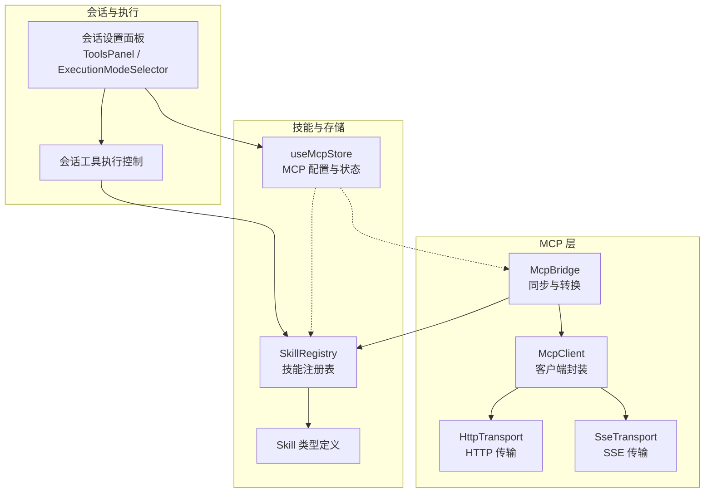
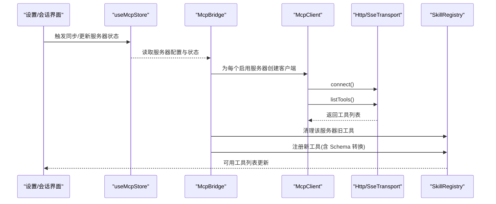
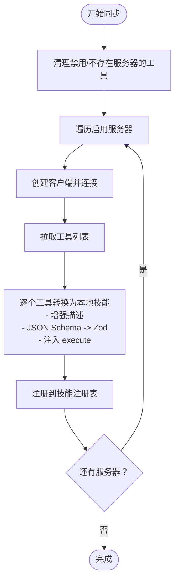
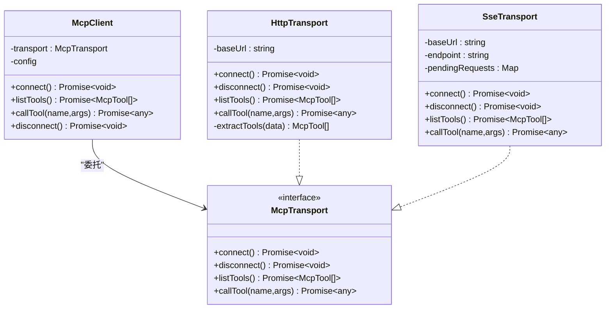
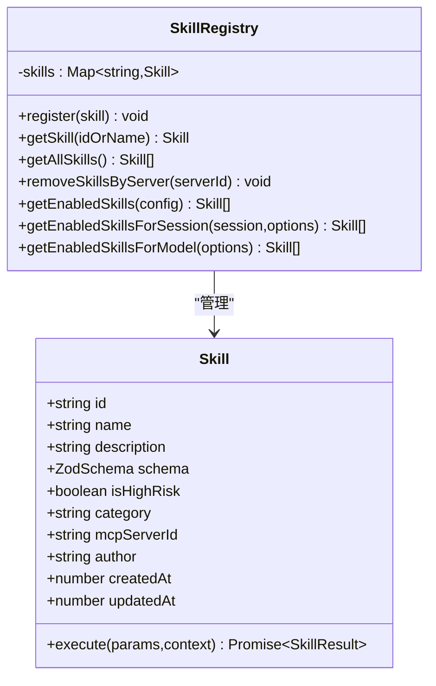
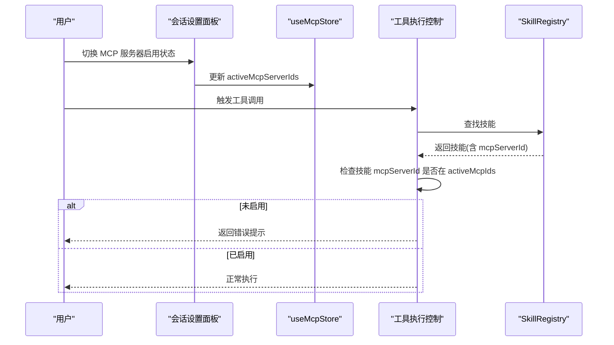
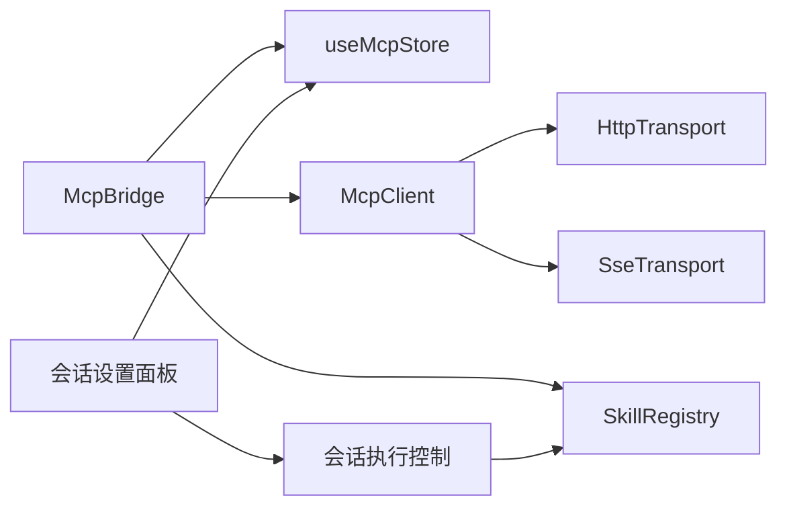

# 工具同步与注册机制

<cite>
**本文引用的文件**
- [src/lib/mcp/mcp-bridge.ts](file://src/lib/mcp/mcp-bridge.ts)
- [src/lib/mcp/mcp-client.ts](file://src/lib/mcp/mcp-client.ts)
- [src/lib/mcp/transport.ts](file://src/lib/mcp/transport.ts)
- [src/lib/mcp/transports/http-transport.ts](file://src/lib/mcp/transports/http-transport.ts)
- [src/lib/mcp/transports/sse-transport.ts](file://src/lib/mcp/transports/sse-transport.ts)
- [src/store/mcp-store.ts](file://src/store/mcp-store.ts)
- [src/lib/skills/registry.ts](file://src/lib/skills/registry.ts)
- [src/types/skills.ts](file://src/types/skills.ts)
- [src/store/chat/tool-execution.ts](file://src/store/chat/tool-execution.ts)
- [src/features/chat/components/ExecutionModeSelector.tsx](file://src/features/chat/components/ExecutionModeSelector.tsx)
- [src/features/chat/components/SessionSettingsSheet/ToolsPanel.tsx](file://src/features/chat/components/SessionSettingsSheet/ToolsPanel.tsx)
</cite>

## 目录
1. [引言](#引言)
2. [项目结构](#项目结构)
3. [核心组件](#核心组件)
4. [架构总览](#架构总览)
5. [详细组件分析](#详细组件分析)
6. [依赖关系分析](#依赖关系分析)
7. [性能考量](#性能考量)
8. [故障诊断指南](#故障诊断指南)
9. [结论](#结论)
10. [附录](#附录)

## 引言
本文件系统性阐述 Nexara 中 MCP 工具的发现、同步与注册机制，覆盖以下关键主题：
- 工具列表获取与元数据解析
- 本地技能对象转换与 Schema 驱动的参数强制转换
- 工具注册到技能注册表的流程与冲突处理策略
- 同步失败的诊断方法与解决方案
- 最佳实践与性能优化建议

## 项目结构
围绕 MCP 工具同步与注册的关键模块如下：
- MCP 客户端与传输层：抽象传输接口，分别实现 HTTP 与 SSE 两种传输方式
- MCP 桥接器：负责扫描服务器、拉取工具、转换为本地技能并注册
- 技能注册表：统一管理内置、用户自定义与 MCP 工具技能
- 存储与状态：持久化 MCP 服务器配置与状态
- 会话与执行：在会话维度控制 MCP 工具的启用与调用拦截

图表来源
- [src/lib/mcp/mcp-bridge.ts:1-202](file://src/lib/mcp/mcp-bridge.ts#L1-L202)
- [src/lib/mcp/mcp-client.ts:1-52](file://src/lib/mcp/mcp-client.ts#L1-L52)
- [src/lib/mcp/transports/http-transport.ts:1-158](file://src/lib/mcp/transports/http-transport.ts#L1-L158)
- [src/lib/mcp/transports/sse-transport.ts:1-205](file://src/lib/mcp/transports/sse-transport.ts#L1-L205)
- [src/lib/skills/registry.ts:1-189](file://src/lib/skills/registry.ts#L1-L189)
- [src/store/mcp-store.ts:1-72](file://src/store/mcp-store.ts#L1-L72)
- [src/types/skills.ts:1-74](file://src/types/skills.ts#L1-L74)
- [src/store/chat/tool-execution.ts:153-176](file://src/store/chat/tool-execution.ts#L153-L176)
- [src/features/chat/components/SessionSettingsSheet/ToolsPanel.tsx:35-180](file://src/features/chat/components/SessionSettingsSheet/ToolsPanel.tsx#L35-L180)
- [src/features/chat/components/ExecutionModeSelector.tsx:271-303](file://src/features/chat/components/ExecutionModeSelector.tsx#L271-L303)

章节来源
- [src/lib/mcp/mcp-bridge.ts:1-202](file://src/lib/mcp/mcp-bridge.ts#L1-L202)
- [src/lib/mcp/mcp-client.ts:1-52](file://src/lib/mcp/mcp-client.ts#L1-L52)
- [src/lib/mcp/transports/http-transport.ts:1-158](file://src/lib/mcp/transports/http-transport.ts#L1-L158)
- [src/lib/mcp/transports/sse-transport.ts:1-205](file://src/lib/mcp/transports/sse-transport.ts#L1-L205)
- [src/lib/skills/registry.ts:1-189](file://src/lib/skills/registry.ts#L1-L189)
- [src/store/mcp-store.ts:1-72](file://src/store/mcp-store.ts#L1-L72)
- [src/types/skills.ts:1-74](file://src/types/skills.ts#L1-L74)
- [src/store/chat/tool-execution.ts:153-176](file://src/store/chat/tool-execution.ts#L153-L176)
- [src/features/chat/components/SessionSettingsSheet/ToolsPanel.tsx:35-180](file://src/features/chat/components/SessionSettingsSheet/ToolsPanel.tsx#L35-L180)
- [src/features/chat/components/ExecutionModeSelector.tsx:271-303](file://src/features/chat/components/ExecutionModeSelector.tsx#L271-L303)

## 核心组件
- McpBridge：同步入口，负责清理过期工具、按服务器拉取工具、转换为本地技能并注册；提供 JSON Schema 到 Zod 的转换器与参数强制转换能力。
- McpClient：对上层屏蔽传输细节，根据配置选择 HTTP 或 SSE 传输。
- HttpTransport/SseTransport：实现 JSON-RPC over HTTP 与 JSON-RPC over SSE 的具体协议交互。
- SkillRegistry：统一注册与检索技能，支持按会话维度过滤与动态路由。
- useMcpStore：持久化 MCP 服务器配置、状态与 UI 辅助操作。
- 类型系统：Skill 接口定义参数 Schema、执行上下文与结果格式。

章节来源
- [src/lib/mcp/mcp-bridge.ts:1-202](file://src/lib/mcp/mcp-bridge.ts#L1-L202)
- [src/lib/mcp/mcp-client.ts:1-52](file://src/lib/mcp/mcp-client.ts#L1-L52)
- [src/lib/mcp/transports/http-transport.ts:1-158](file://src/lib/mcp/transports/http-transport.ts#L1-L158)
- [src/lib/mcp/transports/sse-transport.ts:1-205](file://src/lib/mcp/transports/sse-transport.ts#L1-L205)
- [src/lib/skills/registry.ts:1-189](file://src/lib/skills/registry.ts#L1-L189)
- [src/store/mcp-store.ts:1-72](file://src/store/mcp-store.ts#L1-L72)
- [src/types/skills.ts:1-74](file://src/types/skills.ts#L1-L74)

## 架构总览
下图展示从服务器到技能注册表的完整同步链路，以及会话维度的调用拦截与路由控制。

图表来源
- [src/lib/mcp/mcp-bridge.ts:14-129](file://src/lib/mcp/mcp-bridge.ts#L14-L129)
- [src/lib/mcp/mcp-client.ts:26-50](file://src/lib/mcp/mcp-client.ts#L26-L50)
- [src/lib/mcp/transports/http-transport.ts:50-88](file://src/lib/mcp/transports/http-transport.ts#L50-L88)
- [src/lib/mcp/transports/sse-transport.ts:34-88](file://src/lib/mcp/transports/sse-transport.ts#L34-L88)
- [src/lib/skills/registry.ts:41-46](file://src/lib/skills/registry.ts#L41-L46)
- [src/store/mcp-store.ts:53-64](file://src/store/mcp-store.ts#L53-L64)

## 详细组件分析

### 组件一：McpBridge（同步与转换）
职责与流程
- 清理策略：遍历已注册的 MCP 工具，若对应服务器被禁用或不存在，则批量移除该服务器下的工具。
- 覆盖式同步：对每个启用服务器，先清空其旧工具，再拉取新工具列表，逐一转换为本地技能并注册。
- 元工具增强：对特定元工具（如列出工具、获取参数定义、调用工具）增强描述信息，提升可读性。
- 参数强制转换：基于输入 Schema 对参数进行“Schema 驱动”的强制转换（如将对象序列化为字符串），降低调用失败率。
- 执行封装：为每个工具注入 execute 函数，内部建立一次性连接执行调用，完成后断开，确保无状态与低耦合。
- 错误处理：捕获异常，设置服务器状态为 error 并记录错误；最终确保断开连接。

Schema 驱动的参数强制转换机制
- 遍历 inputSchema.properties，当字段声明为 string 且传入为 object 时，自动 JSON.stringify。
- 仅在必要时进行转换，避免对非 string 字段产生副作用。

JSON Schema 到 Zod 的转换
- 支持基础类型、枚举、对象、数组、严格对象等。
- 递归构建嵌套结构，保留 description 作为 Zod 的 describe。
- 若转换失败，回退到 z.any() 并记录警告。

图表来源
- [src/lib/mcp/mcp-bridge.ts:14-129](file://src/lib/mcp/mcp-bridge.ts#L14-L129)
- [src/lib/mcp/mcp-bridge.ts:135-200](file://src/lib/mcp/mcp-bridge.ts#L135-L200)

章节来源
- [src/lib/mcp/mcp-bridge.ts:14-129](file://src/lib/mcp/mcp-bridge.ts#L14-L129)
- [src/lib/mcp/mcp-bridge.ts:135-200](file://src/lib/mcp/mcp-bridge.ts#L135-L200)

### 组件二：McpClient 与传输层
- McpClient：根据配置选择 HTTP 或 SSE 传输；提供 connect/listTools/callTool/disconnect。
- HttpTransport：
  - 自动 URL 归一化与子路径回退（如从根路径回退到 /tools 或 /tools/call）。
  - 统一请求头与 JSON-RPC 2.0 负载。
  - 提取工具列表兼容多种响应结构。
- SseTransport：
  - 建立 SSE 连接，等待 endpoint 事件确定 POST 端点。
  - 使用 pendingRequests 管理请求-响应配对，响应通过 SSE 流返回。
  - 发送请求前将 ID 转为数字以兼容部分服务端实现。

图表来源
- [src/lib/mcp/mcp-client.ts:1-52](file://src/lib/mcp/mcp-client.ts#L1-L52)
- [src/lib/mcp/transport.ts:1-14](file://src/lib/mcp/transport.ts#L1-L14)
- [src/lib/mcp/transports/http-transport.ts:1-158](file://src/lib/mcp/transports/http-transport.ts#L1-L158)
- [src/lib/mcp/transports/sse-transport.ts:1-205](file://src/lib/mcp/transports/sse-transport.ts#L1-L205)

章节来源
- [src/lib/mcp/mcp-client.ts:1-52](file://src/lib/mcp/mcp-client.ts#L1-L52)
- [src/lib/mcp/transport.ts:1-14](file://src/lib/mcp/transport.ts#L1-L14)
- [src/lib/mcp/transports/http-transport.ts:1-158](file://src/lib/mcp/transports/http-transport.ts#L1-L158)
- [src/lib/mcp/transports/sse-transport.ts:1-205](file://src/lib/mcp/transports/sse-transport.ts#L1-L205)

### 组件三：技能注册表与类型系统
- SkillRegistry：
  - 注册技能时若 ID 已存在则覆盖，保证同步一致性。
  - 提供按 ID/名称查找、全量获取、按会话过滤、按模型过滤等能力。
  - 提供按服务器批量删除工具的能力，配合桥接器的覆盖式同步。
- 类型系统：
  - Skill 接口包含 id/name/description/schema/execute 等字段。
  - ToolResult 统一返回结构，便于 UI 渲染与历史记录。

图表来源
- [src/types/skills.ts:8-47](file://src/types/skills.ts#L8-L47)
- [src/lib/skills/registry.ts:41-185](file://src/lib/skills/registry.ts#L41-L185)

章节来源
- [src/lib/skills/registry.ts:1-189](file://src/lib/skills/registry.ts#L1-L189)
- [src/types/skills.ts:1-74](file://src/types/skills.ts#L1-L74)

### 组件四：会话维度的工具启用与调用拦截
- 会话设置面板允许用户启用/禁用特定 MCP 服务器，实时影响可用工具集合。
- 执行阶段对 MCP 工具进行运行时过滤：若工具所属服务器未在当前会话启用，则直接返回错误提示并阻止调用。

图表来源
- [src/features/chat/components/SessionSettingsSheet/ToolsPanel.tsx:35-180](file://src/features/chat/components/SessionSettingsSheet/ToolsPanel.tsx#L35-L180)
- [src/features/chat/components/ExecutionModeSelector.tsx:271-303](file://src/features/chat/components/ExecutionModeSelector.tsx#L271-L303)
- [src/store/chat/tool-execution.ts:153-176](file://src/store/chat/tool-execution.ts#L153-L176)
- [src/lib/skills/registry.ts:130-172](file://src/lib/skills/registry.ts#L130-L172)

章节来源
- [src/store/chat/tool-execution.ts:153-176](file://src/store/chat/tool-execution.ts#L153-L176)
- [src/features/chat/components/SessionSettingsSheet/ToolsPanel.tsx:35-180](file://src/features/chat/components/SessionSettingsSheet/ToolsPanel.tsx#L35-L180)
- [src/features/chat/components/ExecutionModeSelector.tsx:271-303](file://src/features/chat/components/ExecutionModeSelector.tsx#L271-L303)
- [src/lib/skills/registry.ts:130-172](file://src/lib/skills/registry.ts#L130-L172)

## 依赖关系分析
- McpBridge 依赖：
  - useMcpStore：读取服务器配置与状态，更新服务器状态
  - McpClient：发起连接与工具列表请求
  - SkillRegistry：清理与注册技能
  - zod：Schema 转换与参数强制转换
- McpClient 依赖：
  - HttpTransport/SseTransport：具体传输实现
- 会话执行依赖：
  - SkillRegistry：按会话过滤工具
  - useMcpStore：读取会话 activeMcpServerIds

图表来源
- [src/lib/mcp/mcp-bridge.ts:1-202](file://src/lib/mcp/mcp-bridge.ts#L1-L202)
- [src/lib/mcp/mcp-client.ts:1-52](file://src/lib/mcp/mcp-client.ts#L1-L52)
- [src/lib/mcp/transports/http-transport.ts:1-158](file://src/lib/mcp/transports/http-transport.ts#L1-L158)
- [src/lib/mcp/transports/sse-transport.ts:1-205](file://src/lib/mcp/transports/sse-transport.ts#L1-L205)
- [src/lib/skills/registry.ts:1-189](file://src/lib/skills/registry.ts#L1-L189)
- [src/store/mcp-store.ts:1-72](file://src/store/mcp-store.ts#L1-L72)
- [src/store/chat/tool-execution.ts:153-176](file://src/store/chat/tool-execution.ts#L153-L176)
- [src/features/chat/components/SessionSettingsSheet/ToolsPanel.tsx:35-180](file://src/features/chat/components/SessionSettingsSheet/ToolsPanel.tsx#L35-L180)

章节来源
- [src/lib/mcp/mcp-bridge.ts:1-202](file://src/lib/mcp/mcp-bridge.ts#L1-L202)
- [src/lib/mcp/mcp-client.ts:1-52](file://src/lib/mcp/mcp-client.ts#L1-L52)
- [src/lib/mcp/transports/http-transport.ts:1-158](file://src/lib/mcp/transports/http-transport.ts#L1-L158)
- [src/lib/mcp/transports/sse-transport.ts:1-205](file://src/lib/mcp/transports/sse-transport.ts#L1-L205)
- [src/lib/skills/registry.ts:1-189](file://src/lib/skills/registry.ts#L1-L189)
- [src/store/mcp-store.ts:1-72](file://src/store/mcp-store.ts#L1-L72)
- [src/store/chat/tool-execution.ts:153-176](file://src/store/chat/tool-execution.ts#L153-L176)
- [src/features/chat/components/SessionSettingsSheet/ToolsPanel.tsx:35-180](file://src/features/chat/components/SessionSettingsSheet/ToolsPanel.tsx#L35-L180)

## 性能考量
- 无状态执行：每次工具调用均建立新连接并在完成后断开，避免长连接资源占用，适合移动端场景。
- 覆盖式同步：每次同步前先清理旧工具，减少重复注册与内存占用。
- 会话过滤：在会话层面限制可用工具集合，降低不必要的工具加载与渲染成本。
- Schema 驱动参数强制转换：减少因参数类型不匹配导致的重试与失败，提高成功率。
- URL 回退策略：HTTP 传输在路径不匹配时自动尝试常见子路径，降低配置错误带来的失败概率。

## 故障诊断指南
常见问题与定位步骤
- 无法连接服务器
  - 检查服务器 URL 与类型（HTTP/SSE），确认网络可达。
  - 查看服务器状态与错误信息（useMcpStore）。
- 工具列表为空
  - 确认服务器已启用且返回的 JSON-RPC 响应包含 tools 字段。
  - 检查传输层提取逻辑（兼容 result.tools、tools、数组三种形态）。
- 工具调用失败
  - 查看传输层日志（请求体与响应体），确认 method 与 params 结构正确。
  - 若为 SSE，确认 endpoint 事件已收到且 POST URL 拼接正确。
- 参数类型不匹配
  - 检查工具 Schema 与传入参数类型，必要时启用参数强制转换。
- 会话中工具不可见
  - 在会话设置中确认对应 MCP 服务器已启用。
  - 执行阶段会进行运行时过滤，未启用的服务器不会出现在可用工具列表中。

章节来源
- [src/lib/mcp/transports/http-transport.ts:50-88](file://src/lib/mcp/transports/http-transport.ts#L50-L88)
- [src/lib/mcp/transports/http-transport.ts:90-143](file://src/lib/mcp/transports/http-transport.ts#L90-L143)
- [src/lib/mcp/transports/sse-transport.ts:34-88](file://src/lib/mcp/transports/sse-transport.ts#L34-L88)
- [src/lib/mcp/transports/sse-transport.ts:119-180](file://src/lib/mcp/transports/sse-transport.ts#L119-L180)
- [src/store/mcp-store.ts:53-64](file://src/store/mcp-store.ts#L53-L64)
- [src/store/chat/tool-execution.ts:153-176](file://src/store/chat/tool-execution.ts#L153-L176)

## 结论
本机制通过“覆盖式同步 + Schema 驱动转换 + 会话维度过滤”的组合，实现了稳定、可控且高性能的 MCP 工具同步与注册。其设计兼顾易用性与安全性，既满足快速集成的需求，又为后续扩展（如并发同步、增量更新、缓存策略）预留空间。

## 附录
- 最佳实践
  - 优先使用 SSE 传输以获得更好的连接稳定性与消息推送能力。
  - 为工具提供清晰的 inputSchema，便于参数强制转换与 UI 表单生成。
  - 在会话设置中按需启用 MCP 服务器，避免一次性加载过多工具。
  - 定期触发同步，确保工具列表与服务器侧保持一致。
- 性能优化建议
  - 对频繁调用的工具采用本地缓存策略（按会话维度）。
  - 在传输层增加超时与重试策略，提升弱网环境下的成功率。
  - 对大体量工具列表采用分页或增量同步方案（视服务器支持而定）。