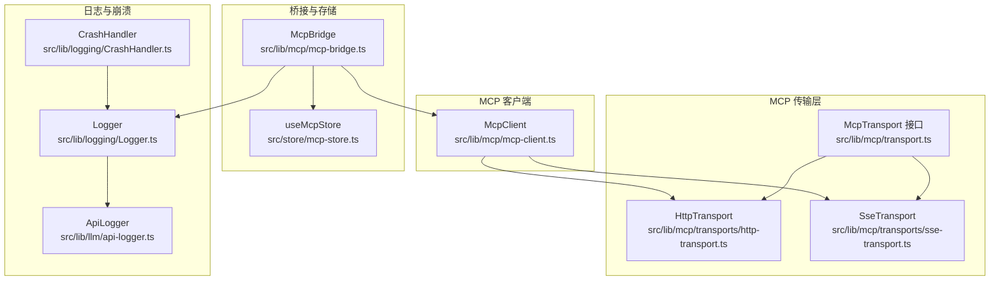
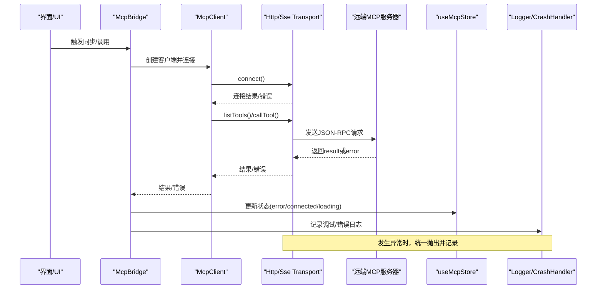
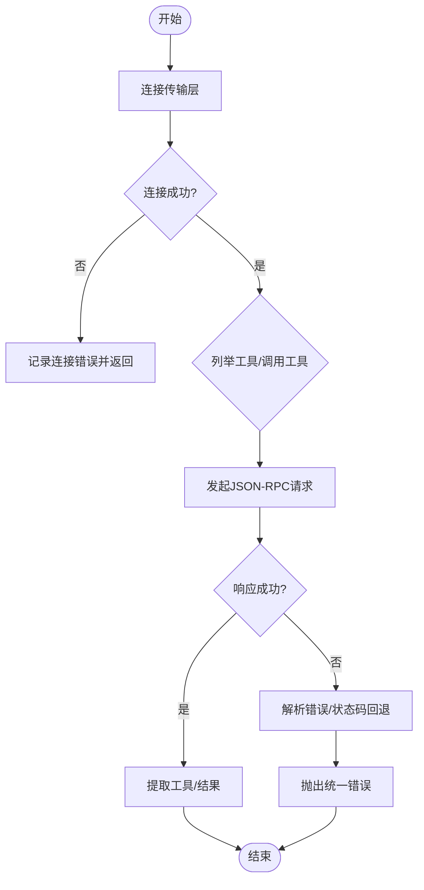
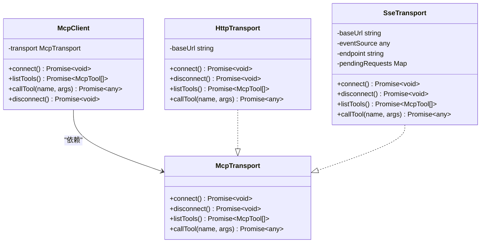
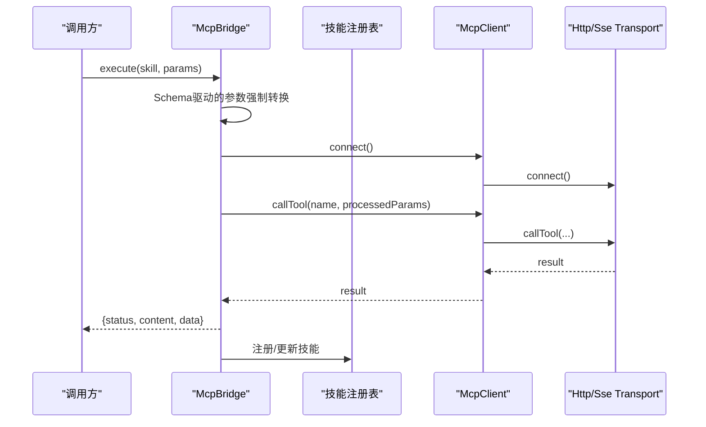
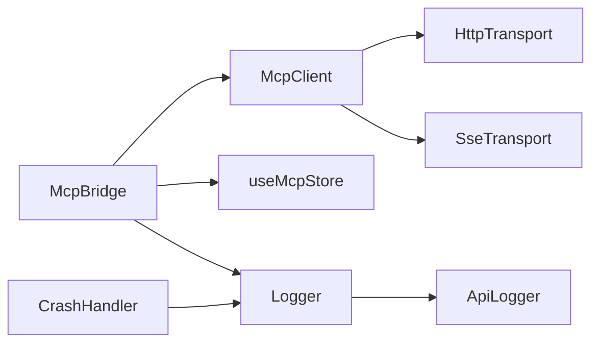

# 错误处理与调试

<cite>
**本文引用的文件**
- [src/lib/mcp/transport.ts](file://src/lib/mcp/transport.ts)
- [src/lib/mcp/mcp-client.ts](file://src/lib/mcp/mcp-client.ts)
- [src/lib/mcp/transports/http-transport.ts](file://src/lib/mcp/transports/http-transport.ts)
- [src/lib/mcp/transports/sse-transport.ts](file://src/lib/mcp/transports/sse-transport.ts)
- [src/lib/mcp/mcp-bridge.ts](file://src/lib/mcp/mcp-bridge.ts)
- [src/store/mcp-store.ts](file://src/store/mcp-store.ts)
- [src/lib/logging/Logger.ts](file://src/lib/logging/Logger.ts)
- [src/lib/logging/CrashHandler.ts](file://src/lib/logging/CrashHandler.ts)
- [src/lib/llm/api-logger.ts](file://src/lib/llm/api-logger.ts)
</cite>

## 目录
1. [简介](#简介)
2. [项目结构](#项目结构)
3. [核心组件](#核心组件)
4. [架构总览](#架构总览)
5. [详细组件分析](#详细组件分析)
6. [依赖关系分析](#依赖关系分析)
7. [性能考量](#性能考量)
8. [故障排查指南](#故障排查指南)
9. [结论](#结论)
10. [附录](#附录)

## 简介
本文件聚焦于MCP（Model Context Protocol）在本项目中的错误处理与调试体系，覆盖连接错误、工具调用错误、参数验证错误等场景，解释错误分类、错误码来源、错误恢复策略，以及日志记录、错误报告与调试信息收集机制。同时提供常见问题的诊断方法、MCP协议调试工具使用指南与故障排查流程。

## 项目结构
围绕MCP的错误处理与调试，相关代码主要分布在以下模块：
- 传输层：抽象接口与HTTP/SSE两种传输实现
- 客户端封装：统一的McpClient对外暴露连接、列举工具、调用工具与断开能力
- 桥接层：将远端MCP工具同步为本地技能，内置参数强制转换与执行流程
- 存储层：MCP服务器配置与状态持久化
- 日志与崩溃处理：统一日志系统、崩溃捕获与导出

图表来源
- [src/lib/mcp/transport.ts:8-13](file://src/lib/mcp/transport.ts#L8-L13)
- [src/lib/mcp/transports/http-transport.ts:3-8](file://src/lib/mcp/transports/http-transport.ts#L3-L8)
- [src/lib/mcp/transports/sse-transport.ts:22-32](file://src/lib/mcp/transports/sse-transport.ts#L22-L32)
- [src/lib/mcp/mcp-client.ts:6-21](file://src/lib/mcp/mcp-client.ts#L6-L21)
- [src/lib/mcp/mcp-bridge.ts:10-129](file://src/lib/mcp/mcp-bridge.ts#L10-L129)
- [src/store/mcp-store.ts:20-30](file://src/store/mcp-store.ts#L20-L30)
- [src/lib/logging/Logger.ts:18-69](file://src/lib/logging/Logger.ts#L18-L69)
- [src/lib/logging/CrashHandler.ts:8-52](file://src/lib/logging/CrashHandler.ts#L8-L52)
- [src/lib/llm/api-logger.ts:8-59](file://src/lib/llm/api-logger.ts#L8-L59)

章节来源
- [src/lib/mcp/transport.ts:2-13](file://src/lib/mcp/transport.ts#L2-L13)
- [src/lib/mcp/mcp-client.ts:1-52](file://src/lib/mcp/mcp-client.ts#L1-L52)
- [src/lib/mcp/transports/http-transport.ts:1-158](file://src/lib/mcp/transports/http-transport.ts#L1-L158)
- [src/lib/mcp/transports/sse-transport.ts:1-205](file://src/lib/mcp/transports/sse-transport.ts#L1-L205)
- [src/lib/mcp/mcp-bridge.ts:1-202](file://src/lib/mcp/mcp-bridge.ts#L1-L202)
- [src/store/mcp-store.ts:1-72](file://src/store/mcp-store.ts#L1-L72)
- [src/lib/logging/Logger.ts:1-280](file://src/lib/logging/Logger.ts#L1-L280)
- [src/lib/logging/CrashHandler.ts:1-53](file://src/lib/logging/CrashHandler.ts#L1-L53)
- [src/lib/llm/api-logger.ts:1-59](file://src/lib/llm/api-logger.ts#L1-L59)

## 核心组件
- 传输接口与实现
  - 抽象接口定义连接、断开、列举工具、调用工具四个核心方法，便于替换不同传输协议。
  - HTTP传输：基于JSON-RPC 2.0通过POST请求与远端交互；内置URL拼接与兼容性回退（如/tools与/tools/call）。
  - SSE传输：基于EventSource建立长连接，监听endpoint事件确定POST端点，请求通过fetch发送，响应通过SSE推送回传。
- 客户端封装
  - McpClient根据配置选择HTTP或SSE传输实例，统一对外暴露连接、列举工具、调用工具与断开能力。
- 桥接层
  - McpBridge负责将远端工具同步为本地技能，包含参数强制转换、执行流程与状态更新。
  - 使用Zod Schema进行参数校验与转换，提升调用稳定性。
- 存储层
  - useMcpStore维护服务器列表、状态与错误信息，支持UI展示与状态驱动。
- 日志与崩溃处理
  - Logger提供环形缓冲、批量写入、崩溃兜底导出能力；CrashHandler捕获JS/Native异常并落盘；ApiLogger作为API调试日志门面。

章节来源
- [src/lib/mcp/transport.ts:8-13](file://src/lib/mcp/transport.ts#L8-L13)
- [src/lib/mcp/mcp-client.ts:6-50](file://src/lib/mcp/mcp-client.ts#L6-L50)
- [src/lib/mcp/transports/http-transport.ts:50-143](file://src/lib/mcp/transports/http-transport.ts#L50-L143)
- [src/lib/mcp/transports/sse-transport.ts:34-104](file://src/lib/mcp/transports/sse-transport.ts#L34-L104)
- [src/lib/mcp/mcp-bridge.ts:14-129](file://src/lib/mcp/mcp-bridge.ts#L14-L129)
- [src/store/mcp-store.ts:20-64](file://src/store/mcp-store.ts#L20-L64)
- [src/lib/logging/Logger.ts:74-234](file://src/lib/logging/Logger.ts#L74-L234)
- [src/lib/logging/CrashHandler.ts:8-52](file://src/lib/logging/CrashHandler.ts#L8-L52)
- [src/lib/llm/api-logger.ts:23-43](file://src/lib/llm/api-logger.ts#L23-L43)

## 架构总览
下图展示MCP错误处理与调试在系统中的位置与交互：

图表来源
- [src/lib/mcp/mcp-bridge.ts:54-129](file://src/lib/mcp/mcp-bridge.ts#L54-L129)
- [src/lib/mcp/mcp-client.ts:26-50](file://src/lib/mcp/mcp-client.ts#L26-L50)
- [src/lib/mcp/transports/http-transport.ts:50-143](file://src/lib/mcp/transports/http-transport.ts#L50-L143)
- [src/lib/mcp/transports/sse-transport.ts:34-104](file://src/lib/mcp/transports/sse-transport.ts#L34-L104)
- [src/store/mcp-store.ts:53-64](file://src/store/mcp-store.ts#L53-L64)
- [src/lib/logging/Logger.ts:74-130](file://src/lib/logging/Logger.ts#L74-L130)

## 详细组件分析

### 传输层：错误分类与处理机制
- 连接错误
  - HTTP：无连接概念，connect/disconnect为占位；若远端不可达或网络异常，fetch失败即抛错。
  - SSE：基于EventSource建立连接，监听open/message/endpoint/error事件；首次error即判定连接失败；disconnect会拒绝所有待处理请求。
- 工具调用错误
  - HTTP：对非2xx状态码进行回退（如404/405/403），尝试子路径/tools/call；解析JSON-RPC error字段并抛出。
  - SSE：sendRequest阶段若未连接或缺失endpoint直接抛错；fetch失败reject；SSE推送的error字段转为JavaScript异常。
- 参数验证错误
  - 由桥接层在调用前进行Schema驱动的参数强制转换，减少因类型不匹配导致的调用失败。

图表来源
- [src/lib/mcp/transports/http-transport.ts:50-143](file://src/lib/mcp/transports/http-transport.ts#L50-L143)
- [src/lib/mcp/transports/sse-transport.ts:34-104](file://src/lib/mcp/transports/sse-transport.ts#L34-L104)

章节来源
- [src/lib/mcp/transports/http-transport.ts:50-143](file://src/lib/mcp/transports/http-transport.ts#L50-L143)
- [src/lib/mcp/transports/sse-transport.ts:34-104](file://src/lib/mcp/transports/sse-transport.ts#L34-L104)

### 客户端封装：统一入口与错误传播
- McpClient根据配置选择HTTP或SSE传输，listTools/callTool均先确保连接，再转发至具体传输实现。
- 通过统一接口屏蔽底层差异，便于扩展与测试。

图表来源
- [src/lib/mcp/transport.ts:8-13](file://src/lib/mcp/transport.ts#L8-L13)
- [src/lib/mcp/mcp-client.ts:6-50](file://src/lib/mcp/mcp-client.ts#L6-L50)
- [src/lib/mcp/transports/http-transport.ts:3-8](file://src/lib/mcp/transports/http-transport.ts#L3-L8)
- [src/lib/mcp/transports/sse-transport.ts:22-32](file://src/lib/mcp/transports/sse-transport.ts#L22-L32)

章节来源
- [src/lib/mcp/mcp-client.ts:6-50](file://src/lib/mcp/mcp-client.ts#L6-L50)
- [src/lib/mcp/transport.ts:8-13](file://src/lib/mcp/transport.ts#L8-L13)

### 桥接层：参数转换与执行流程
- 参数强制转换：遍历Schema，对字符串字段但传入对象的参数进行JSON序列化，降低调用失败率。
- 执行策略：每次原子执行新建客户端，连接后调用工具，完成后断开，保证无状态与隔离。
- 状态管理：同步过程更新服务器状态（loading/connected/error/disconnected），并在错误时记录错误消息。

图表来源
- [src/lib/mcp/mcp-bridge.ts:79-112](file://src/lib/mcp/mcp-bridge.ts#L79-L112)
- [src/lib/mcp/mcp-bridge.ts:119-128](file://src/lib/mcp/mcp-bridge.ts#L119-L128)

章节来源
- [src/lib/mcp/mcp-bridge.ts:79-112](file://src/lib/mcp/mcp-bridge.ts#L79-L112)
- [src/lib/mcp/mcp-bridge.ts:119-128](file://src/lib/mcp/mcp-bridge.ts#L119-L128)

### 存储层：状态与错误持久化
- 服务器状态包括connected/disconnected/error/loading，错误消息保存在error字段。
- UI辅助函数setServerStatus在成功/加载态时自动清空历史错误，避免误导。

章节来源
- [src/store/mcp-store.ts:6-18](file://src/store/mcp-store.ts#L6-L18)
- [src/store/mcp-store.ts:53-64](file://src/store/mcp-store.ts#L53-L64)

### 日志与崩溃处理：调试与报告
- Logger
  - 环形缓冲保留最近N条日志，支持批量写入数据库；错误级别日志立即刷盘。
  - 提供获取最近日志、崩溃兜底导出能力，便于问题复现与上报。
- CrashHandler
  - 捕获JS与Native未捕获异常，写入日志并尝试刷新，保障崩溃信息不丢失。
- ApiLogger
  - 作为API调试日志门面，统一记录请求/响应，便于定位接口问题。

章节来源
- [src/lib/logging/Logger.ts:74-234](file://src/lib/logging/Logger.ts#L74-L234)
- [src/lib/logging/CrashHandler.ts:8-52](file://src/lib/logging/CrashHandler.ts#L8-L52)
- [src/lib/llm/api-logger.ts:23-43](file://src/lib/llm/api-logger.ts#L23-L43)

## 依赖关系分析
- 低耦合高内聚：McpClient仅依赖McpTransport接口，具体实现可替换。
- 传输层对远端协议的适配：HTTP/SSE分别处理不同握手与请求方式。
- 桥接层对存储与日志的依赖：状态更新与错误记录贯穿执行链路。
- 日志系统独立于业务：通过门面与崩溃处理器解耦业务代码。

图表来源
- [src/lib/mcp/mcp-bridge.ts:10-129](file://src/lib/mcp/mcp-bridge.ts#L10-L129)
- [src/lib/mcp/mcp-client.ts:6-21](file://src/lib/mcp/mcp-client.ts#L6-L21)
- [src/store/mcp-store.ts:20-30](file://src/store/mcp-store.ts#L20-L30)
- [src/lib/logging/Logger.ts:18-69](file://src/lib/logging/Logger.ts#L18-L69)
- [src/lib/logging/CrashHandler.ts:8-52](file://src/lib/logging/CrashHandler.ts#L8-L52)
- [src/lib/llm/api-logger.ts:8-21](file://src/lib/llm/api-logger.ts#L8-L21)

章节来源
- [src/lib/mcp/mcp-bridge.ts:10-129](file://src/lib/mcp/mcp-bridge.ts#L10-L129)
- [src/lib/mcp/mcp-client.ts:6-21](file://src/lib/mcp/mcp-client.ts#L6-L21)
- [src/store/mcp-store.ts:20-30](file://src/store/mcp-store.ts#L20-L30)
- [src/lib/logging/Logger.ts:18-69](file://src/lib/logging/Logger.ts#L18-L69)
- [src/lib/logging/CrashHandler.ts:8-52](file://src/lib/logging/CrashHandler.ts#L8-L52)
- [src/lib/llm/api-logger.ts:8-21](file://src/lib/llm/api-logger.ts#L8-L21)

## 性能考量
- 无状态执行：桥接层每次原子执行都新建客户端并断开，避免长连接资源占用，适合短任务与弱网络环境。
- 批量写日志：Logger采用防抖与批量写入，降低IO压力；错误日志立即刷盘，兼顾可靠性。
- URL拼接与回退：HTTP传输对路径拼接与常见错误进行回退，减少重复握手成本。

## 故障排查指南
- 连接错误
  - 症状：状态变为error，提示“连接失败”或“SSE连接失败”。
  - 排查要点：检查服务器地址、网络连通性、证书与CORS设置；确认SSE endpoint事件是否到达。
  - 操作步骤：
    - 在浏览器/Postman验证SSE端点与endpoint事件。
    - 查看日志中SSE连接与错误事件输出。
    - 如为HTTP模式，确认POST端点可达且返回2xx。
- 工具调用错误
  - 症状：调用失败，返回HTTP状态码或JSON-RPC error。
  - 排查要点：核对工具名、参数结构与Schema；关注回退路径（/tools与/tools/call）是否生效。
  - 操作步骤：
    - 打开HTTP/SSE传输的日志输出，核对请求体与响应体。
    - 若出现404/405/403，确认服务端路由配置。
    - 检查远端是否返回JSON-RPC error字段及含义。
- 参数验证错误
  - 症状：调用前参数类型不匹配导致失败。
  - 排查要点：查看桥接层参数强制转换日志；核对Schema定义。
  - 操作步骤：
    - 在桥接层执行前打印processedParams，确认对象已被序列化为字符串。
    - 调整调用侧参数类型，或扩展Schema以支持更多类型。
- 日志与报告
  - 使用Logger导出最近日志，或在崩溃后导出崩溃兜底日志。
  - 通过ApiLogger记录的请求/响应快速定位接口问题。
  - 在CrashHandler捕获到的异常中，结合最近日志进行复盘。

章节来源
- [src/lib/mcp/transports/http-transport.ts:115-142](file://src/lib/mcp/transports/http-transport.ts#L115-L142)
- [src/lib/mcp/transports/sse-transport.ts:70-84](file://src/lib/mcp/transports/sse-transport.ts#L70-L84)
- [src/lib/mcp/mcp-bridge.ts:85-93](file://src/lib/mcp/mcp-bridge.ts#L85-L93)
- [src/lib/logging/Logger.ts:239-277](file://src/lib/logging/Logger.ts#L239-L277)
- [src/lib/logging/CrashHandler.ts:15-31](file://src/lib/logging/CrashHandler.ts#L15-L31)
- [src/lib/llm/api-logger.ts:23-43](file://src/lib/llm/api-logger.ts#L23-L43)

## 结论
本项目的MCP错误处理与调试体系通过“传输层抽象 + 客户端封装 + 桥接层参数转换 + 存储层状态管理 + 日志与崩溃处理”的组合，实现了对连接错误、工具调用错误与参数验证错误的全链路覆盖。配合详细的日志输出与崩溃兜底导出，能够有效支撑开发与运维的诊断与排障工作。

## 附录
- 常见错误与恢复策略速查
  - 连接失败：检查网络与证书；SSE需等待endpoint事件；HTTP需确认POST端点。
  - 工具不存在/名称错误：核对tools/list返回与调用名一致。
  - 参数类型不匹配：启用桥接层参数强制转换；完善Schema。
  - 404/405/403：尝试/tools/call回退路径；检查服务端路由与鉴权。
  - JSON-RPC error：根据远端返回的错误消息定位问题。
- 调试工具与流程
  - 打开开发者控制台，观察HTTP/SSE传输日志输出。
  - 使用Logger导出日志，或在崩溃后导出兜底日志。
  - 通过ApiLogger记录的请求/响应快速定位接口问题。
  - 在桥接层执行前后打印processedParams，确认参数转换效果。