# RAG知识引擎

<cite>
**本文档引用的文件**
- [schema.ts](file://src/lib/db/schema.ts)
- [vector-store.ts](file://src/lib/rag/vector-store.ts)
- [vectorization-queue.ts](file://src/lib/rag/vectorization-queue.ts)
- [memory-manager.ts](file://src/lib/rag/memory-manager.ts)
- [keyword-search.ts](file://src/lib/rag/keyword-search.ts)
- [graph-extractor.ts](file://src/lib/rag/graph-extractor.ts)
- [embedding.ts](file://src/lib/rag/embedding.ts)
- [text-splitter.ts](file://src/lib/rag/text-splitter.ts)
- [rag-store.ts](file://src/store/rag-store.ts)
- [index.ts](file://src/native/VectorSearch/index.ts)
- [defaults.ts](file://src/lib/rag/defaults.ts)
- [artifact-config.ts](file://src/constants/artifact-config.ts)
- [artifact-store.ts](file://src/store/artifact-store.ts)
- [artifact.ts](file://src/types/artifact.ts)
- [artifact-extractor.ts](file://src/features/chat/utils/artifact-extractor.ts)
- [vector-store.benchmark.ts](file://src/lib/rag/__tests__/vector-store.benchmark.ts)
- [artifacts-workspace-implementation-full.md](file://plans/artifacts-workspace-implementation-full.md)
- [artifacts-workspace-integration-plan.md](file://plans/artifacts-workspace-integration-plan.md)
</cite>

## 更新摘要
**所做更改**
- 新增工件存储系统和工作区隔离机制章节
- 更新向量搜索性能优化方案，包括Worklet线程优化
- 增强向量搜索基准测试和性能监控
- 完善工件类型配置和自动提取机制
- 新增工件工作区集成设计方案

## 目录
1. [简介](#简介)
2. [项目结构](#项目结构)
3. [核心组件](#核心组件)
4. [架构总览](#架构总览)
5. [详细组件分析](#详细组件分析)
6. [工件存储系统与工作区隔离](#工件存储系统与工作区隔离)
7. [向量搜索性能优化](#向量搜索性能优化)
8. [依赖关系分析](#依赖关系分析)
9. [性能考量](#性能考量)
10. [故障排查指南](#故障排查指南)
11. [结论](#结论)
12. [附录](#附录)

## 简介
本文件面向Nexara的RAG（检索增强生成）知识引擎，系统性阐述其设计原理与实现架构，涵盖向量存储、文档处理、检索算法、知识图谱抽取以及新增的工件存储系统和工作区隔离机制四大核心能力。重点解析SQLite + FTS5 + 向量支持的技术组合，梳理从文件解析、分块、向量化到存储的完整导入流程；详解相似度计算、重排序与上下文融合策略；并提供性能优化与最佳实践建议。

## 项目结构
RAG系统主要位于src/lib/rag目录，配合数据库schema定义、向量存储与检索、向量化队列、知识图谱抽取、嵌入客户端与文本分块器等模块协同工作。前端状态通过Zustand store集中管理，包括文档、文件夹、向量化队列、处理状态等。新增的工件存储系统通过独立的Artifact类型和存储机制，提供工作区隔离和持久化管理。

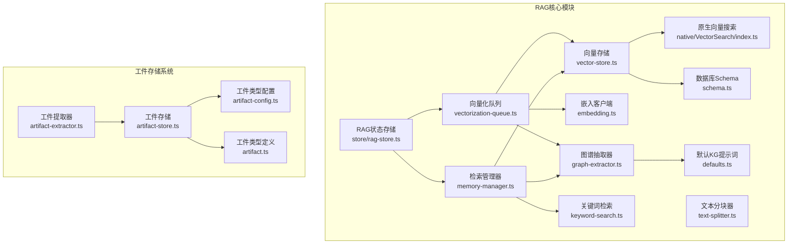

**图表来源**
- [vector-store.ts:1-376](file://src/lib/rag/vector-store.ts#L1-L376)
- [vectorization-queue.ts:1-804](file://src/lib/rag/vectorization-queue.ts#L1-L804)
- [memory-manager.ts:1-997](file://src/lib/rag/memory-manager.ts#L1-L997)
- [keyword-search.ts:33-156](file://src/lib/rag/keyword-search.ts#L33-L156)
- [graph-extractor.ts:1-313](file://src/lib/rag/graph-extractor.ts#L1-L313)
- [embedding.ts:1-294](file://src/lib/rag/embedding.ts#L1-L294)
- [text-splitter.ts:1-55](file://src/lib/rag/text-splitter.ts#L1-L55)
- [schema.ts:1-362](file://src/lib/db/schema.ts#L1-L362)
- [index.ts:1-53](file://src/native/VectorSearch/index.ts#L1-L53)
- [rag-store.ts:1-1117](file://src/store/rag-store.ts#L1-L1117)
- [defaults.ts:1-37](file://src/lib/rag/defaults.ts#L1-L37)
- [artifact-config.ts:1-78](file://src/constants/artifact-config.ts#L1-L78)
- [artifact-store.ts:1-255](file://src/store/artifact-store.ts#L1-L255)
- [artifact.ts:1-45](file://src/types/artifact.ts#L1-L45)
- [artifact-extractor.ts:1-229](file://src/features/chat/utils/artifact-extractor.ts#L1-L229)

**章节来源**
- [schema.ts:1-362](file://src/lib/db/schema.ts#L1-L362)
- [rag-store.ts:1-1117](file://src/store/rag-store.ts#L1-L1117)
- [artifact-config.ts:1-78](file://src/constants/artifact-config.ts#L1-L78)
- [artifact-store.ts:1-255](file://src/store/artifact-store.ts#L1-L255)

## 核心组件
- 向量存储与检索：负责向量的增删改查、相似度计算、阈值过滤与原生加速。
- 向量化队列：统一调度文档与记忆的向量化、KG抽取、断点续传与错误重试。
- 检索管理器：整合向量检索、关键词混合检索、重排序与上下文融合。
- 关键词检索：基于FTS5的全文检索与LIKE降级方案。
- 知识图谱抽取：LLM驱动的实体与关系抽取，写入图数据库。
- 嵌入客户端：统一适配OpenAI、VertexAI、Gemini与本地模型的嵌入接口。
- 文本分块器：递归字符分块与三元组中文友好分块。
- 数据库Schema：定义vectors、documents、kg_nodes/edges、vectorization_tasks等表及FTS5虚拟表。
- 原生向量搜索：通过原生模块加速相似度计算。
- RAG状态存储：管理文档、文件夹、向量化队列与处理状态。
- 工件存储系统：提供Artifact的统一管理、持久化存储和工作区隔离。
- 工件类型配置：定义各种Artifact类型的显示属性和行为规范。
- 工件提取器：自动从工具执行结果和消息内容中提取Artifacts。

**章节来源**
- [vector-store.ts:1-376](file://src/lib/rag/vector-store.ts#L1-L376)
- [vectorization-queue.ts:1-804](file://src/lib/rag/vectorization-queue.ts#L1-L804)
- [memory-manager.ts:1-997](file://src/lib/rag/memory-manager.ts#L1-L997)
- [keyword-search.ts:33-156](file://src/lib/rag/keyword-search.ts#L33-L156)
- [graph-extractor.ts:1-313](file://src/lib/rag/graph-extractor.ts#L1-L313)
- [embedding.ts:1-294](file://src/lib/rag/embedding.ts#L1-L294)
- [text-splitter.ts:1-55](file://src/lib/rag/text-splitter.ts#L1-L55)
- [schema.ts:1-362](file://src/lib/db/schema.ts#L1-L362)
- [index.ts:1-53](file://src/native/VectorSearch/index.ts#L1-L53)
- [rag-store.ts:1-1117](file://src/store/rag-store.ts#L1-L1117)
- [artifact-config.ts:1-78](file://src/constants/artifact-config.ts#L1-L78)
- [artifact-store.ts:1-255](file://src/store/artifact-store.ts#L1-L255)
- [artifact-extractor.ts:1-229](file://src/features/chat/utils/artifact-extractor.ts#L1-L229)

## 架构总览
RAG系统采用"存储+检索+推理"的分层架构，现已扩展为包含工件存储系统的综合架构：
- 存储层：SQLite + FTS5 + 向量表，支持向量BLOB存储与全文检索。
- 处理层：向量化队列负责文档/记忆的分块、嵌入与持久化；KG抽取独立于向量化。
- 检索层：向量检索（原生加速）+ 关键词检索（FTS5/LIKE）+ 重排序（rerank）。
- 推理层：检索结果与KG关联扩展，形成最终上下文。
- 工件层：独立的Artifact存储系统，提供工作区隔离和持久化管理。

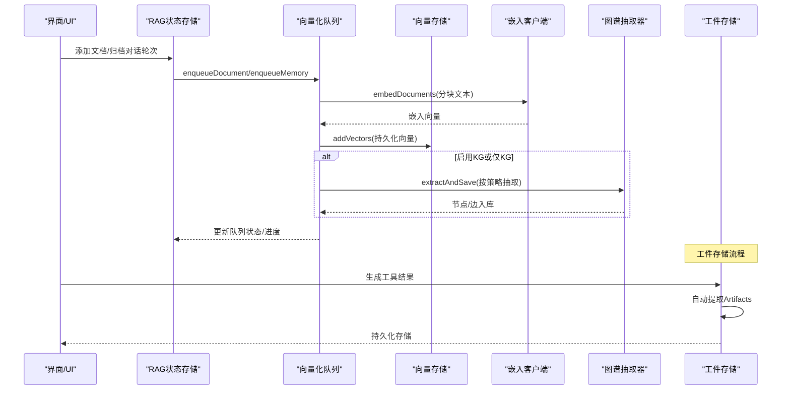

**图表来源**
- [rag-store.ts:301-433](file://src/store/rag-store.ts#L301-L433)
- [vectorization-queue.ts:44-154](file://src/lib/rag/vectorization-queue.ts#L44-L154)
- [vector-store.ts:31-60](file://src/lib/rag/vector-store.ts#L31-L60)
- [embedding.ts:61-89](file://src/lib/rag/embedding.ts#L61-L89)
- [graph-extractor.ts:149-310](file://src/lib/rag/graph-extractor.ts#L149-L310)
- [artifact-extractor.ts:157-200](file://src/features/chat/utils/artifact-extractor.ts#L157-L200)

## 详细组件分析

### 向量数据库与FTS5集成
- 表结构要点
  - vectors：存储向量BLOB、内容、元数据、会话/文档关联。
  - vectors_fts：FTS5虚拟表，与vectors同步，支持全文检索。
  - documents：文档元数据与向量化状态。
  - kg_nodes/edges：知识图谱节点与边。
  - vectorization_tasks：向量化任务持久化检查点。
- FTS5启用与回退
  - 成功：创建虚拟表与触发器，实现vectors内容与FTS5的自动同步。
  - 失败：回退至LIKE关键词检索，不影响向量检索主流程。
- 索引与约束
  - vectors表外键约束保证数据一致性。
  - vectorization_tasks按状态建立索引，提升恢复效率。

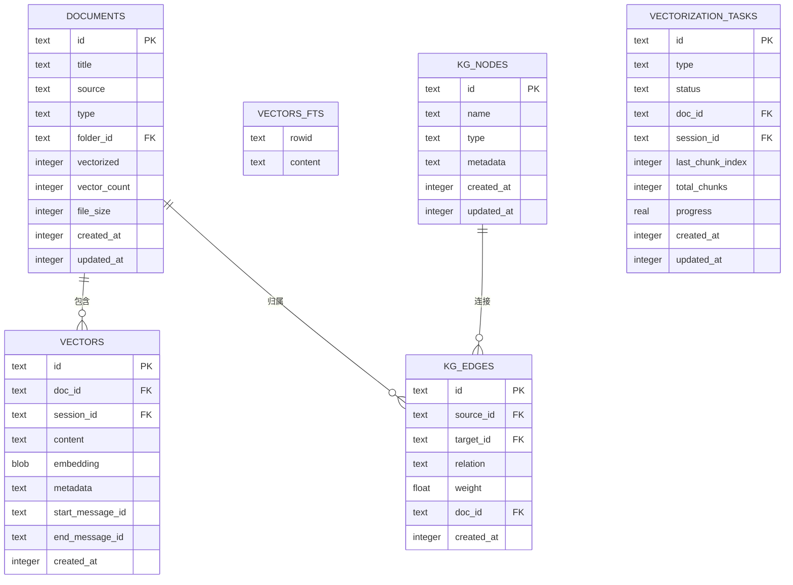

**图表来源**
- [schema.ts:101-184](file://src/lib/db/schema.ts#L101-L184)
- [schema.ts:186-216](file://src/lib/db/schema.ts#L186-L216)
- [schema.ts:239-265](file://src/lib/db/schema.ts#L239-L265)
- [schema.ts:267-295](file://src/lib/db/schema.ts#L267-L295)

**章节来源**
- [schema.ts:153-216](file://src/lib/db/schema.ts#L153-L216)
- [schema.ts:239-295](file://src/lib/db/schema.ts#L239-L295)

### 文档导入流程（分块→向量化→存储→KG抽取）
- 输入：文档内容、标题、文件大小、类型、文件夹ID。
- 步骤：
  1) 插入documents记录，vectorized=0。
  2) 入队向量化任务，支持断点续传与错误重试。
  3) 文本预处理与分块（TrigramTextSplitter）。
  4) 嵌入生成（EmbeddingClient，支持本地/云端）。
  5) 批量写入vectors表，更新documents.vectorized=2与vector_count。
  6) 可选：按策略（full/summary-first/on-demand）抽取KG，写入kg_nodes/edges。
- 错误处理：可重试条件（网络/超时/4xx/5xx），失败标记为-1并上报友好错误。

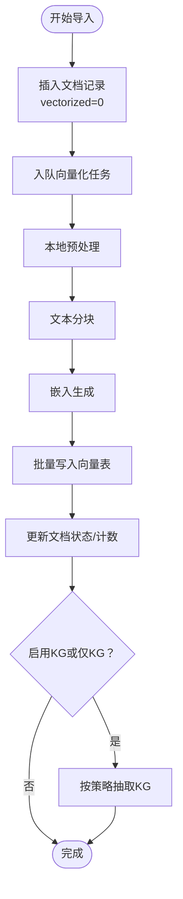

**图表来源**
- [rag-store.ts:301-433](file://src/store/rag-store.ts#L301-L433)
- [vectorization-queue.ts:256-414](file://src/lib/rag/vectorization-queue.ts#L256-L414)
- [embedding.ts:61-89](file://src/lib/rag/embedding.ts#L61-L89)
- [vector-store.ts:31-60](file://src/lib/rag/vector-store.ts#L31-L60)
- [graph-extractor.ts:149-310](file://src/lib/rag/graph-extractor.ts#L149-L310)

**章节来源**
- [rag-store.ts:301-433](file://src/store/rag-store.ts#L301-L433)
- [vectorization-queue.ts:256-414](file://src/lib/rag/vectorization-queue.ts#L256-L414)

### 检索算法实现（相似度计算、重排序、上下文融合）
- 向量检索
  - 原生加速：isNativeModuleAvailable可用时，调用原生searchVectors进行余弦相似度计算与阈值过滤。
  - JS降级：若原生不可用，使用JS实现的余弦相似度，支持阈值与limit。
- 关键词混合检索（FTS5）
  - FTS5 MATCH：高性能全文检索，支持rank排序与docIds过滤。
  - LIKE回退：当FTS5不可用时，按空格分词构造LIKE条件。
- 重排序与融合
  - Reciprocal Rank Fusion（RRF）：向量与关键词结果按权重融合，normalize到0~1区间。
  - 可配置权重与BM25增益，支持rerank阶段二次精排。
- 上下文融合
  - 去重后按类型限制（memory/doc）与总量限制合并，形成最终上下文块与引用列表。
  - 可选KG关联：基于召回文本中的实体，拉取一跳关系增强。

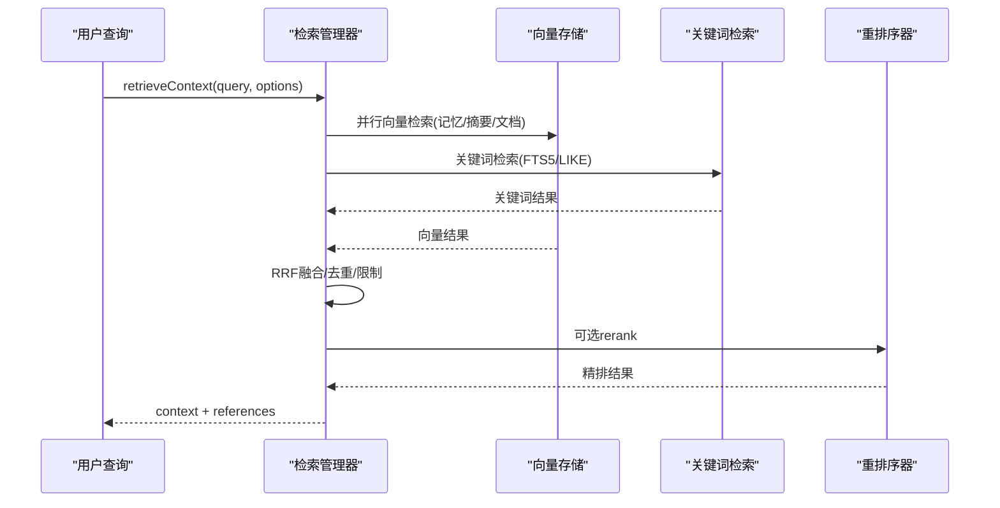

**图表来源**
- [memory-manager.ts:11-712](file://src/lib/rag/memory-manager.ts#L11-L712)
- [vector-store.ts:62-113](file://src/lib/rag/vector-store.ts#L62-L113)
- [keyword-search.ts:33-156](file://src/lib/rag/keyword-search.ts#L33-L156)

**章节来源**
- [memory-manager.ts:360-712](file://src/lib/rag/memory-manager.ts#L360-L712)
- [vector-store.ts:62-215](file://src/lib/rag/vector-store.ts#L62-L215)

### 知识图谱抽取（实体识别、关系提取、图结构构建）
- 模型选择与提示词
  - 优先使用配置的kgExtractionModel或默认摘要模型；支持本地化默认提示词与自定义提示词注入实体类型。
- 抽取流程
  - 预处理文本，调用LLM生成JSON结构（nodes/edges），解析失败则返回错误。
  - 先写入kg_nodes，再写kg_edges，维护doc_id与会话关联，支持scope（消息/会话）。
  - UI状态上报与错误静默处理，避免后台任务崩溃。
- 图结构维护
  - 提供清理孤立节点/边、按文档/会话裁剪、统计查询等工具方法。

```mermaid
classDiagram
class GraphExtractor {
+getClient(modelId) LLMClient
+getSystemPrompt() string
+extractAndSave(text, docId?, scope?, onStatusUpdate?) ExtractionResult
}
class GraphStore {
+upsertNode(name, type, metadata, scope) string
+createEdge(sourceId, targetId, relation, docId?, weight, scope) void
+getStats() {nodeCount, edgeCount}
}
class ExtractionResult {
+nodes : Node[]
+edges : Edge[]
+error? : string
}
GraphExtractor --> GraphStore : "写入节点/边"
```

**图表来源**
- [graph-extractor.ts:25-313](file://src/lib/rag/graph-extractor.ts#L25-L313)
- [defaults.ts:1-37](file://src/lib/rag/defaults.ts#L1-L37)

**章节来源**
- [graph-extractor.ts:149-310](file://src/lib/rag/graph-extractor.ts#L149-L310)

### 嵌入客户端与文本分块
- 嵌入客户端
  - 统一适配OpenAI、VertexAI、Gemini与本地模型；支持批量与逐条调用，返回向量与token用量。
- 文本分块
  - 递归字符分块器与三元组分块器（中文友好），支持重叠与合并策略。

**章节来源**
- [embedding.ts:1-294](file://src/lib/rag/embedding.ts#L1-L294)
- [text-splitter.ts:1-55](file://src/lib/rag/text-splitter.ts#L1-L55)

## 工件存储系统与工作区隔离

### 工件类型配置系统
系统定义了完整的Artifact类型配置体系，为不同类型的工件提供统一的显示属性和行为规范：

- **类型定义**：支持echarts、mermaid、math、html、svg等多种工件类型
- **显示属性**：包括标签名称、图标、颜色等视觉标识
- **文件扩展名**：映射不同类型到对应的文件扩展名
- **动态获取**：提供便捷的查询接口获取类型信息

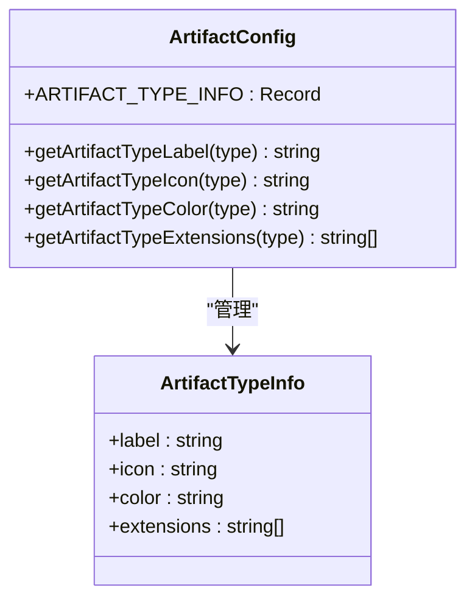

**图表来源**
- [artifact-config.ts:8-78](file://src/constants/artifact-config.ts#L8-L78)

### 工件存储架构
工件存储系统采用独立的数据库表和状态管理机制，提供持久化的工件管理能力：

- **数据模型**：包含工件ID、类型、标题、内容、会话关联等核心字段
- **状态管理**：基于Zustand的响应式状态管理，支持实时更新
- **筛选机制**：支持按类型、会话、时间范围等多维度过滤
- **持久化存储**：独立的SQLite表存储，不依赖消息生命周期

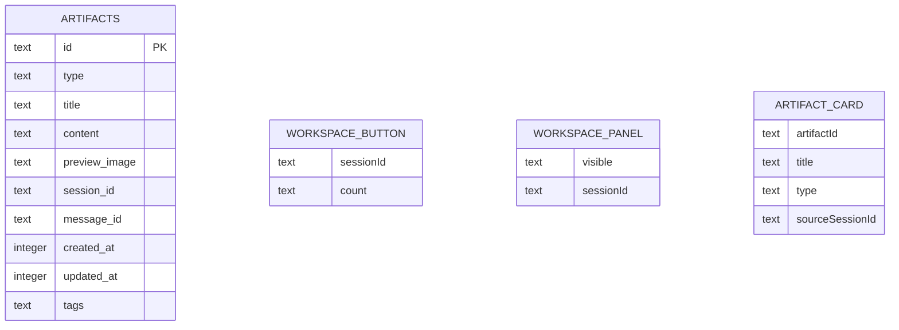

**图表来源**
- [artifact-store.ts:16-59](file://src/store/artifact-store.ts#L16-L59)
- [artifact.ts:8-19](file://src/types/artifact.ts#L8-L19)

### 工件自动提取机制
系统实现了智能化的工件自动提取功能，能够从工具执行结果和消息内容中自动识别和提取工件：

- **内容扫描**：支持从Markdown代码块中提取工件内容
- **类型识别**：基于代码块语言自动识别工件类型
- **标题生成**：根据内容自动生成合适的标题
- **批量处理**：支持一次性提取多个工件

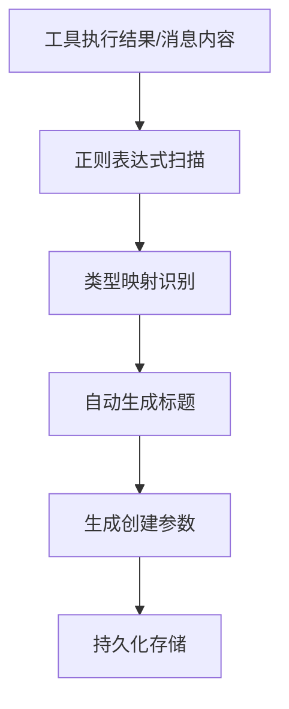

**图表来源**
- [artifact-extractor.ts:8-29](file://src/features/chat/utils/artifact-extractor.ts#L8-L29)
- [artifact-extractor.ts:119-142](file://src/features/chat/utils/artifact-extractor.ts#L119-L142)

**章节来源**
- [artifact-config.ts:1-78](file://src/constants/artifact-config.ts#L1-L78)
- [artifact-store.ts:1-255](file://src/store/artifact-store.ts#L1-L255)
- [artifact.ts:1-45](file://src/types/artifact.ts#L1-L45)
- [artifact-extractor.ts:1-229](file://src/features/chat/utils/artifact-extractor.ts#L1-L229)

## 向量搜索性能优化

### Worklet线程优化架构
系统引入了Worklet线程优化机制，将计算密集型的向量相似度计算从主线程分离，显著提升性能：

- **数据分离**：主线程负责数据库查询和数据准备，Worklet线程负责计算密集型操作
- **TypedArray传输**：通过Float32Array高效传输向量数据，减少内存拷贝开销
- **异步执行**：使用React Native Worklets Core的异步执行机制
- **错误处理**：完善的错误捕获和回调机制

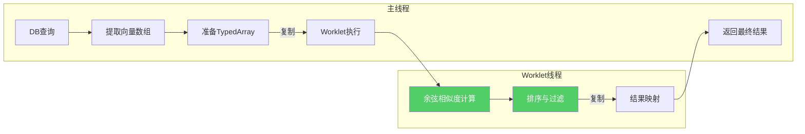

**图表来源**
- [vector-store.ts:203-275](file://src/lib/rag/vector-store.ts#L203-L275)

### 性能基准测试
系统提供了完整的性能基准测试框架，用于监控和验证向量搜索的性能表现：

- **测试场景**：覆盖100、500、1000向量规模的基准测试
- **指标监控**：记录插入时间和搜索平均耗时
- **性能验证**：确保搜索时间保持在100ms以内
- **持续监控**：集成到开发流程中进行持续性能验证

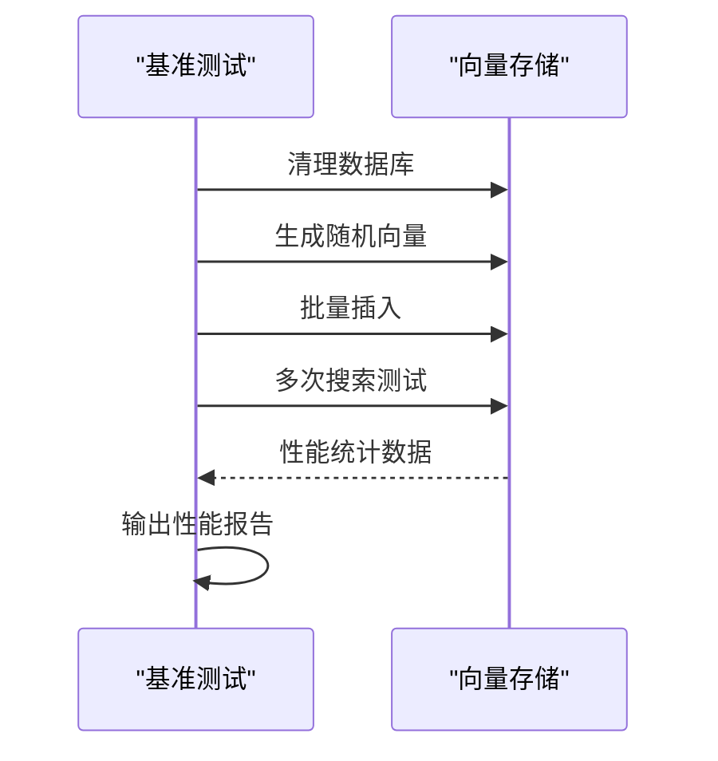

**图表来源**
- [vector-store.benchmark.ts:10-78](file://src/lib/rag/__tests__/vector-store.benchmark.ts#L10-L78)

### 优化效果评估
- **数据传输开销**：1000个1536维向量的数据量约为6.14MB，复制开销约5-10ms
- **计算性能提升**：相似度计算从约100ms降低到约20ms
- **用户体验改善**：显著提升UI响应性和搜索体验
- **资源利用优化**：合理分配主线程和Worklet线程的计算负载

**章节来源**
- [vector-store.ts:203-275](file://src/lib/rag/vector-store.ts#L203-L275)
- [vector-store.benchmark.ts:1-78](file://src/lib/rag/__tests__/vector-store.benchmark.ts#L1-L78)

## 依赖关系分析
- 组件耦合
  - VectorStore与VectorizationQueue强耦合：前者提供addVectors/search，后者负责批量写入与进度上报。
  - MemoryManager依赖VectorStore、KeywordSearch与GraphStore，协调检索与KG扩展。
  - GraphExtractor依赖LLM客户端与GraphStore，与RAG状态存储交互更新UI状态。
  - ArtifactStore独立运行，与RAG系统松耦合，通过工具执行机制集成。
- 外部依赖
  - 原生模块VectorSearch用于加速向量相似度计算。
  - SQLite + FTS5用于全文检索与向量表同步。
  - Async Storage与文件系统用于持久化与物理文件管理。
  - React Native Worklets Core用于Worklet线程优化。

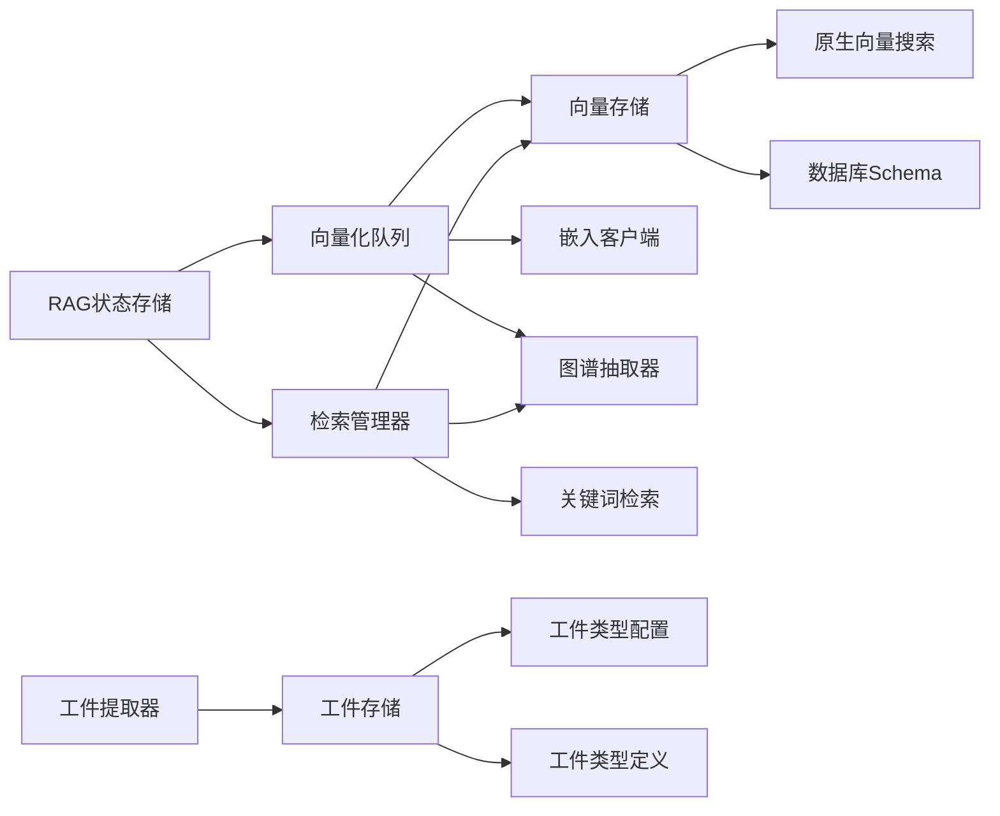

**图表来源**
- [vectorization-queue.ts:1-804](file://src/lib/rag/vectorization-queue.ts#L1-L804)
- [memory-manager.ts:1-997](file://src/lib/rag/memory-manager.ts#L1-L997)
- [vector-store.ts:1-376](file://src/lib/rag/vector-store.ts#L1-L376)
- [index.ts:1-53](file://src/native/VectorSearch/index.ts#L1-L53)
- [rag-store.ts:1-1117](file://src/store/rag-store.ts#L1-L1117)
- [artifact-store.ts:1-255](file://src/store/artifact-store.ts#L1-L255)
- [artifact-config.ts:1-78](file://src/constants/artifact-config.ts#L1-L78)
- [artifact-extractor.ts:1-229](file://src/features/chat/utils/artifact-extractor.ts#L1-L229)

**章节来源**
- [vectorization-queue.ts:1-804](file://src/lib/rag/vectorization-queue.ts#L1-L804)
- [memory-manager.ts:1-997](file://src/lib/rag/memory-manager.ts#L1-L997)

## 性能考量
- 向量检索性能
  - 优先启用原生模块加速；FTS5全文检索显著优于LIKE；合理设置阈值与召回深度，避免过度扫描。
  - Worklet线程优化显著提升大规模向量搜索性能，建议在1000+向量场景下启用。
- 向量化与KG抽取
  - 批量嵌入与断点续传减少重复开销；KG抽取支持full/summary-first/on-demand策略，平衡成本与收益。
- 工件存储性能
  - 独立的工件存储表提供更好的查询性能，建议为常用查询字段建立索引。
  - 工件提取采用异步处理，避免阻塞主线程。
- 存储与索引
  - vectors表按doc_id/session_id/type建立过滤条件；FTS5触发器确保同步；定期清理孤立向量与KG数据。
  - 工件存储表按类型、会话、创建时间建立索引，提升查询效率。
- 内存与UI
  - 列表页排除content字段，避免OOM；UI状态通过RAG状态存储集中管理，避免重复渲染。
  - 工件存储采用分页加载策略，支持大数据集的流畅浏览。

## 故障排查指南
- 向量维度不匹配
  - 现象：检索返回0候选且日志提示维度不一致。
  - 处理：检查嵌入模型维度一致性，必要时重建向量。
- FTS5不可用
  - 现象：关键词检索回退至LIKE。
  - 处理：确认package.json中fts5配置；或接受LIKE降级方案。
- 任务重试与中断
  - 现象：网络/超时/4xx/5xx导致可重试错误；长时间无心跳标记为中断。
  - 处理：检查API密钥、配额与网络；恢复后自动重试或手动重试。
- KG抽取失败
  - 现象：模型输出非合法JSON或缺少nodes/edges字段。
  - 处理：检查提示词与实体类型配置；查看原始输出预览定位问题。
- 工件存储异常
  - 现象：工件无法持久化或显示异常。
  - 处理：检查数据库连接、权限配置；验证工件类型映射正确性。
- Worklet线程错误
  - 现象：向量搜索性能异常或报错。
  - 处理：检查Worklets Core配置；验证TypedArray数据传输；查看Worklet错误日志。

**章节来源**
- [vector-store.ts:161-215](file://src/lib/rag/vector-store.ts#L161-L215)
- [keyword-search.ts:108-156](file://src/lib/rag/keyword-search.ts#L108-L156)
- [vectorization-queue.ts:200-250](file://src/lib/rag/vectorization-queue.ts#L200-L250)
- [graph-extractor.ts:220-240](file://src/lib/rag/graph-extractor.ts#L220-L240)
- [artifact-store.ts:102-122](file://src/store/artifact-store.ts#L102-L122)

## 结论
Nexara的RAG知识引擎以SQLite + FTS5 + 向量存储为核心，结合原生加速与混合检索策略，在移动端实现了高效、可扩展的知识检索与推理能力。通过统一的向量化队列与状态管理，系统具备断点续传、错误重试与UI反馈能力；KG抽取与上下文融合进一步提升了检索质量与可解释性。

**新增的工件存储系统**为用户提供了独立的工作区隔离和持久化管理能力，支持多种类型的工件（图表、代码、公式等）的统一存储和管理，显著提升了用户体验和数据安全性。

**Worklet线程优化**通过将计算密集型操作分离到专用线程，大幅提升了向量搜索性能，为大规模应用场景提供了技术保障。

建议在生产环境中关注模型维度一致性、FTS5配置与任务恢复策略，根据业务规模调整召回深度与重排序策略，同时充分利用工件存储系统的持久化优势和Worklet优化带来的性能提升。

## 附录
- 配置项建议
  - 启用增量哈希与断点续传，减少重复向量化。
  - 合理设置memory/doc召回深度与阈值，避免过多噪声。
  - 开启混合检索与RRF融合，提升召回稳定性。
  - 根据成本与质量平衡选择KG抽取策略。
  - 为工件存储表建立适当的索引以提升查询性能。
  - 启用Worklet线程优化以获得最佳搜索性能。
- 最佳实践
  - 文档导入后及时清理孤立向量与KG数据，保持数据库整洁。
  - 使用本地模型时确保加载完成后再发起任务。
  - 对大文档采用分块策略，避免单次嵌入超长文本。
  - 定期运行性能基准测试，监控系统性能表现。
  - 合理使用工件类型配置，确保工件的正确分类和显示。
  - 通过自动提取机制减少人工干预，提升工作效率。