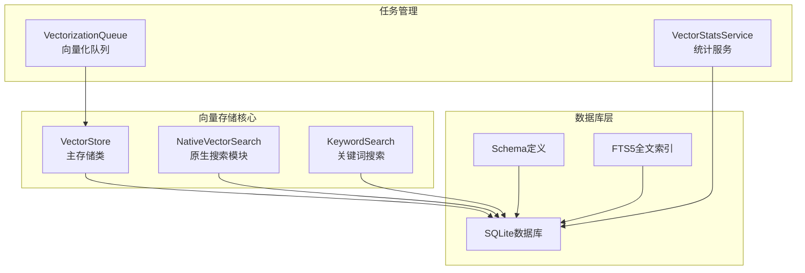
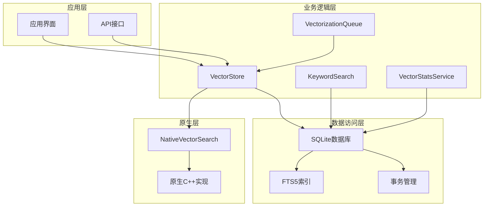
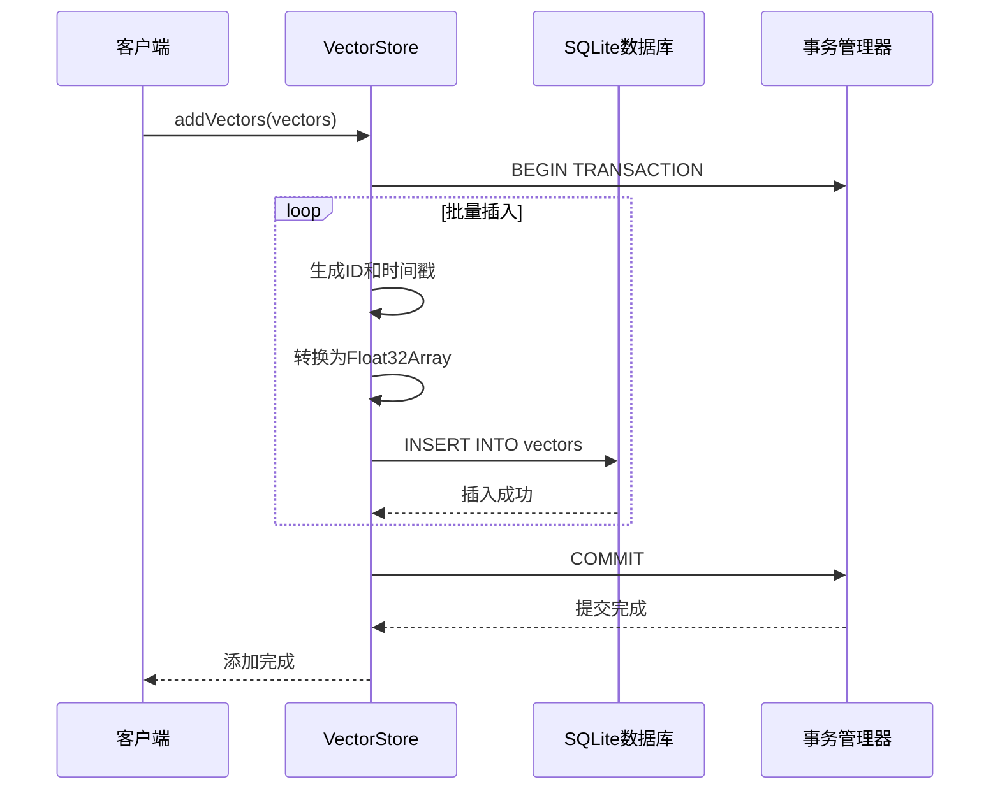
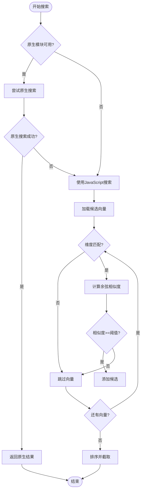
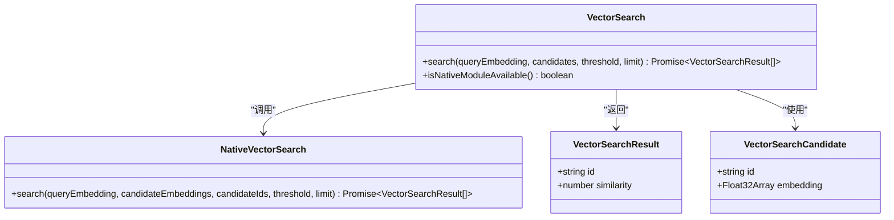
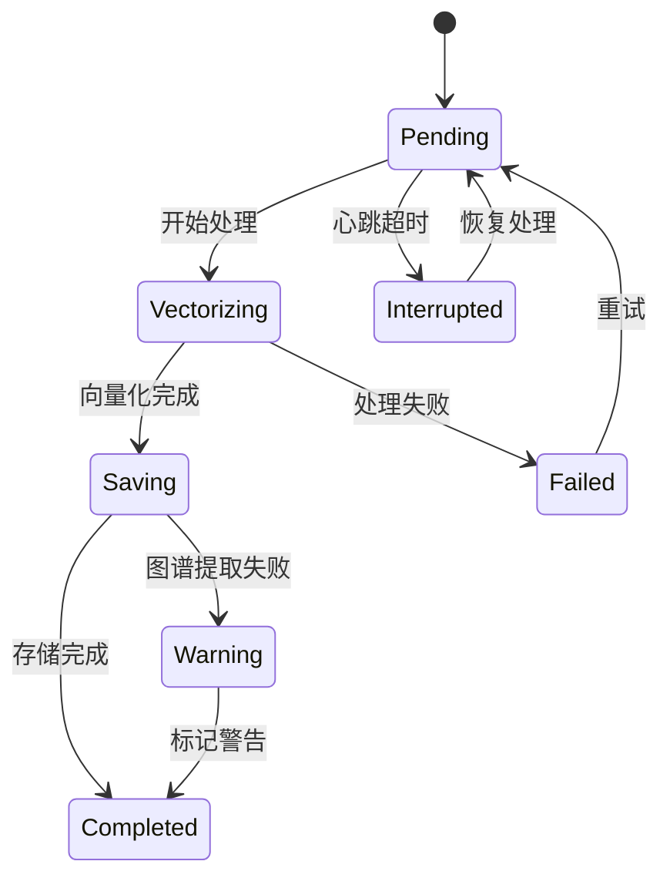
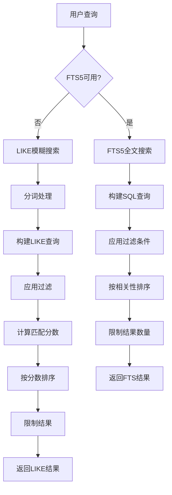
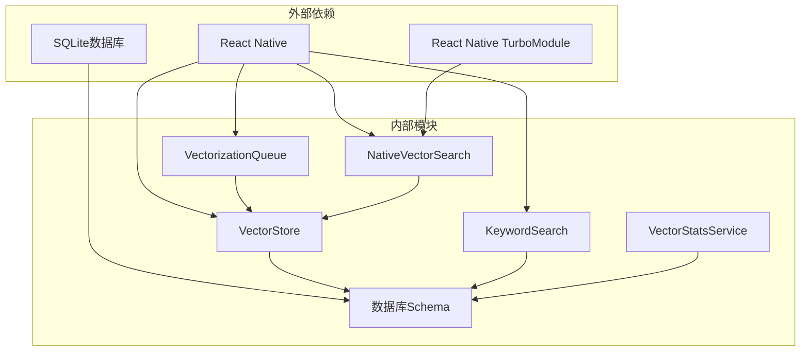
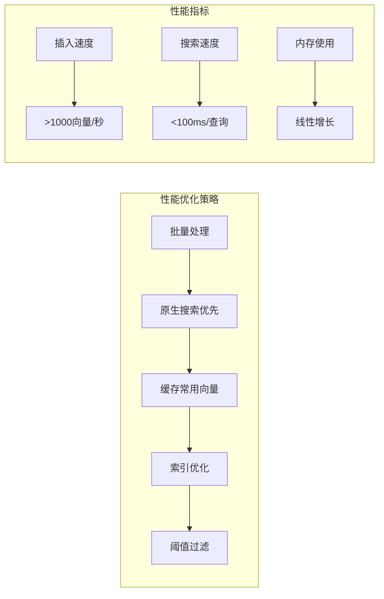
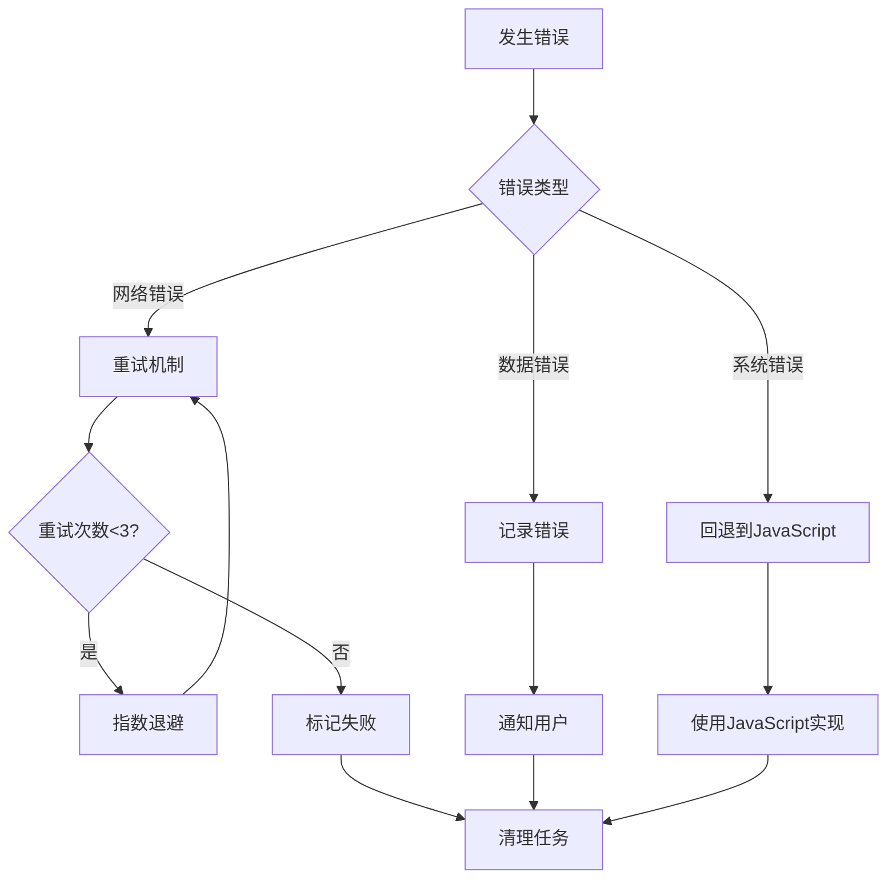

# 向量存储系统

<cite>
**本文档引用的文件**
- [vector-store.ts](file://src/lib/rag/vector-store.ts)
- [NativeVectorSearch.ts](file://src/native/VectorSearch/NativeVectorSearch.ts)
- [index.ts](file://src/native/VectorSearch/index.ts)
- [schema.ts](file://src/lib/db/schema.ts)
- [vectorization-queue.ts](file://src/lib/rag/vectorization-queue.ts)
- [keyword-search.ts](file://src/lib/rag/keyword-search.ts)
- [vector-stats.ts](file://src/lib/rag/vector-stats.ts)
- [vector-store.benchmark.ts](file://src/lib/rag/__tests__/vector-store.benchmark.ts)
</cite>

## 目录
1. [简介](#简介)
2. [项目结构](#项目结构)
3. [核心组件](#核心组件)
4. [架构概览](#架构概览)
5. [详细组件分析](#详细组件分析)
6. [依赖关系分析](#依赖关系分析)
7. [性能考虑](#性能考虑)
8. [故障排除指南](#故障排除指南)
9. [结论](#结论)

## 简介

Nexara的向量存储系统是一个基于SQLite的嵌入式向量数据库，专为React Native应用设计。该系统提供了完整的向量数据管理功能，包括向量的存储、检索、过滤和清理。系统采用双引擎架构，结合原生C++加速和JavaScript回退方案，确保在不同设备上都能提供高效的向量相似度搜索能力。

## 项目结构

向量存储系统主要分布在以下目录和文件中：

**图表来源**
- [vector-store.ts:1-376](file://src/lib/rag/vector-store.ts#L1-L376)
- [schema.ts:153-210](file://src/lib/db/schema.ts#L153-L210)

**章节来源**
- [vector-store.ts:1-376](file://src/lib/rag/vector-store.ts#L1-L376)
- [schema.ts:153-210](file://src/lib/db/schema.ts#L153-L210)

## 核心组件

### VectorStore类架构

VectorStore是整个向量存储系统的核心，负责向量数据的增删改查操作。该类采用了以下设计模式：

- **工厂模式**: 生成唯一ID标识符
- **适配器模式**: 将JavaScript数组转换为Float32Array进行二进制存储
- **策略模式**: 支持原生搜索和JavaScript回退两种实现

### 数据结构设计

系统定义了标准的向量记录格式：

| 字段名 | 类型 | 描述 | 必填 |
|--------|------|------|------|
| id | string | 唯一标识符 | 是 |
| docId | string | 文档ID（可选） | 否 |
| sessionId | string | 会话ID（可选） | 否 |
| content | string | 向量内容文本 | 是 |
| embedding | number[] | 浮点数向量 | 是 |
| metadata | Record<string, any> | 元数据JSON | 否 |
| startMessageId | string | 起始消息ID | 否 |
| endMessageId | string | 结束消息ID | 否 |
| createdAt | number | 创建时间戳 | 是 |

**章节来源**
- [vector-store.ts:5-20](file://src/lib/rag/vector-store.ts#L5-L20)
- [schema.ts:157-169](file://src/lib/db/schema.ts#L157-L169)

## 架构概览

向量存储系统采用分层架构设计，确保各组件职责清晰：

**图表来源**
- [vector-store.ts:22-376](file://src/lib/rag/vector-store.ts#L22-L376)
- [vectorization-queue.ts:22-804](file://src/lib/rag/vectorization-queue.ts#L22-L804)

## 详细组件分析

### VectorStore类详细分析

#### 向量添加流程

向量添加采用批量事务处理，确保数据一致性和性能：

**图表来源**
- [vector-store.ts:31-60](file://src/lib/rag/vector-store.ts#L31-L60)

#### 搜索算法实现

系统实现了双引擎搜索架构：

**图表来源**
- [vector-store.ts:62-113](file://src/lib/rag/vector-store.ts#L62-L113)
- [vector-store.ts:115-215](file://src/lib/rag/vector-store.ts#L115-L215)

#### 原生搜索实现

原生搜索模块提供了高性能的向量相似度计算：

**图表来源**
- [index.ts:15-52](file://src/native/VectorSearch/index.ts#L15-L52)
- [NativeVectorSearch.ts:4-18](file://src/native/VectorSearch/NativeVectorSearch.ts#L4-L18)

**章节来源**
- [vector-store.ts:31-215](file://src/lib/rag/vector-store.ts#L31-L215)
- [index.ts:15-52](file://src/native/VectorSearch/index.ts#L15-L52)

### 向量化队列管理

VectorizationQueue实现了向量化的后台处理机制：

**图表来源**
- [vectorization-queue.ts:161-250](file://src/lib/rag/vectorization-queue.ts#L161-L250)

**章节来源**
- [vectorization-queue.ts:22-804](file://src/lib/rag/vectorization-queue.ts#L22-L804)

### 关键词搜索实现

系统提供了关键词搜索作为向量搜索的补充：

**图表来源**
- [keyword-search.ts:16-105](file://src/lib/rag/keyword-search.ts#L16-L105)

**章节来源**
- [keyword-search.ts:9-200](file://src/lib/rag/keyword-search.ts#L9-L200)

## 依赖关系分析

向量存储系统的依赖关系如下：

**图表来源**
- [vector-store.ts:1-3](file://src/lib/rag/vector-store.ts#L1-L3)
- [vectorization-queue.ts:1-11](file://src/lib/rag/vectorization-queue.ts#L1-L11)

**章节来源**
- [vector-store.ts:1-3](file://src/lib/rag/vector-store.ts#L1-L3)
- [vectorization-queue.ts:1-11](file://src/lib/rag/vectorization-queue.ts#L1-L11)

## 性能考虑

### 向量维度管理

系统支持动态向量维度，但要求查询向量与存储向量维度一致：

- **维度验证**: 搜索前检查向量维度匹配
- **错误处理**: 维度不匹配时记录警告并跳过相关向量
- **性能影响**: 维度不匹配会导致额外的CPU开销

### 相似度计算优化

**图表来源**
- [vector-store.benchmark.ts:10-77](file://src/lib/rag/__tests__/vector-store.benchmark.ts#L10-L77)

### 内存清理最佳实践

系统提供了多种清理策略：

- **按文档清理**: 删除特定文档的所有向量
- **按会话清理**: 清理特定会话的记忆向量
- **冗余清理**: 自动清理重复的记忆向量
- **孤立数据清理**: 清理不再使用的会话和知识图谱数据

**章节来源**
- [vector-store.ts:235-372](file://src/lib/rag/vector-store.ts#L235-L372)
- [vector-store.benchmark.ts:10-77](file://src/lib/rag/__tests__/vector-store.benchmark.ts#L10-L77)

## 故障排除指南

### 常见问题及解决方案

| 问题类型 | 症状 | 解决方案 |
|----------|------|----------|
| 维度不匹配 | 搜索返回0结果 | 检查向量模型一致性 |
| 原生模块不可用 | 搜索性能下降 | 检查原生模块编译 |
| SQLite锁定 | 插入失败 | 检查事务状态 |
| 内存泄漏 | 应用卡顿 | 清理临时向量数据 |

### 错误处理机制

系统实现了多层次的错误处理：

**图表来源**
- [vectorization-queue.ts:200-250](file://src/lib/rag/vectorization-queue.ts#L200-L250)

**章节来源**
- [vectorization-queue.ts:200-250](file://src/lib/rag/vectorization-queue.ts#L200-L250)

## 结论

Nexara的向量存储系统是一个设计精良的嵌入式向量数据库，具有以下特点：

1. **高性能**: 采用原生C++加速和JavaScript回退的双引擎架构
2. **可靠性**: 完善的事务管理和错误处理机制
3. **可扩展性**: 支持增量向量化和后台处理
4. **易用性**: 简洁的API接口和丰富的过滤选项

系统特别适合移动端应用的向量检索需求，在保证性能的同时提供了良好的用户体验。通过合理的配置和监控，可以进一步优化系统的性能表现。