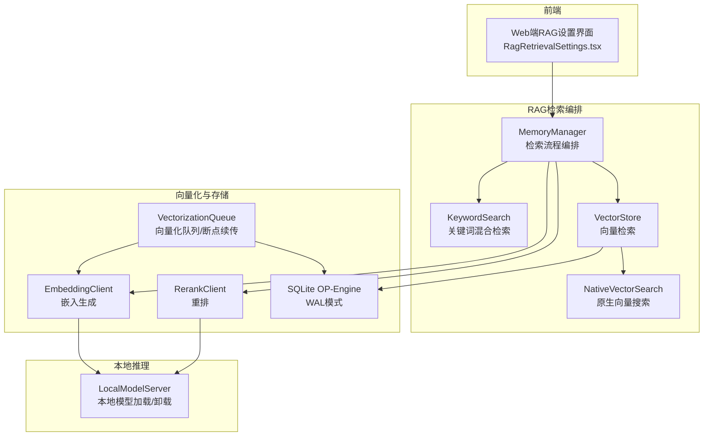
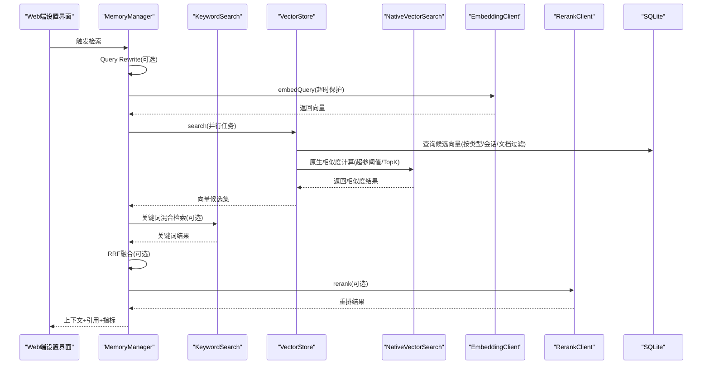
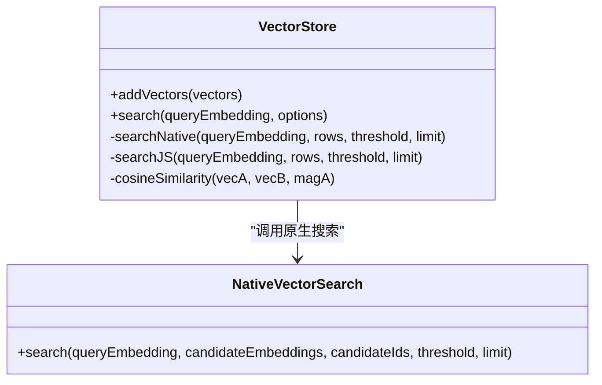
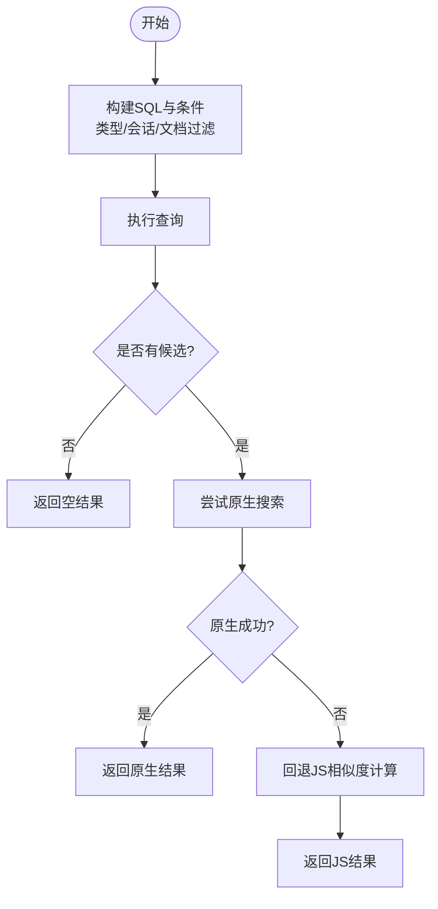
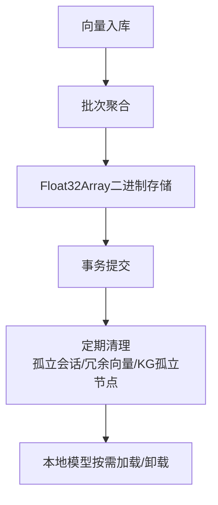
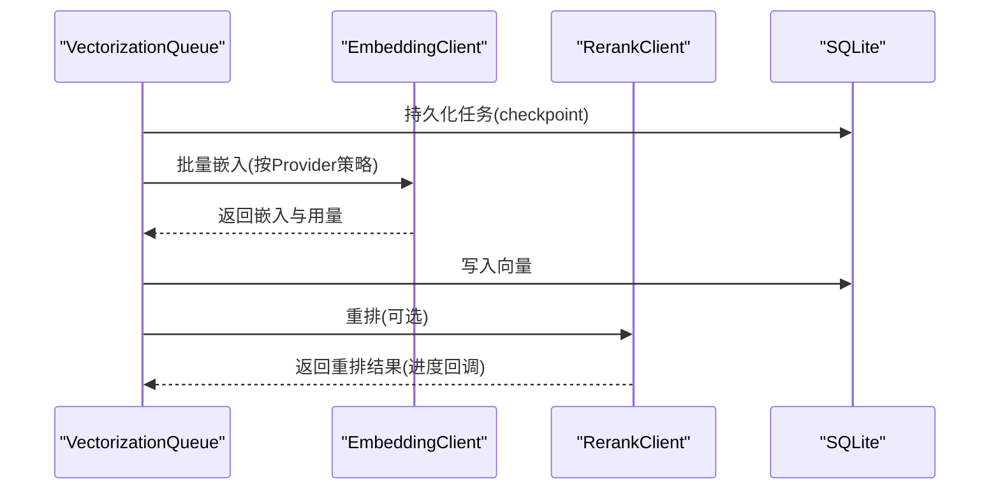
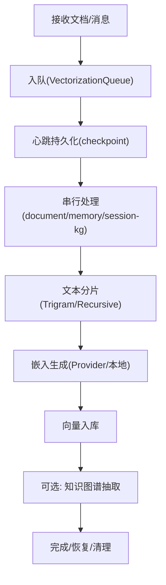
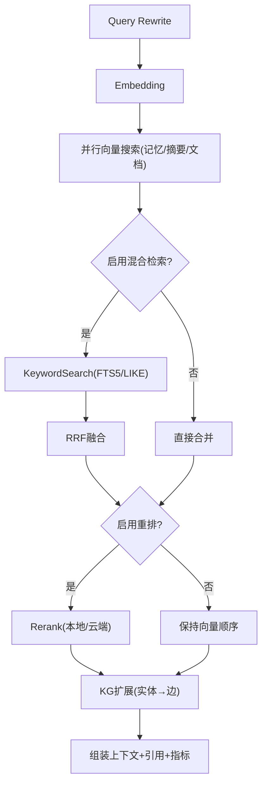
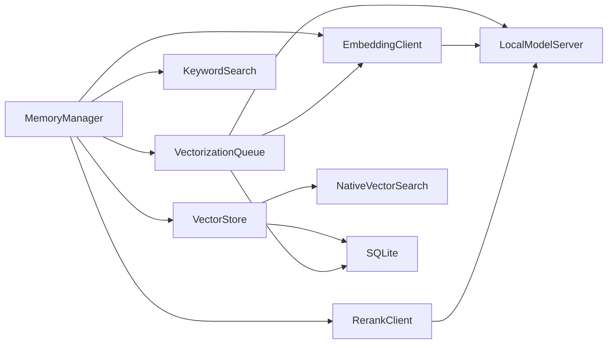

# 性能优化策略

<cite>
**本文引用的文件**
- [src/native/VectorSearch/index.ts](file://src/native/VectorSearch/index.ts)
- [src/native/VectorSearch/NativeVectorSearch.ts](file://src/native/VectorSearch/NativeVectorSearch.ts)
- [src/lib/rag/vector-store.ts](file://src/lib/rag/vector-store.ts)
- [src/lib/rag/memory-manager.ts](file://src/lib/rag/memory-manager.ts)
- [src/lib/rag/vectorization-queue.ts](file://src/lib/rag/vectorization-queue.ts)
- [src/lib/rag/embedding.ts](file://src/lib/rag/embedding.ts)
- [src/lib/rag/reranker.ts](file://src/lib/rag/reranker.ts)
- [src/lib/rag/query-rewriter.ts](file://src/lib/rag/query-rewriter.ts)
- [src/lib/local-inference/LocalModelServer.ts](file://src/lib/local-inference/LocalModelServer.ts)
- [src/lib/db/index.ts](file://src/lib/db/index.ts)
- [src/lib/rag/text-splitter.ts](file://src/lib/rag/text-splitter.ts)
- [src/lib/rag/keyword-search.ts](file://src/lib/rag/keyword-search.ts)
- [src/types/rag.ts](file://src/types/rag.ts)
- [web-client/src/pages/settings/RagRetrievalSettings.tsx](file://web-client/src/pages/settings/RagRetrievalSettings.tsx)
</cite>

## 目录
1. [简介](#简介)
2. [项目结构](#项目结构)
3. [核心组件](#核心组件)
4. [架构总览](#架构总览)
5. [详细组件分析](#详细组件分析)
6. [依赖分析](#依赖分析)
7. [性能考量](#性能考量)
8. [故障排查指南](#故障排查指南)
9. [结论](#结论)
10. [附录](#附录)

## 简介
本文件面向Nexara的RAG系统，聚焦性能优化策略，覆盖向量搜索的原生模块加速与内存管理、数据库查询优化、内存使用优化（向量压缩、批量处理、垃圾回收）、网络传输优化（向量序列化、增量更新、断点续传）、以及大规模数据处理的最佳实践（分片策略、异步处理、资源调度）。同时提供性能监控、基准测试与调优指南，帮助在移动端与Web端实现稳定高效的RAG检索与重排。

## 项目结构
围绕RAG性能的关键目录与文件如下：
- 原生向量搜索桥接：src/native/VectorSearch/*
- 向量存储与检索：src/lib/rag/vector-store.ts
- RAG检索编排：src/lib/rag/memory-manager.ts
- 向量化队列与断点续传：src/lib/rag/vectorization-queue.ts
- 嵌入与重排：src/lib/rag/embedding.ts、src/lib/rag/reranker.ts
- 查询重写：src/lib/rag/query-rewriter.ts
- 本地推理与模型加载：src/lib/local-inference/LocalModelServer.ts
- 数据库与索引：src/lib/db/index.ts
- 文本分片：src/lib/rag/text-splitter.ts
- 关键词混合检索：src/lib/rag/keyword-search.ts
- 类型定义：src/types/rag.ts
- Web端检索设置UI：web-client/src/pages/settings/RagRetrievalSettings.tsx

图表来源
- [src/lib/rag/memory-manager.ts](file://src/lib/rag/memory-manager.ts)
- [src/lib/rag/vector-store.ts](file://src/lib/rag/vector-store.ts)
- [src/native/VectorSearch/index.ts](file://src/native/VectorSearch/index.ts)
- [src/lib/rag/vectorization-queue.ts](file://src/lib/rag/vectorization-queue.ts)
- [src/lib/rag/embedding.ts](file://src/lib/rag/embedding.ts)
- [src/lib/rag/reranker.ts](file://src/lib/rag/reranker.ts)
- [src/lib/db/index.ts](file://src/lib/db/index.ts)
- [src/lib/local-inference/LocalModelServer.ts](file://src/lib/local-inference/LocalModelServer.ts)

章节来源
- [src/lib/rag/memory-manager.ts](file://src/lib/rag/memory-manager.ts)
- [src/lib/rag/vector-store.ts](file://src/lib/rag/vector-store.ts)
- [src/native/VectorSearch/index.ts](file://src/native/VectorSearch/index.ts)
- [src/lib/rag/vectorization-queue.ts](file://src/lib/rag/vectorization-queue.ts)
- [src/lib/rag/embedding.ts](file://src/lib/rag/embedding.ts)
- [src/lib/rag/reranker.ts](file://src/lib/rag/reranker.ts)
- [src/lib/db/index.ts](file://src/lib/db/index.ts)
- [src/lib/local-inference/LocalModelServer.ts](file://src/lib/local-inference/LocalModelServer.ts)

## 核心组件
- 原生向量搜索桥接：通过TurboModule暴露search接口，将候选向量与查询向量交由原生实现进行相似度计算，显著降低JS线程开销。
- 向量存储与检索：统一的向量表结构，支持按文档/会话/类型过滤；优先走原生搜索，失败时回退至JS实现。
- 检索编排：Query Rewrite、Embedding、并行向量搜索、混合检索（RRF融合）、重排、知识图谱扩展等阶段化流程，带超时保护与进度回调。
- 向量化队列：串行处理、心跳持久化、断点续传、可重试机制、状态上报，支持文档/记忆/会话KG三类任务。
- 本地推理：模型加载、卸载、并发互斥、GPU加速信息、嵌入与重排能力。
- 数据库：WAL模式开启、外键约束启用，提升并发与一致性。
- 文本分片：递归字符分片与三gram中文友好分词，支持重叠拼接。
- 关键词检索：FTS5全文检索降级方案，LIKE回退，支持文档过滤与排序。

章节来源
- [src/native/VectorSearch/NativeVectorSearch.ts](file://src/native/VectorSearch/NativeVectorSearch.ts)
- [src/native/VectorSearch/index.ts](file://src/native/VectorSearch/index.ts)
- [src/lib/rag/vector-store.ts](file://src/lib/rag/vector-store.ts)
- [src/lib/rag/memory-manager.ts](file://src/lib/rag/memory-manager.ts)
- [src/lib/rag/vectorization-queue.ts](file://src/lib/rag/vectorization-queue.ts)
- [src/lib/local-inference/LocalModelServer.ts](file://src/lib/local-inference/LocalModelServer.ts)
- [src/lib/db/index.ts](file://src/lib/db/index.ts)
- [src/lib/rag/text-splitter.ts](file://src/lib/rag/text-splitter.ts)
- [src/lib/rag/keyword-search.ts](file://src/lib/rag/keyword-search.ts)

## 架构总览
下图展示RAG检索主链路：查询重写→嵌入→并行向量搜索→混合检索→重排→知识图谱扩展→上下文组装。

图表来源
- [src/lib/rag/memory-manager.ts](file://src/lib/rag/memory-manager.ts)
- [src/lib/rag/vector-store.ts](file://src/lib/rag/vector-store.ts)
- [src/native/VectorSearch/index.ts](file://src/native/VectorSearch/index.ts)
- [src/lib/rag/embedding.ts](file://src/lib/rag/embedding.ts)
- [src/lib/rag/reranker.ts](file://src/lib/rag/reranker.ts)
- [src/lib/rag/keyword-search.ts](file://src/lib/rag/keyword-search.ts)

## 详细组件分析

### 原生向量搜索与内存管理
- 原生模块：通过TurboModule注册VectorSearch，提供search(query, candidates, ids, threshold, limit)接口；在候选向量非空时优先调用，失败则回退JS实现。
- 内存管理：VectorStore将浮点向量以Float32Array形式存入Blob，读取时转换；JS侧实现余弦相似度计算，带维度不匹配告警与降级提示。
- 优化要点：
  - 仅在候选集非空时触发原生搜索，避免无效调用。
  - 候选向量与查询向量维度一致校验，防止运行时崩溃。
  - 原生模块不可用时自动回退，保证稳定性。

图表来源
- [src/lib/rag/vector-store.ts](file://src/lib/rag/vector-store.ts)
- [src/native/VectorSearch/NativeVectorSearch.ts](file://src/native/VectorSearch/NativeVectorSearch.ts)

章节来源
- [src/native/VectorSearch/index.ts](file://src/native/VectorSearch/index.ts)
- [src/native/VectorSearch/NativeVectorSearch.ts](file://src/native/VectorSearch/NativeVectorSearch.ts)
- [src/lib/rag/vector-store.ts](file://src/lib/rag/vector-store.ts)

### 数据库查询优化
- WAL模式：开启WAL提升并发读写性能与可靠性。
- 外键约束：启用外键，保障数据一致性。
- 查询策略：
  - 向量检索：按类型/会话/文档ID过滤，必要时结合FTS5全文索引（关键词检索）。
  - 关键词检索：优先FTS5 MATCH，支持排除文档、按会话过滤、LIMIT扩大召回后排序。
  - 事务批处理：批量插入向量使用事务，减少磁盘写放大。

图表来源
- [src/lib/rag/vector-store.ts](file://src/lib/rag/vector-store.ts)
- [src/lib/rag/keyword-search.ts](file://src/lib/rag/keyword-search.ts)
- [src/lib/db/index.ts](file://src/lib/db/index.ts)

章节来源
- [src/lib/db/index.ts](file://src/lib/db/index.ts)
- [src/lib/rag/vector-store.ts](file://src/lib/rag/vector-store.ts)
- [src/lib/rag/keyword-search.ts](file://src/lib/rag/keyword-search.ts)

### 内存使用优化
- 向量存储：Float32Array二进制存储，减少JS对象内存占用。
- 批量处理：嵌入生成与向量入库采用批处理，降低网络/IO开销。
- 垃圾回收：VectorStore提供清理孤立会话/文档KG、清理冗余记忆向量、按会话裁剪等功能，避免长期积累导致内存膨胀。
- 本地模型：LocalModelServer提供模型加载/卸载与并发互斥，避免多任务争抢资源。

图表来源
- [src/lib/rag/vector-store.ts](file://src/lib/rag/vector-store.ts)
- [src/lib/local-inference/LocalModelServer.ts](file://src/lib/local-inference/LocalModelServer.ts)

章节来源
- [src/lib/rag/vector-store.ts](file://src/lib/rag/vector-store.ts)
- [src/lib/local-inference/LocalModelServer.ts](file://src/lib/local-inference/LocalModelServer.ts)

### 网络传输优化
- 嵌入与重排：EmbeddingClient与RerankClient封装不同Provider（OpenAI/Vertex/Gemini/本地），统一批量/逐条调用策略，并在本地模型不可用时优雅降级。
- 进度上报：RerankClient支持onProgress回调，上报TX/RX字节与延迟，便于UI与监控。
- 断点续传：向量化队列持久化任务状态与lastChunkIndex，App唤醒后恢复处理。

图表来源
- [src/lib/rag/vectorization-queue.ts](file://src/lib/rag/vectorization-queue.ts)
- [src/lib/rag/embedding.ts](file://src/lib/rag/embedding.ts)
- [src/lib/rag/reranker.ts](file://src/lib/rag/reranker.ts)

章节来源
- [src/lib/rag/embedding.ts](file://src/lib/rag/embedding.ts)
- [src/lib/rag/reranker.ts](file://src/lib/rag/reranker.ts)
- [src/lib/rag/vectorization-queue.ts](file://src/lib/rag/vectorization-queue.ts)

### 大规模数据处理最佳实践
- 分片策略：TrigramTextSplitter与RecursiveCharacterTextSplitter配合，支持中文与英文场景；chunkOverlap降低语义割裂。
- 异步处理：MemoryManager将对话轮次归档入队，VectorizationQueue串行处理，避免UI阻塞。
- 资源调度：本地模型按需加载，释放时卸载；向量化队列心跳检测与断点续传，保障长时间任务的可靠性。

图表来源
- [src/lib/rag/vectorization-queue.ts](file://src/lib/rag/vectorization-queue.ts)
- [src/lib/rag/text-splitter.ts](file://src/lib/rag/text-splitter.ts)
- [src/lib/rag/embedding.ts](file://src/lib/rag/embedding.ts)

章节来源
- [src/lib/rag/vectorization-queue.ts](file://src/lib/rag/vectorization-queue.ts)
- [src/lib/rag/text-splitter.ts](file://src/lib/rag/text-splitter.ts)
- [src/lib/rag/embedding.ts](file://src/lib/rag/embedding.ts)

### 检索流程与超时保护
- 并行向量搜索：记忆/摘要/文档三类任务并行执行，15秒超时保护，失败不阻塞整体流程。
- 混合检索：RRF融合向量与关键词结果，支持权重与BM25增益。
- 重排：可选本地/云端重排，支持进度回调与降级回退。
- 知识图谱：基于召回文本实体扩展一跳关系，应用文档权限过滤。

图表来源
- [src/lib/rag/memory-manager.ts](file://src/lib/rag/memory-manager.ts)
- [src/lib/rag/keyword-search.ts](file://src/lib/rag/keyword-search.ts)
- [src/lib/rag/reranker.ts](file://src/lib/rag/reranker.ts)

章节来源
- [src/lib/rag/memory-manager.ts](file://src/lib/rag/memory-manager.ts)
- [src/lib/rag/keyword-search.ts](file://src/lib/rag/keyword-search.ts)
- [src/lib/rag/reranker.ts](file://src/lib/rag/reranker.ts)

## 依赖分析
- 组件耦合：
  - MemoryManager依赖VectorStore、EmbeddingClient、RerankClient、KeywordSearch、VectorizationQueue。
  - VectorStore依赖NativeVectorSearch与SQLite。
  - VectorizationQueue依赖EmbeddingClient、SQLite、LocalModelServer。
  - LocalModelServer为EmbeddingClient与RerankClient提供本地推理能力。
- 外部依赖：
  - OP-Engine SQLite（WAL、外键）。
  - llama.rn（本地推理、嵌入、重排）。
  - 各类LLM Provider（OpenAI/Vertex/Gemini）。

图表来源
- [src/lib/rag/memory-manager.ts](file://src/lib/rag/memory-manager.ts)
- [src/lib/rag/vector-store.ts](file://src/lib/rag/vector-store.ts)
- [src/native/VectorSearch/index.ts](file://src/native/VectorSearch/index.ts)
- [src/lib/rag/vectorization-queue.ts](file://src/lib/rag/vectorization-queue.ts)
- [src/lib/rag/embedding.ts](file://src/lib/rag/embedding.ts)
- [src/lib/rag/reranker.ts](file://src/lib/rag/reranker.ts)
- [src/lib/local-inference/LocalModelServer.ts](file://src/lib/local-inference/LocalModelServer.ts)
- [src/lib/db/index.ts](file://src/lib/db/index.ts)

章节来源
- [src/lib/rag/memory-manager.ts](file://src/lib/rag/memory-manager.ts)
- [src/lib/rag/vector-store.ts](file://src/lib/rag/vector-store.ts)
- [src/native/VectorSearch/index.ts](file://src/native/VectorSearch/index.ts)
- [src/lib/rag/vectorization-queue.ts](file://src/lib/rag/vectorization-queue.ts)
- [src/lib/rag/embedding.ts](file://src/lib/rag/embedding.ts)
- [src/lib/rag/reranker.ts](file://src/lib/rag/reranker.ts)
- [src/lib/local-inference/LocalModelServer.ts](file://src/lib/local-inference/LocalModelServer.ts)
- [src/lib/db/index.ts](file://src/lib/db/index.ts)

## 性能考量
- 原生模块加速：候选集非空时调用原生相似度计算，显著降低CPU与JS线程压力。
- 并行与超时：检索阶段并行执行多个子任务，设置15秒超时，避免单点阻塞。
- 混合检索：RRF融合向量与关键词，提升召回质量与稳定性。
- 本地推理：本地模型按需加载，GPU加速信息可观察；失败自动回退云端。
- 数据库：WAL模式与外键约束提升并发与一致性；FTS5全文索引优化关键词检索。
- 断点续传：向量化队列持久化checkpoint，支持心跳检测与恢复，保障长任务可靠性。
- 文本分片：合理设置chunkSize与overlap，平衡召回与上下文长度。

## 故障排查指南
- 原生模块不可用：VectorStore在原生调用失败时回退JS实现，并输出警告；检查原生模块注册与候选向量维度。
- 维度不匹配：VectorStore在JS侧检测到维度不一致时发出告警并提示；确保嵌入模型与存储向量维度一致。
- 重排失败：RerankClient在网络错误或响应异常时回退原始顺序；检查Provider配置与网络状况。
- 本地模型未加载：LocalModelServer在生成嵌入前检查槽位状态，未加载时尝试自动加载或提示；确认模型路径与权限。
- 向量化失败：VectorizationQueue对可重试错误（网络/5xx/超时）进行指数退避重试，超过次数后标记失败并持久化错误信息；查看任务状态与日志。

章节来源
- [src/lib/rag/vector-store.ts](file://src/lib/rag/vector-store.ts)
- [src/lib/rag/reranker.ts](file://src/lib/rag/reranker.ts)
- [src/lib/local-inference/LocalModelServer.ts](file://src/lib/local-inference/LocalModelServer.ts)
- [src/lib/rag/vectorization-queue.ts](file://src/lib/rag/vectorization-queue.ts)

## 结论
通过原生向量搜索、并行检索、混合检索、本地推理与断点续传等策略，Nexara在移动端实现了高效稳定的RAG检索。建议在生产环境中持续关注以下指标：检索总时延、向量搜索时延、重排时延、召回数量与去重后数量、最大相似度、网络吞吐与错误率，并结合实际设备性能与数据规模进行参数调优。

## 附录
- Web端检索设置：可在Web端调整查询重写策略（hyde/multi-query/expansion）与相关开关，影响检索召回与质量。
- 类型定义：RAG任务类型、文档状态、向量记录等类型定义，便于理解数据流转与状态机。

章节来源
- [web-client/src/pages/settings/RagRetrievalSettings.tsx](file://web-client/src/pages/settings/RagRetrievalSettings.tsx)
- [src/types/rag.ts](file://src/types/rag.ts)