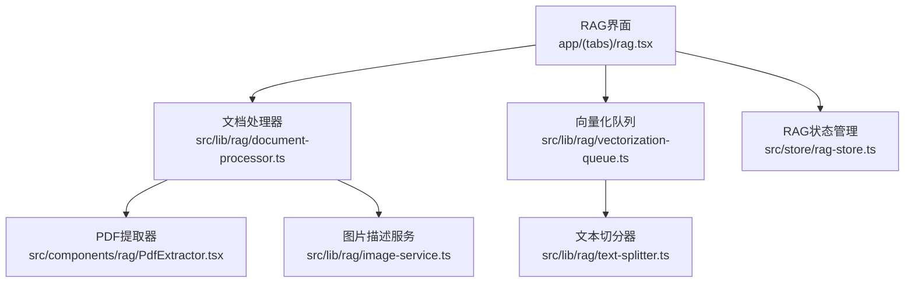
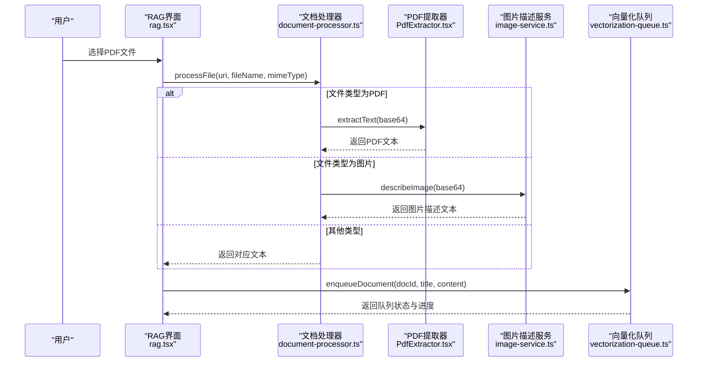
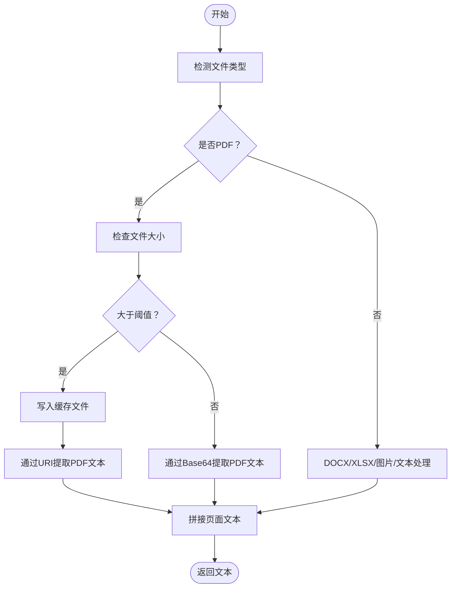
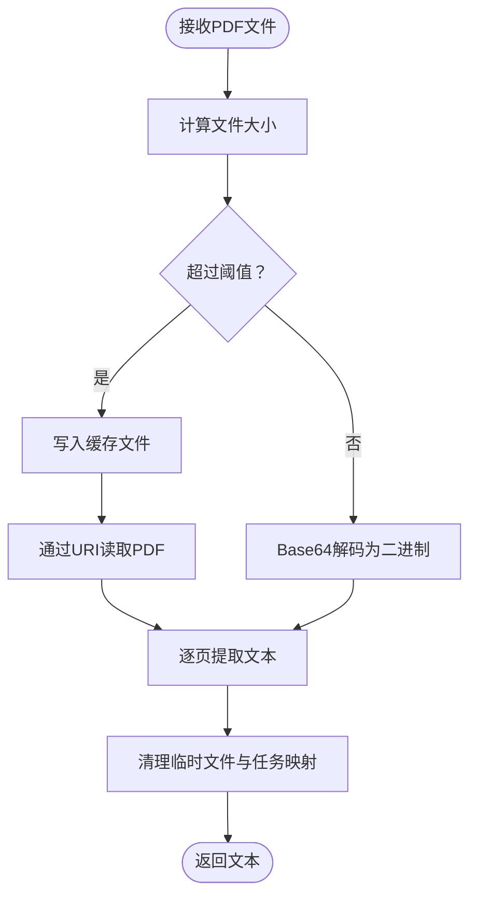
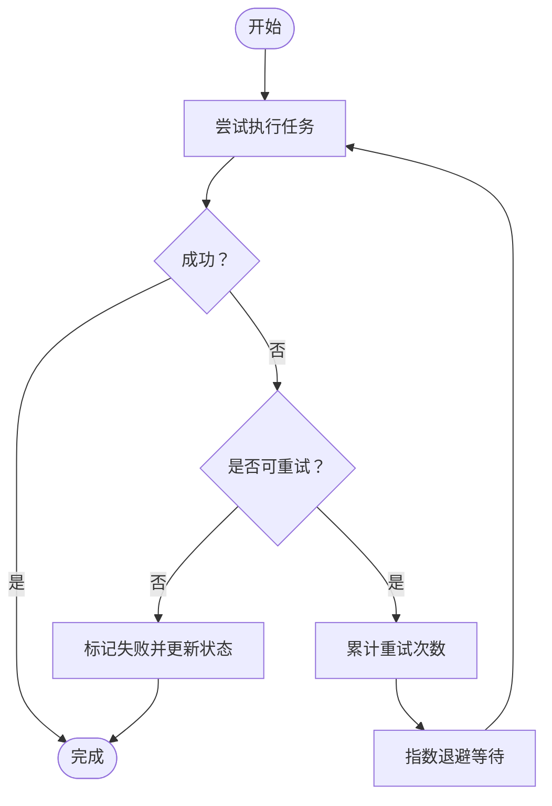
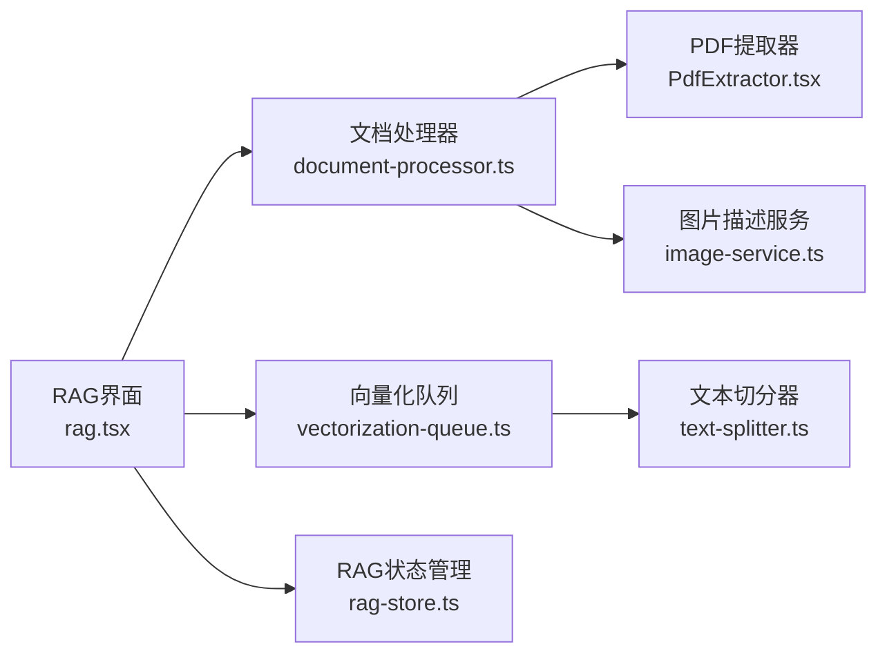

# PDF文档处理

<cite>
**本文档引用的文件**
- [PdfExtractor.tsx](file://src/components/rag/PdfExtractor.tsx)
- [document-processor.ts](file://src/lib/rag/document-processor.ts)
- [rag.tsx](file://app/(tabs)/rag.tsx)
- [vectorization-queue.ts](file://src/lib/rag/vectorization-queue.ts)
- [image-service.ts](file://src/lib/rag/image-service.ts)
- [text-splitter.ts](file://src/lib/rag/text-splitter.ts)
- [rag-store.ts](file://src/store/rag-store.ts)
</cite>

## 目录
1. [简介](#简介)
2. [项目结构](#项目结构)
3. [核心组件](#核心组件)
4. [架构总览](#架构总览)
5. [详细组件分析](#详细组件分析)
6. [依赖关系分析](#依赖关系分析)
7. [性能考虑](#性能考虑)
8. [故障排除指南](#故障排除指南)
9. [结论](#结论)

## 简介
本文件面向Nexara项目的PDF文档处理能力，围绕PDF文本提取、OCR集成、表格识别、图像处理、布局分析、元数据提取、大文件分页处理与内存优化、质量控制与错误处理、性能监控与故障排除等方面进行全面技术说明。文档以代码为依据，结合流程图与架构图，帮助开发者与使用者理解并高效使用PDF处理功能。

## 项目结构
与PDF处理直接相关的核心文件与职责如下：
- PdfExtractor.tsx：基于PDF.js在WebView中执行PDF文本提取，支持Base64与URI两种输入方式，并内置超时与临时文件清理机制。
- document-processor.ts：统一文档处理器，负责根据文件类型路由到对应处理逻辑（PDF、DOCX、XLSX、图片、文本），并对PDF通过PdfExtractor提取文本。
- rag.tsx：RAG主界面，负责文件导入、批量处理、向量化队列调度与UI交互，同时建立PdfExtractor与DocumentProcessor的引用绑定。
- vectorization-queue.ts：统一向量化队列，负责文档与记忆的向量化、KG抽取、重试与状态持久化。
- image-service.ts：图片描述服务，基于视觉模型生成图片语义描述，用于图像内容的文本化。
- text-splitter.ts：文本切分器，为向量化前的文本分块提供基础能力。
- rag-store.ts：RAG状态管理，包含文档、文件夹、记忆、向量化队列与处理状态等。

**图表来源**
- [rag.tsx](file://app/(tabs)/rag.tsx#L507-L591)
- [document-processor.ts:17-38](file://src/lib/rag/document-processor.ts#L17-L38)
- [PdfExtractor.tsx:80-146](file://src/components/rag/PdfExtractor.tsx#L80-L146)
- [image-service.ts:48-94](file://src/lib/rag/image-service.ts#L48-L94)
- [vectorization-queue.ts:44-76](file://src/lib/rag/vectorization-queue.ts#L44-L76)
- [text-splitter.ts:1-55](file://src/lib/rag/text-splitter.ts#L1-L55)
- [rag-store.ts:147-158](file://src/store/rag-store.ts#L147-L158)

**章节来源**
- [rag.tsx](file://app/(tabs)/rag.tsx#L507-L591)
- [document-processor.ts:17-38](file://src/lib/rag/document-processor.ts#L17-L38)
- [PdfExtractor.tsx:80-146](file://src/components/rag/PdfExtractor.tsx#L80-L146)
- [image-service.ts:48-94](file://src/lib/rag/image-service.ts#L48-L94)
- [vectorization-queue.ts:44-76](file://src/lib/rag/vectorization-queue.ts#L44-L76)
- [text-splitter.ts:1-55](file://src/lib/rag/text-splitter.ts#L1-L55)
- [rag-store.ts:147-158](file://src/store/rag-store.ts#L147-L158)

## 核心组件
- PDF提取器（PdfExtractor）
  - 通过PDF.js在WebView中解析PDF，逐页获取文本内容并拼接返回。
  - 支持超时控制与任务清理，超过阈值时将Base64写入缓存文件并通过URI方式读取，避免内存压力。
- 文档处理器（DocumentProcessor）
  - 根据文件名与MIME类型判断文件类型，对PDF调用PdfExtractor提取文本；对图片调用image-description服务生成描述文本；对Excel调用XLSX转换为文本；对Word调用mammoth转换为文本；对纯文本直接读取。
- 图片描述服务（ImageDescriptionService）
  - 自动选择具备视觉能力的LLM模型，构造多模态消息，调用模型生成图片语义描述，便于后续向量化与检索。
- 向量化队列（VectorizationQueue）
  - 统一管理文档与记忆的向量化任务，支持串行处理、重试与状态持久化，提供KG抽取与会话批量累积能力。
- 文本切分器（RecursiveCharacterTextSplitter）
  - 提供按分隔符递归切分与重合并的文本分块策略，为嵌入向量化提供高质量片段。

**章节来源**
- [PdfExtractor.tsx:11-12](file://src/components/rag/PdfExtractor.tsx#L11-L12)
- [PdfExtractor.tsx:54-65](file://src/components/rag/PdfExtractor.tsx#L54-L65)
- [PdfExtractor.tsx:100-109](file://src/components/rag/PdfExtractor.tsx#L100-L109)
- [document-processor.ts:40-63](file://src/lib/rag/document-processor.ts#L40-L63)
- [document-processor.ts:69-76](file://src/lib/rag/document-processor.ts#L69-L76)
- [image-service.ts:16-41](file://src/lib/rag/image-service.ts#L16-L41)
- [image-service.ts:48-94](file://src/lib/rag/image-service.ts#L48-L94)
- [vectorization-queue.ts:22-37](file://src/lib/rag/vectorization-queue.ts#L22-L37)
- [vectorization-queue.ts:44-76](file://src/lib/rag/vectorization-queue.ts#L44-L76)
- [text-splitter.ts:1-55](file://src/lib/rag/text-splitter.ts#L1-L55)

## 架构总览
PDF处理在应用中的端到端流程如下：
- 用户从设备选择PDF文件，RAG界面通过DocumentPicker读取文件。
- DocumentProcessor根据文件类型路由：PDF走PdfExtractor，图片走ImageDescriptionService，Excel走XLSX，Word走mammoth，文本直接读取。
- PDF提取结果经DocumentProcessor返回给RAG界面，随后进入向量化队列进行分块、嵌入与索引。
- 向量化过程中，队列支持重试、状态持久化与进度上报，最终更新文档状态。

**图表来源**
- [rag.tsx](file://app/(tabs)/rag.tsx#L507-L591)
- [document-processor.ts:17-38](file://src/lib/rag/document-processor.ts#L17-L38)
- [PdfExtractor.tsx:112-137](file://src/components/rag/PdfExtractor.tsx#L112-L137)
- [image-service.ts:48-94](file://src/lib/rag/image-service.ts#L48-L94)
- [vectorization-queue.ts:44-76](file://src/lib/rag/vectorization-queue.ts#L44-L76)

## 详细组件分析

### PDF文本提取与布局分析
- 提取机制
  - 使用PDF.js在WebView中加载PDF，逐页调用getTextContent获取文本项，拼接为全文。
  - 对超大文件采用“Base64写入缓存文件+URI读取”策略，避免内存峰值。
- 布局分析
  - 当前实现仅提取纯文本，未包含段落、标题层级与格式的结构化解析。
  - 若需更精细的布局分析（如表格、标题、段落边界），可在页面文本基础上增加规则引擎或引入专用解析库（例如基于坐标与字体信息的布局分析）。
- OCR集成
  - 仓库中未发现直接的OCR集成实现；对于扫描版PDF或含图片的PDF，建议在提取前进行OCR预处理（如Tesseract或在线OCR服务），再将文本合并到PDF提取结果中。
- 表格识别
  - 仓库中未发现专门的表格识别逻辑；可结合OCR与表格结构识别算法（如表格骨架提取与单元格合并）后，将表格内容转为可检索的文本结构。
- 图像处理
  - 图像内容通过ImageDescriptionService生成语义描述，作为文本化的一部分参与向量化。

**图表来源**
- [PdfExtractor.tsx:11-12](file://src/components/rag/PdfExtractor.tsx#L11-L12)
- [PdfExtractor.tsx:54-65](file://src/components/rag/PdfExtractor.tsx#L54-L65)
- [PdfExtractor.tsx:115-136](file://src/components/rag/PdfExtractor.tsx#L115-L136)
- [document-processor.ts:40-63](file://src/lib/rag/document-processor.ts#L40-L63)

**章节来源**
- [PdfExtractor.tsx:11-12](file://src/components/rag/PdfExtractor.tsx#L11-L12)
- [PdfExtractor.tsx:54-65](file://src/components/rag/PdfExtractor.tsx#L54-L65)
- [PdfExtractor.tsx:115-136](file://src/components/rag/PdfExtractor.tsx#L115-L136)
- [document-processor.ts:40-63](file://src/lib/rag/document-processor.ts#L40-L63)

### 元数据提取
- 当前实现未包含PDF元数据（作者、创建时间、主题标签等）的提取逻辑。
- 如需实现，可在PDF.js加载PDF后读取元数据字段，并将其与文档内容一起入库或在UI中展示。

**章节来源**
- [PdfExtractor.tsx:54-65](file://src/components/rag/PdfExtractor.tsx#L54-L65)

### 大PDF文件分页处理与内存优化
- 分页策略
  - 逐页获取文本内容，避免一次性加载整页文本造成内存峰值。
- 内存优化
  - 大文件阈值控制：超过阈值时写入缓存文件并通过URI读取，减少内存占用。
  - 任务超时与清理：设置超时定时器并在超时或完成后清理临时文件与任务映射。
- 并发与顺序
  - RAG界面在批量处理时采用较小的批大小与延迟，确保PDF顺序处理与稳定性。

**图表来源**
- [PdfExtractor.tsx:11-12](file://src/components/rag/PdfExtractor.tsx#L11-L12)
- [PdfExtractor.tsx:115-136](file://src/components/rag/PdfExtractor.tsx#L115-L136)
- [PdfExtractor.tsx:89-98](file://src/components/rag/PdfExtractor.tsx#L89-L98)
- [rag.tsx](file://app/(tabs)/rag.tsx#L904-L912)

**章节来源**
- [PdfExtractor.tsx:11-12](file://src/components/rag/PdfExtractor.tsx#L11-L12)
- [PdfExtractor.tsx:89-98](file://src/components/rag/PdfExtractor.tsx#L89-L98)
- [PdfExtractor.tsx:115-136](file://src/components/rag/PdfExtractor.tsx#L115-L136)
- [rag.tsx](file://app/(tabs)/rag.tsx#L904-L912)

### 质量控制与错误处理
- PDF提取超时与清理
  - 设置固定超时时间，超时后清理任务与临时文件，避免资源泄漏。
- 可重试错误
  - 向量化队列对可重试错误进行指数退避重试，最多三次；重试耗尽后标记失败并更新文档状态。
- 空内容拦截
  - 对图片描述失败的情况返回空内容，由调用方进行内容校验，避免无效文本进入向量化。
- 错误信息友好化
  - 将底层错误转换为友好的错误消息，便于用户理解与反馈。

**图表来源**
- [PdfExtractor.tsx:100-109](file://src/components/rag/PdfExtractor.tsx#L100-L109)
- [vectorization-queue.ts:212-240](file://src/lib/rag/vectorization-queue.ts#L212-L240)
- [document-processor.ts:122-136](file://src/lib/rag/document-processor.ts#L122-L136)

**章节来源**
- [PdfExtractor.tsx:100-109](file://src/components/rag/PdfExtractor.tsx#L100-L109)
- [vectorization-queue.ts:212-240](file://src/lib/rag/vectorization-queue.ts#L212-L240)
- [document-processor.ts:122-136](file://src/lib/rag/document-processor.ts#L122-L136)

### 性能监控与故障排除
- 性能监控
  - 向量化队列提供状态变更通知与进度上报，可用于前端显示与日志追踪。
  - RAG状态管理包含网络统计、阶段与子阶段信息，便于定位性能瓶颈。
- 故障排除
  - PDF提取超时：检查网络与文件大小，必要时降低批大小或增加延迟。
  - 图片描述失败：确认已启用具备视觉能力的模型，检查API密钥与提供商配置。
  - 向量化失败：查看错误友好化消息与数据库状态更新，必要时手动重试。

**章节来源**
- [vectorization-queue.ts:22-37](file://src/lib/rag/vectorization-queue.ts#L22-L37)
- [rag-store.ts:99-131](file://src/store/rag-store.ts#L99-L131)
- [image-service.ts:16-41](file://src/lib/rag/image-service.ts#L16-L41)

## 依赖关系分析
- 组件耦合
  - RAG界面与文档处理器之间通过动态导入与引用绑定建立松耦合。
  - 文档处理器与PDF提取器之间通过接口ref进行依赖注入，便于替换与测试。
  - 向量化队列与状态管理通过回调与持久化接口连接，保证状态一致性。
- 外部依赖
  - PDF.js用于PDF解析；mammoth用于DOCX；XLSX用于Excel；LLM客户端用于图片描述。
- 潜在循环依赖
  - 当前结构清晰，未见明显循环依赖；注意在新增组件时避免双向依赖。

**图表来源**
- [rag.tsx](file://app/(tabs)/rag.tsx#L194-L213)
- [document-processor.ts:13-15](file://src/lib/rag/document-processor.ts#L13-L15)
- [PdfExtractor.tsx:80-146](file://src/components/rag/PdfExtractor.tsx#L80-L146)
- [image-service.ts:48-94](file://src/lib/rag/image-service.ts#L48-L94)
- [vectorization-queue.ts:44-76](file://src/lib/rag/vectorization-queue.ts#L44-L76)
- [text-splitter.ts:1-55](file://src/lib/rag/text-splitter.ts#L1-L55)
- [rag-store.ts:147-158](file://src/store/rag-store.ts#L147-L158)

**章节来源**
- [rag.tsx](file://app/(tabs)/rag.tsx#L194-L213)
- [document-processor.ts:13-15](file://src/lib/rag/document-processor.ts#L13-L15)
- [PdfExtractor.tsx:80-146](file://src/components/rag/PdfExtractor.tsx#L80-L146)
- [image-service.ts:48-94](file://src/lib/rag/image-service.ts#L48-L94)
- [vectorization-queue.ts:44-76](file://src/lib/rag/vectorization-queue.ts#L44-L76)
- [text-splitter.ts:1-55](file://src/lib/rag/text-splitter.ts#L1-L55)
- [rag-store.ts:147-158](file://src/store/rag-store.ts#L147-L158)

## 性能考虑
- PDF提取
  - 逐页提取与阈值控制有效降低内存峰值；建议在UI层限制同时进行的PDF提取任务数量。
- 文本切分
  - 合理设置分块大小与重叠，平衡召回与效率；中文场景可结合三元文法切分器提升效果。
- 向量化
  - 串行处理避免资源争用；对失败任务进行指数退避重试，减少抖动。
- I/O与缓存
  - 大文件写入缓存文件可显著降低内存压力；确保及时清理临时文件，避免磁盘膨胀。

[本节为通用指导，无需特定文件引用]

## 故障排除指南
- PDF提取超时
  - 现象：任务在超时后报错并清理。
  - 排查：检查网络环境、文件大小与WebView可用性；适当提高超时阈值或降低批大小。
- 图片描述失败
  - 现象：返回空内容，调用方拦截无效文本。
  - 排查：确认已启用具备视觉能力的模型，检查API密钥与提供商配置。
- 向量化失败
  - 现象：任务标记失败并更新文档状态。
  - 排查：查看错误友好化消息与数据库状态，必要时手动重试或检查嵌入服务可用性。
- 文件导入异常
  - 现象：批量导入后提示统计信息。
  - 排查：检查文件类型支持列表与文件权限，确保缓存目录可写。

**章节来源**
- [PdfExtractor.tsx:100-109](file://src/components/rag/PdfExtractor.tsx#L100-L109)
- [document-processor.ts:122-136](file://src/lib/rag/document-processor.ts#L122-L136)
- [vectorization-queue.ts:212-240](file://src/lib/rag/vectorization-queue.ts#L212-L240)
- [rag.tsx](file://app/(tabs)/rag.tsx#L582-L591)

## 结论
Nexara的PDF文档处理以PDF.js为核心，结合文档处理器与向量化队列实现了从文件导入到文本提取、分块、嵌入与检索的完整链路。当前实现聚焦于纯文本提取与图片语义描述，尚未包含OCR、表格识别与精细布局分析。通过阈值控制、超时清理与指数退避重试等机制，系统在大文件与不稳定环境下仍具备较好的鲁棒性。未来可扩展OCR与表格识别能力，并增强布局结构化输出，以满足更复杂的文档理解需求。