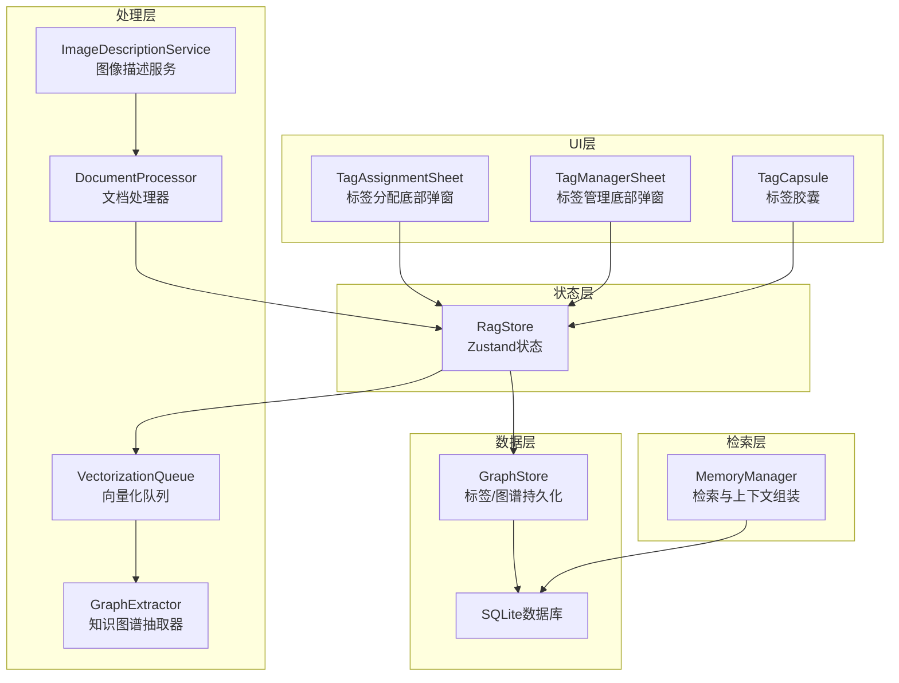
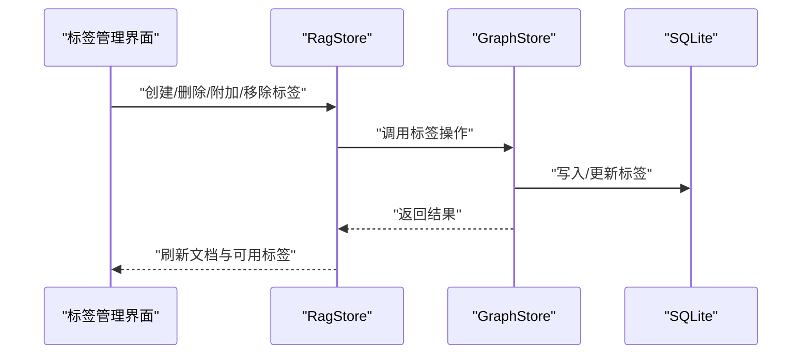
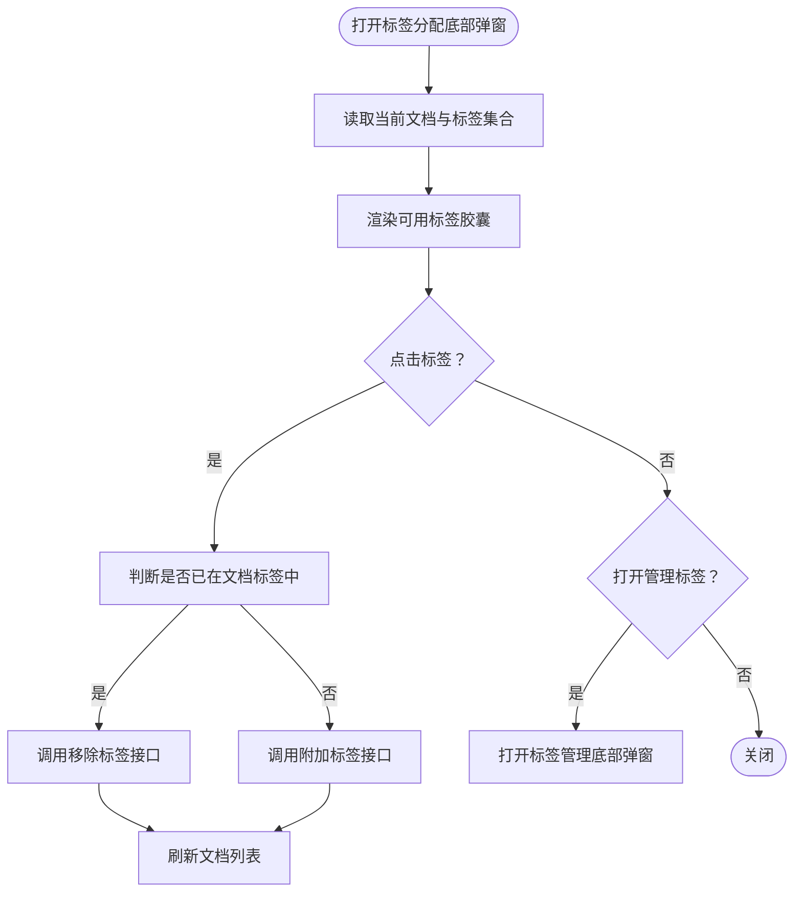
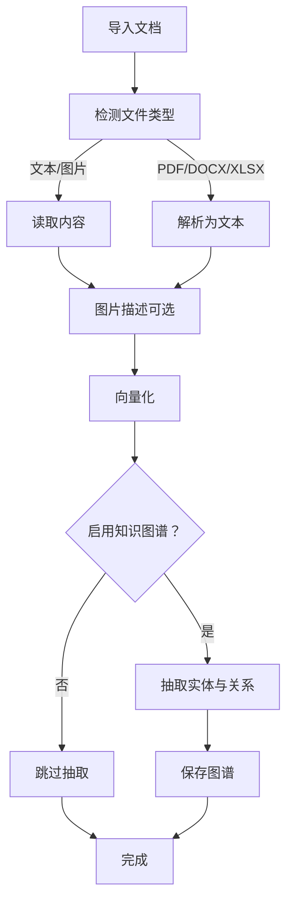
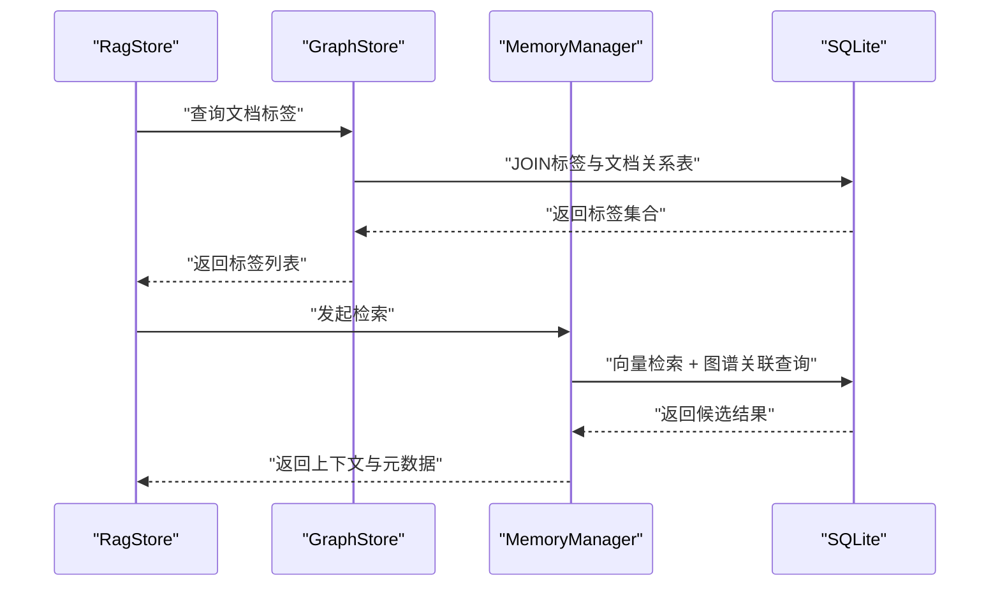
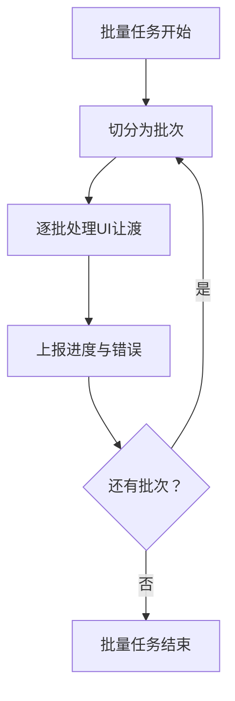
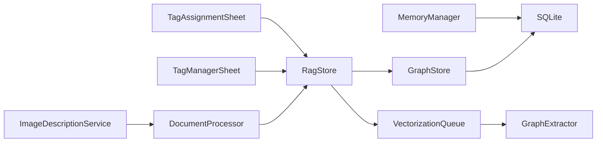

# 元数据与标签系统

<cite>
**本文档引用的文件**
- [app/(tabs)/rag.tsx](file://app/(tabs)/rag.tsx)
- [src/components/rag/TagAssignmentSheet.tsx](file://src/components/rag/TagAssignmentSheet.tsx)
- [src/components/rag/TagManagerSheet.tsx](file://src/components/rag/TagManagerSheet.tsx)
- [src/components/rag/TagCapsule.tsx](file://src/components/rag/TagCapsule.tsx)
- [src/lib/rag/graph-store.ts](file://src/lib/rag/graph-store.ts)
- [src/store/rag-store.ts](file://src/store/rag-store.ts)
- [src/lib/rag/document-processor.ts](file://src/lib/rag/document-processor.ts)
- [src/lib/rag/image-service.ts](file://src/lib/rag/image-service.ts)
- [src/lib/rag/vectorization-queue.ts](file://src/lib/rag/vectorization-queue.ts)
- [src/lib/rag/memory-manager.ts](file://src/lib/rag/memory-manager.ts)
- [src/lib/rag/graph-extractor.ts](file://src/lib/rag/graph-extractor.ts)
- [src/types/rag.ts](file://src/types/rag.ts)
- [src/lib/queue-utils.ts](file://src/lib/queue-utils.ts)
- [web-client/src/pages/settings/RagKgSettings.tsx](file://web-client/src/pages/settings/RagKgSettings.tsx)
</cite>

## 目录
1. [简介](#简介)
2. [项目结构](#项目结构)
3. [核心组件](#核心组件)
4. [架构总览](#架构总览)
5. [详细组件分析](#详细组件分析)
6. [依赖关系分析](#依赖关系分析)
7. [性能考量](#性能考量)
8. [故障排查指南](#故障排查指南)
9. [结论](#结论)
10. [附录](#附录)

## 简介
本文件面向Nexara的元数据与标签系统，系统性阐述文档元数据自动提取机制（文件属性、内容特征、主题分类）、标签管理（创建、分配、管理界面）、元数据质量控制与验证、标签与检索系统的集成、元数据标准化与格式化、以及批量元数据处理与自动化标记策略。目标是帮助开发者与产品人员快速理解并高效使用该系统。

## 项目结构
元数据与标签系统主要分布在以下模块：
- UI层：标签管理与分配的底部弹窗组件
- 状态层：Zustand状态管理，统一管理文档、标签、向量化队列与处理状态
- 数据层：SQLite数据库与GraphStore，负责标签与知识图谱的持久化
- 处理层：文档处理器、图像描述服务、向量化队列、知识图谱抽取器
- 检索层：内存管理器，负责检索与上下文组装

**图表来源**
- [src/components/rag/TagAssignmentSheet.tsx:1-125](file://src/components/rag/TagAssignmentSheet.tsx#L1-L125)
- [src/components/rag/TagManagerSheet.tsx:1-63](file://src/components/rag/TagManagerSheet.tsx#L1-L63)
- [src/components/rag/TagCapsule.tsx:1-50](file://src/components/rag/TagCapsule.tsx#L1-L50)
- [src/store/rag-store.ts:147-1013](file://src/store/rag-store.ts#L147-L1013)
- [src/lib/rag/graph-store.ts:1-547](file://src/lib/rag/graph-store.ts#L1-L547)
- [src/lib/rag/document-processor.ts:1-141](file://src/lib/rag/document-processor.ts#L1-L141)
- [src/lib/rag/image-service.ts:1-98](file://src/lib/rag/image-service.ts#L1-L98)
- [src/lib/rag/vectorization-queue.ts:1-804](file://src/lib/rag/vectorization-queue.ts#L1-L804)
- [src/lib/rag/memory-manager.ts:459-712](file://src/lib/rag/memory-manager.ts#L459-L712)

**章节来源**
- [app/(tabs)/rag.tsx](file://app/(tabs)/rag.tsx#L167-L213)
- [src/store/rag-store.ts:147-1013](file://src/store/rag-store.ts#L147-L1013)

## 核心组件
- 标签管理组件
  - 标签分配底部弹窗：支持为当前文档添加/移除标签，并跳转至标签管理
  - 标签管理底部弹窗：创建/删除标签，内置颜色选择器
  - 标签胶囊：展示标签名称与颜色，支持点击/长按交互
- 状态与存储
  - RagStore：集中管理文档、标签、向量化队列、处理状态；提供标签创建/删除/附加/移除接口
  - GraphStore：封装标签与知识图谱的数据库操作
- 文档与内容处理
  - DocumentProcessor：多格式文档解析（PDF、DOCX、XLSX、图片等），统一输出文本内容
  - ImageDescriptionService：基于视觉模型生成图片描述，用于向量化
- 检索与集成
  - VectorizationQueue：统一的向量化任务队列，支持文档与会话KG批量抽取
  - GraphExtractor：调用LLM抽取实体与关系，保存至图数据库
  - MemoryManager：检索阶段整合向量与图谱结果，生成最终上下文

**章节来源**
- [src/components/rag/TagAssignmentSheet.tsx:1-125](file://src/components/rag/TagAssignmentSheet.tsx#L1-L125)
- [src/components/rag/TagManagerSheet.tsx:1-63](file://src/components/rag/TagManagerSheet.tsx#L1-L63)
- [src/components/rag/TagCapsule.tsx:1-50](file://src/components/rag/TagCapsule.tsx#L1-L50)
- [src/store/rag-store.ts:895-938](file://src/store/rag-store.ts#L895-L938)
- [src/lib/rag/graph-store.ts:480-544](file://src/lib/rag/graph-store.ts#L480-L544)
- [src/lib/rag/document-processor.ts:10-141](file://src/lib/rag/document-processor.ts#L10-L141)
- [src/lib/rag/image-service.ts:12-98](file://src/lib/rag/image-service.ts#L12-L98)
- [src/lib/rag/vectorization-queue.ts:22-804](file://src/lib/rag/vectorization-queue.ts#L22-L804)
- [src/lib/rag/memory-manager.ts:459-712](file://src/lib/rag/memory-manager.ts#L459-L712)

## 架构总览
系统围绕“文档导入—内容解析—向量化—图谱抽取—标签管理—检索集成”形成闭环。RagStore作为中枢协调各模块，GraphStore负责标签与图谱持久化，VectorizationQueue串联处理流程，MemoryManager在检索阶段融合向量与图谱结果。

**图表来源**
- [src/components/rag/TagManagerSheet.tsx:38-63](file://src/components/rag/TagManagerSheet.tsx#L38-L63)
- [src/components/rag/TagAssignmentSheet.tsx:18-39](file://src/components/rag/TagAssignmentSheet.tsx#L18-L39)
- [src/store/rag-store.ts:895-938](file://src/store/rag-store.ts#L895-L938)
- [src/lib/rag/graph-store.ts:480-544](file://src/lib/rag/graph-store.ts#L480-L544)

## 详细组件分析

### 标签管理组件
- 标签分配底部弹窗
  - 作用：为当前选中文档切换标签集合，支持打开标签管理
  - 交互：根据文档已有标签集合决定勾选状态，点击切换即调用RagStore进行附加/移除
- 标签管理底部弹窗
  - 作用：创建新标签（名称+颜色）与删除现有标签
  - 交互：输入校验、颜色选择器、提交/删除按钮
- 标签胶囊
  - 作用：渲染单个标签的视觉元素，支持点击/长按回调

**图表来源**
- [src/components/rag/TagAssignmentSheet.tsx:18-39](file://src/components/rag/TagAssignmentSheet.tsx#L18-L39)
- [src/store/rag-store.ts:918-938](file://src/store/rag-store.ts#L918-L938)

**章节来源**
- [src/components/rag/TagAssignmentSheet.tsx:1-125](file://src/components/rag/TagAssignmentSheet.tsx#L1-L125)
- [src/components/rag/TagManagerSheet.tsx:1-63](file://src/components/rag/TagManagerSheet.tsx#L1-L63)
- [src/components/rag/TagCapsule.tsx:1-50](file://src/components/rag/TagCapsule.tsx#L1-L50)

### 元数据自动提取机制
- 文件属性与内容特征
  - 文档处理器支持多种格式：PDF、DOCX、XLSX、图片、文本
  - 图像通过视觉模型生成描述文本，便于后续向量化与检索
- 主题分类与知识图谱
  - 向量化完成后，可选择性执行知识图谱抽取，从文本中识别实体与关系
  - 抽取结果写入图数据库，供检索阶段融合

**图表来源**
- [src/lib/rag/document-processor.ts:17-141](file://src/lib/rag/document-processor.ts#L17-L141)
- [src/lib/rag/image-service.ts:48-98](file://src/lib/rag/image-service.ts#L48-L98)
- [src/lib/rag/vectorization-queue.ts:256-414](file://src/lib/rag/vectorization-queue.ts#L256-L414)
- [src/lib/rag/graph-extractor.ts:149-249](file://src/lib/rag/graph-extractor.ts#L149-L249)

**章节来源**
- [src/lib/rag/document-processor.ts:10-141](file://src/lib/rag/document-processor.ts#L10-L141)
- [src/lib/rag/image-service.ts:12-98](file://src/lib/rag/image-service.ts#L12-L98)
- [src/lib/rag/vectorization-queue.ts:256-414](file://src/lib/rag/vectorization-queue.ts#L256-L414)
- [src/lib/rag/graph-extractor.ts:1-249](file://src/lib/rag/graph-extractor.ts#L1-L249)

### 标签与检索系统的集成
- 标签持久化
  - 标签与文档的多对多关系通过中间表维护，查询文档时联表获取标签集合
- 检索阶段融合
  - 检索器在生成上下文时可结合向量与图谱结果，并在必要时附加图谱关联信息
  - 检索元数据包含来源分布、查询变体等，便于可视化与分析

**图表来源**
- [src/store/rag-store.ts:243-299](file://src/store/rag-store.ts#L243-L299)
- [src/lib/rag/graph-store.ts:521-540](file://src/lib/rag/graph-store.ts#L521-L540)
- [src/lib/rag/memory-manager.ts:459-712](file://src/lib/rag/memory-manager.ts#L459-L712)

**章节来源**
- [src/store/rag-store.ts:243-299](file://src/store/rag-store.ts#L243-L299)
- [src/lib/rag/graph-store.ts:521-540](file://src/lib/rag/graph-store.ts#L521-L540)
- [src/lib/rag/memory-manager.ts:459-712](file://src/lib/rag/memory-manager.ts#L459-L712)

### 元数据质量控制与验证
- 内容预处理
  - 文本预处理去除HTML标签、多余空白，提升向量化质量
- 增量哈希与断点续传
  - 通过内容哈希判断是否跳过重复向量化；支持断点续传，记录最后处理块索引
- 重试与错误处理
  - 对网络/服务端错误进行指数退避重试；失败时标记文档状态并保留错误信息
- 可观测性
  - 处理状态、子阶段、进度、网络统计等实时上报，便于前端反馈与问题定位

**章节来源**
- [src/lib/rag/vectorization-queue.ts:272-286](file://src/lib/rag/vectorization-queue.ts#L272-L286)
- [src/lib/rag/vectorization-queue.ts:200-250](file://src/lib/rag/vectorization-queue.ts#L200-L250)
- [src/store/rag-store.ts:99-131](file://src/store/rag-store.ts#L99-L131)

### 元数据标准化与格式化
- 标签模型
  - 标签包含唯一ID、名称、颜色与创建时间，统一存储与传输
- 文档模型
  - 文档包含标题、来源、类型、向量化状态、大小、标签集合、缩略图路径、全局标志等
- 任务模型
  - 向量化任务包含类型、状态、进度、子状态、错误信息、断点信息等

**章节来源**
- [src/lib/rag/graph-store.ts:22-27](file://src/lib/rag/graph-store.ts#L22-L27)
- [src/types/rag.ts:11-27](file://src/types/rag.ts#L11-L27)
- [src/types/rag.ts:29-57](file://src/types/rag.ts#L29-L57)

### 批量元数据处理与自动化标记策略
- 批量处理
  - 使用批处理工具在UI线程让渡下分批处理，避免阻塞
- 自动化标记
  - 结合知识图谱抽取结果，自动识别实体类型与关系，建议或生成标签
  - 支持会话KG批量抽取，将多轮对话内容合并后一次性抽取，降低成本

**图表来源**
- [src/lib/queue-utils.ts:5-48](file://src/lib/queue-utils.ts#L5-L48)
- [src/lib/rag/vectorization-queue.ts:129-154](file://src/lib/rag/vectorization-queue.ts#L129-L154)
- [src/lib/rag/graph-extractor.ts:149-249](file://src/lib/rag/graph-extractor.ts#L149-L249)

**章节来源**
- [src/lib/queue-utils.ts:1-48](file://src/lib/queue-utils.ts#L1-L48)
- [src/lib/rag/vectorization-queue.ts:129-154](file://src/lib/rag/vectorization-queue.ts#L129-L154)
- [src/lib/rag/graph-extractor.ts:149-249](file://src/lib/rag/graph-extractor.ts#L149-L249)

## 依赖关系分析
- 组件耦合
  - 标签组件依赖RagStore进行标签操作；RagStore再委托GraphStore与数据库
- 处理链路
  - 文档导入经DocumentProcessor与ImageDescriptionService后进入VectorizationQueue
  - VectorizationQueue在完成向量化后可触发GraphExtractor进行图谱抽取
- 检索集成
  - MemoryManager从数据库读取向量与图谱，组装上下文并返回元数据

**图表来源**
- [src/components/rag/TagAssignmentSheet.tsx:24-25](file://src/components/rag/TagAssignmentSheet.tsx#L24-L25)
- [src/components/rag/TagManagerSheet.tsx:39-40](file://src/components/rag/TagManagerSheet.tsx#L39-L40)
- [src/store/rag-store.ts:147-1013](file://src/store/rag-store.ts#L147-L1013)
- [src/lib/rag/document-processor.ts:10-141](file://src/lib/rag/document-processor.ts#L10-L141)
- [src/lib/rag/image-service.ts:12-98](file://src/lib/rag/image-service.ts#L12-L98)
- [src/lib/rag/vectorization-queue.ts:22-804](file://src/lib/rag/vectorization-queue.ts#L22-L804)
- [src/lib/rag/graph-extractor.ts:1-249](file://src/lib/rag/graph-extractor.ts#L1-L249)
- [src/lib/rag/memory-manager.ts:459-712](file://src/lib/rag/memory-manager.ts#L459-L712)

**章节来源**
- [src/store/rag-store.ts:147-1013](file://src/store/rag-store.ts#L147-L1013)
- [src/lib/rag/vectorization-queue.ts:22-804](file://src/lib/rag/vectorization-queue.ts#L22-L804)

## 性能考量
- 分批与让渡：批处理工具在每批之间让渡UI线程，避免卡顿
- 断点续传：向量化任务记录断点，应用唤醒后可恢复
- 增量哈希：相同内容跳过向量化，减少重复计算
- 串行处理：向量化队列串行执行，避免并发资源竞争
- 重试退避：对瞬态错误采用指数退避，平衡成功率与资源消耗

**章节来源**
- [src/lib/queue-utils.ts:1-48](file://src/lib/queue-utils.ts#L1-L48)
- [src/lib/rag/vectorization-queue.ts:272-286](file://src/lib/rag/vectorization-queue.ts#L272-L286)
- [src/lib/rag/vectorization-queue.ts:200-250](file://src/lib/rag/vectorization-queue.ts#L200-L250)

## 故障排查指南
- 标签操作失败
  - 检查RagStore的日志与错误抛出位置，确认GraphStore写入是否成功
  - 若删除标签后文档仍显示，需确认是否调用了刷新文档列表
- 向量化失败
  - 查看错误友好提示映射，区分API密钥、配额、网络、模型配置等问题
  - 检查断点续传记录，确认lastChunkIndex是否正确
- 图谱抽取失败
  - 检查LLM响应是否为合法JSON，关注GraphExtractor的状态上报
  - 确认KG开关与模型配置

**章节来源**
- [src/store/rag-store.ts:895-938](file://src/store/rag-store.ts#L895-L938)
- [src/lib/rag/vectorization-queue.ts:617-624](file://src/lib/rag/vectorization-queue.ts#L617-L624)
- [src/lib/rag/graph-extractor.ts:220-249](file://src/lib/rag/graph-extractor.ts#L220-L249)

## 结论
Nexara的元数据与标签系统通过清晰的分层设计实现了“自动提取—标签管理—检索集成”的闭环。标签组件直观易用，RagStore与GraphStore提供稳定的持久化能力，VectorizationQueue与GraphExtractor保障了高质量的向量化与图谱抽取，MemoryManager则将结果无缝融入检索流程。配合增量哈希、断点续传与批处理策略，系统在性能与可靠性上具备良好表现。

## 附录
- 设置入口（Web客户端）
  - 知识图谱开关与视图入口位于设置页面，可启用/禁用抽取功能并查看图谱

**章节来源**
- [web-client/src/pages/settings/RagKgSettings.tsx:38-59](file://web-client/src/pages/settings/RagKgSettings.tsx#L38-L59)