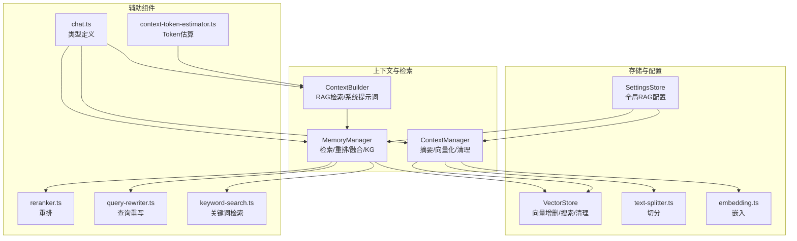
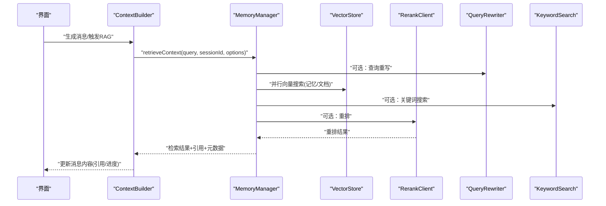
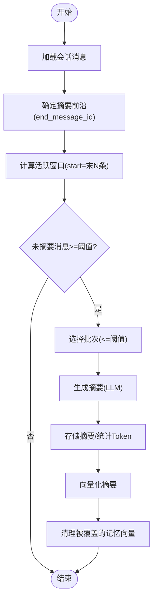
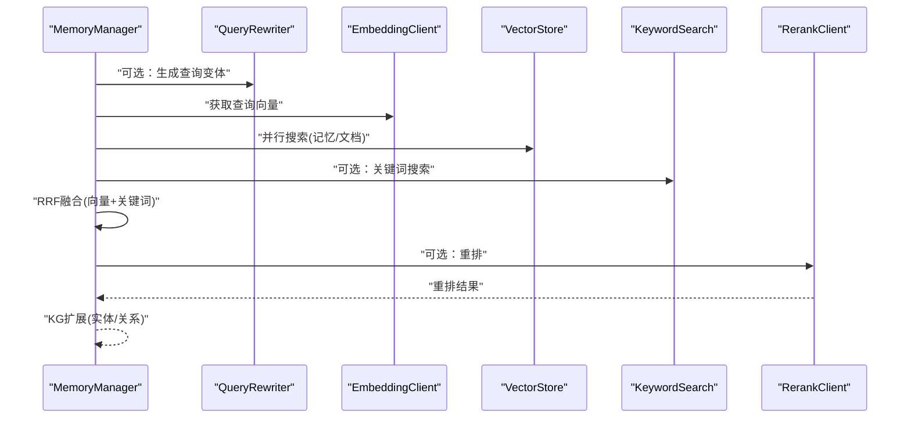
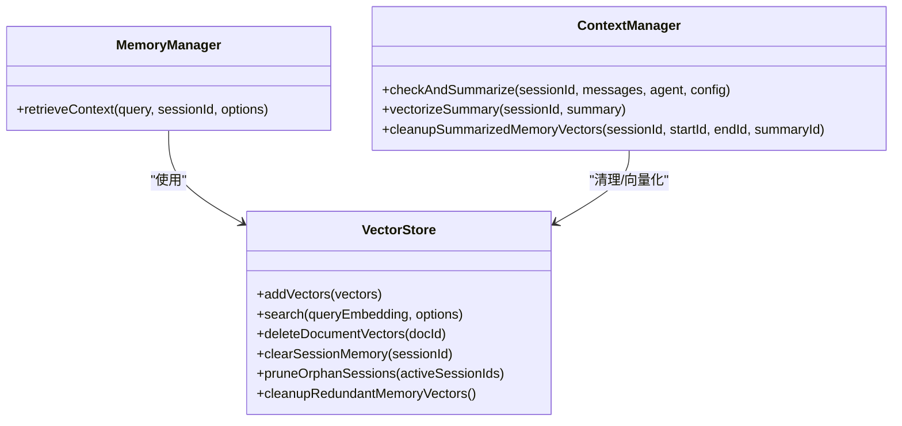
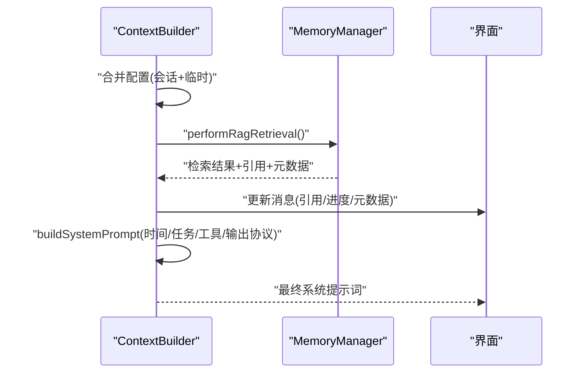
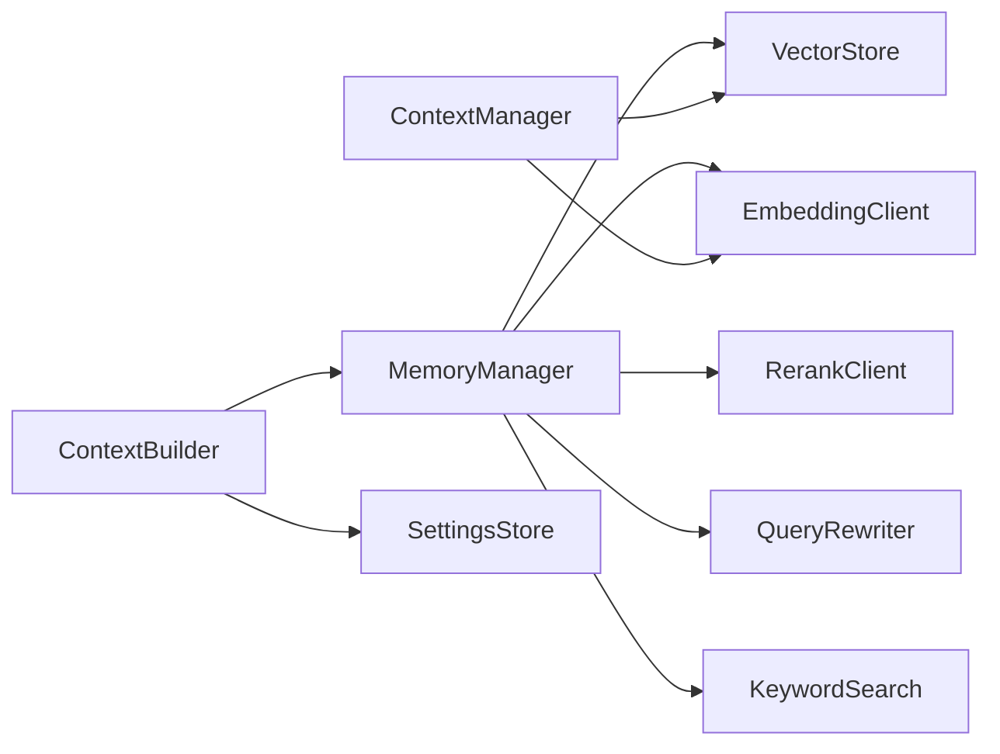

# 内存管理机制

<cite>
**本文档引用的文件**
- [ContextManager.ts](file://src/features/chat/utils/ContextManager.ts)
- [memory-manager.ts](file://src/lib/rag/memory-manager.ts)
- [context-builder.ts](file://src/store/chat/context-builder.ts)
- [context-token-estimator.ts](file://src/features/chat/utils/context-token-estimator.ts)
- [vector-store.ts](file://src/lib/rag/vector-store.ts)
- [settings-store.ts](file://src/store/settings-store.ts)
- [text-splitter.ts](file://src/lib/rag/text-splitter.ts)
- [embedding.ts](file://src/lib/rag/embedding.ts)
- [reranker.ts](file://src/lib/rag/reranker.ts)
- [query-rewriter.ts](file://src/lib/rag/query-rewriter.ts)
- [keyword-search.ts](file://src/lib/rag/keyword-search.ts)
- [chat.ts](file://src/types/chat.ts)
</cite>

## 目录
1. [简介](#简介)
2. [项目结构](#项目结构)
3. [核心组件](#核心组件)
4. [架构总览](#架构总览)
5. [详细组件分析](#详细组件分析)
6. [依赖分析](#依赖分析)
7. [性能考虑](#性能考虑)
8. [故障排查指南](#故障排查指南)
9. [结论](#结论)
10. [附录](#附录)

## 简介
本文件系统性阐述 Nexara 的内存管理机制，涵盖上下文窗口管理算法（动态窗口调整与重要性权重）、摘要生成策略（关键信息提取与压缩）、长期记忆存储与检索优化、内存清理策略（LRU 与过期处理）、上下文构建器工作原理与配置项，以及内存使用监控与性能调优实践。目标是帮助开发者与产品人员理解并高效配置系统的记忆与检索能力。

## 项目结构
围绕内存管理的关键模块分布如下：
- 上下文管理与摘要：ContextManager（摘要生成、向量化、清理）
- 检索与融合：MemoryManager（检索流程、重排、混合检索、KG 扩展）
- 上下文构建：ContextBuilder（RAG 检索、系统提示词构建）
- 向量存储与检索：VectorStore（向量增删改查、原生/JS 搜索、清理）
- 配置中心：SettingsStore（全局 RAG 配置、上下文窗口、阈值等）
- 文本切分与嵌入：RecursiveCharacterTextSplitter、EmbeddingClient
- 重排与查询重写：RerankClient、QueryRewriter
- 关键词检索：KeywordSearch
- 类型定义：chat.ts（RAG 配置、引用、进度、元数据）

图表来源
- [ContextManager.ts:1-482](file://src/features/chat/utils/ContextManager.ts#L1-L482)
- [memory-manager.ts:1-997](file://src/lib/rag/memory-manager.ts#L1-L997)
- [context-builder.ts:1-348](file://src/store/chat/context-builder.ts#L1-L348)
- [vector-store.ts:1-376](file://src/lib/rag/vector-store.ts#L1-L376)
- [settings-store.ts:1-244](file://src/store/settings-store.ts#L1-L244)
- [text-splitter.ts:1-55](file://src/lib/rag/text-splitter.ts#L1-L55)
- [embedding.ts:1-294](file://src/lib/rag/embedding.ts#L1-L294)
- [reranker.ts:1-188](file://src/lib/rag/reranker.ts#L1-L188)
- [query-rewriter.ts:1-88](file://src/lib/rag/query-rewriter.ts#L1-L88)
- [keyword-search.ts:1-204](file://src/lib/rag/keyword-search.ts#L1-L204)
- [context-token-estimator.ts:1-235](file://src/features/chat/utils/context-token-estimator.ts#L1-L235)
- [chat.ts:244-314](file://src/types/chat.ts#L244-L314)

章节来源
- [ContextManager.ts:1-482](file://src/features/chat/utils/ContextManager.ts#L1-L482)
- [memory-manager.ts:1-997](file://src/lib/rag/memory-manager.ts#L1-L997)
- [context-builder.ts:1-348](file://src/store/chat/context-builder.ts#L1-L348)
- [vector-store.ts:1-376](file://src/lib/rag/vector-store.ts#L1-L376)
- [settings-store.ts:1-244](file://src/store/settings-store.ts#L1-L244)
- [chat.ts:244-314](file://src/types/chat.ts#L244-L314)

## 核心组件
- 上下文窗口管理与摘要
  - 动态窗口：根据配置的 contextWindow 控制活跃消息数量
  - 摘要阈值：超过 summaryThreshold 的未摘要消息按批次生成摘要
  - 摘要生成：LLM 生成摘要，向量化存储，清理冗余向量
- 检索与融合
  - 查询重写：提升召回
  - 向量检索：并行搜索记忆与文档
  - 混合检索：RRF 融合向量与关键词
  - 重排：Rerank 精排
  - 知识图谱：基于召回文本进行实体与关系扩展
- 长期记忆存储
  - 向量存储：SQLite + 向量表，支持会话隔离与类型过滤
  - 摘要向量：单独存储 type='summary'，便于宏观历史召回
  - 记忆向量：type='memory'，与消息 ID 范围绑定，便于清理
- 内存清理策略
  - 摘要后清理：删除被摘要覆盖的记忆向量
  - 孤立会话清理：清理不在活跃会话列表中的孤立向量与 KG 数据
  - 批量清理：清理冗余记忆向量
- 上下文构建器
  - RAG 检索：整合检索上下文与引用
  - 系统提示词：注入时间、任务状态、工具描述与输出协议
- Token 估算与监控
  - 估算：消息、系统提示词、RAG 内容三部分
  - 上下文上限：模型规格与配置兜底
  - 百分比：使用率可视化与预警

章节来源
- [ContextManager.ts:28-180](file://src/features/chat/utils/ContextManager.ts#L28-L180)
- [memory-manager.ts:11-712](file://src/lib/rag/memory-manager.ts#L11-L712)
- [vector-store.ts:22-376](file://src/lib/rag/vector-store.ts#L22-L376)
- [context-builder.ts:17-348](file://src/store/chat/context-builder.ts#L17-L348)
- [context-token-estimator.ts:134-235](file://src/features/chat/utils/context-token-estimator.ts#L134-L235)
- [settings-store.ts:115-180](file://src/store/settings-store.ts#L115-L180)

## 架构总览
以下序列图展示从消息生成到上下文构建与检索的整体流程：

图表来源
- [context-builder.ts:84-176](file://src/store/chat/context-builder.ts#L84-L176)
- [memory-manager.ts:11-712](file://src/lib/rag/memory-manager.ts#L11-L712)
- [vector-store.ts:62-113](file://src/lib/rag/vector-store.ts#L62-L113)
- [reranker.ts:23-186](file://src/lib/rag/reranker.ts#L23-L186)
- [query-rewriter.ts:24-86](file://src/lib/rag/query-rewriter.ts#L24-L86)
- [keyword-search.ts:16-203](file://src/lib/rag/keyword-search.ts#L16-L203)

## 详细组件分析

### 上下文窗口管理与摘要生成
- 算法要点
  - 计算“摘要前沿”：基于最后一条摘要的 end_message_id 确定未摘要区间
  - 动态窗口：保留最后 N 条消息为活跃上下文（N = contextWindow）
  - 批次摘要：当未摘要消息超出阈值（summaryThreshold）时，按批次生成摘要
  - 向量化与清理：摘要向量化；删除被覆盖的记忆向量，降低冗余
- 重要性权重
  - 未摘要消息数量与批次大小共同决定摘要触发频率
  - 摘要内容与向量结合，提升宏观历史召回质量
- 关键流程

图表来源
- [ContextManager.ts:29-180](file://src/features/chat/utils/ContextManager.ts#L29-L180)
- [ContextManager.ts:407-441](file://src/features/chat/utils/ContextManager.ts#L407-L441)

章节来源
- [ContextManager.ts:28-180](file://src/features/chat/utils/ContextManager.ts#L28-L180)
- [ContextManager.ts:403-481](file://src/features/chat/utils/ContextManager.ts#L403-L481)

### 检索与融合策略
- 查询重写
  - 支持 multi-query、hyde、expansion 三种策略
  - 生成多个查询变体，提升召回
- 向量检索
  - 并行搜索记忆与文档向量，支持阈值与限制
  - 原生模块优先，失败降级至 JS 实现
- 混合检索（RRF）
  - 向量与关键词结果按 Reciprocal Rank 融合
  - 权重 alpha 与 BM25 增益可配置
- 重排
  - 使用 rerank 模型对候选结果进行精排
  - 支持本地与云端 rerank
- 知识图谱检索
  - 基于召回文本中的实体，一跳扩展关系
  - 应用文档授权过滤，保证隐私

图表来源
- [memory-manager.ts:120-712](file://src/lib/rag/memory-manager.ts#L120-L712)
- [query-rewriter.ts:24-86](file://src/lib/rag/query-rewriter.ts#L24-L86)
- [embedding.ts:94-294](file://src/lib/rag/embedding.ts#L94-L294)
- [vector-store.ts:62-113](file://src/lib/rag/vector-store.ts#L62-L113)
- [keyword-search.ts:16-203](file://src/lib/rag/keyword-search.ts#L16-L203)
- [reranker.ts:23-186](file://src/lib/rag/reranker.ts#L23-L186)

章节来源
- [memory-manager.ts:11-712](file://src/lib/rag/memory-manager.ts#L11-L712)
- [query-rewriter.ts:11-88](file://src/lib/rag/query-rewriter.ts#L11-L88)
- [embedding.ts:20-294](file://src/lib/rag/embedding.ts#L20-L294)
- [vector-store.ts:22-376](file://src/lib/rag/vector-store.ts#L22-L376)
- [keyword-search.ts:9-204](file://src/lib/rag/keyword-search.ts#L9-L204)
- [reranker.ts:13-188](file://src/lib/rag/reranker.ts#L13-L188)

### 长期记忆存储与检索优化
- 存储结构
  - vectors 表：content、embedding、metadata、会话/文档/消息范围
  - metadata.type：'memory'/'summary'/'doc' 区分用途
  - start_message_id/end_message_id：与摘要覆盖范围绑定
- 检索优化
  - 类型过滤：按 type 与 sessionId 过滤
  - 阈值与限制：memoryThreshold/docThreshold 与 memoryLimit/docLimit 控制召回规模
  - 并行搜索：记忆与文档向量并行检索，缩短延迟
- 清理策略
  - 摘要后清理：删除被摘要覆盖的记忆向量
  - 孤立会话清理：清理不在活跃会话列表中的向量与 KG 数据
  - 批量清理：遍历摘要范围，清理冗余记忆向量

图表来源
- [vector-store.ts:22-376](file://src/lib/rag/vector-store.ts#L22-L376)
- [memory-manager.ts:11-712](file://src/lib/rag/memory-manager.ts#L11-L712)
- [ContextManager.ts:349-441](file://src/features/chat/utils/ContextManager.ts#L349-L441)

章节来源
- [vector-store.ts:22-376](file://src/lib/rag/vector-store.ts#L22-L376)
- [memory-manager.ts:11-712](file://src/lib/rag/memory-manager.ts#L11-L712)
- [ContextManager.ts:403-441](file://src/features/chat/utils/ContextManager.ts#L403-L441)

### 上下文构建器工作原理与配置
- RAG 检索
  - 合并会话级与临时配置，支持全局/局部检索
  - 触发检索进度与引用更新
- 系统提示词构建
  - 时间注入、任务状态注入、工具描述注入
  - 模型特定增强（协议、能力、渲染器）
  - RAG 上下文拼接
- 配置项
  - enableMemory/enableDocs：启用记忆与文档检索
  - activeDocIds/activeFolderIds/isGlobal：检索范围控制
  - onRagProgress：进度回调
  - updateMessageContent：引用与元数据更新

图表来源
- [context-builder.ts:84-176](file://src/store/chat/context-builder.ts#L84-L176)
- [context-builder.ts:181-348](file://src/store/chat/context-builder.ts#L181-L348)

章节来源
- [context-builder.ts:17-348](file://src/store/chat/context-builder.ts#L17-L348)
- [chat.ts:244-314](file://src/types/chat.ts#L244-L314)

### Token 估算与上下文监控
- 估算维度
  - 消息 Token：输入/输出合计
  - 系统提示词 Token：基础 + 工具描述预留
  - RAG 内容 Token：最近助手消息的引用内容
- 上下文上限
  - 优先使用模型配置，其次模型规格，最后兜底
- 使用率与可视化
  - 百分比计算与颜色分级
  - Hook 提供简化的使用信息

章节来源
- [context-token-estimator.ts:134-235](file://src/features/chat/utils/context-token-estimator.ts#L134-L235)
- [settings-store.ts:115-180](file://src/store/settings-store.ts#L115-L180)
- [chat.ts:244-314](file://src/types/chat.ts#L244-L314)

## 依赖分析
- 组件耦合
  - MemoryManager 依赖 VectorStore、EmbeddingClient、RerankClient、QueryRewriter、KeywordSearch
  - ContextManager 依赖 VectorStore、EmbeddingClient、SettingsStore
  - ContextBuilder 依赖 MemoryManager、SettingsStore、API Store
- 外部依赖
  - SQLite：向量与元数据持久化
  - 原生模块：向量搜索加速
  - 第三方 Provider：Embedding、Rerank、KG 抽取

图表来源
- [memory-manager.ts:11-712](file://src/lib/rag/memory-manager.ts#L11-L712)
- [ContextManager.ts:28-401](file://src/features/chat/utils/ContextManager.ts#L28-L401)
- [context-builder.ts:17-40](file://src/store/chat/context-builder.ts#L17-L40)

章节来源
- [memory-manager.ts:11-712](file://src/lib/rag/memory-manager.ts#L11-L712)
- [ContextManager.ts:28-401](file://src/features/chat/utils/ContextManager.ts#L28-L401)
- [context-builder.ts:17-40](file://src/store/chat/context-builder.ts#L17-L40)

## 性能考虑
- 检索性能
  - 并行搜索：记忆与文档向量并行，减少总延迟
  - 原生搜索：优先使用原生模块，失败降级 JS 实现
  - 限制与阈值：合理设置 memoryLimit/docLimit 与阈值，避免结果过大
- 摘要与向量化
  - 批次摘要：避免一次性处理过多消息
  - 摘要后清理：降低向量冗余，提升后续检索效率
- Token 与上下文
  - 动态窗口：根据 contextWindow 控制活跃消息数量
  - Token 估算：提前评估上下文占用，避免超限
- 重排与混合检索
  - Rerank 与混合检索会增加延迟，建议按需开启
  - RRF 权重与 BM25 增益需结合业务调优

[本节为通用指导，无需列出具体文件来源]

## 故障排查指南
- 维度不匹配
  - 现象：检索返回 0，控制台报维度不一致
  - 排查：确认嵌入维度一致性，必要时重建向量
- 重排失败
  - 现象：重排接口异常或非 JSON 响应
  - 排查：检查 Provider 配置、网络与响应格式，回退至原序
- 摘要后仍残留向量
  - 现象：摘要生成但向量未清理
  - 排查：确认清理逻辑执行与消息 ID 范围匹配
- 查询重写超时
  - 现象：重写阶段超时
  - 排查：缩短查询或降低变体数量，检查模型可用性
- 进度与引用未更新
  - 现象：RAG 进度与引用未显示
  - 排查：确认 ContextBuilder 的回调与消息更新逻辑

章节来源
- [vector-store.ts:177-210](file://src/lib/rag/vector-store.ts#L177-L210)
- [reranker.ts:108-186](file://src/lib/rag/reranker.ts#L108-L186)
- [ContextManager.ts:407-441](file://src/features/chat/utils/ContextManager.ts#L407-L441)
- [memory-manager.ts:159-187](file://src/lib/rag/memory-manager.ts#L159-L187)
- [context-builder.ts:120-175](file://src/store/chat/context-builder.ts#L120-L175)

## 结论
Nexara 的内存管理机制通过“动态窗口 + 批次摘要 + 向量化 + 清理”的闭环，实现了高效的历史记忆管理；结合“查询重写 + 并行向量检索 + 混合检索 + 重排 + KG 扩展”的检索链路，显著提升了召回质量与相关性。配合 SettingsStore 的全局配置与 ContextBuilder 的上下文构建，系统在准确性、性能与可维护性之间取得了良好平衡。建议在生产环境中按需启用高级功能，并持续监控 Token 使用与检索指标，以实现稳定高效的长期记忆体验。

[本节为总结性内容，无需列出具体文件来源]

## 附录
- 关键配置项速览（SettingsStore）
  - 上下文窗口：contextWindow
  - 摘要阈值：summaryThreshold
  - 记忆/文档限制与阈值：memoryLimit/docLimit、memoryThreshold/docThreshold
  - 功能开关：enableMemory、enableDocs、enableRerank、enableQueryRewrite、enableHybridSearch、enableKnowledgeGraph
  - 重排与查询重写：rerankTopK、rerankFinalK、queryRewriteStrategy、queryRewriteCount、queryRewriteModel
  - 混合检索：hybridAlpha、hybridBM25Boost
  - 可观测性：showRetrievalProgress、showRetrievalDetails、trackRetrievalMetrics
- 类型与引用
  - RagConfiguration：RAG 全局与会话级配置
  - RagReference：引用来源与相似度
  - RagMetadata：检索元数据（耗时、召回数、分布等）

章节来源
- [settings-store.ts:115-180](file://src/store/settings-store.ts#L115-L180)
- [chat.ts:244-314](file://src/types/chat.ts#L244-L314)