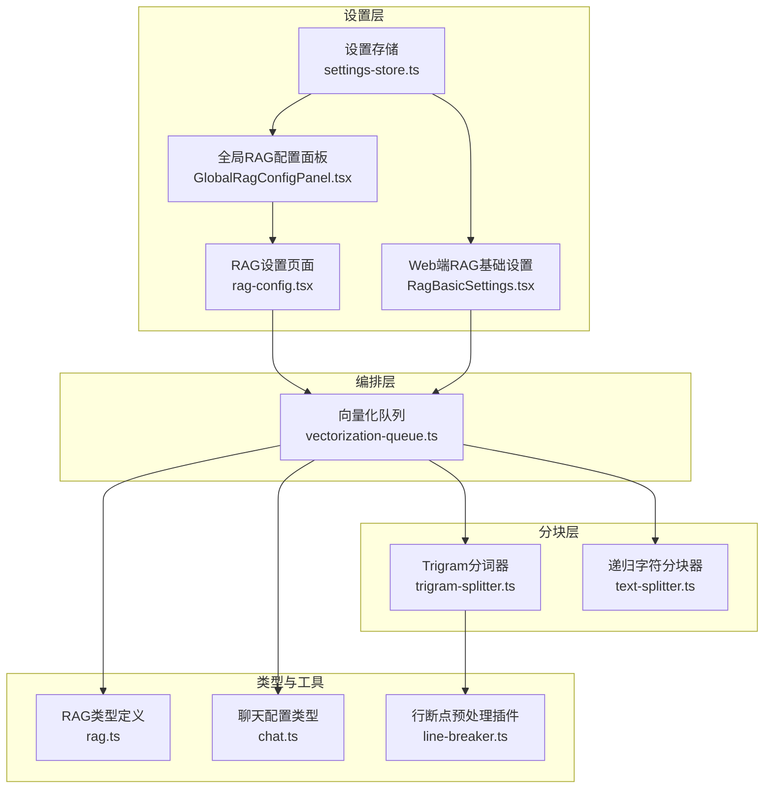
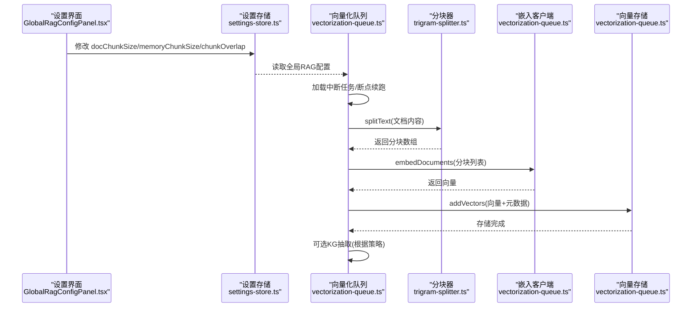
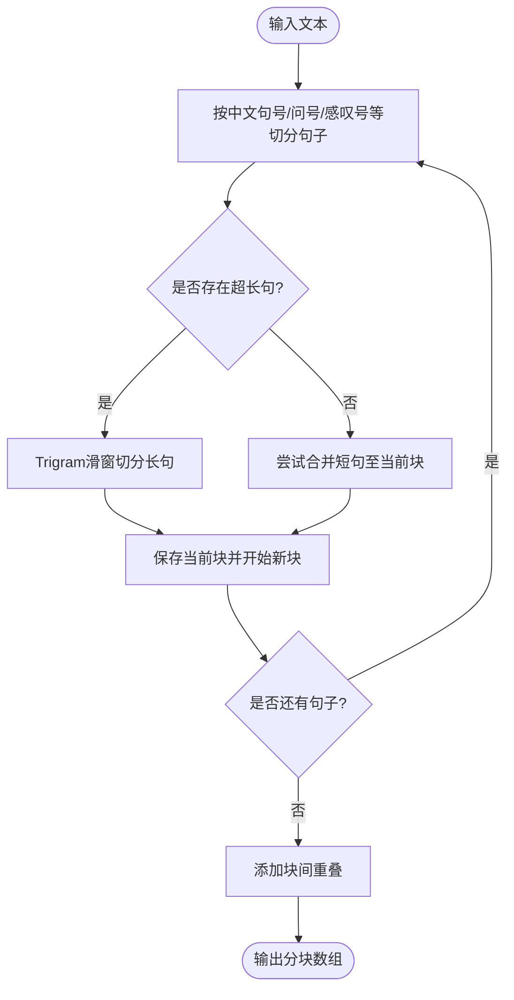
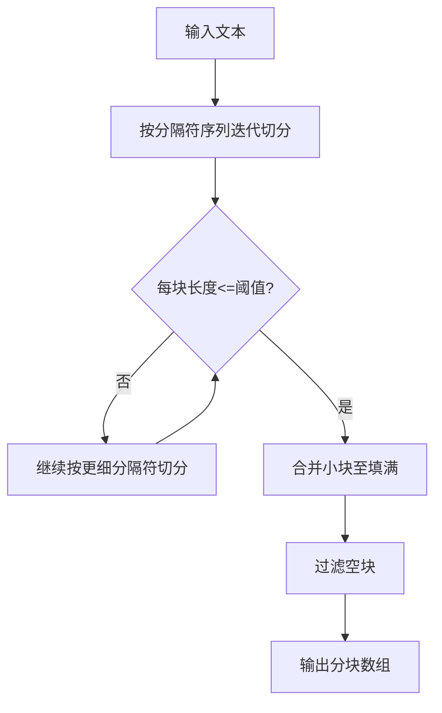
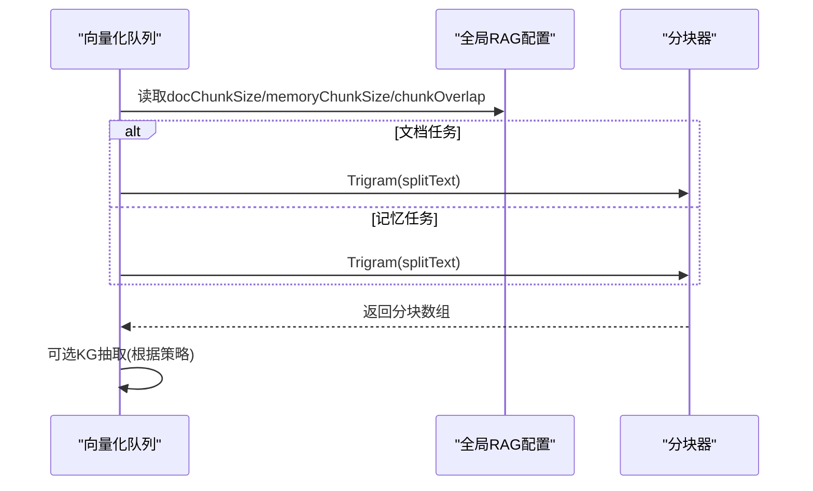
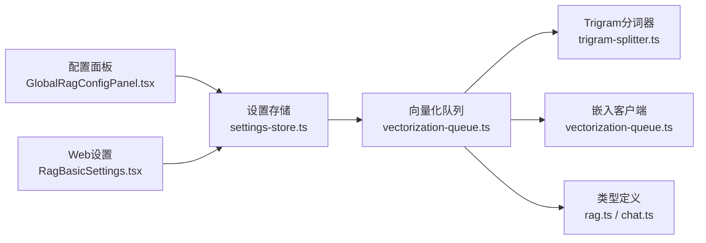

# 文档分块算法

<cite>
**本文引用的文件**
- [trigram-splitter.ts](file://src/lib/rag/trigram-splitter.ts)
- [text-splitter.ts](file://src/lib/rag/text-splitter.ts)
- [vectorization-queue.ts](file://src/lib/rag/vectorization-queue.ts)
- [settings-store.ts](file://src/store/settings-store.ts)
- [GlobalRagConfigPanel.tsx](file://src/features/settings/components/GlobalRagConfigPanel.tsx)
- [rag-config.tsx](file://app/settings/rag-config.tsx)
- [RagBasicSettings.tsx](file://web-client/src/pages/settings/RagBasicSettings.tsx)
- [rag.ts](file://src/types/rag.ts)
- [chat.ts](file://src/types/chat.ts)
- [line-breaker.ts](file://src/lib/sanitizer/plugins/line-breaker.ts)
</cite>

## 目录
1. [引言](#引言)
2. [项目结构](#项目结构)
3. [核心组件](#核心组件)
4. [架构总览](#架构总览)
5. [详细组件分析](#详细组件分析)
6. [依赖关系分析](#依赖关系分析)
7. [性能考量](#性能考量)
8. [故障排查指南](#故障排查指南)
9. [结论](#结论)
10. [附录](#附录)

## 引言
本文件面向Nexara的文档分块算法，系统性阐述以下内容：
- 三种分块策略的实现原理与适用场景：语义分块（Trigram）、固定大小分块（RecursiveCharacter）、混合分块（基于策略的组合）。
- 分块参数配置：重叠率、最小/最大长度、不同文档类型的默认值与调优建议。
- 分块质量评估机制：语义连贯性与上下文完整性的保障手段。
- 不同文档类型的最优分块策略建议：长文档、技术文档、研究论文。
- 性能优化与内存使用策略：批处理、增量哈希、断点续跑、UI让出。

## 项目结构
与分块相关的核心代码位于src/lib/rag目录，配合设置存储与前端配置界面，形成“配置—分块—向量化—持久化”的闭环。

**图表来源**
- [settings-store.ts:115-180](file://src/store/settings-store.ts#L115-L180)
- [GlobalRagConfigPanel.tsx:253-340](file://src/features/settings/components/GlobalRagConfigPanel.tsx#L253-L340)
- [rag-config.tsx:11-49](file://app/settings/rag-config.tsx#L11-L49)
- [RagBasicSettings.tsx:43-63](file://web-client/src/pages/settings/RagBasicSettings.tsx#L43-L63)
- [trigram-splitter.ts:22-222](file://src/lib/rag/trigram-splitter.ts#L22-L222)
- [text-splitter.ts:1-55](file://src/lib/rag/text-splitter.ts#L1-L55)
- [vectorization-queue.ts:299-304](file://src/lib/rag/vectorization-queue.ts#L299-L304)
- [rag.ts:29-57](file://src/types/rag.ts#L29-L57)
- [chat.ts:244-276](file://src/types/chat.ts#L244-L276)
- [line-breaker.ts:79-101](file://src/lib/sanitizer/plugins/line-breaker.ts#L79-L101)

**章节来源**
- [settings-store.ts:115-180](file://src/store/settings-store.ts#L115-L180)
- [GlobalRagConfigPanel.tsx:253-340](file://src/features/settings/components/GlobalRagConfigPanel.tsx#L253-L340)
- [rag-config.tsx:11-49](file://app/settings/rag-config.tsx#L11-L49)
- [RagBasicSettings.tsx:43-63](file://web-client/src/pages/settings/RagBasicSettings.tsx#L43-L63)
- [trigram-splitter.ts:22-222](file://src/lib/rag/trigram-splitter.ts#L22-L222)
- [text-splitter.ts:1-55](file://src/lib/rag/text-splitter.ts#L1-L55)
- [vectorization-queue.ts:299-304](file://src/lib/rag/vectorization-queue.ts#L299-L304)
- [rag.ts:29-57](file://src/types/rag.ts#L29-L57)
- [chat.ts:244-276](file://src/types/chat.ts#L244-L276)
- [line-breaker.ts:79-101](file://src/lib/sanitizer/plugins/line-breaker.ts#L79-L101)

## 核心组件
- TrigramTextSplitter：面向中文的语义分块器，按句子切分后对超长句采用Trigram滑窗，结合重叠保持语义连贯。
- RecursiveCharacterTextSplitter：通用的固定大小分块器，按分隔符序列迭代切分，并在必要时回退到字符级切分。
- VectorizationQueue：统一的向量化任务编排器，负责文档/记忆/会话KG任务的入队、断点续跑、进度上报与持久化。
- 设置存储与配置面板：提供docChunkSize、memoryChunkSize、chunkOverlap等参数的可视化配置入口。
- 类型与工具：定义任务状态、文档状态、RAG配置接口，以及预处理插件（如行断点）。

**章节来源**
- [trigram-splitter.ts:22-222](file://src/lib/rag/trigram-splitter.ts#L22-L222)
- [text-splitter.ts:1-55](file://src/lib/rag/text-splitter.ts#L1-L55)
- [vectorization-queue.ts:256-414](file://src/lib/rag/vectorization-queue.ts#L256-L414)
- [settings-store.ts:115-180](file://src/store/settings-store.ts#L115-L180)
- [GlobalRagConfigPanel.tsx:253-340](file://src/features/settings/components/GlobalRagConfigPanel.tsx#L253-L340)
- [rag.ts:29-57](file://src/types/rag.ts#L29-L57)
- [chat.ts:244-276](file://src/types/chat.ts#L244-L276)
- [line-breaker.ts:79-101](file://src/lib/sanitizer/plugins/line-breaker.ts#L79-L101)

## 架构总览
下面的序列图展示了“文档入库—分块—向量化—存储—可选知识图谱抽取”的完整流程，以及分块参数如何影响各阶段行为。

**图表来源**
- [GlobalRagConfigPanel.tsx:253-340](file://src/features/settings/components/GlobalRagConfigPanel.tsx#L253-L340)
- [settings-store.ts:115-180](file://src/store/settings-store.ts#L115-L180)
- [vectorization-queue.ts:299-304](file://src/lib/rag/vectorization-queue.ts#L299-L304)
- [trigram-splitter.ts:42-97](file://src/lib/rag/trigram-splitter.ts#L42-L97)
- [vectorization-queue.ts:318-351](file://src/lib/rag/vectorization-queue.ts#L318-L351)

## 详细组件分析

### Trigram 语义分块器
- 设计目标：针对中文文本，优先按语义边界（句子）切分，再对超长句使用Trigram滑窗，最后通过重叠提升连贯性。
- 关键流程：
  1) 按中文句号、问号、感叹号等分隔符切分为句子；
  2) 合并短句，遇到超长句则进入Trigram滑窗；
  3) Trigram滑窗在块尾部寻找合适的标点断点，避免断词；
  4) 最后为相邻块添加重叠，确保跨块语义连续。
- 参数校验与估算：重叠必须小于块大小；提供估算函数用于快速评估分块数量。
- 并发友好：每处理若干句子主动让出主线程，避免UI卡顿。

**图表来源**
- [trigram-splitter.ts:42-97](file://src/lib/rag/trigram-splitter.ts#L42-L97)
- [trigram-splitter.ts:124-179](file://src/lib/rag/trigram-splitter.ts#L124-L179)
- [trigram-splitter.ts:184-207](file://src/lib/rag/trigram-splitter.ts#L184-L207)

**章节来源**
- [trigram-splitter.ts:22-222](file://src/lib/rag/trigram-splitter.ts#L22-L222)

### 固定大小分块器（RecursiveCharacter）
- 设计目标：提供通用的固定大小分块能力，按分隔符序列（如段落、换行、空格、字符）逐步切分。
- 关键流程：
  1) 依次使用分隔符序列切分，直到每块长度不超过设定阈值；
  2) 对过短的块进行合并，尽量填满块大小；
  3) 字符级回退：当分隔符无法切分时，按字符拆分。
- 适用场景：英文文档、HTML/XML等结构化文本，或作为Trigram的后备策略。

**图表来源**
- [text-splitter.ts:12-43](file://src/lib/rag/text-splitter.ts#L12-L43)
- [text-splitter.ts:45-50](file://src/lib/rag/text-splitter.ts#L45-L50)

**章节来源**
- [text-splitter.ts:1-55](file://src/lib/rag/text-splitter.ts#L1-L55)

### 混合分块策略（策略驱动）
- 策略说明：在文档向量化流程中，根据任务类型与配置选择不同的分块策略：
  - 文档任务：使用Trigram分词器，按全局RAG配置的docChunkSize与chunkOverlap执行；
  - 记忆任务：使用Trigram分词器，按memoryChunkSize与chunkOverlap执行；
  - 会话KG批量：先合并多轮对话，再统一抽取。
- 断点续跑：记录lastChunkIndex，支持失败/中断后的增量继续。
- 可选跳过向量化：仅执行知识图谱抽取，用于成本控制。

**图表来源**
- [vectorization-queue.ts:299-304](file://src/lib/rag/vectorization-queue.ts#L299-L304)
- [vectorization-queue.ts:449-453](file://src/lib/rag/vectorization-queue.ts#L449-L453)
- [vectorization-queue.ts:364-413](file://src/lib/rag/vectorization-queue.ts#L364-L413)

**章节来源**
- [vectorization-queue.ts:256-414](file://src/lib/rag/vectorization-queue.ts#L256-L414)

### 分块参数配置与调优
- 参数项
  - 文档块大小（docChunkSize）：默认2000；范围200~2000；越大越利于语义完整，越小越利于检索精细度。
  - 对话记忆块大小（memoryChunkSize）：默认1000；范围500~2000。
  - 重叠大小（chunkOverlap）：默认100；范围0~500；越大语义连贯性越好，向量数量与存储占用越高。
- 配置入口
  - 移动端：GlobalRagConfigPanel.tsx提供滑杆调整与数值输入；
  - Web端：RagBasicSettings.tsx提供数值输入；
  - 存储：settings-store.ts维护全局RAG配置对象。
- 参数关系
  - 重叠必须小于块大小（构造函数内校验）；
  - 有效块大小=块大小-重叠，估算分块数量以此为准。

**章节来源**
- [GlobalRagConfigPanel.tsx:253-340](file://src/features/settings/components/GlobalRagConfigPanel.tsx#L253-L340)
- [RagBasicSettings.tsx:43-63](file://web-client/src/pages/settings/RagBasicSettings.tsx#L43-L63)
- [settings-store.ts:115-180](file://src/store/settings-store.ts#L115-L180)
- [trigram-splitter.ts:33-37](file://src/lib/rag/trigram-splitter.ts#L33-L37)
- [trigram-splitter.ts:212-221](file://src/lib/rag/trigram-splitter.ts#L212-L221)

### 分块质量评估机制
- 语义连贯性
  - 中文句级切分与Trigram滑窗断点优先选择标点，避免断词；
  - 块间重叠确保跨块上下文衔接。
- 上下文完整性
  - 预处理：移除HTML标签、压缩空白，减少噪声；
  - 行断点插件：在句末标点后适当插入段落分隔，改善结构化文本的切分效果。
- 可观测性
  - 向量化队列记录任务状态、进度、错误与子状态，便于定位问题；
  - 增量哈希：内容未变化时跳过向量化，提高吞吐。

**章节来源**
- [trigram-splitter.ts:134-157](file://src/lib/rag/trigram-splitter.ts#L134-L157)
- [trigram-splitter.ts:184-207](file://src/lib/rag/trigram-splitter.ts#L184-L207)
- [vectorization-queue.ts:288-292](file://src/lib/rag/vectorization-queue.ts#L288-L292)
- [line-breaker.ts:79-101](file://src/lib/sanitizer/plugins/line-breaker.ts#L79-L101)
- [vectorization-queue.ts:272-286](file://src/lib/rag/vectorization-queue.ts#L272-L286)

### 不同文档类型的最优分块策略建议
- 长文档（报告/手册）
  - 建议：较大块（docChunkSize=1600~2000），适度重叠（chunkOverlap=100~200），优先Trigram语义分块；
  - 目的：降低分块数量，提升检索效率，同时保留段落级语义。
- 技术文档（API/规范）
  - 建议：中等块（docChunkSize=1200~1600），较小重叠（chunkOverlap=50~100），可结合固定大小分块作为后备；
  - 目的：兼顾代码/表格/列表的结构化表达与语义连贯。
- 研究论文
  - 建议：较大块（docChunkSize=1800~2000），中等重叠（chunkOverlap=100~150），Trigram为主，必要时允许少量跨节切分；
  - 目的：保持段落/小节的完整性，避免摘要与讨论部分被过度切割。

[本节为通用建议，不直接分析具体文件，故不附“章节来源”]

## 依赖关系分析
- 组件耦合
  - VectorizationQueue依赖TrigramTextSplitter与EmbeddingClient，耦合度低，职责清晰；
  - TrigramTextSplitter内部自包含，对外仅暴露splitText与估算函数；
  - 设置存储与配置面板解耦，分别负责数据持久化与UI交互。
- 外部依赖
  - 嵌入模型提供方（本地/云端）通过配置注入；
  - 数据库存储任务状态与向量结果，支持断点续跑与恢复。

**图表来源**
- [settings-store.ts:115-180](file://src/store/settings-store.ts#L115-L180)
- [GlobalRagConfigPanel.tsx:253-340](file://src/features/settings/components/GlobalRagConfigPanel.tsx#L253-L340)
- [RagBasicSettings.tsx:43-63](file://web-client/src/pages/settings/RagBasicSettings.tsx#L43-L63)
- [vectorization-queue.ts:299-304](file://src/lib/rag/vectorization-queue.ts#L299-L304)
- [trigram-splitter.ts:22-222](file://src/lib/rag/trigram-splitter.ts#L22-L222)
- [rag.ts:29-57](file://src/types/rag.ts#L29-L57)
- [chat.ts:244-276](file://src/types/chat.ts#L244-L276)

**章节来源**
- [settings-store.ts:115-180](file://src/store/settings-store.ts#L115-L180)
- [vectorization-queue.ts:256-414](file://src/lib/rag/vectorization-queue.ts#L256-L414)
- [rag.ts:29-57](file://src/types/rag.ts#L29-L57)
- [chat.ts:244-276](file://src/types/chat.ts#L244-L276)

## 性能考量
- 分块阶段
  - Trigram分块对长句采用滑窗，避免一次性处理大量字符导致阻塞；通过定时让出主线程缓解UI卡顿。
  - 估算函数用于快速评估分块数量，辅助任务调度与资源规划。
- 向量化阶段
  - 批处理：本地模型批大小为1，云端模型批大小为10，平衡延迟与吞吐；
  - 断点续跑：记录lastChunkIndex，失败/中断后可从断点继续，减少重复工作量；
  - 增量哈希：内容未变则跳过向量化，显著节省资源。
- 存储与检索
  - 重叠越大，向量数量越多，存储与检索成本越高；需在连贯性与成本间权衡。

**章节来源**
- [trigram-splitter.ts:57-60](file://src/lib/rag/trigram-splitter.ts#L57-L60)
- [trigram-splitter.ts:212-221](file://src/lib/rag/trigram-splitter.ts#L212-L221)
- [vectorization-queue.ts:319-337](file://src/lib/rag/vectorization-queue.ts#L319-L337)
- [vectorization-queue.ts:272-286](file://src/lib/rag/vectorization-queue.ts#L272-L286)
- [vectorization-queue.ts:323-337](file://src/lib/rag/vectorization-queue.ts#L323-L337)

## 故障排查指南
- 常见错误与处理
  - API密钥无效/配额不足/网络超时：队列内置友好化错误提示，便于用户理解；
  - 本地模型未加载/上下文预测中：支持指数退避重试（最多3次）；
  - 任务中断：通过心跳检测与持久化恢复，自动标记为interrupted并支持恢复。
- 排查步骤
  1) 查看任务状态与子状态（progress/subStatus/error）；
  2) 检查嵌入模型配置与可用性；
  3) 核对分块参数（重叠不得≥块大小）；
  4) 如启用增量哈希，确认内容哈希是否匹配。
- 相关实现参考
  - 错误分类与重试逻辑、状态变更与持久化、断点恢复。

**章节来源**
- [vectorization-queue.ts:200-236](file://src/lib/rag/vectorization-queue.ts#L200-L236)
- [vectorization-queue.ts:617-624](file://src/lib/rag/vectorization-queue.ts#L617-L624)
- [vectorization-queue.ts:716-767](file://src/lib/rag/vectorization-queue.ts#L716-L767)

## 结论
Nexara的分块算法以Trigram语义分块为核心，结合固定大小分块作为后备策略，并通过可配置的参数与断点续跑机制，在保证语义连贯性的同时兼顾性能与成本。配合设置面板与向量化队列的可观测性，能够满足长文档、技术文档与研究论文等多样化场景的分块需求。

## 附录
- 术语
  - 重叠率：chunkOverlap / docChunkSize（或memoryChunkSize）。
  - 有效块大小：chunkSize - chunkOverlap。
- 最佳实践
  - 中文文档优先使用Trigram分块；
  - 英文或结构化文本可考虑固定大小分块；
  - 大文档适当增大块大小，小文档减小块大小；
  - 重叠建议占块大小的5%~15%，兼顾连贯性与成本。

[本节为通用建议，不直接分析具体文件，故不附“章节来源”]