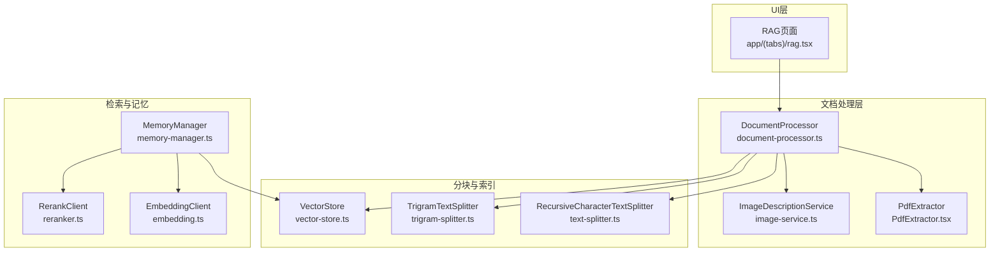
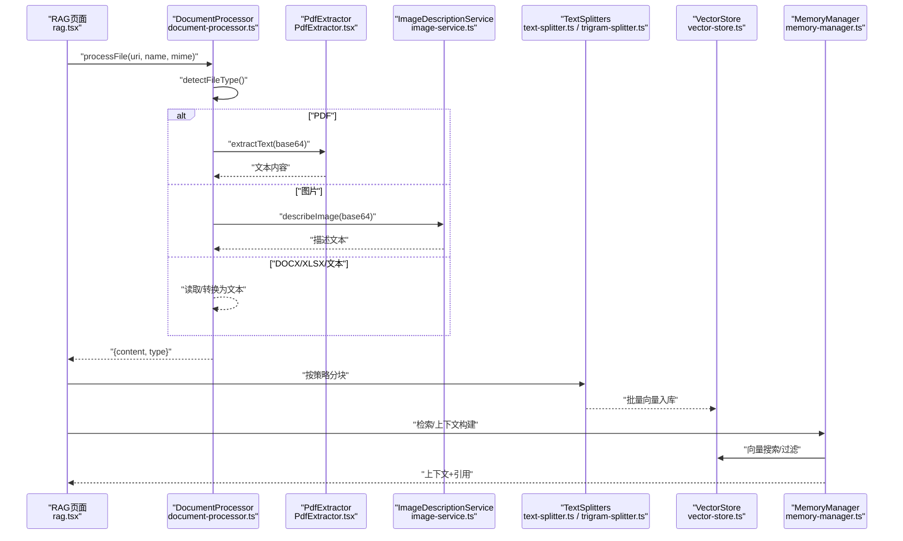
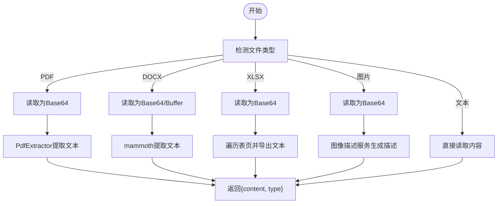
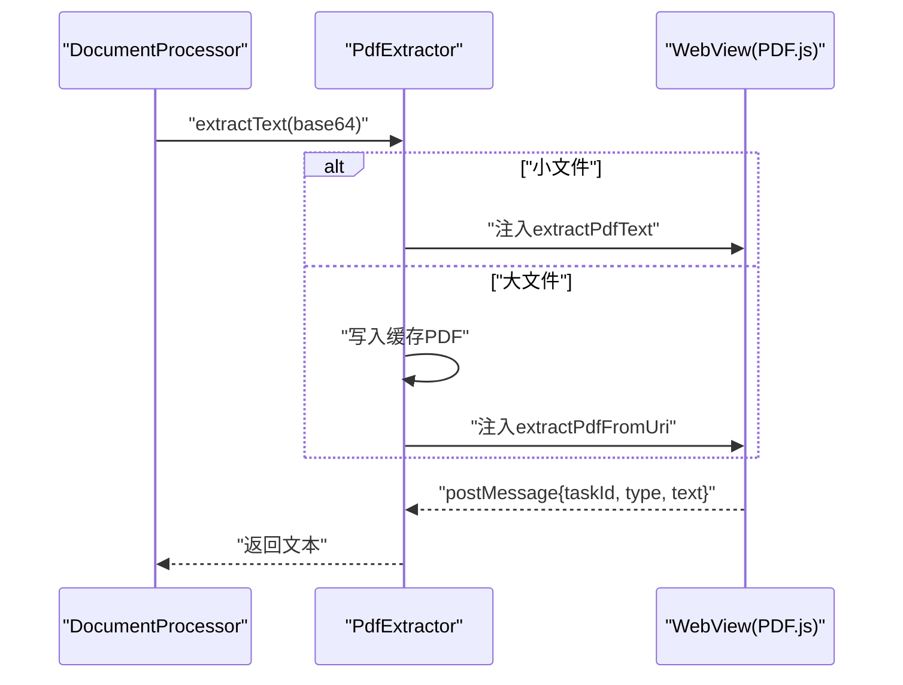
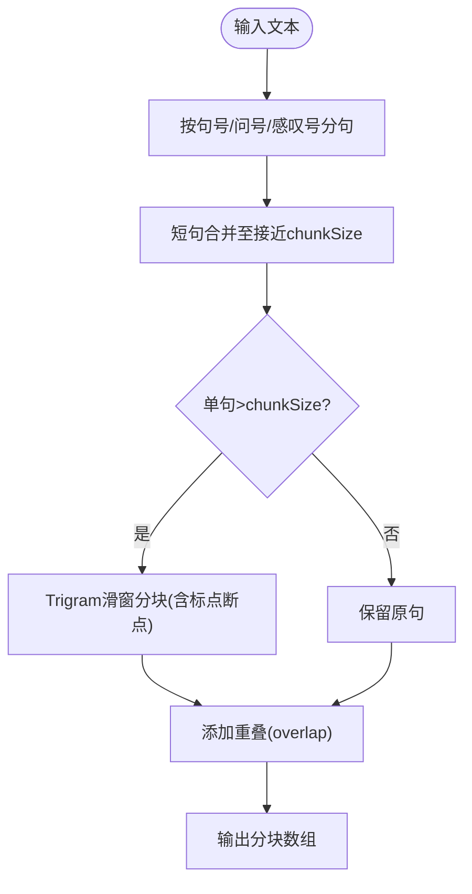
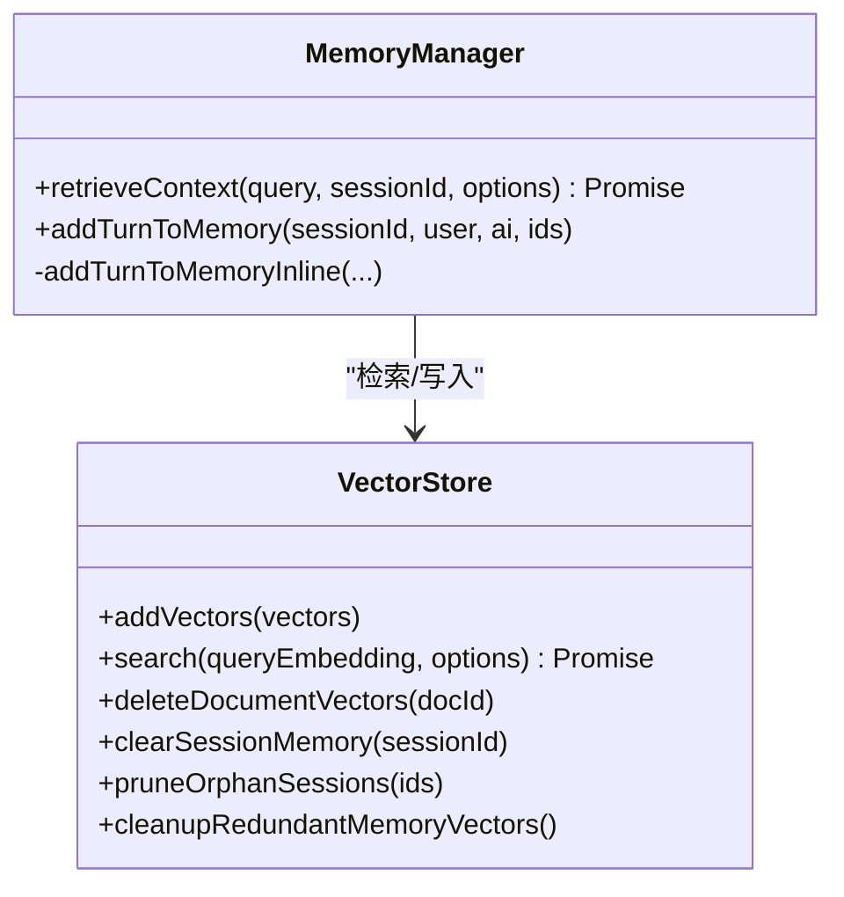
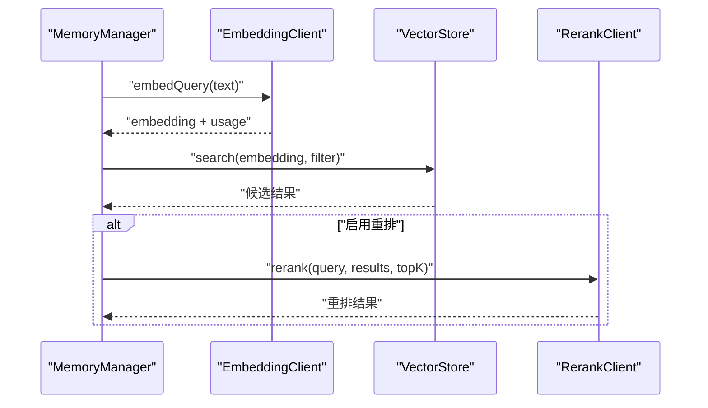
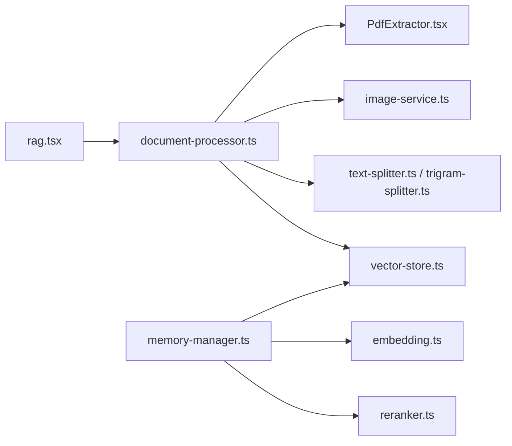

# 文档处理管道

<cite>
**本文引用的文件**
- [document-processor.ts](file://src/lib/rag/document-processor.ts)
- [PdfExtractor.tsx](file://src/components/rag/PdfExtractor.tsx)
- [text-splitter.ts](file://src/lib/rag/text-splitter.ts)
- [trigram-splitter.ts](file://src/lib/rag/trigram-splitter.ts)
- [vector-store.ts](file://src/lib/rag/vector-store.ts)
- [memory-manager.ts](file://src/lib/rag/memory-manager.ts)
- [image-service.ts](file://src/lib/rag/image-service.ts)
- [embedding.ts](file://src/lib/rag/embedding.ts)
- [reranker.ts](file://src/lib/rag/reranker.ts)
- [rag.tsx](file://app/(tabs)/rag.tsx)
- [document-service.ts](file://src/lib/file/document-service.ts)
</cite>

## 目录
1. [简介](#简介)
2. [项目结构](#项目结构)
3. [核心组件](#核心组件)
4. [架构总览](#架构总览)
5. [详细组件分析](#详细组件分析)
6. [依赖关系分析](#依赖关系分析)
7. [性能考量](#性能考量)
8. [故障排查指南](#故障排查指南)
9. [结论](#结论)
10. [附录](#附录)

## 简介
本文件面向Nexara的文档处理管道，系统性阐述从文件接收、格式识别、内容提取、分块策略、PDF特殊处理、内存管理（上下文窗口、摘要、长期记忆）、元数据与标签、质量控制，到性能优化与大文档处理最佳实践的完整技术文档。读者无需深入源码即可理解整体流程与关键决策点。

## 项目结构
围绕RAG与文档处理的关键目录与文件如下：
- 文档处理入口与核心处理器：src/lib/rag/document-processor.ts
- PDF提取组件：src/components/rag/PdfExtractor.tsx
- 文本分块器：src/lib/rag/text-splitter.ts、src/lib/rag/trigram-splitter.ts
- 向量检索与存储：src/lib/rag/vector-store.ts
- 上下文检索与记忆管理：src/lib/rag/memory-manager.ts
- 图像描述服务：src/lib/rag/image-service.ts
- 嵌入与重排：src/lib/rag/embedding.ts、src/lib/rag/reranker.ts
- UI集成与批处理：app/(tabs)/rag.tsx
- 文件服务封装：src/lib/file/document-service.ts

**图表来源**
- [document-processor.ts:1-141](file://src/lib/rag/document-processor.ts#L1-L141)
- [PdfExtractor.tsx:1-182](file://src/components/rag/PdfExtractor.tsx#L1-L182)
- [text-splitter.ts:1-55](file://src/lib/rag/text-splitter.ts#L1-L55)
- [trigram-splitter.ts:1-223](file://src/lib/rag/trigram-splitter.ts#L1-L223)
- [vector-store.ts:1-376](file://src/lib/rag/vector-store.ts#L1-L376)
- [memory-manager.ts:1-997](file://src/lib/rag/memory-manager.ts#L1-L997)
- [image-service.ts:1-98](file://src/lib/rag/image-service.ts#L1-L98)
- [embedding.ts:1-294](file://src/lib/rag/embedding.ts#L1-L294)
- [reranker.ts:1-188](file://src/lib/rag/reranker.ts#L1-L188)
- [rag.tsx:215-912](file://app/(tabs)/rag.tsx#L215-L912)

**章节来源**
- [document-processor.ts:1-141](file://src/lib/rag/document-processor.ts#L1-L141)
- [PdfExtractor.tsx:1-182](file://src/components/rag/PdfExtractor.tsx#L1-L182)
- [text-splitter.ts:1-55](file://src/lib/rag/text-splitter.ts#L1-L55)
- [trigram-splitter.ts:1-223](file://src/lib/rag/trigram-splitter.ts#L1-L223)
- [vector-store.ts:1-376](file://src/lib/rag/vector-store.ts#L1-L376)
- [memory-manager.ts:1-997](file://src/lib/rag/memory-manager.ts#L1-L997)
- [image-service.ts:1-98](file://src/lib/rag/image-service.ts#L1-L98)
- [embedding.ts:1-294](file://src/lib/rag/embedding.ts#L1-L294)
- [reranker.ts:1-188](file://src/lib/rag/reranker.ts#L1-L188)
- [rag.tsx:215-912](file://app/(tabs)/rag.tsx#L215-L912)

## 核心组件
- 文档处理器：统一入口，负责文件类型检测、格式分支处理（文本、PDF、DOCX、XLSX、图片），并输出标准化内容与类型。
- PDF提取器：基于Webview加载PDF.js，在浏览器环境中解析PDF文本，支持超大文件落盘与URI直读。
- 文本分块器：递归字符分块与三元组中文分块，兼顾语义连贯与性能。
- 向量存储：SQLite持久化+原生加速搜索，支持过滤、阈值与限流。
- 检索与记忆：查询改写、嵌入、并行向量检索、关键词混合检索、重排、知识图谱关联、上下文聚合。
- 图像描述：基于视觉语言模型生成图片描述，用于检索与向量化。
- 嵌入与重排：多提供商适配（OpenAI、Vertex、Gemini、本地），支持批量与本地推理。
- UI集成：拖拽/选择文件，批处理与进度反馈，PDF同步提取器引用。

**章节来源**
- [document-processor.ts:10-141](file://src/lib/rag/document-processor.ts#L10-L141)
- [PdfExtractor.tsx:6-182](file://src/components/rag/PdfExtractor.tsx#L6-L182)
- [text-splitter.ts:1-55](file://src/lib/rag/text-splitter.ts#L1-L55)
- [trigram-splitter.ts:22-223](file://src/lib/rag/trigram-splitter.ts#L22-L223)
- [vector-store.ts:22-376](file://src/lib/rag/vector-store.ts#L22-L376)
- [memory-manager.ts:10-712](file://src/lib/rag/memory-manager.ts#L10-L712)
- [image-service.ts:12-98](file://src/lib/rag/image-service.ts#L12-L98)
- [embedding.ts:20-294](file://src/lib/rag/embedding.ts#L20-L294)
- [reranker.ts:13-188](file://src/lib/rag/reranker.ts#L13-L188)
- [rag.tsx:215-912](file://app/(tabs)/rag.tsx#L215-L912)

## 架构总览
文档处理管道自上而下的工作流如下：

**图表来源**
- [rag.tsx:537-912](file://app/(tabs)/rag.tsx#L537-L912)
- [document-processor.ts:17-137](file://src/lib/rag/document-processor.ts#L17-L137)
- [PdfExtractor.tsx:112-145](file://src/components/rag/PdfExtractor.tsx#L112-L145)
- [image-service.ts:48-94](file://src/lib/rag/image-service.ts#L48-L94)
- [text-splitter.ts:12-50](file://src/lib/rag/text-splitter.ts#L12-L50)
- [trigram-splitter.ts:42-97](file://src/lib/rag/trigram-splitter.ts#L42-L97)
- [vector-store.ts:31-60](file://src/lib/rag/vector-store.ts#L31-L60)
- [memory-manager.ts:11-712](file://src/lib/rag/memory-manager.ts#L11-L712)

## 详细组件分析

### 文档导入与格式识别
- 接收文件：UI层通过文件选择或拖拽获取文件名、MIME与URI。
- 类型检测：依据扩展名与MIME判定类型（text/pdf/docx/xlsx/image）。
- 分支处理：
  - PDF：读取为Base64，交由PDF提取器在Webview中解析。
  - DOCX：读取为Base64并转换为ArrayBuffer，使用mammoth提取纯文本。
  - XLSX：读取为Base64，遍历所有表页，导出文本并标注表头。
  - 图片：读取为Base64，调用图像描述服务生成描述文本。
  - 文本：直接读取文件内容。
- 输出：统一返回{content, type}，供UI入库与后续处理。

**图表来源**
- [document-processor.ts:17-137](file://src/lib/rag/document-processor.ts#L17-L137)
- [PdfExtractor.tsx:33-64](file://src/components/rag/PdfExtractor.tsx#L33-L64)
- [image-service.ts:48-94](file://src/lib/rag/image-service.ts#L48-L94)

**章节来源**
- [document-processor.ts:17-137](file://src/lib/rag/document-processor.ts#L17-L137)
- [PdfExtractor.tsx:112-145](file://src/components/rag/PdfExtractor.tsx#L112-L145)
- [image-service.ts:48-94](file://src/lib/rag/image-service.ts#L48-L94)
- [rag.tsx:537-912](file://app/(tabs)/rag.tsx#L537-L912)

### PDF特殊处理：文本提取、图像与布局
- 文本提取：通过Webview注入PDF.js脚本，逐页提取文本并拼接。
- 大文件处理：当Base64超过阈值时，写入缓存PDF文件并通过URI方式加载，避免内存峰值。
- 超时与清理：任务超时自动清理临时文件与定时器，防止资源泄漏。
- 图像与布局：当前实现聚焦文本提取；若需图像/布局分析，可在PDF.js基础上扩展页面内容结构解析。

**图表来源**
- [document-processor.ts:69-77](file://src/lib/rag/document-processor.ts#L69-L77)
- [PdfExtractor.tsx:112-145](file://src/components/rag/PdfExtractor.tsx#L112-L145)
- [PdfExtractor.tsx:148-165](file://src/components/rag/PdfExtractor.tsx#L148-L165)

**章节来源**
- [document-processor.ts:69-77](file://src/lib/rag/document-processor.ts#L69-L77)
- [PdfExtractor.tsx:11-182](file://src/components/rag/PdfExtractor.tsx#L11-L182)

### 文本分块算法与策略
- 递归字符分块：按换行、段落、空格等分隔符迭代切分，再合并以满足块大小与重叠要求。
- 三元组中文分块：按中文句号、问号、感叹号等分句，对超长句采用滑动窗口（Trigram）分块，并在块间添加重叠，避免断句。
- 混合策略建议：
  - 英文/日文/韩文：优先递归字符分块，重叠200~300字符。
  - 中文：优先三元组分块，块大小1000~2000字符，重叠200~400字符。
  - 大文档：分块前先做段落/标题层级预处理，减少跨层级语义断裂。
- 性能要点：分块过程异步让出主线程，避免UI卡顿；分块后统一进行去重与长度过滤。

**图表来源**
- [trigram-splitter.ts:42-97](file://src/lib/rag/trigram-splitter.ts#L42-L97)
- [trigram-splitter.ts:124-179](file://src/lib/rag/trigram-splitter.ts#L124-L179)
- [text-splitter.ts:12-50](file://src/lib/rag/text-splitter.ts#L12-L50)

**章节来源**
- [text-splitter.ts:1-55](file://src/lib/rag/text-splitter.ts#L1-L55)
- [trigram-splitter.ts:1-223](file://src/lib/rag/trigram-splitter.ts#L1-L223)

### 内存管理：上下文窗口、摘要与长期记忆
- 上下文窗口：MemoryManager按配置限制记忆与文档块数量，支持合并策略与去重。
- 摘要检索：显式召回type='summary'的向量，提升宏观语义召回能力。
- 长期记忆：向量存储区分memory/summary/doc三类，支持按会话清理与孤儿数据修剪。
- 非阻塞归档：对话轮次归档入队异步处理，避免阻塞UI。
- 指标追踪：检索耗时、召回数、最终数、最大相似度、来源分布等，便于监控与优化。

**图表来源**
- [memory-manager.ts:11-712](file://src/lib/rag/memory-manager.ts#L11-L712)
- [vector-store.ts:22-376](file://src/lib/rag/vector-store.ts#L22-L376)

**章节来源**
- [memory-manager.ts:11-712](file://src/lib/rag/memory-manager.ts#L11-L712)
- [vector-store.ts:22-376](file://src/lib/rag/vector-store.ts#L22-L376)

### 嵌入与重排：多提供商适配与鲁棒性
- 嵌入客户端：统一接口，适配OpenAI、Vertex、Gemini与本地模型，支持批量与令牌用量统计。
- 重排客户端：支持本地与远端重排模型，兼容Jina/Cohere/SiliconFlow格式，具备超时与降级回退。
- 检索阶段：查询改写（可选）、向量嵌入、并行向量搜索、关键词混合检索（RRF融合）、重排精排、知识图谱关联。

**图表来源**
- [memory-manager.ts:120-580](file://src/lib/rag/memory-manager.ts#L120-L580)
- [embedding.ts:20-294](file://src/lib/rag/embedding.ts#L20-L294)
- [reranker.ts:13-188](file://src/lib/rag/reranker.ts#L13-L188)
- [vector-store.ts:62-113](file://src/lib/rag/vector-store.ts#L62-L113)

**章节来源**
- [embedding.ts:20-294](file://src/lib/rag/embedding.ts#L20-L294)
- [reranker.ts:13-188](file://src/lib/rag/reranker.ts#L13-L188)
- [memory-manager.ts:120-580](file://src/lib/rag/memory-manager.ts#L120-L580)

### 元数据处理、标签系统与质量控制
- 元数据：向量记录包含docId、sessionId、metadata（含type）、消息ID区间、创建时间等，用于过滤与溯源。
- 标签/分类：通过docId与folderId授权集合控制文档检索范围；支持全局/局部模式切换。
- 质量控制：
  - 空内容拦截：图片描述失败时返回空内容，由调用方检查并避免无效向量化。
  - 超时保护：PDF提取、嵌入、重排均设置超时，失败时降级或返回原始排序。
  - 维度校验：向量维度不匹配时给出告警并提示修复。
  - 指标上报：检索耗时、召回数、最终数、最大相似度等，便于质量评估。

**章节来源**
- [document-processor.ts:117-137](file://src/lib/rag/document-processor.ts#L117-L137)
- [PdfExtractor.tsx:89-109](file://src/components/rag/PdfExtractor.tsx#L89-L109)
- [vector-store.ts:170-210](file://src/lib/rag/vector-store.ts#L170-L210)
- [memory-manager.ts:120-187](file://src/lib/rag/memory-manager.ts#L120-L187)

## 依赖关系分析
- UI层依赖DocumentProcessor与PdfExtractor，负责文件批处理与进度反馈。
- DocumentProcessor依赖文件系统读取、mammoth、xlsx库、图像描述服务。
- 文本分块器独立于外部，与向量存储配合完成入库。
- MemoryManager依赖向量存储、嵌入与重排客户端，串联检索链路。
- 向量存储依赖SQLite与原生搜索模块，支持过滤与阈值控制。

**图表来源**
- [rag.tsx:537-912](file://app/(tabs)/rag.tsx#L537-L912)
- [document-processor.ts:1-141](file://src/lib/rag/document-processor.ts#L1-L141)
- [vector-store.ts:1-376](file://src/lib/rag/vector-store.ts#L1-L376)
- [memory-manager.ts:1-997](file://src/lib/rag/memory-manager.ts#L1-L997)

**章节来源**
- [rag.tsx:537-912](file://app/(tabs)/rag.tsx#L537-L912)
- [document-processor.ts:1-141](file://src/lib/rag/document-processor.ts#L1-L141)
- [vector-store.ts:1-376](file://src/lib/rag/vector-store.ts#L1-L376)
- [memory-manager.ts:1-997](file://src/lib/rag/memory-manager.ts#L1-L997)

## 性能考量
- 并行与限流：向量搜索与关键词混合检索并行执行，设置合理召回上限与阈值，避免结果爆炸。
- 重排优化：先全量去重再重排，避免中间截断导致信息丢失；重排模型支持本地推理以降低延迟。
- 分块策略：中文优先三元组分块，英文递归字符分块；块大小与重叠按场景调整。
- 大文档处理：分块前预处理段落/标题；分块过程异步让渡；入库事务批量提交。
- 资源管理：PDF大文件落盘与清理、超时清理、孤儿数据修剪、维度不匹配告警。
- 缓存与复用：UI层批处理顺序处理PDF以保证稳定性；嵌入与重排结果可结合缓存策略复用。

[本节为通用性能指导，无需特定文件引用]

## 故障排查指南
- PDF提取超时：检查Webview加载状态、网络与超时阈值；确认临时文件清理逻辑。
- 图像描述失败：确认已启用具备视觉能力的模型；检查Base64前缀与网络请求。
- 向量维度不匹配：核对嵌入模型维度一致性；清理历史向量或重建索引。
- 重排失败降级：检查重排API端点与鉴权；观察RX/TX字节与延迟指标。
- 空内容入库：图片描述为空时由调用方拦截，避免无效向量化；必要时补充占位符或跳过。

**章节来源**
- [PdfExtractor.tsx:89-109](file://src/components/rag/PdfExtractor.tsx#L89-L109)
- [image-service.ts:48-94](file://src/lib/rag/image-service.ts#L48-L94)
- [vector-store.ts:170-210](file://src/lib/rag/vector-store.ts#L170-L210)
- [reranker.ts:108-143](file://src/lib/rag/reranker.ts#L108-L143)
- [document-processor.ts:117-137](file://src/lib/rag/document-processor.ts#L117-L137)

## 结论
Nexara的文档处理管道以DocumentProcessor为核心，结合PDF提取器、文本分块器、向量存储与检索记忆模块，形成从文件到上下文的完整链路。通过并行检索、混合检索、重排与知识图谱增强，显著提升召回质量；通过超时保护、维度校验与孤儿修剪等机制保障稳定性。针对中文与多语言场景提供差异化分块策略，配合批处理与资源管理，满足大文档与复杂场景的性能与质量双重要求。

[本节为总结性内容，无需特定文件引用]

## 附录
- UI集成要点：在挂载时动态注入PDF提取器引用；批处理时顺序处理PDF以保证稳定性；进度回调与错误处理。
- 文件服务封装：DocumentService统一调用DocumentProcessor，提供降级占位与错误兜底。
- 配置项建议：查询改写开关、嵌入/重排模型选择、混合检索参数（alpha、bm25Boost）、召回上限与阈值、块大小与重叠。

**章节来源**
- [rag.tsx:215-227](file://app/(tabs)/rag.tsx#L215-L227)
- [rag.tsx:537-912](file://app/(tabs)/rag.tsx#L537-L912)
- [document-service.ts:29-66](file://src/lib/file/document-service.ts#L29-L66)