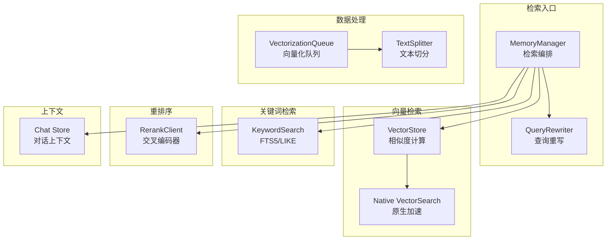
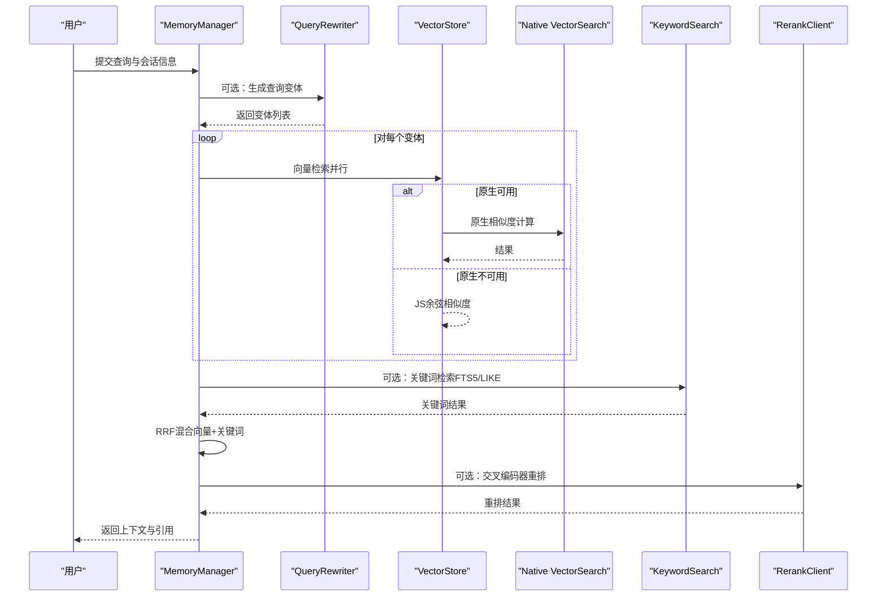
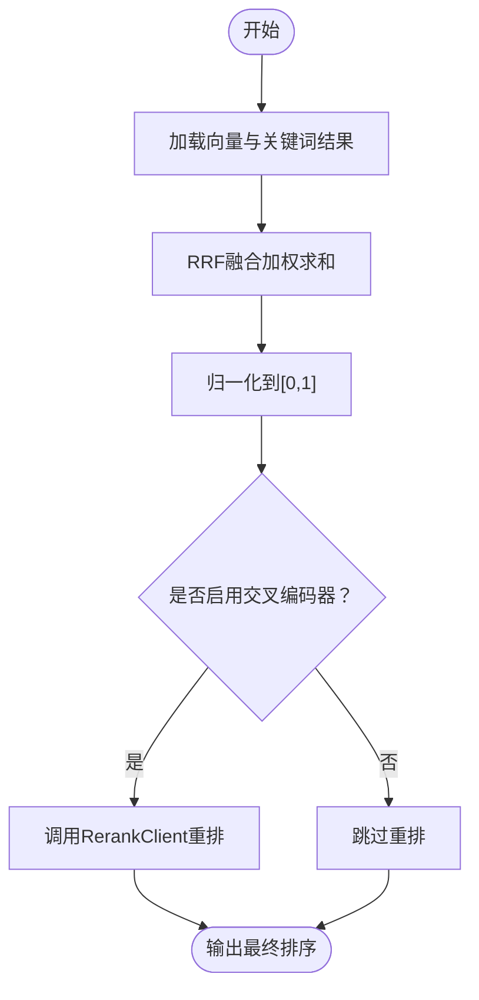
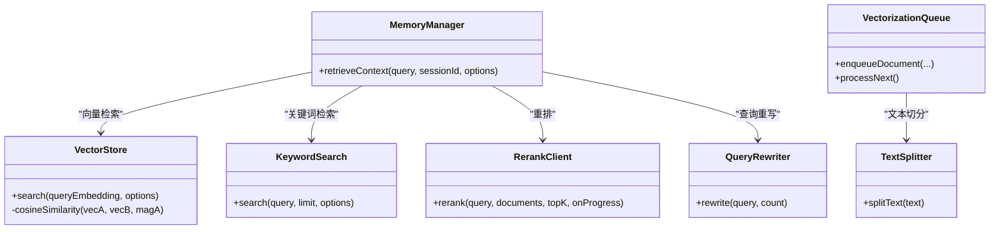

# 检索算法实现

<cite>
**本文引用的文件**
- [src/lib/rag/vector-store.ts](file://src/lib/rag/vector-store.ts)
- [src/lib/rag/memory-manager.ts](file://src/lib/rag/memory-manager.ts)
- [src/lib/rag/keyword-search.ts](file://src/lib/rag/keyword-search.ts)
- [src/lib/rag/reranker.ts](file://src/lib/rag/reranker.ts)
- [src/native/VectorSearch/index.ts](file://src/native/VectorSearch/index.ts)
- [src/lib/rag/query-rewriter.ts](file://src/lib/rag/query-rewriter.ts)
- [src/lib/rag/vectorization-queue.ts](file://src/lib/rag/vectorization-queue.ts)
- [src/lib/rag/text-splitter.ts](file://src/lib/rag/text-splitter.ts)
- [src/lib/llm/model-specs.ts](file://src/lib/llm/model-specs.ts)
- [src/lib/rag/__tests__/vector-store.benchmark.ts](file://src/lib/rag/__tests__/vector-store.benchmark.ts)
- [src/lib/queue-utils.ts](file://src/lib/queue-utils.ts)
- [src/store/chat-store.ts](file://src/store/chat-store.ts)
- [src/lib/llm/prompts/i18n/zh.ts](file://src/lib/llm/prompts/i18n/zh.ts)
</cite>

## 目录
1. [简介](#简介)
2. [项目结构](#项目结构)
3. [核心组件](#核心组件)
4. [架构总览](#架构总览)
5. [详细组件分析](#详细组件分析)
6. [依赖关系分析](#依赖关系分析)
7. [性能考量](#性能考量)
8. [故障排查指南](#故障排查指南)
9. [结论](#结论)
10. [附录](#附录)

## 简介
本文件面向Nexara的检索算法实现，系统性阐述相似度计算方法（余弦相似度、点积与欧几里得距离）、检索过滤机制（文档ID、会话、类型）、重排序策略（BM25、交叉编码器、混合重排序）、上下文融合（多轮对话上下文管理与相关性评分）、以及检索性能优化（索引优化、缓存与并行处理）。同时提供检索质量评估与调优指南，帮助开发者在保证用户体验的前提下，持续提升检索效果与稳定性。

## 项目结构
检索能力主要分布在以下模块：
- 向量检索与相似度计算：VectorStore
- 混合检索与重排序：MemoryManager、KeywordSearch、RerankClient
- 查询重写：QueryRewriter
- 本地原生加速：Native VectorSearch
- 数据入库与批处理：VectorizationQueue、TextSplitter
- 性能基准与工具：Benchmark、Queue Utils
- 上下文融合：Chat Store（对话轮次归档与上下文拼接）

图表来源
- [src/lib/rag/memory-manager.ts:11-712](file://src/lib/rag/memory-manager.ts#L11-L712)
- [src/lib/rag/vector-store.ts:22-251](file://src/lib/rag/vector-store.ts#L22-L251)
- [src/native/VectorSearch/index.ts:15-52](file://src/native/VectorSearch/index.ts#L15-L52)
- [src/lib/rag/keyword-search.ts:16-105](file://src/lib/rag/keyword-search.ts#L16-L105)
- [src/lib/rag/reranker.ts:23-186](file://src/lib/rag/reranker.ts#L23-L186)
- [src/lib/rag/query-rewriter.ts:24-86](file://src/lib/rag/query-rewriter.ts#L24-L86)
- [src/lib/rag/vectorization-queue.ts:256-414](file://src/lib/rag/vectorization-queue.ts#L256-L414)
- [src/lib/rag/text-splitter.ts:12-42](file://src/lib/rag/text-splitter.ts#L12-L42)
- [src/store/chat-store.ts:900-2308](file://src/store/chat-store.ts#L900-L2308)

章节来源
- [src/lib/rag/vector-store.ts:22-251](file://src/lib/rag/vector-store.ts#L22-L251)
- [src/lib/rag/memory-manager.ts:11-712](file://src/lib/rag/memory-manager.ts#L11-L712)

## 核心组件
- VectorStore：负责向量插入、过滤查询、相似度计算与原生加速回退；默认采用余弦相似度。
- MemoryManager：检索编排中枢，支持查询重写、并行向量/摘要/文档检索、混合检索（RRF）与重排。
- KeywordSearch：关键词检索，优先使用FTS5 MATCH，降级为LIKE；支持会话/文档过滤。
- RerankClient：交叉编码器重排，兼容本地与远端模型，支持进度回调与错误回退。
- Native VectorSearch：原生模块封装，提供高性能向量检索。
- QueryRewriter：基于LLM的查询重写，支持多查询、扩展与假设文档嵌入。
- VectorizationQueue：向量化批处理队列，支持断点续传、重试与进度上报。
- TextSplitter：文本切分，支撑向量化前的内容预处理。
- Chat Store：对话上下文管理，支撑多轮融合与续杯提示注入。

章节来源
- [src/lib/rag/vector-store.ts:22-251](file://src/lib/rag/vector-store.ts#L22-L251)
- [src/lib/rag/memory-manager.ts:11-712](file://src/lib/rag/memory-manager.ts#L11-L712)
- [src/lib/rag/keyword-search.ts:16-105](file://src/lib/rag/keyword-search.ts#L16-L105)
- [src/lib/rag/reranker.ts:13-186](file://src/lib/rag/reranker.ts#L13-L186)
- [src/native/VectorSearch/index.ts:15-52](file://src/native/VectorSearch/index.ts#L15-L52)
- [src/lib/rag/query-rewriter.ts:11-86](file://src/lib/rag/query-rewriter.ts#L11-L86)
- [src/lib/rag/vectorization-queue.ts:22-250](file://src/lib/rag/vectorization-queue.ts#L22-L250)
- [src/lib/rag/text-splitter.ts:12-42](file://src/lib/rag/text-splitter.ts#L12-L42)
- [src/store/chat-store.ts:900-2308](file://src/store/chat-store.ts#L900-L2308)

## 架构总览
检索流程从MemoryManager开始，依次经过查询重写、向量检索、关键词混合、重排与上下文融合，最终产出上下文与引用信息。

图表来源
- [src/lib/rag/memory-manager.ts:190-474](file://src/lib/rag/memory-manager.ts#L190-L474)
- [src/lib/rag/vector-store.ts:115-159](file://src/lib/rag/vector-store.ts#L115-L159)
- [src/native/VectorSearch/index.ts:15-48](file://src/native/VectorSearch/index.ts#L15-L48)
- [src/lib/rag/keyword-search.ts:16-105](file://src/lib/rag/keyword-search.ts#L16-L105)
- [src/lib/rag/reranker.ts:23-186](file://src/lib/rag/reranker.ts#L23-L186)

## 详细组件分析

### 相似度计算与选择
- 余弦相似度：VectorStore在JS路径中实现，计算两向量的点积除以模长乘积，适合高维稀疏向量与语义检索。
- 点积：原生模块searchVectors返回相似度，通常等价于点积或经归一化的点积，用于快速近邻检索。
- 欧几里得距离：当前实现未直接使用欧氏距离作为相似度，但在向量空间中可通过余弦相似度与点积间接表达相关性。

实现要点
- 维度一致性校验：若查询与存储向量维度不一致，会记录错误并提示。
- 降维与归一化：原生路径对Float32Array进行处理，提升性能与内存效率。
- 降级策略：原生失败时自动回退至JS实现，保证可用性。

章节来源
- [src/lib/rag/vector-store.ts:161-233](file://src/lib/rag/vector-store.ts#L161-L233)
- [src/native/VectorSearch/index.ts:15-48](file://src/native/VectorSearch/index.ts#L15-L48)

### 检索过滤机制（SQL实现）
- 文档ID过滤：支持单个docId或docIds集合；当集合较大时采用“存在性过滤”避免IN开销。
- 会话过滤：按session_id筛选，支持全局模式（无会话过滤）。
- 类型过滤：通过JSON函数提取metadata中的type字段，区分memory、summary与doc。
- 关键词检索过滤：KeywordSearch支持按sessionId与docIds过滤；当启用文档但未授权任何文档时，可显式排除文档结果。

SQL设计要点
- 使用INNER JOIN FTS5表进行全文匹配，显著优于LIKE。
- 通过参数化查询与条件拼接，避免SQL注入。
- 对大集合采用“IS NOT NULL”策略，减少IN子句膨胀。

章节来源
- [src/lib/rag/vector-store.ts:62-98](file://src/lib/rag/vector-store.ts#L62-L98)
- [src/lib/rag/keyword-search.ts:33-74](file://src/lib/rag/keyword-search.ts#L33-L74)

### 重排序算法
- BM25：关键词检索阶段使用FTS5 rank排序，作为关键词相关性的近似BM25信号。
- 交叉编码器：RerankClient支持本地与远端模型，接收查询与候选文本列表，返回重排后的相关性分数。
- 混合重排序策略：MemoryManager采用Reciprocal Rank Fusion（RRF），对向量与关键词结果进行加权融合，权重alpha与bm25Boost可配置。

重排流程

图表来源
- [src/lib/rag/memory-manager.ts:416-474](file://src/lib/rag/memory-manager.ts#L416-L474)
- [src/lib/rag/reranker.ts:23-186](file://src/lib/rag/reranker.ts#L23-L186)

章节来源
- [src/lib/rag/memory-manager.ts:416-474](file://src/lib/rag/memory-manager.ts#L416-L474)
- [src/lib/rag/reranker.ts:13-186](file://src/lib/rag/reranker.ts#L13-L186)

### 上下文融合技术
- 多轮对话上下文管理：Chat Store在消息归档时注入续杯提示，避免模型混淆连续用户消息；支持工具结果与用户消息的合并。
- 相关性评分：MemoryManager在重排前后保留originalSimilarity，便于UI展示与调试。
- 知识图谱关联：检索完成后基于召回文本中的实体进行一跳关系扩展，结合文档授权过滤，输出KG洞察。

章节来源
- [src/store/chat-store.ts:900-2308](file://src/store/chat-store.ts#L900-L2308)
- [src/lib/rag/memory-manager.ts:628-699](file://src/lib/rag/memory-manager.ts#L628-L699)

### 检索性能优化
- 索引优化
  - FTS5全文索引：关键词检索优先使用FTS5 MATCH，显著优于LIKE。
  - 向量表索引：SQLite原生索引配合原生模块加速，避免全表扫描。
- 缓存机制
  - 向量化队列持久化：断点续传与心跳检测，支持任务恢复。
  - 重试与指数退避：网络瞬态错误自动重试，降低失败率。
- 并行处理
  - 查询变体并行：MemoryManager对多个查询变体并行执行向量检索。
  - 搜索阶段并行：记忆、摘要与文档检索并行执行，缩短总延迟。
  - 批量处理：向量化过程采用批次与微休眠，避免UI冻结。

章节来源
- [src/lib/rag/keyword-search.ts:25-105](file://src/lib/rag/keyword-search.ts#L25-L105)
- [src/lib/rag/vectorization-queue.ts:161-250](file://src/lib/rag/vectorization-queue.ts#L161-L250)
- [src/lib/rag/memory-manager.ts:336-350](file://src/lib/rag/memory-manager.ts#L336-L350)

## 依赖关系分析
- MemoryManager依赖VectorStore、KeywordSearch、RerankClient与EmbeddingClient，形成检索主干。
- VectorStore依赖Native VectorSearch与SQLite，提供相似度计算与过滤查询。
- QueryRewriter依赖LLM客户端，生成查询变体。
- RerankClient支持本地与远端模型，模型规格由model-specs维护。
- VectorizationQueue依赖TextSplitter与EmbeddingClient，负责向量化批处理。

图表来源
- [src/lib/rag/memory-manager.ts:11-712](file://src/lib/rag/memory-manager.ts#L11-L712)
- [src/lib/rag/vector-store.ts:22-251](file://src/lib/rag/vector-store.ts#L22-L251)
- [src/lib/rag/keyword-search.ts:16-105](file://src/lib/rag/keyword-search.ts#L16-L105)
- [src/lib/rag/reranker.ts:13-186](file://src/lib/rag/reranker.ts#L13-L186)
- [src/lib/rag/query-rewriter.ts:11-86](file://src/lib/rag/query-rewriter.ts#L11-L86)
- [src/lib/rag/vectorization-queue.ts:22-250](file://src/lib/rag/vectorization-queue.ts#L22-L250)
- [src/lib/rag/text-splitter.ts:12-42](file://src/lib/rag/text-splitter.ts#L12-L42)

## 性能考量
- 相似度计算
  - 原生路径优先：当Native VectorSearch可用时，使用Float32Array与原生模块，显著降低CPU与内存开销。
  - JS路径：余弦相似度实现稳定可靠，适用于小规模或原生不可用场景。
- 检索吞吐
  - 并行变体与并行搜索：减少端到端延迟。
  - RRF融合与重排：在保证质量前提下，合理设置topK与alpha，避免过度重排导致延迟。
- 存储与索引
  - FTS5：关键词检索性能关键；注意查询长度限制与分词策略。
  - 向量维度：严格校验维度一致性，避免因维度不匹配导致的失败与告警。
- 批处理与队列
  - 向量化批次与微休眠：平衡吞吐与UI响应。
  - 断点续传与心跳：提升可靠性与可观测性。

章节来源
- [src/lib/rag/vector-store.ts:102-113](file://src/lib/rag/vector-store.ts#L102-L113)
- [src/lib/rag/memory-manager.ts:336-350](file://src/lib/rag/memory-manager.ts#L336-L350)
- [src/lib/rag/keyword-search.ts:28-31](file://src/lib/rag/keyword-search.ts#L28-L31)
- [src/lib/rag/vectorization-queue.ts:319-337](file://src/lib/rag/vectorization-queue.ts#L319-L337)

## 故障排查指南
- 维度不匹配
  - 现象：检索返回0条，控制台输出维度不匹配告警。
  - 处理：确认嵌入模型维度一致，必要时重建向量。
- 原生模块不可用
  - 现象：原生路径抛错，自动回退JS实现。
  - 处理：检查原生模块构建与平台支持。
- 网络/配额错误
  - 现象：RerankClient或EmbeddingClient报错。
  - 处理：检查API密钥、配额与网络连通性；启用重试与降级。
- FTS5不可用
  - 现象：关键词检索降级为LIKE。
  - 处理：确保op-sqlite包含FTS5扩展或接受LIKE降级方案。
- 队列卡住
  - 现象：向量化任务长时间无进展。
  - 处理：检查心跳与断点恢复逻辑，必要时清理持久化任务。

章节来源
- [src/lib/rag/vector-store.ts:201-205](file://src/lib/rag/vector-store.ts#L201-L205)
- [src/lib/rag/reranker.ts:118-123](file://src/lib/rag/reranker.ts#L118-L123)
- [src/lib/rag/vectorization-queue.ts:203-235](file://src/lib/rag/vectorization-queue.ts#L203-L235)
- [src/lib/rag/keyword-search.ts:99-104](file://src/lib/rag/keyword-search.ts#L99-L104)

## 结论
Nexara的检索系统以VectorStore为核心，结合MemoryManager的编排能力、KeywordSearch的关键词补充、RerankClient的交叉编码器重排，以及原生加速与并行策略，在保证性能的同时兼顾检索质量。通过合理的过滤机制、上下文融合与队列化批处理，系统在移动端具备良好的稳定性与可扩展性。建议在实际部署中持续监控检索指标，动态调整alpha、topK与阈值，并结合用户反馈迭代查询重写策略与重排模型。

## 附录

### 检索质量评估与调优
- 指标采集
  - 搜索时间、重排时间、召回数量、最终数量、最大相似度、查询变体数、来源分布。
- 调优建议
  - alpha：向量权重，增大偏向向量检索，减小偏向关键词。
  - bm25Boost：关键词增益系数，提升关键词召回贡献。
  - memory/doc限制：控制上下文规模，避免冗余。
  - 重排topK：初筛扩大，重排收敛，平衡质量与延迟。
  - 查询重写：根据领域特点选择策略（多查询/扩展/假设文档）。
- 模型规格
  - 重排模型规格由model-specs维护，便于识别上下文长度与类型。

章节来源
- [src/lib/rag/memory-manager.ts:589-601](file://src/lib/rag/memory-manager.ts#L589-L601)
- [src/lib/llm/model-specs.ts:271-323](file://src/lib/llm/model-specs.ts#L271-L323)
- [src/lib/rag/query-rewriter.ts:37-52](file://src/lib/rag/query-rewriter.ts#L37-L52)

### 查询重写策略
- 多查询：生成不同角度的问题变体，提升召回。
- 扩展：扩展关键词，覆盖同义词与相关术语。
- 假设文档嵌入（HyDE）：生成假设性回答段落，提升语义匹配。

章节来源
- [src/lib/rag/query-rewriter.ts:24-86](file://src/lib/rag/query-rewriter.ts#L24-L86)
- [src/lib/llm/prompts/i18n/zh.ts:182-189](file://src/lib/llm/prompts/i18n/zh.ts#L182-L189)

### 性能基准与测试
- 基准脚本：支持不同规模向量集的插入与搜索平均耗时统计。
- 建议：在真实设备上运行基准，观察UI响应与内存占用，据此调整批次与阈值。

章节来源
- [src/lib/rag/__tests__/vector-store.benchmark.ts:10-77](file://src/lib/rag/__tests__/vector-store.benchmark.ts#L10-L77)