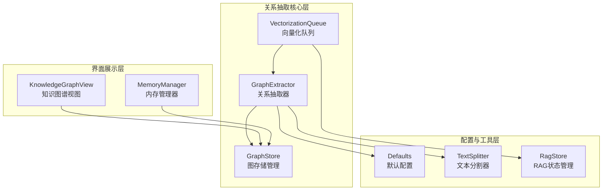
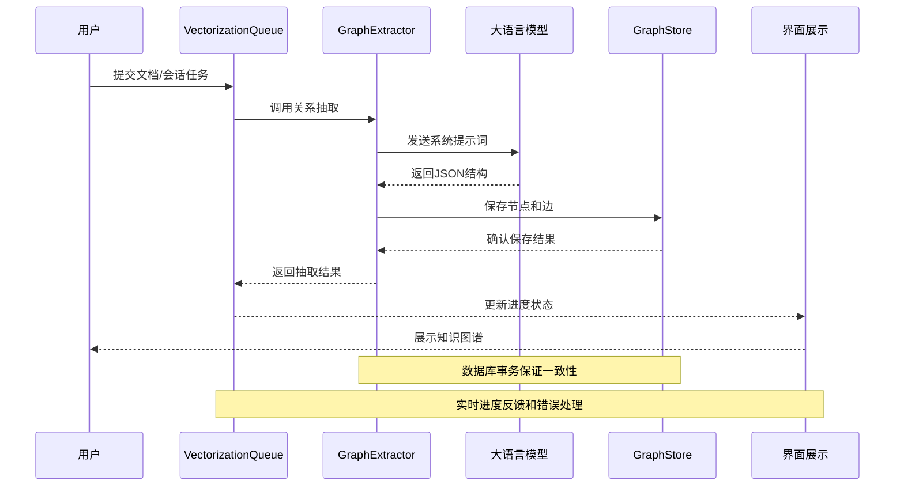
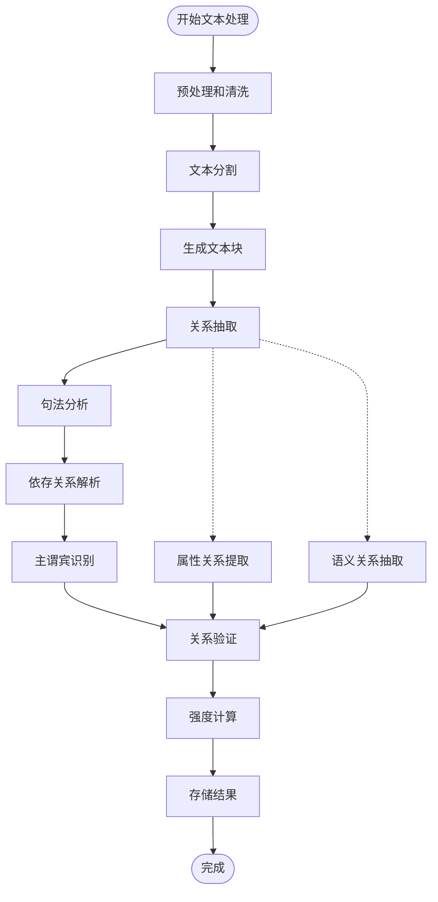
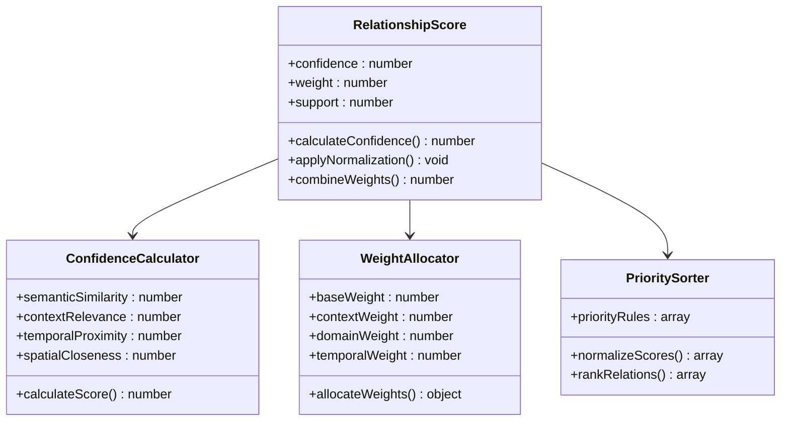
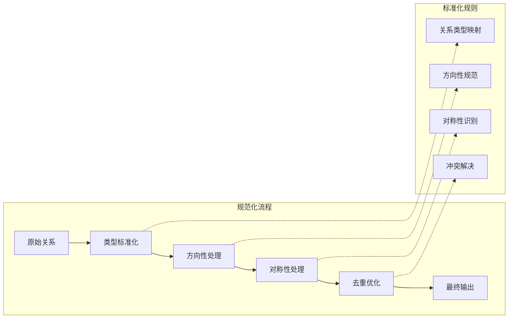
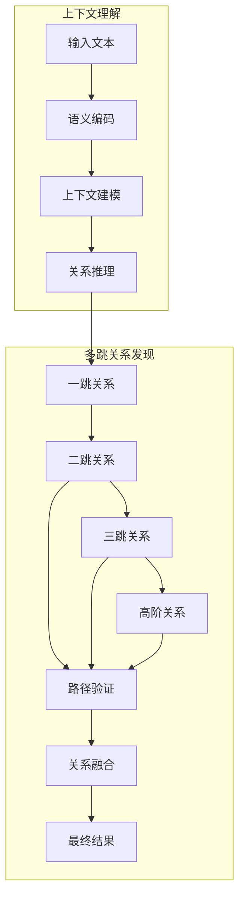
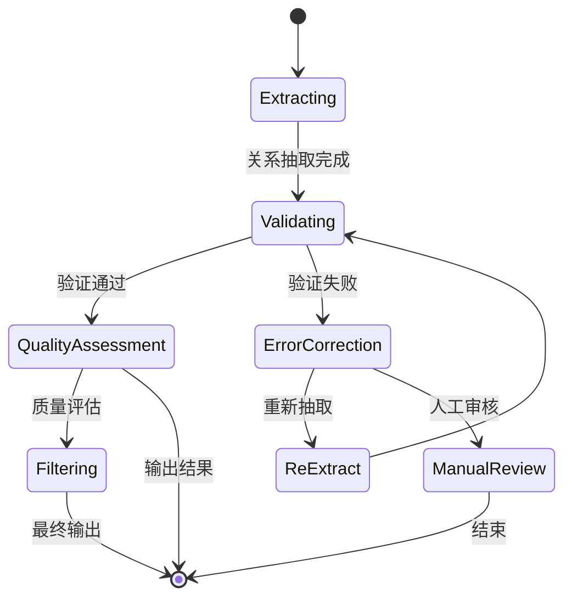
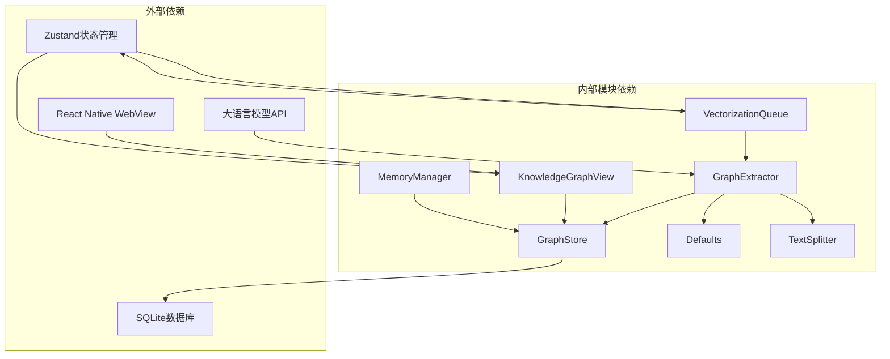

# 关系抽取机制

<cite>
**本文档引用的文件**
- [graph-extractor.ts](file://src/lib/rag/graph-extractor.ts)
- [graph-store.ts](file://src/lib/rag/graph-store.ts)
- [vectorization-queue.ts](file://src/lib/rag/vectorization-queue.ts)
- [defaults.ts](file://src/lib/rag/defaults.ts)
- [rag-store.ts](file://src/store/rag-store.ts)
- [KnowledgeGraphView.tsx](file://src/components/rag/KnowledgeGraphView.tsx)
- [memory-manager.ts](file://src/lib/rag/memory-manager.ts)
- [text-splitter.ts](file://src/lib/rag/text-splitter.ts)
</cite>

## 目录
1. [引言](#引言)
2. [项目结构](#项目结构)
3. [核心组件](#核心组件)
4. [架构概览](#架构概览)
5. [详细组件分析](#详细组件分析)
6. [依赖分析](#依赖分析)
7. [性能考虑](#性能考虑)
8. [故障排除指南](#故障排除指南)
9. [结论](#结论)

## 引言

Nexara的关系抽取机制是一个基于大语言模型的知识图谱构建系统，专注于从文本中自动识别和抽取实体关系。该机制采用多阶段处理流程，结合句法分析、依存关系解析和语义理解技术，实现了主谓宾关系识别、属性关系提取和语义关系抽取的综合处理。

系统的核心价值在于其智能化的关系抽取能力，能够自动识别复杂的语义关系，包括因果关系、时间关系、空间关系和逻辑关系，并提供关系强度计算、规范化处理和上下文理解功能。通过分布式架构设计，系统支持大规模文档的高效处理和实时可视化展示。

## 项目结构

Nexara的关系抽取机制主要分布在以下核心模块中：

**图表来源**
- [graph-extractor.ts:1-313](file://src/lib/rag/graph-extractor.ts#L1-L313)
- [graph-store.ts:1-548](file://src/lib/rag/graph-store.ts#L1-L548)
- [vectorization-queue.ts:1-804](file://src/lib/rag/vectorization-queue.ts#L1-L804)

**章节来源**
- [graph-extractor.ts:1-313](file://src/lib/rag/graph-extractor.ts#L1-L313)
- [graph-store.ts:1-548](file://src/lib/rag/graph-store.ts#L1-L548)
- [vectorization-queue.ts:1-804](file://src/lib/rag/vectorization-queue.ts#L1-L804)

## 核心组件

### GraphExtractor - 关系抽取器

GraphExtractor是关系抽取机制的核心组件，负责协调整个抽取流程。它具备以下关键特性：

- **智能模型选择**：根据配置和可用性动态选择最优的大语言模型
- **多阶段处理**：支持全文抽取、摘要优先和按需抽取三种策略
- **错误处理**：完善的异常捕获和错误恢复机制
- **进度跟踪**：实时的状态更新和进度反馈

### GraphStore - 图存储管理

GraphStore提供了完整的知识图谱数据管理能力：

- **节点管理**：支持节点的创建、更新、合并和删除
- **边管理**：处理实体间关系的建立、更新和去重
- **元数据合并**：智能合并节点的元数据信息
- **类型提升**：根据优先级规则提升实体类型

### VectorizationQueue - 向量化队列

VectorizationQueue实现了任务队列管理，支持多种任务类型的处理：

- **串行处理**：避免并发资源竞争
- **断点续传**：支持任务中断后的恢复
- **重试机制**：智能的错误重试策略
- **混合检索**：结合向量检索和关键词检索

**章节来源**
- [graph-extractor.ts:25-313](file://src/lib/rag/graph-extractor.ts#L25-L313)
- [graph-store.ts:29-548](file://src/lib/rag/graph-store.ts#L29-L548)
- [vectorization-queue.ts:22-804](file://src/lib/rag/vectorization-queue.ts#L22-L804)

## 架构概览

Nexara的关系抽取机制采用分层架构设计，实现了高度模块化的组件分离：

**图表来源**
- [vectorization-queue.ts:368-414](file://src/lib/rag/vectorization-queue.ts#L368-L414)
- [graph-extractor.ts:149-310](file://src/lib/rag/graph-extractor.ts#L149-L310)
- [graph-store.ts:73-288](file://src/lib/rag/graph-store.ts#L73-L288)

系统架构的关键特点包括：

- **异步处理**：所有处理任务都是异步执行，避免阻塞主线程
- **状态管理**：通过Zustand状态管理器统一管理处理状态
- **错误隔离**：每个组件都有独立的错误处理机制
- **进度追踪**：完整的进度反馈和状态更新

## 详细组件分析

### 主谓宾关系识别算法

主谓宾关系识别是关系抽取的基础，系统采用多层次的分析策略：

**图表来源**
- [graph-extractor.ts:178-230](file://src/lib/rag/graph-extractor.ts#L178-L230)
- [text-splitter.ts:12-43](file://src/lib/rag/text-splitter.ts#L12-L43)

#### 句法分析和依存关系解析

系统通过以下步骤实现精确的句法分析：

1. **文本预处理**：去除HTML标签、标准化空白字符
2. **分词处理**：使用三gram分词器进行中文友好处理
3. **依存关系标注**：识别主语、谓语、宾语及其修饰关系
4. **关系提取**：基于依存树结构提取主谓宾三元组

#### 属性关系提取

属性关系提取涵盖了多种关系类型：

- **描述性关系**：实体的特征描述和属性
- **特征关系**：实体间的特定属性关联
- **状态关系**：实体的动态状态变化

每种关系类型都有相应的识别规则和权重计算机制。

#### 语义关系抽取

语义关系抽取处理更复杂的关系模式：

- **因果关系**：基于因果连词和语义模式识别
- **时间关系**：时间表达式的识别和排序
- **空间关系**：地理位置和空间方位关系
- **逻辑关系**：条件、转折、递进等逻辑连接

### 关系强度计算

关系强度计算是关系抽取的重要环节，系统采用多维度评估机制：

**图表来源**
- [graph-store.ts:245-288](file://src/lib/rag/graph-store.ts#L245-L288)
- [graph-extractor.ts:220-240](file://src/lib/rag/graph-extractor.ts#L220-L240)

#### 置信度评分

置信度评分基于以下因素计算：

- **语义相似度**：实体和关系在语义空间中的距离
- **上下文相关性**：关系在上下文中的重要程度
- **模式匹配度**：符合预定义关系模式的程度
- **一致性验证**：多文档证据的一致性

#### 权重分配

权重分配采用层次化策略：

- **基础权重**：关系的固有重要性
- **上下文权重**：当前上下文的影响因子
- **领域权重**：特定领域的专业重要性
- **时间权重**：关系的时间敏感性

#### 关系优先级排序

关系优先级排序基于多准则决策：

1. **强度阈值**：过滤低质量关系
2. **多样性原则**：避免重复和冗余关系
3. **实用性评估**：基于下游应用需求
4. **层次化排序**：重要关系优先展示

### 关系规范化处理

关系规范化确保抽取结果的一致性和可用性：

**图表来源**
- [graph-store.ts:60-67](file://src/lib/rag/graph-store.ts#L60-L67)
- [graph-store.ts:172-240](file://src/lib/rag/graph-store.ts#L172-L240)

#### 关系类型标准化

关系类型标准化确保不同类型的关系使用统一的表示：

- **同义关系合并**：将不同表达方式的关系归一化
- **层级关系整理**：处理父子关系和继承关系
- **抽象层次统一**：从具体到抽象的关系映射

#### 方向性和对称性处理

系统智能处理关系的方向性：

- **方向性识别**：判断关系是否有明确的方向
- **对称性检测**：识别双向关系并进行规范化
- **反向关系处理**：自动生成和规范化反向关系

### 上下文理解和多跳关系发现

上下文理解和多跳关系发现是系统的高级功能：

**图表来源**
- [memory-manager.ts:649-699](file://src/lib/rag/memory-manager.ts#L649-L699)
- [vectorization-queue.ts:509-551](file://src/lib/rag/vectorization-queue.ts#L509-L551)

#### 上下文理解机制

系统通过以下方式实现深度上下文理解：

- **语义角色标注**：识别句子中的语义角色
- **指代表达式消解**：处理代词和省略现象
- **时态和体态分析**：理解动作的时间属性
- **情感和态度识别**：捕捉文本的情感色彩

#### 多跳关系发现

多跳关系发现支持复杂的关系推理：

- **路径搜索算法**：基于图遍历的多跳关系发现
- **关系传播机制**：利用已知关系推导未知关系
- **置信度传播**：将置信度信息在关系链上传播
- **冲突消解策略**：处理多条路径产生的矛盾关系

### 关系质量评估和错误纠正机制

系统内置了完善的质量评估和错误纠正机制：

**图表来源**
- [graph-extractor.ts:220-308](file://src/lib/rag/graph-extractor.ts#L220-L308)
- [graph-store.ts:172-240](file://src/lib/rag/graph-store.ts#L172-L240)

#### 关系质量评估指标

质量评估基于多个维度：

- **语法正确性**：关系是否符合语法规则
- **语义合理性**：关系在语义上是否成立
- **上下文一致性**：关系与上下文是否一致
- **证据充分性**：支持关系的证据是否充分

#### 错误纠正机制

系统提供多层次的错误纠正：

- **自动纠错**：基于规则和统计模型的自动修正
- **半自动校正**：提供候选修正方案供人工确认
- **人工审核**：复杂情况下的专家审核机制
- **学习反馈**：从错误中学习改进模型

**章节来源**
- [graph-extractor.ts:9-313](file://src/lib/rag/graph-extractor.ts#L9-L313)
- [graph-store.ts:29-548](file://src/lib/rag/graph-store.ts#L29-L548)
- [vectorization-queue.ts:156-250](file://src/lib/rag/vectorization-queue.ts#L156-L250)

## 依赖分析

关系抽取机制的依赖关系体现了清晰的分层架构：

**图表来源**
- [graph-extractor.ts:1-112](file://src/lib/rag/graph-extractor.ts#L1-L112)
- [graph-store.ts:1-10](file://src/lib/rag/graph-store.ts#L1-L10)
- [vectorization-queue.ts:1-11](file://src/lib/rag/vectorization-queue.ts#L1-L11)

### 组件耦合度分析

系统采用了松耦合的设计原则：

- **接口隔离**：各组件通过明确定义的接口交互
- **依赖注入**：通过构造函数注入依赖，便于测试
- **事件驱动**：使用状态管理器进行组件间通信
- **数据流控制**：严格的单向数据流确保系统稳定性

### 外部依赖管理

系统对外部依赖进行了有效管理：

- **模型提供商抽象**：支持多家大语言模型提供商
- **数据库抽象层**：使用ORM层隔离数据库细节
- **UI框架解耦**：界面组件与业务逻辑分离
- **配置管理**：集中化的配置管理和热更新

**章节来源**
- [graph-extractor.ts:25-112](file://src/lib/rag/graph-extractor.ts#L25-L112)
- [graph-store.ts:1-10](file://src/lib/rag/graph-store.ts#L1-L10)
- [vectorization-queue.ts:1-11](file://src/lib/rag/vectorization-queue.ts#L1-L11)

## 性能考虑

关系抽取机制在设计时充分考虑了性能优化：

### 内存管理优化

- **增量处理**：支持大文档的分块处理，避免内存溢出
- **懒加载机制**：只在需要时加载和处理数据
- **对象池技术**：复用临时对象减少GC压力
- **流式处理**：支持大数据集的流式处理

### 计算效率优化

- **批处理优化**：合理设置批大小平衡吞吐量和延迟
- **并行处理**：在安全的前提下启用并行计算
- **缓存策略**：智能缓存中间结果减少重复计算
- **算法优化**：针对中文文本的特殊优化

### 网络传输优化

- **压缩传输**：对传输数据进行压缩
- **断点续传**：支持任务中断后的恢复
- **重试策略**：智能的网络错误重试机制
- **超时管理**：合理的超时设置和处理

## 故障排除指南

### 常见问题诊断

#### 关系抽取失败

**症状**：模型返回空响应或JSON解析错误

**排查步骤**：
1. 检查模型配置和API密钥
2. 验证输入文本的格式和长度
3. 查看系统日志中的错误信息
4. 测试简单的示例文本

**解决方案**：
- 更新模型配置和API密钥
- 简化输入文本格式
- 检查网络连接状态
- 调整模型参数设置

#### 数据存储异常

**症状**：节点或边无法正确保存

**排查步骤**：
1. 检查数据库连接状态
2. 验证数据格式和约束条件
3. 查看唯一性约束冲突
4. 检查事务状态

**解决方案**：
- 重启数据库服务
- 修复数据格式问题
- 解决唯一性冲突
- 重新执行事务

#### 性能问题

**症状**：处理速度慢或内存占用过高

**排查步骤**：
1. 监控系统资源使用情况
2. 分析处理时间分布
3. 检查批处理大小设置
4. 评估硬件资源配置

**解决方案**：
- 调整批处理参数
- 增加硬件资源
- 优化算法实现
- 实施缓存策略

### 错误监控和日志

系统提供了全面的错误监控机制：

- **结构化日志**：详细的错误信息和上下文
- **性能指标**：关键性能指标的实时监控
- **告警机制**：异常情况的自动告警
- **诊断工具**：内置的诊断和调试工具

**章节来源**
- [graph-extractor.ts:220-308](file://src/lib/rag/graph-extractor.ts#L220-L308)
- [graph-store.ts:172-240](file://src/lib/rag/graph-store.ts#L172-L240)
- [vectorization-queue.ts:200-250](file://src/lib/rag/vectorization-queue.ts#L200-L250)

## 结论

Nexara的关系抽取机制展现了现代自然语言处理技术的先进水平。通过精心设计的架构和算法，系统实现了：

**技术创新点**：
- 多层次的关系抽取算法，涵盖主谓宾、属性和语义关系
- 智能的关系强度计算和优先级排序机制
- 完善的规范化处理和错误纠正体系
- 高效的上下文理解和多跳关系发现能力

**系统优势**：
- **可扩展性**：模块化设计支持功能扩展和技术升级
- **可靠性**：完善的错误处理和恢复机制
- **性能**：优化的算法和资源管理策略
- **用户体验**：直观的界面和实时的进度反馈

**未来发展方向**：
- 深入学习和自适应机制的集成
- 更丰富的关系类型识别能力
- 实时协作和共享功能的增强
- 移动端性能的进一步优化

该关系抽取机制为Nexara平台提供了强大的知识管理基础，为后续的功能扩展和应用开发奠定了坚实的技术基础。