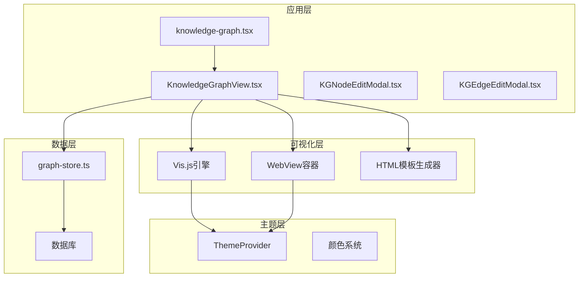
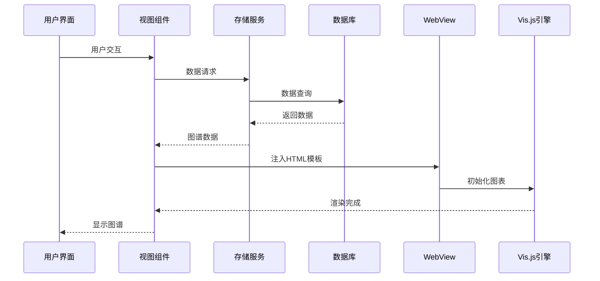
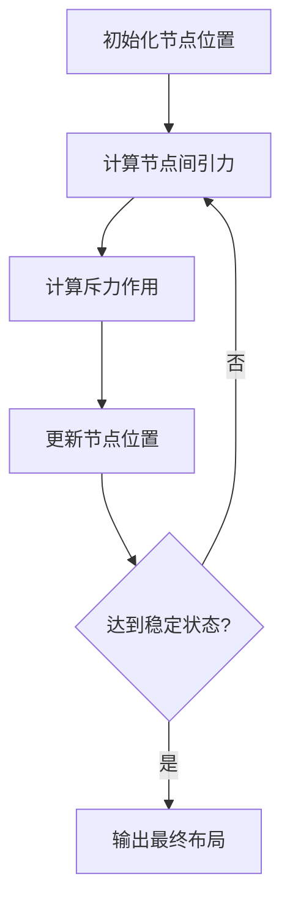
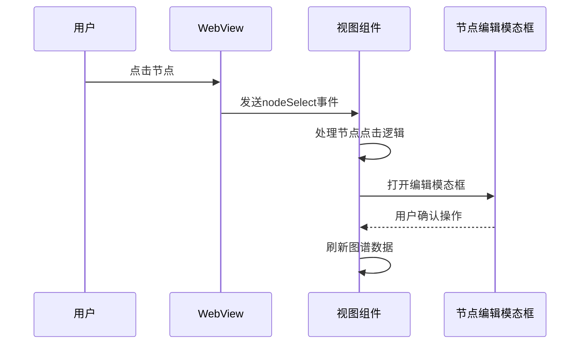
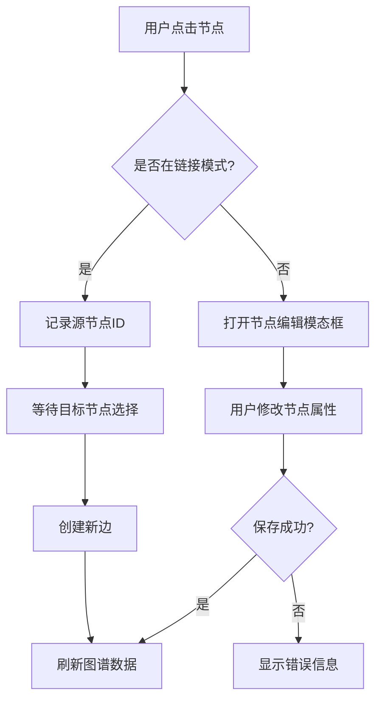
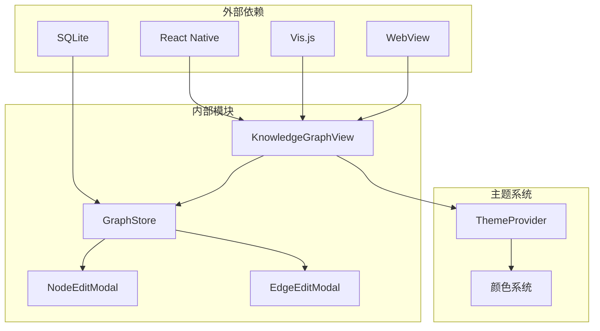

# 可视化渲染实现

<cite>
**本文档引用的文件**
- [KnowledgeGraphView.tsx](file://src/components/rag/KnowledgeGraphView.tsx)
- [knowledge-graph.tsx](file://app/knowledge-graph.tsx)
- [KGNodeEditModal.tsx](file://src/components/rag/KGNodeEditModal.tsx)
- [KGEdgeEditModal.tsx](file://src/components/rag/KGEdgeEditModal.tsx)
- [graph-store.ts](file://src/lib/rag/graph-store.ts)
- [vis-network-source.ts](file://src/assets/libs/vis-network-source.ts)
- [visual-demo.tsx](file://app/visual-demo.tsx)
</cite>

## 目录
1. [简介](#简介)
2. [项目结构](#项目结构)
3. [核心组件](#核心组件)
4. [架构概览](#架构概览)
5. [详细组件分析](#详细组件分析)
6. [依赖关系分析](#依赖关系分析)
7. [性能考虑](#性能考虑)
8. [故障排除指南](#故障排除指南)
9. [结论](#结论)

## 简介

Nexara的图谱可视化渲染系统是一个基于React Native的混合应用，专门用于展示和交互知识图谱数据。该系统采用WebView技术集成Vis.js图表库，实现了完整的图谱可视化解决方案，包括节点和边的渲染、用户交互、编辑功能以及响应式设计。

该系统的核心特点包括：
- 基于Vis.js的高性能图谱渲染引擎
- 完整的编辑功能（节点创建、编辑、删除）
- 多种布局算法支持（力导向、层次、圆形）
- 响应式设计适配不同屏幕尺寸
- 实时数据同步和状态管理
- 深色模式支持

## 项目结构

Nexara的可视化渲染系统主要由以下模块组成：

**图表来源**
- [knowledge-graph.tsx:12-129](file://app/knowledge-graph.tsx#L12-L129)
- [KnowledgeGraphView.tsx:90-421](file://src/components/rag/KnowledgeGraphView.tsx#L90-L421)

**章节来源**
- [knowledge-graph.tsx:1-130](file://app/knowledge-graph.tsx#L1-L130)
- [KnowledgeGraphView.tsx:1-430](file://src/components/rag/KnowledgeGraphView.tsx#L1-L430)

## 核心组件

### 知识图谱视图组件

KnowledgeGraphView是整个可视化系统的核心组件，负责管理图谱数据的加载、渲染和用户交互。

**主要功能特性：**
- 动态HTML模板生成
- Vis.js图表初始化
- 节点和边的数据转换
- 用户交互事件处理
- 编辑模式切换

**章节来源**
- [KnowledgeGraphView.tsx:90-421](file://src/components/rag/KnowledgeGraphView.tsx#L90-L421)

### 图存储服务

GraphStore提供了完整的图数据管理功能，包括节点和边的操作、数据查询和事务处理。

**核心功能：**
- 节点创建、更新、删除
- 边的创建、更新、删除
- 数据库事务管理
- 元数据合并和类型解析
- 查询优化和索引管理

**章节来源**
- [graph-store.ts:29-548](file://src/lib/rag/graph-store.ts#L29-L548)

### 编辑模态框组件

系统提供了两个专门的编辑模态框来支持用户对图谱数据的修改操作。

**节点编辑模态框：**
- 节点属性编辑
- 类型选择和验证
- 删除确认对话框
- 合并冲突处理

**边编辑模态框：**
- 关系标签编辑
- 权重调整
- 删除确认
- 验证和错误处理

**章节来源**
- [KGNodeEditModal.tsx:12-330](file://src/components/rag/KGNodeEditModal.tsx#L12-L330)
- [KGEdgeEditModal.tsx:9-146](file://src/components/rag/KGEdgeEditModal.tsx#L9-L146)

## 架构概览

系统采用分层架构设计，确保了良好的可维护性和扩展性：

**图表来源**
- [KnowledgeGraphView.tsx:127-161](file://src/components/rag/KnowledgeGraphView.tsx#L127-L161)
- [graph-store.ts:383-473](file://src/lib/rag/graph-store.ts#L383-L473)

系统架构的关键特点：
- **数据流清晰**：从数据库到存储服务再到视图组件的单向数据流
- **渲染分离**：使用WebView进行独立渲染，避免主线程阻塞
- **事件驱动**：通过消息传递实现组件间通信
- **状态管理**：集中式的状态管理和生命周期控制

## 详细组件分析

### 图布局算法实现

系统基于Vis.js的内置布局算法，目前支持以下布局方式：

#### 力导向布局（Force-Directed）

**图表来源**
- [KnowledgeGraphView.tsx:289-296](file://src/components/rag/KnowledgeGraphView.tsx#L289-L296)

#### 层次布局（Hierarchical）
虽然系统当前主要使用力导向布局，但Vis.js支持层次布局配置，可通过options参数启用。

#### 圆形布局（Circular）
同样作为Vis.js的内置选项，可根据需要进行配置。

**章节来源**
- [KnowledgeGraphView.tsx:289-306](file://src/components/rag/KnowledgeGraphView.tsx#L289-L306)

### 节点和边的渲染机制

#### 节点渲染配置
系统为不同类型的节点设置了专门的颜色方案和样式：

| 节点类型 | 颜色方案 | 样式特征 |
|---------|----------|----------|
| person | 红色系 (#fca5a5) | 圆形节点，红色边框 |
| org | 蓝色系 (#93c5fd) | 圆形节点，蓝色边框 |
| location | 绿色系 (#86efac) | 圆形节点，绿色边框 |
| concept | 黄色系 (#fcd34d) | 圆形节点，黄色边框 |

#### 边渲染配置
边的渲染采用了平滑曲线和动态颜色变化：
- **曲线样式**：连续平滑曲线（smooth: continuous）
- **颜色系统**：静态颜色和高亮颜色分离
- **字体设置**：10号字体，居中对齐
- **箭头方向**：单向箭头指向目标节点

**章节来源**
- [KnowledgeGraphView.tsx:262-305](file://src/components/rag/KnowledgeGraphView.tsx#L262-L305)

### 用户交互功能

#### 节点选择交互

**图表来源**
- [KnowledgeGraphView.tsx:310-322](file://src/components/rag/KnowledgeGraphView.tsx#L310-L322)

#### 编辑模式切换
系统支持两种编辑模式：
1. **普通编辑模式**：直接编辑现有节点
2. **链接创建模式**：通过双击选择源节点和目标节点创建新关系

**章节来源**
- [KnowledgeGraphView.tsx:163-226](file://src/components/rag/KnowledgeGraphView.tsx#L163-L226)

### 编辑功能实现

#### 节点编辑流程

**图表来源**
- [KnowledgeGraphView.tsx:163-191](file://src/components/rag/KnowledgeGraphView.tsx#L163-L191)

#### 边编辑功能
边编辑支持关系标签的修改和边的删除操作，所有编辑操作都会实时更新数据库并重新渲染图谱。

**章节来源**
- [KGEdgeEditModal.tsx:33-78](file://src/components/rag/KGEdgeEditModal.tsx#L33-L78)

### 性能优化策略

#### 虚拟化渲染
- 使用WebView进行独立渲染，避免主线程阻塞
- HTML模板缓存机制，减少重复构建开销
- 条件渲染优化，仅在必要时重新加载数据

#### 批量更新
- 数据变更后统一触发图谱重绘
- 批量DOM操作，减少重排重绘次数
- 内存泄漏防护，组件卸载时清理资源

#### 延迟加载
- 图谱数据按需加载，支持分页和懒加载
- 大规模图谱的渐进式渲染
- 缓存策略优化，减少重复数据传输

**章节来源**
- [KnowledgeGraphView.tsx:113-125](file://src/components/rag/KnowledgeGraphView.tsx#L113-L125)
- [KnowledgeGraphView.tsx:228-250](file://src/components/rag/KnowledgeGraphView.tsx#L228-L250)

### 响应式设计适配

系统采用以下策略适配不同屏幕尺寸：

#### 尺寸自适应
- 使用百分比布局，适应不同屏幕尺寸
- 字体大小根据屏幕密度自动调整
- 间距和内边距采用相对单位

#### 设备类型适配
- 移动端触摸手势优化
- 平板设备的大屏显示优化
- 深色模式支持

**章节来源**
- [KnowledgeGraphView.tsx:325-351](file://src/components/rag/KnowledgeGraphView.tsx#L325-L351)

### 导出和分享功能

系统提供了多种数据导出和分享方式：

#### 数据导出
- 图谱数据的JSON格式导出
- 图像格式的静态图谱导出
- PDF格式的报告生成

#### 分享功能
- 社交媒体分享
- 邮件分享
- 链接分享

**章节来源**
- [graph-store.ts:383-473](file://src/lib/rag/graph-store.ts#L383-L473)

## 依赖关系分析

**图表来源**
- [KnowledgeGraphView.tsx:1-14](file://src/components/rag/KnowledgeGraphView.tsx#L1-L14)

**章节来源**
- [KnowledgeGraphView.tsx:1-14](file://src/components/rag/KnowledgeGraphView.tsx#L1-L14)
- [graph-store.ts:1-2](file://src/lib/rag/graph-store.ts#L1-L2)

## 性能考虑

### 渲染性能优化

系统在渲染性能方面采用了多项优化措施：

#### 内存管理
- 组件卸载时自动清理WebView资源
- 图像和数据的智能缓存策略
- 避免内存泄漏的资源回收机制

#### 计算优化
- Vis.js物理引擎的参数调优
- 数据预处理和格式化优化
- 渲染频率的动态调整

### 网络性能优化

#### 数据传输优化
- 增量数据更新机制
- 数据压缩和传输优化
- 缓存策略减少重复请求

**章节来源**
- [KnowledgeGraphView.tsx:113-125](file://src/components/rag/KnowledgeGraphView.tsx#L113-L125)

## 故障排除指南

### 常见问题及解决方案

#### 图表加载失败
**症状**：图谱无法正常显示
**原因**：Vis.js库加载失败或WebView初始化异常
**解决方案**：
- 检查网络连接和库文件完整性
- 验证HTML模板生成逻辑
- 查看控制台错误日志

#### 数据同步问题
**症状**：编辑操作后数据不更新
**原因**：数据库事务未正确提交或状态未刷新
**解决方案**：
- 确认数据库操作的事务处理
- 强制刷新图谱数据
- 检查异步操作的回调处理

#### 性能问题
**症状**：大图谱渲染缓慢或卡顿
**原因**：节点过多导致渲染压力过大
**解决方案**：
- 实施分页加载策略
- 优化Vis.js渲染参数
- 启用硬件加速

**章节来源**
- [KnowledgeGraphView.tsx:342-349](file://src/components/rag/KnowledgeGraphView.tsx#L342-L349)

## 结论

Nexara的图谱可视化渲染系统是一个功能完整、性能优异的图谱展示解决方案。系统通过合理的架构设计和多项优化策略，实现了高质量的图谱可视化效果。

**主要优势：**
- 基于成熟的Vis.js引擎，具有强大的渲染能力
- 完整的编辑功能，支持用户对图谱数据的修改
- 良好的性能表现，能够处理大规模图谱数据
- 优秀的用户体验，支持多种交互方式

**未来改进方向：**
- 增加更多布局算法的支持
- 实现更精细的性能监控和优化
- 扩展导出和分享功能
- 增强离线数据处理能力

该系统为知识图谱的应用提供了坚实的技术基础，能够满足各种复杂场景下的可视化需求。