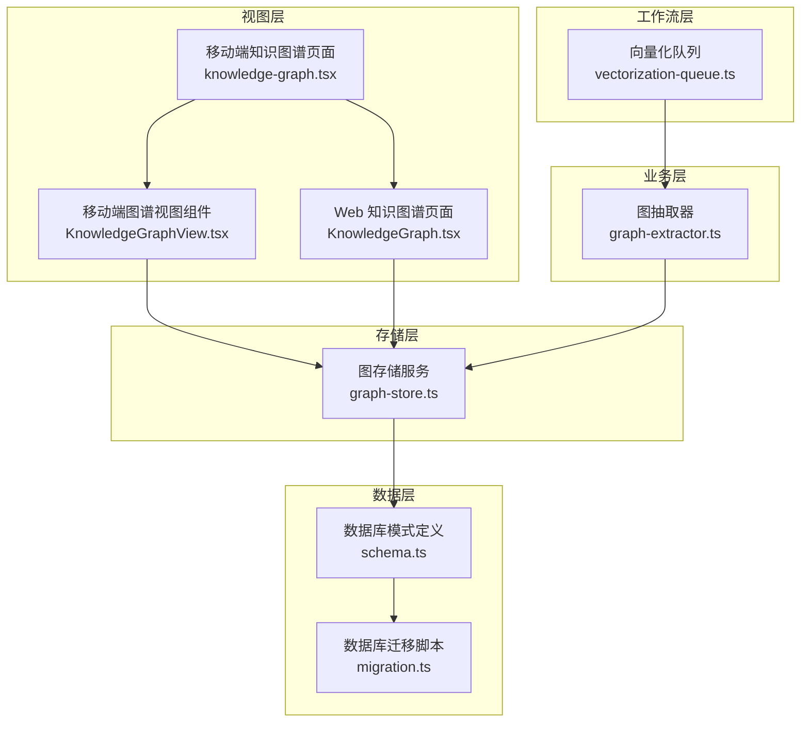
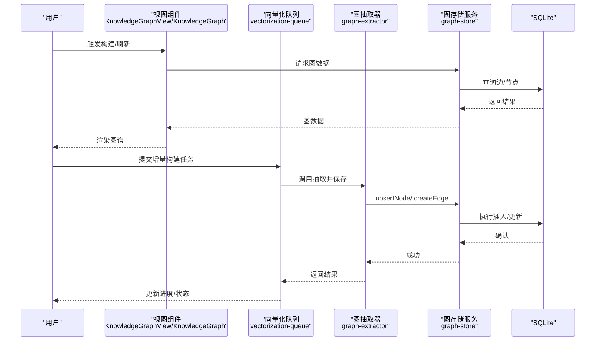
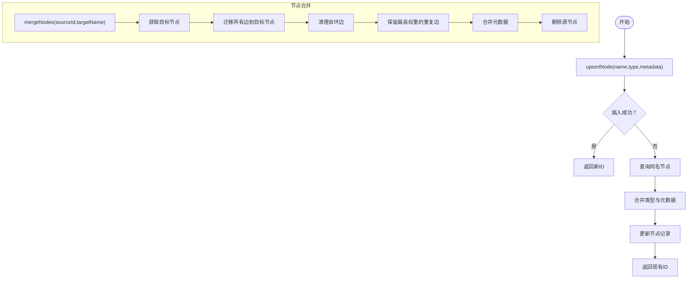
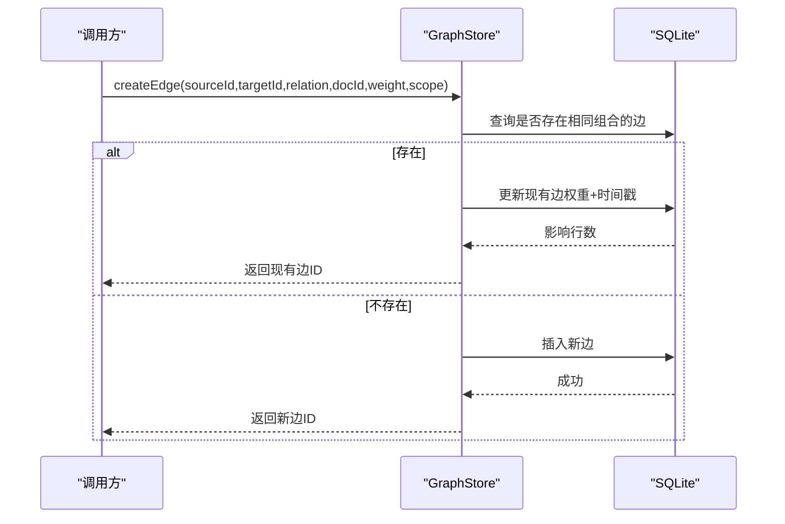
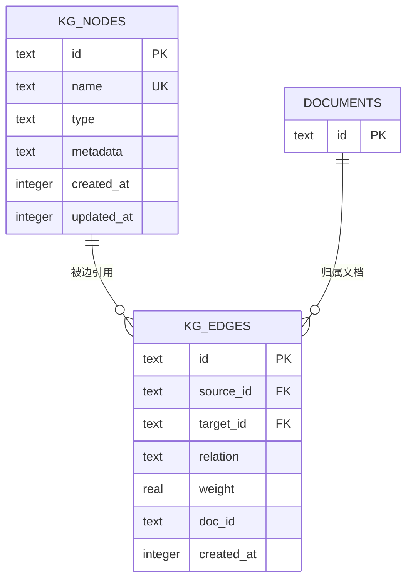
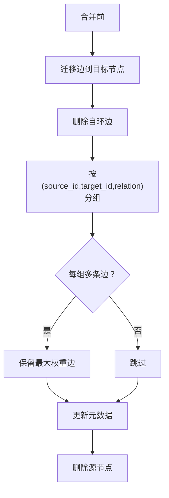
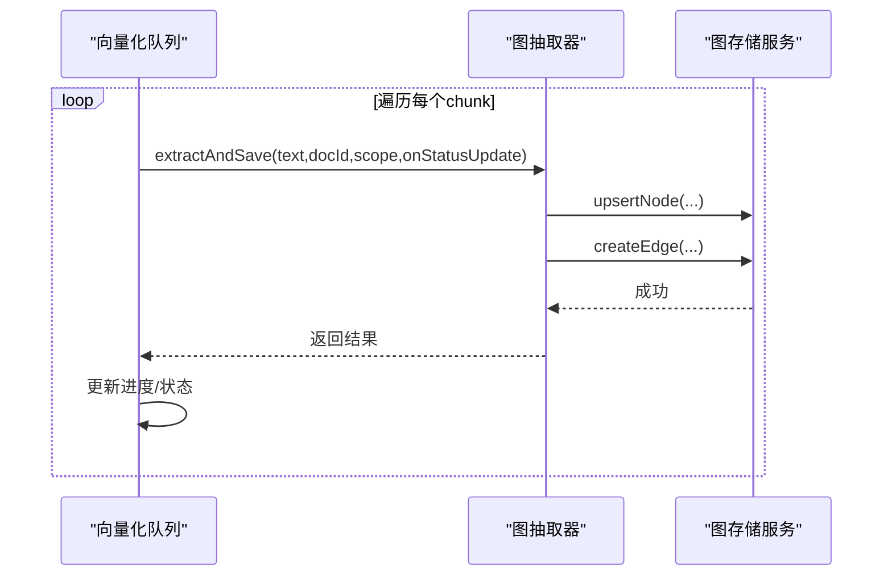
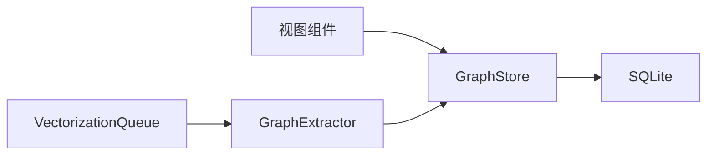

# 图结构构建

<cite>
**本文引用的文件**
- [knowledge-graph.tsx](file://app/knowledge-graph.tsx)
- [KnowledgeGraphView.tsx](file://src/components/rag/KnowledgeGraphView.tsx)
- [KnowledgeGraph.tsx](file://web-client/src/pages/KnowledgeGraph.tsx)
- [graph-store.ts](file://src/lib/rag/graph-store.ts)
- [graph-extractor.ts](file://src/lib/rag/graph-extractor.ts)
- [schema.ts](file://src/lib/db/schema.ts)
- [migration.ts](file://src/lib/db/migration.ts)
- [vectorization-queue.ts](file://src/lib/rag/vectorization-queue.ts)
- [audit-graph-store.ts](file://scripts/audit-graph-store.ts)
</cite>

## 目录
1. [简介](#简介)
2. [项目结构](#项目结构)
3. [核心组件](#核心组件)
4. [架构总览](#架构总览)
5. [详细组件分析](#详细组件分析)
6. [依赖分析](#依赖分析)
7. [性能考虑](#性能考虑)
8. [故障排查指南](#故障排查指南)
9. [结论](#结论)
10. [附录](#附录)

## 简介
本文件系统性阐述 Nexara 的图结构构建过程，覆盖从数据抽取、节点与边的创建与管理、到图存储与查询、可视化渲染、以及完整性与一致性保障等全流程。重点包括：
- 节点创建与去重、属性合并与元数据处理
- 边创建与维护、方向性、权重计算与关系验证
- 图存储架构（节点表、边表设计与索引策略）
- 图完整性检查（自环清理、重复边合并、类型优先级）
- 增量构建策略（增量更新、冲突解决、版本管理）
- 图压缩与优化（稀疏存储、内存优化）
- 并发控制与事务管理机制

## 项目结构
围绕“图结构构建”的关键模块分布如下：
- 视图层：移动端与 Web 双端知识图谱视图组件，负责交互与渲染
- 业务层：图抽取器，负责从文本中抽取实体与关系，并写入图存储
- 存储层：图存储服务，提供节点与边的增删改查、合并与查询
- 数据层：SQLite 表结构与迁移脚本，定义图存储的表与约束
- 工作流层：向量化队列，协调增量构建与批处理

**图表来源**
- [knowledge-graph.tsx:12-129](file://app/knowledge-graph.tsx#L12-L129)
- [KnowledgeGraphView.tsx:90-421](file://src/components/rag/KnowledgeGraphView.tsx#L90-L421)
- [KnowledgeGraph.tsx:32-479](file://web-client/src/pages/KnowledgeGraph.tsx#L32-L479)
- [graph-extractor.ts:25-313](file://src/lib/rag/graph-extractor.ts#L25-L313)
- [graph-store.ts:29-548](file://src/lib/rag/graph-store.ts#L29-L548)
- [schema.ts:218-265](file://src/lib/db/schema.ts#L218-L265)
- [migration.ts:154-179](file://src/lib/db/migration.ts#L154-L179)
- [vectorization-queue.ts:371-553](file://src/lib/rag/vectorization-queue.ts#L371-L553)

**章节来源**
- [knowledge-graph.tsx:12-129](file://app/knowledge-graph.tsx#L12-L129)
- [KnowledgeGraphView.tsx:90-421](file://src/components/rag/KnowledgeGraphView.tsx#L90-L421)
- [KnowledgeGraph.tsx:32-479](file://web-client/src/pages/KnowledgeGraph.tsx#L32-L479)
- [graph-extractor.ts:25-313](file://src/lib/rag/graph-extractor.ts#L25-L313)
- [graph-store.ts:29-548](file://src/lib/rag/graph-store.ts#L29-L548)
- [schema.ts:218-265](file://src/lib/db/schema.ts#L218-L265)
- [migration.ts:154-179](file://src/lib/db/migration.ts#L154-L179)
- [vectorization-queue.ts:371-553](file://src/lib/rag/vectorization-queue.ts#L371-L553)

## 核心组件
- 图存储服务（GraphStore）
  - 节点操作：upsertNode、updateNode、deleteNode、mergeNodes
  - 边操作：createEdge、updateEdge、deleteEdge
  - 查询：getGraphData、getEdgesForNode、getAllNodes
  - 元数据合并与类型优先级策略
- 图抽取器（GraphExtractor）
  - 选择模型与系统提示词
  - 从文本块抽取 JSON 结构的节点与边
  - 写入图存储并上报进度
- 视图组件
  - 移动端：基于 WebView + vis.js 渲染，支持节点/边编辑与链接模式
  - Web：基于 react-force-graph-2d 渲染，支持筛选、搜索与缩放
- 数据库模式与迁移
  - 定义 kg_nodes 与 kg_edges 表，含唯一约束、外键与字段
  - 迁移脚本确保表存在与列补全

**章节来源**
- [graph-store.ts:29-548](file://src/lib/rag/graph-store.ts#L29-L548)
- [graph-extractor.ts:25-313](file://src/lib/rag/graph-extractor.ts#L25-L313)
- [KnowledgeGraphView.tsx:90-421](file://src/components/rag/KnowledgeGraphView.tsx#L90-L421)
- [KnowledgeGraph.tsx:32-479](file://web-client/src/pages/KnowledgeGraph.tsx#L32-L479)
- [schema.ts:218-265](file://src/lib/db/schema.ts#L218-L265)
- [migration.ts:154-179](file://src/lib/db/migration.ts#L154-L179)

## 架构总览
下图展示从文本到图谱的端到端流程，以及视图层与存储层的交互。

**图表来源**
- [KnowledgeGraphView.tsx:131-161](file://src/components/rag/KnowledgeGraphView.tsx#L131-L161)
- [KnowledgeGraph.tsx:79-111](file://web-client/src/pages/KnowledgeGraph.tsx#L79-L111)
- [vectorization-queue.ts:371-553](file://src/lib/rag/vectorization-queue.ts#L371-L553)
- [graph-extractor.ts:149-313](file://src/lib/rag/graph-extractor.ts#L149-L313)
- [graph-store.ts:73-118](file://src/lib/rag/graph-store.ts#L73-L118)

## 详细组件分析

### 节点创建与管理机制
- 去重与合并
  - upsertNode：按名称唯一约束插入或忽略；若冲突则合并类型与元数据并更新
  - mergeNodes：将源节点的所有边迁移到目标节点，清理自环与重复边，合并元数据后删除源节点
- 属性合并与元数据处理
  - mergeMetadata：对数组值进行去重合并，对对象键值进行覆盖合并
  - resolveType：按预设优先级提升类型（如从 concept 到 person/ org/ location/ event/ product）
- 查询与更新
  - getEdgesForNode：查询某节点的入边与出边
  - updateNode：按字段更新名称/类型

**图表来源**
- [graph-store.ts:73-118](file://src/lib/rag/graph-store.ts#L73-L118)
- [graph-store.ts:172-240](file://src/lib/rag/graph-store.ts#L172-L240)

**章节来源**
- [graph-store.ts:34-118](file://src/lib/rag/graph-store.ts#L34-L118)
- [graph-store.ts:172-240](file://src/lib/rag/graph-store.ts#L172-L240)

### 边创建与维护流程
- 方向性与关系验证
  - createEdge：以 (source_id, target_id, relation, doc_id, session_id) 作为联合去重键
  - 若已存在，则累加权重并更新时间戳；否则插入新边
- 权重计算
  - 累加策略：相同关系的重复边权重相加，保留最高权重边
- 关系验证与过滤
  - 查询时支持按 docIds、sessionId、agentId 过滤，保证作用域隔离

**图表来源**
- [graph-store.ts:245-288](file://src/lib/rag/graph-store.ts#L245-L288)

**章节来源**
- [graph-store.ts:257-288](file://src/lib/rag/graph-store.ts#L257-L288)

### 图存储架构与索引策略
- 表结构
  - kg_nodes：主键 id，唯一约束 name，包含 type、metadata、created_at、updated_at
  - kg_edges：主键 id，外键 source_id/target_id 引用 kg_nodes，doc_id 引用 documents，包含 relation、weight、created_at
- 约束与隔离
  - 唯一约束 name 防止节点重名
  - 外键约束保证节点与文档存在性，删除级联清理边
- 查询隔离
  - getGraphData 支持按 docIds、sessionId、agentId 过滤，避免跨作用域污染

**图表来源**
- [schema.ts:239-265](file://src/lib/db/schema.ts#L239-L265)

**章节来源**
- [schema.ts:239-265](file://src/lib/db/schema.ts#L239-L265)
- [migration.ts:154-179](file://src/lib/db/migration.ts#L154-L179)
- [graph-store.ts:383-473](file://src/lib/rag/graph-store.ts#L383-L473)

### 图完整性检查与一致性维护
- 自环清理：mergeNodes 后删除 source_id=target_id 的自环边
- 重复边合并：仅保留同一 (source_id, target_id, relation) 组合中权重最高的边
- 类型优先级：resolveType 按预设顺序提升类型，避免降级
- 唯一约束：节点 name 唯一，更新时对已知约束错误进行显式抛出

**图表来源**
- [graph-store.ts:186-240](file://src/lib/rag/graph-store.ts#L186-L240)

**章节来源**
- [graph-store.ts:186-240](file://src/lib/rag/graph-store.ts#L186-L240)

### 增量构建策略与版本管理
- 增量更新
  - vectorization-queue：支持 full 与 summary-first 策略，逐块抽取并写入图存储
  - 对每个 chunk 调用 graphExtractor.extractAndSave，逐步推进进度
- 冲突解决
  - upsertNode：名称冲突时合并类型与元数据
  - createEdge：关系重复时累加权重
- 版本管理
  - 通过 created_at/updated_at 字段记录变更时间
  - scope 参数（sessionId/agentId/messageId）用于作用域隔离与追踪

**图表来源**
- [vectorization-queue.ts:371-553](file://src/lib/rag/vectorization-queue.ts#L371-L553)
- [graph-extractor.ts:149-313](file://src/lib/rag/graph-extractor.ts#L149-L313)
- [graph-store.ts:73-118](file://src/lib/rag/graph-store.ts#L73-L118)

**章节来源**
- [vectorization-queue.ts:371-553](file://src/lib/rag/vectorization-queue.ts#L371-L553)
- [graph-extractor.ts:149-313](file://src/lib/rag/graph-extractor.ts#L149-L313)
- [graph-store.ts:73-118](file://src/lib/rag/graph-store.ts#L73-L118)

### 图压缩与优化技术
- 稀疏存储
  - 仅在过滤条件下拉取相关节点集合，避免全量扫描
- 内存优化
  - 视图层采用 DataSet 包装数据，按需渲染
  - 移动端 WebView 注入脚本时对大数据进行序列化与字符串拼接，避免大对象直接传递
- 权重聚合
  - 重复边合并保留最高权重，减少冗余存储

**章节来源**
- [KnowledgeGraphView.tsx:252-327](file://src/components/rag/KnowledgeGraphView.tsx#L252-L327)
- [graph-store.ts:383-473](file://src/lib/rag/graph-store.ts#L383-L473)

### 并发控制与事务管理
- 并发与锁
  - upsertNode 使用 INSERT OR IGNORE + 查询回填，避免竞态导致的唯一约束冲突
  - createEdge 在应用层先查询再更新，利用数据库原子性保证幂等
- 事务建议
  - 当前实现未显式开启事务；对于批量 upsert/upsertNode+createEdge 的场景，可考虑在数据库层包裹事务以提升一致性与性能
- 错误处理
  - 对已知约束错误进行捕获与抛出，避免静默失败
  - audit 脚本验证节点/边的增删改查与合并流程

**章节来源**
- [graph-store.ts:83-118](file://src/lib/rag/graph-store.ts#L83-L118)
- [graph-store.ts:257-288](file://src/lib/rag/graph-store.ts#L257-L288)
- [audit-graph-store.ts:30-84](file://scripts/audit-graph-store.ts#L30-L84)

## 依赖分析
- 组件耦合
  - 视图组件依赖 graphStore 获取/提交数据
  - 图抽取器依赖 graphStore 写入节点与边
  - 向量化队列协调抽取与进度上报
- 外部依赖
  - SQLite：kg_nodes/ kg_edges 表与约束
  - Web 端 vis.js/ react-force-graph-2d：图渲染

**图表来源**
- [KnowledgeGraphView.tsx:90-161](file://src/components/rag/KnowledgeGraphView.tsx#L90-L161)
- [KnowledgeGraph.tsx:79-111](file://web-client/src/pages/KnowledgeGraph.tsx#L79-L111)
- [graph-extractor.ts:149-313](file://src/lib/rag/graph-extractor.ts#L149-L313)
- [graph-store.ts:29-548](file://src/lib/rag/graph-store.ts#L29-L548)
- [vectorization-queue.ts:371-553](file://src/lib/rag/vectorization-queue.ts#L371-L553)

**章节来源**
- [KnowledgeGraphView.tsx:90-161](file://src/components/rag/KnowledgeGraphView.tsx#L90-L161)
- [KnowledgeGraph.tsx:79-111](file://web-client/src/pages/KnowledgeGraph.tsx#L79-L111)
- [graph-extractor.ts:149-313](file://src/lib/rag/graph-extractor.ts#L149-L313)
- [graph-store.ts:29-548](file://src/lib/rag/graph-store.ts#L29-L548)
- [vectorization-queue.ts:371-553](file://src/lib/rag/vectorization-queue.ts#L371-L553)

## 性能考虑
- 查询性能
  - 仅在过滤条件下拉取相关节点，避免全表扫描
  - 建议在 (source_id, target_id)、(doc_id, session_id) 等高频查询列建立索引
- 写入性能
  - 批量 upsertNode 后再批量 createEdge，减少往返
  - 对于大量节点/边，考虑分批执行与事务包裹
- 渲染性能
  - Web 端使用 react-force-graph-2d 的 canvas 渲染与粒子效果
  - 移动端使用 vis.js DataSet，避免频繁重建 DOM

[本节为通用指导，不直接分析具体文件]

## 故障排查指南
- 节点唯一冲突
  - 现象：upsertNode 抛出唯一约束错误
  - 排查：确认 name 是否重复；检查 mergeMetadata 逻辑是否正确合并
- 边重复与权重异常
  - 现象：重复关系出现多条边或权重未叠加
  - 排查：确认 createEdge 的去重键与累加逻辑；检查 mergeNodes 是否清理重复边
- 自环边导致渲染异常
  - 现象：自引用边造成布局异常
  - 排查：mergeNodes 后是否清理自环边
- 视图无数据
  - 现象：视图显示空状态
  - 排查：getGraphData 的过滤条件（docIds/sessionId/agentId）是否正确；数据库中是否存在匹配记录

**章节来源**
- [audit-graph-store.ts:30-84](file://scripts/audit-graph-store.ts#L30-L84)
- [graph-store.ts:186-240](file://src/lib/rag/graph-store.ts#L186-L240)
- [graph-store.ts:257-288](file://src/lib/rag/graph-store.ts#L257-L288)

## 结论
Nexara 的图结构构建以 GraphStore 为核心，结合 GraphExtractor 的抽取能力与双端视图组件的渲染，实现了从文本到图谱的完整闭环。通过去重、合并与权重累加等机制，保证了节点与边的一致性；通过作用域过滤与外键约束，确保了数据隔离与完整性。后续可在索引、事务与批处理方面进一步优化，以支撑更大规模的增量构建与实时渲染需求。

[本节为总结性内容，不直接分析具体文件]

## 附录
- 作用域参数
  - sessionId：会话级隔离
  - agentId：代理级隔离
  - messageId/docId：文档级隔离
- 视图交互
  - 移动端支持链接模式与节点/边编辑弹窗
  - Web 端支持类型过滤、搜索与缩放

**章节来源**
- [graph-store.ts:383-473](file://src/lib/rag/graph-store.ts#L383-L473)
- [KnowledgeGraphView.tsx:163-226](file://src/components/rag/KnowledgeGraphView.tsx#L163-L226)
- [KnowledgeGraph.tsx:160-186](file://web-client/src/pages/KnowledgeGraph.tsx#L160-L186)