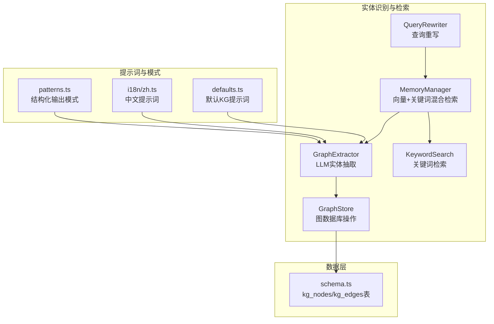
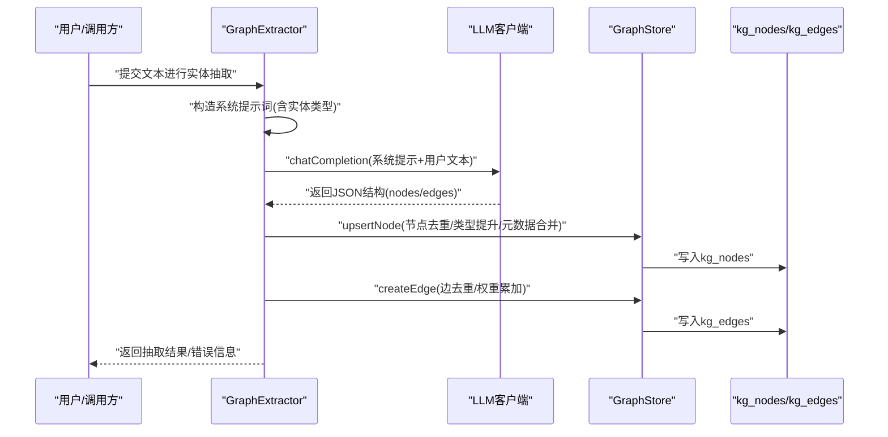
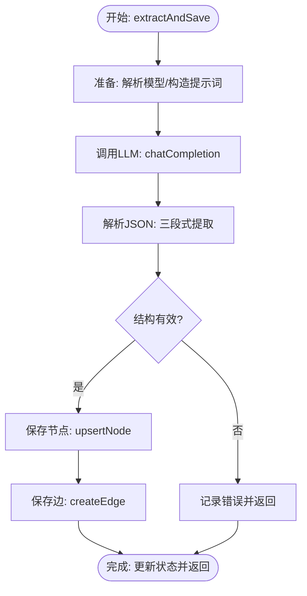
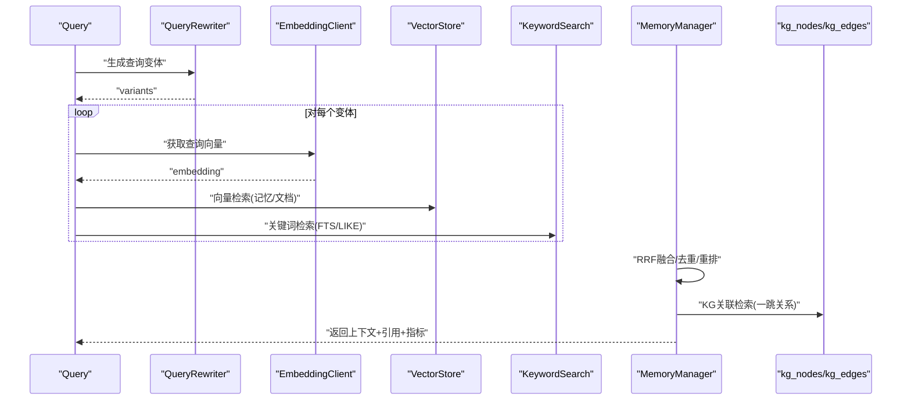
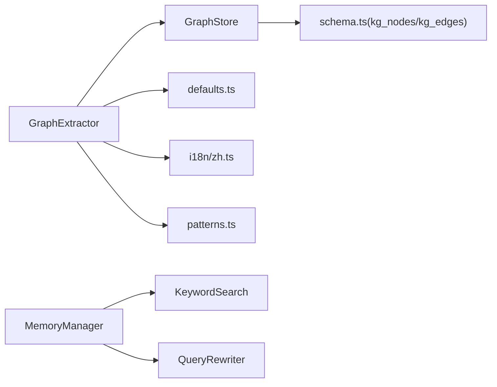

# 实体识别算法

<cite>
**本文档引用的文件**
- [graph-extractor.ts](file://src/lib/rag/graph-extractor.ts)
- [graph-store.ts](file://src/lib/rag/graph-store.ts)
- [defaults.ts](file://src/lib/rag/defaults.ts)
- [schema.ts](file://src/lib/db/schema.ts)
- [memory-manager.ts](file://src/lib/rag/memory-manager.ts)
- [keyword-search.ts](file://src/lib/rag/keyword-search.ts)
- [query-rewriter.ts](file://src/lib/rag/query-rewriter.ts)
- [patterns.ts](file://src/lib/llm/patterns.ts)
- [zh.ts](file://src/lib/llm/prompts/i18n/zh.ts)
- [context-builder.ts](file://src/store/chat/context-builder.ts)
</cite>

## 目录
1. [简介](#简介)
2. [项目结构](#项目结构)
3. [核心组件](#核心组件)
4. [架构总览](#架构总览)
5. [详细组件分析](#详细组件分析)
6. [依赖关系分析](#依赖关系分析)
7. [性能考量](#性能考量)
8. [故障排查指南](#故障排查指南)
9. [结论](#结论)

## 简介
本文件针对Nexara项目中的知识图谱实体抽取与检索能力进行系统化技术说明。尽管项目未内置传统意义上的“正则+词典+上下文”的手工规则实体识别模块，但其通过LLM驱动的知识图谱抽取（GraphExtractor）、本地向量检索（MemoryManager）、关键词检索（KeywordSearch）以及查询重写（QueryRewriter）等组件，实现了对命名实体的识别、术语提取、实体类型分类、消歧与链接到知识库的能力。本文将围绕以下主题展开：
- 命名实体识别（NER）的实现原理与流程
- 术语提取机制（专业词汇、缩写展开、同义词处理）
- 实体类型分类系统（概念、人物、组织、地点、事件、产品）
- 实体消歧（上下文分析、共指消解、唯一标识符生成）
- 实体链接到知识库（模糊匹配与相似度计算）
- 性能优化策略与准确率提升方法

## 项目结构
与实体识别相关的核心代码主要分布在以下模块：
- 知识图谱抽取：GraphExtractor（LLM抽取）、GraphStore（图存储）
- 检索与融合：MemoryManager（向量+关键词混合检索）、KeywordSearch（关键词检索）
- 查询理解：QueryRewriter（HyDE/Multi-Query/Expansion）
- 提示词与模式：defaults.ts、i18n语言包、patterns.ts
- 数据库Schema：kg_nodes、kg_edges表定义



**图表来源**
- [graph-extractor.ts:1-313](file://src/lib/rag/graph-extractor.ts#L1-L313)
- [graph-store.ts:1-548](file://src/lib/rag/graph-store.ts#L1-L548)
- [memory-manager.ts:1-997](file://src/lib/rag/memory-manager.ts#L1-L997)
- [keyword-search.ts:1-204](file://src/lib/rag/keyword-search.ts#L1-L204)
- [query-rewriter.ts:1-88](file://src/lib/rag/query-rewriter.ts#L1-L88)
- [defaults.ts:1-38](file://src/lib/rag/defaults.ts#L1-L38)
- [zh.ts:155-193](file://src/lib/llm/prompts/i18n/zh.ts#L155-L193)
- [patterns.ts:1-18](file://src/lib/llm/patterns.ts#L1-L18)
- [schema.ts:239-265](file://src/lib/db/schema.ts#L239-L265)

**章节来源**
- [graph-extractor.ts:1-313](file://src/lib/rag/graph-extractor.ts#L1-L313)
- [graph-store.ts:1-548](file://src/lib/rag/graph-store.ts#L1-L548)
- [memory-manager.ts:1-997](file://src/lib/rag/memory-manager.ts#L1-L997)
- [keyword-search.ts:1-204](file://src/lib/rag/keyword-search.ts#L1-L204)
- [query-rewriter.ts:1-88](file://src/lib/rag/query-rewriter.ts#L1-L88)
- [defaults.ts:1-38](file://src/lib/rag/defaults.ts#L1-L38)
- [zh.ts:155-193](file://src/lib/llm/prompts/i18n/zh.ts#L155-L193)
- [patterns.ts:1-18](file://src/lib/llm/patterns.ts#L1-L18)
- [schema.ts:239-265](file://src/lib/db/schema.ts#L239-L265)

## 核心组件
- GraphExtractor：负责从文本中抽取实体与关系，调用LLM生成JSON结构，再写入图数据库。
- GraphStore：提供节点与边的增删改查、合并、去重、类型提升等操作。
- MemoryManager：整合向量检索与关键词检索，支持HyDE/Multi-Query/Expansion三种查询重写策略，实现混合检索与重排。
- KeywordSearch：基于SQLite FTS5或LIKE的关键词检索，作为混合检索的补充。
- QueryRewriter：根据策略生成查询变体，提升召回。
- defaults.ts与i18n语言包：提供本地化的KG抽取提示词模板。
- patterns.ts：定义LLM结构化输出的识别模式，辅助解析与过滤。

**章节来源**
- [graph-extractor.ts:25-313](file://src/lib/rag/graph-extractor.ts#L25-L313)
- [graph-store.ts:29-548](file://src/lib/rag/graph-store.ts#L29-L548)
- [memory-manager.ts:10-712](file://src/lib/rag/memory-manager.ts#L10-L712)
- [keyword-search.ts:9-204](file://src/lib/rag/keyword-search.ts#L9-L204)
- [query-rewriter.ts:11-88](file://src/lib/rag/query-rewriter.ts#L11-L88)
- [defaults.ts:7-38](file://src/lib/rag/defaults.ts#L7-L38)
- [zh.ts:155-193](file://src/lib/llm/prompts/i18n/zh.ts#L155-L193)
- [patterns.ts:7-18](file://src/lib/llm/patterns.ts#L7-L18)

## 架构总览
下图展示了从输入文本到实体抽取、存储、检索与上下文融合的完整流程：



**图表来源**
- [graph-extractor.ts:149-310](file://src/lib/rag/graph-extractor.ts#L149-L310)
- [graph-store.ts:73-288](file://src/lib/rag/graph-store.ts#L73-L288)
- [schema.ts:239-265](file://src/lib/db/schema.ts#L239-L265)

## 详细组件分析

### GraphExtractor：LLM驱动的实体抽取
- 模型解析与选择：根据配置解析目标模型ID，遍历可用提供商，应用启发式优先级（如Gemini优先Google/Vertex）。
- 系统提示词：支持自定义提示词与实体类型注入，若缺失占位符则追加本地化fallback提示。
- JSON解析与健壮性：优先匹配```json块，其次尝试通用代码块，最后尝试手动截取首尾花括号，捕获空响应与非法JSON错误。
- 写入流程：先保存节点（upsertNode），再保存边（createEdge），期间进行UI线程让渡避免卡顿。



**图表来源**
- [graph-extractor.ts](file://src/lib/rag/graph-extractor.ts#L149-L310)

**章节来源**
- [graph-extractor.ts](file://src/lib/rag/graph-extractor.ts#L25-L313)
- [defaults.ts](file://src/lib/rag/defaults.ts#L7-L38)
- [zh.ts](file://src/lib/llm/prompts/i18n/zh.ts#L155-L180)

### GraphStore：实体存储与消歧
- 节点Upsert：INSERT OR IGNORE + 冲突时查询合并，支持元数据合并与类型提升（按优先级顺序）。
- 边去重与权重累加：相同source/target/relation的边合并，权重相加，保留最高权重策略。
- 节点合并：将源节点的所有边迁移到目标节点，清理自环与重复边，合并元数据。
- 图查询：支持按文档/会话/代理维度隔离查询，便于上下文感知的检索。

```mermaid
classDiagram
class GraphStore {
+upsertNode(name, type, metadata, scope) string
+createEdge(sourceId, targetId, relation, docId, weight, scope) string
+mergeNodes(sourceId, targetName) void
+getGraphData(docIds, sessionId, agentId) {nodes, edges}
}
class KGNode {
+string id
+string name
+string type
+any metadata
+number createdAt
}
class KGEdge {
+string id
+string sourceId
+string targetId
+string relation
+number weight
+string docId
+number createdAt
}
GraphStore --> KGNode : "管理"
GraphStore --> KGEdge : "管理"
```

**图表来源**
- [graph-store.ts](file://src/lib/rag/graph-store.ts#L29-L548)

**章节来源**
- [graph-store.ts](file://src/lib/rag/graph-store.ts#L60-L288)
- [schema.ts](file://src/lib/db/schema.ts#L239-L265)

### MemoryManager：混合检索与上下文融合
- 查询重写：支持HyDE（假设文档嵌入）、Multi-Query（多角度问题）、Expansion（关键词扩展）三种策略，提升召回。
- 向量检索：并行执行记忆与文档向量检索，支持摘要向量召回。
- 关键词检索：基于FTS5 MATCH或LIKE，支持会话/文档过滤，性能优化（截断超长查询、bm25归一化）。
- 混合检索：RRF（Reciprocal Rank Fusion）融合向量与关键词结果，alpha与bm25Boost可调。
- 重排：可选rerank模型精排，统计耗时与召回分布。
- 知识图谱检索：基于已召回文本中的实体名，反查kg_nodes并拉取一跳关系，结合文档权限过滤。



**图表来源**
- [memory-manager.ts](file://src/lib/rag/memory-manager.ts#L11-L712)
- [query-rewriter.ts](file://src/lib/rag/query-rewriter.ts#L24-L86)
- [keyword-search.ts](file://src/lib/rag/keyword-search.ts#L16-L204)

**章节来源**
- [memory-manager.ts](file://src/lib/rag/memory-manager.ts#L11-L712)
- [query-rewriter.ts](file://src/lib/rag/query-rewriter.ts#L11-L88)
- [keyword-search.ts](file://src/lib/rag/keyword-search.ts#L9-L204)

### 术语提取机制
- 专业词汇识别：KG抽取提示词明确要求保留“精确名称”，并限定实体类型集合，确保专业术语被规范化命名。
- 缩写展开与同义词处理：通过查询重写中的Expansion策略将原始查询扩展为包含同义词与相关术语的组合，提升召回；同时KG抽取提示词鼓励使用“关系动词”与“简短描述”，有助于形成术语间的语义关联。
- 上下文增强：KG检索阶段基于已召回文本中的实体名进行一跳关系扩展，形成术语间的关系网络。

**章节来源**
- [zh.ts](file://src/lib/llm/prompts/i18n/zh.ts#L155-L189)
- [memory-manager.ts](file://src/lib/rag/memory-manager.ts#L628-L699)

### 实体类型分类系统
- 类型定义：支持Concept、Person、Organization、Location、Event、Product六类实体。
- 类型提升：GraphStore在upsertNode时比较类型优先级，新类型优先级更高则替换，保证类型标注的准确性。
- 提示词约束：KG默认提示词与本地化fallback均包含“目标实体类型”占位符，确保抽取过程聚焦于指定类型集合。

**章节来源**
- [graph-store.ts](file://src/lib/rag/graph-store.ts#L60-L67)
- [graph-extractor.ts](file://src/lib/rag/graph-extractor.ts#L114-L144)
- [defaults.ts](file://src/lib/rag/defaults.ts#L7-L38)

### 实体消歧与唯一标识符生成
- 上下文分析：MemoryManager在检索阶段对结果进行去重与重排，结合原始相似度与重排得分，间接体现上下文区分能力。
- 共指消解：GraphStore提供mergeNodes能力，将多个指向同一实体的节点合并，迁移边、清理自环与重复边，并合并元数据，实现共指消解。
- 唯一标识符：kg_nodes采用UNIQUE(name)，kg_edges采用主键id，节点与边均具备稳定标识符，支持跨会话/文档的链接。

**章节来源**
- [memory-manager.ts](file://src/lib/rag/memory-manager.ts#L491-L519)
- [graph-store.ts](file://src/lib/rag/graph-store.ts#L172-L240)
- [schema.ts](file://src/lib/db/schema.ts#L248-L265)

### 实体链接到知识库
- 模糊匹配：KG检索阶段通过“提及实体名”在kg_nodes中查找对应节点，再拉取一跳关系边，形成“模糊匹配”的上下文证据。
- 相似度计算：MemoryManager对向量检索结果进行RRF融合，使用归一化分数作为相似度；关键词检索在FTS5不可用时采用关键词命中计数作为相似度。
- 权限隔离：KG检索对doc_id进行权限过滤，确保仅返回授权范围内的关系边，保障隐私与合规。

**章节来源**
- [memory-manager.ts](file://src/lib/rag/memory-manager.ts#L628-L699)
- [keyword-search.ts](file://src/lib/rag/keyword-search.ts#L25-L104)

## 依赖关系分析
- GraphExtractor依赖GraphStore进行图写入，依赖defaults与i18n语言包构造提示词。
- MemoryManager依赖VectorStore（未在本文详述）、KeywordSearch、QueryRewriter进行检索与重写。
- GraphStore依赖数据库schema定义的kg_nodes与kg_edges表。
- patterns.ts为结构化输出解析提供正则模式，辅助抽取与展示。



**图表来源**
- [graph-extractor.ts](file://src/lib/rag/graph-extractor.ts#L1-L8)
- [graph-store.ts](file://src/lib/rag/graph-store.ts#L1-L3)
- [memory-manager.ts](file://src/lib/rag/memory-manager.ts#L1-L9)
- [keyword-search.ts](file://src/lib/rag/keyword-search.ts#L1-L2)
- [query-rewriter.ts](file://src/lib/rag/query-rewriter.ts#L1-L2)
- [defaults.ts](file://src/lib/rag/defaults.ts#L1-L2)
- [zh.ts](file://src/lib/llm/prompts/i18n/zh.ts#L1-L4)
- [patterns.ts](file://src/lib/llm/patterns.ts#L1-L5)
- [schema.ts](file://src/lib/db/schema.ts#L239-L265)

**章节来源**
- [graph-extractor.ts](file://src/lib/rag/graph-extractor.ts#L1-L8)
- [graph-store.ts](file://src/lib/rag/graph-store.ts#L1-L3)
- [memory-manager.ts](file://src/lib/rag/memory-manager.ts#L1-L9)
- [keyword-search.ts](file://src/lib/rag/keyword-search.ts#L1-L2)
- [query-rewriter.ts](file://src/lib/rag/query-rewriter.ts#L1-L2)
- [defaults.ts](file://src/lib/rag/defaults.ts#L1-L2)
- [zh.ts](file://src/lib/llm/prompts/i18n/zh.ts#L1-L4)
- [patterns.ts](file://src/lib/llm/patterns.ts#L1-L5)
- [schema.ts](file://src/lib/db/schema.ts#L239-L265)

## 性能考量
- 模型解析与选择：对多提供商场景应用启发式优先级，减少错误选择带来的失败重试。
- JSON解析健壮性：多路径提取与容错，避免因LLM输出格式差异导致的解析失败。
- UI线程让渡：节点/边写入过程中定时yield，避免主线程阻塞。
- 检索性能：
  - FTS5优先：关键词检索优先使用FTS5 MATCH，不可用时降级LIKE。
  - 查询截断：对超长查询仅取前60字符，显著降低LIKE开销。
  - 并行检索：记忆与文档向量检索并行执行，缩短总等待时间。
  - RRF融合：对向量与关键词结果进行融合，提升召回稳定性。
- 存储优化：kg_nodes唯一约束避免重复节点；边去重与权重累加减少冗余存储。

**章节来源**
- [graph-extractor.ts](file://src/lib/rag/graph-extractor.ts#L26-L112)
- [graph-extractor.ts](file://src/lib/rag/graph-extractor.ts#L247-L288)
- [keyword-search.ts](file://src/lib/rag/keyword-search.ts#L25-L104)
- [memory-manager.ts](file://src/lib/rag/memory-manager.ts#L336-L350)
- [memory-manager.ts](file://src/lib/rag/memory-manager.ts#L415-L474)

## 故障排查指南
- LLM输出非JSON：检查提示词是否包含“仅输出JSON”约束，确认解析逻辑是否正确提取```json块或通用代码块。
- 模型不可用：确认目标模型ID是否存在且提供商启用，必要时回退到默认模型。
- 图写入冲突：kg_nodes唯一约束导致的冲突应通过upsertNode的合并逻辑解决；边去重失败检查source/target/relation组合。
- 检索无结果：检查QueryRewriter是否启用、关键词检索是否被排除、文档授权范围是否为空。
- KG检索无关联：确认kg_nodes中是否存在召回文本中的实体名，以及doc_id过滤是否过于严格。

**章节来源**
- [graph-extractor.ts:192-229](file://src/lib/rag/graph-extractor.ts#L192-L229)
- [graph-store.ts:83-118](file://src/lib/rag/graph-store.ts#L83-L118)
- [memory-manager.ts:102-118](file://src/lib/rag/memory-manager.ts#L102-L118)
- [memory-manager.ts:628-699](file://src/lib/rag/memory-manager.ts#L628-L699)

## 结论
Nexara的实体识别与知识图谱能力以LLM为核心，结合向量检索、关键词检索与查询重写，形成了从“实体抽取—存储—检索—上下文融合”的完整闭环。通过类型优先级提升、节点合并、边去重与权限过滤等机制，系统在保证准确性的同时兼顾性能与可维护性。建议在实际部署中：
- 明确实体类型集合并在提示词中固化；
- 合理配置查询重写策略与混合检索参数；
- 持续优化KG抽取提示词与边界case；
- 建立KG质量评估与人工校验流程，持续迭代准确率。