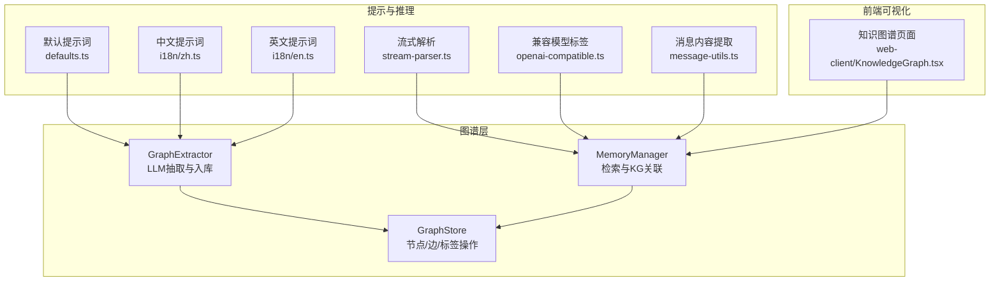
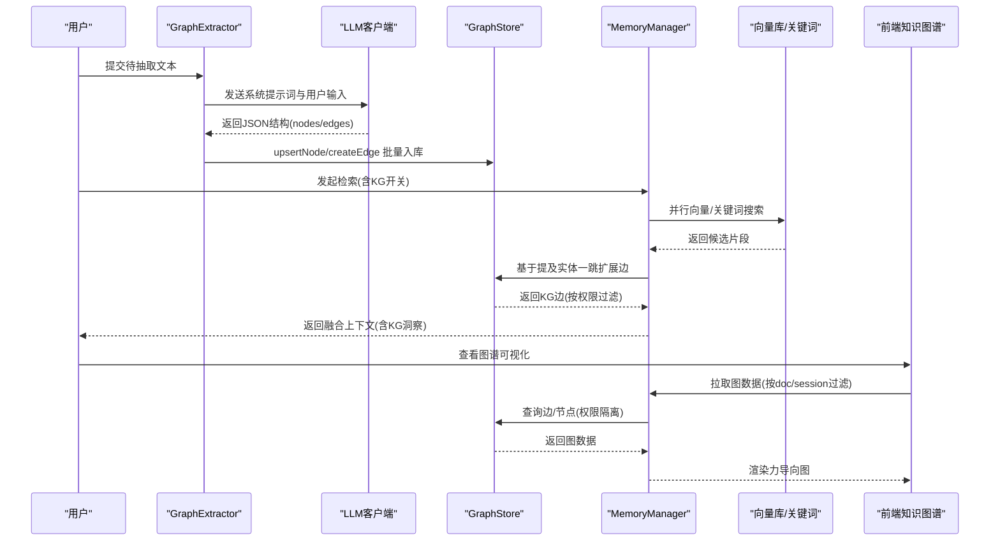
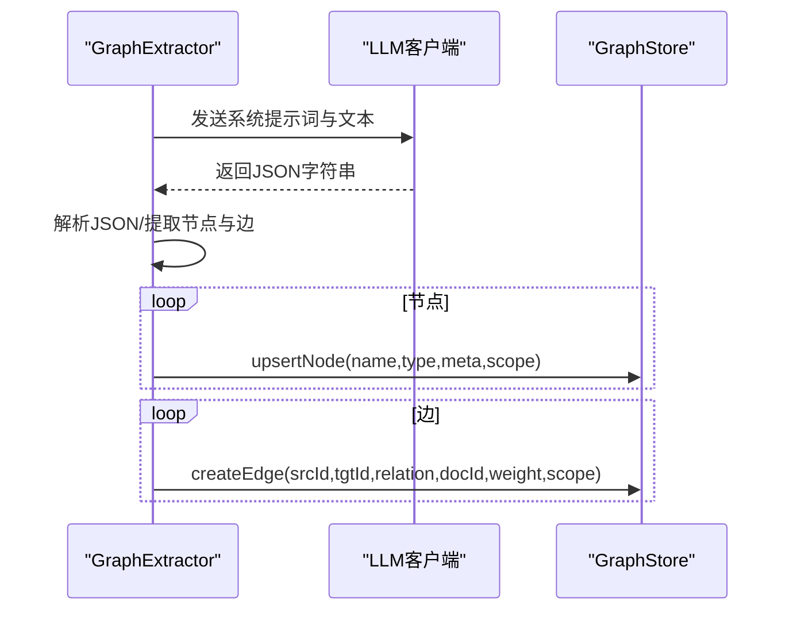
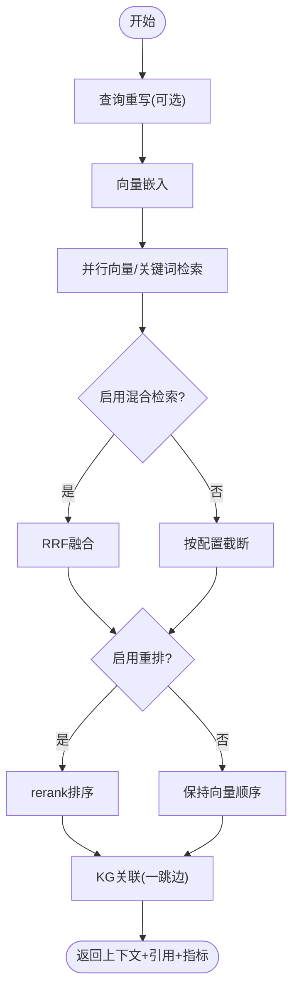
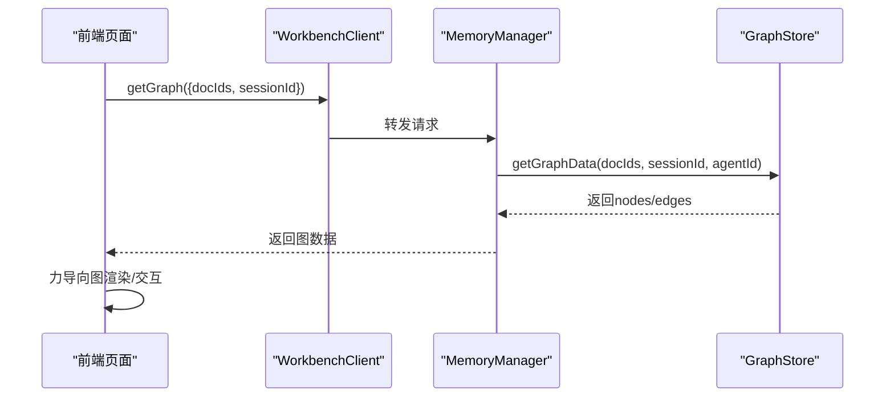
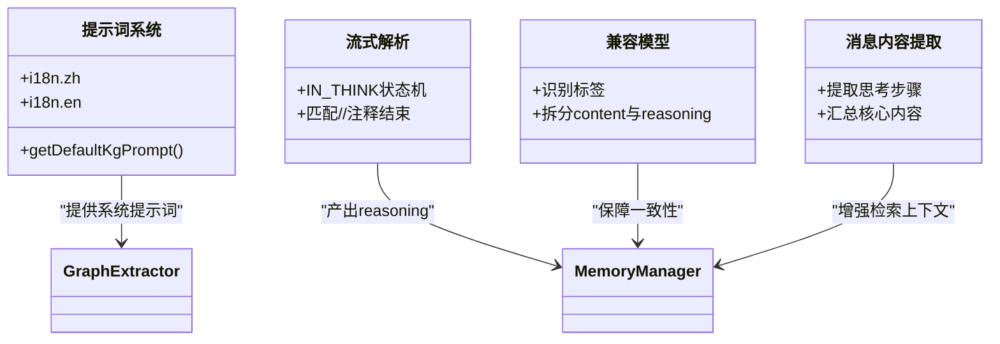
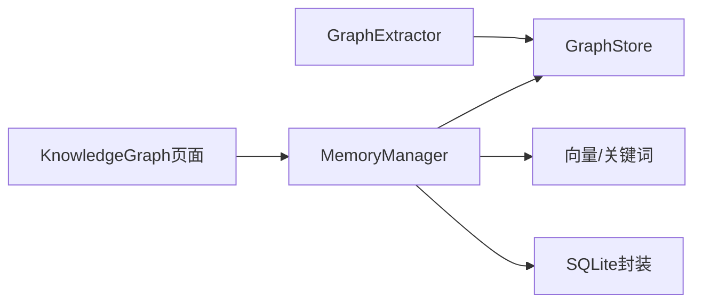

# 查询与推理功能

<cite>
**本文引用的文件**
- [graph-store.ts](file://src/lib/rag/graph-store.ts)
- [graph-extractor.ts](file://src/lib/rag/graph-extractor.ts)
- [memory-manager.ts](file://src/lib/rag/memory-manager.ts)
- [KnowledgeGraph.tsx](file://web-client/src/pages/KnowledgeGraph.tsx)
- [defaults.ts](file://src/lib/rag/defaults.ts)
- [zh.ts](file://src/lib/llm/prompts/i18n/zh.ts)
- [en.ts](file://src/lib/llm/prompts/i18n/en.ts)
- [openai-compatible.ts](file://src/lib/llm/providers/openai-compatible.ts)
- [stream-parser.ts](file://src/lib/llm/stream-parser.ts)
- [message-utils.ts](file://src/features/chat/utils/message-utils.ts)
</cite>

## 目录
1. [简介](#简介)
2. [项目结构](#项目结构)
3. [核心组件](#核心组件)
4. [架构总览](#架构总览)
5. [详细组件分析](#详细组件分析)
6. [依赖分析](#依赖分析)
7. [性能考虑](#性能考虑)
8. [故障排查指南](#故障排查指南)
9. [结论](#结论)
10. [附录](#附录)

## 简介
本文件面向Nexara的图谱查询与推理能力，系统性阐述以下主题：
- 图查询语言实现：SPARQL-like查询语法与Cypher查询支持现状与扩展建议
- 路径查找算法：最短路径、所有路径与约束路径的计算思路
- 图遍历策略：深度优先、广度优先与启发式搜索的适用场景
- 推理规则系统：基于规则的推断、逻辑推理与语义推理的落地方式
- 聚合查询功能：度中心性、中介中心性等图论指标的计算路径
- 查询优化技术：索引利用、查询计划与缓存策略
- 复杂查询的执行计划与性能监控机制

本说明既覆盖现有实现（图存储、抽取、检索与可视化），也提供面向未来的扩展建议，帮助读者在现有基础上安全演进。

## 项目结构
围绕“图谱查询与推理”，Nexara的关键代码分布在如下模块：
- 图存储与检索：graph-store.ts（节点/边CRUD、权限隔离、图数据获取）、memory-manager.ts（检索流程、KG关联、重排与指标）
- 图抽取与建模：graph-extractor.ts（LLM抽取、节点/边入库、状态上报）
- 图谱可视化：web-client/src/pages/KnowledgeGraph.tsx（前端力导图渲染）
- 提示词与推理：defaults.ts、i18n语言包、stream-parser.ts、openai-compatible.ts、message-utils.ts
- 默认提示词与本地化：defaults.ts、zh.ts、en.ts



**图表来源**
- [graph-store.ts:1-548](file://src/lib/rag/graph-store.ts#L1-L548)
- [memory-manager.ts:1-997](file://src/lib/rag/memory-manager.ts#L1-L997)
- [graph-extractor.ts:1-313](file://src/lib/rag/graph-extractor.ts#L1-L313)
- [defaults.ts:1-37](file://src/lib/rag/defaults.ts#L1-L37)
- [zh.ts:179-201](file://src/lib/llm/prompts/i18n/zh.ts#L179-L201)
- [en.ts:179-201](file://src/lib/llm/prompts/i18n/en.ts#L179-L201)
- [stream-parser.ts:249-270](file://src/lib/llm/stream-parser.ts#L249-L270)
- [openai-compatible.ts:213-230](file://src/lib/llm/providers/openai-compatible.ts#L213-L230)
- [message-utils.ts:1-29](file://src/features/chat/utils/message-utils.ts#L1-L29)
- [KnowledgeGraph.tsx:1-435](file://web-client/src/pages/KnowledgeGraph.tsx#L1-L435)

**章节来源**
- [graph-store.ts:1-548](file://src/lib/rag/graph-store.ts#L1-L548)
- [memory-manager.ts:1-997](file://src/lib/rag/memory-manager.ts#L1-L997)
- [graph-extractor.ts:1-313](file://src/lib/rag/graph-extractor.ts#L1-L313)
- [KnowledgeGraph.tsx:1-435](file://web-client/src/pages/KnowledgeGraph.tsx#L1-L435)
- [defaults.ts:1-37](file://src/lib/rag/defaults.ts#L1-L37)
- [zh.ts:179-201](file://src/lib/llm/prompts/i18n/zh.ts#L179-L201)
- [en.ts:179-201](file://src/lib/llm/prompts/i18n/en.ts#L179-L201)
- [stream-parser.ts:249-270](file://src/lib/llm/stream-parser.ts#L249-L270)
- [openai-compatible.ts:213-230](file://src/lib/llm/providers/openai-compatible.ts#L213-L230)
- [message-utils.ts:1-29](file://src/features/chat/utils/message-utils.ts#L1-L29)

## 核心组件
- GraphStore：提供节点与边的增删改查、合并、唯一约束处理、会话/代理作用域隔离、以及按文档/会话/代理筛选的图数据获取。
- GraphExtractor：负责从文本中抽取实体与关系，调用LLM生成JSON结构，再批量写入GraphStore，并上报进度。
- MemoryManager：检索主流程（向量+关键词混合、重排、指标统计），并在检索结果基础上进行KG关联（一跳实体扩展），拼接上下文返回。
- KnowledgeGraph页面：前端拉取后端图数据，使用力导向图渲染节点与边，支持类型过滤与交互。

**章节来源**
- [graph-store.ts:29-548](file://src/lib/rag/graph-store.ts#L29-L548)
- [graph-extractor.ts:25-313](file://src/lib/rag/graph-extractor.ts#L25-L313)
- [memory-manager.ts:11-712](file://src/lib/rag/memory-manager.ts#L11-L712)
- [KnowledgeGraph.tsx:32-111](file://web-client/src/pages/KnowledgeGraph.tsx#L32-L111)

## 架构总览
下图展示了从“抽取—存储—检索—可视化”的完整链路，以及KG关联如何在检索阶段注入语义增强。



**图表来源**
- [graph-extractor.ts:149-313](file://src/lib/rag/graph-extractor.ts#L149-L313)
- [graph-store.ts:73-288](file://src/lib/rag/graph-store.ts#L73-L288)
- [memory-manager.ts:11-712](file://src/lib/rag/memory-manager.ts#L11-L712)
- [KnowledgeGraph.tsx:79-111](file://web-client/src/pages/KnowledgeGraph.tsx#L79-L111)

## 详细组件分析

### 图存储与权限隔离（GraphStore）
- 节点与边的UPSERT/更新/删除，支持元数据合并、类型优先级、权重累加与去重。
- 支持doc_id、session_id、agent_id三类作用域过滤，实现严格的“按文档/会话/代理”隔离。
- 提供按过滤条件获取全图数据的能力，便于前端渲染与权限控制。

```mermaid
classDiagram
class GraphStore {
+upsertNode(name,type,meta,scope) Promise~string~
+updateNode(id,updates) Promise~void~
+deleteNode(id) Promise~void~
+mergeNodes(sourceId,targetName) Promise~void~
+createEdge(srcId,tgtId,relation,docId,weight,scope) Promise~string~
+updateEdge(id,updates) Promise~void~
+deleteEdge(id) Promise~void~
+getAllNodes() Promise~KGNode[]~
+getEdgesForNode(nodeId) Promise~KGEdge[]~
+getGraphData(docIds,sessionId,agentId) Promise~{nodes,edges}~
}
```

**图表来源**
- [graph-store.ts:29-548](file://src/lib/rag/graph-store.ts#L29-L548)

**章节来源**
- [graph-store.ts:73-288](file://src/lib/rag/graph-store.ts#L73-L288)
- [graph-store.ts:383-473](file://src/lib/rag/graph-store.ts#L383-L473)

### 图抽取与入库（GraphExtractor）
- 选择最佳模型（多提供商优先级、模型ID匹配），构造系统提示词（默认提示词+实体类型），调用LLM抽取JSON。
- 解析LLM输出（支持多种代码块包裹与JSON提取），逐条upsert节点，再批量创建边，期间上报进度。
- 对缺失节点ID的边进行跳过处理，避免脏数据污染。



**图表来源**
- [graph-extractor.ts:149-313](file://src/lib/rag/graph-extractor.ts#L149-L313)
- [graph-store.ts:73-288](file://src/lib/rag/graph-store.ts#L73-L288)

**章节来源**
- [graph-extractor.ts:25-313](file://src/lib/rag/graph-extractor.ts#L25-L313)
- [defaults.ts:1-37](file://src/lib/rag/defaults.ts#L1-L37)
- [zh.ts:179-201](file://src/lib/llm/prompts/i18n/zh.ts#L179-L201)
- [en.ts:179-201](file://src/lib/llm/prompts/i18n/en.ts#L179-L201)

### 检索与KG关联（MemoryManager）
- 阶段1：查询重写（可选），支持HYDE/MultiQuery/Expansion等策略。
- 阶段2：向量嵌入与并行检索（记忆/摘要/文档），关键词混合检索（RRF融合）。
- 阶段3：可选重排（rerank），统计检索指标（召回数、最终数、最大相似度、耗时）。
- 阶段4：KG关联（读时增强）——基于召回文本中的实体名匹配，查询一跳边并按权限过滤，拼接KG洞察到上下文。



**图表来源**
- [memory-manager.ts:11-712](file://src/lib/rag/memory-manager.ts#L11-L712)

**章节来源**
- [memory-manager.ts:11-712](file://src/lib/rag/memory-manager.ts#L11-L712)

### 可视化与交互（KnowledgeGraph页面）
- 前端通过WorkbenchClient拉取图数据（支持按docIds/sessionId过滤），转换为力导向图所需格式。
- 支持节点点击、类型过滤、缩放与加载状态提示；当无数据时显示占位提示。



**图表来源**
- [KnowledgeGraph.tsx:79-111](file://web-client/src/pages/KnowledgeGraph.tsx#L79-L111)
- [graph-store.ts:383-473](file://src/lib/rag/graph-store.ts#L383-L473)

**章节来源**
- [KnowledgeGraph.tsx:32-111](file://web-client/src/pages/KnowledgeGraph.tsx#L32-L111)

### 推理与提示词（提示词、<think>标签与消息内容提取）
- 默认提示词与本地化提示词（中文/英文）：抽取阶段使用，默认提示词可被用户自定义提示词覆盖。
- 流式解析与<think>标签：支持<think>…</think>与HTML注释标记，将推理内容抽取为独立reasoning块。
- 兼容模型：对OpenAI兼容接口的<think>标签进行识别与拆分，保证跨模型一致性。
- 消息内容提取：在聊天上下文中提取“思考过程”等关键推理片段，用于检索增强与回溯。



**图表来源**
- [defaults.ts:1-37](file://src/lib/rag/defaults.ts#L1-L37)
- [zh.ts:179-201](file://src/lib/llm/prompts/i18n/zh.ts#L179-L201)
- [en.ts:179-201](file://src/lib/llm/prompts/i18n/en.ts#L179-L201)
- [stream-parser.ts:249-270](file://src/lib/llm/stream-parser.ts#L249-L270)
- [openai-compatible.ts:213-230](file://src/lib/llm/providers/openai-compatible.ts#L213-L230)
- [message-utils.ts:1-29](file://src/features/chat/utils/message-utils.ts#L1-L29)

**章节来源**
- [defaults.ts:1-37](file://src/lib/rag/defaults.ts#L1-L37)
- [zh.ts:179-201](file://src/lib/llm/prompts/i18n/zh.ts#L179-L201)
- [en.ts:179-201](file://src/lib/llm/prompts/i18n/en.ts#L179-L201)
- [stream-parser.ts:249-270](file://src/lib/llm/stream-parser.ts#L249-L270)
- [openai-compatible.ts:213-230](file://src/lib/llm/providers/openai-compatible.ts#L213-L230)
- [message-utils.ts:1-29](file://src/features/chat/utils/message-utils.ts#L1-L29)

## 依赖分析
- 组件耦合与内聚
  - GraphExtractor与GraphStore强耦合（抽取后直接入库），内聚度高，职责清晰。
  - MemoryManager横跨检索与KG关联，承担“检索主流程”职责，与其他模块弱耦合（通过数据库与工作台接口）。
  - 前端KnowledgeGraph页面仅依赖工作台接口与GraphStore查询，耦合度低。
- 外部依赖
  - LLM与嵌入/重排模型通过工厂与配置注入，具备良好的可替换性。
  - 数据库层采用SQLite封装，权限隔离通过WHERE条件实现，易于扩展索引与查询计划。



**图表来源**
- [graph-extractor.ts:1-313](file://src/lib/rag/graph-extractor.ts#L1-L313)
- [graph-store.ts:1-548](file://src/lib/rag/graph-store.ts#L1-L548)
- [memory-manager.ts:1-997](file://src/lib/rag/memory-manager.ts#L1-L997)
- [KnowledgeGraph.tsx:1-435](file://web-client/src/pages/KnowledgeGraph.tsx#L1-L435)

**章节来源**
- [graph-extractor.ts:1-313](file://src/lib/rag/graph-extractor.ts#L1-L313)
- [graph-store.ts:1-548](file://src/lib/rag/graph-store.ts#L1-L548)
- [memory-manager.ts:1-997](file://src/lib/rag/memory-manager.ts#L1-L997)
- [KnowledgeGraph.tsx:1-435](file://web-client/src/pages/KnowledgeGraph.tsx#L1-L435)

## 性能考虑
- 存储层
  - UPSERT/更新采用“插入忽略+回退查询”策略，减少并发冲突；合并节点时清理自环与重复边，降低后续查询成本。
  - 边权重累加与去重，避免冗余边导致的遍历膨胀。
- 检索层
  - 并行向量/关键词检索，缩短整体延迟；RRF融合提升召回质量。
  - 重排阶段仅对去重后的结果集进行，避免过度截断。
- 可视化层
  - 前端按需渲染，支持类型过滤与节流，避免大规模节点/边导致的卡顿。
- 权限与隔离
  - 通过doc_id/session_id/agent_id三条件过滤，避免跨域扫描，显著降低查询开销。

[本节为通用性能讨论，无需特定文件来源]

## 故障排查指南
- 抽取失败
  - 现象：返回空响应或JSON解析失败。
  - 排查：确认提示词模板、实体类型占位符、模型可用性；检查LLM输出是否被包裹在代码块中。
  - 参考路径：[graph-extractor.ts:178-230](file://src/lib/rag/graph-extractor.ts#L178-L230)
- 唯一约束冲突
  - 现象：节点名称唯一约束失败。
  - 排查：确认是否重复命名；GraphStore已捕获并抛出对应错误，避免静默失败。
  - 参考路径：[graph-store.ts:144-151](file://src/lib/rag/graph-store.ts#L144-L151)
- 边创建异常
  - 现象：边重复或权重异常。
  - 排查：确认source/target是否存在；GraphStore会累加权重并去重。
  - 参考路径：[graph-store.ts:257-288](file://src/lib/rag/graph-store.ts#L257-L288)
- KG关联无结果
  - 现象：KG洞察为空。
  - 排查：确认召回文本中是否包含实体名；检查doc_id权限过滤条件；适当放宽一跳边数量限制。
  - 参考路径：[memory-manager.ts:629-699](file://src/lib/rag/memory-manager.ts#L629-L699)

**章节来源**
- [graph-extractor.ts:178-230](file://src/lib/rag/graph-extractor.ts#L178-L230)
- [graph-store.ts:144-151](file://src/lib/rag/graph-store.ts#L144-L151)
- [graph-store.ts:257-288](file://src/lib/rag/graph-store.ts#L257-L288)
- [memory-manager.ts:629-699](file://src/lib/rag/memory-manager.ts#L629-L699)

## 结论
Nexara在图谱查询与推理方面已形成“抽取—存储—检索—可视化”的闭环：GraphStore提供强隔离与高效写入，GraphExtractor与MemoryManager分别承担“建模”与“检索增强”，前端通过力导向图直观呈现。若需进一步演进，可在现有基础上引入：
- 图查询语言：在GraphStore之上封装SPARQL-like与Cypher解析器，结合SQLite扩展或专用图数据库适配层。
- 路径与聚合：在GraphStore查询结果上叠加路径算法与中心性计算，支持约束路径与权重聚合。
- 查询优化：建立复合索引、查询计划缓存与热点边/节点缓存，配合权限过滤的谓词下推。
- 推理规则：将规则引擎与语义推理模块接入MemoryManager，实现“检索+规则”的混合推理。

[本节为总结性内容，无需特定文件来源]

## 附录

### 查询语言与Cypher支持建议
- 当前实现
  - GraphStore提供按doc_id/session_id/agent_id过滤的图数据获取，适合“读时增强”的KG关联。
- 扩展建议
  - 在GraphStore之上新增“查询适配层”：将SPARQL-like与Cypher映射为SQL或中间表示，再路由至GraphStore。
  - 对常用模式（如一跳/二跳、路径计数、约束边过滤）建立查询计划缓存，减少重复解析成本。
  - 对权重边与类型约束进行谓词下推，结合索引提升查询效率。

[本节为概念性建议，无需特定文件来源]

### 路径查找与遍历策略
- 最短路径：可基于Dijkstra/BFS（无权）实现，结合边权重与类型过滤。
- 所有路径：DFS回溯，注意剪枝（已访问集合、深度限制、类型/关系白名单）。
- 约束路径：在遍历过程中动态评估约束（如关系序列、节点类型、权重阈值），满足即加入候选集。

[本节为概念性建议，无需特定文件来源]

### 推理规则系统
- 规则编译：将规则转化为可执行的谓词/函数，与检索结果进行Join/Filter。
- 逻辑与语义推理：结合KG洞察与消息内容提取，形成“检索+推理”的增强上下文，再进入对话生成。

[本节为概念性建议，无需特定文件来源]

### 聚合查询与图论指标
- 度中心性：统计每个节点出入度，结合类型/权重加权。
- 中介中心性：在无权图上计算最短路径数量，在有权图上可采用路径概率或权重倒数。
- 聚合策略：在GraphStore查询结果上进行二次聚合，支持分组（按doc_id/session_id）与窗口化统计。

[本节为概念性建议，无需特定文件来源]

### 查询优化与监控
- 索引：为kg_nodes.name、kg_edges.source_id/target_id/relation/doc_id/session_id/agent_id建立复合索引。
- 查询计划：缓存热点查询的执行计划，按doc_id/session_id/agent_id维度分区。
- 缓存：对高频“一跳扩展”结果进行短期缓存，结合LRU淘汰与失效策略。
- 监控：在MemoryManager中记录检索耗时、召回数、重排耗时与最大相似度，前端可视化展示。

[本节为通用优化建议，无需特定文件来源]