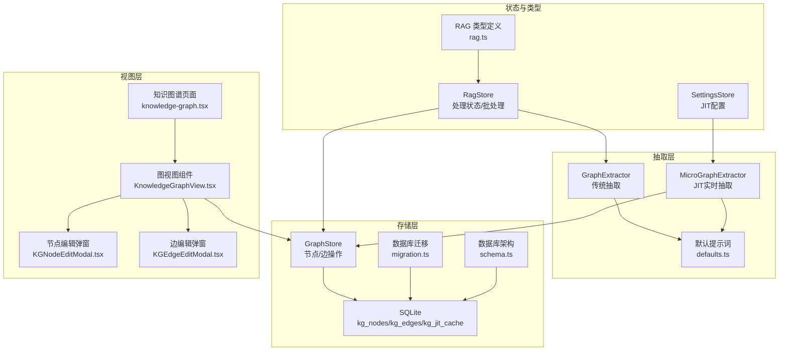
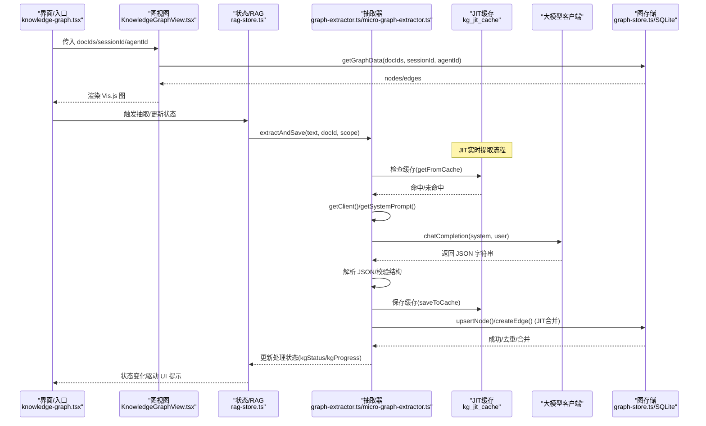
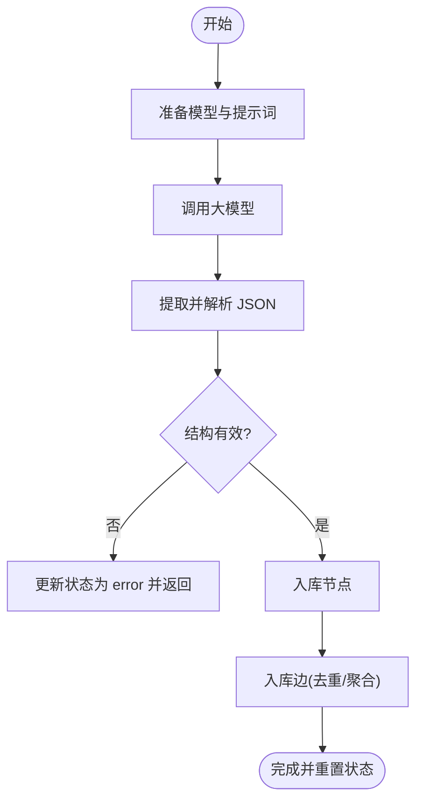
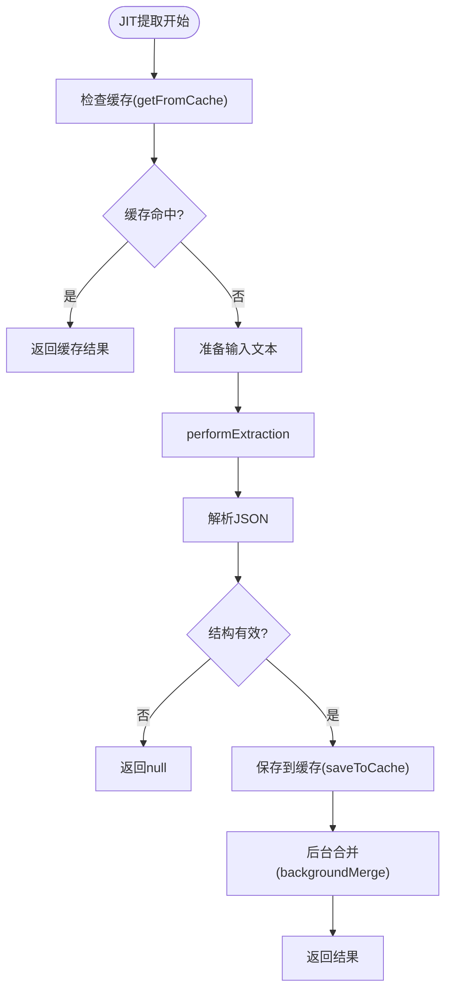
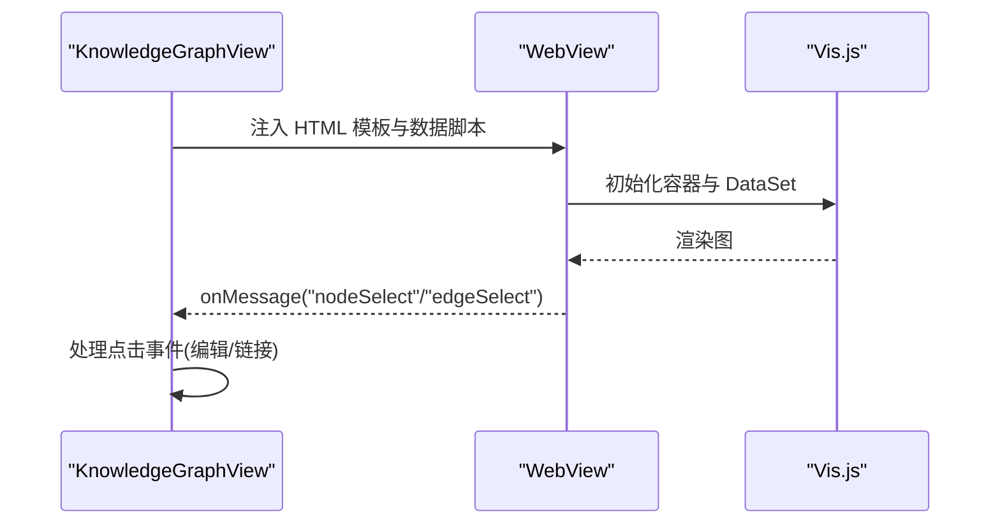
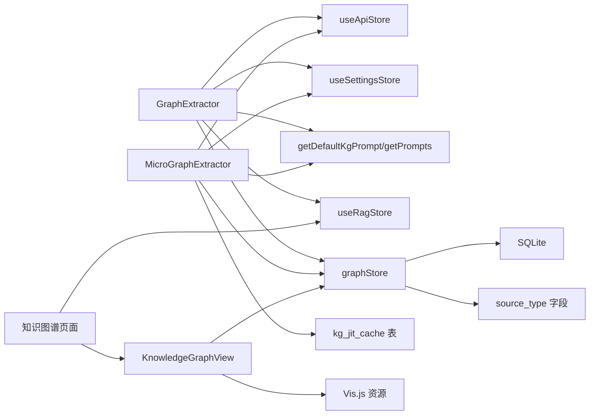

# 知识图谱抽取

<cite>
**本文引用的文件**
- [graph-extractor.ts](file://src/lib/rag/graph-extractor.ts)
- [micro-graph-extractor.ts](file://src/lib/rag/micro-graph-extractor.ts)
- [graph-store.ts](file://src/lib/rag/graph-store.ts)
- [knowledge-graph.tsx](file://app/knowledge-graph.tsx)
- [KnowledgeGraphView.tsx](file://src/components/rag/KnowledgeGraphView.tsx)
- [KGNodeEditModal.tsx](file://src/components/rag/KGNodeEditModal.tsx)
- [KGEdgeEditModal.tsx](file://src/components/rag/KGEdgeEditModal.tsx)
- [defaults.ts](file://src/lib/rag/defaults.ts)
- [rag-store.ts](file://src/store/rag-store.ts)
- [migration.ts](file://src/lib/db/migration.ts)
- [schema.ts](file://src/lib/db/schema.ts)
- [rag.ts](file://src/types/rag.ts)
- [settings-store.ts](file://src/store/settings-store.ts)
- [RagAdvancedSettings.tsx](file://src/features/settings/screens/RagAdvancedSettings.tsx)
</cite>

## 更新摘要
**所做更改**
- 新增JIT（Just-In-Time）实时动态提取功能的完整技术文档
- 添加kg_jit_cache表的数据库架构说明
- 新增源类型跟踪字段（source_type）的实现细节
- 完善免费模式实体提取和领域自动检测功能的说明
- 更新图存储层以支持JIT提取结果的合并策略
- 增强设置配置和用户界面的JIT功能集成

## 目录
1. [简介](#简介)
2. [项目结构](#项目结构)
3. [核心组件](#核心组件)
4. [架构总览](#架构总览)
5. [详细组件分析](#详细组件分析)
6. [JIT实时动态提取功能](#jit实时动态提取功能)
7. [依赖分析](#依赖分析)
8. [性能考量](#性能考量)
9. [故障排查指南](#故障排查指南)
10. [结论](#结论)
11. [附录](#附录)

## 简介
本技术文档围绕 Nexara 的知识图谱抽取能力进行系统化梳理，现已全面集成JIT（Just-In-Time）实时动态提取功能，覆盖以下核心能力：
- 实体识别与术语提取：基于大模型的结构化抽取，支持多实体类型与元数据合并，现支持免费模式和领域自动检测。
- 关系抽取：主谓宾、属性与语义关系的统一建模，权重聚合与去重，支持JIT缓存优化。
- 知识图谱构建流程：从文本到节点/边入库，再到可视化呈现与交互编辑，现支持实时动态合并。
- 图结构存储：节点与边的数据模型、索引与隔离策略，新增源类型跟踪字段。
- JIT缓存系统：kg_jit_cache表的实时缓存机制，支持TTL过期管理和查询哈希优化。
- 可视化渲染：Webview 内嵌 Vis.js 布局与交互，性能优化与体验保障。
- 查询与推理：按文档、会话、助手维度筛选，以及节点/边的编辑与合并。

## 项目结构
与知识图谱抽取直接相关的模块分布如下，现已集成JIT功能：
- 抽取与提示词：src/lib/rag/graph-extractor.ts、src/lib/rag/micro-graph-extractor.ts、src/lib/rag/defaults.ts
- 存储与查询：src/lib/rag/graph-store.ts、src/lib/db/migration.ts、src/lib/db/schema.ts
- 视图与交互：app/knowledge-graph.tsx、src/components/rag/KnowledgeGraphView.tsx、KGNodeEditModal.tsx、KGEdgeEditModal.tsx
- 状态与批处理：src/store/rag-store.ts、src/types/rag.ts
- 设置与配置：src/store/settings-store.ts、src/features/settings/screens/RagAdvancedSettings.tsx



**图表来源**
- [graph-extractor.ts:1-313](file://src/lib/rag/graph-extractor.ts#L1-L313)
- [micro-graph-extractor.ts:1-304](file://src/lib/rag/micro-graph-extractor.ts#L1-L304)
- [defaults.ts:1-38](file://src/lib/rag/defaults.ts#L1-L38)
- [graph-store.ts:1-548](file://src/lib/rag/graph-store.ts#L1-L548)
- [migration.ts:235-262](file://src/lib/db/migration.ts#L235-L262)
- [schema.ts:270-284](file://src/lib/db/schema.ts#L270-L284)
- [knowledge-graph.tsx:1-130](file://app/knowledge-graph.tsx#L1-L130)
- [KnowledgeGraphView.tsx:1-430](file://src/components/rag/KnowledgeGraphView.tsx#L1-L430)
- [KGNodeEditModal.tsx:1-330](file://src/components/rag/KGNodeEditModal.tsx#L1-L330)
- [KGEdgeEditModal.tsx:1-146](file://src/components/rag/KGEdgeEditModal.tsx#L1-L146)
- [rag-store.ts:1-800](file://src/store/rag-store.ts#L1-L800)
- [settings-store.ts:115-180](file://src/store/settings-store.ts#L115-L180)
- [RagAdvancedSettings.tsx:155-197](file://src/features/settings/screens/RagAdvancedSettings.tsx#L155-L197)

**章节来源**
- [graph-extractor.ts:1-313](file://src/lib/rag/graph-extractor.ts#L1-L313)
- [micro-graph-extractor.ts:1-304](file://src/lib/rag/micro-graph-extractor.ts#L1-L304)
- [graph-store.ts:1-548](file://src/lib/rag/graph-store.ts#L1-L548)
- [knowledge-graph.tsx:1-130](file://app/knowledge-graph.tsx#L1-L130)
- [KnowledgeGraphView.tsx:1-430](file://src/components/rag/KnowledgeGraphView.tsx#L1-L430)
- [KGNodeEditModal.tsx:1-330](file://src/components/rag/KGNodeEditModal.tsx#L1-L330)
- [KGEdgeEditModal.tsx:1-146](file://src/components/rag/KGEdgeEditModal.tsx#L1-L146)
- [defaults.ts:1-38](file://src/lib/rag/defaults.ts#L1-L38)
- [rag-store.ts:1-800](file://src/store/rag-store.ts#L1-L800)
- [migration.ts:235-262](file://src/lib/db/migration.ts#L235-L262)
- [schema.ts:270-284](file://src/lib/db/schema.ts#L270-L284)
- [settings-store.ts:115-180](file://src/store/settings-store.ts#L115-L180)
- [RagAdvancedSettings.tsx:155-197](file://src/features/settings/screens/RagAdvancedSettings.tsx#L155-L197)

## 核心组件
- GraphExtractor：负责选择模型、构造系统提示词、调用大模型抽取 JSON、解析与入库的传统抽取器。
- MicroGraphExtractor：**新增** JIT实时动态提取器，支持基于召回文本的实时图谱构建，包含缓存机制和背景合并功能。
- GraphStore：封装节点/边的增删改查、去重与合并、按文档/会话/助手过滤查询，现支持源类型跟踪和JIT合并策略。
- KnowledgeGraphView：在 WebView 中渲染 Vis.js 图，支持点击、链接模式、编辑弹窗。
- KGNodeEditModal/KGEdgeEditModal：节点/边的增删改与合并确认。
- RagStore：维护处理状态、会话 KG 批量累积器、向量化队列与文档/文件夹管理。
- defaults.ts：默认提示词与本地化提示词获取，支持免费模式和领域自动检测。
- SettingsStore：**新增** JIT配置管理，包括最大块数、免费模式和领域自动检测开关。

**章节来源**
- [graph-extractor.ts:25-313](file://src/lib/rag/graph-extractor.ts#L25-L313)
- [micro-graph-extractor.ts:18-304](file://src/lib/rag/micro-graph-extractor.ts#L18-L304)
- [graph-store.ts:29-548](file://src/lib/rag/graph-store.ts#L29-L548)
- [KnowledgeGraphView.tsx:83-430](file://src/components/rag/KnowledgeGraphView.tsx#L83-L430)
- [KGNodeEditModal.tsx:12-330](file://src/components/rag/KGNodeEditModal.tsx#L12-L330)
- [KGEdgeEditModal.tsx:9-146](file://src/components/rag/KGEdgeEditModal.tsx#L9-L146)
- [rag-store.ts:24-145](file://src/store/rag-store.ts#L24-L145)
- [defaults.ts:7-38](file://src/lib/rag/defaults.ts#L7-L38)
- [settings-store.ts:115-180](file://src/store/settings-store.ts#L115-L180)

## 架构总览
下图展示从"文本输入"到"图谱可视化"的端到端流程，包括状态上报、模型选择、抽取解析与入库、JIT缓存优化以及前端渲染与交互。



**图表来源**
- [knowledge-graph.tsx:12-130](file://app/knowledge-graph.tsx#L12-L130)
- [KnowledgeGraphView.tsx:127-161](file://src/components/rag/KnowledgeGraphView.tsx#L127-L161)
- [rag-store.ts:127-131](file://src/store/rag-store.ts#L127-L131)
- [graph-extractor.ts:149-310](file://src/lib/rag/graph-extractor.ts#L149-L310)
- [micro-graph-extractor.ts:35-78](file://src/lib/rag/micro-graph-extractor.ts#L35-L78)
- [graph-store.ts:73-288](file://src/lib/rag/graph-store.ts#L73-L288)

## 详细组件分析

### 实体识别与术语提取（GraphExtractor）
- 模型选择与提供商优先级：根据目标模型 ID 查找可用提供商，若存在多个候选则按模型名关键字优先选择官方/原生类型。
- 系统提示词：支持自定义提示词注入实体类型占位符；若缺失占位符则追加本地化兜底；默认使用本地化默认提示词。
- 抽取流程：预处理文本 → 构造系统提示词 → 请求大模型 → 安全提取 JSON（三段式正则） → 校验 nodes/edges 结构 → 先入库节点再入库边 → 更新处理状态。
- 错误处理：捕获 JSON 解析失败、结构缺失、空响应等，通过状态字段反馈错误而不抛出异常，避免 RN 后台崩溃。



**图表来源**
- [graph-extractor.ts:149-310](file://src/lib/rag/graph-extractor.ts#L149-L310)

**章节来源**
- [graph-extractor.ts:25-144](file://src/lib/rag/graph-extractor.ts#L25-L144)
- [graph-extractor.ts:149-310](file://src/lib/rag/graph-extractor.ts#L149-L310)
- [defaults.ts:7-38](file://src/lib/rag/defaults.ts#L7-L38)

### JIT实时动态提取（MicroGraphExtractor）
**新增功能**：MicroGraphExtractor是JIT（Just-In-Time）实时动态提取的核心组件，支持基于召回文本的实时图谱构建。

- **缓存机制**：使用kg_jit_cache表存储提取结果，支持TTL过期管理和查询哈希优化。
- **实时提取**：基于Top-K召回结果动态构建微型图谱，支持超时控制和进度回调。
- **背景合并**：提取完成后异步将结果合并到全局图谱，使用事务保证数据一致性。
- **提示词策略**：复用GraphExtractor的统一提示词策略，支持免费模式和领域自动检测。



**图表来源**
- [micro-graph-extractor.ts:22-78](file://src/lib/rag/micro-graph-extractor.ts#L22-L78)
- [micro-graph-extractor.ts:85-130](file://src/lib/rag/micro-graph-extractor.ts#L85-L130)
- [micro-graph-extractor.ts:273-300](file://src/lib/rag/micro-graph-extractor.ts#L273-L300)

**章节来源**
- [micro-graph-extractor.ts:18-304](file://src/lib/rag/micro-graph-extractor.ts#L18-L304)

### 关系抽取与图构建（GraphStore）
- 节点操作：upsertNode（按名称唯一、合并元数据、提升类型优先级）、updateNode、deleteNode、mergeNodes（移动边、去重、合并元数据、删除源节点）。
- 边操作：createEdge（按 source/target/relation/docId/sessionId 去重并累加权重，现支持源类型优先级策略）、updateEdge、deleteEdge。
- 查询：getGraphData 支持按文档集合、会话或助手过滤，仅拉取相关节点集；无过滤时可返回全量节点。
- 存储隔离：新增 session_id/agent_id 字段与索引，确保不同会话/助手的图谱隔离。
- **源类型优先级**：新增source_type字段，默认值为'full'，JIT提取使用'jit'，支持优先级比较策略。

```mermaid
classDiagram
class GraphStore {
+upsertNode(name, type, metadata, scope, sourceType) Promise~string~
+updateNode(id, updates) Promise~void~
+deleteNode(id) Promise~void~
+mergeNodes(sourceId, targetName) Promise~void~
+createEdge(sourceId, targetId, relation, docId, weight, scope, sourceType) Promise~string~
+updateEdge(id, updates) Promise~void~
+deleteEdge(id) Promise~void~
+getAllNodes() Promise~KGNode[]~
+getEdgesForNode(nodeId) Promise~KGEdge[]~
+getGraphData(docIds, sessionId, agentId) Promise~{nodes, edges}~
}
class KGNode {
+string id
+string name
+string type
+Record metadata
+string source_type
+number createdAt
}
class KGEdge {
+string id
+string sourceId
+string targetId
+string relation
+number weight
+string docId
+string source_type
+number createdAt
}
GraphStore --> KGNode : "管理"
GraphStore --> KGEdge : "管理"
```

**图表来源**
- [graph-store.ts:29-548](file://src/lib/rag/graph-store.ts#L29-L548)

**章节来源**
- [graph-store.ts:29-548](file://src/lib/rag/graph-store.ts#L29-L548)
- [migration.ts:235-244](file://src/lib/db/migration.ts#L235-L244)

### 可视化渲染与交互（KnowledgeGraphView）
- 渲染引擎：WebView 注入 Vis.js，动态生成 HTML 模板与数据脚本，将节点/边数据注入 vis.DataSet 并初始化网络。
- 布局与样式：启用连续平滑曲线、Barnes-Hut 物理模拟、分组颜色（人/组织/地点/概念），深色/浅色主题适配。
- 交互能力：节点点击打开编辑弹窗；边点击打开关系编辑；支持"链接模式"双击建立边；悬浮提示标题包含名称与类型。
- 性能优化：加载完成后透明过渡；模板缓存；按需加载数据；卸载时销毁网络实例释放资源。



**图表来源**
- [KnowledgeGraphView.tsx:252-327](file://src/components/rag/KnowledgeGraphView.tsx#L252-L327)

**章节来源**
- [KnowledgeGraphView.tsx:1-430](file://src/components/rag/KnowledgeGraphView.tsx#L1-L430)

### 编辑与合并（KGNodeEditModal/KGEdgeEditModal）
- 节点编辑：支持创建/更新节点名称与类型；当名称冲突时弹窗确认是否合并至已存在节点；删除节点时联动清理。
- 边编辑：支持修改关系标签；删除边。
- 交互反馈：保存过程中显示加载状态；错误弹窗提示；成功后刷新图数据。

**章节来源**
- [KGNodeEditModal.tsx:65-175](file://src/components/rag/KGNodeEditModal.tsx#L65-L175)
- [KGEdgeEditModal.tsx:33-78](file://src/components/rag/KGEdgeEditModal.tsx#L33-L78)

### 页面与上下文筛选（knowledge-graph.tsx）
- 支持四种上下文：文档、文件夹（递归展开）、会话（含全局文档与会话内文档/文件夹）、助手（全局文档为主）。
- 标题与副标题根据上下文动态切换，提供清晰的视图语义。
- 将 docIds/sessionId/agentId 传递给图视图，实现按范围渲染。

**章节来源**
- [knowledge-graph.tsx:12-130](file://app/knowledge-graph.tsx#L12-L130)

### 状态与批处理（RagStore）
- 处理状态：kgStatus/kgProgress/subStage 等字段用于 UI 指示；支持按 messageId/sessionId 关联状态。
- 会话 KG 批量累积器：按会话聚合消息内容，便于后续批量抽取。
- 文档/文件夹管理：提供添加/删除/移动/重命名等操作，并与物理文件系统保持一致。
- 队列与向量化：封装向量化队列，支持文档/记忆任务与 KG 抽取策略。

**章节来源**
- [rag-store.ts:24-145](file://src/store/rag-store.ts#L24-L145)
- [rag-store.ts:426-433](file://src/store/rag-store.ts#L426-L433)
- [rag.ts:29-57](file://src/types/rag.ts#L29-L57)

## JIT实时动态提取功能

### kg_jit_cache表架构
**新增**：kg_jit_cache表用于存储JIT提取的缓存结果，支持TTL过期管理和快速查询。

- **表结构**：
  - cache_key：主键，查询字符串与文档ID的组合哈希
  - query_hash：查询内容的哈希值
  - chunk_ids_hash：召回文档ID列表的哈希值
  - result_json：提取结果的JSON序列化存储
  - created_at：创建时间戳
  - expires_at：过期时间戳

- **索引优化**：idx_kg_jit_cache_expires索引用于快速过期清理

**章节来源**
- [migration.ts:246-262](file://src/lib/db/migration.ts#L246-L262)
- [schema.ts:270-284](file://src/lib/db/schema.ts#L270-L284)

### 源类型跟踪机制
**新增**：kg_nodes和kg_edges表新增source_type字段，用于区分数据来源类型。

- **字段含义**：
  - 'full'：传统全量抽取生成
  - 'jit'：JIT实时动态提取生成
  - 'summary'：摘要生成

- **优先级策略**：在边合并时使用优先级比较，确保高质量数据覆盖低质量数据
  - full: 2
  - summary: 1  
  - jit: 0

**章节来源**
- [migration.ts:235-244](file://src/lib/db/migration.ts#L235-L244)
- [graph-store.ts:296-304](file://src/lib/rag/graph-store.ts#L296-L304)

### 免费模式实体提取
**增强**：支持kgFreeMode配置，允许自由识别模式下的实体提取。

- **提示词策略**：当kgFreeMode启用时，使用getKgFreeModePrompt()替代默认提示词
- **实体类型**：无需预定义实体类型，模型可自由判断实体类型
- **优先级**：优先识别核心对象(Object)，其次识别属性(Attribute)

**章节来源**
- [defaults.ts:14-16](file://src/lib/rag/defaults.ts#L14-L16)
- [graph-extractor.ts:120-134](file://src/lib/rag/graph-extractor.ts#L120-L134)
- [micro-graph-extractor.ts:188-202](file://src/lib/rag/micro-graph-extractor.ts#L188-L202)

### 领域自动检测功能
**增强**：支持kgDomainAuto配置，自动识别输入文本的领域并优化关系抽取。

- **检测机制**：当kgDomainAuto或kgDomainHint==='auto'时，自动添加领域分析指令
- **优化策略**：根据不同领域（小说、学术论文、技术文档等）优化关系抽取逻辑
- **提示词**：使用getKgDomainAutoPrompt()提供领域特定的抽取指导

**章节来源**
- [defaults.ts:21-23](file://src/lib/rag/defaults.ts#L21-L23)
- [graph-extractor.ts:136-142](file://src/lib/rag/graph-extractor.ts#L136-L142)
- [micro-graph-extractor.ts:204-209](file://src/lib/rag/micro-graph-extractor.ts#L204-L209)

### 设置配置集成
**新增**：用户界面支持JIT功能的配置管理。

- **JIT开关**：通过jitMaxChunks配置控制JIT功能的启用和Top-K范围
- **免费模式开关**：kgFreeMode配置启用自由提取模式
- **领域检测开关**：kgDomainAuto配置启用自动领域检测
- **缓存TTL配置**：jitCacheTTL配置缓存过期时间

**章节来源**
- [settings-store.ts:115-180](file://src/store/settings-store.ts#L115-L180)
- [RagAdvancedSettings.tsx:155-197](file://src/features/settings/screens/RagAdvancedSettings.tsx#L155-L197)

## 依赖分析
- 抽取器依赖：API 状态、设置状态、提示词工厂、RAG 状态、图存储。
- **JIT新增依赖**：kg_jit_cache表、源类型字段、缓存清理机制。
- 图存储依赖：SQLite 数据库、ID 生成器、源类型优先级策略。
- 视图依赖：GraphStore、Vis.js 资源、主题与国际化。
- 页面依赖：RagStore、聊天/代理状态以解析会话上下文。



**图表来源**
- [graph-extractor.ts:1-11](file://src/lib/rag/graph-extractor.ts#L1-L11)
- [micro-graph-extractor.ts:1-7](file://src/lib/rag/micro-graph-extractor.ts#L1-L7)
- [KnowledgeGraphView.tsx:1-14](file://src/components/rag/KnowledgeGraphView.tsx#L1-L14)
- [knowledge-graph.tsx:1-11](file://app/knowledge-graph.tsx#L1-L11)

**章节来源**
- [graph-extractor.ts:1-11](file://src/lib/rag/graph-extractor.ts#L1-L11)
- [micro-graph-extractor.ts:1-7](file://src/lib/rag/micro-graph-extractor.ts#L1-L7)
- [KnowledgeGraphView.tsx:1-14](file://src/components/rag/KnowledgeGraphView.tsx#L1-L14)
- [knowledge-graph.tsx:1-11](file://app/knowledge-graph.tsx#L1-L11)

## 性能考量
- UI 线程让渡：抽取节点/边入库时对大量条目进行微延迟让渡，避免主线程阻塞。
- 模板缓存：HTML 模板按主题与主色键缓存，减少重复注入成本。
- 按需加载：图数据查询支持按文档/会话/助手过滤，仅拉取必要节点集。
- WebView 加速：启用硬件层类型，提升渲染性能。
- 物理索引：新增 session_id/agent_id 索引，加速过滤查询。
- **JIT缓存优化**：kg_jit_cache表的TTL过期管理和查询哈希优化，显著提升重复查询性能。
- **背景合并**：JIT提取完成后异步合并到全局图谱，避免阻塞主线程。

**章节来源**
- [graph-extractor.ts:256-280](file://src/lib/rag/graph-extractor.ts#L256-L280)
- [KnowledgeGraphView.tsx:334-335](file://src/components/rag/KnowledgeGraphView.tsx#L334-L335)
- [graph-store.ts:222-234](file://src/lib/rag/graph-store.ts#L222-L234)
- [micro-graph-extractor.ts:85-130](file://src/lib/rag/micro-graph-extractor.ts#L85-L130)
- [micro-graph-extractor.ts:273-300](file://src/lib/rag/micro-graph-extractor.ts#L273-L300)

## 故障排查指南
- 模型不可用：检查 API 提供商启用状态与模型 ID 是否匹配；查看日志中的可用提供商列表。
- JSON 解析失败：确认模型输出严格返回 JSON 对象；检查是否被包裹在代码块中；抽取器内置三段式提取逻辑。
- 结构缺失：确保 nodes/edges 字段存在；检查提示词是否正确注入实体类型。
- 唯一约束冲突：节点名称冲突时弹窗提示合并；按提示操作或手动调整名称。
- 空响应：检查网络与鉴权配置；确认系统提示词与用户输入长度合理。
- WebView 加载失败：检查 CSP 与脚本注入；查看 onerror 回调日志。
- **JIT缓存问题**：检查kg_jit_cache表是否存在，TTL设置是否合理，缓存键生成是否正确。
- **源类型冲突**：检查source_type字段是否正确设置，优先级策略是否按预期工作。
- **免费模式异常**：确认kgFreeMode配置是否正确，提示词是否使用了自由提取模式。

**章节来源**
- [graph-extractor.ts:46-68](file://src/lib/rag/graph-extractor.ts#L46-L68)
- [graph-extractor.ts:196-229](file://src/lib/rag/graph-extractor.ts#L196-L229)
- [KGNodeEditModal.tsx:116-130](file://src/components/rag/KGNodeEditModal.tsx#L116-L130)
- [KnowledgeGraphView.tsx:34-52](file://src/components/rag/KnowledgeGraphView.tsx#L34-L52)
- [micro-graph-extractor.ts:85-101](file://src/lib/rag/micro-graph-extractor.ts#L85-L101)
- [graph-store.ts:296-304](file://src/lib/rag/graph-store.ts#L296-L304)

## 结论
Nexara 的知识图谱抽取系统现已全面集成JIT（Just-In-Time）实时动态提取功能，形成了"传统抽取 + 实时动态提取"的双重能力体系。通过kg_jit_cache缓存表、源类型跟踪字段、免费模式实体提取和领域自动检测功能，系统具备了更强的实时性和适应性。

主要改进包括：
- **实时性提升**：JIT功能支持基于召回文本的实时图谱构建，显著降低用户等待时间
- **性能优化**：缓存机制和背景合并策略有效提升系统整体性能
- **灵活性增强**：免费模式和领域自动检测支持更广泛的使用场景
- **数据质量保证**：源类型优先级策略确保高质量数据的优先展示

建议在生产环境中结合实际业务场景合理配置JIT参数，持续优化提示词与实体类型配置，并充分利用缓存机制提升用户体验。

## 附录
- **数据库迁移要点**：kg_nodes/kg_edges 表新增source_type字段，kg_jit_cache表创建与索引补充。
- **类型定义**：RAG 任务类型包含会话 KG 批量抽取，支持跳过向量化仅执行 KG 抽取。
- **设置配置**：新增JIT相关配置项，包括最大块数、免费模式和领域自动检测开关。

**章节来源**
- [migration.ts:235-262](file://src/lib/db/migration.ts#L235-L262)
- [schema.ts:270-284](file://src/lib/db/schema.ts#L270-L284)
- [rag.ts:29-57](file://src/types/rag.ts#L29-L57)
- [settings-store.ts:115-180](file://src/store/settings-store.ts#L115-L180)