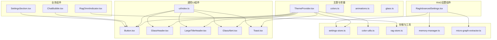
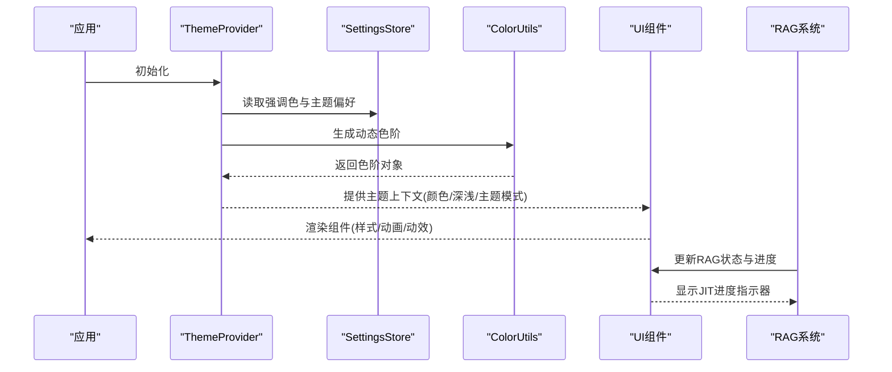
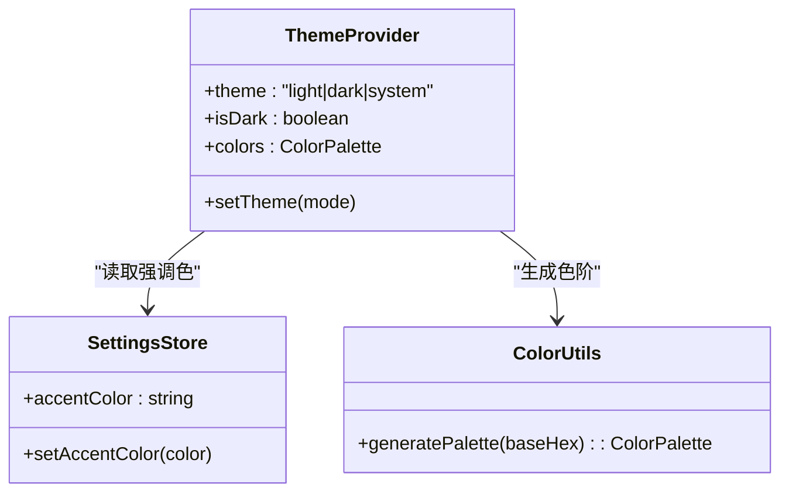
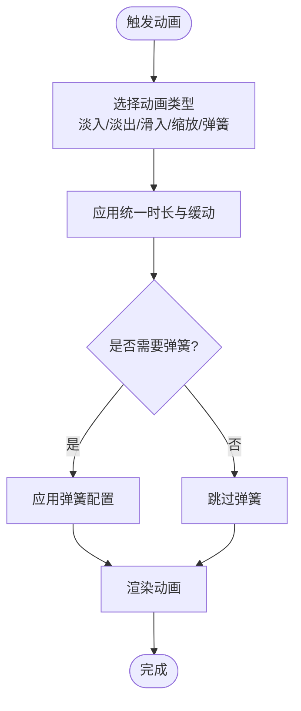
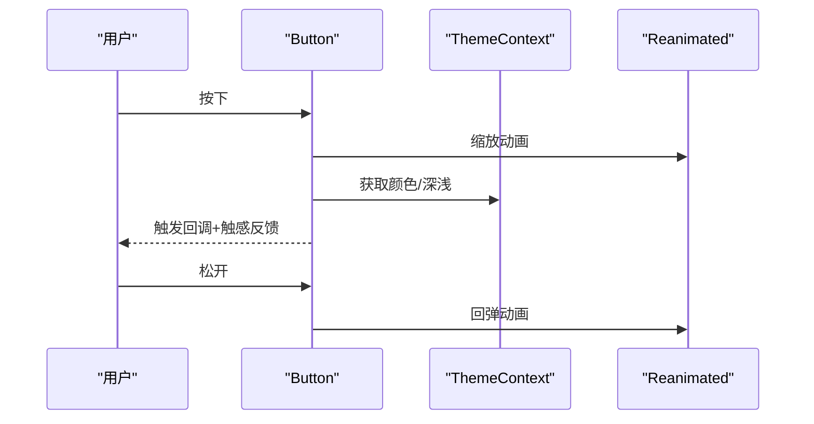
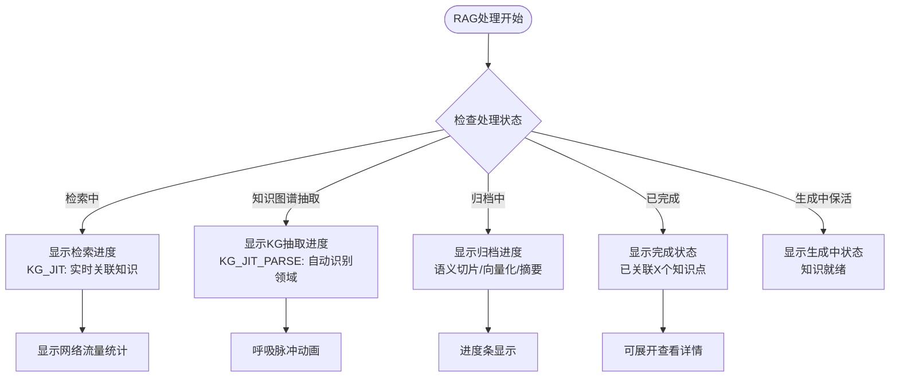
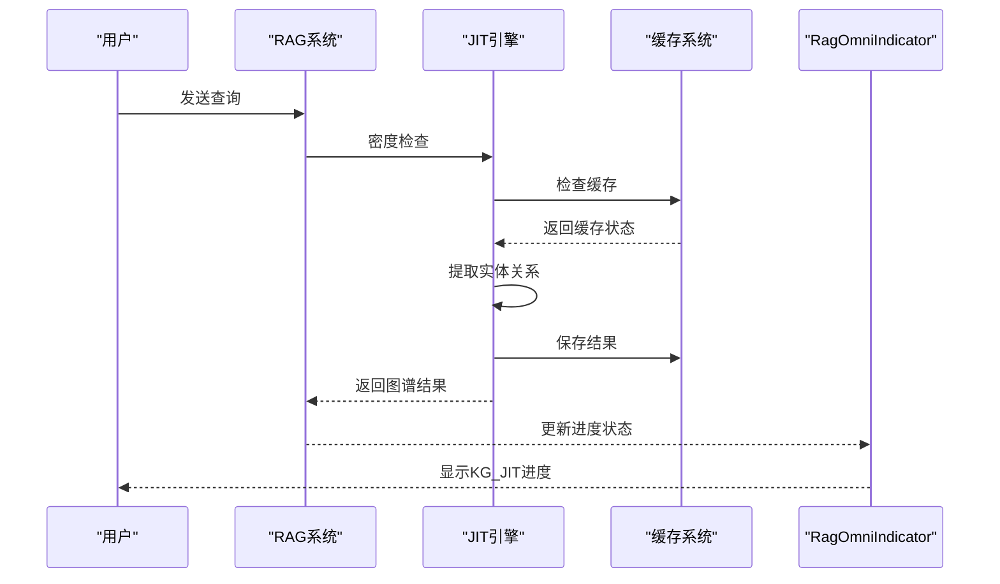
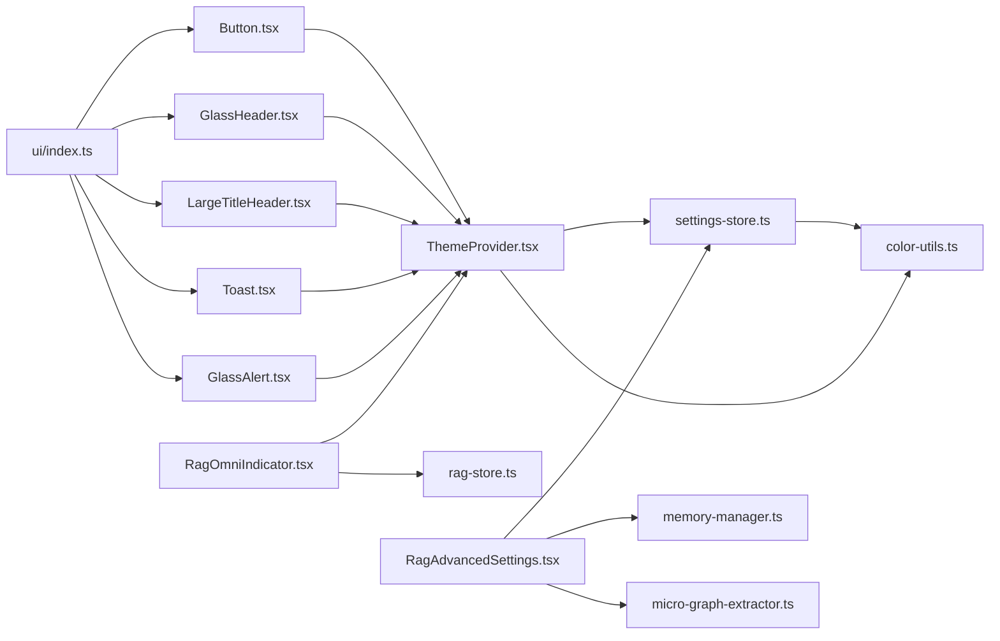

# UI组件系统

<cite>
**本文引用的文件**
- [src/theme/ThemeProvider.tsx](file://src/theme/ThemeProvider.tsx)
- [src/theme/colors.ts](file://src/theme/colors.ts)
- [src/theme/animations.ts](file://src/theme/animations.ts)
- [src/theme/glass.ts](file://src/theme/glass.ts)
- [src/components/ui/index.ts](file://src/components/ui/index.ts)
- [src/components/ui/Button.tsx](file://src/components/ui/Button.tsx)
- [src/components/ui/GlassAlert.tsx](file://src/components/ui/GlassAlert.tsx)
- [src/components/ui/Toast.tsx](file://src/components/ui/Toast.tsx)
- [src/components/ui/GlassHeader.tsx](file://src/components/ui/GlassHeader.tsx)
- [src/components/ui/LargeTitleHeader.tsx](file://src/components/ui/LargeTitleHeader.tsx)
- [src/features/chat/components/ChatBubble.tsx](file://src/features/chat/components/ChatBubble.tsx)
- [src/features/settings/components/SettingsSection.tsx](file://src/features/settings/components/SettingsSection.tsx)
- [src/features/chat/components/RagOmniIndicator.tsx](file://src/features/chat/components/RagOmniIndicator.tsx)
- [src/features/settings/screens/RagAdvancedSettings.tsx](file://src/features/settings/screens/RagAdvancedSettings.tsx)
- [src/lib/color-utils.ts](file://src/lib/color-utils.ts)
- [src/store/settings-store.ts](file://src/store/settings-store.ts)
- [src/store/rag-store.ts](file://src/store/rag-store.ts)
- [src/lib/rag/memory-manager.ts](file://src/lib/rag/memory-manager.ts)
- [src/lib/rag/micro-graph-extractor.ts](file://src/lib/rag/micro-graph-extractor.ts)
- [src/types/chat.ts](file://src/types/chat.ts)
</cite>

## 更新摘要
**变更内容**
- 新增RagOmniIndicator组件的JIT进度指示器功能，支持实时显示KG_JIT和KG_JIT_PARSE状态
- 新增RagAdvancedSettings组件的JIT配置面板，提供完整的JIT功能用户界面支持
- 增强RAG检索流程的可视化指示器，包括网络流量统计和进度条显示
- 添加JIT动态建图的配置选项和参数调整能力

## 目录
1. [简介](#简介)
2. [项目结构](#项目结构)
3. [核心组件](#核心组件)
4. [架构总览](#架构总览)
5. [组件详解](#组件详解)
6. [JIT动态建图功能](#jit动态建图功能)
7. [依赖关系分析](#依赖关系分析)
8. [性能考量](#性能考量)
9. [故障排查指南](#故障排查指南)
10. [结论](#结论)
11. [附录](#附录)

## 简介
本文件系统性梳理 Nexara 的 UI 组件体系，重点覆盖以下方面：
- 主题系统与动态色彩：基于系统深浅模式、用户偏好的主题模式，以及可配置强调色生成完整色阶。
- NativeWind/Tailwind 风格样式：统一的类名约定与尺寸、间距、阴影、边框常量。
- 动画与动效：基于 react-native-reanimated 的统一动画配置与布局动画。
- 核心 UI 组件：按钮、提示气泡、毛玻璃头部、大标题头、对话气泡、设置面板等。
- **新增**：JIT动态建图功能的UI组件支持，包括RagOmniIndicator的JIT进度指示器和RagAdvancedSettings的配置面板。
- 可访问性与跨平台：无障碍标签、触摸反馈、平台差异处理。
- 定制化与样式覆盖：通过主题上下文、颜色工具、常量模块进行扩展。

## 项目结构
UI 组件主要分布在以下位置：
- 主题与通用常量：src/theme（主题提供者、颜色、动画、玻璃质感常量）
- 通用 UI 组件：src/components/ui（按钮、提示、毛玻璃组件、设置卡片等）
- 聊天相关组件：src/features/chat/components（消息气泡、输入、上下文菜单、**新增**RAG指示器等）
- 设置相关组件：src/features/settings/components（设置分组、面板等）
- **新增**：RAG高级设置屏幕，提供JIT功能的完整配置界面
- 存储与颜色工具：src/store/settings-store.ts、src/lib/color-utils.ts

**图表来源**
- [src/theme/ThemeProvider.tsx:1-63](file://src/theme/ThemeProvider.tsx#L1-L63)
- [src/theme/colors.ts:1-42](file://src/theme/colors.ts#L1-L42)
- [src/theme/animations.ts:1-76](file://src/theme/animations.ts#L1-L76)
- [src/theme/glass.ts:1-187](file://src/theme/glass.ts#L1-L187)
- [src/components/ui/index.ts:1-25](file://src/components/ui/index.ts#L1-L25)
- [src/components/ui/Button.tsx:1-161](file://src/components/ui/Button.tsx#L1-L161)
- [src/components/ui/GlassHeader.tsx:1-214](file://src/components/ui/GlassHeader.tsx#L1-L214)
- [src/components/ui/LargeTitleHeader.tsx:1-83](file://src/components/ui/LargeTitleHeader.tsx#L1-L83)
- [src/components/ui/GlassAlert.tsx:1-169](file://src/components/ui/GlassAlert.tsx#L1-L169)
- [src/components/ui/Toast.tsx:1-110](file://src/components/ui/Toast.tsx#L1-L110)
- [src/features/chat/components/ChatBubble.tsx:1-44](file://src/features/chat/components/ChatBubble.tsx#L1-L44)
- [src/features/settings/components/SettingsSection.tsx:1-21](file://src/features/settings/components/SettingsSection.tsx#L1-L21)
- [src/features/chat/components/RagOmniIndicator.tsx:1-345](file://src/features/chat/components/RagOmniIndicator.tsx#L1-L345)
- [src/features/settings/screens/RagAdvancedSettings.tsx:1-415](file://src/features/settings/screens/RagAdvancedSettings.tsx#L1-L415)
- [src/store/settings-store.ts:1-244](file://src/store/settings-store.ts#L1-L244)
- [src/lib/color-utils.ts:1-90](file://src/lib/color-utils.ts#L1-L90)
- [src/store/rag-store.ts:1-200](file://src/store/rag-store.ts#L1-L200)
- [src/lib/rag/memory-manager.ts:490-689](file://src/lib/rag/memory-manager.ts#L490-L689)
- [src/lib/rag/micro-graph-extractor.ts:1-200](file://src/lib/rag/micro-graph-extractor.ts#L1-L200)

**章节来源**
- [src/theme/ThemeProvider.tsx:1-63](file://src/theme/ThemeProvider.tsx#L1-L63)
- [src/components/ui/index.ts:1-25](file://src/components/ui/index.ts#L1-L25)

## 核心组件
- 主题提供者与上下文：负责读取系统深浅模式、持久化用户选择的主题模式、动态强调色并暴露给子树。
- 通用 UI 组件：按钮、毛玻璃头部、大标题头、提示气泡、确认弹窗等。
- 聊天组件：消息气泡作为消息行的包装，承载上下文菜单、头像、元数据等。
- **新增**：RagOmniIndicator全能RAG指示器，支持JIT动态建图的实时进度显示。
- 设置组件：设置分组容器，内含设置卡片与标题。
- **新增**：RagAdvancedSettings高级RAG设置面板，提供JIT功能的完整配置界面。

**章节来源**
- [src/components/ui/Button.tsx:1-161](file://src/components/ui/Button.tsx#L1-L161)
- [src/components/ui/GlassHeader.tsx:1-214](file://src/components/ui/GlassHeader.tsx#L1-L214)
- [src/components/ui/LargeTitleHeader.tsx:1-83](file://src/components/ui/LargeTitleHeader.tsx#L1-L83)
- [src/components/ui/Toast.tsx:1-110](file://src/components/ui/Toast.tsx#L1-L110)
- [src/components/ui/GlassAlert.tsx:1-169](file://src/components/ui/GlassAlert.tsx#L1-L169)
- [src/features/chat/components/ChatBubble.tsx:1-44](file://src/features/chat/components/ChatBubble.tsx#L1-L44)
- [src/features/settings/components/SettingsSection.tsx:1-21](file://src/features/settings/components/SettingsSection.tsx#L1-L21)
- [src/features/chat/components/RagOmniIndicator.tsx:1-345](file://src/features/chat/components/RagOmniIndicator.tsx#L1-L345)
- [src/features/settings/screens/RagAdvancedSettings.tsx:1-415](file://src/features/settings/screens/RagAdvancedSettings.tsx#L1-L415)

## 架构总览
主题系统是 UI 的中枢，贯穿所有组件：
- 主题提供者读取系统深浅模式，支持用户切换"浅色/深色/跟随系统"，并持久化到本地存储。
- 强调色来自设置存储，通过颜色工具生成完整的色阶，供组件按需使用。
- 组件通过主题上下文获取颜色、深浅状态，并结合 NativeWind 类名与动画常量实现一致的视觉与交互体验。
- **新增**：RagOmniIndicator与RagAdvancedSettings组件集成JIT动态建图功能，提供完整的RAG检索流程可视化。

**图表来源**
- [src/theme/ThemeProvider.tsx:1-63](file://src/theme/ThemeProvider.tsx#L1-L63)
- [src/store/settings-store.ts:1-244](file://src/store/settings-store.ts#L1-L244)
- [src/lib/color-utils.ts:1-90](file://src/lib/color-utils.ts#L1-L90)
- [src/features/chat/components/RagOmniIndicator.tsx:1-345](file://src/features/chat/components/RagOmniIndicator.tsx#L1-L345)
- [src/features/settings/screens/RagAdvancedSettings.tsx:1-415](file://src/features/settings/screens/RagAdvancedSettings.tsx#L1-L415)

## 组件详解

### 主题系统与颜色体系
- 主题模式：支持 light/dark/system，系统启动时从本地存储恢复用户偏好。
- 动态强调色：从设置存储读取强调色，使用颜色工具生成 50–900 与若干透明度辅助色。
- 颜色常量：提供品牌色、状态色与明暗两套语义色，作为稳定来源。

**图表来源**
- [src/theme/ThemeProvider.tsx:1-63](file://src/theme/ThemeProvider.tsx#L1-L63)
- [src/store/settings-store.ts:1-244](file://src/store/settings-store.ts#L1-L244)
- [src/lib/color-utils.ts:1-90](file://src/lib/color-utils.ts#L1-L90)

**章节来源**
- [src/theme/ThemeProvider.tsx:1-63](file://src/theme/ThemeProvider.tsx#L1-L63)
- [src/theme/colors.ts:1-42](file://src/theme/colors.ts#L1-L42)
- [src/lib/color-utils.ts:1-90](file://src/lib/color-utils.ts#L1-L90)
- [src/store/settings-store.ts:1-244](file://src/store/settings-store.ts#L1-L244)

### 动画与动效
- 统一动画时长与配置：提供快速/正常/慢速等时长，以及多种弹簧配置。
- 布局动画：针对模态、上滑/下滑、缩放、吐司等场景的进入/退出动画。
- 组件动效：按钮点击缩放、Toast 顶部悬浮胶囊、确认弹窗毛玻璃背景等均使用统一动画。

**图表来源**
- [src/theme/animations.ts:1-76](file://src/theme/animations.ts#L1-L76)

**章节来源**
- [src/theme/animations.ts:1-76](file://src/theme/animations.ts#L1-L76)

### 毛玻璃与阴影/边框/间距常量
- 玻璃常量：Header/Overlay/Sheet 三档模糊强度与透明度，区分明暗模式与平台差异。
- 阴影常量：小/中/大/发光阴影，统一 elevations。
- 边框常量：主边框、细微边框、玻璃边框。
- 间距常量：遵循 Tailwind 约定的 4px 基础单位，提供常用预设。

**章节来源**
- [src/theme/glass.ts:1-187](file://src/theme/glass.ts#L1-L187)

### 通用 UI 组件

#### 按钮 Button
- 支持多变体与尺寸；加载态与禁用态；图标与文本组合；点击缩放动效；触感反馈。
- 使用主题上下文颜色与 NativeWind 类名合并策略。

**图表来源**
- [src/components/ui/Button.tsx:1-161](file://src/components/ui/Button.tsx#L1-L161)
- [src/theme/ThemeProvider.tsx:1-63](file://src/theme/ThemeProvider.tsx#L1-L63)

**章节来源**
- [src/components/ui/Button.tsx:1-161](file://src/components/ui/Button.tsx#L1-L161)

#### 毛玻璃头部 GlassHeader
- 支持自定义模糊强度、遮罩透明度、边框显示、高度与样式。
- 左右操作按钮、副标题、可插槽右侧组件。
- 无障碍标签与防双击导航策略。

**章节来源**
- [src/components/ui/GlassHeader.tsx:1-214](file://src/components/ui/GlassHeader.tsx#L1-L214)

#### 大标题头 LargeTitleHeader
- 简洁的大字号标题与副标题，支持左侧动作与右侧元素插槽。
- 使用主题色常量映射明暗模式下的文本色。

**章节来源**
- [src/components/ui/LargeTitleHeader.tsx:1-83](file://src/components/ui/LargeTitleHeader.tsx#L1-L83)
- [src/theme/colors.ts:1-42](file://src/theme/colors.ts#L1-L42)

#### 提示气泡 Toast
- 全局提供者，支持成功/错误/警告/信息四类图标与颜色。
- 自动隐藏计时器、触感反馈、统一动画进入/退出。
- 持久化容器挂载策略，避免视图组异常。

**章节来源**
- [src/components/ui/Toast.tsx:1-110](file://src/components/ui/Toast.tsx#L1-L110)

#### 确认弹窗 GlassAlert
- 毛玻璃背景、阴影、边框与透明度统一。
- 支持取消/确认按钮、破坏性操作高亮、硬件返回键处理。

**章节来源**
- [src/components/ui/GlassAlert.tsx:1-169](file://src/components/ui/GlassAlert.tsx#L1-L169)
- [src/theme/glass.ts:1-187](file://src/theme/glass.ts#L1-L187)

### 聊天与设置组件

#### 消息气泡 ChatBubble
- 作为消息行的包装，维持向后兼容的同时复用新的原子化微组件架构。
- 支持删除、重发、再生、抽取知识图谱、向量化等操作回调。

**章节来源**
- [src/features/chat/components/ChatBubble.tsx:1-44](file://src/features/chat/components/ChatBubble.tsx#L1-L44)

#### 设置分组 SettingsSection
- 标题与卡片容器，便于在设置页面组织控件。

**章节来源**
- [src/features/settings/components/SettingsSection.tsx:1-21](file://src/features/settings/components/SettingsSection.tsx#L1-L21)

### **新增**：RAG指示器组件

#### RagOmniIndicator 全能RAG指示器
- **新增**：支持JIT（Just-In-Time）动态建图的实时进度显示。
- **新增**：实时显示KG_JIT和KG_JIT_PARSE状态，包括实体识别和关系解析进度。
- **新增**：网络流量统计显示，包括上传和下载字节数。
- **新增**：呼吸脉冲动画效果，用于指示活跃的RAG处理状态。
- **新增**：进度条显示，支持检索、知识图谱抽取和归档的进度跟踪。
- **新增**：支持展开/折叠功能，显示更多详细信息。

**图表来源**
- [src/features/chat/components/RagOmniIndicator.tsx:111-212](file://src/features/chat/components/RagOmniIndicator.tsx#L111-L212)
- [src/features/chat/components/RagOmniIndicator.tsx:250-280](file://src/features/chat/components/RagOmniIndicator.tsx#L250-L280)

**章节来源**
- [src/features/chat/components/RagOmniIndicator.tsx:1-345](file://src/features/chat/components/RagOmniIndicator.tsx#L1-L345)

## JIT动态建图功能

### JIT配置面板
**新增**：RagAdvancedSettings组件提供完整的JIT功能配置界面，包括：

- **JIT总开关**：启用/禁用JIT动态建图功能
- **最大块数配置**：设置参与实时抽取的文本块数量（默认3）
- **自由模式**：启用自由实体识别模式，无需预定义实体类型
- **领域自动识别**：自动识别文本领域并应用相应的抽取策略

### JIT工作流程
**新增**：JIT动态建图在RAG检索流程中的集成：

1. **密度检查**：检查现有图谱覆盖情况，仅在需要时触发JIT
2. **并行处理**：在重排之前或同时启动JIT，最大化重叠耗时
3. **缓存机制**：支持JIT结果缓存，提高重复查询性能
4. **超时控制**：可配置的抽取超时时间（默认5000ms）

**图表来源**
- [src/lib/rag/memory-manager.ts:495-521](file://src/lib/rag/memory-manager.ts#L495-L521)
- [src/lib/rag/micro-graph-extractor.ts:35-78](file://src/lib/rag/micro-graph-extractor.ts#L35-L78)

**章节来源**
- [src/features/settings/screens/RagAdvancedSettings.tsx:155-197](file://src/features/settings/screens/RagAdvancedSettings.tsx#L155-L197)
- [src/lib/rag/memory-manager.ts:495-521](file://src/lib/rag/memory-manager.ts#L495-L521)
- [src/lib/rag/micro-graph-extractor.ts:35-78](file://src/lib/rag/micro-graph-extractor.ts#L35-L78)
- [src/types/chat.ts:306-310](file://src/types/chat.ts#L306-L310)

## 依赖关系分析

**图表来源**
- [src/store/settings-store.ts:1-244](file://src/store/settings-store.ts#L1-L244)
- [src/lib/color-utils.ts:1-90](file://src/lib/color-utils.ts#L1-L90)
- [src/theme/ThemeProvider.tsx:1-63](file://src/theme/ThemeProvider.tsx#L1-L63)
- [src/components/ui/Button.tsx:1-161](file://src/components/ui/Button.tsx#L1-L161)
- [src/components/ui/GlassHeader.tsx:1-214](file://src/components/ui/GlassHeader.tsx#L1-L214)
- [src/components/ui/LargeTitleHeader.tsx:1-83](file://src/components/ui/LargeTitleHeader.tsx#L1-L83)
- [src/components/ui/Toast.tsx:1-110](file://src/components/ui/Toast.tsx#L1-L110)
- [src/components/ui/GlassAlert.tsx:1-169](file://src/components/ui/GlassAlert.tsx#L1-L169)
- [src/components/ui/index.ts:1-25](file://src/components/ui/index.ts#L1-L25)
- [src/features/chat/components/RagOmniIndicator.tsx:1-345](file://src/features/chat/components/RagOmniIndicator.tsx#L1-L345)
- [src/features/settings/screens/RagAdvancedSettings.tsx:1-415](file://src/features/settings/screens/RagAdvancedSettings.tsx#L1-L415)
- [src/store/rag-store.ts:1-200](file://src/store/rag-store.ts#L1-L200)
- [src/lib/rag/memory-manager.ts:490-689](file://src/lib/rag/memory-manager.ts#L490-L689)
- [src/lib/rag/micro-graph-extractor.ts:1-200](file://src/lib/rag/micro-graph-extractor.ts#L1-L200)

**章节来源**
- [src/components/ui/index.ts:1-25](file://src/components/ui/index.ts#L1-L25)
- [src/theme/ThemeProvider.tsx:1-63](file://src/theme/ThemeProvider.tsx#L1-L63)

## 性能考量
- 动画性能：统一使用 reanimated 的 spring/curve 配置，避免 JS 层阻塞；短时长动画减少卡顿。
- 视图挂载：Toast 提供者始终挂载容器，避免动态增删子节点导致的视图组异常。
- 平台差异：玻璃模糊强度在 Android 与 iOS 上差异化处理，兼顾性能与观感。
- 主题计算：强调色变更时仅重新计算色阶，避免全树重绘。
- **新增**：JIT缓存机制：支持JIT结果缓存，提高重复查询性能，减少LLM调用次数。
- **新增**：密度检查优化：仅在现有图谱覆盖不足时触发JIT，避免不必要的处理开销。

## 故障排查指南
- 主题不生效或闪烁
  - 检查主题提供者是否包裹根组件。
  - 确认本地存储中的主题模式是否被正确读取与设置。
- 强调色无效
  - 确认设置存储中的强调色格式为合法十六进制。
  - 若出现异常，系统会在水合阶段进行修复并回退到默认强调色。
- 毛玻璃效果异常
  - Android 平台模糊强度受限，检查是否使用了合适的强度与透明度。
- 动画卡顿
  - 避免在动画过程中频繁触发昂贵计算；尽量使用共享值与预设配置。
- 触感反馈未触发
  - 确认回调中延迟执行与防双击策略已正确封装。
- **新增**：JIT功能异常
  - 检查JIT配置是否正确启用，最大块数设置是否合理。
  - 确认LLM模型可用性和网络连接状态。
  - 查看JIT缓存是否正常工作，必要时清理过期缓存条目。

**章节来源**
- [src/theme/ThemeProvider.tsx:1-63](file://src/theme/ThemeProvider.tsx#L1-L63)
- [src/store/settings-store.ts:1-244](file://src/store/settings-store.ts#L1-L244)
- [src/theme/glass.ts:1-187](file://src/theme/glass.ts#L1-L187)
- [src/components/ui/Toast.tsx:1-110](file://src/components/ui/Toast.tsx#L1-L110)
- [src/features/chat/components/RagOmniIndicator.tsx:1-345](file://src/features/chat/components/RagOmniIndicator.tsx#L1-L345)

## 结论
Nexara 的 UI 组件系统以"主题—颜色—动画—组件"为主线，形成统一的视觉与交互语言。通过强调色驱动的动态色阶、平台适配的玻璃常量、以及标准化的动画配置，实现了跨平台的一致体验。**新增的JIT动态建图功能**进一步增强了RAG系统的可视化和用户体验，通过RagOmniIndicator组件提供实时的处理进度反馈，通过RagAdvancedSettings组件提供完整的配置界面。通用组件与业务组件解耦清晰，便于扩展与维护。

## 附录

### 主题切换机制与颜色系统
- 主题模式持久化：系统启动时从本地存储读取，若无则默认跟随系统。
- 强调色校验：仅接受合法十六进制，非法值会被忽略并记录告警。
- 色阶生成：基于主色与白/黑混合生成 50–900 与透明度辅助色，供组件直接使用。

**章节来源**
- [src/theme/ThemeProvider.tsx:1-63](file://src/theme/ThemeProvider.tsx#L1-L63)
- [src/store/settings-store.ts:1-244](file://src/store/settings-store.ts#L1-L244)
- [src/lib/color-utils.ts:1-90](file://src/lib/color-utils.ts#L1-L90)

### 动画库使用要点
- 时长与缓动：统一使用常量与时序函数，保证动效节奏一致。
- 弹簧动效：针对按钮、卡片、吐司等场景提供专用弹簧配置。
- 布局动画：模态、列表项、吐司等场景使用对应进入/退出动画。

**章节来源**
- [src/theme/animations.ts:1-76](file://src/theme/animations.ts#L1-L76)

### 可访问性与跨平台兼容
- 无障碍：头部操作按钮提供可访问性标签。
- 触感反馈：点击与导航延迟执行，避免与底层事件冲突。
- 平台差异：Android 限制模糊强度与透明度，确保性能与观感平衡。

**章节来源**
- [src/components/ui/GlassHeader.tsx:1-214](file://src/components/ui/GlassHeader.tsx#L1-L214)
- [src/theme/glass.ts:1-187](file://src/theme/glass.ts#L1-L187)

### 组件定制化与样式覆盖
- 通过主题上下文注入的颜色与深浅状态，可在组件内部按需使用。
- 使用 NativeWind 类名合并策略，允许传入自定义 className 与 style 进行覆盖。
- 对于复杂容器，可通过设置卡片/分组组件进行结构化组织与样式隔离。

**章节来源**
- [src/components/ui/Button.tsx:1-161](file://src/components/ui/Button.tsx#L1-L161)
- [src/components/ui/GlassHeader.tsx:1-214](file://src/components/ui/GlassHeader.tsx#L1-L214)
- [src/features/settings/components/SettingsSection.tsx:1-21](file://src/features/settings/components/SettingsSection.tsx#L1-L21)

### **新增**：JIT动态建图配置
- **JIT总开关**：控制是否启用动态建图功能，默认关闭以避免额外开销。
- **最大块数**：设置参与实时抽取的文本块数量，默认3，可根据性能调整。
- **超时控制**：JIT抽取超时时间，默认5000ms，避免长时间等待。
- **缓存策略**：JIT结果缓存TTL，默认3600秒，提高重复查询性能。
- **自由模式**：启用后无需预定义实体类型，适合未知领域的文本分析。

**章节来源**
- [src/features/settings/screens/RagAdvancedSettings.tsx:155-197](file://src/features/settings/screens/RagAdvancedSettings.tsx#L155-L197)
- [src/lib/rag/memory-manager.ts:495-521](file://src/lib/rag/memory-manager.ts#L495-L521)
- [src/lib/rag/micro-graph-extractor.ts:103-130](file://src/lib/rag/micro-graph-extractor.ts#L103-L130)
- [src/types/chat.ts:306-310](file://src/types/chat.ts#L306-L310)