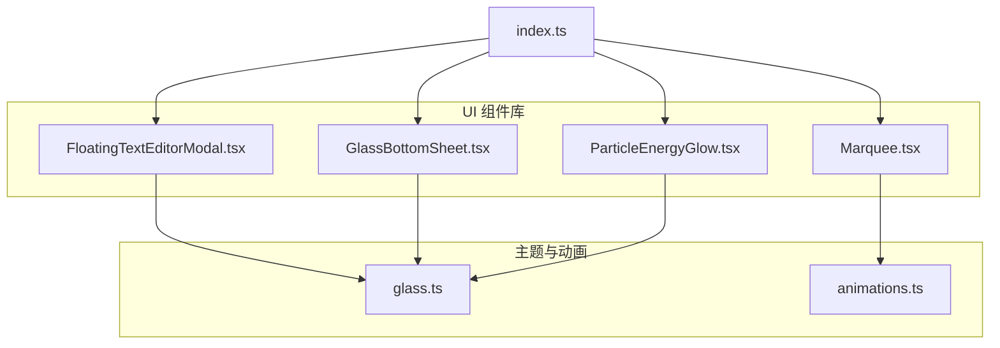
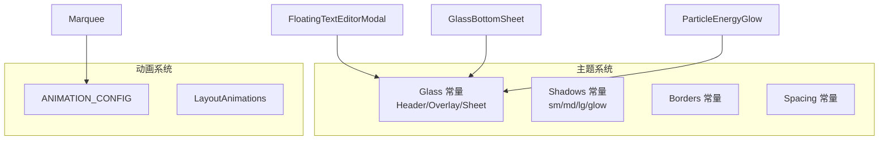
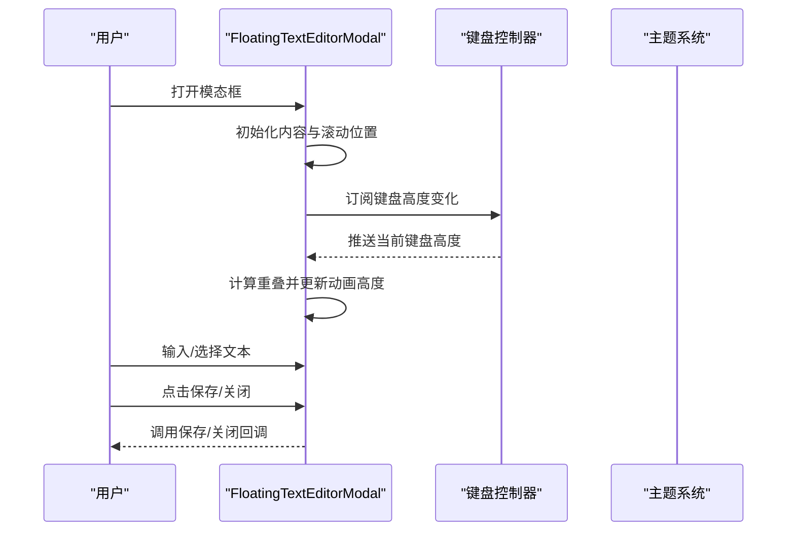
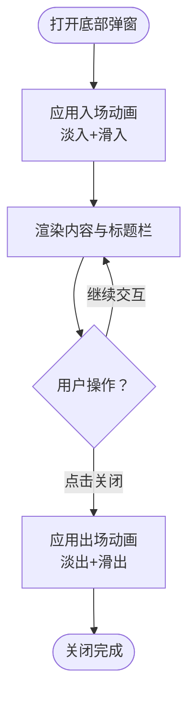
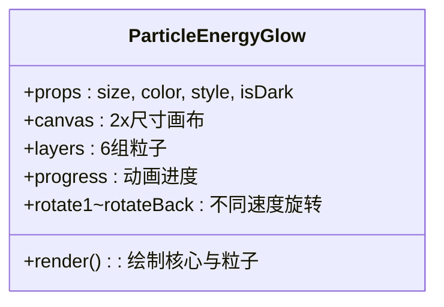
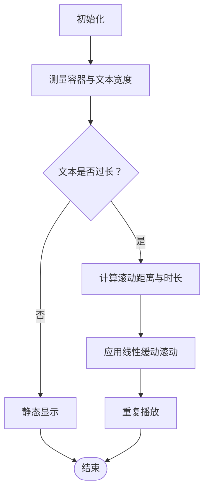
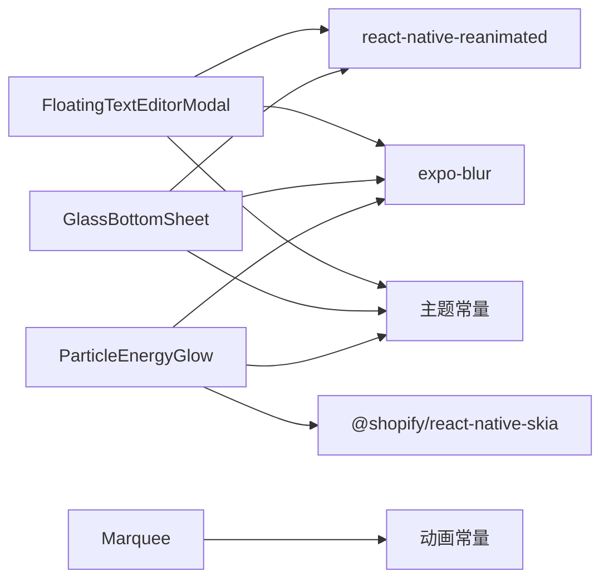

# 专用组件

<cite>
**本文引用的文件**
- [FloatingTextEditorModal.tsx](file://src/components/ui/FloatingTextEditorModal.tsx)
- [GlassBottomSheet.tsx](file://src/components/ui/GlassBottomSheet.tsx)
- [ParticleEnergyGlow.tsx](file://src/components/ui/ParticleEnergyGlow.tsx)
- [Marquee.tsx](file://src/components/ui/Marquee.tsx)
- [glass.ts](file://src/theme/glass.ts)
- [animations.ts](file://src/theme/animations.ts)
- [index.ts](file://src/components/ui/index.ts)
- [SuperAssistantFAB.tsx](file://src/components/chat/SuperAssistantFAB.tsx)
- [visual-demo.tsx](file://app/visual-demo.tsx)
- [settings.tsx](file://app/chat/[id]/settings.tsx)
</cite>

## 目录
1. [引言](#引言)
2. [项目结构](#项目结构)
3. [核心组件](#核心组件)
4. [架构总览](#架构总览)
5. [组件详解](#组件详解)
6. [依赖关系分析](#依赖关系分析)
7. [性能考量](#性能考量)
8. [故障排查指南](#故障排查指南)
9. [结论](#结论)
10. [附录](#附录)

## 引言
本文件聚焦 Nexara 的四类专用组件：浮动文本编辑器模态框、玻璃底部弹窗、粒子能量辉光效果与滚动字幕。文档从架构、数据流、处理逻辑、交互设计与生命周期管理等维度进行深入解析，并给出使用场景、集成方式、性能优化与用户体验设计建议。

## 项目结构
这些组件位于统一的 UI 组件库目录下，配合主题系统与动画常量，形成一致的视觉与交互风格。组件通过导出索引集中暴露，便于按需引入与统一管理。

图表来源
- [index.ts:1-25](file://src/components/ui/index.ts#L1-L25)
- [glass.ts:1-187](file://src/theme/glass.ts#L1-L187)
- [animations.ts:1-76](file://src/theme/animations.ts#L1-L76)

章节来源
- [index.ts:1-25](file://src/components/ui/index.ts#L1-L25)

## 核心组件
- 浮动文本编辑器模态框：提供沉浸式文本编辑体验，支持键盘联动收缩、深浅色主题适配、警告提示与字符计数。
- 玻璃底部弹窗：用于承载复杂内容的底部面板，采用模糊背景与边框增强通透感，提供滑入/滑出与淡入/淡出动画。
- 粒子能量辉光：基于 Skia 的高性能粒子系统，生成多层级旋转扩散的辉光效果，适合品牌标识或引导元素。
- 滚动字幕：长文本自动滚动展示，具备延迟启动、重复播放与线性缓动，避免遮挡与信息丢失。

章节来源
- [FloatingTextEditorModal.tsx:1-248](file://src/components/ui/FloatingTextEditorModal.tsx#L1-L248)
- [GlassBottomSheet.tsx:1-150](file://src/components/ui/GlassBottomSheet.tsx#L1-L150)
- [ParticleEnergyGlow.tsx:1-141](file://src/components/ui/ParticleEnergyGlow.tsx#L1-L141)
- [Marquee.tsx:1-123](file://src/components/ui/Marquee.tsx#L1-L123)

## 架构总览
四个组件共享统一的主题与动画体系：
- 主题常量：定义模糊强度、透明度、阴影与间距等规范，确保视觉一致性。
- 动画常量：提供统一的时长、缓动与组合动画配置，保证交互流畅自然。

图表来源
- [glass.ts:1-187](file://src/theme/glass.ts#L1-L187)
- [animations.ts:1-76](file://src/theme/animations.ts#L1-L76)

## 组件详解

### 浮动文本编辑器模态框（FloatingTextEditorModal）
- 设计目标：在全屏半透明背景下，以居中悬浮卡片形式呈现可编辑文本，支持多行输入、顶部对齐、键盘联动避让与保存/关闭操作。
- 关键机制：
  - 键盘联动：通过键盘高度共享值与动画样式同步，动态调整模态框高度，避免遮挡输入区域。
  - 回退处理：监听硬件返回键，确保可见状态下优先关闭模态框。
  - 视觉风格：深浅色主题下采用不同背景与模糊强度；边框与阴影增强层次感。
  - 交互细节：顶部标题栏包含关闭与保存按钮；可选警告提示区域；底部显示字符计数。
- 生命周期与状态：
  - 可见性受外部控制；进入时重置内容与滚动位置；退出时清理定时器与事件订阅。
  - 内容变更实时响应，保存回调由父组件接管。
- 使用场景：
  - 编辑自定义提示词、备注、配置项等需要沉浸式输入的场景。
- 集成要点：
  - 传入初始内容与标题；提供保存与关闭回调；根据需求开启多行模式与占位符。
  - 注意键盘联动与安全区适配，确保在不同设备上稳定表现。

图表来源
- [FloatingTextEditorModal.tsx:60-114](file://src/components/ui/FloatingTextEditorModal.tsx#L60-L114)

章节来源
- [FloatingTextEditorModal.tsx:1-248](file://src/components/ui/FloatingTextEditorModal.tsx#L1-L248)

### 玻璃底部弹窗（GlassBottomSheet）
- 设计目标：在屏幕底部呈现半透明模糊容器，承载复杂内容，提供清晰的标题与关闭交互。
- 关键机制：
  - 模态背景：全屏半透明覆盖层，点击空白处可关闭。
  - 动画策略：入场使用淡入+滑入，出场使用淡出+滑出，结合缓动函数提升触感。
  - 视觉风格：根据主题选择模糊强度与透明度；边框与阴影统一风格；内嵌模糊视图叠加颜色遮罩。
  - 安全区适配：底部留白考虑安全区，确保内容不被刘海或手势区域遮挡。
- 生命周期与状态：
  - 可见性受外部控制；进入时应用入场动画；退出时应用出场动画并清理。
- 使用场景：
  - 设置面板、工具箱、详情展示等需要强调内容可读性的场景。
- 集成要点：
  - 通过高度参数控制最小/最大高度；子组件通过 children 注入；注意模糊方法与性能差异。

图表来源
- [GlassBottomSheet.tsx:41-147](file://src/components/ui/GlassBottomSheet.tsx#L41-L147)

章节来源
- [GlassBottomSheet.tsx:1-150](file://src/components/ui/GlassBottomSheet.tsx#L1-L150)

### 粒子能量辉光（ParticleEnergyGlow）
- 设计目标：为品牌标识或引导元素提供动态、高光的粒子扩散效果，营造科技感与沉浸感。
- 关键机制：
  - 多层级粒子：固定层数与每层粒子数量，围绕中心呈环形分布，随机半径与角度。
  - 旋转动画：不同层级以不同速度与方向旋转，形成“扩散—回旋”的复合运动。
  - 渲染管线：使用 Skia Canvas 绘制核心辉光与粒子，结合径向渐变与模糊遮罩实现柔和边缘。
  - HDR 增益：通过颜色矩阵提升亮度，配合暗/亮模式下的透明度与对比度。
- 生命周期与状态：
  - 进入页面后启动循环动画；卸载时取消动画，避免资源泄漏。
- 使用场景：
  - 启动页、功能入口、主按钮发光、加载状态等强调视觉焦点的场景。
- 集成要点：
  - 尺寸与颜色通过 props 注入；isDark 控制明暗模式；布局上通常作为背景层使用。

图表来源
- [ParticleEnergyGlow.tsx:30-141](file://src/components/ui/ParticleEnergyGlow.tsx#L30-L141)

章节来源
- [ParticleEnergyGlow.tsx:1-141](file://src/components/ui/ParticleEnergyGlow.tsx#L1-L141)
- [SuperAssistantFAB.tsx:210-219](file://src/components/chat/SuperAssistantFAB.tsx#L210-L219)
- [visual-demo.tsx:40-45](file://app/visual-demo.tsx#L40-L45)

### 滚动字幕（Marquee）
- 设计目标：当文本超出容器宽度时，自动以线性缓动进行平滑滚动，避免截断并保持可读性。
- 关键机制：
  - 文本测量：隐藏层先测量文本宽度，再决定是否启用滚动。
  - 动画策略：长文本时复制两份文本并在容器宽度外侧拼接，形成无缝循环滚动。
  - 延迟与重复：支持延迟启动与无限重复，线性缓动保证速度恒定。
- 生命周期与状态：
  - 容器与文本宽度变化时重新计算滚动距离与动画时长；卸载时取消动画。
- 使用场景：
  - 标题、标签、通知、状态栏等需要展示完整信息的场景。
- 集成要点：
  - 提供文本与样式属性；可配置时长、延迟与换行策略；注意容器高度与行高匹配。

图表来源
- [Marquee.tsx:31-61](file://src/components/ui/Marquee.tsx#L31-L61)

章节来源
- [Marquee.tsx:1-123](file://src/components/ui/Marquee.tsx#L1-L123)

## 依赖关系分析
- 组件间耦合度低，均通过主题与动画常量间接依赖，便于独立演进与替换。
- 共享依赖：
  - 主题：统一的模糊强度、透明度、阴影与边框常量。
  - 动画：统一的时长与缓动配置，保证交互一致性。
- 外部依赖：
  - 动画：react-native-reanimated
  - 模糊：expo-blur
  - 图形：@shopify/react-native-skia（仅粒子辉光）

图表来源
- [FloatingTextEditorModal.tsx:1-26](file://src/components/ui/FloatingTextEditorModal.tsx#L1-L26)
- [GlassBottomSheet.tsx:1-14](file://src/components/ui/GlassBottomSheet.tsx#L1-L14)
- [ParticleEnergyGlow.tsx:1-11](file://src/components/ui/ParticleEnergyGlow.tsx#L1-L11)
- [glass.ts:1-187](file://src/theme/glass.ts#L1-L187)
- [animations.ts:1-76](file://src/theme/animations.ts#L1-L76)

章节来源
- [glass.ts:1-187](file://src/theme/glass.ts#L1-L187)
- [animations.ts:1-76](file://src/theme/animations.ts#L1-L76)

## 性能考量
- 动画性能
  - 使用共享值与派生值驱动动画，减少不必要的重渲染。
  - 粒子辉光采用 Skia 渲染，建议在低端设备上降低粒子数量或层级。
- 视觉性能
  - 模态与底部弹窗的模糊强度在 Android 上适度下调，避免过度消耗。
  - 边框与阴影统一使用主题常量，减少样式计算开销。
- 交互性能
  - 滚动字幕通过隐藏测量层一次性计算宽度，避免多次布局抖动。
  - 键盘联动采用共享值与动画样式同步，避免强制布局。
- 资源管理
  - 动画在组件卸载时及时取消，防止后台持续运行造成内存压力。

## 故障排查指南
- 模态框被键盘遮挡
  - 检查键盘高度监听是否生效；确认动画高度计算逻辑与屏幕尺寸一致。
  - 参考路径：[FloatingTextEditorModal.tsx:85-114](file://src/components/ui/FloatingTextEditorModal.tsx#L85-L114)
- 底部弹窗内容被遮挡
  - 检查安全区适配与底部留白；确认模糊强度与透明度设置。
  - 参考路径：[GlassBottomSheet.tsx:65-76](file://src/components/ui/GlassBottomSheet.tsx#L65-L76)
- 粒子辉光闪烁或卡顿
  - 降低粒子数量或层级；检查 HDR 增益矩阵与设备兼容性。
  - 参考路径：[ParticleEnergyGlow.tsx:49-73](file://src/components/ui/ParticleEnergyGlow.tsx#L49-L73)
- 滚动字幕不触发
  - 确认容器宽度与文本宽度测量逻辑；检查是否启用了长文本模式。
  - 参考路径：[Marquee.tsx:31-61](file://src/components/ui/Marquee.tsx#L31-L61)

章节来源
- [FloatingTextEditorModal.tsx:85-114](file://src/components/ui/FloatingTextEditorModal.tsx#L85-L114)
- [GlassBottomSheet.tsx:65-76](file://src/components/ui/GlassBottomSheet.tsx#L65-L76)
- [ParticleEnergyGlow.tsx:49-73](file://src/components/ui/ParticleEnergyGlow.tsx#L49-L73)
- [Marquee.tsx:31-61](file://src/components/ui/Marquee.tsx#L31-L61)

## 结论
这四个专用组件通过统一的主题与动画体系，在保证视觉一致性的同时，提供了丰富的交互细节与良好的性能表现。它们分别服务于沉浸式编辑、内容展示、品牌强调与信息滚动等场景，是构建 Nexara 高品质用户体验的重要基石。

## 附录
- 使用示例参考
  - 浮动文本编辑器：在会话设置中打开编辑器并保存结果。
    - 参考路径：[settings.tsx:600-610](file://app/chat/[id]/settings.tsx#L600-L610)
  - 玻璃底部弹窗：在多种设置与工作区场景中使用。
    - 参考路径：[GlassBottomSheet.tsx:27-34](file://src/components/ui/GlassBottomSheet.tsx#L27-L34)
  - 粒子能量辉光：在超级助手悬浮按钮中作为发光背景。
    - 参考路径：[SuperAssistantFAB.tsx:212-219](file://src/components/chat/SuperAssistantFAB.tsx#L212-L219)
  - 滚动字幕：在设置与知识库列表中展示长标题。
    - 参考路径：[Marquee.tsx:23-28](file://src/components/ui/Marquee.tsx#L23-L28)