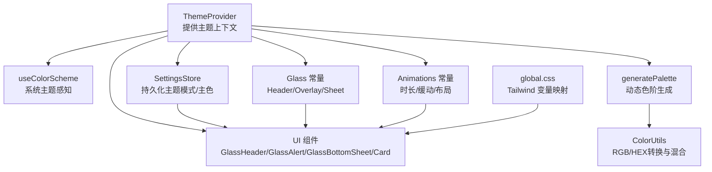
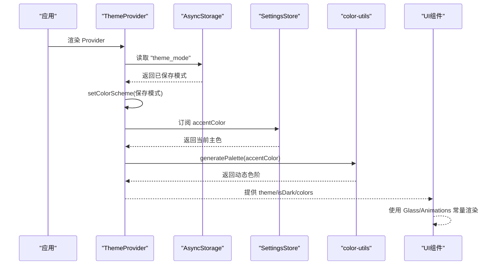
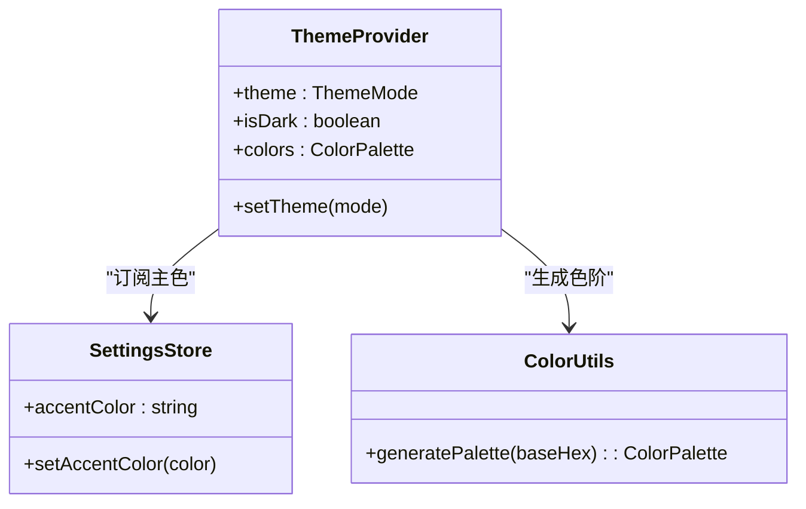
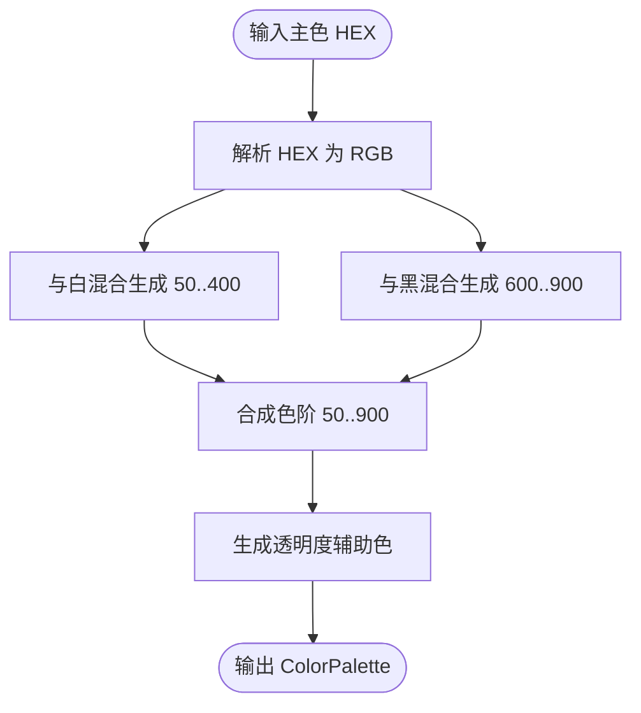
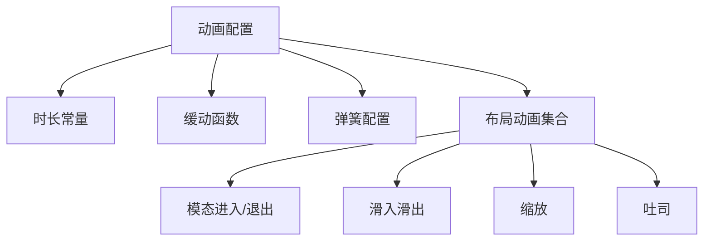
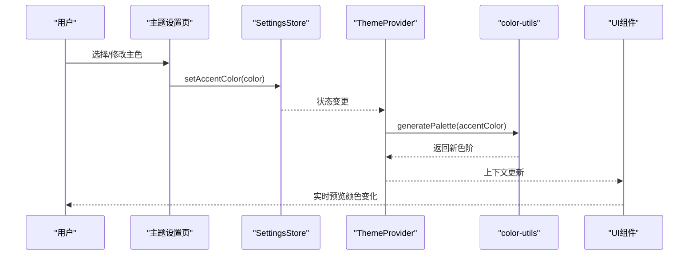
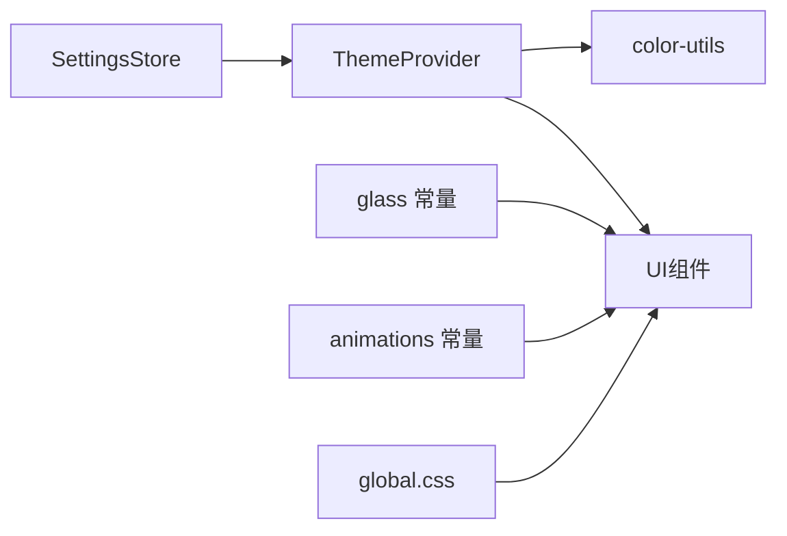

# 主题系统

<cite>
**本文引用的文件**
- [src/theme/ThemeProvider.tsx](file://src/theme/ThemeProvider.tsx)
- [src/theme/colors.ts](file://src/theme/colors.ts)
- [src/theme/glass.ts](file://src/theme/glass.ts)
- [src/theme/animations.ts](file://src/theme/animations.ts)
- [src/lib/color-utils.ts](file://src/lib/color-utils.ts)
- [src/store/settings-store.ts](file://src/store/settings-store.ts)
- [src/features/settings/screens/ThemeSettingsScreen.tsx](file://src/features/settings/screens/ThemeSettingsScreen.tsx)
- [src/components/ui/GlassHeader.tsx](file://src/components/ui/GlassHeader.tsx)
- [src/components/ui/GlassAlert.tsx](file://src/components/ui/GlassAlert.tsx)
- [src/components/ui/GlassBottomSheet.tsx](file://src/components/ui/GlassBottomSheet.tsx)
- [src/components/ui/Card.tsx](file://src/components/ui/Card.tsx)
- [src/components/ui/PageLayout.tsx](file://src/components/ui/PageLayout.tsx)
- [global.css](file://global.css)
- [app/settings/theme.tsx](file://app/settings/theme.tsx)
</cite>

## 目录
1. [简介](#简介)
2. [项目结构](#项目结构)
3. [核心组件](#核心组件)
4. [架构总览](#架构总览)
5. [详细组件分析](#详细组件分析)
6. [依赖关系分析](#依赖关系分析)
7. [性能考量](#性能考量)
8. [故障排查指南](#故障排查指南)
9. [结论](#结论)
10. [附录](#附录)

## 简介
本文件系统化阐述 Nexara 主题系统的实现机制与设计架构，覆盖以下重点：
- 主题提供者与颜色系统：主题模式切换、动态主色到色阶生成、全局颜色常量与 Tailwind 变量映射。
- 玻璃拟态（Blur/Glassmorphism）：统一的模糊强度、透明度、基色与色调策略，以及在头部、弹窗、底部面板中的应用。
- 动画库集成：基于 react-native-reanimated 的统一动画时长、缓动与布局动画配置。
- 主题切换与持久化：系统/浅色/深色模式、主色选择与动态色阶更新、本地存储与 Hydration 容错。
- 平台适配：iOS 与 Android 在模糊强度与性能上的差异化策略。
- 主题定制与颜色搭配建议：如何扩展色板、保持对比度与无障碍。
- 性能优化与内存管理：减少重渲染、合理使用 Blur、动画与存储策略。

## 项目结构
主题系统围绕“提供者-颜色-玻璃-动画”四条主线组织，并通过设置存储与 UI 组件进行落地：
- 提供者与上下文：统一注入主题模式、是否深色、动态色阶。
- 颜色与色阶：品牌色常量、动态色阶生成、Tailwind CSS 变量映射。
- 玻璃常量：Header/Overlay/Sheet 三档模糊强度与透明度策略。
- 动画常量：统一时长、缓动与布局动画集合。
- 设置存储：持久化主题模式与主色，Hydration 容错。
- UI 组件：GlassHeader、GlassAlert、GlassBottomSheet、Card 等复用玻璃与动画能力。



图表来源
- [src/theme/ThemeProvider.tsx:18-54](file://src/theme/ThemeProvider.tsx#L18-L54)
- [src/lib/color-utils.ts:64-89](file://src/lib/color-utils.ts#L64-L89)
- [src/theme/glass.ts:12-68](file://src/theme/glass.ts#L12-L68)
- [src/theme/animations.ts:12-75](file://src/theme/animations.ts#L12-L75)
- [src/store/settings-store.ts:75-243](file://src/store/settings-store.ts#L75-L243)
- [global.css:5-30](file://global.css#L5-L30)

章节来源
- [src/theme/ThemeProvider.tsx:1-63](file://src/theme/ThemeProvider.tsx#L1-L63)
- [src/theme/colors.ts:1-42](file://src/theme/colors.ts#L1-L42)
- [src/theme/glass.ts:1-187](file://src/theme/glass.ts#L1-L187)
- [src/theme/animations.ts:1-76](file://src/theme/animations.ts#L1-L76)
- [src/lib/color-utils.ts:1-90](file://src/lib/color-utils.ts#L1-L90)
- [src/store/settings-store.ts:1-244](file://src/store/settings-store.ts#L1-L244)
- [global.css:1-31](file://global.css#L1-L31)

## 核心组件
- 主题提供者与上下文
  - 提供主题模式（系统/浅色/深色）、当前是否深色、动态色阶。
  - 支持设置主题模式并持久化；首次加载从本地恢复。
- 动态颜色系统
  - 基于主色生成完整的 50–900 色阶与若干透明度辅助色。
  - 使用 RGB 混合算法，小于 500 与白混合，大于 500 与黑混合。
- 玻璃常量与阴影/边框/间距
  - Header/Overlay/Sheet 三档模糊强度与透明度，区分 iOS/Android。
  - 统一阴影、边框与间距常量，确保一致的层级与留白。
- 动画常量
  - 统一时长、缓动与布局动画集合，覆盖模态、滑入滑出、缩放与吐司。
- 设置存储
  - 持久化语言、主色、默认模型、RAG 全局配置等；对主色进行正则校验与 Hydration 容错。
- UI 组件
  - GlassHeader/GlassAlert/GlassBottomSheet/Card 复用玻璃与动画常量，保证视觉一致性。

章节来源
- [src/theme/ThemeProvider.tsx:9-14](file://src/theme/ThemeProvider.tsx#L9-L14)
- [src/lib/color-utils.ts:40-89](file://src/lib/color-utils.ts#L40-L89)
- [src/theme/glass.ts:12-187](file://src/theme/glass.ts#L12-L187)
- [src/theme/animations.ts:12-75](file://src/theme/animations.ts#L12-L75)
- [src/store/settings-store.ts:23-104](file://src/store/settings-store.ts#L23-L104)
- [src/components/ui/GlassHeader.tsx:66-213](file://src/components/ui/GlassHeader.tsx#L66-L213)
- [src/components/ui/GlassAlert.tsx:28-169](file://src/components/ui/GlassAlert.tsx#L28-L169)
- [src/components/ui/GlassBottomSheet.tsx:27-150](file://src/components/ui/GlassBottomSheet.tsx#L27-L150)
- [src/components/ui/Card.tsx:28-105](file://src/components/ui/Card.tsx#L28-L105)

## 架构总览
主题系统采用“提供者 + 存储 + 常量 + 组件”的分层架构：
- 提供者层：集中管理主题模式与动态色阶，向子树注入上下文。
- 常量层：颜色、玻璃、动画、间距等统一常量，避免散落魔法数。
- 组件层：UI 组件消费上下文与常量，实现一致的视觉与交互体验。
- 存储层：Zustand + AsyncStorage 持久化主题模式与主色，支持 Hydration 容错。



图表来源
- [src/theme/ThemeProvider.tsx:25-45](file://src/theme/ThemeProvider.tsx#L25-L45)
- [src/store/settings-store.ts:95-104](file://src/store/settings-store.ts#L95-L104)
- [src/lib/color-utils.ts:64-89](file://src/lib/color-utils.ts#L64-L89)
- [src/theme/glass.ts:12-68](file://src/theme/glass.ts#L12-L68)
- [src/theme/animations.ts:12-75](file://src/theme/animations.ts#L12-L75)

## 详细组件分析

### 主题提供者与上下文
- 职责
  - 管理主题模式（系统/浅色/深色），并同步至系统主题。
  - 从设置存储读取主色，生成动态色阶并通过上下文暴露给子树。
  - 提供设置主题模式的异步方法，并持久化到本地。
- 关键点
  - 首次启动从本地恢复主题模式，否则默认系统。
  - 动态色阶基于主色计算，随主色变化而更新。
  - isDark 由系统主题决定，便于 UI 组件按需渲染。



图表来源
- [src/theme/ThemeProvider.tsx:18-54](file://src/theme/ThemeProvider.tsx#L18-L54)
- [src/store/settings-store.ts:95-104](file://src/store/settings-store.ts#L95-L104)
- [src/lib/color-utils.ts:64-89](file://src/lib/color-utils.ts#L64-L89)

章节来源
- [src/theme/ThemeProvider.tsx:18-54](file://src/theme/ThemeProvider.tsx#L18-L54)

### 动态颜色系统与色阶生成
- 设计目标
  - 从单一主色生成完整的 Tailwind 风格色阶（50–900）与若干透明度辅助色。
  - 保证明暗模式下的可读性与对比度。
- 实现要点
  - HEX → RGB → 混合（与白/黑）→ RGB → HEX。
  - 小于 500 与白混合，大于 500 与黑混合，形成自然过渡。
  - 透明度辅助色用于弱提示、遮罩等场景。
- 复杂度
  - 单次生成 O(1) 时间复杂度，空间开销常数级。



图表来源
- [src/lib/color-utils.ts:9-38](file://src/lib/color-utils.ts#L9-L38)
- [src/lib/color-utils.ts:64-89](file://src/lib/color-utils.ts#L64-L89)

章节来源
- [src/lib/color-utils.ts:1-90](file://src/lib/color-utils.ts#L1-L90)

### 玻璃拟态效果与平台适配
- 策略
  - Header：高模糊、低透明度，适合顶部导航与输入区。
  - Overlay：中等模糊、中等透明度，适合浮层卡片、模态与吐司。
  - Sheet：低模糊、高透明度，强调内容可读性与隐私。
- 平台差异
  - Android 限制更高模糊强度，因此在各档位上普遍降低。
  - iOS 默认更高的模糊质量，可使用更高数值。
- 组件应用
  - GlassHeader：顶部模糊顶栏，支持自定义强度与遮罩透明度。
  - GlassAlert：对话框式确认，复用 Header 的模糊与透明度策略。
  - GlassBottomSheet：底部弹层，结合阴影与边框提升层次感。
  - Card：卡片可选玻璃变体，内部叠加 BlurView 与基色遮罩。

```mermaid
classDiagram
class Glass {
+Header : {intensity, opacity, tint}
+Overlay : {intensity, opacity, baseColor, tint}
+Sheet : {intensity, opacity, baseColor, tint}
+Shadows : {sm, md, lg, glow}
+Borders : {primary, subtle, glass}
+Spacing : {0..24,...}
}
class GlassHeader {
+props : intensity, overlayOpacity, tint...
}
class GlassAlert {
+props : visible, title, message...
}
class GlassBottomSheet {
+props : visible, onClose, title...
}
class Card {
+variant : glass?
}
GlassHeader --> Glass : "使用常量"
GlassAlert --> Glass : "使用常量"
GlassBottomSheet --> Glass : "使用常量"
Card --> Glass : "使用常量"
```

图表来源
- [src/theme/glass.ts:12-187](file://src/theme/glass.ts#L12-L187)
- [src/components/ui/GlassHeader.tsx:66-213](file://src/components/ui/GlassHeader.tsx#L66-L213)
- [src/components/ui/GlassAlert.tsx:28-169](file://src/components/ui/GlassAlert.tsx#L28-L169)
- [src/components/ui/GlassBottomSheet.tsx:27-150](file://src/components/ui/GlassBottomSheet.tsx#L27-L150)
- [src/components/ui/Card.tsx:67-82](file://src/components/ui/Card.tsx#L67-L82)

章节来源
- [src/theme/glass.ts:1-187](file://src/theme/glass.ts#L1-L187)
- [src/components/ui/GlassHeader.tsx:1-214](file://src/components/ui/GlassHeader.tsx#L1-L214)
- [src/components/ui/GlassAlert.tsx:1-169](file://src/components/ui/GlassAlert.tsx#L1-L169)
- [src/components/ui/GlassBottomSheet.tsx:1-150](file://src/components/ui/GlassBottomSheet.tsx#L1-L150)
- [src/components/ui/Card.tsx:1-105](file://src/components/ui/Card.tsx#L1-L105)

### 动画库与统一配置
- 时长与缓动
  - 提供 FAST/NORMAL/SLOW/EXTRA_SLOW 与旋转周期等时长常量。
  - 默认与 FAST 使用贝塞尔缓动，确保顺滑与可控。
- 弹性质感
  - 提供 SPRING_DEFAULT/BOUNCY/SNAPPY 等弹簧配置，用于按钮、卡片、吐司等。
- 布局动画
  - FadeIn/FadeOut、SlideInUp/SlideInDown、ZoomIn/ZoomOut 等组合，覆盖模态、列表项、吐司等场景。



图表来源
- [src/theme/animations.ts:12-75](file://src/theme/animations.ts#L12-L75)

章节来源
- [src/theme/animations.ts:1-76](file://src/theme/animations.ts#L1-L76)

### 主题切换机制与持久化
- 主题模式
  - 支持系统、浅色、深色三种模式；设置时同步到系统主题并持久化。
- 主色与色阶
  - 设置存储维护主色，变更时触发色阶重新生成，组件自动更新。
- Hydration 容错
  - 对主色进行正则校验，异常时回退到默认主色，保证应用稳定。
- 页面入口
  - 设置页通过主题上下文读取当前动态色阶，实时预览主色变化。



图表来源
- [src/features/settings/screens/ThemeSettingsScreen.tsx:11-79](file://src/features/settings/screens/ThemeSettingsScreen.tsx#L11-L79)
- [src/store/settings-store.ts:95-104](file://src/store/settings-store.ts#L95-L104)
- [src/theme/ThemeProvider.tsx:23-23](file://src/theme/ThemeProvider.tsx#L23-L23)
- [src/lib/color-utils.ts:64-89](file://src/lib/color-utils.ts#L64-L89)

章节来源
- [src/features/settings/screens/ThemeSettingsScreen.tsx:1-79](file://src/features/settings/screens/ThemeSettingsScreen.tsx#L1-L79)
- [src/store/settings-store.ts:95-104](file://src/store/settings-store.ts#L95-L104)
- [src/theme/ThemeProvider.tsx:25-45](file://src/theme/ThemeProvider.tsx#L25-L45)

### 颜色变量管理与 Tailwind 映射
- 颜色常量
  - 品牌色、状态色、灰阶/语义色（浅色/深色）。
- Tailwind 变量映射
  - 在全局 CSS 中定义 CSS 变量，对应浅色/深色根变量，供 Tailwind 类名使用。
- 组件消费
  - UI 组件通过类名与变量实现跨主题的一致外观。

章节来源
- [src/theme/colors.ts:6-39](file://src/theme/colors.ts#L6-L39)
- [global.css:5-30](file://global.css#L5-L30)

### 平台适配策略（iOS/Android）
- 模糊强度
  - Header/Overlay/Sheet 在 Android 上普遍降低，以平衡性能与视觉。
- 透明度与色调
  - 深色模式下略微降低透明度，使玻璃效果更贴合背景。
- 组件策略
  - 所有玻璃组件均使用统一常量，自动区分平台与主题。

章节来源
- [src/theme/glass.ts:17-67](file://src/theme/glass.ts#L17-L67)

### 主题定制指南与颜色搭配建议
- 主色选择
  - 优先选择高对比度、易识别的品牌色；避免过亮/过暗导致透明层不可读。
- 色阶使用
  - 使用动态色阶替代硬编码颜色，确保明暗模式下一致的视觉层级。
- 玻璃效果
  - 根据层级选择 Header/Overlay/Sheet；注意 Android 的强度上限。
- 边界与阴影
  - 使用统一边框与阴影常量，避免层级混乱。
- 可访问性
  - 确保文本与背景的对比度满足 WCAG 建议；必要时调整透明度。

## 依赖关系分析
- 组件耦合
  - UI 组件强依赖主题上下文与玻璃/动画常量，弱依赖设置存储。
- 数据流
  - 设置存储 → 主题提供者 → 动态色阶 → UI 组件。
- 外部依赖
  - react-native-reanimated、expo-blur、nativewind、AsyncStorage、Tailwind CSS。



图表来源
- [src/store/settings-store.ts:75-243](file://src/store/settings-store.ts#L75-L243)
- [src/theme/ThemeProvider.tsx:18-54](file://src/theme/ThemeProvider.tsx#L18-L54)
- [src/lib/color-utils.ts:64-89](file://src/lib/color-utils.ts#L64-L89)
- [src/theme/glass.ts:12-187](file://src/theme/glass.ts#L12-L187)
- [src/theme/animations.ts:12-75](file://src/theme/animations.ts#L12-L75)
- [global.css:5-30](file://global.css#L5-L30)

章节来源
- [src/store/settings-store.ts:1-244](file://src/store/settings-store.ts#L1-L244)
- [src/theme/ThemeProvider.tsx:1-63](file://src/theme/ThemeProvider.tsx#L1-L63)
- [src/theme/glass.ts:1-187](file://src/theme/glass.ts#L1-L187)
- [src/theme/animations.ts:1-76](file://src/theme/animations.ts#L1-L76)
- [global.css:1-31](file://global.css#L1-L31)

## 性能考量
- 减少重渲染
  - 使用 useMemo 缓存动态色阶，仅在主色变化时重建。
  - 将主题上下文暴露为稳定对象，避免子组件无谓更新。
- 动画与模糊
  - 合理使用 reanimated 的 spring/curve，避免过度动画。
  - Android 上适度降低模糊强度，减少 GPU 压力。
- 存储与 Hydration
  - 使用持久化中间件与容错逻辑，避免异常状态影响启动。
- Tailwind 变量
  - 通过 CSS 变量与 Tailwind 类名配合，减少运行时样式计算。

## 故障排查指南
- 主题模式不生效
  - 检查本地存储键值是否存在，确认已调用设置方法并持久化。
  - 确认系统主题未被外部库覆盖。
- 主色无效
  - 检查设置存储对主色的正则校验与容错逻辑，确保输入格式正确。
- 玻璃效果异常
  - Android 下模糊强度受限，适当降低强度或调整透明度。
  - 确认 tint 与 baseColor/opacity 配置一致。
- 启动卡顿
  - 检查是否有大量 BlurView 同时渲染，考虑懒加载或延迟初始化。

章节来源
- [src/theme/ThemeProvider.tsx:25-45](file://src/theme/ThemeProvider.tsx#L25-L45)
- [src/store/settings-store.ts:95-104](file://src/store/settings-store.ts#L95-L104)
- [src/theme/glass.ts:17-67](file://src/theme/glass.ts#L17-L67)

## 结论
Nexara 主题系统通过“提供者 + 动态色阶 + 玻璃常量 + 动画常量 + 设置存储”的架构，实现了跨平台、可定制且高性能的主题体验。其核心优势在于：
- 动态色阶与统一常量确保视觉一致性；
- 玻璃拟态与动画策略兼顾美观与性能；
- 持久化与 Hydration 容错保障稳定性；
- 组件层复用常量，降低耦合并提升开发效率。

## 附录
- 页面入口
  - 设置页路由入口指向主题设置屏幕，便于用户访问。
- 全局样式
  - Tailwind 变量映射提供基础颜色体系，与动态色阶协同工作。

章节来源
- [app/settings/theme.tsx:1-4](file://app/settings/theme.tsx#L1-L4)
- [global.css:5-30](file://global.css#L5-L30)